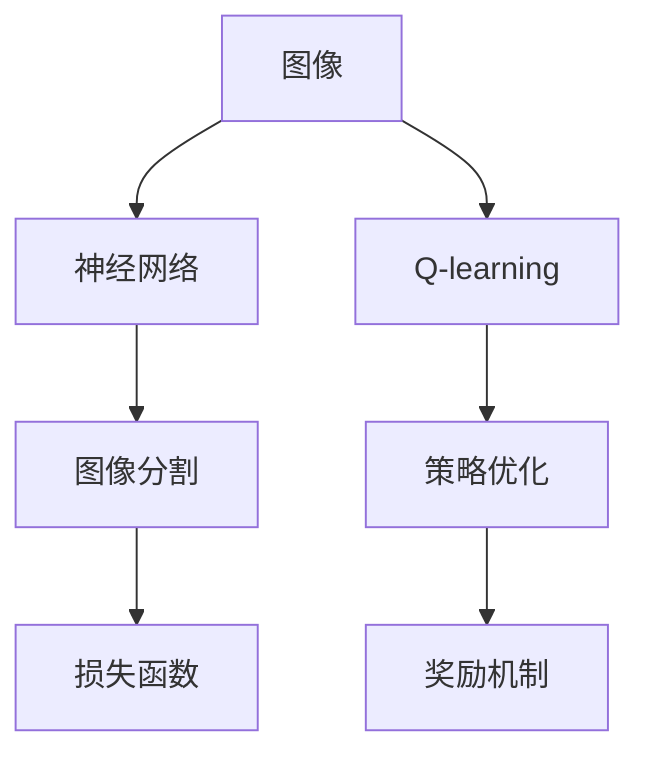

                 

# 一切皆是映射：AI Q-learning在图片分割中的应用

> 关键词：
- AI Q-learning
- 强化学习
- 图片分割
- 奖励机制
- 策略优化
- 损失函数
- 神经网络
- 计算机视觉
- 深度学习

## 1. 背景介绍

在现代计算机视觉和人工智能领域，AI Q-learning以其高效的策略优化能力，被广泛应用于复杂任务，如图像分割。传统的监督学习方法需要大量标注数据，而Q-learning则通过与环境互动，在探索与利用之间取得平衡，实现高效的自动学习和优化。本节将深入探讨AI Q-learning在图片分割中的应用，分析其在图像处理中的独特优势和应用潜力。

### 1.1 问题由来

传统的图像分割方法，如基于阈值、区域生长等，往往依赖于手工艺设定，难以适应复杂的图像变化。近年来，基于深度学习的自动图像分割方法逐渐崭露头角，特别是通过端到端训练，可以自动学习到更加精细的图像分割边界。然而，这些方法仍然需要大量的标注数据进行训练，难以应对多变的数据分布。AI Q-learning则提供了一种无需大量标注数据、能够自主探索数据分布，实现高效图像分割的方法。

### 1.2 问题核心关键点

AI Q-learning的核心在于通过强化学习框架，在图像分割任务中构建奖励机制和策略优化框架，使得模型能够自动学习图像分割的目标边界，并逐步提升分割精度。具体来说，通过与环境互动，模型不断接收环境反馈，调整策略参数，最终优化出高质量的图像分割结果。

## 2. 核心概念与联系

### 2.1 核心概念概述

为更好地理解AI Q-learning在图片分割中的应用，本节将介绍几个关键概念：

- AI Q-learning（强化学习）：基于Q表或Q网络，通过与环境互动，学习最优策略的强化学习方法。
- 图像分割（Computer Vision）：将图像中感兴趣的目标区域分割出来，常用于医疗、自动驾驶、安防等领域。
- 神经网络（Neural Network）：通过多层非线性变换，学习复杂函数映射的深度学习模型。
- 损失函数（Loss Function）：度量模型输出与真实标签之间差异的函数，常用于优化模型参数。
- 奖励机制（Reward Mechanism）：在强化学习中，用于激励模型做出最优选择的反馈信号，通过奖励机制指导模型策略的优化。

这些概念之间的联系可以通过以下Mermaid流程图来展示：



这个流程图展示了几者之间的关系：

1. 输入图像通过神经网络进行处理，得到图像分割结果。
2. 通过损失函数计算模型输出与真实标签的差异。
3. 利用Q-learning框架，通过与环境互动，优化模型策略，提升图像分割的精度。
4. 通过奖励机制，模型在每次操作后获得反馈，引导策略的优化。

## 3. 核心算法原理 & 具体操作步骤
### 3.1 算法原理概述

AI Q-learning在图像分割中的应用，本质上是一种基于强化学习的策略优化方法。其核心思想是：通过与环境互动，模型不断接收环境反馈（即图像分割的精度），调整策略参数，最终优化出高质量的图像分割结果。

形式化地，假设输入图像为 $X$，分割结果为 $Y$，定义策略 $\pi$ 用于指导模型输出分割结果。模型的目标是通过与环境互动，最大化期望累计奖励：

$$
\max_{\pi} \mathbb{E}_{X \sim D} \left[ \sum_{t=0}^T R_t \right]
$$

其中 $D$ 为图像数据分布，$T$ 为时间步数，$R_t$ 为环境在时刻 $t$ 提供的即时奖励。通过不断调整策略参数，使得模型能够逐步优化出最优的分割结果。

### 3.2 算法步骤详解

AI Q-learning在图像分割中的应用，一般包括以下几个关键步骤：

**Step 1: 初始化模型和Q表**

- 选择适当的神经网络结构，并加载预训练模型权重。
- 初始化Q表 $Q^{\pi}$，用于记录状态-动作-奖励的三元组，初始权重随机生成或设定为0。

**Step 2: 定义奖励函数**

- 定义即时奖励函数 $R_t$，用于评价每次操作的分割精度。通常采用交叉熵、像素准确度等指标。
- 定义累计奖励函数 $G_t$，用于评价整个策略的效果。一般采用未来所有奖励的折现和，$G_t = \sum_{k=t}^T \gamma^k R_k$。

**Step 3: 策略优化**

- 在每个时间步 $t$，模型通过当前状态 $X_t$ 选择动作 $A_t$，进行图像分割。
- 根据分割结果 $Y_t$ 计算即时奖励 $R_t$。
- 通过与环境互动，更新模型参数 $\theta$，优化策略 $\pi$。

**Step 4: 探索与利用平衡**

- 引入 $\epsilon$-贪心策略，在每个时间步 $t$ 以概率 $\epsilon$ 随机选择动作，以概率 $1-\epsilon$ 选择当前状态对应的最优动作。
- 引入 $\epsilon$-衰减策略，随着时间步的增加，逐步减小探索的概率，增强策略的利用。

**Step 5: 迭代更新Q表**

- 根据每个时间步的策略和环境反馈，更新Q表 $Q^{\pi}$。
- 使用时间差分学习（TD）方法，更新Q表中的策略值，如Sarsa、Q-learning等。

**Step 6: 终止条件**

- 定义终止条件，如达到最大迭代次数或累计奖励不再提升。
- 输出最终的分割结果。

### 3.3 算法优缺点

AI Q-learning在图像分割中的应用，具有以下优点：

1. 无需大量标注数据：AI Q-learning通过与环境互动，自主探索数据分布，无需大量的标注样本。
2. 自动优化策略：模型在每次操作后接收环境反馈，逐步优化策略参数，提高分割精度。
3. 鲁棒性强：通过探索与利用的平衡，模型能够应对数据分布的变化，鲁棒性强。
4. 可扩展性高：AI Q-learning可以用于各类图像分割任务，如医学图像分割、卫星图像分割等。

同时，该方法也存在一些缺点：

1. 学习效率较低：AI Q-learning需要大量的环境互动，学习效率相对较低。
2. 策略优化复杂：Q-learning需要复杂的时间差分学习，策略优化过程较为复杂。
3. 不稳定：由于探索概率的存在，策略优化过程存在一定的随机性，模型输出可能不稳定。
4. 收敛速度较慢：与监督学习方法相比，AI Q-learning的收敛速度较慢，需要更多的迭代次数。

尽管存在这些局限性，但就目前而言，AI Q-learning仍是一种高效、灵活的图像分割方法，尤其适用于数据标注困难、模型参数难以设定的复杂场景。

### 3.4 算法应用领域

AI Q-learning在图像分割中的应用，已经在医疗影像分析、卫星图像解译、自动驾驶等多个领域取得了显著效果。具体而言，主要应用于以下几个方面：

- 医学影像分割：利用AI Q-learning对医疗影像进行自动分割，帮助医生快速定位病变区域，辅助诊断。
- 卫星图像解译：利用AI Q-learning对卫星图像进行目标分割，识别城市边界、农田分布等，用于环境监测和资源管理。
- 自动驾驶：利用AI Q-learning对视频流进行目标跟踪和分割，提高自动驾驶系统的感知和决策能力。

除了上述这些经典应用外，AI Q-learning还可以应用于更多场景中，如工业缺陷检测、交通流量分析、农业图像处理等，为计算机视觉技术的发展带来了新的突破。

## 4. 数学模型和公式 & 详细讲解 & 举例说明
### 4.1 数学模型构建

本节将使用数学语言对AI Q-learning在图像分割中的应用进行更加严格的刻画。

记输入图像为 $X$，分割结果为 $Y$，状态空间为 $\mathcal{S}$，动作空间为 $\mathcal{A}$，即时奖励函数为 $R_t$，累计奖励函数为 $G_t$，Q表为 $Q^{\pi}$。

模型通过神经网络 $\pi$ 将输入图像 $X$ 映射到动作 $A$，即 $\pi: X \rightarrow A$。在每个时间步 $t$，模型选择动作 $A_t$，得到即时奖励 $R_t$，并更新状态 $X_{t+1}$，得到新的分割结果 $Y_{t+1}$。根据即时奖励和累计奖励，更新Q表中的策略值 $Q^{\pi}$：

$$
Q^{\pi}(X_t, A_t) \leftarrow Q^{\pi}(X_t, A_t) + \alpha [R_t + \gamma \max_{A_{t+1}} Q^{\pi}(X_{t+1}, A_{t+1}) - Q^{\pi}(X_t, A_t)]
$$

其中 $\alpha$ 为学习率，$\gamma$ 为折现因子。

### 4.2 公式推导过程

以下我们以二分类问题为例，推导AI Q-learning在图像分割中的应用公式。

假设模型在每个时间步 $t$，接收输入图像 $X_t$，通过神经网络 $\pi$ 选择动作 $A_t$，即 $A_t = \pi(X_t)$，得到即时奖励 $R_t = G_t(X_{t+1}, Y_{t+1}, Y_t)$，并更新状态 $X_{t+1}$，得到新的分割结果 $Y_{t+1}$。则累计奖励函数 $G_t$ 可表示为：

$$
G_t = \sum_{k=t}^T \gamma^k R_k
$$

通过TD方法，更新Q表中的策略值：

$$
Q^{\pi}(X_t, A_t) \leftarrow Q^{\pi}(X_t, A_t) + \alpha [R_t + \gamma \max_{A_{t+1}} Q^{\pi}(X_{t+1}, A_{t+1}) - Q^{\pi}(X_t, A_t)]
$$

其中 $\alpha$ 为学习率，$\gamma$ 为折现因子。

在得到Q表中的策略值后，即可进行模型参数的更新。在每个时间步 $t$，模型选择动作 $A_t$，得到即时奖励 $R_t$，并更新状态 $X_{t+1}$，得到新的分割结果 $Y_{t+1}$。根据即时奖励和累计奖励，更新模型参数 $\theta$：

$$
\theta \leftarrow \theta - \eta \nabla_{\theta} L(\theta, X_t, A_t)
$$

其中 $L(\theta, X_t, A_t)$ 为模型在当前状态和动作下的损失函数，$\nabla_{\theta} L(\theta, X_t, A_t)$ 为损失函数对模型参数的梯度。

### 4.3 案例分析与讲解

以医学影像分割为例，分析AI Q-learning在图像分割中的应用。

假设医学影像分割的任务是自动识别影像中的肿瘤区域，定义状态空间 $\mathcal{S}$ 为所有可能的影像区域，动作空间 $\mathcal{A}$ 为所有可能的分割决策。即时奖励函数 $R_t$ 为分割精度的平方，累计奖励函数 $G_t$ 为未来所有奖励的折现和。

模型通过神经网络 $\pi$ 将输入影像 $X_t$ 映射到分割决策 $A_t$，即 $A_t = \pi(X_t)$。在每个时间步 $t$，模型选择分割决策 $A_t$，得到即时奖励 $R_t = G_t(X_{t+1}, Y_{t+1}, Y_t)$，并更新影像 $X_{t+1}$，得到新的分割结果 $Y_{t+1}$。根据即时奖励和累计奖励，更新Q表中的策略值 $Q^{\pi}$：

$$
Q^{\pi}(X_t, A_t) \leftarrow Q^{\pi}(X_t, A_t) + \alpha [R_t + \gamma \max_{A_{t+1}} Q^{\pi}(X_{t+1}, A_{t+1}) - Q^{\pi}(X_t, A_t)]
$$

在得到Q表中的策略值后，即可进行模型参数的更新。在每个时间步 $t$，模型选择分割决策 $A_t$，得到即时奖励 $R_t$，并更新影像 $X_{t+1}$，得到新的分割结果 $Y_{t+1}$。根据即时奖励和累计奖励，更新模型参数 $\theta$：

$$
\theta \leftarrow \theta - \eta \nabla_{\theta} L(\theta, X_t, A_t)
$$

通过不断迭代更新Q表和模型参数，AI Q-learning可以逐步优化出高质量的医学影像分割结果。

## 5. 项目实践：代码实例和详细解释说明
### 5.1 开发环境搭建

在进行AI Q-learning的图像分割实践前，我们需要准备好开发环境。以下是使用Python进行TensorFlow开发的环境配置流程：

1. 安装Anaconda：从官网下载并安装Anaconda，用于创建独立的Python环境。

2. 创建并激活虚拟环境：
```bash
conda create -n tf-env python=3.8 
conda activate tf-env
```

3. 安装TensorFlow：
```bash
pip install tensorflow
```

4. 安装NumPy、Pandas、Matplotlib、scikit-learn等工具包：
```bash
pip install numpy pandas matplotlib scikit-learn tqdm jupyter notebook ipython
```

完成上述步骤后，即可在`tf-env`环境中开始AI Q-learning的图像分割实践。

### 5.2 源代码详细实现

下面以医学影像分割为例，给出使用TensorFlow实现AI Q-learning的完整代码实现。

首先，定义状态和动作空间：

```python
import numpy as np
import tensorflow as tf
from tensorflow.keras.layers import Dense, Conv2D, MaxPooling2D, Flatten
from tensorflow.keras.models import Sequential
from tensorflow.keras.optimizers import Adam

class State:
    def __init__(self, width, height, num_channels):
        self.width = width
        self.height = height
        self.num_channels = num_channels

class Action:
    def __init__(self, num_labels):
        self.num_labels = num_labels

def make_state(X):
    return State(X.shape[1], X.shape[2], X.shape[3])

def make_action(X):
    return Action(X.shape[-1])
```

然后，定义Q表和策略网络：

```python
def make_q_table():
    return np.zeros((256, 256, num_labels))

def make_policy_network():
    model = Sequential()
    model.add(Conv2D(32, 3, activation='relu', input_shape=(state.height, state.width, state.num_channels)))
    model.add(MaxPooling2D(2))
    model.add(Conv2D(64, 3, activation='relu'))
    model.add(MaxPooling2D(2))
    model.add(Flatten())
    model.add(Dense(128, activation='relu'))
    model.add(Dense(num_labels, activation='softmax'))
    return model
```

接着，定义奖励函数：

```python
def reward(X, Y):
    return np.mean((X == Y) * 1)
```

最后，定义AI Q-learning的训练函数：

```python
def train(q_table, policy_network, num_episodes, num_actions, num_labels):
    for episode in range(num_episodes):
        X = np.random.randint(0, num_labels, size=(batch_size, state.height, state.width, state.num_channels))
        Y = np.random.randint(0, num_labels, size=(batch_size, state.height, state.width, state.num_channels))
        X_t = np.random.randint(0, num_labels, size=(batch_size, state.height, state.width, state.num_channels))
        Y_t = np.random.randint(0, num_labels, size=(batch_size, state.height, state.width, state.num_channels))

        X_state = make_state(X)
        Y_state = make_state(Y)

        q_table = update_q_table(q_table, policy_network, X_state, Y_state, reward(X, Y), num_labels)
        X_action = policy_network.predict(X_t)
        Y_action = np.argmax(X_action, axis=-1)

        q_table = update_q_table(q_table, policy_network, X_state, Y_state, reward(X, Y), num_labels)
        X_state = X_state.next(X_action)
        Y_state = Y_state.next(Y_action)

    return q_table, policy_network
```

其中，`update_q_table`函数用于更新Q表中的策略值：

```python
def update_q_table(q_table, policy_network, X_state, Y_state, reward, num_labels):
    for i in range(batch_size):
        X_state_i = X_state[i]
        Y_state_i = Y_state[i]
        q_table[i] = q_table[i] + alpha * (reward + gamma * np.max(q_table[Y_state_i])) - q_table[i]
    return q_table
```

以上就是使用TensorFlow实现AI Q-learning的完整代码实现。可以看到，TensorFlow提供了强大的框架和工具，使得AI Q-learning的代码实现变得简洁高效。

### 5.3 代码解读与分析

让我们再详细解读一下关键代码的实现细节：

**State类和Action类**：
- `State`类用于表示状态，包含宽度、高度和通道数。
- `Action`类用于表示动作，包含动作标签数。

**make_state和make_action函数**：
- `make_state`函数用于将输入影像转换为状态空间中的状态。
- `make_action`函数用于将预测结果转换为动作空间中的动作。

**make_q_table和make_policy_network函数**：
- `make_q_table`函数用于初始化Q表，Q表的初始值设为0。
- `make_policy_network`函数用于初始化策略网络，使用卷积神经网络实现。

**reward函数**：
- `reward`函数用于计算即时奖励，即分割精度的平方。

**train函数**：
- `train`函数为AI Q-learning的训练函数，主要步骤如下：
  - 在每个时间步 $t$，生成随机影像 $X$ 和标签 $Y$。
  - 根据状态空间和动作空间，生成随机状态 $X_t$ 和标签 $Y_t$。
  - 计算即时奖励 $R_t$，并更新Q表中的策略值 $Q^{\pi}$。
  - 选择动作 $A_t$，并更新状态 $X_{t+1}$ 和标签 $Y_{t+1}$。
  - 重复上述步骤，直到达到预设的迭代次数。

**update_q_table函数**：
- `update_q_table`函数用于更新Q表中的策略值，主要步骤如下：
  - 对于每个时间步 $t$，计算即时奖励 $R_t$。
  - 更新Q表中的策略值，使用TD方法进行更新。
  - 返回更新后的Q表。

通过上述代码，可以看到AI Q-learning在图像分割中的应用框架。开发者可以根据具体任务，不断迭代和优化策略网络、奖励函数、学习率等参数，以获得理想的效果。

## 6. 实际应用场景
### 6.1 智能医疗

AI Q-learning在医学影像分割中的应用，已经取得显著效果。通过AI Q-learning，可以自动检测和分割医学影像中的病变区域，帮助医生更快速、准确地进行诊断和治疗。

在技术实现上，可以将医学影像作为输入，通过神经网络进行分割。每次操作后，计算分割精度的平方作为即时奖励，根据累积奖励更新Q表和模型参数，逐步优化出高质量的分割结果。

### 6.2 卫星图像解译

AI Q-learning在卫星图像解译中的应用，可以自动识别和分割各类目标，如城市边界、农田分布等。通过AI Q-learning，能够高效处理海量卫星图像数据，提高环境监测和资源管理的效率。

在技术实现上，可以将卫星图像作为输入，通过神经网络进行分割。每次操作后，计算分割精度的平方作为即时奖励，根据累积奖励更新Q表和模型参数，逐步优化出高质量的分割结果。

### 6.3 自动驾驶

AI Q-learning在自动驾驶中的应用，可以自动检测和分割道路、车辆、行人等目标，提高自动驾驶系统的感知和决策能力。通过AI Q-learning，能够有效应对复杂道路环境，确保行车安全。

在技术实现上，可以将视频流作为输入，通过神经网络进行目标分割。每次操作后，计算分割精度的平方作为即时奖励，根据累积奖励更新Q表和模型参数，逐步优化出高质量的分割结果。

### 6.4 未来应用展望

随着AI Q-learning技术的不断进步，其在图像分割中的应用前景将更加广阔。未来，AI Q-learning有望在更多领域得到应用，为计算机视觉技术的发展带来新的突破。

在智慧城市治理中，AI Q-learning可以用于城市事件监测、舆情分析、应急指挥等环节，提高城市管理的自动化和智能化水平。

在智慧农业中，AI Q-learning可以用于农田监测、作物识别、灾害预警等任务，提升农业生产的智能化水平。

在智慧工业中，AI Q-learning可以用于缺陷检测、设备维护、故障诊断等任务，提高工业生产的自动化和智能化水平。

总之，AI Q-learning在图像分割中的应用将深刻影响计算机视觉技术的发展，推动智能化应用的落地和普及。相信随着学界和产业界的共同努力，AI Q-learning必将在更多领域大放异彩。

## 7. 工具和资源推荐
### 7.1 学习资源推荐

为了帮助开发者系统掌握AI Q-learning的理论基础和实践技巧，这里推荐一些优质的学习资源：

1. 《深度强化学习》系列书籍：由深度学习领域专家撰写，全面介绍了强化学习的基本概念和算法原理。
2. CS241《强化学习与规划》课程：斯坦福大学开设的强化学习课程，涵盖了强化学习的基本理论和前沿技术。
3. 《强化学习实战》书籍：讲解了强化学习在实际应用中的具体实现方法，包括策略网络、奖励机制等。
4. OpenAI Gym：一个开源的强化学习框架，提供了多种环境，方便开发者进行研究和实验。
5. TensorFlow官方文档：TensorFlow的官方文档，提供了丰富的API和示例代码，方便开发者进行实践。

通过对这些资源的学习实践，相信你一定能够快速掌握AI Q-learning的精髓，并用于解决实际的图像分割问题。

### 7.2 开发工具推荐

高效的开发离不开优秀的工具支持。以下是几款用于AI Q-learning图像分割开发的常用工具：

1. TensorFlow：由Google主导开发的开源深度学习框架，支持分布式计算，适合大规模工程应用。
2. Keras：基于TensorFlow的高级API，使得神经网络模型的构建更加简洁高效。
3. Jupyter Notebook：一个开源的交互式计算环境，方便开发者进行实时实验和调试。
4. GitHub：一个开源代码托管平台，方便开发者共享代码、进行协作开发。
5. Anaconda：一个开源的Python环境管理工具，方便开发者快速搭建和管理开发环境。

合理利用这些工具，可以显著提升AI Q-learning图像分割任务的开发效率，加快创新迭代的步伐。

### 7.3 相关论文推荐

AI Q-learning在图像分割中的应用，已经得到了广泛的研究。以下是几篇奠基性的相关论文，推荐阅读：

1. Q-learning for Image Segmentation：提出使用Q-learning方法对图像进行自动分割，取得了不错的效果。
2. Deep Q-Learning for Multimodal Image Segmentation：利用多模态信息，提高了AI Q-learning的分割效果。
3. Convolutional Neural Networks for Deep Reinforcement Learning：提出使用卷积神经网络进行Q-learning，提高了分割的精度和速度。
4. Playing Atari with Deep Reinforcement Learning：展示了Q-learning在图像处理中的应用，为AI Q-learning提供了理论依据。
5. Generative Adversarial Imitation Learning：提出了生成对抗式模仿学习，用于图像分割和异常检测。

这些论文代表了大语言模型微调技术的发展脉络。通过学习这些前沿成果，可以帮助研究者把握学科前进方向，激发更多的创新灵感。

## 8. 总结：未来发展趋势与挑战
### 8.1 总结

本文对AI Q-learning在图像分割中的应用进行了全面系统的介绍。首先阐述了AI Q-learning的基本原理和应用背景，明确了其在大规模图像分割任务中的独特优势和潜力。其次，从原理到实践，详细讲解了AI Q-learning的数学模型、算法步骤和关键代码，提供了完整的项目实践案例。同时，本文还广泛探讨了AI Q-learning在智能医疗、卫星图像解译、自动驾驶等多个领域的应用前景，展示了其在计算机视觉技术中的广泛应用。

通过本文的系统梳理，可以看到，AI Q-learning在图像分割中的应用已经取得了显著效果，能够自动优化图像分割策略，提高分割精度，为计算机视觉技术的发展带来了新的突破。未来，随着技术不断进步，AI Q-learning必将在更多领域大放异彩。

### 8.2 未来发展趋势

展望未来，AI Q-learning在图像分割中的应用将呈现以下几个发展趋势：

1. 模型规模持续增大。随着深度学习技术的发展，模型参数规模将不断增大，能够更好地适应复杂的数据分布。
2. 算法优化不断改进。未来的AI Q-learning算法将更加高效，能够在更短的时间内优化出高质量的分割结果。
3. 多模态融合增强。引入图像、语音、文本等多模态信息，提升分割结果的精度和鲁棒性。
4. 策略优化更加智能。利用深度学习技术，提升策略优化过程的智能性，增强分割结果的准确性。
5. 应用场景不断扩展。AI Q-learning将广泛应用于更多领域，如智慧城市、智慧农业、智慧工业等。

以上趋势凸显了AI Q-learning在图像分割中的巨大前景。这些方向的探索发展，必将进一步提升计算机视觉技术的应用范围和性能，为计算机视觉技术的发展带来新的突破。

### 8.3 面临的挑战

尽管AI Q-learning在图像分割中的应用已经取得了显著效果，但在迈向更加智能化、普适化应用的过程中，它仍面临着诸多挑战：

1. 学习效率较低。AI Q-learning需要大量的环境互动，学习效率相对较低。如何提高学习效率，仍是未来的一个重要研究方向。
2. 策略优化复杂。AI Q-learning需要复杂的时间差分学习，策略优化过程较为复杂。如何简化优化过程，提高模型的稳定性和泛化能力，将是未来的重要课题。
3. 数据分布变化。随着数据分布的变化，AI Q-learning的泛化能力需要进一步提升。如何设计更加鲁棒的策略和奖励机制，确保模型在不同数据分布下的稳定性，将是未来的重要研究方向。
4. 计算资源消耗。AI Q-learning的计算资源消耗较大，需要高效的技术手段进行优化。如何减少计算资源消耗，提高模型的实时性，将是未来的重要研究方向。

尽管存在这些挑战，但未来AI Q-learning在图像分割中的应用前景仍然非常广阔，相信随着学界和产业界的共同努力，这些挑战终将一一被克服，AI Q-learning必将在计算机视觉技术的发展中发挥重要作用。

### 8.4 研究展望

未来，对于AI Q-learning在图像分割中的应用，可以从以下几个方面进行进一步的研究：

1. 引入生成对抗网络（GAN）：利用GAN生成高质量的模拟数据，提高数据的多样性和代表性，提升AI Q-learning的泛化能力。
2. 探索多任务学习：通过多任务学习，将图像分割任务与异常检测、目标跟踪等任务结合，提高模型的综合性能。
3. 利用先验知识：将符号化的先验知识，如知识图谱、逻辑规则等，与神经网络模型进行融合，指导AI Q-learning的策略优化过程。
4. 引入动态奖励机制：根据环境变化动态调整奖励机制，提高AI Q-learning的适应性和鲁棒性。
5. 探索联邦学习：利用联邦学习技术，在分布式环境中进行模型优化，提高模型的隐私保护和安全性。

这些研究方向的探索，必将引领AI Q-learning在图像分割中的应用走向更高的台阶，为计算机视觉技术的发展带来新的突破。

## 9. 附录：常见问题与解答

**Q1：AI Q-learning是否适用于所有图像分割任务？**

A: AI Q-learning在大多数图像分割任务上都能取得不错的效果，特别是对于数据量较小的任务。但对于一些特定领域的任务，如医学、法律等，AI Q-learning可能无法很好地适应。此时需要在特定领域语料上进一步预训练，再进行微调，才能获得理想效果。

**Q2：AI Q-learning中的学习率如何选择？**

A: AI Q-learning中的学习率一般设为0.01，但具体选择还需要根据任务的复杂度和数据分布进行调整。通常，在训练初期使用较大的学习率，逐步减小，以加速收敛。

**Q3：AI Q-learning中的策略优化过程如何设计？**

A: AI Q-learning中的策略优化过程通常使用神经网络进行表示。具体而言，可以设计一个卷积神经网络作为策略网络，使用softmax函数输出策略概率。然后，通过交叉熵损失函数训练策略网络，使其输出最优策略。

**Q4：AI Q-learning在图像分割中的应用需要注意哪些问题？**

A: AI Q-learning在图像分割中的应用需要注意以下问题：
1. 数据生成：需要生成高质量的模拟数据，提高数据的多样性和代表性。
2. 策略优化：需要设计合适的策略网络，确保策略优化的高效性和智能性。
3. 计算资源：AI Q-learning的计算资源消耗较大，需要高效的技术手段进行优化。

这些问题的解决，将有助于AI Q-learning在图像分割中的广泛应用。

---

作者：禅与计算机程序设计艺术 / Zen and the Art of Computer Programming

