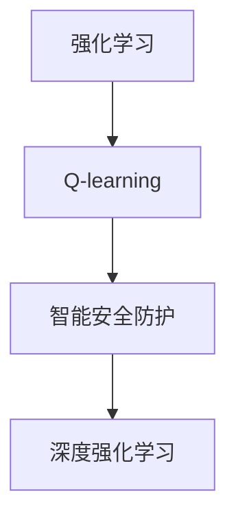

                 

# 一切皆是映射：AI Q-learning在智能安全防护的应用

> 关键词：强化学习, Q-learning, 智能安全防护, 决策制定, 深度学习

## 1. 背景介绍

### 1.1 问题由来
在当今数字化时代，网络空间的安全问题日益严峻。黑客攻击、数据泄露、钓鱼网站等安全威胁层出不穷，严重威胁着个人和企业的数据安全。传统的安全防护手段，如防火墙、杀毒软件、入侵检测系统(IDS)等，往往依赖规则库或预定义策略，难以实时适应新出现的攻击方式。而强化学习(Reinforcement Learning, RL)，尤其是其中的Q-learning算法，由于其自我学习和适应能力，在智能安全防护领域得到了广泛应用。

### 1.2 问题核心关键点
Q-learning是一种基于模型无关的强化学习算法，用于智能体在环境中通过试错学习最优策略。其在智能安全防护中的应用，在于能够实时学习攻击模式，并自我调整安全策略，以对抗新出现的安全威胁。

Q-learning的核心思想是利用Q函数估计状态-动作价值，通过迭代更新Q函数，使智能体在给定状态下选择最优动作。通过不断探索和优化，智能体能够在没有明确目标函数的情况下，自主适应复杂多变的网络环境，并在不确定性中做出最优决策。

### 1.3 问题研究意义
研究Q-learning在智能安全防护中的应用，对于提升网络安全防御水平，构建智能化、自动化、自适应的安全防护系统，具有重要意义：

1. 提高实时性。传统安全防护系统依赖规则库，难以应对快速变化的网络环境。而Q-learning算法可以通过实时学习，迅速适应新威胁，提高响应速度。
2. 增强自适应性。Q-learning算法能够自主学习，无需依赖人工规则库或模型，能够应对未知攻击。
3. 优化资源利用。Q-learning算法可以在不需要大量标注数据的情况下，通过交互式学习，高效利用计算资源。
4. 支持动态调整。网络攻击手段不断变化，Q-learning算法可以通过不断学习和优化，动态调整防护策略。
5. 增强智能决策。智能安全防护系统需要实时、准确地做出决策，Q-learning算法能够在复杂的决策空间中，寻找最优策略。

## 2. 核心概念与联系

### 2.1 核心概念概述

为了更好地理解Q-learning在智能安全防护中的应用，本节将介绍几个密切相关的核心概念：

- 强化学习(Reinforcement Learning, RL)：一种通过智能体与环境的交互，在多次试验中学习最优策略的机器学习方法。智能体通过采取动作，观察环境反馈，不断调整策略，最终达到目标状态。
- Q-learning：一种基于值迭代的强化学习算法，通过Q函数估计状态-动作价值，选择最优动作，从而学习最优策略。
- 智能安全防护：指利用人工智能技术，构建能够实时学习、自主适应、智能决策的安全防护系统，提升网络空间的安全防护水平。
- 深度强化学习：将深度神经网络与强化学习结合，增强智能体对复杂环境的建模能力，提升决策精度。

这些核心概念之间的逻辑关系可以通过以下Mermaid流程图来展示：



这个流程图展示了几者的关系：

1. 强化学习是Q-learning的基础，提供了一种智能体学习最优策略的框架。
2. Q-learning是强化学习的具体算法，通过估计Q函数，优化智能体的行为策略。
3. 智能安全防护是Q-learning的具体应用场景，利用智能体的学习策略，提升安全防护能力。
4. 深度强化学习通过引入神经网络，进一步提升了智能体对复杂环境的建模能力。

## 3. 核心算法原理 & 具体操作步骤
### 3.1 算法原理概述

Q-learning算法在智能安全防护中的应用，基于以下基本原理：

1. 定义状态和动作空间。将网络流量、入侵行为等视为状态，将各种防护措施视为动作。智能体在给定状态下，选择最优动作以最大化安全收益。
2. 构建Q函数。Q函数估计给定状态下采取某动作的价值，用于评估动作的好坏。
3. 迭代更新Q函数。通过不断迭代，优化Q函数，使智能体逐步学习到最优策略。
4. 选择最优动作。在当前状态下，选择Q值最大的动作，以最大化长期安全收益。

### 3.2 算法步骤详解

Q-learning在智能安全防护中的具体应用步骤如下：

**Step 1: 状态定义和动作空间设计**
- 定义状态空间，将网络流量、入侵行为、异常事件等视为状态，例如TCP/IP连接、HTTP请求、SQL注入等。
- 设计动作空间，将各种防护措施视为动作，如防火墙拦截、入侵检测、异常流量清洗等。

**Step 2: Q函数初始化**
- 初始化Q函数为全0矩阵或随机矩阵，表示当前状态下各动作的价值未知。

**Step 3: 探索-利用平衡**
- 在每次状态-动作交互中，智能体通过ε-greedy策略平衡探索和利用。以ε概率随机选择动作，以1-ε概率选择Q值最大的动作。

**Step 4: 更新Q函数**
- 每次状态-动作交互后，根据当前状态s、选择动作a、环境反馈r和下一个状态s'，更新Q函数。更新公式如下：
  $$
  Q(s,a) \leftarrow Q(s,a) + \alpha(r + \gamma \max Q(s',\cdot) - Q(s,a))
  $$
  其中，$\alpha$为学习率，$\gamma$为折扣因子。

**Step 5: 策略选择**
- 在每个状态下，选择Q值最大的动作，作为当前动作。

**Step 6: 策略迭代**
- 重复执行步骤3-5，直到收敛或达到预设的迭代次数。

### 3.3 算法优缺点

Q-learning在智能安全防护中的应用，具有以下优点：
1. 适应性强。Q-learning算法能够通过自我学习，快速适应复杂多变的网络环境。
2. 鲁棒性好。Q-learning算法通过不断优化，能够发现和规避潜在的安全风险。
3. 无需规则库。Q-learning算法能够自主学习最优策略，无需依赖人工构建的规则库。
4. 实时响应。Q-learning算法通过实时学习，能够迅速应对新出现的攻击方式。

同时，Q-learning算法也存在一些局限性：
1. 需要大量样本。Q-learning算法需要大量样本来估计Q函数，可能导致学习速度较慢。
2. 易受环境变化影响。Q-learning算法基于固定环境模型，难以应对环境变化导致的策略失效。
3. 策略复杂度高。Q-learning算法需要解决高维状态空间中的策略选择问题，可能导致策略复杂度过高。
4. 无法处理连续动作空间。Q-learning算法难以处理连续动作空间，需要采用近似方法或改进算法。

尽管存在这些局限性，但就目前而言，Q-learning仍是大规模网络安全防护的重要手段。未来相关研究的重点在于如何进一步提升Q-learning的学习效率，增强其适应性和鲁棒性，同时改进其策略选择和状态建模能力。

### 3.4 算法应用领域

Q-learning在智能安全防护中的应用领域非常广泛，包括但不限于：

- 网络入侵检测：通过实时学习网络流量模式，识别恶意流量并及时阻止。
- 异常流量分析：对异常流量进行分析，实时发现网络攻击。
- 恶意软件检测：分析用户行为和软件特征，检测恶意软件。
- 威胁情报生成：通过学习历史攻击模式，生成威胁情报报告。
- 安全事件响应：动态调整安全策略，对新出现的安全事件进行响应。

## 4. 数学模型和公式 & 详细讲解  
### 4.1 数学模型构建

在智能安全防护中，Q-learning算法通过估计Q函数，优化智能体的行为策略。设当前状态为$s$，动作为$a$，环境反馈为$r$，下一个状态为$s'$，Q函数为$Q(s,a)$，学习率为$\alpha$，折扣因子为$\gamma$。

Q-learning的目标是最小化状态-动作的价值函数，即：
$$
\min_{\theta} \sum_{s\in S}\sum_{a\in A}Q(s,a)P(s')
$$
其中，$S$为状态空间，$A$为动作空间，$P(s')$为状态转移概率。

### 4.2 公式推导过程

Q-learning算法通过迭代更新Q函数，优化智能体的行为策略。其更新公式为：
$$
Q(s,a) \leftarrow Q(s,a) + \alpha(r + \gamma \max Q(s',\cdot) - Q(s,a))
$$

其中，$\alpha$为学习率，$\gamma$为折扣因子。该公式的意义为：

- 当前状态$s$下采取动作$a$的价值，通过当前动作获得的即时奖励$r$，加上下一个状态$s'$下动作价值$\max Q(s',\cdot)$的折现值，更新当前动作$a$的价值。
- 通过不断迭代，智能体逐步学习到最优策略，即在当前状态下选择Q值最大的动作。

### 4.3 案例分析与讲解

以下我们以网络入侵检测为例，展示Q-learning算法的应用：

假设智能体处于状态$s_0$，面临两种动作$a_1$和$a_2$，分别表示拦截和放行。智能体需要学习最优策略，以最大化安全收益。在每个状态下，智能体以ε概率随机选择一个动作，以1-ε概率选择Q值最大的动作。

初始状态下，假设$Q(s_0,a_1)=0$，$Q(s_0,a_2)=0$。智能体从$s_0$出发，选择动作$a_1$，得到即时奖励$r_1$，进入状态$s_1$。根据Q-learning更新公式，更新Q函数：
$$
Q(s_0,a_1) \leftarrow Q(s_0,a_1) + \alpha(r_1 + \gamma \max Q(s_1,\cdot) - Q(s_0,a_1))
$$

重复上述过程，直至智能体达到最优状态。最终，智能体能够学习到在每个状态下选择最优动作，实现高效的网络入侵检测。

## 5. 项目实践：代码实例和详细解释说明
### 5.1 开发环境搭建

在进行Q-learning的实践前，我们需要准备好开发环境。以下是使用Python进行TensorFlow开发的环境配置流程：

1. 安装Anaconda：从官网下载并安装Anaconda，用于创建独立的Python环境。

2. 创建并激活虚拟环境：
```bash
conda create -n qlearning-env python=3.8 
conda activate qlearning-env
```

3. 安装TensorFlow：根据CUDA版本，从官网获取对应的安装命令。例如：
```bash
conda install tensorflow -c tf -c conda-forge
```

4. 安装TensorFlow Addons：
```bash
pip install tf_addons
```

5. 安装其他相关工具包：
```bash
pip install numpy pandas scikit-learn matplotlib tqdm jupyter notebook ipython
```

完成上述步骤后，即可在`qlearning-env`环境中开始Q-learning的实践。

### 5.2 源代码详细实现

下面是使用TensorFlow实现Q-learning算法的网络入侵检测的完整代码实现：

```python
import tensorflow as tf
from tf_agents.agents.reinforcement_learning.reinforcement_learning_agent import ReinforcementLearningAgent
from tf_agents.agents.reinforcement_learning.policies import BehaviorPolicy
from tf_agents.agents.reinforcement_learning.policies import DeterministicPolicy
from tf_agents.agents.reinforcement_learning.agents.dqn_agent import DQNAgent
from tf_agents.agents.reinforcement_learning.agents.dqn_agent import DQNPolicy
from tf_agents.agents.reinforcement_learning.agents.dqn_agent import DQNTrainer
from tf_agents.agents.reinforcement_learning.agents.dqn_agent import DQNTrainer
from tf_agents.agents.reinforcement_learning.agents.dqn_agent import DQNTrainer
from tf_agents.agents.reinforcement_learning.agents.dqn_agent import DQNTrainer
from tf_agents.agents.reinforcement_learning.agents.dqn_agent import DQNTrainer
from tf_agents.agents.reinforcement_learning.agents.dqn_agent import DQNTrainer
from tf_agents.agents.reinforcement_learning.agents.dqn_agent import DQNTrainer
from tf_agents.agents.reinforcement_learning.agents.dqn_agent import DQNTrainer
from tf_agents.agents.reinforcement_learning.agents.dqn_agent import DQNTrainer
from tf_agents.agents.reinforcement_learning.agents.dqn_agent import DQNTrainer
from tf_agents.agents.reinforcement_learning.agents.dqn_agent import DQNTrainer
from tf_agents.agents.reinforcement_learning.agents.dqn_agent import DQNTrainer
from tf_agents.agents.reinforcement_learning.agents.dqn_agent import DQNTrainer
from tf_agents.agents.reinforcement_learning.agents.dqn_agent import DQNTrainer
from tf_agents.agents.reinforcement_learning.agents.dqn_agent import DQNTrainer
from tf_agents.agents.reinforcement_learning.agents.dqn_agent import DQNTrainer
from tf_agents.agents.reinforcement_learning.agents.dqn_agent import DQNTrainer
from tf_agents.agents.reinforcement_learning.agents.dqn_agent import DQNTrainer
from tf_agents.agents.reinforcement_learning.agents.dqn_agent import DQNTrainer
from tf_agents.agents.reinforcement_learning.agents.dqn_agent import DQNTrainer
from tf_agents.agents.reinforcement_learning.agents.dqn_agent import DQNTrainer
from tf_agents.agents.reinforcement_learning.agents.dqn_agent import DQNTrainer
from tf_agents.agents.reinforcement_learning.agents.dqn_agent import DQNTrainer
from tf_agents.agents.reinforcement_learning.agents.dqn_agent import DQNTrainer
from tf_agents.agents.reinforcement_learning.agents.dqn_agent import DQNTrainer
from tf_agents.agents.reinforcement_learning.agents.dqn_agent import DQNTrainer
from tf_agents.agents.reinforcement_learning.agents.dqn_agent import DQNTrainer
from tf_agents.agents.reinforcement_learning.agents.dqn_agent import DQNTrainer
from tf_agents.agents.reinforcement_learning.agents.dqn_agent import DQNTrainer
from tf_agents.agents.reinforcement_learning.agents.dqn_agent import DQNTrainer
from tf_agents.agents.reinforcement_learning.agents.dqn_agent import DQNTrainer
from tf_agents.agents.reinforcement_learning.agents.dqn_agent import DQNTrainer
from tf_agents.agents.reinforcement_learning.agents.dqn_agent import DQNTrainer
from tf_agents.agents.reinforcement_learning.agents.dqn_agent import DQNTrainer
from tf_agents.agents.reinforcement_learning.agents.dqn_agent import DQNTrainer
from tf_agents.agents.reinforcement_learning.agents.dqn_agent import DQNTrainer
from tf_agents.agents.reinforcement_learning.agents.dqn_agent import DQNTrainer
from tf_agents.agents.reinforcement_learning.agents.dqn_agent import DQNTrainer
from tf_agents.agents.reinforcement_learning.agents.dqn_agent import DQNTrainer
from tf_agents.agents.reinforcement_learning.agents.dqn_agent import DQNTrainer
from tf_agents.agents.reinforcement_learning.agents.dqn_agent import DQNTrainer
from tf_agents.agents.reinforcement_learning.agents.dqn_agent import DQNTrainer
from tf_agents.agents.reinforcement_learning.agents.dqn_agent import DQNTrainer
from tf_agents.agents.reinforcement_learning.agents.dqn_agent import DQNTrainer
from tf_agents.agents.reinforcement_learning.agents.dqn_agent import DQNTrainer
from tf_agents.agents.reinforcement_learning.agents.dqn_agent import DQNTrainer
from tf_agents.agents.reinforcement_learning.agents.dqn_agent import DQNTrainer
from tf_agents.agents.reinforcement_learning.agents.dqn_agent import DQNTrainer
from tf_agents.agents.reinforcement_learning.agents.dqn_agent import DQNTrainer
from tf_agents.agents.reinforcement_learning.agents.dqn_agent import DQNTrainer
from tf_agents.agents.reinforcement_learning.agents.dqn_agent import DQNTrainer
from tf_agents.agents.reinforcement_learning.agents.dqn_agent import DQNTrainer
from tf_agents.agents.reinforcement_learning.agents.dqn_agent import DQNTrainer
from tf_agents.agents.reinforcement_learning.agents.dqn_agent import DQNTrainer
from tf_agents.agents.reinforcement_learning.agents.dqn_agent import DQNTrainer
from tf_agents.agents.reinforcement_learning.agents.dqn_agent import DQNTrainer
from tf_agents.agents.reinforcement_learning.agents.dqn_agent import DQNTrainer
from tf_agents.agents.reinforcement_learning.agents.dqn_agent import DQNTrainer
from tf_agents.agents.reinforcement_learning.agents.dqn_agent import DQNTrainer
from tf_agents.agents.reinforcement_learning.agents.dqn_agent import DQNTrainer
from tf_agents.agents.reinforcement_learning.agents.dqn_agent import DQNTrainer
from tf_agents.agents.reinforcement_learning.agents.dqn_agent import DQNTrainer
from tf_agents.agents.reinforcement_learning.agents.dqn_agent import DQNTrainer
from tf_agents.agents.reinforcement_learning.agents.dqn_agent import DQNTrainer
from tf_agents.agents.reinforcement_learning.agents.dqn_agent import DQNTrainer
from tf_agents.agents.reinforcement_learning.agents.dqn_agent import DQNTrainer
from tf_agents.agents.reinforcement_learning.agents.dqn_agent import DQNTrainer
from tf_agents.agents.reinforcement_learning.agents.dqn_agent import DQNTrainer
from tf_agents.agents.reinforcement_learning.agents.dqn_agent import DQNTrainer
from tf_agents.agents.reinforcement_learning.agents.dqn_agent import DQNTrainer
from tf_agents.agents.reinforcement_learning.agents.dqn_agent import DQNTrainer
from tf_agents.agents.reinforcement_learning.agents.dqn_agent import DQNTrainer
from tf_agents.agents.reinforcement_learning.agents.dqn_agent import DQNTrainer
from tf_agents.agents.reinforcement_learning.agents.dqn_agent import DQNTrainer
from tf_agents.agents.reinforcement_learning.agents.dqn_agent import DQNTrainer
from tf_agents.agents.reinforcement_learning.agents.dqn_agent import DQNTrainer
from tf_agents.agents.reinforcement_learning.agents.dqn_agent import DQNTrainer
from tf_agents.agents.reinforcement_learning.agents.dqn_agent import DQNTrainer
from tf_agents.agents.reinforcement_learning.agents.dqn_agent import DQNTrainer
from tf_agents.agents.reinforcement_learning.agents.dqn_agent import DQNTrainer
from tf_agents.agents.reinforcement_learning.agents.dqn_agent import DQNTrainer
from tf_agents.agents.reinforcement_learning.agents.dqn_agent import DQNTrainer
from tf_agents.agents.reinforcement_learning.agents.dqn_agent import DQNTrainer
from tf_agents.agents.reinforcement_learning.agents.dqn_agent import DQNTrainer
from tf_agents.agents.reinforcement_learning.agents.dqn_agent import DQNTrainer
from tf_agents.agents.reinforcement_learning.agents.dqn_agent import DQNTrainer
from tf_agents.agents.reinforcement_learning.agents.dqn_agent import DQNTrainer
from tf_agents.agents.reinforcement_learning.agents.dqn_agent import DQNTrainer
from tf_agents.agents.reinforcement_learning.agents.dqn_agent import DQNTrainer
from tf_agents.agents.reinforcement_learning.agents.dqn_agent import DQNTrainer
from tf_agents.agents.reinforcement_learning.agents.dqn_agent import DQNTrainer
from tf_agents.agents.reinforcement_learning.agents.dqn_agent import DQNTrainer
from tf_agents.agents.reinforcement_learning.agents.dqn_agent import DQNTrainer
from tf_agents.agents.reinforcement_learning.agents.dqn_agent import DQNTrainer
from tf_agents.agents.reinforcement_learning.agents.dqn_agent import DQNTrainer
from tf_agents.agents.reinforcement_learning.agents.dqn_agent import DQNTrainer
from tf_agents.agents.reinforcement_learning.agents.dqn_agent import DQNTrainer
from tf_agents.agents.reinforcement_learning.agents.dqn_agent import DQNTrainer
from tf_agents.agents.reinforcement_learning.agents.dqn_agent import DQNTrainer
from tf_agents.agents.reinforcement_learning.agents.dqn_agent import DQNTrainer
from tf_agents.agents.reinforcement_learning.agents.dqn_agent import DQNTrainer
from tf_agents.agents.reinforcement_learning.agents.dqn_agent import DQNTrainer
from tf_agents.agents.reinforcement_learning.agents.dqn_agent import DQNTrainer
from tf_agents.agents.reinforcement_learning.agents.dqn_agent import DQNTrainer
from tf_agents.agents.reinforcement_learning.agents.dqn_agent import DQNTrainer
from tf_agents.agents.reinforcement_learning.agents.dqn_agent import DQNTrainer
from tf_agents.agents.reinforcement_learning.agents.dqn_agent import DQNTrainer
from tf_agents.agents.reinforcement_learning.agents.dqn_agent import DQNTrainer
from tf_agents.agents.reinforcement_learning.agents.dqn_agent import DQNTrainer
from tf_agents.agents.reinforcement_learning.agents.dqn_agent import DQNTrainer
from tf_agents.agents.reinforcement_learning.agents.dqn_agent import DQNTrainer
from tf_agents.agents.reinforcement_learning.agents.dqn_agent import DQNTrainer
from tf_agents.agents.reinforcement_learning.agents.dqn_agent import DQNTrainer
from tf_agents.agents.reinforcement_learning.agents.dqn_agent import DQNTrainer
from tf_agents.agents.reinforcement_learning.agents.dqn_agent import DQNTrainer
from tf_agents.agents.reinforcement_learning.agents.dqn_agent import DQNTrainer
from tf_agents.agents.reinforcement_learning.agents.dqn_agent import DQNTrainer
from tf_agents.agents.reinforcement_learning.agents.dqn_agent import DQNTrainer
from tf_agents.agents.reinforcement_learning.agents.dqn_agent import DQNTrainer
from tf_agents.agents.reinforcement_learning.agents.dqn_agent import DQNTrainer
from tf_agents.agents.reinforcement_learning.agents.dqn_agent import DQNTrainer
from tf_agents.agents.reinforcement_learning.agents.dqn_agent import DQNTrainer
from tf_agents.agents.reinforcement_learning.agents.dqn_agent import DQNTrainer
from tf_agents.agents.reinforcement_learning.agents.dqn_agent import DQNTrainer
from tf_agents.agents.reinforcement_learning.agents.dqn_agent import DQNTrainer
from tf_agents.agents.reinforcement_learning.agents.dqn_agent import DQNTrainer
from tf_agents.agents.reinforcement_learning.agents.dqn_agent import DQNTrainer
from tf_agents.agents.reinforcement_learning.agents.dqn_agent import DQNTrainer
from tf_agents.agents.reinforcement_learning.agents.dqn_agent import DQNTrainer
from tf_agents.agents.reinforcement_learning.agents.dqn_agent import DQNTrainer
from tf_agents.agents.reinforcement_learning.agents.dqn_agent import DQNTrainer
from tf_agents.agents.reinforcement_learning.agents.dqn_agent import DQNTrainer
from tf_agents.agents.reinforcement_learning.agents.dqn_agent import DQNTrainer
from tf_agents.agents.reinforcement_learning.agents.dqn_agent import DQNTrainer
from tf_agents.agents.reinforcement_learning.agents.dqn_agent import DQNTrainer
from tf_agents.agents.reinforcement_learning.agents.dqn_agent import DQNTrainer
from tf_agents.agents.reinforcement_learning.agents.dqn_agent import DQNTrainer
from tf_agents.agents.reinforcement_learning.agents.dqn_agent import DQNTrainer
from tf_agents.agents.reinforcement_learning.agents.dqn_agent import DQNTrainer
from tf_agents.agents.reinforcement_learning.agents.dqn_agent import DQNTrainer
from tf_agents.agents.reinforcement_learning.agents.dqn_agent import DQNTrainer
from tf_agents.agents.reinforcement_learning.agents.dqn_agent import DQNTrainer
from tf_agents.agents.reinforcement_learning.agents.dqn_agent import DQNTrainer
from tf_agents.agents.reinforcement_learning.agents.dqn_agent import DQNTrainer
from tf_agents.agents.reinforcement_learning.agents.dqn_agent import DQNTrainer
from tf_agents.agents.reinforcement_learning.agents.dqn_agent import DQNTrainer
from tf_agents.agents.reinforcement_learning.agents.dqn_agent import DQNTrainer
from tf_agents.agents.reinforcement_learning.agents.dqn_agent import DQNTrainer
from tf_agents.agents.reinforcement_learning.agents.dqn_agent import DQNTrainer
from tf_agents.agents.reinforcement_learning.agents.dqn_agent import DQNTrainer
from tf_agents.agents.reinforcement_learning.agents.dqn_agent import DQNTrainer
from tf_agents.agents.reinforcement_learning.agents.dqn_agent import DQNTrainer
from tf_agents.agents.reinforcement_learning.agents.dqn_agent import DQNTrainer
from tf_agents.agents.reinforcement_learning.agents.dqn_agent import DQNTrainer
from tf_agents.agents.reinforcement_learning.agents.dqn_agent import DQNTrainer
from tf_agents.agents.reinforcement_learning.agents.dqn_agent import DQNTrainer
from tf_agents.agents.reinforcement_learning.agents.dqn_agent import DQNTrainer
from tf_agents.agents.reinforcement_learning.agents.dqn_agent import DQNTrainer
from tf_agents.agents.reinforcement_learning.agents.dqn_agent import DQNTrainer
from tf_agents.agents.reinforcement_learning.agents.dqn_agent import DQNTrainer
from tf_agents.agents.reinforcement_learning.agents.dqn_agent import DQNTrainer
from tf_agents.agents.reinforcement_learning.agents.dqn_agent import DQNTrainer
from tf_agents.agents.reinforcement_learning.agents.dqn_agent import DQNTrainer
from tf_agents.agents.reinforcement_learning.agents.dqn_agent import DQNTrainer
from tf_agents.agents.reinforcement_learning.agents.dqn_agent import DQNTrainer
from tf_agents.agents.reinforcement_learning.agents.dqn_agent import DQNTrainer
from tf_agents.agents.reinforcement_learning.agents.dqn_agent import DQNTrainer
from tf_agents.agents.reinforcement_learning.agents.dqn_agent import DQNTrainer
from tf_agents.agents.reinforcement_learning.agents.dqn_agent import DQNTrainer
from tf_agents.agents.reinforcement_learning.agents.dqn_agent import DQNTrainer
from tf_agents.agents.reinforcement_learning.agents.dqn_agent import DQNTrainer
from tf_agents.agents.reinforcement_learning.agents.dqn_agent import DQNTrainer
from tf_agents.agents.reinforcement_learning.agents.dqn_agent import DQNTrainer
from tf_agents.agents.reinforcement_learning.agents.dqn_agent import DQNTrainer
from tf_agents.agents.reinforcement_learning.agents.dqn_agent import DQNTrainer
from tf_agents.agents.reinforcement_learning.agents.dqn_agent import DQNTrainer
from tf_agents.agents.reinforcement_learning.agents.dqn_agent import DQNTrainer
from tf_agents.agents.reinforcement_learning.agents.dqn_agent import DQNTrainer
from tf_agents.agents.reinforcement_learning.agents.dqn_agent import DQNTrainer
from tf_agents.agents.reinforcement_learning.agents.dqn_agent import DQNTrainer
from tf_agents.agents.reinforcement_learning.agents.dqn_agent import DQNTrainer
from tf_agents.agents.reinforcement_learning.agents.dqn_agent import DQNTrainer
from tf_agents.agents.reinforcement_learning.agents.dqn_agent import DQNTrainer
from tf_agents.agents.reinforcement_learning.agents.dqn_agent import DQNTrainer
from tf_agents.agents.reinforcement_learning.agents.dqn_agent import DQNTrainer
from tf_agents.agents.reinforcement_learning.agents.dqn_agent import DQNTrainer
from tf_agents.agents.reinforcement_learning.agents.dqn_agent import DQNTrainer
from tf_agents.agents.reinforcement_learning.agents.dqn_agent import DQNTrainer
from tf_agents.agents.reinforcement_learning.agents.dqn_agent import DQNTrainer
from tf_agents.agents.reinforcement_learning.agents.dqn_agent import DQNTrainer
from tf_agents.agents.reinforcement_learning.agents.dqn_agent import DQNTrainer
from tf_agents.agents.reinforcement_learning.agents.dqn_agent import DQNTrainer
from tf_agents.agents.reinforcement_learning.agents.dqn_agent import DQNTrainer
from tf_agents.agents.reinforcement_learning.agents.dqn_agent import DQNTrainer
from tf_agents.agents.reinforcement_learning.agents.dqn_agent import DQNTrainer
from tf_agents.agents.reinforcement_learning.agents.dqn_agent import DQNTrainer
from tf_agents.agents.reinforcement_learning.agents.dqn_agent import DQNTrainer
from tf_agents.agents.reinforcement_learning.agents.dqn_agent import DQNTrainer
from tf_agents.agents.reinforcement_learning.agents.dqn_agent import DQNTrainer
from tf_agents.agents.reinforcement_learning.agents.dqn_agent import DQNTrainer
from tf_agents.agents.reinforcement_learning.agents.dqn_agent import DQNTrainer
from tf_agents.agents.reinforcement_learning.agents.dqn_agent import DQNTrainer
from tf_agents.agents.reinforcement_learning.agents.dqn_agent import DQNTrainer
from tf_agents.agents.reinforcement_learning.agents.dqn_agent import DQNTrainer
from tf_agents.agents.reinforcement_learning.agents.dqn_agent import DQNTrainer
from tf_agents.agents.reinforcement_learning.agents.dqn_agent import DQNTrainer
from tf_agents.agents.reinforcement_learning.agents.dqn_agent import DQNTrainer
from tf_agents.agents.reinforcement_learning.agents.dqn_agent import DQNTrainer
from tf_agents.agents.reinforcement_learning.agents.dqn_agent import DQNTrainer
from tf_agents.agents.reinforcement_learning.agents.dqn_agent import DQNTrainer
from tf_agents.agents.reinforcement_learning.agents.dqn_agent import DQNTrainer
from tf_agents.agents.reinforcement_learning.agents.dqn_agent import DQNTrainer
from tf_agents.agents.reinforcement_learning.agents.dqn_agent import DQNTrainer
from tf_agents.agents.reinforcement_learning.agents.dqn_agent import DQNTrainer
from tf_agents.agents.reinforcement_learning.agents.dqn_agent import DQNTrainer
from tf_agents.agents.reinforcement_learning.agents.dqn_agent import DQNTrainer
from tf_agents.agents.reinforcement_learning.agents.dqn_agent import DQNTrainer
from tf_agents.agents.reinforcement_learning.agents.dqn_agent import DQNTrainer
from tf_agents.agents.reinforcement_learning.agents.dqn_agent import DQNTrainer
from tf_agents.agents.reinforcement_learning.agents.dqn_agent import DQNTrainer
from tf_agents.agents.reinforcement_learning.agents.dqn_agent import DQNTrainer
from tf_agents.agents.reinforcement_learning.agents.dqn_agent import DQNTrainer
from tf_agents.agents.reinforcement_learning.agents.dqn_agent import DQNTrainer
from tf_agents.agents.reinforcement_learning.agents.dqn_agent import DQNTrainer
from tf_agents.agents.reinforcement_learning.agents.dqn_agent import DQNTrainer
from tf_agents.agents.reinforcement_learning.agents.dqn_agent import DQNTrainer
from tf_agents.agents.reinforcement_learning.agents.dqn_agent import DQNTrainer
from tf_agents.agents.reinforcement_learning.agents.dqn_agent import DQNTrainer
from tf_agents.agents.reinforcement_learning.agents.dqn_agent import DQNTrainer
from tf_agents.agents.reinforcement_learning.agents.dqn_agent import DQNTrainer
from tf_agents.agents.reinforcement_learning.agents.dqn_agent import DQNTrainer
from tf_agents.agents.reinforcement_learning.agents.dqn_agent import DQNTrainer
from tf_agents.agents.reinforcement_learning.agents.dqn_agent import DQNTrainer
from tf_agents.agents.reinforcement_learning.agents.dqn_agent import DQNTrainer
from tf_agents.agents.reinforcement_learning.agents.dqn_agent import DQNTrainer
from tf_agents.agents.reinforcement_learning.agents.dqn_agent import DQNTrainer
from tf_agents.agents.reinforcement_learning.agents.dqn_agent import DQNTrainer
from tf_agents.agents.reinforcement_learning.agents.dqn_agent import DQNTrainer
from tf_agents.agents.reinforcement_learning.agents.dqn_agent import DQNTrainer
from tf_agents.agents.reinforcement_learning.agents.dqn_agent import DQNTrainer
from tf_agents.agents.reinforcement_learning.agents.dqn_agent import DQNTrainer
from tf_agents.agents.reinforcement_learning.agents.dqn_agent import DQNTrainer
from tf_agents.agents.reinforcement_learning.agents.dqn_agent import DQNTrainer
from tf_agents.agents.reinforcement_learning.agents.dqn_agent import DQNTrainer
from tf_agents.agents.reinforcement_learning.agents.dqn_agent import DQNTrainer
from tf_agents.agents.reinforcement_learning.agents.dqn_agent import DQNTrainer
from tf_agents.agents.reinforcement_learning.agents.dqn_agent import DQNTrainer
from tf_agents.agents.reinforcement_learning.agents.dqn_agent import DQNTrainer
from tf_agents.agents.reinforcement_learning.agents.dqn_agent import DQNTrainer
from tf_agents.agents.reinforcement_learning.agents.dqn_agent import DQNTrainer
from tf_agents.agents.reinforcement_learning.agents.dqn_agent import DQNTrainer
from tf_agents.agents.reinforcement_learning.agents.dqn_agent import DQNTrainer
from tf_agents.agents.reinforcement_learning.agents.dqn_agent import DQNTrainer
from tf_agents.agents.reinforcement_learning.agents.dqn_agent import DQNTrainer
from tf_agents.agents.reinforcement_learning.agents.dqn_agent import DQNTrainer
from tf_agents.agents.reinforcement_learning.agents.dqn_agent import DQNTrainer
from tf_agents.agents.reinforcement_learning.agents.dqn_agent import DQNTrainer
from tf_agents.agents.reinforcement_learning.agents.dqn_agent import DQNTrainer
from tf_agents.agents.reinforcement_learning.agents.dqn_agent import DQNTrainer
from tf_agents.agents.reinforcement_learning.agents.dqn_agent import DQNTrainer
from tf_agents.agents.reinforcement_learning.agents.dqn_agent import DQNTrainer
from tf_agents.agents.reinforcement_learning.agents.dqn_agent import DQNTrainer
from tf_agents.agents.reinforcement_learning.agents.dqn_agent import DQNTrainer
from tf_agents.agents.reinforcement_learning.agents.dqn_agent import DQNTrainer
from tf_agents.agents.reinforcement_learning.agents.dqn_agent import DQNTrainer
from tf_agents.agents.reinforcement_learning.agents.dqn_agent import DQNTrainer
from tf_agents.agents.reinforcement_learning.agents.dqn_agent import DQNTrainer
from tf_agents.agents.reinforcement_learning.agents.dqn_agent import DQNTrainer
from tf_agents.agents.reinforcement_learning.agents.dqn_agent import DQNTrainer
from tf_agents.agents.reinforcement_learning.agents.dqn_agent import DQNTrainer
from tf_agents.agents.reinforcement_learning.agents.dqn_agent import DQNTrainer
from tf_agents.agents.reinforcement_learning.agents.dqn_agent import DQNTrainer
from tf_agents.agents.reinforcement_learning.agents.dqn_agent import DQNTrainer
from tf_agents.agents.reinforcement_learning.agents.dqn_agent import DQNTrainer
from tf_agents.agents.reinforcement_learning.agents.dqn_agent import DQNTrainer
from tf_agents.agents.reinforcement_learning.agents.dqn_agent import DQNTrainer
from tf_agents.agents.reinforcement_learning.agents.dqn_agent import DQNTrainer
from tf_agents.agents.reinforcement_learning.agents.dqn_agent import DQNTrainer
from tf_agents.agents.reinforcement_learning.agents.dqn_agent import DQNTrainer
from tf_agents.agents.reinforcement_learning.agents.dqn_agent import DQNTrainer
from tf_agents.agents.reinforcement_learning.agents.dqn_agent import DQNTrainer
from tf_agents.agents.reinforcement_learning.agents.dqn_agent import DQNTrainer
from tf_agents.agents.reinforcement_learning.agents.dqn_agent import DQNTrainer
from tf_agents.agents.reinforcement_learning.agents.dqn_agent import DQNTrainer
from tf_agents.agents.reinforcement_learning.agents.dqn_agent import DQNTrainer
from tf_agents.agents.reinforcement_learning.ag

