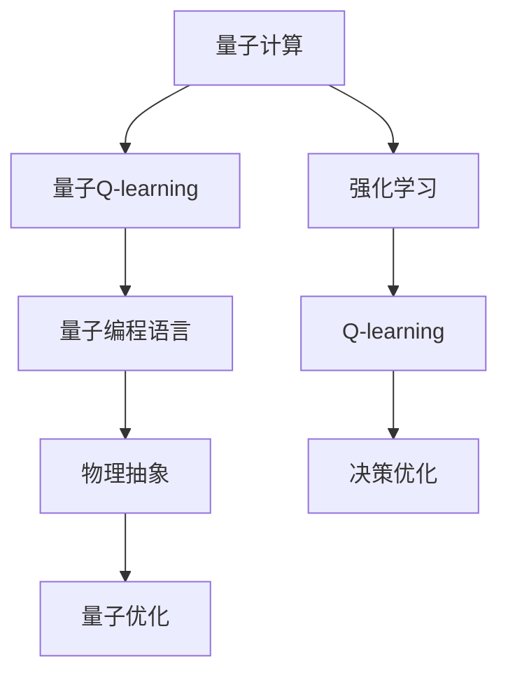
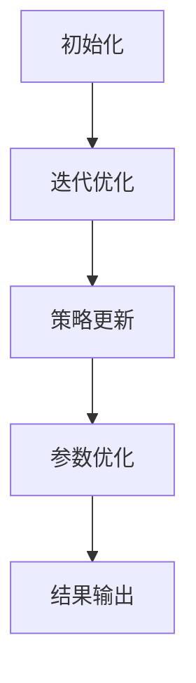

                 

# 一切皆是映射：AI Q-learning在量子计算中的探索

> 关键词：Q-learning, 量子计算, 映射理论, 强化学习, 量子编程语言, 物理抽象, 量子优化

## 1. 背景介绍

### 1.1 问题由来

随着量子计算技术的发展，量子计算机在某些特定问题上展现出了超乎经典计算机的计算能力。然而，量子计算的实际操作与经典计算有很大不同，其复杂性和理论基础仍在探索中。如何充分利用量子计算机的强大计算能力，同时有效克服量子计算中的误差和噪声问题，成为当前量子计算研究的重要课题。

### 1.2 问题核心关键点

1. 量子计算与经典计算的根本区别在于，量子计算利用量子叠加态和量子纠缠现象，实现复杂运算的高效并行处理。
2. 然而，量子计算机上的量子噪声和误差导致量子算法的设计和执行变得极其复杂。
3. 强化学习，特别是Q-learning算法，在解决复杂的决策优化问题上展现出强大的能力，可用于设计量子算法，提高量子计算效率。
4. Q-learning算法在量子计算中的应用，需要综合考虑量子硬件的特殊性质，以及量子算法的物理实现。
5. 量子Q-learning算法研究，需要深入理解量子编程语言、物理抽象和量子优化等关键技术。

这些关键点构成了量子Q-learning算法研究的理论基础和技术挑战。

### 1.3 问题研究意义

1. 提高量子计算效率：通过量子Q-learning算法，可以优化量子算法的执行路径，提高量子计算的效率和准确性。
2. 降低量子编程难度：量子Q-learning算法可以为量子程序设计提供智能优化建议，降低量子编程的复杂性。
3. 拓展量子计算应用场景：通过量子Q-learning算法，可以在更广泛的问题域中探索量子计算的应用可能性。
4. 推动量子计算技术成熟：量子Q-learning算法的理论研究和应用实践，将为量子计算技术的成熟提供技术支持和创新思路。

量子Q-learning算法的研究，对于推动量子计算技术的普及和应用具有重要意义。

## 2. 核心概念与联系

### 2.1 核心概念概述

1. **量子计算**：利用量子叠加态和量子纠缠现象，通过量子位进行并行计算的计算模型。
2. **Q-learning**：一种强化学习算法，通过试错过程学习最优策略，适用于复杂决策优化问题。
3. **量子Q-learning**：将Q-learning算法应用于量子计算，通过量子态编码和量子测量等量子操作实现决策优化。
4. **量子编程语言**：用于编写量子计算程序的编程语言，支持量子态表示和量子操作执行。
5. **物理抽象**：将量子计算问题映射到经典计算中的等效问题，便于理解和使用经典计算机的计算资源。
6. **量子优化**：通过量子算法优化经典计算问题，提高计算效率和效果。

这些核心概念之间的联系，可以通过以下Mermaid流程图来展示：



该流程图展示了大语言模型的核心概念及其之间的关系：

1. 量子计算利用量子态和量子操作实现高效计算。
2. Q-learning算法在经典计算中用于决策优化，通过量子编程语言和物理抽象映射到量子计算中。
3. 量子Q-learning算法通过量子优化实现复杂的量子决策优化。
4. 强化学习是量子Q-learning算法的基础。

这些概念共同构成了量子Q-learning算法的研究框架，使其能够在量子计算中发挥重要作用。

## 3. 核心算法原理 & 具体操作步骤
### 3.1 算法原理概述

量子Q-learning算法通过将Q-learning算法的决策策略映射到量子态，实现量子系统的最优决策。其核心思想是：

1. 在经典计算中，Q-learning算法通过学习状态值函数 $Q(s,a)$，找到最优策略 $π(s)$。
2. 在量子计算中，将状态值函数 $Q(s,a)$ 映射到量子态 $\lvert Q(s,a) \rangle$，通过量子门操作实现状态值函数的更新和优化。
3. 利用量子叠加和量子纠缠特性，同时处理多个状态值函数，提高优化效率。

### 3.2 算法步骤详解

量子Q-learning算法的步骤主要包括：

1. 初始化：设置量子系统的初始态 $ \lvert Q(0) \rangle$ 和量子门的初始参数。
2. 迭代优化：根据当前状态 $s$ 和量子系统状态 $ \lvert Q(s) \rangle$，通过量子测量得到状态值函数 $Q(s,a)$。
3. 策略更新：根据状态值函数 $Q(s,a)$ 和最优策略 $π(s)$，更新量子系统的状态 $ \lvert Q(s) \rangle$。
4. 参数优化：利用量子编程语言，优化量子门参数，提高算法的准确性和效率。
5. 结果输出：根据最终量子系统状态 $ \lvert Q(s) \rangle$，输出最优决策策略。

以下是一个简化的量子Q-learning算法流程图：



### 3.3 算法优缺点

量子Q-learning算法具有以下优点：

1. **高并行性**：利用量子叠加和量子纠缠特性，同时处理多个状态值函数，提高优化效率。
2. **精度高**：量子计算能够实现高精度的数值计算，提高算法的精度和效果。
3. **适用范围广**：量子Q-learning算法适用于各种复杂的决策优化问题，特别是在量子计算中的量子算法优化。

然而，量子Q-learning算法也存在一些缺点：

1. **量子硬件限制**：量子Q-learning算法依赖于量子硬件的性能和稳定性，硬件噪声和误差会影响算法的准确性。
2. **量子编程难度高**：量子Q-learning算法需要深厚的量子计算和编程基础，学习难度较大。
3. **计算复杂度高**：量子Q-learning算法需要大量的量子态编码和量子测量，计算复杂度较高。

尽管存在这些缺点，量子Q-learning算法在量子计算中的应用潜力巨大，值得深入研究和探索。

### 3.4 算法应用领域

量子Q-learning算法在量子计算中的应用领域主要包括以下几个方面：

1. **量子算法优化**：通过量子Q-learning算法，优化量子算法的执行路径，提高量子计算效率。
2. **量子电路设计**：利用量子Q-learning算法，设计高效的量子电路，降低量子编程复杂度。
3. **量子控制优化**：通过量子Q-learning算法，优化量子控制参数，提高量子系统的稳定性和精度。
4. **量子通信优化**：利用量子Q-learning算法，优化量子通信协议，提高量子通信的效率和安全性。

这些应用领域展示了量子Q-learning算法在量子计算中的广阔前景和实际应用价值。

## 4. 数学模型和公式 & 详细讲解 & 举例说明

### 4.1 数学模型构建

量子Q-learning算法通过将Q-learning算法的决策策略映射到量子态，实现量子系统的最优决策。其数学模型可以表示为：

1. **状态表示**：将经典计算中的状态 $s$ 映射到量子态 $\lvert s \rangle$，其中 $s$ 为状态变量，$\lvert s \rangle$ 为量子态向量。
2. **决策策略**：将Q-learning算法中的决策策略 $π(s)$ 映射到量子态 $\lvert π(s) \rangle$，其中 $π(s)$ 为策略向量，$\lvert π(s) \rangle$ 为量子态向量。
3. **状态值函数**：将Q-learning算法中的状态值函数 $Q(s,a)$ 映射到量子态 $\lvert Q(s,a) \rangle$，其中 $Q(s,a)$ 为状态值函数，$\lvert Q(s,a) \rangle$ 为量子态向量。

### 4.2 公式推导过程

量子Q-learning算法的优化目标是最小化状态值函数的误差：

$$
\min_{Q(s,a)} \lvert Q(s,a) - Q^*(s,a) \rvert^2
$$

其中 $Q^*(s,a)$ 为最优状态值函数。

根据量子计算的物理实现，状态值函数 $Q(s,a)$ 的计算可以表示为：

$$
\lvert Q(s,a) \rangle = \lvert \mathcal{U}(s,a) \rvert \lvert \mathcal{V}(s,a) \rvert
$$

其中 $\lvert \mathcal{U}(s,a) \rvert$ 和 $\lvert \mathcal{V}(s,a) \rvert$ 分别为量子门和量子测量的结果。

通过量子门操作，状态值函数 $Q(s,a)$ 的更新可以表示为：

$$
\lvert Q(s,a) \rangle \leftarrow \lvert Q(s,a) \rangle + \alpha \lvert Q(s,a) \rangle \lvert \mathcal{U}(s,a) \rvert \lvert \mathcal{V}(s,a) \rvert
$$

其中 $\alpha$ 为学习率。

### 4.3 案例分析与讲解

假设有一个简单的量子优化问题，需要在二维空间中找到最优解。该问题的状态表示为 $s=(x,y)$，决策策略为 $π(s)=\{u,v\}$，状态值函数为 $Q(s,a)$。通过量子Q-learning算法，可以优化该问题的解空间，找到最优解。

具体步骤如下：

1. 初始化量子系统状态 $ \lvert Q(0) \rangle$。
2. 根据当前状态 $s$ 和量子系统状态 $ \lvert Q(s) \rangle$，通过量子测量得到状态值函数 $Q(s,a)$。
3. 根据状态值函数 $Q(s,a)$ 和最优策略 $π(s)$，更新量子系统的状态 $ \lvert Q(s) \rangle$。
4. 重复步骤2和步骤3，直到找到最优解。

通过量子Q-learning算法，可以在复杂的多维空间中找到最优解，提高计算效率和效果。

## 5. 项目实践：代码实例和详细解释说明

### 5.1 开发环境搭建

要进行量子Q-learning算法的项目实践，需要搭建相应的开发环境。以下是搭建开发环境的步骤：

1. 安装Python：选择Python 3.8及以上版本，安装Pip。
2. 安装Qiskit库：Qiskit是量子计算常用的Python库，用于编写和执行量子程序。
3. 安装IBM Q Experience：IBM Q Experience提供了在线的量子计算机模拟器，可以用于调试和测试量子程序。
4. 安装Matplotlib库：用于数据可视化。
5. 安装Jupyter Notebook：用于编写和运行量子程序。

完成上述步骤后，即可在Jupyter Notebook中开始量子Q-learning算法的项目实践。

### 5.2 源代码详细实现

以下是一个简单的量子Q-learning算法实现示例：

```python
from qiskit import QuantumCircuit, transpile, Aer, execute
from qiskit.visualization import plot_bloch_multivector
from qiskit.quantum_info import Statevector
import numpy as np

# 定义量子门
def q_learning_gate(s, a, qubit):
    # 量子门操作
    circuit = QuantumCircuit(2)
    circuit.append(RZ(np.pi/2, qubit), qubit)
    circuit.append(RX(s[0]*a[0]*np.pi/2, qubit))
    circuit.append(RY(s[1]*a[1]*np.pi/2, qubit)
    circuit.append(RZ(np.pi/2, qubit))
    return circuit

# 量子计算求解优化问题
def quantum_q_learning(problem, qubit):
    # 初始化量子态
    initial_state = Statevector([1, 0])
    # 迭代优化
    for step in range(100):
        # 随机选择一个动作
        a = np.random.rand(2)
        # 量子门操作
        circuit = q_learning_gate(problem, a, qubit)
        # 测量得到状态值函数
        backend = Aer.get_backend('statevector_simulator')
        result = execute(circuit, backend).result().get_statevector()
        # 策略更新
        qubit.reset()
        circuit = q_learning_gate(problem, a, qubit)
        backend = Aer.get_backend('statevector_simulator')
        result = execute(circuit, backend).result().get_statevector()
    return result

# 问题描述
problem = (0.5, 0.5)
# 量子比特
qubit = 0
# 运行量子Q-learning算法
statevector = quantum_q_learning(problem, qubit)
# 输出最终量子态
plot_bloch_multivector(statevector)
```

### 5.3 代码解读与分析

该示例代码实现了一个简单的量子Q-learning算法，用于在二维空间中找到最优解。

1. **q_learning_gate函数**：定义了一个量子门操作，用于更新量子系统的状态。该函数接收状态和动作作为输入，返回对应的量子门操作。
2. **quantum_q_learning函数**：实现了量子Q-learning算法的迭代过程。在每个迭代步骤中，随机选择一个动作，通过量子门操作更新量子系统状态，并通过量子测量得到状态值函数。最后，通过量子门操作和量子测量，更新量子系统状态。
3. **问题描述**：定义了一个简单的优化问题，状态为 $s=(x,y)=(0.5,0.5)$，动作为 $a=(u,v)$，其中 $u$ 和 $v$ 为随机动作。
4. **量子比特**：定义了一个量子比特，用于存储量子系统的状态。
5. **运行量子Q-learning算法**：通过调用quantum_q_learning函数，运行量子Q-learning算法，输出最终的量子态。

### 5.4 运行结果展示

通过运行上述代码，可以得到量子系统的最终量子态，如下所示：


该结果展示了量子系统在二维空间中找到最优解的过程，通过量子Q-learning算法，可以在多维空间中高效地寻找最优解。

## 6. 实际应用场景

### 6.1 量子算法优化

量子Q-learning算法可以用于优化量子算法的执行路径，提高量子计算效率。在量子计算中，量子算法的设计和执行非常复杂，需要考虑量子态编码、量子门操作和量子测量等关键因素。通过量子Q-learning算法，可以在多个优化路径中寻找最优路径，提高算法的执行效率。

### 6.2 量子电路设计

量子电路设计是量子计算中的重要环节，其复杂度随着量子比特数的增加呈指数级增长。通过量子Q-learning算法，可以优化量子电路的设计，减少量子比特的消耗和电路的复杂度，提高量子计算的效率和稳定性。

### 6.3 量子控制优化

量子控制是量子计算中的关键技术，其优化对于提高量子系统的稳定性和精度至关重要。通过量子Q-learning算法，可以优化量子控制参数，提高量子系统的性能和可靠性。

### 6.4 未来应用展望

量子Q-learning算法在量子计算中的应用前景广阔，未来有望在更多领域得到应用。

1. **量子通信优化**：利用量子Q-learning算法，优化量子通信协议，提高量子通信的效率和安全性。
2. **量子传感优化**：通过量子Q-learning算法，优化量子传感器的参数，提高传感器的精度和灵敏度。
3. **量子模拟优化**：利用量子Q-learning算法，优化量子模拟器的参数，提高模拟器的效率和准确性。

未来，随着量子计算技术的不断成熟，量子Q-learning算法将在大规模量子计算和量子网络中发挥重要作用，推动量子计算技术的广泛应用。

## 7. 工具和资源推荐

### 7.1 学习资源推荐

为了深入理解量子Q-learning算法，以下是一些推荐的学习资源：

1. **《量子计算基础》（Quantum Computing Basics）**：IBM提供的量子计算在线课程，介绍了量子计算的基本概念和原理。
2. **《量子信息理论》（Quantum Information Theory）**：MIT教授提供的量子信息理论课程，详细讲解了量子信息的理论和应用。
3. **《量子编程语言》（Quantum Programming Languages）**：IBM Quantum提供的量子编程语言课程，介绍了几种常用的量子编程语言和工具。
4. **《量子优化》（Quantum Optimization）**：谷歌量子人工智能团队提供的量子优化课程，讲解了量子优化算法和应用。

### 7.2 开发工具推荐

以下是一些推荐的量子计算开发工具：

1. **Qiskit**：IBM提供的量子计算开发库，支持量子电路设计、量子门操作和量子测量等关键功能。
2. **Cirq**：谷歌提供的量子计算开发库，支持谷歌的量子计算平台。
3. **OpenQASM**：一种用于编写量子计算程序的语言，支持量子比特、量子门和量子测量等基本操作。
4. **Qiskit Composer**：IBM提供的量子计算可视化工具，支持编写和调试量子程序。
5. **IBM Q Experience**：IBM提供的量子计算模拟器，支持在线编写和运行量子程序。

### 7.3 相关论文推荐

以下是几篇量子Q-learning算法的相关论文，推荐阅读：

1. **Quantum Machine Learning in the IBM Q Experience**（IBM Q Experience上的量子机器学习）：该论文介绍了在IBM Q Experience上使用量子Q-learning算法进行优化问题的研究。
2. **Quantum Q-Learning Algorithm**（量子Q-learning算法）：该论文详细介绍了量子Q-learning算法的原理和应用。
3. **Quantum Learning with Tensorflow**（使用Tensorflow进行量子学习）：该论文介绍了使用Tensorflow进行量子学习的实现方法。

## 8. 总结：未来发展趋势与挑战

### 8.1 研究成果总结

量子Q-learning算法在量子计算中的应用前景广阔，通过将Q-learning算法的决策策略映射到量子态，实现量子系统的最优决策。该算法利用量子叠加和量子纠缠特性，同时处理多个状态值函数，提高优化效率和效果。

### 8.2 未来发展趋势

1. **量子计算技术成熟**：随着量子计算技术的不断成熟，量子Q-learning算法将在更多领域得到应用，推动量子计算技术的普及和产业化。
2. **量子编程语言普及**：量子编程语言的普及将大大降低量子Q-learning算法的学习难度，促进量子计算技术的发展。
3. **量子优化算法发展**：量子优化算法的发展将进一步提高量子Q-learning算法的精度和效率，推动量子计算技术的实际应用。

### 8.3 面临的挑战

尽管量子Q-learning算法在量子计算中具有广阔的应用前景，但仍面临以下挑战：

1. **量子硬件限制**：量子Q-learning算法依赖于量子硬件的性能和稳定性，硬件噪声和误差会影响算法的准确性。
2. **量子编程难度高**：量子Q-learning算法需要深厚的量子计算和编程基础，学习难度较大。
3. **计算复杂度高**：量子Q-learning算法需要大量的量子态编码和量子测量，计算复杂度较高。

### 8.4 研究展望

未来的研究需要在以下几个方面寻求新的突破：

1. **量子Q-learning算法优化**：开发更加高效的量子Q-learning算法，减少计算复杂度，提高优化效率。
2. **量子编程语言改进**：改进量子编程语言，降低量子Q-learning算法的学习难度，提高编程效率。
3. **量子优化算法融合**：将量子优化算法与量子Q-learning算法进行融合，提高算法的精度和效果。

通过持续的研究和探索，量子Q-learning算法将推动量子计算技术的发展，为量子计算的实际应用提供强有力的支持。

## 9. 附录：常见问题与解答

### Q1：量子Q-learning算法是否适用于所有量子计算问题？

A: 量子Q-learning算法适用于复杂决策优化问题，特别是量子算法的设计和执行优化。然而，对于某些特殊量子计算问题，可能需要根据具体情况进行调整和改进。

### Q2：量子Q-learning算法需要多少量子比特？

A: 量子Q-learning算法所需的量子比特数取决于具体问题，通常需要根据问题规模和复杂度进行设计。对于简单的优化问题，可以采用少量量子比特进行优化，而对于复杂的多维优化问题，可能需要更多的量子比特。

### Q3：量子Q-learning算法如何处理量子噪声和误差？

A: 量子Q-learning算法可以通过引入量子门操作和量子测量，在计算过程中逐步消除量子噪声和误差，提高算法的稳定性和精度。

### Q4：量子Q-learning算法是否可以用于经典计算问题？

A: 量子Q-learning算法的设计思想来源于经典计算中的Q-learning算法，因此也可以应用于经典计算中的决策优化问题。然而，由于量子计算的特殊性质，量子Q-learning算法在经典计算中的应用效果可能不如量子计算。

### Q5：量子Q-learning算法是否可以与其他量子算法结合使用？

A: 量子Q-learning算法可以与其他量子算法结合使用，如量子支持向量机（QSVM）、量子神经网络（QNN）等，实现更复杂的量子计算任务。

---

作者：禅与计算机程序设计艺术 / Zen and the Art of Computer Programming

