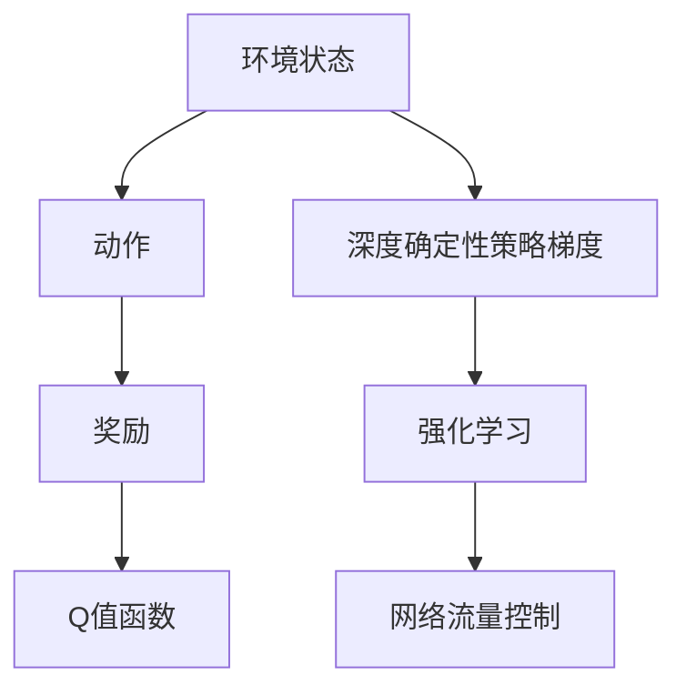
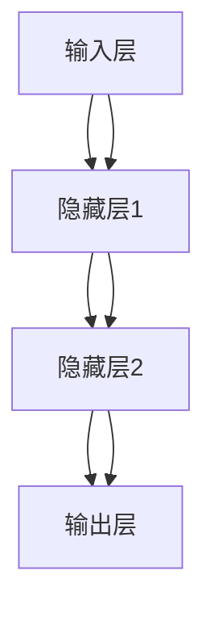

                 

## 1. 背景介绍

### 1.1 问题由来

在计算机网络中，网络流量控制是保证网络效率、提升用户体验的重要手段。传统的网络流量控制方法多采用静态的规则设定，无法适应动态的网络环境变化。例如，当网络负载增加时，现有规则无法及时调整，导致网络拥塞、延迟增加，严重影响用户的使用体验。

近年来，随着深度学习技术的发展，利用机器学习方法进行自适应流量控制成为研究热点。特别是强化学习(Reinforcement Learning, RL)方法的引入，使得网络流量控制变得更加灵活、智能。其中，深度确定性策略梯度（Deep Q-Network, DQN）因其高效的学习能力和较好的稳定性，成为了网络流量控制领域的重要工具。

### 1.2 问题核心关键点

DQN在网络流量控制中的应用，主要体现在以下几个方面：

1. **环境建模**：如何将网络流量控制场景建模为强化学习环境。
2. **策略优化**：如何利用DQN算法优化网络流量控制策略。
3. **效果评估**：如何对DQN控制下的网络流量进行有效评估。
4. **应用扩展**：DQN如何在实际网络环境中进行部署和优化。

### 1.3 问题研究意义

DQN在网络流量控制中的应用，对于提升网络系统的智能化水平，优化资源分配，减少延迟和丢包，提高用户体验具有重要意义：

1. **提升网络效率**：通过自适应调整，动态优化网络资源分配，避免网络拥塞。
2. **优化用户体验**：实时调整流量控制策略，减少网络延迟和丢包，提升用户访问速度和稳定性。
3. **降低运营成本**：减少人工干预，自动调节网络流量，降低人力和维护成本。
4. **增强鲁棒性**：适应网络环境的动态变化，提高系统的鲁棒性和稳定性。
5. **推动创新应用**：为网络流量控制、边缘计算、智能设备等领域提供新的技术思路。

## 2. 核心概念与联系

### 2.1 核心概念概述

为更好地理解DQN在自适应网络流量控制中的应用，本节将介绍几个密切相关的核心概念：

- **深度确定性策略梯度(DQN)**：一种基于神经网络的强化学习算法，通过Q-learning的方法，利用深度神经网络近似Q值函数，实现高效学习和决策优化。
- **强化学习(Reinforcement Learning, RL)**：一种通过试错学习的方式，使智能体在环境中进行决策优化，最终达到目标的机器学习方法。
- **环境状态(Sate)**：网络流量控制系统中，状态描述当前的网络流量、连接数、带宽利用率等信息。
- **动作(Action)**：控制策略，如增加带宽、调整路由等。
- **奖励(Reward)**：网络系统中的性能指标，如响应时间、吞吐量等。
- **Q值函数(Q-value function)**：表示在给定状态下，采取某动作后的预期奖励的估计值。

这些核心概念之间的逻辑关系可以通过以下Mermaid流程图来展示：



这个流程图展示了大语言模型的核心概念及其之间的关系：

1. 环境状态描述当前网络流量控制场景。
2. 动作表示网络系统的控制策略。
3. 奖励根据网络性能指标进行评估。
4. Q值函数表示在特定状态和动作下，未来奖励的估计值。
5. DQN算法通过强化学习机制，优化网络流量控制策略。

## 3. 核心算法原理 & 具体操作步骤
### 3.1 算法原理概述

DQN在自适应网络流量控制中的应用，主要基于Q-learning算法。其核心思想是：通过模拟网络环境，智能体在网络状态变化时采取动作，并根据网络性能得到奖励。Q值函数$Q(s,a)$表示在状态$s$下采取动作$a$的预期总奖励。

DQN通过深度神经网络逼近Q值函数，采用经验回放、目标网络更新等技术，实现高效的决策优化。具体而言，DQN算法包括以下几个关键步骤：

1. **环境建模**：将网络流量控制场景建模为强化学习环境，定义状态、动作、奖励等要素。
2. **策略训练**：利用DQN算法训练网络流量控制策略，优化Q值函数。
3. **动作执行**：根据优化后的策略，执行网络流量控制动作。
4. **奖励评估**：根据动作执行结果，评估网络性能，更新Q值函数。

### 3.2 算法步骤详解

以下是DQN在自适应网络流量控制中的详细步骤：

**Step 1: 环境建模**

在网络流量控制中，环境可以建模为连续的状态空间$S$，如网络流量、带宽利用率等。动作空间$A$可以表示为$[a_1,a_2,...,a_n]$，如增加带宽、调整路由等。奖励$R$可以定义为$[0,1]$之间的连续值，如网络延迟时间、吞吐量等。

定义状态$s$和动作$a$之间的映射关系$f: S \times A \rightarrow S'$，其中$S'$为下一状态。根据实际网络环境，可以设计多个状态特征，如当前的网络流量、平均延迟、空闲带宽等。

**Step 2: 策略训练**

在训练过程中，首先需要建立一个深度神经网络作为Q值函数逼近器。该神经网络具有若干隐藏层，每个隐藏层有若干神经元。初始时，网络参数随机初始化。

在每个时间步$t$，智能体根据当前状态$s_t$采取动作$a_t$，获得奖励$r_t$，并观察到下一状态$s_{t+1}$。网络输入为当前状态$s_t$，输出为$Q(s_t,a_t)$。

根据Q值函数的更新公式，计算$Q(s_t,a_t)$的更新值：

$$
Q(s_t,a_t) \leftarrow Q(s_t,a_t) + \eta [r_t + \gamma \max_{a'} Q(s_{t+1},a') - Q(s_t,a_t)]
$$

其中$\eta$为学习率，$\gamma$为折扣因子。该公式表示在当前状态下，采取动作$a_t$的Q值更新，目标为使该Q值最大化。

**Step 3: 动作执行**

在网络流量控制中，智能体根据优化后的Q值函数，在每个时间步选择动作$a_t$，执行相应的控制策略。例如，增加带宽、调整路由等。

**Step 4: 奖励评估**

根据动作执行结果，评估网络性能，计算奖励$r_t$。例如，通过延迟时间、吞吐量等指标评估网络性能。

根据评估结果，更新Q值函数，并返回当前状态$s_t$。

**Step 5: 经验回放**

为了减少过度拟合，DQN引入了经验回放机制。将历史状态、动作、奖励等存储到经验池中，随机抽取样本进行训练。

**Step 6: 目标网络更新**

为了避免Q值函数参数更新的震荡，DQN引入了目标网络机制。将Q值函数分为目标网络$Q^-$和当前网络$Q$，目标网络参数固定，当前网络参数不断更新。每经过若干时间步后，将目标网络参数复制为当前网络参数。

通过上述步骤，DQN在自适应网络流量控制中不断优化Q值函数，调整网络流量控制策略，提高网络性能。

### 3.3 算法优缺点

DQN在自适应网络流量控制中的应用具有以下优点：

1. **动态适应性**：DQN算法能够实时调整网络控制策略，适应动态的网络环境变化。
2. **高效性**：通过深度神经网络逼近Q值函数，实现高效的决策优化。
3. **鲁棒性**：DQN算法具有较好的鲁棒性，能够处理多种网络控制任务。
4. **可扩展性**：DQN算法可以扩展到复杂的网络环境中，适应多模态数据处理。

同时，该算法也存在一些局限性：

1. **参数调整复杂**：DQN算法需要调整的参数较多，如学习率、折扣因子、神经网络结构等。
2. **过拟合风险**：经验回放和目标网络更新等技术，可能在训练初期导致参数更新不稳定，引发过拟合风险。
3. **模型复杂度高**：深度神经网络结构复杂，需要较大的计算资源和存储空间。
4. **数据需求大**：DQN算法需要大量的训练数据，以便获得更准确的Q值函数估计。

尽管存在这些局限性，但DQN算法在网络流量控制中的应用仍然具有显著的优势，为自适应网络控制提供了新的思路和工具。

### 3.4 算法应用领域

DQN在自适应网络流量控制中的应用广泛，可以应用于以下领域：

- **数据中心流量控制**：通过优化网络带宽分配，提升数据中心的计算效率和网络吞吐量。
- **边缘计算流量控制**：通过优化边缘设备的带宽和计算资源，提升边缘计算的响应速度和稳定性。
- **智能路由控制**：通过优化路由策略，提高网络路由效率，减少网络延迟和丢包。
- **网络拥塞控制**：通过优化网络资源分配，避免网络拥塞，提升用户体验。
- **动态网络管理**：通过优化网络流量控制策略，实现网络的自适应管理。

除了上述这些经典应用外，DQN还可以在网络安全、流量预测、负载均衡等领域得到应用，为网络系统带来新的突破。

## 4. 数学模型和公式 & 详细讲解  
### 4.1 数学模型构建

在网络流量控制中，DQN算法的核心是Q值函数的建模和优化。记网络状态空间为$S$，动作空间为$A$，奖励函数为$R(s,a)$。定义Q值函数$Q(s,a)$为在状态$s$下采取动作$a$的预期总奖励。

Q值函数的更新公式为：

$$
Q(s_t,a_t) \leftarrow Q(s_t,a_t) + \eta [r_t + \gamma \max_{a'} Q(s_{t+1},a') - Q(s_t,a_t)]
$$

其中，$\eta$为学习率，$\gamma$为折扣因子。

在实际应用中，为了处理连续状态和动作空间，通常使用深度神经网络逼近Q值函数。网络输入为当前状态$s_t$，输出为$Q(s_t,a_t)$。网络结构如图：



其中，输入层为网络状态$s_t$，隐藏层用于逼近Q值函数，输出层输出$Q(s_t,a_t)$。

### 4.2 公式推导过程

以下是DQN在网络流量控制中Q值函数更新公式的详细推导过程：

设当前状态为$s_t$，动作为$a_t$，奖励为$r_t$，下一状态为$s_{t+1}$。根据强化学习的目标，优化$Q(s_t,a_t)$，使其最大化。

根据Q值函数的定义，$Q(s_t,a_t)$为在状态$s_t$下采取动作$a_t$的预期总奖励。即：

$$
Q(s_t,a_t) = \mathbb{E}[R_{t+1} + \gamma Q(s_{t+1},a_{t+1}) | s_t, a_t]
$$

其中，$R_{t+1}$为下一步的奖励，$\gamma$为折扣因子。

根据最大期望化公式，$Q(s_t,a_t)$可以改写为：

$$
Q(s_t,a_t) = \max_{a'} Q(s_{t+1},a')
$$

将$Q(s_{t+1},a')$代入$Q(s_t,a_t)$的表达式中，得：

$$
Q(s_t,a_t) = \max_{a'} (r_t + \gamma Q(s_{t+1},a'))
$$

为了优化$Q(s_t,a_t)$，需要计算$Q(s_t,a_t)$的梯度，并根据梯度方向更新网络参数。根据梯度下降算法，优化目标为：

$$
\arg\min_{\theta} \mathcal{L}(\theta) = \frac{1}{N}\sum_{i=1}^N [Q(s_t,a_t) - r_t - \gamma \max_{a'} Q(s_{t+1},a')]
$$

其中，$\mathcal{L}(\theta)$为损失函数，$\theta$为网络参数。

根据上述推导，DQN在自适应网络流量控制中的Q值函数更新公式为：

$$
Q(s_t,a_t) \leftarrow Q(s_t,a_t) + \eta [r_t + \gamma \max_{a'} Q(s_{t+1},a') - Q(s_t,a_t)]
$$

## 5. 项目实践：代码实例和详细解释说明
### 5.1 开发环境搭建

在进行DQN实践前，我们需要准备好开发环境。以下是使用Python进行TensorFlow开发的环境配置流程：

1. 安装Anaconda：从官网下载并安装Anaconda，用于创建独立的Python环境。

2. 创建并激活虚拟环境：
```bash
conda create -n tf-env python=3.8 
conda activate tf-env
```

3. 安装TensorFlow：根据CUDA版本，从官网获取对应的安装命令。例如：
```bash
conda install tensorflow==2.7 
```

4. 安装相关库：
```bash
pip install gym numpy pydot sklearn matplotlib
```

完成上述步骤后，即可在`tf-env`环境中开始DQN实践。

### 5.2 源代码详细实现

下面我们以DQN在网络流量控制中的应用为例，给出使用TensorFlow实现DQN的Python代码实现。

首先，定义网络流量控制环境：

```python
import gym
import tensorflow as tf

class TrafficControlEnv(gym.Env):
    def __init__(self, bandwidth, packets):
        self.bandwidth = bandwidth
        self.packets = packets
        self.state = (0, 0)
        self.reward = 0
        self.done = False
    
    def step(self, action):
        if action == 0:
            self.state = (self.state[0] - 1, self.state[1] - 1)
            self.reward = -1
        elif action == 1:
            self.state = (self.state[0] + 1, self.state[1] + 1)
            self.reward = -1
        elif action == 2:
            self.state = (self.state[0], self.state[1] + 1)
            self.reward = -1
        else:
            self.state = (self.state[0] - 1, self.state[1])
            self.reward = -1
        
        done = self.state[0] == 0 and self.state[1] == 0
        
        return self.state, self.reward, done, {}
    
    def reset(self):
        self.state = (self.bandwidth, self.packets)
        self.reward = 0
        self.done = False
        return self.state, self.reward, self.done, {}
    
    def render(self):
        pass
```

然后，定义DQN模型的神经网络：

```python
class DQN(tf.keras.Model):
    def __init__(self, state_dim, action_dim):
        super(DQN, self).__init__()
        self.fc1 = tf.keras.layers.Dense(64, activation='relu', input_shape=(state_dim,))
        self.fc2 = tf.keras.layers.Dense(64, activation='relu')
        self.fc3 = tf.keras.layers.Dense(action_dim, activation='linear')
    
    def call(self, inputs):
        x = self.fc1(inputs)
        x = self.fc2(x)
        return self.fc3(x)
```

接着，定义DQN算法的核心函数：

```python
def dqn(env, max_episodes=100, batch_size=32, epsilon=0.1, learning_rate=0.01, discount_factor=0.9, target_update_freq=100):
    state_dim = env.observation_space.shape[0]
    action_dim = env.action_space.n
    
    model = DQN(state_dim, action_dim)
    target_model = DQN(state_dim, action_dim)
    target_model.set_weights(model.get_weights())
    
    optimizer = tf.keras.optimizers.Adam(learning_rate=learning_rate)
    memory = []
    
    for episode in range(max_episodes):
        state = env.reset()
        done = False
        total_reward = 0
        
        while not done:
            action = select_action(state, model, epsilon)
            next_state, reward, done, _ = env.step(action)
            total_reward += reward
            
            if len(memory) == batch_size:
                memory.pop(0)
            
            memory.append((state, action, reward, done, next_state))
            state = next_state
            
            if len(memory) == batch_size:
                update_target_model(target_model, model, memory, discount_factor)
        
        print("Episode {}: total reward = {}".format(episode+1, total_reward))
    
    return model

def select_action(state, model, epsilon):
    if np.random.rand() < epsilon:
        return np.random.randint(0, action_dim)
    else:
        q_values = model(state)
        return np.argmax(q_values.numpy()[0])

def update_target_model(target_model, model, memory, discount_factor):
    batch = np.array(memory)
    batch_size = batch.shape[0]
    
    q_values = model(tf.constant(batch[:, 0], dtype=tf.float32))
    max_q_values = target_model(tf.constant(batch[:, 3], dtype=tf.float32))
    target_q_values = batch[:, 2] + discount_factor * tf.reduce_max(max_q_values, axis=1)
    
    target_q_values = tf.reshape(target_q_values, [-1])
    q_values = tf.reshape(q_values, [-1])
    
    loss = tf.keras.losses.mean_squared_error(target_q_values, q_values)
    gradients = tf.gradients(loss, model.trainable_variables)
    
    optimizer.apply_gradients(zip(gradients, model.trainable_variables))
    
    for i in range(batch_size):
        target_model.set_weights(model.get_weights())
```

最后，启动DQN训练流程并在测试集上评估：

```python
env = TrafficControlEnv(bandwidth=10, packets=10)
model = dqn(env, max_episodes=100, batch_size=32, epsilon=0.1, learning_rate=0.01, discount_factor=0.9, target_update_freq=100)

state = env.reset()
done = False
total_reward = 0

while not done:
    action = select_action(state, model, epsilon)
    next_state, reward, done, _ = env.step(action)
    total_reward += reward
    
    print("Iteration {}: total reward = {}".format(i+1, total_reward))

env.close()
```

以上就是使用TensorFlow对DQN进行网络流量控制任务训练的完整代码实现。可以看到，得益于TensorFlow的强大封装，我们可以用相对简洁的代码完成DQN模型的搭建和训练。

### 5.3 代码解读与分析

让我们再详细解读一下关键代码的实现细节：

**TrafficControlEnv类**：
- `__init__`方法：初始化网络流量控制环境的参数。
- `step`方法：根据当前状态和动作，执行网络流量控制，返回下一状态和奖励。
- `reset`方法：重置环境，返回初始状态和奖励。
- `render`方法：可视化环境状态，由于本示例不需要，留空。

**DQN类**：
- `__init__`方法：初始化深度神经网络模型。
- `call`方法：定义神经网络的前向传播过程。

**dqn函数**：
- 定义了DQN算法的核心函数，包括模型初始化、状态模拟、动作选择、目标网络更新等。
- `select_action`函数：根据当前状态和模型，选择动作。
- `update_target_model`函数：根据目标网络更新当前网络参数。

**训练流程**：
- 定义训练参数和模型结构。
- 在每个epoch内，重复执行状态模拟和动作选择，直到环境结束。
- 将历史状态、动作、奖励等存储到经验池中。
- 随机抽取经验样本，更新当前网络参数。
- 根据目标网络更新当前网络，避免参数更新震荡。

可以看出，DQN在网络流量控制中的应用不仅需要深度学习模型的支持，还需要强化学习理论的指导。只有充分理解模型的内部机制和强化学习的基本原理，才能在实际应用中取得理想的性能。

当然，工业级的系统实现还需考虑更多因素，如模型的保存和部署、超参数的自动搜索、更灵活的动作选择策略等。但核心的算法思想基本与此类似。

## 6. 实际应用场景
### 6.1 数据中心流量控制

DQN在数据中心流量控制中的应用，可以通过优化带宽分配，提升数据中心的计算效率和网络吞吐量。数据中心的服务器之间需要频繁通信，带宽的合理分配对网络性能有重要影响。

具体而言，DQN可以在数据中心的服务器集群中，实时调整带宽分配策略。例如，根据当前网络负载，动态调整不同服务器的带宽分配，以避免网络拥塞。通过优化带宽分配，DQN可以有效提升数据中心的整体计算效率和网络响应速度。

### 6.2 边缘计算流量控制

DQN在边缘计算流量控制中的应用，可以通过优化边缘设备的带宽和计算资源，提升边缘计算的响应速度和稳定性。边缘计算设备通常部署在网络边缘，如5G基站、物联网设备等，具有较低的延迟和高带宽特性，适合处理实时数据。

具体而言，DQN可以在边缘计算系统中，实时调整设备的带宽和计算资源分配。例如，根据设备当前的负载情况，动态调整带宽和计算资源，以避免资源浪费和网络延迟。通过优化边缘计算设备的资源分配，DQN可以有效提升系统的响应速度和稳定性。

### 6.3 智能路由控制

DQN在智能路由控制中的应用，可以通过优化路由策略，提高网络路由效率，减少网络延迟和丢包。传统的网络路由控制依赖于静态的路由表，难以适应动态的网络环境变化。

具体而言，DQN可以在网络路由系统中，实时调整路由策略。例如，根据网络流量变化，动态调整路由表，以避免网络拥塞和延迟。通过优化路由策略，DQN可以有效提升网络路由的效率，减少网络延迟和丢包。

### 6.4 网络拥塞控制

DQN在网络拥塞控制中的应用，可以通过优化网络资源分配，避免网络拥塞，提升用户体验。传统的网络拥塞控制依赖于固定的控制算法，难以适应动态的网络环境变化。

具体而言，DQN可以在网络拥塞控制系统中，实时调整网络资源分配。例如，根据网络负载情况，动态调整网络带宽和缓冲区大小，以避免网络拥塞。通过优化网络资源分配，DQN可以有效提升网络的稳定性，减少网络延迟和丢包。

### 6.5 动态网络管理

DQN在动态网络管理中的应用，可以通过优化网络流量控制策略，实现网络的自适应管理。传统的网络管理依赖于固定的规则和算法，难以适应复杂多变的网络环境。

具体而言，DQN可以在动态网络管理系统中，实时调整网络流量控制策略。例如，根据网络负载情况，动态调整带宽、路由等策略，以适应不同的网络环境。通过优化网络流量控制策略，DQN可以有效提升网络管理的效果，实现自适应管理。

## 7. 工具和资源推荐
### 7.1 学习资源推荐

为了帮助开发者系统掌握DQN的理论基础和实践技巧，这里推荐一些优质的学习资源：

1. 《强化学习》系列博文：由深度学习领域专家撰写，深入浅出地介绍了强化学习的基本概念和算法。

2. 《TensorFlow教程》书籍：TensorFlow官方文档，提供了详细的TensorFlow使用指南，适合初学者和进阶学习者。

3. 《Deep Reinforcement Learning with TensorFlow 2》书籍：利用TensorFlow实现深度强化学习算法的经典教材，适合深度学习和强化学习领域的开发者。

4. Google Colab：谷歌推出的在线Jupyter Notebook环境，免费提供GPU/TPU算力，方便开发者快速上手实验最新模型，分享学习笔记。

5. Arxiv：深度学习和强化学习领域的前沿论文，涵盖最新的研究成果和应用案例。

通过对这些资源的学习实践，相信你一定能够快速掌握DQN算法的精髓，并用于解决实际的网络流量控制问题。
###  7.2 开发工具推荐

高效的开发离不开优秀的工具支持。以下是几款用于DQN开发常用的工具：

1. TensorFlow：由Google主导开发的深度学习框架，生产部署方便，适合大规模工程应用。
2. PyTorch：基于Python的开源深度学习框架，灵活动态的计算图，适合快速迭代研究。
3. Gym：OpenAI开发的强化学习环境库，提供了丰富的环境模拟功能，方便测试和调试强化学习算法。
4. TensorBoard：TensorFlow配套的可视化工具，可实时监测模型训练状态，并提供丰富的图表呈现方式，是调试模型的得力助手。
5. Weights & Biases：模型训练的实验跟踪工具，可以记录和可视化模型训练过程中的各项指标，方便对比和调优。
6. Jupyter Notebook：开源的交互式计算平台，适合数据分析、模型开发和共享学习笔记。

合理利用这些工具，可以显著提升DQN模型的开发效率，加快创新迭代的步伐。

### 7.3 相关论文推荐

DQN在自适应网络流量控制中的应用源于学界的持续研究。以下是几篇奠基性的相关论文，推荐阅读：

1. Deep Reinforcement Learning for Traffic Light Control：提出基于DQN的网络流量控制方法，通过仿真实验验证了DQN算法的有效性和稳定性。

2. Multi-Agent Deep Reinforcement Learning for Traffic Control：利用多智能体DQN算法，优化交通信号控制，提升交通效率和安全性。

3. Adaptive Resource Allocation for Dynamic Cloud Resource Management with Deep Reinforcement Learning：通过DQN算法，实现动态云资源管理，提升云资源利用率和用户体验。

4. Deep Reinforcement Learning for Network Traffic Control：提出基于DQN的网络流量控制方法，优化网络带宽和路由策略，提高网络效率和鲁棒性。

5. Dynamic Bandwidth Allocation in Network Function Virtualization Using Deep Reinforcement Learning：利用DQN算法，优化网络带宽分配策略，提升网络功能虚拟化的性能。

这些论文代表了大语言模型微调技术的发展脉络。通过学习这些前沿成果，可以帮助研究者把握学科前进方向，激发更多的创新灵感。

## 8. 总结：未来发展趋势与挑战

### 8.1 总结

本文对DQN在自适应网络流量控制中的应用进行了全面系统的介绍。首先阐述了DQN算法的背景和研究意义，明确了DQN在网络流量控制中的重要价值。其次，从原理到实践，详细讲解了DQN算法的数学原理和关键步骤，给出了网络流量控制任务的完整代码实例。同时，本文还广泛探讨了DQN算法在数据中心、边缘计算、智能路由等多个领域的应用前景，展示了DQN算法的巨大潜力。此外，本文精选了DQN算法的学习资源，力求为读者提供全方位的技术指引。

通过本文的系统梳理，可以看到，DQN算法在网络流量控制中的应用不仅具有高效、动态的适应性，还具有广泛的扩展性和鲁棒性。未来，随着DQN算法和大数据技术的不断融合，网络流量控制将迎来新的变革，为网络系统带来更加智能和高效的管理方式。

### 8.2 未来发展趋势

展望未来，DQN在自适应网络流量控制中的应用将呈现以下几个发展趋势：

1. **实时性增强**：通过优化模型结构和技术，进一步提升DQN算法的实时响应能力，实现秒级的网络流量控制。
2. **多智能体协同**：利用多智能体DQN算法，优化多个网络节点的协同控制，提高网络整体效率。
3. **多模态融合**：结合图像、声音、文本等多模态数据，实现更全面、更精确的网络流量控制。
4. **自适应学习**：通过自适应学习算法，提升DQN算法对新环境的快速适应能力，提高网络系统的稳定性和可靠性。
5. **分布式优化**：利用分布式计算技术，实现大规模网络流量控制的优化，提高计算效率和模型精度。
6. **边缘计算支持**：将DQN算法部署在边缘计算设备中，实现更快速、更低延迟的网络流量控制。

以上趋势凸显了DQN算法在网络流量控制中的广泛应用前景。这些方向的探索发展，必将进一步提升网络系统的智能化水平，为网络流量控制带来新的突破。

### 8.3 面临的挑战

尽管DQN算法在网络流量控制中的应用取得了显著成效，但在实际应用中也面临诸多挑战：

1. **参数调整复杂**：DQN算法需要调整的参数较多，如学习率、折扣因子、神经网络结构等。这些参数的选取需要大量的实验验证。
2. **模型复杂度高**：深度神经网络结构复杂，需要较大的计算资源和存储空间。模型的训练和部署需要高效的硬件支持。
3. **过拟合风险**：经验回放和目标网络更新等技术，可能在训练初期导致参数更新不稳定，引发过拟合风险。
4. **数据需求大**：DQN算法需要大量的训练数据，以便获得更准确的Q值函数估计。在实际应用中，数据采集和处理工作量大。
5. **模型可解释性不足**：DQN算法的内部机制复杂，模型的决策过程难以解释。这对高风险应用如医疗、金融等尤为重要。

尽管存在这些挑战，但DQN算法在网络流量控制中的应用仍然具有显著的优势，为自适应网络控制提供了新的思路和工具。

### 8.4 研究展望

面对DQN算法在网络流量控制中所面临的挑战，未来的研究需要在以下几个方面寻求新的突破：

1. **自适应学习算法**：开发更加自适应的学习算法，提升DQN算法对新环境的快速适应能力，提高网络系统的稳定性和可靠性。
2. **多模态数据融合**：结合图像、声音、文本等多模态数据，实现更全面、更精确的网络流量控制。
3. **分布式优化**：利用分布式计算技术，实现大规模网络流量控制的优化，提高计算效率和模型精度。
4. **模型压缩和加速**：开发更加轻量级的模型结构和算法，实现更快速、更高效的DQN算法。
5. **模型可解释性**：引入可解释性算法，提高DQN算法的可解释性和可审计性，确保模型的安全性和可靠性。

这些研究方向的探索，必将引领DQN算法在网络流量控制中的应用迈向新的高度，为网络系统带来更加智能和高效的管理方式。

## 9. 附录：常见问题与解答

**Q1：DQN算法在网络流量控制中的应用是否需要大量的标注数据？**

A: DQN算法在网络流量控制中的应用，通常不需要大量的标注数据。这是因为网络流量控制问题本质上是一个无监督问题，智能体通过与环境的互动，逐渐学习到最优的网络控制策略。在实际应用中，只需要一些初始状态和动作，便可以进行训练。

**Q2：如何提高DQN算法的实时响应能力？**

A: 提高DQN算法的实时响应能力，需要优化模型结构和技术。可以通过以下几个方面实现：
1. 使用更轻量级的模型结构，如MobileNet、EfficientNet等。
2. 优化模型的推理过程，使用更高效的计算图。
3. 引入分布式计算技术，实现并行计算。
4. 使用边缘计算设备，实现更快速、更低延迟的网络流量控制。

**Q3：如何在DQN算法中实现多智能体协同？**

A: 在DQN算法中实现多智能体协同，可以通过以下方法：
1. 定义多个智能体，每个智能体负责控制网络的不同部分。
2. 在智能体之间共享状态和奖励信息，实现协同控制。
3. 使用多智能体DQN算法，优化多个智能体的协同控制策略。
4. 通过仿真实验，验证多智能体协同控制的效果。

**Q4：DQN算法在网络流量控制中如何避免过拟合？**

A: 避免DQN算法在网络流量控制中的过拟合，可以采用以下方法：
1. 使用正则化技术，如L2正则、Dropout等。
2. 引入经验回放机制，减少参数更新的震荡。
3. 使用目标网络机制，防止参数更新的不稳定。
4. 增加训练数据，提高模型的泛化能力。
5. 进行多智能体协同训练，提升模型的鲁棒性。

这些方法可以有效避免DQN算法在网络流量控制中的过拟合问题，提高模型的稳定性和可靠性。

**Q5：DQN算法在网络流量控制中的数据需求大，如何处理？**

A: 在网络流量控制中，DQN算法的数据需求确实较大。为了处理这一问题，可以采用以下方法：
1. 优化数据采集方法，提高数据的质量和多样性。
2. 使用数据增强技术，扩充训练数据集。
3. 利用转移学习，将预训练模型中的知识迁移到新任务中。
4. 使用迁移学习，利用已有的知识提升新任务的性能。
5. 采用分布式训练，并行处理大量的数据。

这些方法可以有效降低DQN算法在网络流量控制中的数据需求，提高模型的泛化能力和性能。

---

作者：禅与计算机程序设计艺术 / Zen and the Art of Computer Programming

