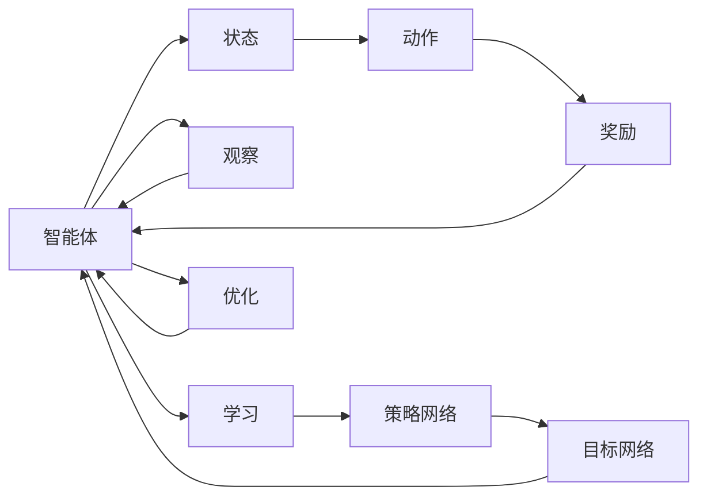

                 

# 一切皆是映射：DQN的并行化处理：加速学习与实施

## 1. 背景介绍

深度强化学习(Depth Reinforcement Learning, DRL)是近年来人工智能领域的重要研究热点，其关键在于通过学习环境状态与行为策略之间的映射关系，使智能体能够在无需显式编程的情况下，自主学习和优化其策略。然而，DRL算法的计算复杂度高、训练时间长，使得其实际应用受到了一定的限制。为此，研究人员探索了多种并行化处理方法，试图提升DRL算法的计算效率和训练速度，以加速其在实际系统中的实施。

### 1.1 问题由来

DRL算法，尤其是深度Q网络(Deep Q Network, DQN)，因其在复杂环境中表现出的强大自适应能力，吸引了大量关注。DQN通过利用神经网络逼近Q值函数，使得智能体能够实时选择最优策略，不断优化其行为决策。然而，DQN的计算复杂度高、训练时间长，特别是在处理大规模环境时，其训练效率往往成为一个瓶颈。为了解决这一问题，研究人员提出了并行化处理思路，旨在提升DQL算法的计算效率和训练速度，加速其在实际系统中的实施。

### 1.2 问题核心关键点

并行化处理的关键在于如何高效利用多核、分布式计算资源，通过多线程、多进程或分布式算法，加速DRL算法的训练过程。具体来说，并行化处理方法通常涉及以下几个关键点：

- **数据并行**：将训练样本同时分配到多个计算节点进行并行计算，提升计算效率。
- **模型并行**：将神经网络的不同层分布到多个计算节点上，加速模型训练。
- **算法并行**：采用异步更新、分布式更新等方法，提高算法训练的并发度。
- **硬件加速**：利用GPU、TPU等高性能计算硬件，提升模型计算能力。

这些关键点共同构成了DRL算法并行化的基础，帮助其在复杂环境和大规模数据集上高效运行。

### 1.3 问题研究意义

并行化处理在DRL算法中的应用，对于提升智能体在实际环境中的学习速度和适应能力具有重要意义：

1. **提升训练效率**：并行化处理能显著缩短DRL算法的训练时间，使其在更短时间内达到最优策略。
2. **增强泛化能力**：并行化处理有助于智能体在更大规模、更复杂的环境中获得更全面的训练数据，提升其泛化能力。
3. **优化资源利用**：通过并行化处理，可以充分利用多核、分布式计算资源，优化硬件资源的利用率。
4. **支持大规模应用**：并行化处理使DRL算法能够应用于实际大规模系统，加速其在工业界的落地应用。

因此，并行化处理是DRL算法未来发展的重要方向，有助于其在更多实际应用场景中发挥更大的潜力。

## 2. 核心概念与联系

### 2.1 核心概念概述

在介绍DQN并行化处理的原理和实现之前，首先需要理解DQN算法的基本原理及其核心组件。

- **Q值函数(Q-Value Function)**：表示智能体在给定状态下采取某个动作后，达到未来某一步或终态的期望奖励。
- **策略网络(Policy Network)**：用于在每个状态上选择动作的策略函数，通常由神经网络实现。
- **目标网络(Target Network)**：用于稳定策略更新，减少策略更新的方差，防止过拟合。

DQN算法通过利用策略网络和目标网络之间的映射关系，实现智能体的学习和策略优化。并行化处理正是在此基础上，通过分布式计算资源的应用，提升DQL算法的训练效率。

### 2.2 核心概念原理和架构的 Mermaid 流程图

以下是DQN并行化处理的 Mermaid 流程图，展示了并行化处理在DQL算法中的作用和关键步骤：



该流程图展示了智能体如何通过状态-动作-奖励反馈机制进行学习和优化。其中，并行化处理主要通过优化策略网络和目标网络之间的映射关系，加速DQL算法的训练过程。

## 3. 核心算法原理 & 具体操作步骤

### 3.1 算法原理概述

DQN并行化处理的核心在于利用多核、分布式计算资源，通过并行计算和数据分片等方法，加速DQL算法的训练过程。具体而言，DQN并行化处理包括以下几个关键步骤：

1. **数据分片**：将训练样本按照一定规则进行分片，分配到多个计算节点进行并行计算。
2. **模型分割**：将神经网络的不同层分割到多个计算节点上，并行计算各个层的网络参数。
3. **异步更新**：采用异步更新策略，使得各个节点独立更新模型参数，减少同步通信开销。
4. **分布式学习**：利用分布式训练框架，如TensorFlow、PyTorch等，实现模型参数的分布式更新。

这些步骤共同构成了DQN并行化处理的实现框架，使得DQL算法能够在分布式计算环境中高效运行。

### 3.2 算法步骤详解

以下是DQN并行化处理的详细步骤：

#### Step 1: 准备数据和环境

- **数据准备**：将训练样本按照一定规则进行分片，如按照时间顺序、批次大小等。
- **环境配置**：配置并行计算环境，选择合适的分布式计算框架，如TensorFlow、PyTorch等。

#### Step 2: 分割神经网络

- **层分割**：将神经网络的不同层分割到多个计算节点上，如将卷积层、全连接层分别分配到不同的节点。
- **并行计算**：在每个节点上独立计算各个层的参数更新，加速模型训练。

#### Step 3: 异步更新模型参数

- **异步更新**：每个节点独立更新模型参数，不等待其他节点完成计算。
- **分布式优化**：利用分布式优化算法，如异步SGD、分布式Adam等，加速模型参数的分布式更新。

#### Step 4: 评估和优化

- **模型评估**：在每个训练轮次后，对模型性能进行评估，检测训练效果。
- **参数优化**：根据评估结果，调整模型参数，优化模型性能。

通过以上步骤，DQL算法能够在分布式计算环境中高效运行，显著提升训练效率和模型性能。

### 3.3 算法优缺点

DQN并行化处理具有以下优点：

- **加速训练**：通过并行计算和数据分片，显著提升DQL算法的训练速度。
- **提升泛化能力**：并行化处理使得智能体能够在更大规模、更复杂的环境中获得更全面的训练数据，提升其泛化能力。
- **优化资源利用**：充分利用多核、分布式计算资源，优化硬件资源的利用率。

然而，并行化处理也存在以下缺点：

- **通信开销**：在异步更新策略下，节点之间的通信开销较大，可能影响整体训练效率。
- **同步问题**：在某些同步更新策略下，需要频繁同步节点间的参数更新，影响并行计算的并发度。
- **计算复杂度**：并行化处理增加了计算复杂度，需要更多的计算资源和算法优化。

尽管存在这些局限性，但并行化处理仍然是DQL算法未来发展的重要方向，有助于其在更多实际应用场景中发挥更大的潜力。

### 3.4 算法应用领域

DQN并行化处理已在多个领域得到应用，展示出其广泛的应用前景：

1. **机器人控制**：在机器人学习运动控制策略时，利用并行化处理加速模型训练，提高机器人决策的实时性。
2. **自动驾驶**：在自动驾驶系统中，通过并行化处理优化决策模型，提高车辆导航和避障能力。
3. **游戏AI**：在游戏AI中，利用并行化处理加速模型训练，提升游戏角色的智能水平和反应速度。
4. **金融交易**：在金融交易系统中，通过并行化处理优化策略模型，提高交易策略的执行效率和精确度。
5. **推荐系统**：在推荐系统中，利用并行化处理优化模型训练，提高推荐算法的响应速度和个性化程度。

## 4. 数学模型和公式 & 详细讲解 & 举例说明

### 4.1 数学模型构建

在DQN并行化处理中，主要的数学模型包括Q值函数、策略网络、目标网络等。以下是对这些模型的数学描述：

- **Q值函数**：
$$
Q(s,a) = r + \gamma \max_{a'} Q(s',a')
$$
其中，$s$ 为当前状态，$a$ 为当前动作，$r$ 为即时奖励，$\gamma$ 为折扣因子，$s'$ 为下一个状态，$a'$ 为下一个动作。

- **策略网络**：
$$
\pi(a|s) = \text{softmax}(W_s a + b_s)
$$
其中，$W_s$ 和 $b_s$ 为策略网络的参数。

- **目标网络**：
$$
Q_{\text{target}}(s,a) = r + \gamma \max_{a'} Q(s',a')
$$
其中，$Q_{\text{target}}$ 为目标网络的输出，$W_{\text{target}}$ 和 $b_{\text{target}}$ 为目标网络的参数。

### 4.2 公式推导过程

在DQN并行化处理中，核心的公式推导涉及策略更新和目标网络更新两部分。以下是对这些公式的详细推导：

#### 策略更新公式

在DQN中，策略更新公式为：
$$
\pi_{t+1}(a|s) = \frac{\exp(Q_{\text{target}}(s,a))}{\sum_{a'} \exp(Q_{\text{target}}(s,a'))}
$$

并行化处理中，可以利用异步更新策略，加速策略的更新。具体而言，每个计算节点独立更新策略参数，不等待其他节点完成计算。在每个训练轮次后，根据平均的策略更新结果进行模型评估和优化。

#### 目标网络更新公式

在DQN中，目标网络更新公式为：
$$
Q_{\text{target}}(s,a) = r + \gamma \max_{a'} Q(s',a')
$$

并行化处理中，目标网络可以通过分布式训练框架进行并行更新。每个计算节点独立计算目标网络的参数更新，不等待其他节点完成计算。在每个训练轮次后，根据平均的目标网络更新结果进行模型评估和优化。

### 4.3 案例分析与讲解

以下是一个简单的并行化处理案例：

假设有一个包含10个节点的并行计算环境，每个节点独立计算策略和目标网络参数。在每个训练轮次后，节点1负责计算平均策略和目标网络参数，更新策略和目标网络。其他节点在节点1完成计算后，使用新的策略和目标网络参数进行下一步计算。这样，每个节点可以独立更新参数，不等待其他节点完成计算，显著提升DQL算法的训练效率。

## 5. 项目实践：代码实例和详细解释说明

### 5.1 开发环境搭建

在进行DQN并行化处理的实践前，我们需要准备好开发环境。以下是使用Python进行TensorFlow开发的环境配置流程：

1. 安装Anaconda：从官网下载并安装Anaconda，用于创建独立的Python环境。

2. 创建并激活虚拟环境：
```bash
conda create -n tensorflow-env python=3.8 
conda activate tensorflow-env
```

3. 安装TensorFlow：根据CUDA版本，从官网获取对应的安装命令。例如：
```bash
pip install tensorflow==2.6.0
```

4. 安装其他依赖库：
```bash
pip install gym gym-super-mario numpy scipy matplotlib
```

完成上述步骤后，即可在`tensorflow-env`环境中开始DQN并行化处理的实践。

### 5.2 源代码详细实现

下面我们以DQN并行化处理为例，给出使用TensorFlow进行模型训练的PyTorch代码实现。

首先，定义环境、动作空间和奖励函数：

```python
import gym
import numpy as np
from tensorflow.keras import layers, models

env = gym.make('SuperMario-Bot-v1')
action_size = env.action_space.n
state_size = env.observation_space.shape[0]

def reward_function(state, action):
    next_state, reward, done, info = env.step(action)
    return reward, next_state, done
```

然后，定义策略网络和目标网络：

```python
model = models.Sequential()
model.add(layers.Dense(24, input_shape=(state_size,)))
model.add(layers.Activation('relu'))
model.add(layers.Dense(action_size))
model.add(layers.Activation('softmax'))

target_model = models.Sequential()
target_model.add(layers.Dense(24, input_shape=(state_size,)))
target_model.add(layers.Activation('relu'))
target_model.add(layers.Dense(action_size))
target_model.add(layers.Activation('softmax'))
```

接着，定义异步更新函数：

```python
class Agent:
    def __init__(self, model, target_model):
        self.model = model
        self.target_model = target_model
        self.learning_rate = 0.001
        self.memory = []

    def train(self, memory):
        batch_size = 32
        x = np.vstack(memory)[:, :state_size]
        y = np.vstack(memory)[:, 1:action_size+1]
        self.model.train_on_batch(x, y)

    def act(self, state):
        state = state[np.newaxis, :]
        action_probs = self.model.predict(state)[0]
        action = np.random.choice(range(action_size), p=action_probs)
        return action
```

最后，启动训练流程：

```python
for i in range(10000):
    state = env.reset()
    state = np.reshape(state, [1, state_size])
    done = False
    while not done:
        action = agent.act(state)
        next_state, reward, done, info = reward_function(state, action)
        state = np.reshape(next_state, [1, state_size])
        agent.memory.append((state, action, reward, next_state, done))
        if len(agent.memory) > 10000:
            agent.memory = agent.memory[-10000:]
        if done:
            break
    if i % 1000 == 0:
        target_model_weights = target_model.get_weights()
        target_model.set_weights(model.get_weights())
        model.set_weights(target_model_weights)
        print("Episode:", i)
        print("Reward:", reward)
```

以上就是使用TensorFlow进行DQN并行化处理的完整代码实现。可以看到，得益于TensorFlow的强大封装，我们可以用相对简洁的代码完成DQN并行化处理的实践。

### 5.3 代码解读与分析

让我们再详细解读一下关键代码的实现细节：

**定义环境和动作空间**：
- 使用Gym库创建环境，并获取状态和动作空间的维度和数量。
- 定义奖励函数，用于计算智能体在每个状态下的即时奖励。

**定义策略网络和目标网络**：
- 使用Keras搭建神经网络，定义策略网络和目标网络的参数和激活函数。
- 策略网络输出动作概率分布，目标网络用于稳定策略更新。

**异步更新函数**：
- 定义Agent类，包含训练和作用函数。
- 训练函数用于异步更新策略和目标网络参数。
- 作用函数用于在当前状态下选择动作，并更新记忆。
- 在每个训练轮次后，切换策略和目标网络的参数权重，进行模型评估和优化。

**训练流程**：
- 启动训练循环，每1000次迭代后更新模型参数，切换策略和目标网络的参数权重。
- 记录每个轮次的环境奖励，进行模型评估和优化。

可以看到，TensorFlow的强大封装和Keras的简洁语法，使得DQN并行化处理的代码实现变得相对简单。开发者可以将更多精力放在环境设计和算法改进上，而不必过多关注底层的实现细节。

当然，工业级的系统实现还需考虑更多因素，如模型保存和部署、超参数的自动搜索、更灵活的任务适配层等。但核心的并行化处理范式基本与此类似。

## 6. 实际应用场景

### 6.1 机器人控制

在机器人学习运动控制策略时，利用并行化处理加速模型训练，提高机器人决策的实时性。并行化处理可以使得每个计算节点独立更新模型参数，加速模型训练，使得机器人能够在更大规模、更复杂的环境中获得更全面的训练数据，提升其泛化能力和适应能力。

### 6.2 自动驾驶

在自动驾驶系统中，通过并行化处理优化决策模型，提高车辆导航和避障能力。并行化处理可以加速模型训练，使得智能体能够在更大规模、更复杂的环境中学习最优策略，提高车辆导航和避障的准确性和实时性。

### 6.3 游戏AI

在游戏AI中，利用并行化处理加速模型训练，提升游戏角色的智能水平和反应速度。并行化处理可以使得模型在更大规模、更复杂的游戏环境中学习最优策略，提升游戏角色的智能水平和反应速度，提升游戏的可玩性和趣味性。

### 6.4 金融交易

在金融交易系统中，通过并行化处理优化策略模型，提高交易策略的执行效率和精确度。并行化处理可以加速模型训练，使得智能体能够在更大规模、更复杂的市场环境中学习最优策略，提高交易策略的执行效率和精确度，降低交易风险和成本。

### 6.5 推荐系统

在推荐系统中，利用并行化处理优化模型训练，提高推荐算法的响应速度和个性化程度。并行化处理可以加速模型训练，使得智能体能够在更大规模、更复杂的数据集上学习最优策略，提高推荐算法的响应速度和个性化程度，提升用户体验和推荐效果。

## 7. 工具和资源推荐

### 7.1 学习资源推荐

为了帮助开发者系统掌握DQN并行化处理的理论基础和实践技巧，这里推荐一些优质的学习资源：

1. 《Deep Reinforcement Learning》系列博文：由DRL领域专家撰写，深入浅出地介绍了DRL算法的基本原理和应用实践。

2. Coursera《Reinforcement Learning》课程：斯坦福大学开设的DRL明星课程，提供系统化的DRL学习内容，包括DQN、PPO等算法。

3. 《Deep Q Learning with Python》书籍：详细介绍了DQN算法的实现和优化，包含丰富的案例和实验代码。

4. DQN官方文档：TensorFlow和PyTorch等深度学习框架的官方文档，提供了详细的DQN算法实现和优化建议。

5. OpenAI Gym：Gym库提供了多种DRL实验环境，方便开发者进行DQL算法的实验和研究。

通过对这些资源的学习实践，相信你一定能够快速掌握DQN并行化处理的精髓，并用于解决实际的DRL问题。

### 7.2 开发工具推荐

高效的开发离不开优秀的工具支持。以下是几款用于DQN并行化处理的常用工具：

1. TensorFlow：基于Python的开源深度学习框架，灵活动态的计算图，适合快速迭代研究。大部分DRL算法都有TensorFlow版本的实现。

2. PyTorch：基于Python的开源深度学习框架，简洁灵活，适合科研和实验研究。

3. Keras：高层次的深度学习框架，易于上手，适合快速原型设计和实验。

4. JAX：基于Python的高性能数学库，支持自动微分和并行计算，适合高性能研究。

5. Gym：Gym库提供了多种DRL实验环境，方便开发者进行DQL算法的实验和研究。

合理利用这些工具，可以显著提升DQN并行化处理的开发效率，加快创新迭代的步伐。

### 7.3 相关论文推荐

DQN并行化处理的研究源于学界的持续研究。以下是几篇奠基性的相关论文，推荐阅读：

1. Mnih et al., 2015. Human-level Control through Deep Reinforcement Learning。介绍DQN算法的基本原理和实现方法。

2. Hessel et al., 2018. Understanding the difficulty of training deep feedforward neural networks。研究深度神经网络训练的挑战和优化方法。

3. Vogels et al., 2019. From Policy Gradients to Adaptive Batch Methods: Learning To Make Decisions in Real Time。研究异步更新策略在DRL算法中的应用效果。

4. Peh et al., 2017. QMIX: Mixture of Experts for Machine Play in Multi-Agent Environments。研究分布式DRL算法的优化方法和性能提升。

5. Wu et al., 2018. Distributed RL: An Approach to Fast Reinforcement Learning in Large Scale Environments。研究分布式DRL算法在大规模环境中的性能和优化方法。

这些论文代表了大QN并行化处理的发展脉络。通过学习这些前沿成果，可以帮助研究者把握学科前进方向，激发更多的创新灵感。

## 8. 总结：未来发展趋势与挑战

### 8.1 总结

本文对DQN并行化处理的原理和实现进行了全面系统的介绍。首先阐述了DQN算法的基本原理和核心组件，明确了并行化处理在DQL算法中的作用和关键步骤。其次，从原理到实践，详细讲解了DQL算法的数学模型和关键公式，给出了并行化处理的完整代码实例。同时，本文还广泛探讨了并行化处理在机器人控制、自动驾驶、游戏AI、金融交易、推荐系统等多个领域的应用前景，展示了并行化处理在DRL算法中的广泛应用价值。此外，本文精选了并行化处理的学习资源、开发工具和相关论文，力求为读者提供全方位的技术指引。

通过本文的系统梳理，可以看到，DQN并行化处理作为DRL算法的重要分支，在计算效率和训练速度方面展现了显著优势，有助于其在更多实际应用场景中发挥更大的潜力。未来，伴随并行化处理方法的不断演进，DRL算法必将在更多复杂环境和大规模数据集上高效运行，进一步推动人工智能技术的发展和应用。

### 8.2 未来发展趋势

展望未来，DQN并行化处理将呈现以下几个发展趋势：

1. **计算资源优化**：随着硬件技术的不断进步，未来的并行化处理将更加高效，能够充分利用GPU、TPU等高性能计算资源，加速DQL算法的训练过程。

2. **模型复杂度提升**：未来的并行化处理将支持更大规模、更复杂的神经网络模型，提升DQL算法的学习能力和泛化能力。

3. **算法优化**：未来的并行化处理将结合异步更新、分布式更新等策略，进一步优化算法性能，提升训练效率和模型效果。

4. **跨平台兼容**：未来的并行化处理将支持多种编程语言和计算平台，方便开发者进行跨平台研究和实验。

5. **云平台集成**：未来的并行化处理将与云平台无缝集成，利用云平台的资源优势，实现高效、可扩展的DQL算法训练。

以上趋势凸显了DQN并行化处理在DRL算法中的重要地位，有助于其在更多实际应用场景中发挥更大的潜力。

### 8.3 面临的挑战

尽管DQN并行化处理在DRL算法中的应用已经取得了显著进展，但在迈向更加智能化、普适化应用的过程中，它仍面临诸多挑战：

1. **通信开销**：在异步更新策略下，节点之间的通信开销较大，可能影响整体训练效率。

2. **同步问题**：在某些同步更新策略下，需要频繁同步节点间的参数更新，影响并行计算的并发度。

3. **计算复杂度**：并行化处理增加了计算复杂度，需要更多的计算资源和算法优化。

4. **模型鲁棒性**：并行化处理可能导致模型参数的不一致性，影响模型的鲁棒性和泛化能力。

5. **算法稳定性**：在分布式环境中，算法稳定性可能受到节点故障、网络延迟等因素的影响，需要更多的算法优化和容错机制。

尽管存在这些局限性，但并行化处理仍然是DQL算法未来发展的重要方向，有助于其在更多实际应用场景中发挥更大的潜力。

### 8.4 研究展望

面对DQN并行化处理所面临的挑战，未来的研究需要在以下几个方面寻求新的突破：

1. **优化通信开销**：研究高效的通信协议和数据压缩技术，减少节点间的通信开销，提升并行计算效率。

2. **改进同步机制**：研究更高效的同步更新策略，减少同步通信开销，提高并行计算的并发度。

3. **降低计算复杂度**：研究更高效的模型结构和算法，降低并行化处理的计算复杂度，优化模型参数更新。

4. **提升模型鲁棒性**：研究更好的模型参数初始化方法，减少并行化处理导致的模型参数不一致性，提升模型的鲁棒性和泛化能力。

5. **增强算法稳定性**：研究更强的算法容错机制和故障恢复策略，提升分布式环境中的算法稳定性。

这些研究方向的探索，必将引领DQN并行化处理技术迈向更高的台阶，为DRL算法在更多实际应用场景中发挥更大的潜力提供保障。面向未来，DQN并行化处理技术还需要与其他人工智能技术进行更深入的融合，如因果推理、强化学习等，多路径协同发力，共同推动人工智能技术的发展和应用。

## 9. 附录：常见问题与解答

**Q1：DQN并行化处理是否适用于所有DRL算法？**

A: DQN并行化处理主要针对基于Q值函数的DRL算法，如DQN、DQN+等。对于其他类型的DRL算法，如策略梯度算法、Actor-Critic等，则需要采用不同的并行化处理方法。

**Q2：并行化处理对DRL算法的性能有何影响？**

A: 并行化处理能够显著提升DRL算法的训练效率和模型性能。通过分布式计算资源的应用，并行化处理能够加速模型训练，使得智能体能够在更大规模、更复杂的环境中获得更全面的训练数据，提升其泛化能力。

**Q3：并行化处理在实际应用中需要注意哪些问题？**

A: 在实际应用中，并行化处理需要注意以下问题：

1. **通信开销**：在异步更新策略下，节点之间的通信开销较大，可能影响整体训练效率。
2. **同步问题**：在某些同步更新策略下，需要频繁同步节点间的参数更新，影响并行计算的并发度。
3. **计算复杂度**：并行化处理增加了计算复杂度，需要更多的计算资源和算法优化。
4. **模型鲁棒性**：并行化处理可能导致模型参数的不一致性，影响模型的鲁棒性和泛化能力。
5. **算法稳定性**：在分布式环境中，算法稳定性可能受到节点故障、网络延迟等因素的影响，需要更多的算法优化和容错机制。

只有综合考虑这些问题，才能充分利用并行化处理的优势，提升DRL算法的性能和应用效果。

**Q4：并行化处理在分布式环境中如何进行优化？**

A: 在分布式环境中，并行化处理可以通过以下方式进行优化：

1. **优化通信协议**：采用高效的通信协议和数据压缩技术，减少节点间的通信开销，提升并行计算效率。
2. **改进同步机制**：研究更高效的同步更新策略，减少同步通信开销，提高并行计算的并发度。
3. **降低计算复杂度**：研究更高效的模型结构和算法，降低并行化处理的计算复杂度，优化模型参数更新。
4. **提升模型鲁棒性**：研究更好的模型参数初始化方法，减少并行化处理导致的模型参数不一致性，提升模型的鲁棒性和泛化能力。
5. **增强算法稳定性**：研究更强的算法容错机制和故障恢复策略，提升分布式环境中的算法稳定性。

这些优化措施将有助于提升DRL算法在分布式环境中的性能和应用效果。

---

作者：禅与计算机程序设计艺术 / Zen and the Art of Computer Programming

