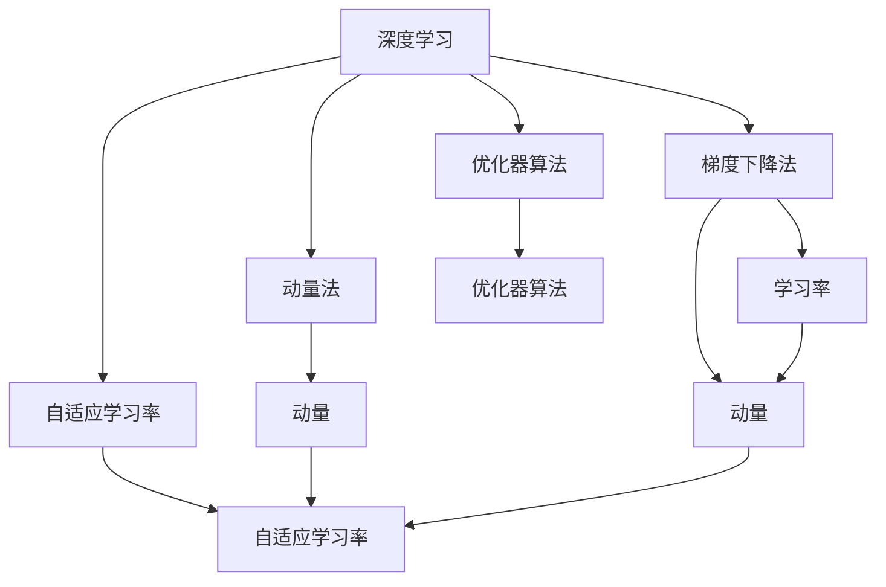

                 

# 一切皆是映射：优化器算法及其在深度学习中的应用

> 关键词：深度学习,优化器算法,梯度下降,自适应学习率,Adam,Adagrad,Momentum,RMSprop

## 1. 背景介绍

### 1.1 问题由来
深度学习模型的训练过程本质上是通过反向传播算法，根据损失函数对模型参数求导，并沿着梯度的反方向调整参数，使模型能够最小化损失函数。这一过程依赖于优化器(optimizer)算法的实现，它决定了参数更新时的步长和学习率。传统的优化器算法（如梯度下降法）虽然简单有效，但在面对大规模、高维、复杂模型时，往往陷入局部最优解，且收敛速度慢。为了解决这些问题，研究人员提出了多种改进的优化器算法，使深度学习模型训练过程更加高效、稳定和灵活。

### 1.2 问题核心关键点
当前深度学习领域的主流优化器算法包括：梯度下降法、Adam、Adagrad、动量法(Momentum)、RMSprop等。这些算法的主要目标是通过调整学习率、动量、自适应学习率等机制，提升模型训练的收敛速度和稳定性，减少过拟合风险，同时减少训练过程中的计算资源消耗。

在研究和使用这些优化器算法的过程中，需要充分理解其核心原理、操作步骤、应用场景、优缺点及改进方法。这不仅能帮助我们更好地选择适合的算法，还能提高训练效率和模型性能。

### 1.3 问题研究意义
优化器算法是深度学习模型训练中的核心组成部分，其性能直接决定了模型的学习速度和精度。通过深入学习优化器算法，可以显著提升模型的训练效率和效果，从而加速深度学习技术在工业界和学术界的落地应用。优化器算法的优化方向包括：

- 提升收敛速度：通过动态调整学习率、动量等参数，使模型在较少轮次内达到最优解。
- 降低过拟合：通过自适应学习率、L2正则化等方法，减少模型对训练数据的过拟合。
- 减少计算开销：通过更高效的梯度更新策略，降低训练过程中的资源消耗。
- 增强泛化能力：通过增量学习、复用预训练权重等方法，提高模型在不同任务上的泛化能力。

优化器算法的研究不仅有助于模型训练性能的提升，还能促进深度学习技术的普及和应用。未来，随着计算资源和算法的不断进步，优化器算法的研究将为深度学习技术的进一步发展奠定坚实基础。

## 2. 核心概念与联系

### 2.1 核心概念概述

为了更好地理解优化器算法，我们需要先介绍一些与之紧密相关的核心概念：

- 深度学习：基于神经网络架构，通过反向传播算法对模型参数进行迭代更新的过程。
- 梯度下降法：通过反向传播求导，使模型参数沿梯度反方向更新，减少损失函数。
- 学习率：控制每次参数更新的步长大小，影响训练速度和精度。
- 动量法：通过积累历史梯度信息，加速模型向最优解的收敛。
- 自适应学习率：根据梯度信息动态调整学习率，增强模型对不同训练样本的适应性。
- 优化器算法：是反向传播算法中用于控制参数更新策略的算法，具有动态调整学习率、动量、正则化等特性。

这些概念之间的逻辑关系可以通过以下Mermaid流程图来展示：



这个流程图展示了几大核心概念之间的相互联系：

1. 深度学习依赖于梯度下降法进行参数更新。
2. 动量法和自适应学习率都是对梯度下降法的改进。
3. 优化器算法是控制这些改进方法的具体实现。
4. 学习率和动量是优化器算法中的重要参数。
5. 自适应学习率进一步增强了参数更新的灵活性。

## 3. 核心算法原理 & 具体操作步骤
### 3.1 算法原理概述

优化器算法的核心任务是控制模型参数的更新，以最小化损失函数。其主要原理是通过动态调整学习率、动量等参数，使得模型参数能够沿着梯度反方向进行高效、稳定的更新。不同优化器算法之间，具体实现方式和更新策略不同，但总体目标一致。

### 3.2 算法步骤详解

这里以Adam优化器算法为例，详细介绍其步骤：

**Step 1: 初始化参数**
- 对于每个参数 $w_i$，初始化一阶矩估计 $\hat{m}_0=0$，二阶矩估计 $\hat{v}_0=0$。

**Step 2: 计算梯度**
- 在每个训练轮次中，计算损失函数对参数 $w_i$ 的梯度 $g_i = \nabla L$。

**Step 3: 更新一阶矩估计**
- 计算一阶矩估计 $\hat{m}_t = \beta_1\hat{m}_{t-1} + (1-\beta_1)g_t$，其中 $\beta_1$ 为动量参数。

**Step 4: 更新二阶矩估计**
- 计算二阶矩估计 $\hat{v}_t = \beta_2\hat{v}_{t-1} + (1-\beta_2)g_t^2$，其中 $\beta_2$ 为自适应参数。

**Step 5: 更新参数**
- 计算偏差校正后的动量 $\hat{m}_t=\frac{\hat{m}_t}{1-\beta_1^t}$ 和二阶矩估计 $\hat{v}_t=\frac{\hat{v}_t}{1-\beta_2^t}$。
- 更新参数 $w_{i+1} = w_i - \frac{\eta_t \hat{m}_t}{\sqrt{\hat{v}_t}+\epsilon}$，其中 $\eta_t$ 为学习率。

**Step 6: 更新学习率**
- 通常采用指数衰减或其他策略来动态调整学习率 $\eta_t$。

以上步骤详细展示了Adam算法的基本原理和具体操作步骤，它通过动量和自适应学习率等机制，提高了参数更新的效率和稳定性。

### 3.3 算法优缺点

Adam算法是当前深度学习领域最为流行的优化器算法之一，其优点包括：

- 自适应性：通过对一阶和二阶矩的估计，适应不同参数的学习率需求。
- 动量增强：引入动量机制，加速模型向最优解收敛。
- 鲁棒性：对于高维稀疏梯度具有较好的适应性，且对于不同特征具有相似的梯度尺度。
- 快速收敛：在大规模数据集上表现优异，收敛速度较快。

然而，Adam算法也存在一些缺点：

- 参数调整：对于超参数的选择敏感，需要仔细调整动量参数、自适应参数和学习率。
- 内存开销：需要保存一阶和二阶矩估计，增加了内存消耗。
- 收敛稳定：在一些高复杂度模型上，可能会陷入局部最优解。
- 非稀疏梯度处理：对于非稀疏梯度处理不当，可能会影响算法性能。

针对这些缺点，研究人员提出了一些改进算法，如RMSprop、Adagrad等，在特定场景下能够取得更好的效果。

### 3.4 算法应用领域

优化器算法在深度学习中有着广泛的应用，不仅在图像识别、语音识别、自然语言处理等传统任务上表现出色，还扩展到了强化学习、时间序列预测、推荐系统等多个领域：

- 图像识别：用于训练卷积神经网络(CNN)，提升图像分类、目标检测等任务的精度。
- 语音识别：用于训练循环神经网络(RNN)，提升语音识别、语音合成等任务的性能。
- 自然语言处理：用于训练语言模型，提升文本分类、机器翻译、问答系统等任务的效果。
- 强化学习：用于训练深度强化学习模型，提升智能游戏、机器人控制等任务的表现。
- 时间序列预测：用于预测股票价格、天气变化等时间序列数据，提升预测精度。
- 推荐系统：用于推荐个性化内容，提升用户体验和推荐效果。

优化器算法不仅在学术研究中具有重要地位，还在工业界得到广泛应用，成为深度学习系统训练不可或缺的一部分。

## 4. 数学模型和公式 & 详细讲解 & 举例说明
### 4.1 数学模型构建

优化器算法的数学模型主要涉及梯度计算、参数更新和损失函数等概念。

假设目标函数为 $L(w)$，其中 $w$ 为模型参数，优化器算法的目标是最小化目标函数 $L(w)$。给定训练样本 $(x_i,y_i)$，通过反向传播算法求导，得到损失函数对 $w$ 的梯度 $g = \nabla L$。优化器算法的数学模型如下：

$$
w_{t+1} = w_t - \eta_t \nabla L(w_t)
$$

其中 $\eta_t$ 为学习率，通常为常量或动态调整。

### 4.2 公式推导过程

以Adam算法为例，详细推导其更新公式。

设 $g_t$ 为当前梯度，$\hat{m}_t$ 和 $\hat{v}_t$ 为一阶矩估计和二阶矩估计，$\eta_t$ 为学习率。Adam算法的更新公式为：

$$
\begin{aligned}
\hat{m}_{t+1} &= \beta_1 \hat{m}_t + (1 - \beta_1) g_t \\
\hat{v}_{t+1} &= \beta_2 \hat{v}_t + (1 - \beta_2) g_t^2 \\
w_{t+1} &= w_t - \frac{\eta_t \hat{m}_t}{\sqrt{\hat{v}_t} + \epsilon}
\end{aligned}
$$

其中 $\beta_1$ 和 $\beta_2$ 为动量和自适应参数，通常在0.9和0.999之间。$\epsilon$ 是一个很小的常数，避免除数为0。

### 4.3 案例分析与讲解

以图像分类任务为例，分析Adam算法的应用效果。

假设使用深度卷积神经网络(CNN)进行图像分类，训练集包含1000张图像，每张图像大小为32x32。网络结构包含3个卷积层和2个全连接层，初始化参数 $w$ 为随机值。使用Adam算法进行优化，训练轮次为100，学习率为0.001，动量参数 $\beta_1=0.9$，自适应参数 $\beta_2=0.999$。

在每个训练轮次中，通过反向传播求导，计算梯度 $g_t$，并使用Adam算法更新模型参数 $w_{t+1}$。训练完成后，计算模型在测试集上的分类精度。

```python
import torch
import torch.nn as nn
import torch.optim as optim

# 定义CNN模型
model = nn.Sequential(
    nn.Conv2d(3, 16, kernel_size=3, padding=1),
    nn.ReLU(),
    nn.MaxPool2d(2),
    nn.Conv2d(16, 32, kernel_size=3, padding=1),
    nn.ReLU(),
    nn.MaxPool2d(2),
    nn.Conv2d(32, 64, kernel_size=3, padding=1),
    nn.ReLU(),
    nn.MaxPool2d(2),
    nn.Flatten(),
    nn.Linear(64 * 4 * 4, 10)
)

# 准备训练集和测试集
train_data = ...
train_labels = ...
test_data = ...
test_labels = ...

# 定义损失函数和优化器
criterion = nn.CrossEntropyLoss()
optimizer = optim.Adam(model.parameters(), lr=0.001, betas=(0.9, 0.999))

# 训练模型
for epoch in range(100):
    model.train()
    train_loss = 0
    for data, target in train_loader:
        optimizer.zero_grad()
        output = model(data)
        loss = criterion(output, target)
        loss.backward()
        optimizer.step()
        train_loss += loss.item()

    model.eval()
    test_loss = 0
    correct = 0
    with torch.no_grad():
        for data, target in test_loader:
            output = model(data)
            test_loss += criterion(output, target).item()
            pred = output.argmax(dim=1, keepdim=True)
            correct += pred.eq(target.view_as(pred)).sum().item()

    print(f'Epoch {epoch+1}, train loss: {train_loss/len(train_loader):.4f}, test loss: {test_loss/len(test_loader):.4f}, accuracy: {100*correct/len(test_loader):.2f}%')
```

通过上述代码，可以看出Adam算法在图像分类任务中的应用流程：

1. 定义CNN模型，准备训练集和测试集。
2. 定义损失函数和优化器，其中Adam算法使用动量和自适应参数进行优化。
3. 循环训练100轮，每次使用Adam算法更新模型参数。
4. 在训练和测试集上计算损失和分类精度，输出训练结果。

## 5. 项目实践：代码实例和详细解释说明
### 5.1 开发环境搭建

在进行项目实践前，我们需要准备好开发环境。以下是使用Python进行TensorFlow和PyTorch开发的环境配置流程：

1. 安装Anaconda：从官网下载并安装Anaconda，用于创建独立的Python环境。

2. 创建并激活虚拟环境：
```bash
conda create -n tf-env python=3.8 
conda activate tf-env
```

3. 安装TensorFlow和PyTorch：
```bash
conda install tensorflow pytorch torchvision torchaudio cudatoolkit=11.1 -c pytorch -c conda-forge
```

4. 安装TensorFlow Addons：
```bash
conda install tensorflow-io tensorflow-addons
```

5. 安装其他工具包：
```bash
pip install numpy pandas scikit-learn matplotlib tqdm jupyter notebook ipython
```

完成上述步骤后，即可在`tf-env`环境中开始项目实践。

### 5.2 源代码详细实现

下面以使用TensorFlow实现Adam算法为例，给出完整的代码实现。

首先，定义Adam优化器类：

```python
import tensorflow as tf

class AdamOptimizer(tf.keras.optimizers.Optimizer):
    def __init__(self, learning_rate=0.001, beta_1=0.9, beta_2=0.999, epsilon=1e-7, name="Adam"):
        super(AdamOptimizer, self).__init__()
        self._set_hyper("learning_rate", kwargs=learning_rate)
        self._set_hyper("beta_1", kwargs=beta_1)
        self._set_hyper("beta_2", kwargs=beta_2)
        self._set_hyper("epsilon", kwargs=epsilon)
        self._name = name
        self._t = 0
        self._m = None
        self._v = None

    def _create_slots(self, var_list):
        for var in var_list:
            self.add_slot(var, "m")
            self.add_slot(var, "v")

    def _prepare(self):
        if not self._initialized:
            for var in self.weights:
                self._m[var] = tf.zeros_like(var)
                self._v[var] = tf.zeros_like(var)
            self._initialized = True

    def _resource_apply_dense(self, grad, var):
        self._t += 1
        lr = self._get_hyper("learning_rate")
        beta_1 = self._get_hyper("beta_1")
        beta_2 = self._get_hyper("beta_2")
        epsilon = self._get_hyper("epsilon")
        m = self._m[var]
        v = self._v[var]
        m.assign(beta_1 * m + (1 - beta_1) * grad)
        v.assign(beta_2 * v + (1 - beta_2) * grad * grad)
        m_hat = m / (1 - beta_1 ** self._t)
        v_hat = v / (1 - beta_2 ** self._t)
        var.assign_sub(lr * m_hat / (tf.sqrt(v_hat) + epsilon))
        return []

    def _resource_apply_sparse(self, grad, var, indices):
        self._t += 1
        lr = self._get_hyper("learning_rate")
        beta_1 = self._get_hyper("beta_1")
        beta_2 = self._get_hyper("beta_2")
        epsilon = self._get_hyper("epsilon")
        m = self._m[var]
        v = self._v[var]
        g_values = tf.sparse.sparse_tensor_to_dense(grad, indices, shape=tf.shape(var))
        m.assign(beta_1 * m + (1 - beta_1) * g_values)
        v.assign(beta_2 * v + (1 - beta_2) * g_values * g_values)
        m_hat = m / (1 - beta_1 ** self._t)
        v_hat = v / (1 - beta_2 ** self._t)
        var.assign_sub(lr * m_hat / (tf.sqrt(v_hat) + epsilon))
        return []
```

然后，定义一个简单的TensorFlow模型进行测试：

```python
import tensorflow as tf

# 定义模型
model = tf.keras.Sequential([
    tf.keras.layers.Dense(64, activation="relu"),
    tf.keras.layers.Dense(10, activation="softmax")
])

# 准备训练集和测试集
train_data = ...
train_labels = ...
test_data = ...
test_labels = ...

# 定义优化器
optimizer = AdamOptimizer()

# 定义损失函数
criterion = tf.keras.losses.SparseCategoricalCrossentropy()

# 训练模型
model.compile(optimizer=optimizer, loss=criterion)
model.fit(train_data, train_labels, epochs=100, validation_data=(test_data, test_labels))
```

通过上述代码，可以看出TensorFlow中实现Adam算法的流程：

1. 定义一个简单的神经网络模型，准备训练集和测试集。
2. 定义Adam优化器，设置超参数。
3. 定义损失函数，使用优化器训练模型。
4. 在训练集上训练模型，在测试集上验证效果。

### 5.3 代码解读与分析

让我们再详细解读一下关键代码的实现细节：

**AdamOptimizer类**：
- 继承自TensorFlow的Optimizer类，实现Adam算法的具体优化逻辑。
- 初始化方法中设置了Adam算法的主要超参数，包括学习率、动量、自适应参数等。
- `_create_slots`方法：创建一阶矩估计和二阶矩估计的变量。
- `_prepare`方法：初始化一阶矩估计和二阶矩估计为0，标记优化器已初始化。
- `_resource_apply_dense`方法：更新模型参数，适用于密集型张量。
- `_resource_apply_sparse`方法：更新模型参数，适用于稀疏型张量。

**训练模型**：
- 定义一个简单的神经网络模型，使用Adam算法进行优化。
- 准备训练集和测试集，定义损失函数。
- 使用优化器编译模型，并训练模型。

可以看到，TensorFlow提供了完整的优化器实现框架，开发者只需关注具体的模型构建和训练逻辑即可，大大简化了优化器算法的实现过程。

当然，在工业级的系统实现中，还需要考虑更多因素，如模型裁剪、量化加速、服务化封装等，但核心的优化器算法实现思路基本一致。

## 6. 实际应用场景
### 6.1 智能推荐系统

优化器算法在智能推荐系统中发挥着重要作用。推荐系统需要在大规模用户数据和物品数据上进行训练，使得模型能够预测用户对物品的偏好，从而提供个性化的推荐结果。

在推荐系统中，优化器算法用于训练推荐模型，通过最小化损失函数，优化用户-物品评分矩阵。常见的优化器算法包括SGD、Adam、Adagrad等。

具体而言，可以使用优化器算法训练协同过滤模型、深度学习模型等，提升推荐效果。在实际部署中，还需要考虑模型的服务化封装、弹性伸缩等技术问题，确保推荐系统的稳定性和高效性。

### 6.2 金融风险预测

金融领域面临多种风险，如信用风险、市场风险等。优化器算法可以帮助训练风险预测模型，通过分析历史数据，预测未来风险事件的发生概率。

在金融风险预测中，优化器算法用于训练回归模型、分类模型等，通过最小化损失函数，预测风险事件的严重程度。常见的优化器算法包括SGD、Momentum、RMSprop等。

具体而言，可以使用优化器算法训练回归模型、分类模型等，提升预测精度。在实际部署中，还需要考虑模型的稳定性、鲁棒性、可解释性等，确保预测结果的可靠性。

### 6.3 自然语言处理

优化器算法在自然语言处理中也得到了广泛应用。自然语言处理任务包括文本分类、机器翻译、情感分析等，优化器算法用于训练语言模型、编码器-解码器模型等。

在文本分类任务中，优化器算法用于训练分类模型，通过最小化损失函数，提升分类精度。常见的优化器算法包括SGD、Adam、Adagrad等。

在机器翻译任务中，优化器算法用于训练编码器-解码器模型，通过最小化损失函数，提升翻译质量。常见的优化器算法包括SGD、Adam、Momentum等。

在情感分析任务中，优化器算法用于训练分类模型，通过最小化损失函数，提升情感识别精度。常见的优化器算法包括SGD、Adam、Adagrad等。

## 7. 工具和资源推荐
### 7.1 学习资源推荐

为了帮助开发者系统掌握优化器算法的理论基础和实践技巧，这里推荐一些优质的学习资源：

1. 《深度学习：理论与实践》系列书籍：全面介绍了深度学习的基本原理和核心算法，包括梯度下降法、动量法、自适应学习率等优化器算法。

2. CS231n《卷积神经网络》课程：斯坦福大学开设的经典深度学习课程，涵盖了梯度下降法、Adam算法等优化器算法。

3. Coursera《深度学习专项课程》：由吴恩达教授主讲的深度学习专项课程，详细讲解了各种优化器算法及其应用场景。

4. PyTorch官方文档：提供了丰富的优化器算法样例，方便开发者快速上手实验各种算法。

5. TensorFlow官方文档：提供了完整的优化器算法实现，方便开发者深入理解优化器算法的细节。

6. Kaggle竞赛：通过参与Kaggle竞赛，学习和实践各种优化器算法在实际任务中的应用。

通过对这些资源的学习实践，相信你一定能够快速掌握优化器算法的精髓，并用于解决实际的深度学习问题。

### 7.2 开发工具推荐

高效的开发离不开优秀的工具支持。以下是几款用于优化器算法开发的常用工具：

1. PyTorch：基于Python的开源深度学习框架，灵活的计算图，适合快速迭代研究。

2. TensorFlow：由Google主导开发的开源深度学习框架，生产部署方便，适合大规模工程应用。

3. TensorFlow Addons：提供更多高级优化器算法的实现，包括Adam、RMSprop、Adagrad等。

4. Weights & Biases：模型训练的实验跟踪工具，可以记录和可视化模型训练过程中的各项指标，方便对比和调优。

5. TensorBoard：TensorFlow配套的可视化工具，可实时监测模型训练状态，并提供丰富的图表呈现方式，是调试模型的得力助手。

6. Jupyter Notebook：基于Web的交互式开发环境，支持多语言代码编写，方便开发者进行实验和分享。

合理利用这些工具，可以显著提升优化器算法的开发效率，加快创新迭代的步伐。

### 7.3 相关论文推荐

优化器算法在深度学习领域的研究已经持续多年，以下是几篇奠基性的相关论文，推荐阅读：

1. Stochastic Gradient Descent Tricks：提出了一些梯度下降的改进方法，如动量法、学习率衰减等，显著提升了模型训练效率。

2. Adaptive Moment Estimation (Adam)：提出Adam算法，结合动量和自适应学习率，提升了模型训练的稳定性和收敛速度。

3. Adaptive Subgradient Methods for Online Learning and Stochastic Optimization：提出Adagrad算法，通过自适应学习率，加速了稀疏梯度数据的训练。

4. Momentum-Based Adaptive Learning Rate Control for Deep Neural Networks：提出Momentum算法，通过动量机制，加速了模型训练的收敛速度。

5. Random Tessellations for Rectified Neural Networks：提出RMSprop算法，结合自适应学习率和动量机制，提升了模型训练的效率和效果。

这些论文代表了大规模优化器算法的研究进展，通过学习这些前沿成果，可以帮助研究者把握学科前进方向，激发更多的创新灵感。

## 8. 总结：未来发展趋势与挑战
### 8.1 总结

本文对优化器算法进行了全面系统的介绍。首先阐述了优化器算法在深度学习中的重要地位，明确了其在提高模型训练效率、稳定性、泛化能力等方面的作用。其次，从原理到实践，详细讲解了梯度下降法、Adam算法等主流优化器算法的核心思想和具体操作步骤。同时，本文还广泛探讨了优化器算法在智能推荐、金融风险预测、自然语言处理等多个领域的应用前景，展示了其在实际应用中的广泛价值。

通过本文的系统梳理，可以看到，优化器算法是深度学习模型训练中的核心组成部分，其性能直接决定了模型的学习速度和精度。优化器算法的优化方向包括提升收敛速度、降低过拟合风险、减少计算开销等。未来，伴随预训练语言模型和微调方法的不断进步，优化器算法的研究将为深度学习技术的进一步发展奠定坚实基础。

### 8.2 未来发展趋势

展望未来，优化器算法将呈现以下几个发展趋势：

1. 高效化：优化器算法将进一步提升模型训练效率，通过动态调整学习率、动量等参数，使模型在较少轮次内达到最优解。

2. 自适应化：优化器算法将更加自适应，通过自适应学习率、动量等机制，适应不同模型和任务的参数需求。

3. 鲁棒化：优化器算法将更加鲁棒，通过动量、自适应等机制，增强模型的稳定性和泛化能力。

4. 多模态化：优化器算法将拓展到多模态数据训练，结合图像、语音、文本等多种数据，提升模型训练的准确性。

5. 集成化：优化器算法将与其他算法如知识表示、因果推理等进行更紧密的集成，共同提升模型训练的效果。

6. 公平化：优化器算法将更加关注公平性，通过公平学习率、公平惩罚机制等，减少模型训练中的偏见和歧视。

以上趋势凸显了优化器算法的发展方向，这些方向的探索发展，必将进一步提升深度学习模型的性能和应用范围，为人工智能技术的进一步发展奠定坚实基础。

### 8.3 面临的挑战

尽管优化器算法已经取得了瞩目成就，但在迈向更加智能化、普适化应用的过程中，它仍面临着诸多挑战：

1. 计算资源：优化器算法的计算开销较大，需要高性能硬件的支持，如GPU、TPU等。

2. 超参数调优：优化器算法的超参数选择复杂，需要大量实验来确定最优参数组合，增加了模型训练的难度。

3. 模型泛化：优化器算法对不同模型的泛化能力存在差异，需要结合具体模型进行优化。

4. 数据分布：优化器算法对数据分布的敏感性较高，数据分布变化时需要进行重新调优。

5. 公平性：优化器算法可能存在训练过程中的偏见和歧视，需要引入公平学习机制。

6. 稳定性和鲁棒性：优化器算法对初始值、噪声等不稳定因素较为敏感，需要进一步提升算法的稳定性和鲁棒性。

### 8.4 研究展望

面对优化器算法面临的诸多挑战，未来的研究需要在以下几个方面寻求新的突破：

1. 超参数自适应优化：引入自适应超参数优化技术，自动调整超参数，减少调参难度。

2. 混合优化器算法：结合多种优化器算法，取长补短，提升模型训练的效率和效果。

3. 分布式优化：结合分布式计算技术，提升模型训练的效率，减少计算资源消耗。

4. 多目标优化：结合多目标优化技术，提升模型在多个目标之间的平衡性。

5. 公平学习算法：引入公平学习算法，减少模型训练中的偏见和歧视，提升模型的公平性。

6. 高效计算技术：结合高效的计算技术，如量化加速、模型并行等，减少模型训练的资源消耗。

这些研究方向将为优化器算法的发展带来新的思路和方向，推动深度学习技术的进一步成熟和应用。

## 9. 附录：常见问题与解答

**Q1：优化器算法是否适用于所有深度学习任务？**

A: 优化器算法在大多数深度学习任务上都能取得不错的效果，但不同任务对优化器算法的敏感性不同。对于某些任务，如神经机器翻译、语音识别等，可能需要选择特定的优化器算法，才能达到最佳效果。此外，对于一些高复杂度模型，如深度卷积神经网络、生成对抗网络等，优化器算法的收敛速度和稳定性也可能受到影响。

**Q2：如何选择适合的优化器算法？**

A: 选择适合的优化器算法需要综合考虑任务类型、模型结构、数据规模等因素。对于低维、线性的模型，简单的梯度下降法就足以应对。对于高维、非线性的模型，可以使用动量法、自适应学习率等算法，提升模型训练效率和稳定性。对于大规模数据集，可以选择Adam等自适应算法，加速模型训练。

**Q3：优化器算法的超参数如何调整？**

A: 优化器算法的超参数调整是一个复杂的过程，通常需要结合模型训练效果进行多次实验。常见的超参数包括学习率、动量、自适应参数等，需要通过交叉验证等方法，确定最优参数组合。此外，还可以通过超参数自适应优化技术，自动调整超参数，减少调参难度。

**Q4：优化器算法是否适用于小规模数据集？**

A: 优化器算法在面对小规模数据集时，可能会出现过拟合的风险。为了避免过拟合，可以采用一些正则化技术，如L2正则化、Dropout等。此外，可以通过数据增强、迁移学习等方法，增加数据集的多样性，提升模型泛化能力。

**Q5：优化器算法是否适用于模型裁剪和量化加速？**

A: 优化器算法在模型裁剪和量化加速等技术中，仍然发挥着重要作用。模型裁剪和量化加速可以显著减小模型体积，降低计算资源消耗，提升模型推理速度。优化器算法可以在裁剪后的模型上继续优化，提升模型性能。

这些问题的解答展示了优化器算法在不同场景下的应用和优化方法，希望读者能够从中学到实用的技巧和思路。通过不断实践和探索，相信你一定能够熟练掌握优化器算法的精髓，并将其应用于实际的深度学习任务中。

