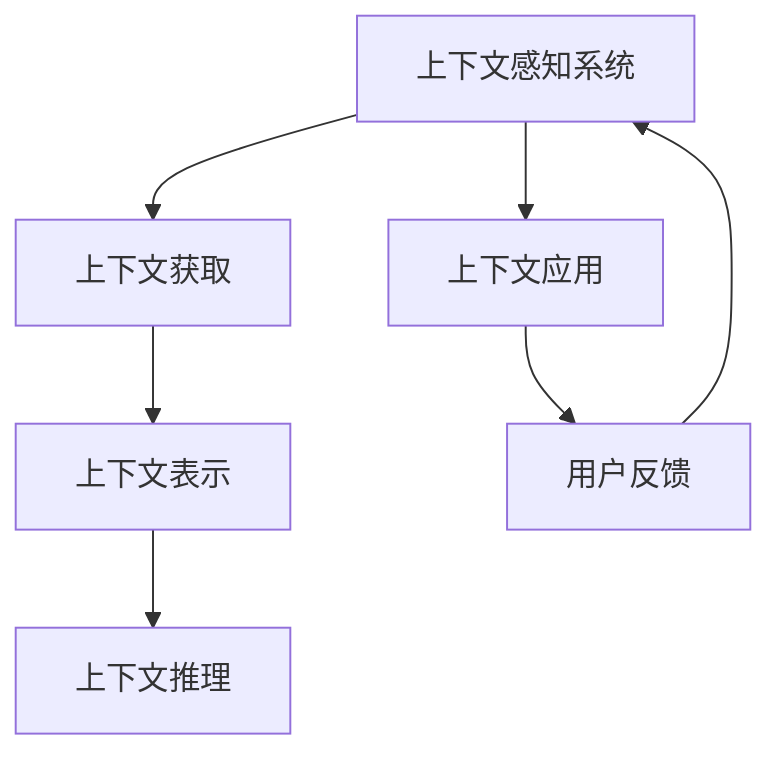

                 

# 上下文理解在CUI中的重要性

## 1. 背景介绍

在计算机用户界面（Computer User Interface，CUI）设计中，上下文理解（Context Understanding）扮演着至关重要的角色。无论是传统的桌面应用程序，还是现代的移动和Web应用，好的上下文理解都能大幅提升用户体验，并驱动应用流程更加自然流畅。上下文理解涉及多方面的知识，包括用户当前的操作状态、交互历史、用户意图、系统上下文环境等。深入理解这些上下文信息，可以极大地增强应用的功能性和交互性。

### 1.1 上下文理解的定义与重要性

上下文理解是指系统能够感知并解析当前交互环境中的各类上下文信息，并据此做出响应。它包括但不限于：
- 用户的操作历史：如之前的输入、选择、操作等。
- 当前的应用场景：如用户正在编辑文档、浏览网页、播放视频等。
- 用户状态：如用户当前情绪、注意焦点、偏好设置等。
- 用户意图：如用户尝试达到的目标、希望解决的问题等。
- 系统状态：如系统当前运行状态、资源可用性等。

良好的上下文理解能够：
- **提高应用响应速度**：通过理解用户意图，应用可以快速地响应用户操作。
- **优化用户体验**：上下文理解使得应用能够提供个性化的服务，增强用户粘性。
- **减少用户输入**：通过预测用户操作，应用可以减少用户的重复输入，提升操作效率。
- **促进系统自动化**：在用户意图明确的情况下，上下文理解可以使得应用自动执行某些步骤，减轻用户负担。

### 1.2 上下文理解与人工智能的联系

在现代CUI设计中，人工智能（AI）技术，特别是自然语言处理（NLP）和机器学习（ML），成为了实现上下文理解的重要手段。通过这些技术，系统能够从海量数据中学习用户行为模式，自动识别上下文信息，并根据上下文调整应用行为。AI的加入使得上下文理解变得更加精准和动态。

## 2. 核心概念与联系

### 2.1 核心概念概述

上下文理解涉及多个关键概念，包括：

- **上下文感知系统（Context-Aware System）**：能够在多种场景下动态感知并解析上下文信息，并据此调整系统行为的系统。
- **上下文获取（Context Acquisition）**：系统如何获取当前上下文信息的机制。
- **上下文表示（Context Representation）**：如何表示上下文信息，通常使用向量或其他结构化数据。
- **上下文推理（Context Reasoning）**：系统如何利用上下文信息进行推理，以支持决策。

这些概念之间的联系可以通过以下Mermaid流程图来展示：



这个流程图展示了上下文理解的核心流程：

1. 上下文感知系统从上下文获取模块获取当前上下文信息。
2. 获取的上下文信息通过上下文表示模块转化为系统能够处理的格式。
3. 上下文推理模块利用上下文信息进行推理，以支持决策。
4. 上下文感知系统根据推理结果调整应用行为。
5. 用户反馈模块获取用户对系统行为的反应，为后续上下文理解提供依据。

### 2.2 上下文获取

上下文获取是上下文理解的首要环节，其核心在于从哪些来源和以何种方式获取上下文信息。常见的上下文获取方法包括：

- **用户输入**：如文本、语音、手势等交互数据。
- **系统日志**：如应用操作记录、网络请求日志等。
- **设备状态**：如传感器数据、位置信息等。
- **用户配置**：如系统设置、个性化偏好等。
- **外部环境**：如天气、时间、地理位置等。

不同应用场景下的上下文获取方式可能有所不同。例如，移动应用可以通过GPS获取位置信息，而Web应用则可以通过Cookie和浏览器历史记录获取用户历史行为。

### 2.3 上下文表示

获取上下文信息后，需要将其转化为系统可处理的格式。常见的上下文表示方法包括：

- **向量表示**：将上下文信息转化为向量形式，如词向量、句向量等。
- **结构化表示**：使用表格、图等结构化数据表示上下文信息。
- **组合表示**：将不同类型上下文信息组合使用，以提供更丰富的表示。

上下文表示的质量直接影响上下文推理的准确性和效果。

### 2.4 上下文推理

上下文推理是指系统如何利用上下文信息进行推理，以支持决策。常见的上下文推理方法包括：

- **规则推理**：基于预定义的规则进行推理。
- **统计推理**：基于历史数据和统计模型进行推理。
- **机器学习推理**：使用ML模型对上下文信息进行预测和决策。

上下文推理是上下文理解的核心部分，其效果直接影响到系统的智能化程度。

## 3. 核心算法原理 & 具体操作步骤

### 3.1 算法原理概述

上下文推理的核心在于利用机器学习模型对上下文信息进行预测和决策。常见的上下文推理算法包括：

- **基于规则的推理**：根据预定义的规则集，对上下文信息进行推理和决策。
- **基于统计的推理**：使用历史数据训练统计模型，对上下文信息进行预测。
- **基于机器学习的推理**：使用ML算法（如决策树、随机森林、神经网络等）对上下文信息进行预测和决策。

基于机器学习的推理方法因其高效和准确性，成为了当前主流的选择。

### 3.2 算法步骤详解

下面以基于机器学习的上下文推理为例，详细介绍其具体操作步骤：

**Step 1: 数据准备**
- 收集标注数据，数据应包含上下文信息和对应的推理结果。
- 对数据进行清洗、归一化等预处理，确保数据质量。

**Step 2: 特征工程**
- 设计特征，将上下文信息转化为系统可处理的形式，如特征向量。
- 进行特征选择和降维，去除冗余特征，提高模型效率。

**Step 3: 模型选择**
- 选择合适的机器学习模型，如决策树、随机森林、神经网络等。
- 考虑模型的准确性、效率和可解释性，选择最适合上下文推理任务的模型。

**Step 4: 模型训练**
- 使用标注数据训练模型，通过交叉验证等方法优化模型参数。
- 选择合适的损失函数和优化算法，训练模型。

**Step 5: 模型评估**
- 使用验证集对模型进行评估，选择合适的评估指标，如准确率、召回率等。
- 根据评估结果调整模型，进行参数优化。

**Step 6: 模型部署**
- 将训练好的模型部署到应用中，进行实时推理。
- 通过API或其他方式与上下文获取模块进行交互，获取实时上下文信息。

**Step 7: 模型监控与优化**
- 监控模型在实际应用中的表现，根据反馈进行模型调整。
- 定期更新模型，适应不断变化的应用场景和上下文信息。

### 3.3 算法优缺点

基于机器学习的上下文推理方法具有以下优点：

- **高效性**：通过自动化学习和训练，可以快速部署和更新模型，提高推理速度。
- **准确性**：基于历史数据的训练，能够提供较高精度的推理结果。
- **可扩展性**：模型可以适应不断变化的应用场景和上下文信息，具备良好的扩展性。

同时，该方法也存在一定的局限性：

- **数据依赖性**：模型的性能依赖于训练数据的数量和质量，标注数据获取成本较高。
- **解释性不足**：机器学习模型通常为"黑盒"系统，难以解释其决策过程。
- **过拟合风险**：模型在特定上下文环境下可能出现过拟合现象，推理结果不可靠。

### 3.4 算法应用领域

上下文推理在多个领域都有广泛应用，例如：

- **智能助理**：通过理解用户的上下文信息，智能助理能够提供个性化推荐、日程管理、问题解答等服务。
- **推荐系统**：利用用户的上下文信息，推荐系统能够提供个性化的商品、内容、服务推荐。
- **自然语言处理**：通过理解对话上下文，NLP系统能够提供准确的意图识别、对话生成等功能。
- **智能搜索**：通过理解搜索上下文，智能搜索能够提供更精准的搜索结果和推荐。
- **个性化广告**：利用用户的上下文信息，个性化广告系统能够提供更有效的广告展示和点击预测。

## 4. 数学模型和公式 & 详细讲解 & 举例说明

### 4.1 数学模型构建

在上下文推理中，常见的数学模型包括决策树、随机森林、神经网络等。这里以神经网络为例，介绍上下文推理的数学模型构建。

设上下文信息为 $x \in \mathbb{R}^n$，对应的推理结果为 $y \in \{0, 1\}$。神经网络模型包括输入层、隐藏层和输出层，输入层包含 $n$ 个神经元，每个隐藏层包含 $m$ 个神经元，输出层为二分类任务，输出层有 1 个神经元。神经网络的数学模型为：

$$
y = \sigma(\mathbf{W}_2\sigma(\mathbf{W}_1x + \mathbf{b}_1) + \mathbf{b}_2)
$$

其中，$\mathbf{W}_1 \in \mathbb{R}^{m \times n}$ 和 $\mathbf{W}_2 \in \mathbb{R}^{1 \times m}$ 分别为输入层到隐藏层和隐藏层到输出层的权重矩阵，$\mathbf{b}_1 \in \mathbb{R}^m$ 和 $\mathbf{b}_2 \in \mathbb{R}$ 分别为隐藏层和输出层的偏置向量，$\sigma$ 为激活函数，通常使用 ReLU 函数。

### 4.2 公式推导过程

设训练集为 $D=\{(x_i,y_i)\}_{i=1}^N$，其中 $x_i \in \mathbb{R}^n$ 和 $y_i \in \{0, 1\}$。神经网络的损失函数为交叉熵损失函数：

$$
\mathcal{L}(\theta) = -\frac{1}{N}\sum_{i=1}^N y_i\log y_i + (1-y_i)\log(1-y_i)
$$

其中 $\theta$ 为神经网络模型参数，包括权重矩阵 $\mathbf{W}_1$、$\mathbf{W}_2$ 和偏置向量 $\mathbf{b}_1$、$\mathbf{b}_2$。

利用梯度下降算法优化损失函数，神经网络的更新公式为：

$$
\theta \leftarrow \theta - \eta \nabla_{\theta}\mathcal{L}(\theta)
$$

其中 $\eta$ 为学习率，$\nabla_{\theta}\mathcal{L}(\theta)$ 为损失函数对模型参数的梯度，可通过反向传播算法高效计算。

### 4.3 案例分析与讲解

以智能助理为例，分析上下文推理的实际应用场景。

智能助理需要理解用户的意图，为用户提供合适的服务。假设有以下上下文信息：

- 用户正在浏览新闻
- 当前时间为上午10点
- 用户希望了解今天的天气

根据这些上下文信息，智能助理可以推理出用户意图是获取天气信息，并据此提供合适的服务。使用神经网络模型对上下文信息进行训练，得到推理模型后，智能助理可以通过实时获取用户的操作历史、时间信息、地理位置等上下文信息，输入到模型中进行推理，并输出相应的天气服务。

## 5. 项目实践：代码实例和详细解释说明

### 5.1 开发环境搭建

在进行上下文推理项目开发前，我们需要准备好开发环境。以下是使用Python进行TensorFlow开发的环境配置流程：

1. 安装Anaconda：从官网下载并安装Anaconda，用于创建独立的Python环境。

2. 创建并激活虚拟环境：
```bash
conda create -n tensorflow-env python=3.8 
conda activate tensorflow-env
```

3. 安装TensorFlow：根据CUDA版本，从官网获取对应的安装命令。例如：
```bash
conda install tensorflow -c tf
```

4. 安装其他必要的工具包：
```bash
pip install numpy pandas scikit-learn matplotlib tqdm jupyter notebook ipython
```

完成上述步骤后，即可在`tensorflow-env`环境中开始上下文推理实践。

### 5.2 源代码详细实现

这里我们以基于神经网络的上下文推理为例，给出使用TensorFlow实现的基本代码。

```python
import tensorflow as tf
import numpy as np
import pandas as pd

# 读取训练数据
data = pd.read_csv('train_data.csv')

# 数据预处理
def preprocess_data(data):
    X = data[['feature1', 'feature2', 'feature3']].to_numpy()
    y = data['label'].to_numpy()
    return X, y

X_train, y_train = preprocess_data(data)

# 构建神经网络模型
model = tf.keras.Sequential([
    tf.keras.layers.Dense(64, activation='relu', input_shape=(3,)),
    tf.keras.layers.Dense(1, activation='sigmoid')
])

# 编译模型
model.compile(optimizer=tf.keras.optimizers.Adam(0.01),
              loss='binary_crossentropy',
              metrics=['accuracy'])

# 训练模型
model.fit(X_train, y_train, epochs=10, batch_size=32)

# 预测推理结果
test_data = pd.read_csv('test_data.csv')
X_test, _ = preprocess_data(test_data)
predictions = model.predict(X_test)
```

### 5.3 代码解读与分析

让我们再详细解读一下关键代码的实现细节：

**preprocess_data函数**：
- 定义数据预处理函数，将上下文特征提取为特征向量，并将标签转化为0-1二分类格式。

**神经网络模型**：
- 使用Sequential模型堆叠多个层，包含一个输入层、一个隐藏层和一个输出层。
- 输入层包含3个神经元，对应上下文特征的维度。
- 隐藏层包含64个神经元，使用ReLU激活函数。
- 输出层包含1个神经元，使用Sigmoid激活函数，输出二分类结果。

**模型编译与训练**：
- 使用Adam优化器，二元交叉熵损失函数，准确率作为评估指标。
- 训练10个epoch，批次大小为32。

**模型推理**：
- 使用训练好的模型对测试数据进行推理，输出预测结果。

通过上述代码，可以看出TensorFlow的便捷性和高效性。使用TensorFlow进行上下文推理开发，可以快速搭建和训练模型，实现实时推理。

## 6. 实际应用场景

### 6.1 智能助理

智能助理是上下文理解的重要应用场景之一。智能助理需要理解用户的意图，并提供个性化服务。例如，智能助理可以通过理解用户的上下文信息，自动回答问题、设定闹钟、安排日程等。

在实际应用中，智能助理可以利用机器学习模型对用户的操作历史、系统日志等上下文信息进行学习，准确识别用户意图，并据此提供合适的服务。

### 6.2 推荐系统

推荐系统是上下文推理的另一个重要应用领域。推荐系统需要理解用户的上下文信息，并据此提供个性化的推荐。例如，电商推荐系统可以通过理解用户的浏览历史、购买记录等上下文信息，推荐用户可能感兴趣的商品。

推荐系统通常使用协同过滤、基于内容的推荐等方法，但结合上下文信息，可以进一步提高推荐效果。例如，将用户的浏览历史和搜索历史结合，可以更准确地预测用户的未来行为。

### 6.3 自然语言处理

自然语言处理（NLP）领域也广泛应用上下文推理技术。例如，问答系统需要理解对话上下文，准确识别用户意图，并据此提供合适的回答。NLP系统可以利用机器学习模型对对话历史进行推理，生成自然流畅的回答。

自然语言处理中的上下文推理技术，可以提高系统的智能化程度，使得系统能够更好地理解用户需求，提供更准确的答案。

### 6.4 智能搜索

智能搜索需要理解用户的查询意图，并据此提供相关的搜索结果。例如，搜索引擎可以根据用户的查询历史、地理位置、搜索时间等上下文信息，提供更精准的搜索结果。

通过结合上下文信息，智能搜索可以更准确地理解用户的查询意图，提供更相关的搜索结果。

## 7. 工具和资源推荐

### 7.1 学习资源推荐

为了帮助开发者系统掌握上下文推理的理论基础和实践技巧，这里推荐一些优质的学习资源：

1. **TensorFlow官方文档**：详细介绍了TensorFlow的使用方法和实现原理，是学习上下文推理技术的必备资料。

2. **深度学习与自然语言处理（Deep Learning and Natural Language Processing）课程**：斯坦福大学开设的NLP明星课程，系统讲解了NLP和上下文推理的基本概念和经典模型。

3. **上下文感知系统设计与实现**：由大模型技术专家撰写，深入浅出地介绍了上下文感知系统的设计原理和实现方法。

4. **上下文感知系统在智能推荐中的应用**：详细介绍了上下文推理在推荐系统中的应用，包括模型选择、特征工程等关键环节。

5. **上下文感知系统的挑战与未来发展**：探讨了上下文感知系统面临的挑战和未来发展方向，为深入理解上下文推理提供了新的视角。

通过对这些资源的学习实践，相信你一定能够快速掌握上下文推理的精髓，并用于解决实际的NLP问题。

### 7.2 开发工具推荐

高效的开发离不开优秀的工具支持。以下是几款用于上下文推理开发的常用工具：

1. **TensorFlow**：由Google主导开发的开源深度学习框架，生产部署方便，适合大规模工程应用。

2. **PyTorch**：基于Python的开源深度学习框架，灵活动态的计算图，适合快速迭代研究。

3. **Jupyter Notebook**：交互式开发环境，支持多种语言和工具库，方便快速原型设计和实验。

4. **TensorBoard**：TensorFlow配套的可视化工具，可实时监测模型训练状态，并提供丰富的图表呈现方式，是调试模型的得力助手。

5. **Weights & Biases**：模型训练的实验跟踪工具，可以记录和可视化模型训练过程中的各项指标，方便对比和调优。

合理利用这些工具，可以显著提升上下文推理任务的开发效率，加快创新迭代的步伐。

### 7.3 相关论文推荐

上下文推理技术的发展源于学界的持续研究。以下是几篇奠基性的相关论文，推荐阅读：

1. **Understanding Contextual Contextual Understanding**：探讨了上下文理解在NLP中的重要性，并提出了基于上下文的NLP方法。

2. **Context-Aware Recommendation Systems**：介绍了上下文推理在推荐系统中的应用，展示了上下文信息对推荐精度的提升。

3. **Contextual Understanding in Smart Assistant**：详细分析了智能助理中的上下文理解技术，展示了上下文推理在智能交互中的应用。

4. **Context-Aware Search Engine**：探讨了上下文推理在智能搜索中的应用，介绍了上下文感知搜索引擎的设计与实现。

5. **Context-Aware Machine Learning Models**：系统介绍了上下文推理在机器学习中的应用，包括上下文获取、表示和推理等关键环节。

这些论文代表了大语言模型微调技术的发展脉络。通过学习这些前沿成果，可以帮助研究者把握学科前进方向，激发更多的创新灵感。

## 8. 总结：未来发展趋势与挑战

### 8.1 研究成果总结

上下文推理技术在NLP、推荐系统、智能助理等多个领域得到了广泛应用，展示了其强大的潜力和广泛的应用前景。通过上下文推理，系统能够更准确地理解用户意图，提供个性化服务，提升用户体验和系统性能。

### 8.2 未来发展趋势

展望未来，上下文推理技术将呈现以下几个发展趋势：

1. **多模态上下文理解**：随着多模态数据获取技术的进步，上下文理解将不再局限于单一模态数据，而是能够综合处理文本、图像、语音等多种数据源。

2. **动态上下文理解**：上下文理解将更加注重实时性，能够动态更新上下文信息，以支持更高效的交互。

3. **自适应上下文理解**：上下文理解将更加注重个性化，能够根据用户行为自适应调整上下文模型，提供更精准的服务。

4. **上下文推理自动化**：上下文推理将更加注重自动化，能够通过自动学习和推理，实现更加智能化的上下文理解。

5. **上下文理解与自然语言处理结合**：上下文理解将更加注重与自然语言处理技术的结合，提高系统的智能化水平。

### 8.3 面临的挑战

尽管上下文推理技术已经取得了显著进展，但在应用过程中仍面临一些挑战：

1. **数据获取难度**：上下文推理依赖于大量的标注数据，获取高质量标注数据的成本较高，且数据分布可能不均衡。

2. **模型复杂性**：上下文推理模型通常较为复杂，难以解释其内部机制和推理过程。

3. **实时性要求高**：上下文推理需要实时处理和推理，对计算资源和响应速度有较高要求。

4. **上下文信息量大**：上下文信息可能包含大量冗余和噪声，需要有效的特征提取和数据清洗技术。

5. **跨模态融合难度大**：多模态数据的融合和处理需要先进的技术支持，复杂度较高。

### 8.4 研究展望

未来，研究者需要从以下几个方面进行深入探索：

1. **自动化上下文获取**：探索如何自动获取和更新上下文信息，减少人工干预。

2. **多模态上下文表示**：研究多模态数据的表示和融合技术，提升上下文理解的全面性和准确性。

3. **上下文推理优化**：优化上下文推理算法，提高推理效率和准确性。

4. **上下文理解伦理与隐私保护**：研究上下文理解中的伦理和隐私保护问题，确保系统的透明性和公平性。

5. **上下文理解标准化**：制定上下文理解的行业标准，促进技术规范化应用。

## 9. 附录：常见问题与解答

**Q1: 上下文理解在实际应用中需要注意哪些问题？**

A: 上下文理解在实际应用中需要注意以下几个问题：

1. **上下文信息质量**：上下文信息的质量直接影响推理结果，需要确保数据准确、完整、及时。

2. **上下文信息隐私**：上下文信息可能包含敏感信息，需要确保数据隐私和安全。

3. **上下文信息实时性**：上下文信息需要实时更新，以便系统能够动态调整行为。

4. **上下文信息表示**：上下文信息的表示需要准确、简洁，以便模型高效处理。

5. **上下文推理模型选择**：选择合适的上下文推理模型，需要考虑模型的准确性、效率和可解释性。

**Q2: 如何提高上下文推理的准确性？**

A: 提高上下文推理的准确性可以从以下几个方面入手：

1. **数据质量**：确保标注数据的质量和数量，增加训练数据的覆盖范围。

2. **特征工程**：设计有效的特征提取方法，去除冗余特征，提高特征质量。

3. **模型优化**：选择适合的机器学习模型，并进行参数调优，提高模型性能。

4. **上下文信息融合**：综合多种上下文信息，提高推理的全面性和准确性。

5. **模型解释性**：增强模型的可解释性，确保推理过程透明。

**Q3: 上下文理解在智能推荐系统中的应用有哪些？**

A: 上下文理解在智能推荐系统中可以有以下应用：

1. **个性化推荐**：根据用户的上下文信息，提供个性化的商品推荐。

2. **推荐排序**：根据上下文信息，调整推荐排序算法，提高推荐效果。

3. **用户画像构建**：结合上下文信息，构建用户画像，了解用户兴趣和行为模式。

4. **异常检测**：利用上下文信息，检测推荐系统中的异常行为，提高系统稳定性。

5. **实时反馈**：根据用户反馈，动态调整推荐策略，优化推荐效果。

通过这些应用，上下文理解可以显著提升智能推荐系统的智能化水平和用户体验。

**Q4: 上下文推理在智能搜索中的应用有哪些？**

A: 上下文推理在智能搜索中可以有以下应用：

1. **搜索结果排序**：根据用户的上下文信息，调整搜索结果排序，提供更相关的搜索结果。

2. **查询意图识别**：利用上下文信息，识别用户的查询意图，提供更精准的搜索结果。

3. **搜索建议**：根据用户的上下文信息，提供搜索建议，提高搜索效率。

4. **搜索行为分析**：分析用户的搜索行为，提供更个性化的搜索结果。

5. **实时反馈**：根据用户反馈，动态调整搜索策略，优化搜索结果。

通过这些应用，上下文推理可以显著提升智能搜索系统的智能化水平和用户体验。

**Q5: 上下文推理在智能助理中的应用有哪些？**

A: 上下文推理在智能助理中可以有以下应用：

1. **自然对话**：根据用户的上下文信息，提供自然流畅的对话。

2. **任务管理**：根据用户的上下文信息，管理用户的日程、任务等。

3. **信息检索**：根据用户的上下文信息，检索相关信息，提供用户需要的答案。

4. **个性化推荐**：根据用户的上下文信息，提供个性化的服务和建议。

5. **异常处理**：根据用户的上下文信息，处理异常情况，提高系统的稳定性。

通过这些应用，上下文推理可以显著提升智能助理的智能化水平和用户体验。

通过以上分析，可以看到上下文推理技术在现代CUI设计中的重要性和广泛应用前景。未来，随着技术的不断进步，上下文推理技术将进一步提升系统的智能化水平，为人类带来更加便捷和高效的用户体验。

