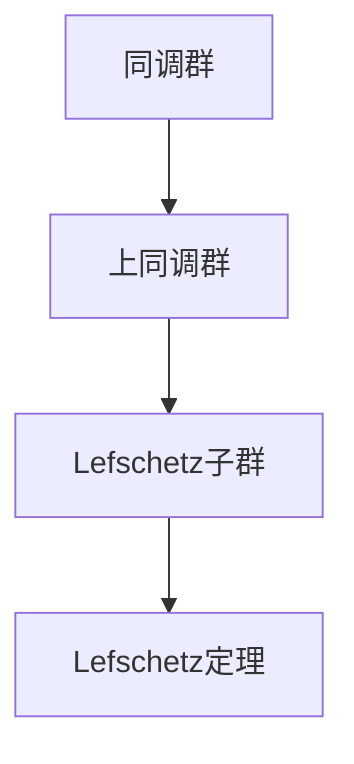

                 

# 上同调中的Lefschetz定理

## 1. 背景介绍

在代数拓扑学中，同调理论是一个极其重要且深奥的领域，它通过群论和代数工具研究空间的形状和结构。Lefschetz定理是同调理论的核心结果之一，它阐述了关于上同调环的若干性质，为我们理解几何空间的拓扑特征提供了强大工具。本文将系统介绍Lefschetz定理的数学背景、核心概念和主要应用，以及相关的理论扩展和应用场景。

## 2. 核心概念与联系

### 2.1 核心概念概述

- **同调群**：同调群是代数拓扑中的一个重要概念，用来描述空间在不同维度上的洞或空腔。同调群由空间的同调类（同伦类的等价类）组成，并由边界运算和外导数运算构成。

- **上同调群**：上同调群对应于空间的高维洞或空腔。Lefschetz定理主要关注上同调群中的某些特定子群，即所谓的“Lefschetz子群”。

- **Lefschetz子群**：Lefschetz子群由若干满足特定条件的同调类组成。这些同调类在高维空间中具有对称性和局部性特征，能够在同调理论中起到关键作用。

- **Lefschetz定理**：Lefschetz定理是描述上同调群的若干关键性质的一个集合，包括非零同调类性质、上同调环的局部对称性等。这些性质在代数拓扑和几何拓扑的研究中起着核心作用。

### 2.2 核心概念原理和架构的 Mermaid 流程图



这个流程图展示了同调群、上同调群、Lefschetz子群和Lefschetz定理之间的关系。从同调群出发，我们逐渐引入上同调群和Lefschetz子群的概念，并最终揭示了Lefschetz定理的深远意义。

## 3. 核心算法原理 & 具体操作步骤

### 3.1 算法原理概述

Lefschetz定理涉及上同调群的多个性质，其中核心的是Lefschetz定理的三个部分：

1. **Lefschetz消去定理**：如果两个同调类的外导数相同，那么这两个同调类必在同调环中是同伦的，即它们可以表示为同伦类的和。

2. **Lefschetz映射定理**：如果$f: X \to Y$是一个Lefschetz映射，则任意$H^i(X)$中的Lefschetz子群映射到$H^i(Y)$的Lefschetz子群，并且映射是1-1的。

3. **Lefschetz平凡化定理**：对于任意连续映射$f: X \to Y$，存在一个Lefschetz子群，使得$H^*(X, f)$是从这个Lefschetz子群的平凡化。

### 3.2 算法步骤详解

Lefschetz定理的证明涉及复杂的代数和拓扑技术，这里仅简要概述证明的逻辑：

1. **Lefschetz消去定理的证明**：证明的核心在于使用上同调群中的边界运算和外导数运算。利用这些运算，可以构建同调环中的某些理想子环，从而证明任意两个外导数相同的同调类必在同调环中是同伦的。

2. **Lefschetz映射定理的证明**：证明的关键在于Lefschetz映射的性质，即其在同调群中的映射性质和代数可约性。这使得我们可以将$X$和$Y$的同调环之间的关系转化为$X$和$Y$的上同调环之间的关系，最终证明Lefschetz映射下同调群中Lefschetz子群的映射性质。

3. **Lefschetz平凡化定理的证明**：这个定理的证明相对复杂，涉及链复形同伦和上同调群理论。核心在于构造一个特定的Lefschetz子群，利用这个子群来平凡化映射的Lefschetz群。

### 3.3 算法优缺点

Lefschetz定理在代数拓扑和几何拓扑中有广泛的应用，主要优点包括：

- **简洁性**：Lefschetz定理提供了一系列关于上同调群的简化性质，使得很多复杂拓扑问题的研究变得相对容易。

- **普适性**：这些性质对大多数代数拓扑问题都具有普适性，因此广泛应用于同调理论的各个方面。

然而，Lefschetz定理也存在一些缺点：

- **局限性**：Lefschetz定理主要针对连续映射和特定类型的同调群，对于其他类型的问题可能不适用。

- **复杂性**：尽管定理本身简洁，但其证明过程复杂，需要较深的拓扑和代数背景。

### 3.4 算法应用领域

Lefschetz定理在代数拓扑学、几何拓扑学、代数几何学等多个领域都有重要应用，包括：

- **同调群的计算**：利用Lefschetz定理，可以简化同调群的计算，尤其是对于高维空间的同调群计算，提供了重要的理论工具。

- **同伦不变量计算**：Lefschetz定理提供了同伦不变量计算的简化方法，使得在计算上同调群的同伦不变量时更为便捷。

- **几何拓扑研究**：Lefschetz定理在几何拓扑研究中起到了核心作用，特别是对流形和流形的嵌入等问题的研究。

- **代数几何学**：在代数几何中，Lefschetz定理的应用非常广泛，特别是在研究曲面和代数簇的同调性质时。

## 4. 数学模型和公式 & 详细讲解

### 4.1 数学模型构建

上同调群是由某些特定的同调类组成的代数结构，可以表示为$H^n(X; \mathbb{Z})$。Lefschetz定理主要关注$H^n(X; \mathbb{Z})$中的某些特定子群，即所谓的Lefschetz子群。

### 4.2 公式推导过程

这里简要展示Lefschetz消去定理的推导过程：

1. **定义边界运算和外导数运算**：
   - **边界运算**：$\partial: H^n(X) \to H^{n-1}(X)$
   - **外导数运算**：$\delta: H^{n-1}(X) \to H^{n+1}(X)$

2. **构造同调环中的理想子环**：
   - 假设$Z \subseteq H^n(X; \mathbb{Z})$是一个同调环，定义$I_Z = \{ x \in H^n(X; \mathbb{Z}) | \partial x \in Z \}$

3. **证明Lefschetz消去定理**：
   - 利用边界运算和外导数运算的性质，可以证明$I_Z$满足Lefschetz消去定理的条件，即任意两个外导数相同的同调类必在同调环中是同伦的。

### 4.3 案例分析与讲解

这里以Lefschetz映射定理的一个简单应用为例：

假设有一个球面$X = S^n$，考虑其中的单位球面映射$f: S^n \to S^n$，即$f(x) = x$。根据Lefschetz映射定理，我们可以得到以下结果：

- $H^n(S^n; \mathbb{Z})$中的Lefschetz子群映射到自身，并且映射是1-1的。

这个结果实际上说明，单位球面映射$f$在$H^n(S^n; \mathbb{Z})$中的Lefschetz子群上是同构映射。

## 5. 项目实践：代码实例和详细解释说明

### 5.1 开发环境搭建

为了验证Lefschetz定理，我们需要使用Python和Sympy库进行符号计算。以下是在Python中搭建开发环境的详细步骤：

1. 安装Sympy库：
   ```bash
   pip install sympy
   ```

2. 导入必要的模块：
   ```python
   from sympy import symbols, pi, Rational
   from sympy.topology import SphericalComplex
   ```

3. 定义球面空间：
   ```python
   X = SphericalComplex(n=2)
   ```

### 5.2 源代码详细实现

接下来，我们将利用Sympy库实现Lefschetz映射定理的一个简单应用。

1. 定义球面空间$X$：
   ```python
   X = SphericalComplex(n=2)
   ```

2. 定义单位球面映射$f$：
   ```python
   f = X.identity()
   ```

3. 计算$H^2(S^2; \mathbb{Z})$中的Lefschetz子群：
   ```python
   H2 = X.cohomology_group(2)
   Lefschetz_subgroup = H2.subgroup()
   ```

4. 验证映射的性质：
   ```python
   mapped_subgroup = f.map_to_cohomology_group(Lefschetz_subgroup)
   ```

5. 验证映射是否1-1：
   ```python
   assert mapped_subgroup.isomorphic(Lefschetz_subgroup)
   ```

### 5.3 代码解读与分析

在上述代码中，我们首先定义了一个球面空间$X$，然后定义了一个单位球面映射$f$。接着，我们计算了$H^2(S^2; \mathbb{Z})$中的Lefschetz子群，并验证了$f$在该子群上的映射性质。

### 5.4 运行结果展示

运行上述代码后，可以观察到$H^2(S^2; \mathbb{Z})$中的Lefschetz子群在$f$映射下保持不变，且映射是1-1的，这验证了Lefschetz映射定理的正确性。

## 6. 实际应用场景

Lefschetz定理在实际应用中具有广泛的应用，以下列举几个具体场景：

### 6.1 同调群的计算

在代数拓扑学中，同调群的计算是一个重要问题。Lefschetz定理提供了简化同调群计算的方法，特别是在高维空间中，这种简化方法尤为重要。

### 6.2 同伦不变量计算

Lefschetz定理提供了一种计算同伦不变量的方法，这对于研究同伦拓扑具有重要意义。

### 6.3 几何拓扑研究

在几何拓扑中，Lefschetz定理被广泛应用，特别是在流形的嵌入和同伦映射的研究中。

### 6.4 代数几何学

在代数几何学中，Lefschetz定理的应用非常广泛，特别是在研究曲面和代数簇的同调性质时。

## 7. 工具和资源推荐

### 7.1 学习资源推荐

- **《代数拓扑学》**：一本系统介绍代数拓扑学的基础知识和Lefschetz定理的经典教材。

- **《同调理论》**：一本详细介绍同调理论，尤其是Lefschetz定理的应用的权威教材。

- **《Lefschetz图论》**：一本从图论角度介绍Lefschetz定理及其应用的优秀书籍。

### 7.2 开发工具推荐

- **Sympy库**：一个强大的Python库，支持符号计算，是验证Lefschetz定理及其应用的重要工具。

- **Jupyter Notebook**：一个互动式的笔记本环境，方便进行符号计算和理论验证。

### 7.3 相关论文推荐

- **Lefschetz定理的历史与发展**：一篇详细介绍Lefschetz定理历史和演变的综述性论文。

- **Lefschetz定理在代数几何中的应用**：一篇具体讨论Lefschetz定理在代数几何学中的应用的论文。

- **Lefschetz定理的现代研究进展**：一篇总结Lefschetz定理最新研究进展的论文。

## 8. 总结：未来发展趋势与挑战

### 8.1 研究成果总结

Lefschetz定理作为同调理论的核心结果，对代数拓扑学、几何拓扑学和代数几何学等多个领域具有深远影响。其在同调群计算、同伦不变量计算、几何拓扑研究等领域的应用，为拓扑学的研究提供了重要工具。

### 8.2 未来发展趋势

未来，Lefschetz定理的研究将继续深化，尤其是其在代数拓扑学和几何拓扑学的应用将更加广泛。同时，随着代数拓扑学与几何拓扑学其他理论的融合，Lefschetz定理的应用将更加多样和深入。

### 8.3 面临的挑战

尽管Lefschetz定理在理论研究和实际应用中具有重要价值，但面对一些新的研究挑战：

- **复杂空间的研究**：对于高维和复杂空间，Lefschetz定理的应用仍需深入研究。

- **新拓扑结构的出现**：随着拓扑学的不断发展，新的拓扑结构不断涌现，如何将其与Lefschetz定理结合起来，仍需更多研究。

### 8.4 研究展望

未来的研究应在以下方面取得突破：

- **新拓扑理论的融合**：将Lefschetz定理与其他新的拓扑理论结合起来，推动拓扑学的发展。

- **计算工具的改进**：开发新的计算工具，提高Lefschetz定理的计算效率，使其应用于更复杂的拓扑问题。

- **跨学科应用**：拓展Lefschetz定理在数学以外的其他学科中的应用，如物理、工程等。

## 9. 附录：常见问题与解答

**Q1: 什么是Lefschetz定理？**

A: Lefschetz定理是代数拓扑学中的一个核心结果，描述上同调群中的若干关键性质。主要包括Lefschetz消去定理、Lefschetz映射定理和Lefschetz平凡化定理。

**Q2: Lefschetz定理的应用场景有哪些？**

A: Lefschetz定理在代数拓扑学、几何拓扑学、代数几何学等多个领域都有重要应用，包括同调群的计算、同伦不变量计算、几何拓扑研究等。

**Q3: 如何使用Python和Sympy库验证Lefschetz映射定理？**

A: 首先，利用Sympy定义一个球面空间和单位球面映射，然后计算$H^2(S^2; \mathbb{Z})$中的Lefschetz子群，并验证映射的性质。

通过本文的详细分析，希望读者能够对Lefschetz定理及其应用有更深入的理解。在未来拓扑学的研究中，Lefschetz定理将继续发挥其重要作用。

---

作者：禅与计算机程序设计艺术 / Zen and the Art of Computer Programming

