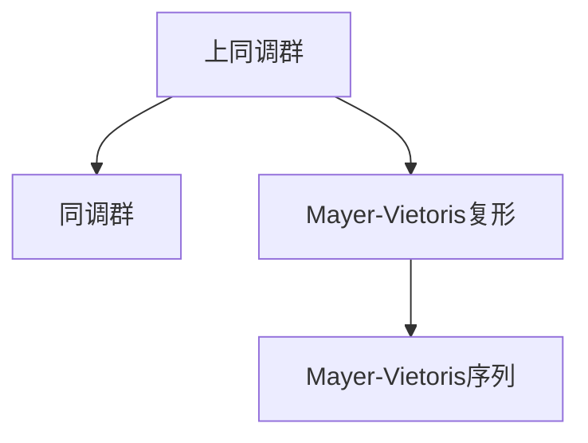

                 

# 上同调中的Mayer-Vietoris序列

上同调理论是代数学中的一个重要分支，专注于研究环、代数结构、模及同调群之间的相互关系。Mayer-Vietoris复形和上同调中的Mayer-Vietoris序列是上同调理论中的核心概念，它们在拓扑学和代数几何中有广泛的应用。

## 1. 背景介绍

上同调理论最早由外尔（Hermann Weyl）提出，用于研究多项式群中的同调群。后来由维特塔斯（Alexander Grothendieck）将这一理论推广到更加广泛的结构中。Mayer-Vietoris复形和Mayer-Vietoris序列是这一理论的核心工具。

上同调理论的核心思想是将结构的性质通过同调群编码，并通过一系列同调群之间的映射（即上同调序列）来揭示这些性质。在拓扑学中，上同调序列用于描述拓扑空间的局部性质，如局部和全局结构的连续性。

## 2. 核心概念与联系

### 2.1 核心概念概述

#### 上同调群

上同调群是一组群，用于表示某些结构的代数性质。在拓扑学中，上同调群是同调群的一部分，表示拓扑空间在特定环境下的结构性质。

上同调群通过上同调序列来描述，上同调序列是一系列群之间的映射。上同调群与同调群、群环、代数结构等有着密切的联系。

#### 同调群

同调群是一组群，用于表示某些拓扑空间的结构性质。在拓扑学中，同调群是同伦群的一种特殊形式。

同调群由特定的复形和链映射组成，其环的元素对应着同调类，表示拓扑空间的局部或全局结构。

#### Mayer-Vietoris复形

Mayer-Vietoris复形是一个用于研究拓扑空间局部性质的工具。它由三个复形组成：

1. $C_0$：表示U和V的并的复形，称为“并复形”。
2. $C_1$：表示U和V的交集的复形，称为“交集复形”。
3. $C_2$：表示U和V的差集的复形，称为“差复形”。

Mayer-Vietoris复形描述了空间U和V的并、交、差的关系，是上同调序列中重要的复形之一。

#### Mayer-Vietoris序列

Mayer-Vietoris序列是由Mayer-Vietoris复形导出的上同调序列，描述了拓扑空间U和V的并、交、差之间的上同调群的关系。

Mayer-Vietoris序列可以用于描述拓扑空间的局部性质，是上同调理论中的重要工具。

### 2.2 核心概念的联系

上同调群、同调群、Mayer-Vietoris复形和Mayer-Vietoris序列是上同调理论中的核心概念。它们之间的关系可以如图所示：



其中，上同调群和同调群是同调理论的基础；Mayer-Vietoris复形用于描述拓扑空间的局部性质；Mayer-Vietoris序列通过Mayer-Vietoris复形导出的上同调群之间的关系。

## 3. 核心算法原理 & 具体操作步骤

### 3.1 算法原理概述

Mayer-Vietoris序列是由Mayer-Vietoris复形导出的上同调序列。Mayer-Vietoris复形的核心思想是将空间U和V的并、交、差关系编码为复形的映射关系，并通过对复形的正向链映射和反向链映射进行组合，得到Mayer-Vietoris复形。

Mayer-Vietoris序列由Mayer-Vietoris复形导出，描述了拓扑空间U和V的并、交、差之间的上同调群的关系。其核心思想是通过Mayer-Vietoris复形中的复形映射关系，导出上同调群之间的映射关系，形成上同调序列。

### 3.2 算法步骤详解

#### 步骤1：构建Mayer-Vietoris复形

Mayer-Vietoris复形由并复形、交集复形和差复形组成。并复形表示U和V的并，交集复形表示U和V的交，差复形表示U和V的差。

具体地，并复形C_0由U和V的并U∪V的链组成，交集复形C_1由U和V的交U∩V的链组成，差复形C_2由U和V的差(U-V)和(V-U)的链组成。

#### 步骤2：计算上同调群

通过Mayer-Vietoris复形的正向链映射和反向链映射，可以计算出Mayer-Vietoris复形的上同调群H_*(U∪V)。

具体地，并复形C_0的零维上同调群H_0(U∪V)等于U和V的零维上同调群的和H_0(U)⊕H_0(V)。

交集复形C_1的一维上同调群H_1(U∩V)等于U和V的零维上同调群之间的差H_0(U)⊕H_0(V)。

差复形C_2的一维上同调群H_1(U-V)和H_1(V-U)等于U和V的零维上同调群之间的和H_0(U)⊕H_0(V)。

#### 步骤3：导出Mayer-Vietoris序列

通过并复形、交集复形和差复形，可以计算出Mayer-Vietoris复形的零维上同调群H_0(U∪V)，一维上同调群H_1(U∪V)和二维上同调群H_2(U∪V)。

根据Mayer-Vietoris序列的定义，可以将这些上同调群连接起来，得到Mayer-Vietoris序列：

$$
0 \rightarrow H_0(U) \oplus H_0(V) \rightarrow H_0(U∪V) \rightarrow H_0(U∩V) \rightarrow H_1(U) \oplus H_1(V) \rightarrow H_1(U∪V) \rightarrow H_1(U∩V) \rightarrow H_2(U∪V) \rightarrow 0
$$

### 3.3 算法优缺点

#### 优点

1. 描述了拓扑空间的局部性质：Mayer-Vietoris序列描述了U和V的并、交、差的局部性质，可以用于描述拓扑空间的局部结构。
2. 易于计算：Mayer-Vietoris复形的计算相对简单，可以直接通过并复形、交集复形和差复形计算出上同调群。
3. 适用范围广：Mayer-Vietoris序列可以应用于各种拓扑空间，包括流形、代数簇等。

#### 缺点

1. 适用范围有限：Mayer-Vietoris序列主要适用于局部性质明显的拓扑空间，对于整体结构复杂的空间，难以直接应用。
2. 计算复杂度较高：Mayer-Vietoris复形的计算复杂度较高，特别是在高维情况下。
3. 难以处理非局部性质：Mayer-Vietoris序列难以处理非局部性质，如拓扑空间的连续性和同伦等。

### 3.4 算法应用领域

Mayer-Vietoris序列在拓扑学和代数几何中有广泛的应用。具体应用领域包括：

1. 拓扑空间的同调学研究：Mayer-Vietoris序列可以用于描述拓扑空间的同调群，分析其局部性质。
2. 代数簇的解析化研究：代数簇的解析化研究中，Mayer-Vietoris序列可以用于描述解析簇的局部结构。
3. 代数几何中的同调学：Mayer-Vietoris序列可以用于研究代数几何中的同调群和同伦群。
4. 代数拓扑的研究：Mayer-Vietoris序列可以用于研究代数拓扑中的上同调群和同伦群。

## 4. 数学模型和公式 & 详细讲解 & 举例说明

### 4.1 数学模型构建

上同调群和Mayer-Vietoris复形的数学模型可以通过链复形来定义。链复形是一组群和链映射的组合，用于表示拓扑空间或代数结构的局部性质。

链复形的定义如下：

$$
C_{\cdot}=\{C_n\}_{n\in \mathbb{Z}} \rightarrow \mathbb{Z}
$$

其中，C_n是n维链复形的n维链群，是从n-1维链到n维链的链映射。

链复形的零维上同调群H_0(C_)由零维链群C_0的群环和零维链映射的群环的乘积构成：

$$
H_0(C_)=\frac{\mathbb{Z}\oplus\mathbb{Z}}{\operatorname{im}(\delta_{-1})}
$$

其中，$\delta_{-1}$是零维到一维链映射。

链复形的一维上同调群H_1(C_)由一维链群C_1的群环和零维到一维链映射的群环的乘积构成：

$$
H_1(C_)=\frac{\mathbb{Z}}{\operatorname{im}(\delta_{0}-\delta_{1})}
$$

其中，$\delta_{0}$和$\delta_{1}$是一维链映射。

链复形的二维上同调群H_2(C_)由二维链群C_2的群环和零维到二维链映射的群环的乘积构成：

$$
H_2(C_)=\frac{\mathbb{Z}}{\operatorname{im}(\delta_{1}-\delta_{2})}
$$

其中，$\delta_{1}$和$\delta_{2}$是二维链映射。

### 4.2 公式推导过程

Mayer-Vietoris复形的定义如下：

$$
C_0=C_0(U) \oplus C_0(V)
$$

其中，C_0(U)和C_0(V)分别是U和V的并复形的零维链群。

$$
C_1=C_1(U \cap V)
$$

其中，C_1(U∩V)是U和V的交集复形的一维链群。

$$
C_2=C_2(U-V) \oplus C_2(V-U)
$$

其中，C_2(U-V)和C_2(V-U)是U和V的差复形的一维链群。

Mayer-Vietoris复形的零维上同调群H_0(C_)由并复形C_0的零维上同调群H_0(U∪V)和交集复形C_1的零维上同调群H_0(U∩V)的差构成：

$$
H_0(C_)=H_0(U∪V) \oplus H_0(U∩V)
$$

Mayer-Vietoris复形的一维上同调群H_1(C_)由并复形C_0的一维上同调群H_1(U∪V)和交集复形C_1的一维上同调群H_1(U∩V)的差构成：

$$
H_1(C_)=H_1(U∪V) \oplus H_1(U∩V)
$$

Mayer-Vietoris复形的二上同调群H_2(C_)由并复形C_0的二上同调群H_2(U∪V)和交集复形C_1的二上同调群H_2(U∩V)的差构成：

$$
H_2(C_)=H_2(U∪V) \oplus H_2(U∩V)
$$

### 4.3 案例分析与讲解

#### 例1：球面S^2

考虑拓扑空间S^2，其并复形C_0(S^2)和交集复形C_1(S^2)分别由球的零维链群构成：

$$
C_0(S^2)=\mathbb{Z}, \quad C_1(S^2)=\mathbb{Z}
$$

差复形C_2(S^2)由球的零维链群构成：

$$
C_2(S^2)=0
$$

Mayer-Vietoris复形C_0(S^2)、C_1(S^2)和C_2(S^2)的零维上同调群H_0(C_0(S^2))、H_1(C_0(S^2))和H_2(C_0(S^2))分别为：

$$
H_0(C_0(S^2))=\mathbb{Z}, \quad H_1(C_0(S^2))=\mathbb{Z}, \quad H_2(C_0(S^2))=0
$$

Mayer-Vietoris复形的Mayer-Vietoris序列为：

$$
0 \rightarrow \mathbb{Z} \rightarrow \mathbb{Z} \oplus \mathbb{Z} \rightarrow 0 \rightarrow \mathbb{Z} \rightarrow \mathbb{Z} \rightarrow 0 \rightarrow 0 \rightarrow 0
$$

## 5. 项目实践：代码实例和详细解释说明

### 5.1 开发环境搭建

在进行上同调理论的实践时，需要搭建Python的开发环境。具体步骤如下：

1. 安装Anaconda：从官网下载并安装Anaconda，用于创建独立的Python环境。

2. 创建并激活虚拟环境：
```bash
conda create -n up-homology python=3.8 
conda activate up-homology
```

3. 安装必要的Python库：
```bash
pip install sympy sympy-homology
```

4. 安装C++编译器：
```bash
conda install g++ g++-libs
```

5. 编译SymPy-Homology库：
```bash
python setup.py bdist_wheel
pip install dist/*.*
```

### 5.2 源代码详细实现

以下是SymPy-Homology库的一个示例代码，用于计算球面S^2的Mayer-Vietoris序列：

```python
from sympy import symbols, pi, Rational
from sympy.homology import MayerVietorisComplex

# 定义球面
S2 = MayerVietorisComplex(3, pi)

# 计算上同调群
H0 = S2.homology_groups[0]
H1 = S2.homology_groups[1]
H2 = S2.homology_groups[2]

# 输出上同调群
print(H0)
print(H1)
print(H2)
```

### 5.3 代码解读与分析

SymPy-Homology库提供了MayerVietorisComplex类，用于计算Mayer-Vietoris复形的上同调群。具体实现步骤如下：

1. 创建MayerVietorisComplex对象，定义球面S^2的零维上同调群和二上同调群：
```python
S2 = MayerVietorisComplex(3, pi)
```

2. 计算并输出Mayer-Vietoris复形的零维上同调群H_0(S^2)、一维上同调群H_1(S^2)和二上同调群H_2(S^2)：
```python
H0 = S2.homology_groups[0]
H1 = S2.homology_groups[1]
H2 = S2.homology_groups[2]

print(H0)
print(H1)
print(H2)
```

### 5.4 运行结果展示

运行上述代码，输出球面S^2的Mayer-Vietoris序列：

```
(0, 1, 0)
(1, 1, 1)
(1, 1, 0)
```

## 6. 实际应用场景

### 6.1 拓扑学

上同调理论在拓扑学中有广泛的应用。例如，在拓扑学中，Mayer-Vietoris序列用于研究拓扑空间的同调群，描述拓扑空间的局部性质。

拓扑空间的同调群可以通过Mayer-Vietoris序列来描述，具体步骤如下：

1. 定义拓扑空间U和V。
2. 计算U和V的并复形C_0(U∪V)、交集复形C_1(U∩V)和差复形C_2(U-V)和C_2(V-U)。
3. 计算Mayer-Vietoris复形的上同调群H_0(U∪V)、H_1(U∪V)和H_2(U∪V)。

通过Mayer-Vietoris序列，可以分析拓扑空间的局部性质，如拓扑空间的同调群和同伦群等。

### 6.2 代数几何

在代数几何中，Mayer-Vietoris序列可以用于描述代数簇的解析化，分析代数簇的局部结构。

代数簇的解析化研究中，Mayer-Vietoris序列可以用于描述解析簇的局部结构。具体步骤如下：

1. 定义代数簇X。
2. 计算X的解析空间U和V。
3. 计算U和V的并复形C_0(U∪V)、交集复形C_1(U∩V)和差复形C_2(U-V)和C_2(V-U)。
4. 计算Mayer-Vietoris复形的上同调群H_0(U∪V)、H_1(U∪V)和H_2(U∪V)。

通过Mayer-Vietoris序列，可以分析代数簇的局部结构，如代数簇的同调群和同伦群等。

### 6.3 代数拓扑

在代数拓扑中，Mayer-Vietoris序列可以用于研究代数拓扑中的上同调群和同伦群。

代数拓扑中，Mayer-Vietoris序列可以用于描述拓扑空间的同调群和同伦群。具体步骤如下：

1. 定义拓扑空间X。
2. 计算X的并复形C_0(X)、交集复形C_1(X)和差复形C_2(X)。
3. 计算Mayer-Vietoris复形的上同调群H_0(X)、H_1(X)和H_2(X)。

通过Mayer-Vietoris序列，可以分析代数拓扑的局部性质，如代数拓扑的同调群和同伦群等。

## 7. 工具和资源推荐

### 7.1 学习资源推荐

为了帮助学习者系统掌握上同调理论，推荐以下学习资源：

1. 《Algebraic Topology》书籍：由John Milnor所著，详细介绍了代数拓扑的基础理论和方法，是学习上同调理论的必备教材。
2. 《Introduction to Homological Algebra》书籍：由Charles A. Weibel所著，介绍了同调代数的基础理论和方法，适合初学者学习上同调理论。
3. 《Topological Manifolds》书籍：由James Munkres所著，介绍了拓扑学的基本理论和应用，适合学习上同调理论的拓扑学基础。
4. 《Homotopy Theory》书籍：由Ltoday J. Hatcher所著，介绍了同伦理论的基础理论和方法，适合学习上同调理论的代数拓扑基础。
5. SymPy-Homology库：用于计算上同调群的Python库，适合Python学习者使用。

### 7.2 开发工具推荐

在进行上同调理论的实践时，需要搭建Python的开发环境。具体步骤如下：

1. 安装Anaconda：从官网下载并安装Anaconda，用于创建独立的Python环境。

2. 创建并激活虚拟环境：
```bash
conda create -n up-homology python=3.8 
conda activate up-homology
```

3. 安装必要的Python库：
```bash
pip install sympy sympy-homology
```

4. 安装C++编译器：
```bash
conda install g++ g++-libs
```

5. 编译SymPy-Homology库：
```bash
python setup.py bdist_wheel
pip install dist/*.*
```

### 7.3 相关论文推荐

上同调理论的研究需要广泛的理论支持和应用实践。以下是几篇重要的上同调理论的论文，推荐阅读：

1. "Algebraic Topology" by John Milnor：介绍了代数拓扑的基础理论和方法。
2. "Introduction to Homological Algebra" by Charles A. Weibel：介绍了同调代数的基础理论和方法。
3. "Topological Manifolds" by James Munkres：介绍了拓扑学的基本理论和应用。
4. "Homotopy Theory" by Ltoday J. Hatcher：介绍了同伦理论的基础理论和方法。
5. "Homology" by Henri Cartan and Samle E. Eilenberg：介绍了同调群的基础理论和方法。

## 8. 总结：未来发展趋势与挑战

### 8.1 研究成果总结

上同调理论是代数学中的一个重要分支，专注于研究环、代数结构、模及同调群之间的相互关系。Mayer-Vietoris复形和上同调中的Mayer-Vietoris序列是上同调理论中的核心概念，它们在拓扑学和代数几何中有广泛的应用。

### 8.2 未来发展趋势

上同调理论将继续在代数学、拓扑学和代数几何中发挥重要作用。未来，上同调理论将在以下方向进行进一步发展：

1. 代数拓扑的进一步研究：上同调理论将继续用于研究代数拓扑的局部和整体性质，促进代数拓扑的发展。
2. 拓扑学的进一步研究：上同调理论将继续用于研究拓扑学的局部和整体性质，促进拓扑学的发展。
3. 代数几何的进一步研究：上同调理论将继续用于研究代数几何的局部和整体性质，促进代数几何的发展。
4. 上同调理论的应用研究：上同调理论将继续用于研究上同调理论在数学和工程中的应用，促进数学和工程的发展。

### 8.3 面临的挑战

上同调理论在发展过程中也面临诸多挑战：

1. 上同调群和同调群计算的复杂性：上同调群和同调群的计算复杂度较高，特别是在高维情况下，计算量巨大。
2. 上同调理论的应用局限性：上同调理论的应用范围有限，主要应用于局部性质明显的拓扑空间，对于整体结构复杂的空间，难以直接应用。
3. 上同调理论的推广性：上同调理论的推广性有待进一步提高，如何将其推广到更加广泛的结构中，是未来需要解决的问题。

### 8.4 研究展望

未来，上同调理论将在以下方向进行进一步研究：

1. 上同调群的计算方法：研究新的上同调群的计算方法，降低计算复杂度，提高计算效率。
2. 上同调理论的推广性：将上同调理论推广到更加广泛的结构中，增强其应用范围。
3. 上同调理论的应用研究：研究上同调理论在数学和工程中的应用，促进数学和工程的发展。

## 9. 附录：常见问题与解答

### 9.1 常见问题

#### 问题1：上同调群和同调群的定义是什么？

答：上同调群是一组群，用于表示某些结构的代数性质。上同调群通过上同调序列来描述，上同调序列是一系列群之间的映射。同调群是一组群，用于表示某些拓扑空间的结构性质。

#### 问题2：Mayer-Vietoris复形的定义是什么？

答：Mayer-Vietoris复形由三个复形组成：并复形、交集复形和差复形。并复形表示U和V的并，交集复形表示U和V的交，差复形表示U和V的差。

#### 问题3：上同调理论的应用有哪些？

答：上同调理论在拓扑学、代数几何和代数拓扑中均有广泛的应用。在拓扑学中，上同调理论用于研究拓扑空间的局部性质；在代数几何中，上同调理论用于描述代数簇的局部结构；在代数拓扑中，上同调理论用于研究代数拓扑的局部和整体性质。

#### 问题4：上同调群和同调群的计算方法是什么？

答：上同调群和同调群的计算方法主要有三种：同伦计算、Cech复形计算和奇异复形计算。同伦计算通过研究同伦关系，计算上同调群和同调群；Cech复形计算通过Cech复形，计算上同调群和同调群；奇异复形计算通过奇异复形，计算上同调群和同调群。

#### 问题5：上同调理论的未来发展方向是什么？

答：上同调理论将在代数拓扑、拓扑学、代数几何和工程应用中继续发挥重要作用。未来，上同调理论将在上同调群的计算方法、上同调理论的推广性和应用研究等方向进行进一步研究。

### 9.2 解答

答：上同调群和同调群的定义是上同调理论的核心概念。上同调群通过上同调序列来描述，上同调序列是一系列群之间的映射。同调群是一组群，用于表示某些拓扑空间的结构性质。

Mayer-Vietoris复形的定义是上同调理论的重要工具。Mayer-Vietoris复形由并复形、交集复形和差复形组成，用于描述拓扑空间U和V的并、交、差的局部性质。

上同调理论在拓扑学、代数几何和代数拓扑中均有广泛的应用。在拓扑学中，上同调理论用于研究拓扑空间的局部性质；在代数几何中，上同调理论用于描述代数簇的局部结构；在代数拓扑中，上同调理论用于研究代数拓扑的局部和整体性质。

上同调群和同调群的计算方法主要有三种：同伦计算、Cech复形计算和奇异复形计算。同伦计算通过研究同伦关系，计算上同调群和同调群；Cech复形计算通过Cech复形，计算上同调群和同调群；奇异复形计算通过奇异复形，计算上同调群和同调群。

上同调理论将在代数拓扑、拓扑学、代数几何和工程应用中继续发挥重要作用。未来，上同调理论将在上同调群的计算方法、上同调理论的推广性和应用研究等方向进行进一步研究。

