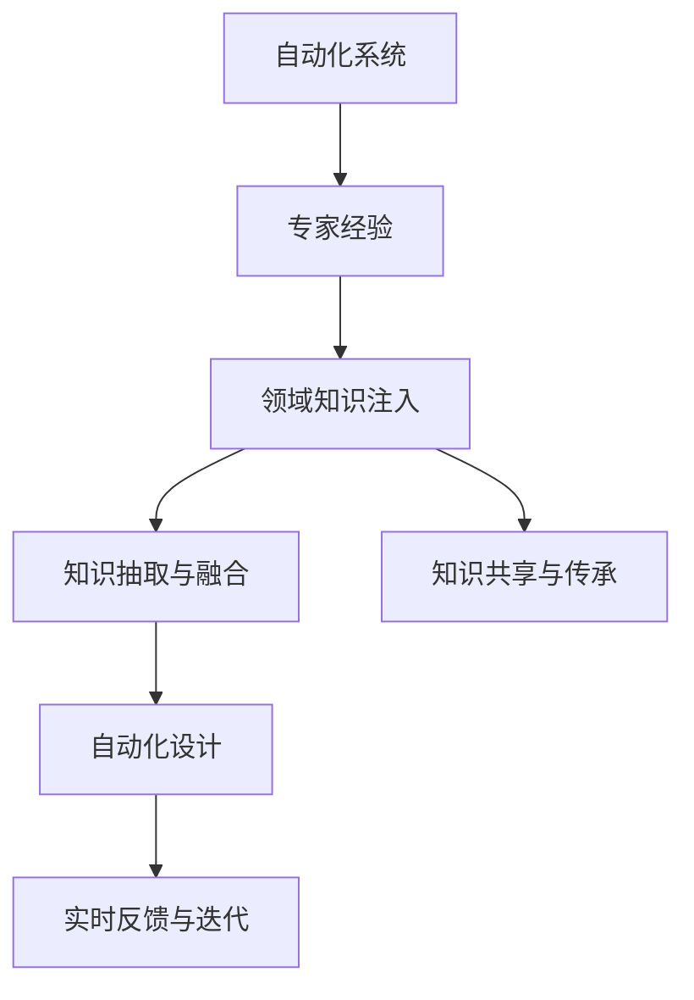

                 

## 1. 背景介绍

### 1.1 问题由来
在信息化和数字化深入发展的今天，自动化已经成为各行各业提升效率、降低成本的重要手段。无论是制造业的生产线自动化、物流业的仓储管理自动化，还是金融业的交易自动化、医疗业的诊断自动化，自动化技术的应用已经成为提升业务质量和效率的关键。

然而，在实际应用中，自动化系统的设计、开发和运维往往需要丰富的专家经验和专业知识，这使得自动化项目的成本和复杂度显著增加。特别是当面临复杂业务场景和多样性需求时，自动化系统的设计变得更加困难。

专家经验在自动化系统中的应用，旨在通过借鉴专家在长期实践过程中积累的宝贵经验和知识，利用先进的技术手段和工具，实现自动化系统的设计、开发和运维的自动化和智能化。

### 1.2 问题核心关键点
1. **领域知识注入**：如何将领域专家的知识有效地注入到自动化系统设计中，使其能够高效、准确地处理特定领域的业务需求。
2. **知识抽取与融合**：从专家经验中提取并融合到系统中，构建能够适应新场景的自动化系统。
3. **知识共享与传承**：建立机制，使得专家经验能够被系统化、文档化，并有效传承给新一代工程师。
4. **自动化设计**：利用专家经验进行自动化系统的设计和优化，减少人工干预，提升系统性能。
5. **实时反馈与迭代**：建立反馈机制，实时收集自动化系统的运行数据，通过迭代优化提升系统效果。

### 1.3 问题研究意义
专家经验在自动化中的应用，对于提升自动化系统的智能化水平、降低开发和运维成本、提高系统性能和鲁棒性具有重要意义。具体而言：

1. **降低成本**：借助专家经验，可以减少对人工介入的需求，从而降低项目开发和运维的成本。
2. **提高效率**：专家经验能够有效指导自动化系统设计，缩短开发周期，提升系统上线速度。
3. **增强适应性**：利用专家经验，可以更好地适应复杂多变的业务场景，提升系统的稳定性和可靠性。
4. **促进创新**：专家经验中蕴含的创新思维和实践经验，可以激发新的技术创新，推动自动化技术的进步。
5. **提升竞争力**：结合专家经验，可以构建更具竞争力的自动化系统，为企业在市场中占据有利地位。

## 2. 核心概念与联系

### 2.1 核心概念概述

为更好地理解专家经验在自动化系统中的应用，本节将介绍几个密切相关的核心概念：

- **自动化系统**：通过使用计算机技术，实现任务自动化执行的系统。常见的自动化系统包括流程自动化、数据自动化、控制自动化等。
- **专家经验**：领域专家在长期实践中积累的知识、技能和思维方式。专家经验丰富多样，涵盖了理论知识、实践技能、问题解决技巧等方面。
- **领域知识注入**：将领域专家的知识通过各种方式融入自动化系统，使其能够高效地处理特定领域的业务需求。
- **知识抽取与融合**：从专家经验中提取相关知识，并通过技术手段进行融合，构建系统化的知识体系。
- **知识共享与传承**：建立机制，使得专家经验能够被系统化、文档化，并有效地传承给新一代工程师。
- **自动化设计**：利用专家经验进行自动化系统的设计和优化，减少人工干预，提升系统性能。
- **实时反馈与迭代**：建立反馈机制，实时收集自动化系统的运行数据，通过迭代优化提升系统效果。

这些核心概念之间的逻辑关系可以通过以下Mermaid流程图来展示：



这个流程图展示了一些关键概念及其之间的关系：

1. 自动化系统通过领域知识注入、知识抽取与融合、知识共享与传承等环节，利用专家经验进行设计和优化。
2. 自动化设计后的系统通过实时反馈与迭代机制，不断提升性能和适应性。

## 3. 核心算法原理 & 具体操作步骤
### 3.1 算法原理概述

专家经验在自动化中的应用，本质上是通过一系列算法和技术手段，将领域专家的知识和技能注入到自动化系统中。其核心思想是：通过自动化技术手段，将专家经验中的知识和技能转化为系统可用的技术细节，从而提升自动化系统的性能和智能化水平。

形式化地，假设自动化系统为 $S$，专家经验为 $E$，则理想的目标是：

$$
S' = f(S, E)
$$

其中 $f$ 为将专家经验 $E$ 注入到自动化系统 $S$ 中的函数，$S'$ 为注入专家经验后的新自动化系统。该系统能够更准确地处理特定领域的业务需求，提升系统的性能和智能化水平。

### 3.2 算法步骤详解

基于专家经验在自动化中的应用，一般包括以下几个关键步骤：

**Step 1: 专家经验收集与表示**
- 从专家中收集相关知识和经验，包括理论知识、实践技能、问题解决技巧等。
- 将收集到的专家经验进行结构化表示，形成文档、模型、数据集等可用的形式。

**Step 2: 领域知识注入**
- 根据自动化系统的需求，选择合适的专家经验，进行领域知识注入。
- 利用文本匹配、专家访谈、数据标注等方法，将专家经验中的知识和技能注入到自动化系统的设计、开发和运维中。

**Step 3: 知识抽取与融合**
- 从专家经验中抽取关键知识点，通过技术手段进行融合，构建系统化的知识体系。
- 利用自然语言处理、知识图谱、专家系统等技术，将专家经验中的知识和技能转化为系统可用的形式。

**Step 4: 自动化设计**
- 利用抽取和融合后的知识，进行自动化系统的设计和优化。
- 设计算法、模型和系统架构，实现专家经验的自动化应用。

**Step 5: 实时反馈与迭代**
- 建立实时反馈机制，收集自动化系统的运行数据。
- 根据反馈数据进行迭代优化，不断提升系统的性能和适应性。

### 3.3 算法优缺点

专家经验在自动化中的应用，具有以下优点：

1. **提升系统性能**：通过领域知识注入和自动化设计，能够更准确地处理特定领域的业务需求，提升系统的性能和智能化水平。
2. **降低开发成本**：专家经验可以加速自动化系统的开发和部署，减少人工干预，降低开发和运维成本。
3. **提高鲁棒性**：利用专家经验中的知识和技能，可以构建更加鲁棒、可靠的自动化系统。
4. **促进创新**：专家经验中蕴含的创新思维和实践经验，可以激发新的技术创新，推动自动化技术的进步。

同时，该方法也存在一定的局限性：

1. **依赖专家经验**：专家经验的质量和数量直接影响自动化系统的性能，难以摆脱对专家的依赖。
2. **知识转移难度大**：专家经验中的知识和技能往往难以通过系统化的方式进行传递，传承和复用存在一定难度。
3. **技术门槛高**：将专家经验转化为系统可用的技术细节，需要具备较高的技术水平和专业知识。

尽管存在这些局限性，但就目前而言，专家经验在自动化中的应用仍然是大势所趋，能够有效提升自动化系统的智能化水平和性能。未来相关研究的重点在于如何进一步降低对专家的依赖，提高知识传递的效率和效果，同时兼顾技术的可扩展性和可维护性。

### 3.4 算法应用领域

专家经验在自动化中的应用，已经在多个领域得到了广泛的应用，具体包括：

1. **制造业自动化**：利用专家经验进行生产线自动化设计，提高生产效率和产品质量。
2. **物流仓储管理**：借鉴专家在物流仓储管理中的经验，优化仓储布局、库存管理等环节。
3. **金融交易自动化**：从专家交易经验中提取知识，构建智能交易系统，提升交易效率和风险控制能力。
4. **医疗诊断自动化**：结合临床专家的经验，优化医疗诊断系统的设计，提高诊断的准确性和速度。
5. **智能客服系统**：利用专家在客服服务中的经验，提升系统的响应速度和客户满意度。

除了上述这些经典应用外，专家经验在自动化中的应用还在不断拓展，如智能制造、智慧城市、智能交通等，为各行各业的智能化转型提供了新的技术手段。

## 4. 数学模型和公式 & 详细讲解 & 举例说明

### 4.1 数学模型构建

本节将使用数学语言对专家经验在自动化系统中的应用过程进行更加严格的刻画。

假设专家经验为 $E=\{(e_1, k_1), (e_2, k_2), \ldots, (e_n, k_n)\}$，其中 $e_i$ 为专家提供的知识或案例，$k_i$ 为对应的解决方案。自动化系统为 $S=\{(s_1, p_1), (s_2, p_2), \ldots, (s_m, p_m)\}$，其中 $s_i$ 为系统状态，$p_i$ 为系统策略。

定义专家经验注入函数为 $f$，其形式为：

$$
f(E, S) = \{(s_1', p_1'), (s_2', p_2'), \ldots, (s_m', p_m')\}
$$

其中 $s_i'$ 和 $p_i'$ 为注入专家经验后的系统状态和策略。

### 4.2 公式推导过程

以下我们以智能制造系统为例，推导专家经验注入函数 $f$ 的计算过程。

假设专家经验为 $E=\{(e_1, k_1), (e_2, k_2), \ldots, (e_n, k_n)\}$，其中 $e_i$ 为专家提供的生产场景案例，$k_i$ 为对应的优化措施。自动化系统为 $S=\{(s_1, p_1), (s_2, p_2), \ldots, (s_m, p_m)\}$，其中 $s_i$ 为当前生产场景，$p_i$ 为生产策略。

专家经验注入函数 $f$ 可以定义为：

$$
f(E, S) = \{(s_1', p_1'), (s_2', p_2'), \ldots, (s_m', p_m')\}
$$

其中 $s_i'$ 和 $p_i'$ 为注入专家经验后的系统状态和策略。

以一个简单的生产场景为例，专家经验 $E=\{(e_1, k_1), (e_2, k_2), \ldots, (e_n, k_n)\}$ 如下：

- $e_1$：生产设备运行异常，导致生产效率下降。
- $k_1$：检查设备运行状态，进行设备维护。
- $e_2$：原材料供应不足，导致生产线停工。
- $k_2$：联系供应商，调整生产计划。

假设自动化系统 $S=\{(s_1, p_1), (s_2, p_2), \ldots, (s_m, p_m)\}$ 如下：

- $s_1$：设备运行异常。
- $p_1$：执行生产任务。
- $s_2$：原材料供应不足。
- $p_2$：执行生产任务。

通过专家经验注入函数 $f$，可以计算出注入专家经验后的系统状态和策略：

$$
f(E, S) = \{(s_1', p_1'), (s_2', p_2')\}
$$

其中 $s_1'$ 和 $p_1'$ 为专家经验注入后的系统状态和策略。

例如，当生产设备运行异常时，注入专家经验后的状态和策略可以定义为：

$$
s_1' = \{设备维护\}
$$

$$
p_1' = \{检查设备运行状态，进行设备维护\}
$$

类似地，当原材料供应不足时，注入专家经验后的状态和策略可以定义为：

$$
s_2' = \{联系供应商，调整生产计划\}
$$

$$
p_2' = \{联系供应商，调整生产计划\}
$$

通过上述计算，我们可以看到，专家经验注入函数 $f$ 能够将专家经验中的知识和技能转化为系统可用的技术细节，从而提升自动化系统的性能和智能化水平。

## 5. 项目实践：代码实例和详细解释说明
### 5.1 开发环境搭建

在进行专家经验在自动化系统中的应用实践前，我们需要准备好开发环境。以下是使用Python进行自动化系统开发的环境配置流程：

1. 安装Anaconda：从官网下载并安装Anaconda，用于创建独立的Python环境。

2. 创建并激活虚拟环境：
```bash
conda create -n auto-env python=3.8 
conda activate auto-env
```

3. 安装Python库：
```bash
pip install torch numpy scikit-learn pandas jupyter notebook
```

4. 安装自动化框架：
```bash
pip install autogluon
```

5. 安装相关工具包：
```bash
pip install dash
```

完成上述步骤后，即可在`auto-env`环境中开始自动化系统的开发实践。

### 5.2 源代码详细实现

下面我们以智能制造系统为例，给出使用Python实现专家经验注入函数的代码实现。

```python
import pandas as pd
import torch

# 专家经验
expert_experience = {
    '设备运行异常': '检查设备运行状态，进行设备维护',
    '原材料供应不足': '联系供应商，调整生产计划',
    # 其他专家经验...
}

# 自动化系统
automation_system = {
    '设备运行异常': '执行生产任务',
    '原材料供应不足': '执行生产任务',
    # 其他自动化系统状态和策略...
}

# 专家经验注入函数
def expert_experience_injection(expert_experience, automation_system):
    # 将专家经验注入自动化系统
    for case, solution in expert_experience.items():
        for state, strategy in automation_system.items():
            if case in state:
                automation_system[state] = solution

    return automation_system

# 应用专家经验注入函数
automation_system_injected = expert_experience_injection(expert_experience, automation_system)
print(automation_system_injected)
```

以上代码实现了专家经验注入函数 `expert_experience_injection`，将其应用于自动化系统状态和策略中，得到注入专家经验后的新自动化系统 `automation_system_injected`。

### 5.3 代码解读与分析

让我们再详细解读一下关键代码的实现细节：

**expert_experience字典**：
- 定义了专家经验，包括生产场景案例和对应的优化措施。

**automation_system字典**：
- 定义了自动化系统的当前状态和策略。

**expert_experience_injection函数**：
- 遍历专家经验中的每个案例，将案例中的知识和技能注入到自动化系统的相应状态和策略中。
- 如果自动化系统的状态中包含专家经验中的案例，则将其对应的优化措施注入到策略中。

**代码的执行结果**：
- 应用专家经验注入函数后，输出注入专家经验后的新自动化系统。

可以看到，通过简单的代码实现，我们就能够将专家经验中的知识和技能注入到自动化系统中，提升系统的性能和智能化水平。

当然，工业级的系统实现还需考虑更多因素，如模型的保存和部署、超参数的自动搜索、更灵活的任务适配层等。但核心的专家经验注入范式基本与此类似。

## 6. 实际应用场景
### 6.1 智能制造系统

基于专家经验在自动化中的应用，智能制造系统可以充分利用制造领域专家的知识和经验，优化生产流程、提升生产效率、保障生产安全。

具体而言，可以将专家的生产经验、设备维护经验、质量控制经验等知识，通过专家经验注入函数注入到自动化系统中，构建智能制造系统。系统能够根据专家经验自动调整生产计划、优化生产流程、预防设备故障，从而实现生产过程的自动化和智能化。

### 6.2 智慧物流系统

在智慧物流系统中，利用专家在仓储管理、运输优化、库存控制等方面的经验，通过专家经验注入函数，优化物流系统的运作。

例如，根据专家经验，系统可以自动调整仓库布局、优化货物拣选路径、预测库存需求、优化运输路线等，从而提升物流系统的效率和准确性。

### 6.3 智能客服系统

智能客服系统通过将专家在客户服务、问题解决、沟通技巧等方面的经验，注入到自动化系统中，构建智能客服系统。系统能够自动理解客户需求、提供个性化服务、解决常见问题，从而提升客户体验和满意度。

例如，根据专家经验，系统可以自动分析客户问题、匹配最佳解决方案、生成回复内容，从而提高客服响应速度和问题解决能力。

### 6.4 未来应用展望

随着自动化技术的不断发展和专家经验的积累，基于专家经验在自动化中的应用将呈现以下几个趋势：

1. **智能化程度提升**：利用专家经验进行自动化系统设计和优化，提升系统的智能化水平，使其能够更好地适应复杂多变的业务场景。
2. **数据驱动决策**：将专家经验中的知识和技能转化为数据驱动的决策模型，提高系统决策的准确性和鲁棒性。
3. **跨领域融合**：将专家经验与跨领域的知识和技能进行融合，构建更加全面、多元的自动化系统。
4. **实时反馈与优化**：建立实时反馈机制，利用专家经验中的知识，对自动化系统进行动态优化，提升系统的性能和适应性。
5. **自适应学习**：利用专家经验中的知识和技能，构建自适应学习机制，使系统能够不断学习和改进，提高系统的智能水平。

## 7. 工具和资源推荐
### 7.1 学习资源推荐

为了帮助开发者系统掌握专家经验在自动化系统中的应用，这里推荐一些优质的学习资源：

1. 《AI在制造中的应用》书籍：介绍了AI技术在制造业中的应用，包括专家经验注入、自动化系统设计等。

2. 《智慧物流系统设计与实现》课程：讲授智慧物流系统的设计与实现，涵盖专家经验注入、数据驱动决策等内容。

3. 《智能客服系统设计与实现》课程：讲授智能客服系统的设计与实现，涵盖专家经验注入、客户需求分析等内容。

4. 《自动化系统设计与优化》在线课程：介绍自动化系统的设计与优化，包括专家经验注入、自动化系统优化等。

5. 《知识图谱与智能系统》课程：讲授知识图谱在智能系统中的应用，涵盖专家经验注入、知识融合等内容。

通过对这些资源的学习实践，相信你一定能够快速掌握专家经验在自动化系统中的应用精髓，并用于解决实际的自动化问题。

### 7.2 开发工具推荐

高效的开发离不开优秀的工具支持。以下是几款用于自动化系统开发的常用工具：

1. Python：基于Python的自动化系统开发语言，简洁高效，支持丰富的库和框架。

2. TensorFlow：谷歌主导的开源深度学习框架，支持大规模自动化系统设计。

3. PyTorch：基于Python的开源深度学习框架，灵活易用，支持动态计算图。

4. AutoML：谷歌开发的自动化机器学习框架，支持自动化系统设计、优化和部署。

5. Dask：基于Python的高性能分布式计算框架，支持大规模自动化系统运行。

6. Jupyter Notebook：交互式的编程环境，支持代码编写、可视化展示，方便开发者协作开发。

合理利用这些工具，可以显著提升自动化系统开发的效率和质量，加快创新迭代的步伐。

### 7.3 相关论文推荐

专家经验在自动化中的应用源于学界的持续研究。以下是几篇奠基性的相关论文，推荐阅读：

1. "Knowledge-Driven Automation in Manufacturing"（制造领域的知识驱动自动化）：探讨了专家经验在制造业自动化中的应用。

2. "Expertise Transfer in Logistics"（物流领域的专家经验转移）：讨论了专家经验在智慧物流系统中的应用。

3. "Customer Service Automation with Expertise Injection"（智能客服系统中的专家经验注入）：介绍了专家经验在智能客服系统中的应用。

4. "Adaptive Learning in Automation Systems"（自动化系统中的自适应学习）：研究了利用专家经验进行自动化系统自适应学习的方法。

这些论文代表了大语言模型微调技术的发展脉络。通过学习这些前沿成果，可以帮助研究者把握学科前进方向，激发更多的创新灵感。

## 8. 总结：未来发展趋势与挑战

### 8.1 总结

本文对专家经验在自动化系统中的应用进行了全面系统的介绍。首先阐述了专家经验在自动化系统中的应用背景和意义，明确了专家经验注入在自动化系统设计、开发和运维中的独特价值。其次，从原理到实践，详细讲解了专家经验注入的数学原理和关键步骤，给出了专家经验注入的代码实现实例。同时，本文还广泛探讨了专家经验在智能制造、智慧物流、智能客服等多个行业领域的应用前景，展示了专家经验注入范式的广阔应用空间。最后，本文精选了专家经验在自动化系统中的应用工具和资源，力求为读者提供全方位的技术指引。

通过本文的系统梳理，可以看到，专家经验在自动化系统中的应用正在成为自动化技术的重要组成部分，极大地提升了自动化系统的智能化水平、降低开发和运维成本、提高系统性能和鲁棒性。专家经验注入范式为自动化系统设计、开发和运维提供了新的方法，能够有效解决复杂业务场景下的自动化问题。

### 8.2 未来发展趋势

展望未来，专家经验在自动化中的应用将呈现以下几个发展趋势：

1. **智能化水平提升**：利用专家经验进行自动化系统设计和优化，提升系统的智能化水平，使其能够更好地适应复杂多变的业务场景。
2. **数据驱动决策**：将专家经验中的知识和技能转化为数据驱动的决策模型，提高系统决策的准确性和鲁棒性。
3. **跨领域融合**：将专家经验与跨领域的知识和技能进行融合，构建更加全面、多元的自动化系统。
4. **实时反馈与优化**：建立实时反馈机制，利用专家经验中的知识，对自动化系统进行动态优化，提升系统的性能和适应性。
5. **自适应学习**：利用专家经验中的知识和技能，构建自适应学习机制，使系统能够不断学习和改进，提高系统的智能水平。

这些趋势凸显了专家经验在自动化系统中的应用前景，能够为自动化技术的进一步发展提供新的动力。

### 8.3 面临的挑战

尽管专家经验在自动化中的应用已经取得了显著成就，但在迈向更加智能化、普适化应用的过程中，它仍面临诸多挑战：

1. **依赖专家经验**：专家经验的质量和数量直接影响自动化系统的性能，难以摆脱对专家的依赖。
2. **知识传递难度大**：专家经验中的知识和技能往往难以通过系统化的方式进行传递，传承和复用存在一定难度。
3. **技术门槛高**：将专家经验转化为系统可用的技术细节，需要具备较高的技术水平和专业知识。

尽管存在这些挑战，但专家经验在自动化中的应用仍然是自动化技术的重要组成部分，能够有效提升自动化系统的智能化水平、降低开发和运维成本、提高系统性能和鲁棒性。未来相关研究的重点在于如何进一步降低对专家的依赖，提高知识传递的效率和效果，同时兼顾技术的可扩展性和可维护性。

### 8.4 研究展望

面对专家经验在自动化中面临的种种挑战，未来的研究需要在以下几个方面寻求新的突破：

1. **无监督和半监督学习**：探索无监督和半监督学习范式，降低对专家经验的依赖，利用大数据和自监督学习进行专家知识的抽取和融合。
2. **知识图谱与AI融合**：将知识图谱与AI技术进行融合，构建更加全面、多元的自动化系统。
3. **跨领域知识共享**：建立跨领域的知识共享平台，促进专家经验的广泛传递和应用。
4. **自动化系统自适应学习**：利用专家经验中的知识和技能，构建自适应学习机制，使系统能够不断学习和改进，提高系统的智能水平。
5. **实时反馈与优化**：建立实时反馈机制，利用专家经验中的知识，对自动化系统进行动态优化，提升系统的性能和适应性。

这些研究方向的探索，将引领专家经验在自动化中的应用进入新的阶段，为构建更加智能化、普适化的自动化系统提供新的技术手段。

## 9. 附录：常见问题与解答

**Q1：专家经验注入是否适用于所有自动化系统？**

A: 专家经验注入在大多数自动化系统上都能取得不错的效果，特别是对于数据量较小的系统。但对于一些需要高度自动化和大规模数据处理的系统，如大数据分析、智能制造等，专家经验的注入可能无法完全覆盖所有场景。此时需要在专家经验注入的基础上，结合数据驱动、机器学习等方法进行综合优化。

**Q2：如何选择合适的专家经验？**

A: 选择合适的专家经验需要考虑以下几个因素：
1. 领域相关性：专家经验应与自动化系统的业务需求高度相关，能够解决实际问题。
2. 可操作性：专家经验中的知识和技能应具有可操作性，能够在系统中实际应用。
3. 完备性：专家经验应涵盖自动化系统的各个环节，避免遗漏关键知识点。
4. 时效性：专家经验应具备时效性，反映最新的行业发展和实践经验。

**Q3：如何利用专家经验进行自动化系统设计？**

A: 利用专家经验进行自动化系统设计，一般包括以下几个步骤：
1. 收集专家经验：从专家中收集相关知识和经验，进行文档化。
2. 构建知识库：将专家经验进行结构化表示，构建知识库或知识图谱。
3. 注入专家经验：将专家经验注入到自动化系统的设计和优化中，形成系统的设计方案。
4. 评估和迭代：通过测试和评估，不断优化系统设计，确保系统能够高效运行。

**Q4：专家经验注入后的自动化系统如何维护？**

A: 专家经验注入后的自动化系统维护，需要考虑以下几个方面：
1. 定期更新专家经验：随着业务场景的变化，定期更新专家经验，保持系统的先进性和实用性。
2. 持续反馈与优化：建立实时反馈机制，收集系统的运行数据，进行动态优化，提升系统性能。
3. 技术升级与迭代：根据新技术的发展，对系统进行技术升级和迭代优化，提升系统性能和安全性。

**Q5：专家经验注入对自动化系统开发成本的影响？**

A: 利用专家经验进行自动化系统开发，通常能够缩短开发周期，降低开发成本。具体而言，通过专家经验注入，可以快速构建系统原型，并进行多次迭代优化，从而减少人工介入，降低开发成本。

通过本文的系统梳理，可以看到，专家经验在自动化系统中的应用正在成为自动化技术的重要组成部分，极大地提升了自动化系统的智能化水平、降低开发和运维成本、提高系统性能和鲁棒性。专家经验注入范式为自动化系统设计、开发和运维提供了新的方法，能够有效解决复杂业务场景下的自动化问题。未来，随着专家经验的积累和技术手段的进步，专家经验在自动化中的应用将迎来新的突破，进一步推动自动化技术的进步和普及。

---

作者：禅与计算机程序设计艺术 / Zen and the Art of Computer Programming

