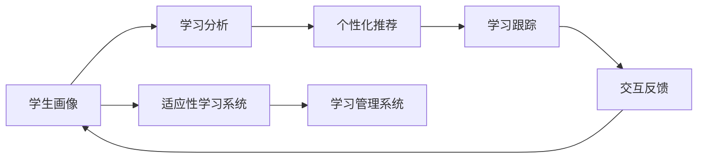

                 

## 1. 背景介绍

### 1.1 问题由来

在传统的教育体系中，教师根据统一的教学大纲和课程安排，向全体学生传递相同的知识。然而，学生的学习能力、兴趣和需求存在显著差异。这种"一刀切"的教育方式难以满足每个学生的个性化需求，导致学习效率低下，部分学生无法充分发挥潜力。为了解决这一问题，个性化教育应运而生，旨在通过了解每个学生的特点和需求，提供量身定制的学习计划，以促进学生的全面发展。

### 1.2 问题核心关键点

个性化教育的核心在于通过数据分析和机器学习技术，精确地识别每个学生的学习特点和需求，并据此设计个性化的学习计划。具体来说，主要包括以下几个关键点：

1. **学生画像**：构建包含学生基础信息、学习行为、成绩表现等多维度的详细画像。
2. **学习分析**：利用数据挖掘和机器学习技术，分析学生学习过程中的模式和规律。
3. **个性化推荐**：根据学习分析结果，为学生推荐个性化的学习内容、学习方式和评价标准。
4. **学习跟踪**：实时监控学生的学习进度和效果，调整学习计划以适应学生的变化。
5. **交互反馈**：建立与学生的双向互动机制，及时获取反馈并改进个性化推荐策略。

### 1.3 问题研究意义

个性化教育的研究和实践，对于提升教育质量、促进教育公平具有重要意义：

1. **提升学习效率**：通过个性化学习，针对每个学生的特点进行差异化教学，显著提升学习效率。
2. **促进全面发展**：个性化教育关注学生的综合素质，而不仅仅是考试成绩，有助于全面提升学生的认知能力、情感和社交技能。
3. **实现教育公平**：个性化教育能够针对每个学生的独特需求提供相应的支持，缩小不同学生之间的学习差距。
4. **推动技术进步**：个性化教育的研究需要借助大数据、人工智能等前沿技术，促进相关技术的进步和应用。
5. **助力终身学习**：个性化教育为学生提供了终身学习的可能性，帮助他们在不同阶段实现持续成长和发展。

## 2. 核心概念与联系

### 2.1 核心概念概述

为了更好地理解个性化教育的核心概念及其相互联系，本节将详细介绍相关的几个核心概念：

- **学生画像(Student Profile)**：详细记录学生的各项特征，如年龄、性别、兴趣、学习习惯等。
- **学习分析(Learning Analytics)**：通过分析学生的学习数据，识别其学习模式、兴趣点、知识掌握情况等。
- **个性化推荐(Personalized Recommendation)**：根据学生画像和学习分析结果，推荐个性化的学习内容和路径。
- **学习跟踪(Learning Tracking)**：实时监控学生的学习进度和效果，调整学习计划以适应学生的变化。
- **交互反馈(Interactive Feedback)**：通过各种方式（如问卷、测试、交互式任务）获取学生的反馈，改进个性化推荐。
- **适应性学习系统(Adaptive Learning System)**：一个能够根据学生的学习情况动态调整学习内容和难度，提供个性化反馈的系统。
- **学习管理系统(Learning Management System, LMS)**：一个集成学习资源、管理学习过程、支持个性化推荐和跟踪的平台。

这些核心概念之间的逻辑关系可以通过以下Mermaid流程图来展示：



这个流程图展示了一系列核心概念之间的相互关系：

1. 学生画像通过学习分析被用于个性化推荐，最终通过学习跟踪和交互反馈不断优化。
2. 适应性学习系统整合了个性化推荐和学习跟踪，根据学生的反馈调整推荐策略。
3. 学习管理系统集成所有功能和组件，为个性化教育提供完整的技术支撑。

## 3. 核心算法原理 & 具体操作步骤
### 3.1 算法原理概述

个性化教育的实现，依赖于机器学习算法对学生数据进行分析，并据此设计个性化的学习计划。常用的算法包括聚类分析、协同过滤、内容推荐算法等。其核心原理是通过对大量学生数据的分析，识别出学生之间的共性特征和个体差异，从而进行个性化的推荐和跟踪。

### 3.2 算法步骤详解

基于机器学习的个性化教育主要包括以下几个步骤：

**Step 1: 数据收集与预处理**

- 收集学生的各种基础信息和学习数据，如年龄、性别、成绩、学习时间等。
- 对数据进行清洗和标准化，去除噪声和异常值，确保数据的准确性和一致性。

**Step 2: 特征工程**

- 根据收集的数据，设计合适的特征表示，如学生兴趣、学习风格、认知能力等。
- 使用主成分分析(PCA)等方法对特征进行降维，减少数据维度，提高计算效率。

**Step 3: 学习分析**

- 利用聚类算法（如K-Means）将学生划分为不同的群组，识别出学习模式和规律。
- 应用协同过滤算法（如ALS）分析学生的学习行为，预测其未来的学习表现。

**Step 4: 个性化推荐**

- 根据学生的学习分析和特征，利用推荐算法（如基于内容的推荐、协同过滤推荐等）生成个性化的学习计划。
- 动态调整学习内容和难度，确保学生能够保持在合适的学习水平。

**Step 5: 学习跟踪**

- 实时监控学生的学习进度和效果，使用学习管理系统记录学习活动。
- 通过数据可视化工具（如Tableau、Power BI）展示学习进度，帮助学生和教师及时调整学习计划。

**Step 6: 交互反馈**

- 通过在线问卷、测试和互动任务等形式，收集学生的反馈。
- 利用自然语言处理(NLP)技术对学生反馈进行情感分析和主题识别，改进推荐策略。

**Step 7: 系统优化**

- 根据学生的反馈和学习数据，周期性地调整算法参数和推荐策略。
- 引入最新的机器学习模型和算法，提升系统的准确性和鲁棒性。

### 3.3 算法优缺点

基于机器学习的个性化教育算法具有以下优点：

1. **高效性**：通过自动化分析学生数据，快速生成个性化的学习计划，节省了大量时间和人力。
2. **精准性**：利用先进算法和技术，能够精准识别学生的学习特点和需求，提供更加个性化的学习建议。
3. **可扩展性**：算法框架可以适应不同规模的学校和教育场景，易于推广和部署。

同时，这些算法也存在一定的局限性：

1. **数据依赖性强**：个性化教育的效果依赖于高质量、多样化的学生数据，数据的获取和处理难度较大。
2. **算法复杂度高**：一些高级算法（如深度学习、强化学习）对计算资源和时间的要求较高，可能不适合所有教育场景。
3. **学生隐私问题**：学生数据的收集和处理涉及到隐私保护，需要严格的数据管理和监管措施。
4. **公平性问题**：个性化推荐可能导致资源分配不均，需要关注算法的公平性和透明性。

### 3.4 算法应用领域

基于机器学习的个性化教育算法已经在多个领域得到应用，具体包括：

- **K-12教育**：为中小学生提供个性化的学习资源和路径，提高学习效率。
- **高等教育**：帮助大学生选择适合的课程和科研项目，提升学习效果。
- **职业培训**：为成人提供个性化的职业培训计划，提升职业技能。
- **在线教育**：利用机器学习算法优化在线课程内容和推荐，提高用户满意度。
- **语言学习**：通过个性化推荐和跟踪，帮助学生提高语言学习效率。
- **游戏化学习**：利用游戏元素和机器学习算法，增强学习动机和效果。

## 4. 数学模型和公式 & 详细讲解 & 举例说明

### 4.1 数学模型构建

为了更准确地描述个性化教育的数学模型，我们将使用数学语言对核心算法进行详细阐述。

假设我们有一个学生集合 $S=\{s_1,s_2,\cdots,s_N\}$，每个学生 $s_i$ 有 $n$ 项特征 $x_{i1},x_{i2},\cdots,x_{in}$。我们希望通过学习算法 $A$ 来构建一个学生画像 $P_i$，用于个性化推荐和跟踪。

定义学生画像的数学模型为：

$$
P_i = f(x_{i1},x_{i2},\cdots,x_{in})
$$

其中 $f$ 是一个映射函数，将特征映射为学生画像。

### 4.2 公式推导过程

以协同过滤推荐算法为例，假设我们收集了 $M$ 个学生 $S_M$ 和 $N$ 个课程 $C_N$ 的数据。每个学生对每个课程的学习行为 $r_{mi}$ 可以通过以下矩阵表示：

$$
R \in \mathbb{R}^{M \times N}
$$

其中 $R_{m,n}=r_{mn}$ 表示学生 $m$ 对课程 $n$ 的学习行为。

协同过滤算法的基本思想是找到与目标学生 $s_i$ 相似的学生 $s_j$，然后根据相似学生 $s_j$ 对课程的评分，预测目标学生 $s_i$ 对课程的评分。设 $r_{mn}$ 表示学生 $m$ 对课程 $n$ 的评分，则目标学生 $s_i$ 对课程 $n$ 的预测评分可以通过以下公式计算：

$$
\hat{r}_{in} = \sum_{j=1}^{M} \alpha_{ij} r_{in}
$$

其中 $\alpha_{ij}$ 表示学生 $i$ 和学生 $j$ 之间的相似度系数，可以使用余弦相似度、皮尔逊相关系数等方法计算。

### 4.3 案例分析与讲解

以推荐系统为例，假设我们有一个在线课程平台，收集了 10000 名学生和 1000 门课程的评分数据。我们使用协同过滤算法对目标学生 $s_i$ 进行推荐。

首先，计算学生 $s_i$ 与每个学生的相似度，得到相似度矩阵 $\alpha$。然后，根据相似度矩阵计算学生 $s_i$ 对每门课程的预测评分，选择评分最高的前 10 门课程进行推荐。

具体步骤如下：

1. 计算相似度矩阵 $\alpha$。
2. 根据相似度矩阵计算每门课程的预测评分。
3. 选取评分最高的前 10 门课程，推荐给学生 $s_i$。

通过这种方式，平台可以根据每个学生的学习行为和偏好，提供个性化的课程推荐，提升学生的学习效率和满意度。

## 5. 项目实践：代码实例和详细解释说明

### 5.1 开发环境搭建

在进行个性化教育系统的开发前，我们需要准备好开发环境。以下是使用Python进行项目开发的环境配置流程：

1. 安装Anaconda：从官网下载并安装Anaconda，用于创建独立的Python环境。

2. 创建并激活虚拟环境：
```bash
conda create -n adaptive-learn-env python=3.8 
conda activate adaptive-learn-env
```

3. 安装Python库：
```bash
pip install numpy pandas scikit-learn pyspark flair transformers
```

4. 安装Spark：
```bash
wget http://dowload.apache.org/maven/spark/spark-core/3.0.3/spark-core-3.0.3.tgz
tar -xzf spark-core-3.0.3.tgz
cd spark-core-3.0.3
./bin/spark-submit --master local[*] --py files/example.py
```

完成上述步骤后，即可在`adaptive-learn-env`环境中开始项目实践。

### 5.2 源代码详细实现

下面以在线课程推荐系统为例，给出使用Python和Spark进行个性化推荐的具体代码实现。

首先，定义推荐系统的数据结构：

```python
from pyspark import SparkContext, SparkConf

class Student:
    def __init__(self, id, features):
        self.id = id
        self.features = features

class Course:
    def __init__(self, id, features):
        self.id = id
        self.features = features

# 创建Spark Context
conf = SparkConf().setAppName("Adaptive Learning Recommendation System")
sc = SparkContext(conf=conf)
```

然后，定义推荐算法的核心函数：

```python
from pyspark.ml.recommendation import ALS

def collaborative_filtering(train_data, num_factors, iterations):
    # 创建ALS模型
    als = ALS(k=num_factors, iterations=iterations, userCol="user_id", itemCol="course_id", ratingCol="rating")
    
    # 训练模型
    als_model = als.fit(train_data)
    
    # 预测推荐评分
    predicted_ratings = als_model.transform(train_data)
    return predicted_ratings
```

最后，启动Spark任务并运行推荐系统：

```python
# 读取训练数据
train_data = sc.textFile("train_data.txt")

# 数据预处理
train_data = train_data.map(lambda line: line.split(","))
train_data = train_data.map(lambda line: (int(line[0]), int(line[1]), float(line[2])))

# 定义特征工程
def feature_vector(row):
    return row

train_data = train_data.map(feature_vector)

# 定义推荐算法
predicted_ratings = collaborative_filtering(train_data, num_factors=10, iterations=10)

# 输出推荐结果
predicted_ratings.collect()
```

以上就是使用Python和Spark进行在线课程推荐系统的代码实现。可以看到，通过Spark的高效计算能力和丰富的机器学习库，推荐系统的开发变得简洁高效。

### 5.3 代码解读与分析

让我们再详细解读一下关键代码的实现细节：

**Spark Context**：
- 通过SparkConf和SparkContext创建Spark环境，支持分布式计算。

**数据结构**：
- 定义Student和Course类，用于表示学生和课程的基本信息。

**推荐算法**：
- 使用ALS算法进行协同过滤推荐，将学生和课程的评分矩阵作为输入，输出推荐评分矩阵。
- 通过调整num_factors和iterations参数，控制模型的复杂度和训练次数。

**数据预处理**：
- 将原始文本数据转换为NumPy数组，方便进行特征处理。
- 使用特征工程函数，将特征向量映射为列表。
- 将特征向量封装为Student和Course对象，方便Spark操作。

**推荐流程**：
- 读取训练数据，并进行数据预处理。
- 调用推荐算法，训练模型并输出推荐评分矩阵。
- 收集推荐结果，并打印输出。

通过Spark的分布式计算能力，可以在大规模数据集上进行高效的协同过滤推荐。未来，还可以通过引入深度学习等高级算法，进一步提升推荐系统的性能和准确性。

## 6. 实际应用场景

### 6.1 智能学习平台

基于个性化教育的推荐系统，可以广泛应用于智能学习平台，为学生提供个性化的学习资源和路径。传统学习平台通常只能提供统一的课程和资料，难以满足每个学生的个性化需求。通过机器学习算法，智能学习平台可以分析学生的学习行为和偏好，推荐最适合的学习内容和方式，提高学生的学习效率和效果。

在技术实现上，智能学习平台可以集成多种学习资源，如视频、文章、练习题等，并利用推荐算法为学生定制个性化的学习计划。同时，平台还可以根据学生的反馈和学习进度，动态调整推荐策略，确保学生能够始终保持在合适的学习水平。

### 6.2 个性化教材推荐

传统的教材推荐主要依赖教师的经验和主观判断，难以实现大规模的个性化推荐。基于机器学习的个性化教育系统，可以通过分析学生的学习数据和评价反馈，推荐最适合的教材和学习资源。例如，根据学生的学习进度和理解情况，推荐适合的补充阅读材料和习题集，帮助学生巩固和深化所学知识。

在实际应用中，可以利用在线课程平台的数据，使用推荐算法生成个性化的教材推荐列表。学生可以根据推荐结果，选择适合自己的学习材料，进一步提升学习效果。

### 6.3 职业培训与再教育

在职业培训和再教育领域，个性化教育同样具有广阔的应用前景。传统的职业培训通常采用统一的培训课程和标准化的教学方法，难以满足不同学员的个性化需求。通过个性化教育系统，可以根据学员的学习背景、职业目标和工作需求，提供量身定制的培训计划和资源。

例如，在职业培训中，系统可以根据学员的学习进度和测试结果，动态调整课程难度和内容，确保学员能够掌握关键技能。同时，系统还可以根据学员的职业目标，推荐相关的职业课程和认证项目，提升学员的职业竞争力。

### 6.4 未来应用展望

随着技术的不断发展，个性化教育将在更多领域得到应用，为教育提供全新的解决方案。未来，以下趋势值得关注：

1. **多模态数据融合**：将文本、图像、视频等多种数据类型结合起来，提供更加丰富的学习体验和推荐效果。
2. **深度学习与强化学习**：结合深度学习和强化学习算法，提升推荐系统的精准性和灵活性。
3. **自适应学习路径**：根据学生的学习进度和表现，动态调整学习路径和难度，提供个性化的学习建议。
4. **在线社交学习**：利用社交网络和协同过滤技术，增强学生的学习互动和合作，提升学习效果。
5. **智能教学辅助**：利用虚拟助手和智能答疑系统，提供实时学习支持和个性化反馈，增强学习体验。
6. **持续学习与进化**：利用机器学习模型进行持续学习，不断更新推荐策略和教学资源，保持系统的最新性。

总之，个性化教育将推动教育领域的技术进步和创新，为每个学生提供量身定制的学习体验，提升教育质量和学习效率。

## 7. 工具和资源推荐

### 7.1 学习资源推荐

为了帮助开发者系统掌握个性化教育的理论基础和实践技巧，这里推荐一些优质的学习资源：

1. 《数据科学与机器学习》（Data Science and Machine Learning for Statistical Learning）：由UCLA的统计学教授编写的教材，全面介绍了机器学习的基本概念和算法。
2. Coursera《机器学习》（Machine Learning）：斯坦福大学的机器学习课程，涵盖了监督学习、非监督学习、深度学习等多个领域。
3. Kaggle：全球最大的数据科学竞赛平台，提供丰富的数据集和竞赛，帮助你实践机器学习算法。
4. DeepLearning.AI的Master Program in AI：深度学习领域权威的硕士课程，涵盖多个前沿课题和应用领域。
5. Fast.ai：以实战为主导的深度学习课程，通过实践项目帮助学生掌握机器学习技能。

通过这些资源的学习实践，相信你一定能够快速掌握个性化教育的核心技术和实践方法，并用于解决实际的个性化学习问题。

### 7.2 开发工具推荐

高效的开发离不开优秀的工具支持。以下是几款用于个性化教育开发的常用工具：

1. Python：作为数据科学和机器学习的主流语言，Python提供了丰富的科学计算库和机器学习库，如NumPy、Pandas、Scikit-learn、TensorFlow等。
2. Spark：由Apache基金会开发的分布式计算框架，支持大规模数据处理和机器学习任务。
3. Jupyter Notebook：一个交互式的编程环境，支持实时展示计算结果和代码执行过程。
4. PyTorch：由Facebook开发的深度学习框架，提供了高效的张量操作和动态计算图。
5. TensorBoard：用于可视化机器学习模型的训练和推理过程，方便调试和优化。
6. Weights & Biases：模型训练的实验跟踪工具，可以记录和可视化模型训练过程中的各项指标，方便对比和调优。

合理利用这些工具，可以显著提升个性化教育开发的效率，加速创新迭代的步伐。

### 7.3 相关论文推荐

个性化教育的研究源于学界的持续研究。以下是几篇奠基性的相关论文，推荐阅读：

1. 《个性化学习: 一个系统综述》（Personalized Learning: A Systematic Review）：对个性化学习的概念、方法和效果进行了全面综述。
2. 《机器学习在个性化教育中的应用》（Machine Learning in Personalized Education）：介绍了机器学习在个性化教育中的各种应用场景和效果。
3. 《自适应学习系统: 技术、评价和应用》（Adaptive Learning Systems: Technology, Evaluation, and Applications）：介绍了自适应学习系统的技术实现和应用案例。
4. 《深度学习在个性化教育中的应用》（Deep Learning in Personalized Education）：介绍了深度学习在个性化教育中的各种应用和技术。
5. 《个性化推荐系统的研究进展》（Research Progress in Personalized Recommendation Systems）：对个性化推荐系统的技术进展和应用效果进行了综述。

这些论文代表了大规模学习系统的研究进展，为个性化教育的实践提供了宝贵的理论和实践指导。

## 8. 总结：未来发展趋势与挑战

### 8.1 总结

本文对个性化教育的实现方法进行了全面系统的介绍。首先阐述了个性化教育的背景、核心关键点和研究意义，明确了个性化教育在提升学习效率、促进教育公平等方面的独特价值。其次，从原理到实践，详细讲解了个性化教育的数学模型和核心算法，并给出了项目开发的完整代码实现。同时，本文还广泛探讨了个性化教育在智能学习平台、个性化教材推荐、职业培训等多个行业领域的应用前景，展示了个性化教育技术的广阔前景。

通过本文的系统梳理，可以看到，个性化教育的研究和实践已经取得了显著进展，未来将在更多领域得到应用，为每个学生提供量身定制的学习体验，提升教育质量和学习效率。

### 8.2 未来发展趋势

展望未来，个性化教育的实现将呈现以下几个发展趋势：

1. **技术融合**：个性化教育将与其他技术（如大数据、人工智能、区块链等）进行深入融合，形成更加全面、灵活的教育体系。
2. **多模态学习**：将文本、图像、视频等多种数据类型结合起来，提供更加丰富的学习体验和推荐效果。
3. **深度学习与强化学习**：结合深度学习和强化学习算法，提升推荐系统的精准性和灵活性。
4. **自适应学习路径**：根据学生的学习进度和表现，动态调整学习路径和难度，提供个性化的学习建议。
5. **在线社交学习**：利用社交网络和协同过滤技术，增强学生的学习互动和合作，提升学习效果。
6. **智能教学辅助**：利用虚拟助手和智能答疑系统，提供实时学习支持和个性化反馈，增强学习体验。
7. **持续学习与进化**：利用机器学习模型进行持续学习，不断更新推荐策略和教学资源，保持系统的最新性。

以上趋势凸显了个性化教育技术的广阔前景。这些方向的探索发展，必将进一步提升教育质量和学习效率，为每个学生提供量身定制的学习体验，推动教育事业的进步。

### 8.3 面临的挑战

尽管个性化教育的研究和实践已经取得了显著进展，但在迈向更加智能化、普适化应用的过程中，它仍面临着诸多挑战：

1. **数据质量问题**：个性化教育依赖于高质量、多样化的学生数据，数据的获取和处理难度较大。
2. **算法复杂度**：一些高级算法（如深度学习、强化学习）对计算资源和时间的要求较高，可能不适合所有教育场景。
3. **学生隐私问题**：学生数据的收集和处理涉及到隐私保护，需要严格的数据管理和监管措施。
4. **公平性问题**：个性化推荐可能导致资源分配不均，需要关注算法的公平性和透明性。
5. **教师角色的转变**：教师需要从传统的知识传授者转变为学习指导者和支持者，可能需要更多的培训和支持。
6. **技术依赖性**：过度依赖技术可能忽视教育的核心价值，需要平衡技术与人文的关系。

正视这些挑战，积极应对并寻求突破，将是个性化教育走向成熟的必由之路。相信随着学界和产业界的共同努力，这些挑战终将一一被克服，个性化教育必将在构建人机协同的智能时代中扮演越来越重要的角色。

### 8.4 研究展望

面对个性化教育所面临的挑战，未来的研究需要在以下几个方面寻求新的突破：

1. **探索无监督和半监督学习**：摆脱对大规模标注数据的依赖，利用自监督学习、主动学习等无监督和半监督范式，最大限度利用非结构化数据，实现更加灵活高效的个性化学习。
2. **研究参数高效和计算高效的个性化学习算法**：开发更加参数高效的个性化学习算法，在固定大部分预训练参数的情况下，只更新极少量的任务相关参数。同时优化学习算法的计算图，减少前向传播和反向传播的资源消耗，实现更加轻量级、实时性的学习。
3. **融合因果和对比学习范式**：通过引入因果推断和对比学习思想，增强个性化学习建立稳定因果关系的能力，学习更加普适、鲁棒的学习表征，从而提升学习泛化性和抗干扰能力。
4. **引入更多先验知识**：将符号化的先验知识，如知识图谱、逻辑规则等，与神经网络模型进行巧妙融合，引导个性化学习过程学习更准确、合理的知识表示。同时加强不同模态数据的整合，实现视觉、语音等多模态信息与文本信息的协同建模。
5. **结合因果分析和博弈论工具**：将因果分析方法引入个性化学习模型，识别出学习决策的关键特征，增强学习输出的因果性和逻辑性。借助博弈论工具刻画人机交互过程，主动探索并规避学习系统的脆弱点，提高系统稳定性。
6. **纳入伦理道德约束**：在个性化学习目标中引入伦理导向的评估指标，过滤和惩罚有偏见、有害的学习内容，确保学习的安全性。同时加强人工干预和审核，建立学习行为的监管机制，确保学习符合人类价值观和伦理道德。

这些研究方向的探索，必将引领个性化学习技术迈向更高的台阶，为构建安全、可靠、可解释、可控的智能学习系统铺平道路。面向未来，个性化学习技术还需要与其他人工智能技术进行更深入的融合，如知识表示、因果推理、强化学习等，多路径协同发力，共同推动教育事业的进步。只有勇于创新、敢于突破，才能不断拓展个性化学习的边界，让智能技术更好地造福人类社会。

## 9. 附录：常见问题与解答

**Q1：个性化教育是否适合所有教育场景？**

A: 个性化教育在面向大规模和多样化的学生群体时，具有显著优势。然而，对于某些特殊场景，如小型班级或私人教学，个性化教育的优势可能不明显。

**Q2：个性化教育是否会导致过度个性化？**

A: 个性化教育旨在根据学生的特点和需求提供量身定制的个性化学习方案，但过度个性化可能导致学生陷入孤立和同质化，缺乏交流和合作的机会。因此，需要在个性化和社交性之间找到平衡点。

**Q3：个性化教育是否会增加教学成本？**

A: 虽然个性化教育需要一定的技术投入，但从长远来看，通过提高学习效率和效果，可以显著降低教育成本。同时，技术的普及和应用也能降低个性化教育的成本。

**Q4：个性化教育是否会影响学生的自主学习能力？**

A: 个性化教育注重学生的自主学习，通过数据驱动的方式引导学生发现自身兴趣和不足，从而提升学习效率和效果。然而，过度依赖技术可能削弱学生的自主思考能力，需要在技术与人文之间找到平衡。

**Q5：个性化教育是否会引发隐私问题？**

A: 个性化教育需要收集和处理大量的学生数据，可能涉及到隐私保护问题。需要严格的数据管理和监管措施，确保学生数据的安全和隐私。

通过这些问题的解答，相信你能够更全面地了解个性化教育的优势和局限，更好地规划和实施个性化教育项目。

---

作者：禅与计算机程序设计艺术 / Zen and the Art of Computer Programming

