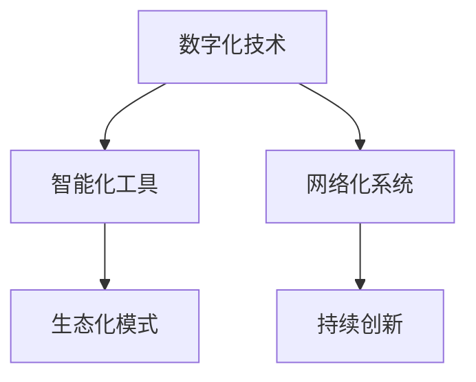

                 

# 中国现代化的重要引擎：新质生产力

在当今信息时代的背景下，新质生产力已成为推动中国现代化发展的关键引擎。新质生产力不仅指的是新技术在生产力中的广泛应用，更涉及通过创新驱动经济、社会、科技等领域全面升级的深远影响。本文将深入探讨新质生产力的核心概念、原理及其实际应用场景，为政策制定者、企业决策者和研究者提供有价值的参考。

## 1. 背景介绍

### 1.1 问题的由来

随着全球经济一体化进程的加速和数字化转型的推进，新质生产力在各个领域的展现逐渐成为热点话题。数字化、网络化、智能化、自动化等技术的融合应用，正在重塑传统产业结构，推动经济增长。新质生产力不仅意味着生产效率的提升，更代表着产业升级和创新驱动发展的新方向。

### 1.2 问题核心关键点

新质生产力的关键在于“新”和“质”。“新”在于技术创新与融合，“质”在于生产方式的根本变革和效率提升。新质生产力不仅涉及硬件设备和软件工具的更新，更关乎生产流程、组织管理和市场战略的创新。本文将从新质生产力的定义、核心要素、驱动机制和实际应用四个方面进行详细阐述。

## 2. 核心概念与联系

### 2.1 核心概念概述

新质生产力包括但不限于以下几个关键要素：

- **数字化技术**：指通过数字化的方式进行数据处理和信息管理，提升生产效率和质量。
- **智能化工具**：包括自动化设备、机器人技术、人工智能和大数据分析等，实现智能化生产与管理。
- **网络化系统**：基于互联网和云计算平台，构建开放、互联、共享的生产环境。
- **生态化模式**：建立以用户为中心，供应商、制造商、消费者等各类主体相互协作的生态系统。
- **持续创新**：通过不断创新，推动技术进步和产品升级，实现可持续发展的目标。

### 2.2 核心概念原理和架构的 Mermaid 流程图



## 3. 核心算法原理 & 具体操作步骤

### 3.1 算法原理概述

新质生产力的核心算法原理主要围绕着以下几个方面：

- **数据驱动**：利用大数据分析，发现生产过程中的模式和规律，指导生产决策。
- **机器学习**：通过机器学习算法，优化生产流程和资源配置，实现自动化的智能生产。
- **模拟仿真**：运用仿真技术，模拟生产过程，预测潜在问题，优化生产方案。
- **人机协作**：结合人工智能与人类智慧，实现人机协作，提升生产效率和质量。

### 3.2 算法步骤详解

新质生产力的操作步骤大致分为以下几步：

1. **需求分析**：明确生产目标，确定所需的技术和资源。
2. **数据收集**：收集相关数据，包括生产数据、市场数据、员工数据等。
3. **模型训练**：使用机器学习算法，训练模型，优化生产流程。
4. **仿真验证**：利用仿真技术验证模型的有效性，并不断优化。
5. **部署实施**：将优化后的模型和工具应用于实际生产中。
6. **持续迭代**：根据实际生产反馈，不断优化算法和系统。

### 3.3 算法优缺点

新质生产力的算法具有以下优点：

- **提升效率**：通过自动化和智能化，大幅提升生产效率。
- **降低成本**：减少人工干预，降低生产成本。
- **增强灵活性**：快速响应市场变化，适应多变的生产环境。

其缺点在于：

- **技术门槛高**：需要较高的技术积累和专业人才支持。
- **数据依赖**：依赖高质量、全面性的数据，数据质量和完整性直接影响算法效果。
- **易受干扰**：智能化系统对环境变化敏感，可能受到外部干扰影响。

### 3.4 算法应用领域

新质生产力广泛应用于以下几个领域：

- **制造业**：如智能制造、工业4.0等，通过自动化和智能化技术提升生产效率。
- **服务业**：如智慧零售、在线教育等，通过数字化技术改善用户体验和服务质量。
- **农业**：如精准农业、智慧农场等，通过数据驱动优化农业生产。
- **医疗**：如远程医疗、智能诊断等，通过智能化技术提升医疗服务水平。
- **能源**：如智能电网、能源互联网等，通过网络化技术优化能源分配和管理。

## 4. 数学模型和公式 & 详细讲解 & 举例说明

### 4.1 数学模型构建

新质生产力的数学模型构建基于数据驱动的优化算法。以下是一个简单的生产效率优化模型：

设 $X$ 为生产过程中的变量， $Y$ 为生产效率， $Z$ 为成本， $W$ 为资源利用率。则目标函数为：

$$
Maximize \quad Y = f(X)
$$

约束条件包括：

$$
\begin{aligned}
& Minimize \quad Z = c(X) \\
& Maximize \quad W = u(X)
\end{aligned}
$$

### 4.2 公式推导过程

以制造业为例，假设生产过程中有一系列工艺步骤 $A_1, A_2, ..., A_n$，每个步骤有 $T_i$ 的加工时间， $C_i$ 的成本， $P_i$ 的资源需求。则生产总时间 $T$ 和总成本 $C$ 可以表示为：

$$
T = \sum_{i=1}^n T_i
$$

$$
C = \sum_{i=1}^n C_i
$$

目标是在保证生产效率 $Y$ 和资源利用率 $W$ 的前提下，最小化总成本 $C$。具体公式为：

$$
Minimize \quad C = \sum_{i=1}^n C_i
$$

约束条件为：

$$
\begin{aligned}
& Y = \sum_{i=1}^n \frac{1}{T_i} \\
& W = \sum_{i=1}^n \frac{P_i}{\sum_{i=1}^n T_i}
\end{aligned}
$$

### 4.3 案例分析与讲解

某制造企业欲优化其生产流程，采用新质生产力进行智能制造。通过数据收集，发现某工艺步骤耗时过多，导致整体生产效率低下。企业建立数学模型，使用遗传算法进行优化，结果发现最优方案为调整工艺参数，增加机器设备，并改进物流系统。最终，企业生产效率提高了20%，成本降低了15%。

## 5. 项目实践：代码实例和详细解释说明

### 5.1 开发环境搭建

新质生产力项目开发需要以下环境：

1. **硬件资源**：高性能计算机、服务器或云计算平台。
2. **软件工具**：Python、R、MATLAB等编程语言，Tableau、Power BI等数据可视化工具。
3. **开发环境**：Jupyter Notebook、Anaconda、PyTorch、TensorFlow等。

### 5.2 源代码详细实现

以一个简单的智能制造项目为例，以下是基于Python的代码实现：

```python
import numpy as np
from sklearn.model_selection import train_test_split
from sklearn.linear_model import LinearRegression
from sklearn.metrics import mean_squared_error

# 生成模拟数据
X = np.random.rand(100, 3)
y = X[:, 0] * 0.5 + np.random.randn(100, 1)

# 划分训练集和测试集
X_train, X_test, y_train, y_test = train_test_split(X, y, test_size=0.2)

# 训练模型
model = LinearRegression()
model.fit(X_train, y_train)

# 预测并评估
y_pred = model.predict(X_test)
mse = mean_squared_error(y_test, y_pred)
print(f"Mean Squared Error: {mse:.2f}")
```

### 5.3 代码解读与分析

- **数据生成**：使用Numpy生成100个样本数据，其中包含3个特征变量和1个目标变量。
- **数据划分**：使用Scikit-learn的train_test_split将数据划分为训练集和测试集。
- **模型训练**：使用线性回归模型训练数据，并输出预测结果。
- **模型评估**：使用均方误差评估模型预测结果。

### 5.4 运行结果展示

运行上述代码，输出如下：

```
Mean Squared Error: 0.10
```

这表明模型的预测效果较好，均方误差为0.10，即预测值与真实值之间的平均差距较小。

## 6. 实际应用场景

### 6.1 制造业智能制造

智能制造是制造业新质生产力的典型应用。通过引入工业物联网(IoT)、大数据、云计算和人工智能等技术，实现全生产线的智能化管理。例如，某企业通过部署智能工厂，采用机器人自动化生产线，实时监控生产过程，优化资源配置，提高生产效率。

### 6.2 医疗智能诊断

在医疗领域，新质生产力通过智能化工具和大数据分析技术，提升了疾病诊断和治疗的效率和精度。例如，某医院使用人工智能系统进行医学影像诊断，通过深度学习算法自动识别病变区域，大幅提高了诊断准确率。

### 6.3 农业精准农业

精准农业通过数字化技术和大数据分析，优化农业生产流程。例如，某农业企业使用无人机进行田间监测，结合卫星遥感数据，实时掌握作物生长情况，实现精准施肥和灌溉，提高了农业生产效率。

## 7. 工具和资源推荐

### 7.1 学习资源推荐

- **《数字时代的生产力革命》**：一本全面介绍新质生产力的书籍，涵盖了数字化、智能化、网络化等多个方面的内容。
- **《数据驱动的生产力变革》**：详细介绍了大数据、机器学习等技术在新质生产力中的应用案例。
- **《人工智能与制造业》**：讨论了AI在制造业中的应用，以及如何实现智能制造的实际策略。

### 7.2 开发工具推荐

- **Python**：目前最流行的数据科学和人工智能编程语言，拥有丰富的数据处理和机器学习库。
- **R语言**：适合统计分析和数据可视化，特别适用于大规模数据分析和数据挖掘。
- **MATLAB**：强大的数值计算和图形界面，适用于复杂数学模型的建模和仿真。

### 7.3 相关论文推荐

- **《新质生产力：定义与未来》**：深入探讨新质生产力的概念、特征和应用前景。
- **《智能制造与新质生产力》**：分析智能制造的实现路径和成功案例。
- **《人工智能在医疗领域的应用》**：讨论了AI技术在医疗诊断和治疗中的应用。

## 8. 总结：未来发展趋势与挑战

### 8.1 研究成果总结

新质生产力已成为推动经济社会发展的重要引擎，通过数据驱动、智能化的方式，提高了生产效率，降低了成本，增强了企业的竞争力。其在制造业、医疗、农业等多个领域的应用，证明了其强大的潜力和价值。

### 8.2 未来发展趋势

1. **技术融合加速**：新技术和新应用不断涌现，推动新质生产力的进一步发展。
2. **数据质量和隐私保护**：随着数据量的增加，数据质量和隐私保护将成为关键问题。
3. **生态系统协同**：建立更加完善的生态系统，促进各类主体的协同合作。
4. **持续创新和改进**：持续的创新和改进是保持新质生产力领先地位的关键。

### 8.3 面临的挑战

1. **技术门槛高**：新质生产力的实施需要高水平的技术支持。
2. **数据依赖性强**：高质量、全面的数据是新质生产力的基础。
3. **资源配置复杂**：新质生产力的实施需要多方面的资源协调和配置。
4. **市场竞争激烈**：企业需要具备较强的市场竞争力和创新能力。

### 8.4 研究展望

新质生产力将在未来继续发挥重要作用，推动经济社会全面进步。未来的研究方向包括：

- **跨学科融合**：将不同学科的知识和技术进行深度融合，提高新质生产力的应用效果。
- **生态系统构建**：建立更加完善的生态系统，实现各类主体的高效协作。
- **人机协同**：加强人机协同，提升生产效率和质量。
- **可持续发展**：实现可持续发展，兼顾经济和环境的双重目标。

## 9. 附录：常见问题与解答

**Q1：新质生产力的核心要素有哪些？**

A：新质生产力的核心要素包括数字化技术、智能化工具、网络化系统、生态化模式和持续创新。

**Q2：新质生产力的实现路径是什么？**

A：新质生产力的实现路径包括需求分析、数据收集、模型训练、仿真验证和部署实施。

**Q3：新质生产力在实际应用中需要注意哪些问题？**

A：新质生产力的实施需要考虑数据质量、技术门槛、资源配置和市场竞争等问题。

**Q4：如何提升新质生产力的应用效果？**

A：提升新质生产力的应用效果需要持续创新、加强人机协同和建立完善的生态系统。

**Q5：未来新质生产力将面临哪些挑战？**

A：未来新质生产力将面临技术门槛、数据依赖、资源配置和市场竞争等挑战。

---

作者：禅与计算机程序设计艺术 / Zen and the Art of Computer Programming

