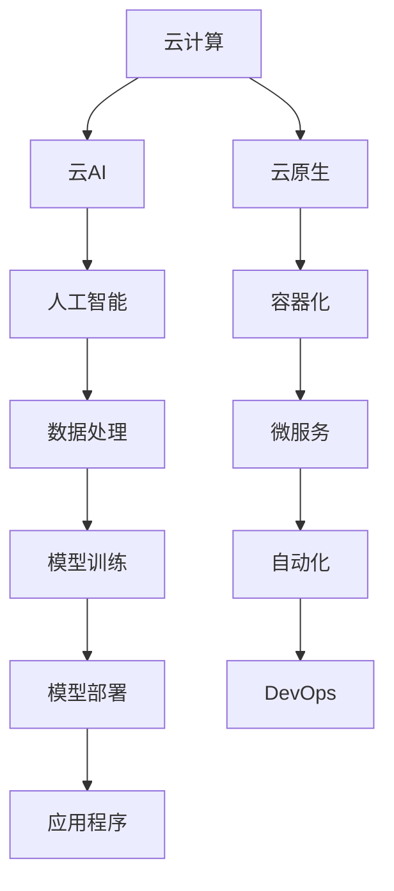

                 

## 1. 背景介绍

随着云技术的发展，云计算与人工智能(AI)技术的融合成为了当下最热门的话题之一。云计算提供了强大的计算资源和灵活的部署环境，而AI则具备了强大的分析和处理能力。二者的结合不仅为AI应用提供了更加便捷、高效的平台，也推动了AI技术的广泛应用和深入发展。

贾扬清，作为深度学习领域的顶尖专家，对云计算与AI工程的融合有着独到的见解。在他看来，云与AI的协同效应远不止于提供算力和空间，更在于形成了一个端到端的生态系统，促进了AI技术的快速迭代和规模化部署。本文将从贾扬清的视角，探讨云计算与AI工程的协同效应，以及如何利用云计算平台推动AI技术的发展。

## 2. 核心概念与联系

### 2.1 核心概念概述

为了深入理解云计算与AI工程的融合，我们先梳理几个核心概念：

- **云计算(Cloud Computing)**：通过互联网提供计算资源、存储资源、网络资源等，用户按需使用，按量计费。云计算的主要优势在于弹性扩展、降低成本、提高效率。

- **人工智能(AI)**：利用计算机模拟人类智能，实现语音识别、图像识别、自然语言处理、机器学习等任务。AI的核心在于数据、算法和计算资源的结合，目的是使机器具备类似人类的智能。

- **云AI(云人工智能)**：将AI技术部署在云平台，利用云计算资源和生态，加速AI应用的开发和部署。云AI将AI技术与云计算深度融合，形成了端到端的AI开发与运行环境。

- **云原生(Cloud-Native)**：指应用设计、开发、运维等各个环节都基于云架构，充分利用云平台提供的弹性、自动化、安全等特性。

这些概念之间的关系可以通过以下Mermaid流程图来展示：



### 2.2 核心概念原理和架构的 Mermaid 流程图

在上述流程图中，云计算是整个系统的基础设施，云AI将AI技术部署在云平台上，并通过容器化、微服务、自动化等云原生技术，实现AI模型的训练、部署和运维。数据处理和模型训练是AI开发的核心环节，通过云平台的大数据和计算资源，可以高效地完成这些任务。最终，AI应用程序通过云平台提供的服务，实现实时计算、自然语言处理、计算机视觉等应用。

## 3. 核心算法原理 & 具体操作步骤

### 3.1 算法原理概述

云计算与AI工程的融合，本质上是通过云平台提供的海量数据、强大计算能力和云原生技术，加速AI模型的开发、训练和部署。这种融合形成了一个端到端的AI生态系统，使得AI开发和应用变得更加便捷、高效。

具体而言，云计算与AI的协同效应体现在以下几个方面：

- **数据处理与存储**：云平台提供了高效、廉价的数据处理和存储服务，使得大规模数据处理成为可能。
- **模型训练与优化**：云平台提供了强大的计算资源和自动化工具，使得模型训练和优化变得更加高效。
- **模型部署与运维**：云平台提供了弹性扩展、负载均衡、监控告警等功能，确保模型能够在实际应用中稳定运行。

### 3.2 算法步骤详解

云计算与AI工程的融合涉及多个步骤，下面详细介绍每个步骤的实现过程：

#### Step 1：数据准备与处理

云计算平台提供了各种数据处理服务，如云存储、数据湖、大数据计算等。具体步骤如下：

1. 数据采集：通过API接口或SDK，将数据从各种来源采集到云平台。
2. 数据清洗与预处理：使用云平台的数据处理工具，对数据进行去重、清洗、归一化等预处理。
3. 数据存储与持久化：将处理后的数据存储到云平台的数据库或文件存储中，以便后续使用。

#### Step 2：模型训练与优化

云计算平台提供了强大的计算资源和自动化工具，支持高效的模型训练和优化。具体步骤如下：

1. 选择模型架构：根据任务需求，选择适合的深度学习模型。
2. 准备训练数据：将处理后的数据加载到训练集中，用于模型训练。
3. 训练模型：使用云平台提供的分布式计算框架（如Spark、TensorFlow、PyTorch等）进行模型训练。
4. 模型调优：使用云平台提供的自动化工具（如Kubeflow、MLflow等）进行模型调优，提升模型性能。

#### Step 3：模型部署与运维

模型训练完成后，需要在实际应用中部署和使用。具体步骤如下：

1. 模型导出与打包：将训练好的模型导出为标准的格式（如TensorFlow Lite、ONNX等），并进行打包。
2. 模型部署：将模型部署到云平台的应用服务中，如Kubernetes、AWS Lambda等。
3. 应用集成：将模型集成到实际应用中，实现智能化的决策和处理。
4. 模型监控与调优：使用云平台提供的监控和告警工具，实时监测模型性能，并根据实际使用情况进行调优。

### 3.3 算法优缺点

云计算与AI工程的融合，具有以下优点：

1. **高效便捷**：云平台提供了强大的计算资源和自动化工具，使得AI模型的开发和部署变得高效便捷。
2. **成本低廉**：云平台采用按量计费的方式，大大降低了硬件和维护成本。
3. **灵活扩展**：云平台提供了弹性扩展功能，可以动态调整计算资源，适应不同规模的业务需求。
4. **自动化运维**：云平台提供了自动化的运维工具，确保模型的稳定运行和性能优化。

但同时，这种融合也存在一些缺点：

1. **数据隐私与安全**：云平台需要对用户数据进行存储和处理，存在一定的数据隐私和安全风险。
2. **服务质量依赖于云平台**：云平台的服务质量受网络、硬件等多种因素影响，可能出现不稳定的情况。
3. **迁移难度大**：模型和应用在云平台部署后，如果需要迁移到其他平台，可能会遇到一定的困难。

### 3.4 算法应用领域

云计算与AI工程的融合，已经广泛应用于多个领域：

- **自然语言处理(NLP)**：利用云平台提供的大数据和计算资源，进行语言模型的训练和部署。
- **计算机视觉(CV)**：使用云平台进行图像识别、目标检测等任务。
- **推荐系统**：通过云平台的数据处理和机器学习算法，实现个性化推荐。
- **智能客服**：利用云平台提供的应用服务和人工智能技术，实现智能客服系统。
- **金融科技**：通过云平台提供的数据分析和模型训练，实现金融风控、投资分析等应用。
- **医疗健康**：使用云平台进行医疗影像分析、病理诊断等。

## 4. 数学模型和公式 & 详细讲解 & 举例说明

### 4.1 数学模型构建

云计算与AI工程的融合涉及多个数学模型，其中最主要的包括：

- **数据处理模型**：用于描述数据采集、清洗、存储等过程。
- **机器学习模型**：用于描述模型的训练、优化和预测过程。
- **云平台调度模型**：用于描述计算资源的分配和调度。

### 4.2 公式推导过程

以机器学习模型为例，以下是其推导过程：

假设我们有一个分类任务，使用逻辑回归模型进行训练。模型的输入为特征 $x$，输出为类别 $y$。假设训练集为 $(x_i,y_i)$，$i=1,2,\dots,N$。逻辑回归模型的参数为 $\theta$，目标函数为交叉熵损失：

$$
\mathcal{L}(\theta) = -\frac{1}{N}\sum_{i=1}^N [y_i\log \sigma(x_i^\top\theta)] + (1-y_i)\log(1-\sigma(x_i^\top\theta))
$$

其中 $\sigma(z) = \frac{1}{1+e^{-z}}$ 为sigmoid函数。模型的梯度更新公式为：

$$
\theta \leftarrow \theta - \eta \nabla_{\theta}\mathcal{L}(\theta)
$$

其中 $\eta$ 为学习率，$\nabla_{\theta}\mathcal{L}(\theta)$ 为损失函数对参数 $\theta$ 的梯度。

### 4.3 案例分析与讲解

以图像识别任务为例，分析其在云计算平台上的实现过程：

1. **数据准备**：从互联网采集大量图像数据，并进行清洗和标注。
2. **模型训练**：使用云平台提供的GPU资源和分布式计算框架进行模型训练，采用迁移学习或自监督学习的方式，训练卷积神经网络模型。
3. **模型部署**：将训练好的模型导出为ONNX格式，并部署到云平台的服务中，使用API接口提供图像识别的服务。
4. **模型调优**：根据实际使用情况，使用云平台提供的自动调参工具进行模型调优，提升识别精度。

## 5. 项目实践：代码实例和详细解释说明

### 5.1 开发环境搭建

为了进行云计算与AI工程的融合开发，需要搭建相应的开发环境。具体步骤如下：

1. 选择云平台：如AWS、阿里云、腾讯云等。
2. 创建云账号：并设置相应的安全凭证。
3. 安装云开发工具：如AWS CLI、阿里云SDK等。
4. 搭建开发环境：如Jupyter Notebook、IDE等。

### 5.2 源代码详细实现

以图像识别任务为例，以下是使用PyTorch在AWS云平台上进行图像识别开发的代码实现：

```python
import torch
import torchvision
import torchvision.transforms as transforms
from torch.utils.data import DataLoader
from torchvision.datasets import ImageFolder
from torchvision.models import resnet50
from torch.optim import SGD

# 加载数据集
transform = transforms.Compose([
    transforms.Resize(256),
    transforms.CenterCrop(224),
    transforms.ToTensor(),
    transforms.Normalize(mean=[0.485, 0.456, 0.406], std=[0.229, 0.224, 0.225])
])
train_dataset = ImageFolder('train_dir', transform=transform)
test_dataset = ImageFolder('test_dir', transform=transform)
train_loader = DataLoader(train_dataset, batch_size=32, shuffle=True)
test_loader = DataLoader(test_dataset, batch_size=32, shuffle=False)

# 定义模型
model = resnet50(pretrained=True)
for param in model.parameters():
    param.requires_grad = False
model.fc = torch.nn.Linear(2048, num_classes)

# 定义优化器
optimizer = SGD(model.fc.parameters(), lr=0.001, momentum=0.9)

# 训练模型
device = torch.device('cuda')
model.to(device)
criterion = torch.nn.CrossEntropyLoss()
for epoch in range(num_epochs):
    for i, (inputs, labels) in enumerate(train_loader):
        inputs = inputs.to(device)
        labels = labels.to(device)
        optimizer.zero_grad()
        outputs = model(inputs)
        loss = criterion(outputs, labels)
        loss.backward()
        optimizer.step()
        if i % 100 == 0:
            print(f'Epoch [{epoch+1}/{num_epochs}], Step [{i*len(train_loader)//train_loader.n_samples}/{train_loader.n_samples}], Loss: {loss.item():.4f}')

# 模型部署
# 导出模型
torch.save(model.state_dict(), 'model.pth')
# 将模型部署到AWS云平台
# ...
```

### 5.3 代码解读与分析

上述代码实现了使用PyTorch在AWS云平台上进行图像识别任务微调的流程。具体分析如下：

- **数据集准备**：使用torchvision库加载并处理数据集，将图像数据转换为Tensor格式，并进行归一化。
- **模型定义**：加载预训练的ResNet-50模型，并替换其全连接层以适应特定任务。
- **优化器定义**：使用SGD优化器进行模型训练，设置学习率、动量等超参数。
- **模型训练**：在GPU上训练模型，使用交叉熵损失进行优化，并定期打印训练进度。
- **模型导出与部署**：将训练好的模型导出为.pth格式，并部署到AWS云平台的服务中，使用API接口提供识别服务。

## 6. 实际应用场景

### 6.1 智能客服系统

智能客服系统是云计算与AI工程融合的典型应用之一。通过云平台提供的AI服务，可以实现7x24小时不间断的智能客服服务。具体实现步骤如下：

1. **数据采集**：收集历史客服对话数据，并进行标注。
2. **模型训练**：在云平台上使用预训练的对话模型进行微调，训练智能客服模型。
3. **模型部署**：将模型部署到云平台的应用服务中，使用API接口提供对话服务。
4. **实时处理**：根据用户的输入，智能客服系统实时生成回复，并通过云平台提供的监控工具，实时监控系统性能。

### 6.2 金融舆情监测

金融舆情监测是另一个典型应用场景。通过云平台提供的AI服务，可以实时监测金融市场舆情，及时发现异常情况。具体实现步骤如下：

1. **数据采集**：收集金融新闻、评论等数据，并进行文本标注。
2. **模型训练**：在云平台上使用预训练的文本分类模型进行微调，训练舆情监测模型。
3. **模型部署**：将模型部署到云平台的应用服务中，使用API接口提供舆情监测服务。
4. **实时监测**：根据实时采集的数据，舆情监测系统实时分析舆情变化趋势，并生成报告。

### 6.3 个性化推荐系统

个性化推荐系统是云计算与AI工程融合的另一个重要应用。通过云平台提供的AI服务，可以实现高效的个性化推荐。具体实现步骤如下：

1. **数据采集**：收集用户浏览、点击、评论等数据，并进行文本标注。
2. **模型训练**：在云平台上使用预训练的推荐模型进行微调，训练个性化推荐模型。
3. **模型部署**：将模型部署到云平台的应用服务中，使用API接口提供推荐服务。
4. **实时推荐**：根据用户的行为数据，个性化推荐系统实时推荐商品、内容等。

### 6.4 未来应用展望

随着云计算与AI工程的不断融合，未来的应用场景将更加丰富。以下列举几个未来可能的应用方向：

- **智慧城市**：通过云计算与AI的融合，实现城市交通、环境、安全等智能化管理。
- **智慧医疗**：利用云计算与AI的融合，进行智能诊断、健康管理等。
- **智能制造**：通过云计算与AI的融合，实现智能生产、质量控制等。
- **智能物流**：利用云计算与AI的融合，实现智能调度、配送等。
- **智能家居**：通过云计算与AI的融合，实现智能控制、语音识别等。

## 7. 工具和资源推荐

### 7.1 学习资源推荐

为了帮助开发者掌握云计算与AI工程的融合技术，以下是一些推荐的学习资源：

1. **《云计算基础》课程**：多门在线课程，如Coursera、edX等，系统介绍云计算基础知识和技术。
2. **《深度学习》课程**：多门在线课程，如Coursera、Udacity等，系统介绍深度学习基础知识和技术。
3. **《TensorFlow官方文档》**：官方文档，详细介绍了TensorFlow的各个功能和应用场景。
4. **《AWS官方文档》**：官方文档，详细介绍了AWS的各种服务和功能。
5. **《阿里云官方文档》**：官方文档，详细介绍了阿里云的各种服务和功能。

### 7.2 开发工具推荐

为了进行云计算与AI工程的融合开发，需要选择合适的开发工具。以下是一些推荐的工具：

1. **AWS CLI**：命令行工具，用于管理和操作AWS云资源。
2. **Kubernetes**：容器编排工具，用于管理和调度云容器服务。
3. **TensorFlow**：深度学习框架，用于训练和部署机器学习模型。
4. **PyTorch**：深度学习框架，用于训练和部署机器学习模型。
5. **Jupyter Notebook**：开发工具，用于数据处理、模型训练和结果展示。

### 7.3 相关论文推荐

云计算与AI工程的融合是一个新兴的研究方向，以下是一些推荐的相关论文：

1. **《Cloud Computing and Machine Learning: A Survey》**：系统介绍了云计算与机器学习的融合，分析了各种应用场景和挑战。
2. **《Cloud-Aided Machine Learning: A Survey》**：系统介绍了云计算平台在机器学习中的应用，包括数据存储、模型训练、模型部署等。
3. **《Cloud-Native Machine Learning: A Survey》**：系统介绍了云原生技术在机器学习中的应用，包括容器化、微服务、自动化等。

## 8. 总结：未来发展趋势与挑战

### 8.1 研究成果总结

云计算与AI工程的融合正在成为AI技术发展的重要趋势。通过云平台提供的大规模数据和计算资源，以及云原生技术的支持，AI模型可以更加高效地训练和部署，从而推动AI技术在各个领域的应用。

### 8.2 未来发展趋势

未来云计算与AI工程的融合将呈现以下几个发展趋势：

1. **云平台多样化**：更多的云平台将支持AI技术，提供更加灵活、便捷的开发环境。
2. **模型多样性**：更多的深度学习模型和算法将被引入云平台，支持更多类型的AI应用。
3. **自动化运维**：云平台将提供更加自动化的运维工具，提高AI模型的开发和部署效率。
4. **混合云架构**：混合云架构将使得云计算与AI工程的融合更加深入，提升系统的灵活性和扩展性。
5. **边缘计算**：边缘计算将使得AI模型在本地进行推理和处理，降低延迟，提升性能。

### 8.3 面临的挑战

尽管云计算与AI工程的融合前景广阔，但仍面临一些挑战：

1. **数据隐私和安全**：云平台需要对用户数据进行存储和处理，存在数据隐私和安全风险。
2. **服务质量不稳定**：云平台的服务质量受网络、硬件等多种因素影响，可能出现不稳定的情况。
3. **迁移难度大**：模型和应用在云平台部署后，如果需要迁移到其他平台，可能会遇到一定的困难。
4. **模型可解释性不足**：云平台上的AI模型通常是"黑盒"系统，难以解释其内部工作机制和决策逻辑。
5. **伦理道德问题**：云平台上的AI模型可能会学习到有偏见、有害的信息，传递到下游任务，产生误导性、歧视性的输出。

### 8.4 研究展望

未来的研究可以从以下几个方向进行：

1. **提高数据隐私保护**：研究如何保护用户数据隐私，确保数据安全。
2. **优化服务质量**：研究如何提高云平台的服务质量，确保系统稳定运行。
3. **简化迁移过程**：研究如何简化模型迁移过程，提高跨平台部署的便捷性。
4. **增强模型可解释性**：研究如何增强AI模型的可解释性，提升系统的透明度和可信度。
5. **解决伦理道德问题**：研究如何解决AI模型的伦理道德问题，确保其输出的公平性和公正性。

总之，云计算与AI工程的融合是一个极具潜力的研究方向，值得我们深入探索和研究。

## 9. 附录：常见问题与解答

### Q1: 云计算与AI工程的融合有哪些优势？

A: 云计算与AI工程的融合具有以下优势：

1. **高效便捷**：云平台提供了强大的计算资源和自动化工具，使得AI模型的开发和部署变得高效便捷。
2. **成本低廉**：云平台采用按量计费的方式，大大降低了硬件和维护成本。
3. **灵活扩展**：云平台提供了弹性扩展功能，可以动态调整计算资源，适应不同规模的业务需求。
4. **自动化运维**：云平台提供了自动化的运维工具，确保模型的稳定运行和性能优化。

### Q2: 如何在云平台上进行AI模型训练？

A: 在云平台上进行AI模型训练，一般需要以下步骤：

1. 选择合适的云平台，如AWS、阿里云、腾讯云等。
2. 创建云账号，并设置相应的安全凭证。
3. 安装云开发工具，如AWS CLI、阿里云SDK等。
4. 搭建开发环境，如Jupyter Notebook、IDE等。
5. 加载数据集，并进行预处理。
6. 定义模型，并进行训练。
7. 调整模型超参数，进行模型调优。
8. 导出模型，并进行部署。

### Q3: 如何在云平台上部署AI模型？

A: 在云平台上部署AI模型，一般需要以下步骤：

1. 选择合适的云平台，如AWS、阿里云、腾讯云等。
2. 创建云账号，并设置相应的安全凭证。
3. 安装云开发工具，如AWS CLI、阿里云SDK等。
4. 搭建开发环境，如Jupyter Notebook、IDE等。
5. 导出模型，并进行打包。
6. 部署模型到云平台的应用服务中，如Kubernetes、AWS Lambda等。
7. 使用API接口，进行模型调用。

### Q4: 云平台上的AI模型如何优化？

A: 在云平台上的AI模型优化，一般需要以下步骤：

1. 收集模型性能数据，并进行分析。
2. 调整模型超参数，进行模型调优。
3. 进行自动调参，使用云平台提供的工具进行优化。
4. 进行负载均衡，调整计算资源分配。
5. 进行数据增强，使用云平台提供的数据处理工具进行优化。

### Q5: 云平台上的AI模型如何提高可解释性？

A: 在云平台上的AI模型提高可解释性，一般需要以下步骤：

1. 选择可解释性高的模型架构，如LIME、SHAP等。
2. 使用模型解释工具，进行模型解释。
3. 可视化模型解释结果，进行模型理解。
4. 进行模型优化，提高模型可解释性。
5. 进行模型解释，进行结果展示。

通过以上常见问题的解答，相信你对云计算与AI工程的融合有了更深入的理解，可以更好地应对实际开发中的挑战。

