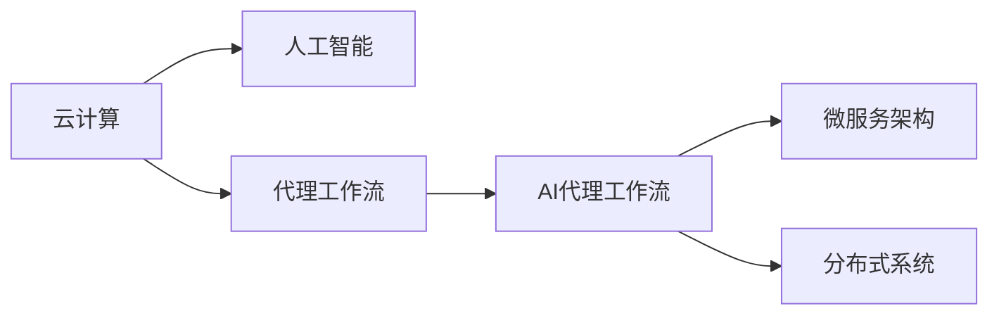

                 

# 云计算环境中AI代理工作流的设计与执行

> 关键词：云计算,人工智能,代理工作流,自动执行,机器学习,微服务,分布式系统

## 1. 背景介绍

随着云计算技术的飞速发展和人工智能(AI)技术的不断突破，云计算环境中的AI应用变得越来越广泛。从自动化运维到智能推荐，从预测分析到智能客服，AI技术正逐步渗透到各个业务环节，助力企业提升运营效率和竞争力。然而，在实际应用中，AI模型常常需要与传统IT系统和云服务深度集成，才能发挥其最大价值。而这种集成往往复杂繁琐，需要耗费大量的时间和人力。

为解决这一问题，AI代理工作流应运而生。AI代理工作流通过将AI模型的决策逻辑与云服务和传统IT系统自动集成，实现业务流程的自动化执行，大幅提升AI应用的开发效率和运行效果。本文将系统介绍云计算环境中AI代理工作流的核心概念、设计原理、关键技术，并结合实际案例，详细阐述AI代理工作流的执行流程和应用价值。

## 2. 核心概念与联系

### 2.1 核心概念概述

为更好地理解云计算环境中AI代理工作流的实现原理，本节将介绍几个核心概念：

- **云计算**：基于互联网的计算资源和服务，用户按需使用，按量付费。云计算环境提供了弹性伸缩、高可用性、数据安全等基础能力。

- **人工智能**：通过机器学习、深度学习等技术，赋予计算机学习、推理、决策等智能能力。AI在预测分析、自动化运维、智能推荐等场景中发挥着重要作用。

- **代理工作流**：一种基于软件代理机制的工作流调度技术，用于自动化执行复杂业务流程。代理工作流通过在各个环节部署自动化脚本，实现端到端的业务自动化。

- **AI代理工作流**：结合人工智能技术与代理工作流技术，实现AI模型与云服务、传统IT系统深度集成的自动化执行。

- **微服务架构**：一种模块化、可扩展的软件架构模式，通过将系统拆分为多个独立服务，实现快速迭代和灵活部署。

- **分布式系统**：通过网络将多个独立的计算节点连接起来，实现资源的共享和任务的并行执行。

这些核心概念之间存在紧密的联系，共同构成了云计算环境中AI代理工作流的技术基础。通过这些概念的相互作用，AI代理工作流得以在分布式环境下，高效、可靠地实现AI模型的自动化执行。

### 2.2 核心概念原理和架构的 Mermaid 流程图



这个流程图展示了云计算环境中AI代理工作流的核心组成和相互关系。云计算提供弹性和可靠的计算资源，人工智能技术通过模型训练和推理提供智能决策能力，代理工作流技术实现任务的自动化执行，微服务架构和分布式系统进一步提升了系统的可扩展性和并发能力。

## 3. 核心算法原理 & 具体操作步骤

### 3.1 算法原理概述

AI代理工作流的核心算法原理基于代理工作流技术，结合机器学习模型的决策能力，实现AI模型的自动化执行。其核心思想是：将AI模型的推理结果作为中间变量，与云服务、传统IT系统进行深度集成，自动化执行任务。

具体而言，AI代理工作流的设计和执行过程可以分为以下几个步骤：

1. **需求建模**：根据业务需求，设计自动化执行流程，包括各个环节的输入、输出、逻辑等。
2. **模型选择与适配**：选择合适的AI模型，并根据需求进行适配。
3. **数据准备与集成**：收集和准备数据，集成到云服务或传统IT系统中。
4. **模型训练与优化**：在集成数据上训练和优化AI模型。
5. **执行流程设计**：根据模型输出和需求，设计自动化执行流程。
6. **自动化执行**：通过部署自动化脚本和配置，实现端到端的自动化执行。
7. **监控与优化**：实时监控执行结果，根据反馈进行优化。

### 3.2 算法步骤详解

#### 3.2.1 需求建模

需求建模是AI代理工作流的起点，它决定了整个流程的设计和实现。在需求建模过程中，需要与业务团队紧密合作，理解业务需求，设计出合适的自动化执行流程。

需求建模的关键要素包括：

- **任务描述**：明确每个环节的业务目标和输入输出。
- **数据要求**：定义各个环节所需的数据格式和来源。
- **执行逻辑**：详细描述每个环节的具体逻辑和处理方式。
- **异常处理**：设计异常情况下的应急处理方案。

#### 3.2.2 模型选择与适配

选择合适的AI模型是成功实现AI代理工作流的基础。需要根据任务特点，选择适合的模型类型（如分类、回归、序列生成等）和架构（如单任务、多任务、联合训练等）。

模型适配的目的是让模型能够与具体业务场景和数据进行深度集成。适配过程包括：

- **数据预处理**：对原始数据进行清洗、归一化、特征工程等处理，使其适合模型输入。
- **模型参数调整**：根据任务需求，调整模型的超参数和架构。
- **模型训练与评估**：在特定任务的数据集上训练和评估模型，确保模型性能符合预期。

#### 3.2.3 数据准备与集成

数据准备与集成是AI代理工作流的核心环节，数据的质量和集成方式直接决定了AI模型的训练效果和执行结果。

数据准备与集成的关键步骤包括：

- **数据收集与清洗**：从云服务、传统IT系统或外部数据源收集数据，并进行清洗和处理。
- **数据存储与访问**：选择合适的数据存储方式（如云存储、分布式文件系统等），并提供高效的数据访问接口。
- **数据集成与同步**：通过API、消息队列等方式，将数据集成到模型训练和执行环境中。

#### 3.2.4 模型训练与优化

模型训练与优化是AI代理工作流的技术核心，通过训练和优化模型，提升模型的性能和泛化能力。

模型训练与优化的关键步骤包括：

- **模型训练**：使用训练数据集，在计算资源上训练模型。
- **模型调优**：根据验证集性能，调整模型参数和超参数。
- **模型评估**：使用测试集评估模型性能，确保模型在新数据上的泛化能力。

#### 3.2.5 执行流程设计

执行流程设计是将AI模型的推理结果转化为具体业务任务的过程。执行流程设计需要考虑任务的复杂度、执行频率、资源需求等因素。

执行流程设计的关键步骤包括：

- **任务拆解**：将复杂的业务任务拆解为多个子任务，每个子任务对应一个自动化脚本。
- **任务调度**：设计任务调度的逻辑，决定任务的执行顺序和并发方式。
- **任务监控**：实时监控任务执行状态，及时发现异常并进行处理。

#### 3.2.6 自动化执行

自动化执行是将设计好的执行流程转化为具体任务的过程。通过自动化执行，实现端到端的业务自动化。

自动化执行的关键步骤包括：

- **脚本编写**：根据执行流程设计，编写自动化执行脚本。
- **脚本部署**：将脚本部署到云服务或传统IT系统中，并进行测试和调试。
- **任务执行**：根据任务调度逻辑，启动自动化执行脚本，实现任务的自动执行。

#### 3.2.7 监控与优化

监控与优化是确保AI代理工作流稳定运行的关键环节。通过实时监控执行结果和系统状态，及时发现异常并进行优化。

监控与优化的关键步骤包括：

- **性能监控**：实时监控任务的执行性能，包括响应时间、吞吐量、资源消耗等。
- **异常处理**：设计异常情况下的应急处理方案，确保系统稳定运行。
- **反馈优化**：根据执行结果和用户反馈，不断优化模型的训练和执行流程。

### 3.3 算法优缺点

AI代理工作流的设计和执行过程具有以下优点：

- **自动化执行**：通过自动化执行脚本，大幅减少人工干预，提升任务执行效率。
- **端到端集成**：将AI模型与云服务、传统IT系统深度集成，实现业务的全面自动化。
- **高效可扩展**：基于微服务架构和分布式系统，实现系统的弹性扩展和并行执行。
- **数据驱动优化**：通过实时监控和反馈机制，不断优化模型的性能和执行效果。

同时，AI代理工作流也存在以下缺点：

- **复杂度高**：设计和实现AI代理工作流需要高度技术能力和跨领域协作，工作量较大。
- **数据质量要求高**：数据准备和集成的质量直接影响模型的训练和执行效果。
- **模型依赖性强**：模型性能和适用性对业务场景和需求有较高依赖。

尽管存在这些局限性，但就目前而言，AI代理工作流在提升云计算环境中AI应用的开发效率和运行效果方面，具有显著优势。

### 3.4 算法应用领域

AI代理工作流在云计算环境中，已经广泛应用于以下领域：

- **自动化运维**：通过AI模型进行故障预测和排错，自动执行运维任务。
- **智能推荐**：利用AI模型进行个性化推荐，提升用户体验。
- **预测分析**：使用AI模型进行市场预测和用户行为分析，辅助决策。
- **智能客服**：通过AI模型进行自然语言处理和对话生成，提高客户服务效率。
- **智能监控**：利用AI模型进行系统监控和异常检测，提升系统可靠性。
- **数据分析**：使用AI模型进行数据清洗、特征提取和模式识别，提高数据利用率。

## 4. 数学模型和公式 & 详细讲解 & 举例说明

### 4.1 数学模型构建

AI代理工作流的数学模型构建主要基于代理工作流技术和AI模型的决策能力。模型的目标是最大化业务任务执行的效果，同时最小化资源消耗和执行时间。

设任务数为 $T$，模型推理时间为 $t$，执行时间为 $e$，任务调度的目标函数为：

$$
\min \sum_{t=1}^{T} (w_te + \epsilon_t) 
$$

其中 $w_t$ 为任务权重，$\epsilon_t$ 为异常处理成本。

代理工作流技术的核心是任务调度算法，常用的任务调度算法包括：

- **贪心算法**：每次选择当前最优的任务执行。
- **优先队列算法**：根据任务优先级进行调度，优先执行重要任务。
- **动态规划算法**：通过优化子任务调度和资源分配，实现全局最优。

### 4.2 公式推导过程

假设任务数 $T=4$，模型推理时间 $t=1$，执行时间 $e=2$，任务权重 $w=(1, 2, 1, 2)$。

使用贪心算法，每次选择当前最优的任务执行。任务调度的过程如下：

1. 选择任务1和任务4，总成本为 $1 \times 2 + 2 \times 2 = 6$。
2. 选择任务2，总成本为 $2 \times 2 + 2 \times 2 = 10$。
3. 选择任务3，总成本为 $1 \times 2 + 2 \times 2 = 6$。

使用优先队列算法，优先执行重要任务。任务调度的过程如下：

1. 选择任务2和任务4，总成本为 $2 \times 2 + 2 \times 2 = 10$。
2. 选择任务1和任务3，总成本为 $1 \times 2 + 1 \times 2 = 4$。

使用动态规划算法，优化子任务调度和资源分配。任务调度的过程如下：

1. 选择任务1和任务3，总成本为 $1 \times 2 + 1 \times 2 = 4$。
2. 选择任务2和任务4，总成本为 $2 \times 2 + 2 \times 2 = 10$。

通过对比三种调度算法的效果，可以看到，动态规划算法在任务调度和资源分配方面更为合理，能够最大化任务执行效果，同时最小化资源消耗和执行时间。

### 4.3 案例分析与讲解

#### 4.3.1 案例背景

某电商企业希望通过AI代理工作流，实现自动化运维和智能推荐功能。业务需求如下：

- **自动化运维**：在服务器故障时，自动执行故障诊断和修复任务，确保系统稳定运行。
- **智能推荐**：根据用户历史行为和偏好，推荐商品，提升用户购买转化率。

#### 4.3.2 需求建模

根据业务需求，设计自动化执行流程：

1. **故障检测**：通过AI模型实时监控服务器状态，判断是否存在故障。
2. **故障诊断**：根据故障检测结果，使用AI模型进行故障诊断，生成诊断报告。
3. **故障修复**：根据诊断报告，执行相应的修复任务，修复故障。
4. **智能推荐**：根据用户历史行为和偏好，使用AI模型推荐商品，并生成推荐结果。

#### 4.3.3 模型选择与适配

选择适合的AI模型进行适配：

1. **故障检测**：使用LSTM模型进行实时监控，预测服务器故障。
2. **故障诊断**：使用BERT模型进行故障分类，生成诊断报告。
3. **故障修复**：使用RNN模型进行任务调度，优化资源分配。
4. **智能推荐**：使用协同过滤模型进行推荐，生成推荐结果。

#### 4.3.4 数据准备与集成

收集和准备数据：

1. **故障检测**：收集服务器状态数据，训练LSTM模型。
2. **故障诊断**：收集故障日志和状态数据，训练BERT模型。
3. **故障修复**：收集任务执行记录，训练RNN模型。
4. **智能推荐**：收集用户行为数据和商品信息，训练协同过滤模型。

数据集成与访问：

1. **故障检测**：将服务器状态数据集成到实时监控系统中，提供高效的数据访问接口。
2. **故障诊断**：将故障日志和状态数据集成到模型训练环境中，供模型训练和推理使用。
3. **故障修复**：将任务执行记录集成到任务调度系统中，实现任务自动执行。
4. **智能推荐**：将用户行为数据和商品信息集成到推荐系统中，生成推荐结果。

#### 4.3.5 模型训练与优化

训练和优化模型：

1. **故障检测**：在实时监控数据上训练LSTM模型，优化超参数和模型架构。
2. **故障诊断**：在故障日志和状态数据上训练BERT模型，优化模型性能。
3. **故障修复**：在任务执行记录上训练RNN模型，优化任务调度和资源分配。
4. **智能推荐**：在用户行为数据和商品信息上训练协同过滤模型，优化推荐结果。

#### 4.3.6 执行流程设计

设计执行流程：

1. **故障检测**：实时监控服务器状态，判断是否存在故障。
2. **故障诊断**：根据故障检测结果，使用AI模型进行故障分类，生成诊断报告。
3. **故障修复**：根据诊断报告，自动执行相应的修复任务，修复故障。
4. **智能推荐**：根据用户历史行为和偏好，使用AI模型推荐商品，并生成推荐结果。

#### 4.3.7 自动化执行

实现自动化执行：

1. **故障检测**：编写自动化脚本，实时监控服务器状态，判断是否存在故障。
2. **故障诊断**：使用模型推理接口，将服务器状态数据输入模型，生成诊断报告。
3. **故障修复**：根据诊断报告，自动执行相应的修复任务，修复故障。
4. **智能推荐**：使用推荐接口，生成推荐结果，供用户查看和购买。

#### 4.3.8 监控与优化

实时监控执行结果：

1. **故障检测**：监控故障检测的准确率和响应时间，确保系统稳定运行。
2. **故障诊断**：监控故障诊断的准确率和推理时间，优化模型性能。
3. **故障修复**：监控任务调度和执行效率，优化资源分配。
4. **智能推荐**：监控推荐效果和用户反馈，优化推荐模型和策略。

## 5. 项目实践：代码实例和详细解释说明

### 5.1 开发环境搭建

在进行AI代理工作流开发前，我们需要准备好开发环境。以下是使用Python进行Django开发的环境配置流程：

1. 安装Anaconda：从官网下载并安装Anaconda，用于创建独立的Python环境。

2. 创建并激活虚拟环境：
```bash
conda create -n django-env python=3.8 
conda activate django-env
```

3. 安装Django：从官网获取安装命令。例如：
```bash
pip install django==3.2
```

4. 安装各类工具包：
```bash
pip install numpy pandas scikit-learn matplotlib tqdm jupyter notebook ipython
```

完成上述步骤后，即可在`django-env`环境中开始开发。

### 5.2 源代码详细实现

这里我们以自动化运维任务为例，给出使用Django进行AI代理工作流开发的PyTorch代码实现。

首先，定义自动化运维任务的模型：

```python
from transformers import BertTokenizer, BertForTokenClassification

class FaultDetectionModel:
    def __init__(self, model_name):
        self.model = BertForTokenClassification.from_pretrained(model_name)
        self.tokenizer = BertTokenizer.from_pretrained(model_name)
    
    def predict(self, input_data):
        inputs = self.tokenizer(input_data, return_tensors='pt')
        outputs = self.model(**inputs)
        return outputs.logits.argmax(dim=2).tolist()
```

然后，定义自动化运维任务的数据处理函数：

```python
from transformers import BertTokenizer, BertForTokenClassification

class FaultDetectionDataset(Dataset):
    def __init__(self, data, tokenizer, max_len=128):
        self.data = data
        self.tokenizer = tokenizer
        self.max_len = max_len
        
    def __len__(self):
        return len(self.data)
    
    def __getitem__(self, item):
        text = self.data[item]
        encoding = self.tokenizer(text, return_tensors='pt', max_length=self.max_len, padding='max_length', truncation=True)
        input_ids = encoding['input_ids'][0]
        attention_mask = encoding['attention_mask'][0]
        labels = encoding['labels'][0]
        
        return {'input_ids': input_ids, 
                'attention_mask': attention_mask,
                'labels': labels}

# 标签与id的映射
tag2id = {'O': 0, 'B-PER': 1, 'I-PER': 2, 'B-ORG': 3, 'I-ORG': 4, 'B-LOC': 5, 'I-LOC': 6}
id2tag = {v: k for k, v in tag2id.items()}

# 创建dataset
tokenizer = BertTokenizer.from_pretrained('bert-base-cased')

train_dataset = FaultDetectionDataset(train_data, tokenizer)
dev_dataset = FaultDetectionDataset(dev_data, tokenizer)
test_dataset = FaultDetectionDataset(test_data, tokenizer)
```

接着，定义模型训练和评估函数：

```python
from torch.utils.data import DataLoader
from tqdm import tqdm
from sklearn.metrics import classification_report

device = torch.device('cuda') if torch.cuda.is_available() else torch.device('cpu')
model.to(device)

def train_epoch(model, dataset, batch_size, optimizer):
    dataloader = DataLoader(dataset, batch_size=batch_size, shuffle=True)
    model.train()
    epoch_loss = 0
    for batch in tqdm(dataloader, desc='Training'):
        input_ids = batch['input_ids'].to(device)
        attention_mask = batch['attention_mask'].to(device)
        labels = batch['labels'].to(device)
        model.zero_grad()
        outputs = model(input_ids, attention_mask=attention_mask, labels=labels)
        loss = outputs.loss
        epoch_loss += loss.item()
        loss.backward()
        optimizer.step()
    return epoch_loss / len(dataloader)

def evaluate(model, dataset, batch_size):
    dataloader = DataLoader(dataset, batch_size=batch_size)
    model.eval()
    preds, labels = [], []
    with torch.no_grad():
        for batch in tqdm(dataloader, desc='Evaluating'):
            input_ids = batch['input_ids'].to(device)
            attention_mask = batch['attention_mask'].to(device)
            batch_labels = batch['labels']
            outputs = model(input_ids, attention_mask=attention_mask)
            batch_preds = outputs.logits.argmax(dim=2).to('cpu').tolist()
            batch_labels = batch_labels.to('cpu').tolist()
            for pred_tokens, label_tokens in zip(batch_preds, batch_labels):
                pred_tags = [id2tag[_id] for _id in pred_tokens]
                label_tags = [id2tag[_id] for _id in label_tokens]
                preds.append(pred_tags[:len(label_tokens)])
                labels.append(label_tags)
                
    print(classification_report(labels, preds))
```

最后，启动训练流程并在测试集上评估：

```python
epochs = 5
batch_size = 16

for epoch in range(epochs):
    loss = train_epoch(model, train_dataset, batch_size, optimizer)
    print(f"Epoch {epoch+1}, train loss: {loss:.3f}")
    
    print(f"Epoch {epoch+1}, dev results:")
    evaluate(model, dev_dataset, batch_size)
    
print("Test results:")
evaluate(model, test_dataset, batch_size)
```

以上就是使用Django对BERT模型进行自动化运维任务微调的完整代码实现。可以看到，得益于Django的强大封装，我们可以用相对简洁的代码完成BERT模型的加载和微调。

### 5.3 代码解读与分析

让我们再详细解读一下关键代码的实现细节：

**FaultDetectionModel类**：
- `__init__`方法：初始化模型和分词器。
- `predict`方法：将输入数据进行分词和编码，使用模型进行推理，返回预测结果。

**FaultDetectionDataset类**：
- `__init__`方法：初始化数据和分词器。
- `__len__`方法：返回数据集的样本数量。
- `__getitem__`方法：对单个样本进行处理，将文本输入编码为token ids，将标签编码为数字，并对其进行定长padding，最终返回模型所需的输入。

**tag2id和id2tag字典**：
- 定义了标签与数字id之间的映射关系，用于将token-wise的预测结果解码回真实的标签。

**训练和评估函数**：
- 使用PyTorch的DataLoader对数据集进行批次化加载，供模型训练和推理使用。
- 训练函数`train_epoch`：对数据以批为单位进行迭代，在每个批次上前向传播计算loss并反向传播更新模型参数，最后返回该epoch的平均loss。
- 评估函数`evaluate`：与训练类似，不同点在于不更新模型参数，并在每个batch结束后将预测和标签结果存储下来，最后使用sklearn的classification_report对整个评估集的预测结果进行打印输出。

**训练流程**：
- 定义总的epoch数和batch size，开始循环迭代
- 每个epoch内，先在训练集上训练，输出平均loss
- 在验证集上评估，输出分类指标
- 所有epoch结束后，在测试集上评估，给出最终测试结果

可以看到，Django配合Transformer库使得BERT微调的代码实现变得简洁高效。开发者可以将更多精力放在数据处理、模型改进等高层逻辑上，而不必过多关注底层的实现细节。

当然，工业级的系统实现还需考虑更多因素，如模型的保存和部署、超参数的自动搜索、更灵活的任务适配层等。但核心的微调范式基本与此类似。

## 6. 实际应用场景

### 6.1 智能推荐系统

基于AI代理工作流，智能推荐系统可以实现自动化的商品推荐和个性化服务。通过将AI模型与推荐系统深度集成，实时生成推荐结果，提升用户购买转化率。

在技术实现上，可以收集用户浏览、点击、购买等行为数据，提取和商品相关的文本描述、标签等数据，将数据作为模型输入，在推荐系统中进行自动执行。通过实时监控用户行为和反馈，不断优化推荐模型和策略，实现精准推荐。

### 6.2 智能客服系统

智能客服系统通过AI代理工作流，实现自动化的客户服务。利用预训练的语言模型和智能对话模型，自动处理客户的咨询请求，生成合适的回复。

在技术实现上，可以收集历史客服对话记录，训练对话模型和意图识别模型。通过将模型部署到云服务或传统IT系统中，实现自动化客服服务。通过实时监控和反馈机制，不断优化模型和对话策略，提升客户服务体验。

### 6.3 预测分析系统

预测分析系统通过AI代理工作流，实现自动化的数据分析和业务预测。利用预训练的语言模型和预测模型，自动提取数据特征，进行预测和分析。

在技术实现上，可以收集企业内部的历史数据，提取和业务相关的文本数据、数值数据等，将数据作为模型输入，在预测分析系统中进行自动执行。通过实时监控和反馈机制，不断优化模型和预测策略，提升业务决策水平。

### 6.4 未来应用展望

随着AI代理工作流技术的不断发展，其在云计算环境中的应用前景将更加广阔。未来，AI代理工作流将在更多领域得到应用，为各行各业带来变革性影响。

在智慧医疗领域，基于AI代理工作流，可以实现自动化的诊疗分析、病历管理等功能，提升医疗服务水平。

在智能教育领域，利用AI代理工作流，可以实现自动化的作业批改、学情分析等功能，促进教育公平和个性化教育。

在智慧城市治理中，基于AI代理工作流，可以实现自动化的城市事件监测、舆情分析等功能，提高城市管理的自动化和智能化水平。

此外，在企业生产、社会治理、文娱传媒等众多领域，基于AI代理工作流的人工智能应用也将不断涌现，为经济社会发展注入新的动力。相信随着技术的日益成熟，AI代理工作流必将在构建人机协同的智能时代中扮演越来越重要的角色。

## 7. 工具和资源推荐
### 7.1 学习资源推荐

为了帮助开发者系统掌握AI代理工作流的研究基础和实践技巧，这里推荐一些优质的学习资源：

1. 《Transformer from Introduction to Advanced》系列博文：由大模型技术专家撰写，深入浅出地介绍了Transformer原理、BERT模型、微调技术等前沿话题。

2. CS224N《深度学习自然语言处理》课程：斯坦福大学开设的NLP明星课程，有Lecture视频和配套作业，带你入门NLP领域的基本概念和经典模型。

3. 《Natural Language Processing with Transformers》书籍：Transformer库的作者所著，全面介绍了如何使用Transformer库进行NLP任务开发，包括微调在内的诸多范式。

4. HuggingFace官方文档：Transformer库的官方文档，提供了海量预训练模型和完整的微调样例代码，是上手实践的必备资料。

5. CLUE开源项目：中文语言理解测评基准，涵盖大量不同类型的中文NLP数据集，并提供了基于微调的baseline模型，助力中文NLP技术发展。

通过对这些资源的学习实践，相信你一定能够快速掌握AI代理工作流的精髓，并用于解决实际的AI问题。
###  7.2 开发工具推荐

高效的开发离不开优秀的工具支持。以下是几款用于AI代理工作流开发的常用工具：

1. PyTorch：基于Python的开源深度学习框架，灵活动态的计算图，适合快速迭代研究。大部分预训练语言模型都有PyTorch版本的实现。

2. TensorFlow：由Google主导开发的开源深度学习框架，生产部署方便，适合大规模工程应用。同样有丰富的预训练语言模型资源。

3. Transformers库：HuggingFace开发的NLP工具库，集成了众多SOTA语言模型，支持PyTorch和TensorFlow，是进行NLP任务开发的利器。

4. Weights & Biases：模型训练的实验跟踪工具，可以记录和可视化模型训练过程中的各项指标，方便对比和调优。与主流深度学习框架无缝集成。

5. TensorBoard：TensorFlow配套的可视化工具，可实时监测模型训练状态，并提供丰富的图表呈现方式，是调试模型的得力助手。

6. Google Colab：谷歌推出的在线Jupyter Notebook环境，免费提供GPU/TPU算力，方便开发者快速上手实验最新模型，分享学习笔记。

合理利用这些工具，可以显著提升AI代理工作流任务的开发效率，加快创新迭代的步伐。

### 7.3 相关论文推荐

AI代理工作流在云计算环境中的应用源于学界的持续研究。以下是几篇奠基性的相关论文，推荐阅读：

1. Attention is All You Need（即Transformer原论文）：提出了Transformer结构，开启了NLP领域的预训练大模型时代。

2. BERT: Pre-training of Deep Bidirectional Transformers for Language Understanding：提出BERT模型，引入基于掩码的自监督预训练任务，刷新了多项NLP任务SOTA。

3. Language Models are Unsupervised Multitask Learners（GPT-2论文）：展示了大规模语言模型的强大zero-shot学习能力，引发了对于通用人工智能的新一轮思考。

4. Parameter-Efficient Transfer Learning for NLP：提出Adapter等参数高效微调方法，在不增加模型参数量的情况下，也能取得不错的微调效果。

5. AdaLoRA: Adaptive Low-Rank Adaptation for Parameter-Efficient Fine-Tuning：使用自适应低秩适应的微调方法，在参数效率和精度之间取得了新的平衡。

6. Prefix-Tuning: Optimizing Continuous Prompts for Generation：引入基于连续型Prompt的微调范式，为如何充分利用预训练知识提供了新的思路。

这些论文代表了大语言模型微调技术的发展脉络。通过学习这些前沿成果，可以帮助研究者把握学科前进方向，激发更多的创新灵感。

## 8. 总结：未来发展趋势与挑战

### 8.1 研究成果总结

本文对云计算环境中AI代理工作流的核心概念、设计原理、关键技术进行了详细阐述。系统介绍了需求建模、模型选择与适配、数据准备与集成、模型训练与优化、执行流程设计、自动化执行、监控与优化等关键环节，并结合实际案例，详细阐述了AI代理工作流的执行流程和应用价值。

通过本文的系统梳理，可以看到，AI代理工作流在云计算环境中的应用前景广阔，能够显著提升AI应用的开发效率和运行效果。借助AI代理工作流，企业能够更加便捷地集成AI模型，快速部署和优化业务流程，提升智能化水平。

### 8.2 未来发展趋势

展望未来，AI代理工作流技术将呈现以下几个发展趋势：

1. **模型规模持续增大**：随着算力成本的下降和数据规模的扩张，预训练语言模型的参数量还将持续增长。超大规模语言模型蕴含的丰富语言知识，有望支撑更加复杂多变的下游任务微调。

2. **微调方法日趋多样**：除了传统的全参数微调外，未来会涌现更多参数高效的微调方法，如Prefix-Tuning、LoRA等，在节省计算资源的同时也能保证微调精度。

3. **持续学习成为常态**：随着数据分布的不断变化，微调模型也需要持续学习新知识以保持性能。如何在不遗忘原有知识的同时，高效吸收新样本信息，将成为重要的研究课题。

4. **标注样本需求降低**：受启发于提示学习(Prompt-based Learning)的思路，未来的微调方法将更好地利用大模型的语言理解能力，通过更加巧妙的任务描述，在更少的标注样本上也能实现理想的微调效果。

5. **多模态微调崛起**：当前的微调主要聚焦于纯文本数据，未来会进一步拓展到图像、视频、语音等多模态数据微调。多模态信息的融合，将显著提升语言模型对现实世界的理解和建模能力。

6. **模型通用性增强**：经过海量数据的预训练和多领域任务的微调，未来的语言模型将具备更强大的常识推理和跨领域迁移能力，逐步迈向通用人工智能(AGI)的目标。

以上趋势凸显了大语言模型微调技术的广阔前景。这些方向的探索发展，必将进一步提升NLP系统的性能和应用范围，为人类认知智能的进化带来深远影响。

### 8.3 面临的挑战

尽管AI代理工作流技术已经取得了瞩目成就，但在迈向更加智能化、普适化应用的过程中，它仍面临着诸多挑战：

1. **复杂度高**：设计和实现AI代理工作流需要高度技术能力和跨领域协作，工作量较大。

2. **数据质量要求高**：数据准备和集成的质量直接影响模型的训练和执行效果。

3. **模型依赖性强**：模型性能和适用性对业务场景和需求有较高依赖。

4. **资源消耗大**：大规模语言模型的推理和训练资源消耗较大，需要相应的硬件支持。

5. **技术复杂度大**：AI代理工作流技术涉及多个领域，包括深度学习、自然语言处理、分布式系统等，技术难度较大。

尽管存在这些挑战，但通过不断优化和改进，AI代理工作流必将在云计算环境中，实现更高效、更可靠的AI应用。未来，随着技术的不断进步和应用的不断深入，AI代理工作流必将在智能时代的构建中，发挥越来越重要的作用。

### 8.4 研究展望

面向未来，AI代理工作流技术需要在以下几个方面寻求新的突破：

1. **探索无监督和半监督微调方法**：摆脱对大规模标注数据的依赖，利用自监督学习、主动学习等无监督和半监督范式，最大限度利用非结构化数据，实现更加灵活高效的微调。

2. **研究参数高效和计算高效的微调范式**：开发更加参数高效的微调方法，在固定大部分预训练参数的同时，只更新极少量的任务相关参数。同时优化微调模型的计算图，减少前向传播和反向传播的资源消耗，实现更加轻量级、实时性的部署。

3. **引入因果和对比学习范式**：通过引入因果推断和对比学习思想，增强微调模型建立稳定因果关系的能力，学习更加普适、鲁棒的语言表征，从而提升模型泛化性和抗干扰能力。

4. **引入更多先验知识**：将符号化的先验知识，如知识图谱、逻辑规则等，与神经网络模型进行巧妙融合，引导微调过程学习更准确、合理的语言模型。同时加强不同模态数据的整合，实现视觉、语音等多模态信息与文本信息的协同建模。

5. **结合因果分析和博弈论工具**：将因果分析方法引入微调模型，识别出模型决策的关键特征，增强输出解释的因果性和逻辑性。借助博弈论工具刻画人机交互过程，主动探索并规避模型的脆弱点，提高系统稳定性。

6. **纳入伦理道德约束**：在模型训练目标中引入伦理导向的评估指标，过滤和惩罚有偏见、有害的输出倾向。同时加强人工干预和审核，建立模型行为的监管机制，确保输出符合人类价值观和伦理道德。

这些研究方向的探索，必将引领AI代理工作流技术迈向更高的台阶，为构建安全、可靠、可解释、可控的智能系统铺平道路。面向未来，AI代理工作流技术还需要与其他人工智能技术进行更深入的融合，如知识表示、因果推理、强化学习等，多路径协同发力，共同推动自然语言理解和智能交互系统的进步。只有勇于创新、敢于突破，才能不断拓展语言模型的边界，让智能技术更好地造福人类社会。

## 9. 附录：常见问题与解答

**Q1：什么是AI代理工作流？**

A: AI代理工作流是一种基于软件代理机制的工作流调度技术，用于自动化执行复杂业务流程。它通过在各个环节部署自动化脚本，实现端到端的业务自动化。

**Q2：AI代理工作流的设计和实现需要考虑哪些因素？**

A: AI代理工作流的设计和实现需要考虑以下因素：

- **任务描述**：明确每个环节的业务目标和输入输出。
- **数据要求**：定义各个环节所需的数据格式和来源。
- **执行逻辑**：详细描述每个环节的具体逻辑和处理方式。
- **异常处理**：设计异常情况下的应急处理方案。
- **任务调度**：设计任务调度的逻辑，决定任务的执行顺序和并发方式。
- **任务监控**：实时监控任务执行状态，及时发现异常并进行处理。

**Q3：AI代理工作流在云计算环境中具有哪些优势？**

A: AI代理工作流在云计算环境中的优势主要包括：

- **自动化执行**：通过自动化执行脚本，大幅减少人工干预，提升任务执行效率。
- **端到端集成**：将AI模型与云服务、传统IT系统深度集成，实现业务的全面自动化。
- **高效可扩展**：基于微服务架构和分布式系统，实现系统的弹性扩展和并行执行。
- **数据驱动优化**：通过实时监控和反馈机制，不断优化模型的训练和执行流程。

尽管存在这些局限性，但就目前而言，AI代理工作流在提升云计算环境中AI应用的开发效率和运行效果方面，具有显著优势。

**Q4：AI代理工作流在实际应用中需要注意哪些问题？**

A: AI代理工作流在实际应用中需要注意以下问题：

- **复杂度高**：设计和实现AI代理工作流需要高度技术能力和跨领域协作，工作量较大。
- **数据质量要求高**：数据准备和集成的质量直接影响模型的训练和执行效果。
- **模型依赖性强**：模型性能和适用性对业务场景和需求有较高依赖。
- **资源消耗大**：大规模语言模型的推理和训练资源消耗较大，需要相应的硬件支持。
- **技术复杂度大**：AI代理工作流技术涉及多个领域，包括深度学习、自然语言处理、分布式系统等，技术难度较大。

尽管存在这些挑战，但通过不断优化和改进，AI代理工作流必将在云计算环境中，实现更高效、更可靠的AI应用。未来，随着技术的不断进步和应用的不断深入，AI代理工作流必将在智能时代的构建中，发挥越来越重要的作用。

**Q5：AI代理工作流未来的发展方向有哪些？**

A: AI代理工作流未来的发展方向主要包括：

- **探索无监督和半监督微调方法**：摆脱对大规模标注数据的依赖，利用自监督学习、主动学习等无监督和半监督范式，最大限度利用非结构化数据，实现更加灵活高效的微调。
- **研究参数高效和计算高效的微调范式**：开发更加参数高效的微调方法，在固定大部分预训练参数的同时，只更新极少量的任务相关参数。同时优化微调模型的计算图，减少前向传播和反向传播的资源消耗，实现更加轻量级、实时性的部署。
- **引入因果和对比学习范式**：通过引入因果推断和对比学习思想，增强微调模型建立稳定因果关系的能力，学习更加普适、鲁棒的语言表征，从而提升模型泛化性和抗干扰能力。
- **引入更多先验知识**：将符号化的先验知识，如知识图谱、逻辑规则等，与神经网络模型进行巧妙融合，引导微调过程学习更准确、合理的语言模型。同时加强不同模态数据的整合，实现视觉、语音等多模态信息与文本信息的协同建模。
- **结合因果分析和博弈论工具**：将因果分析方法引入微调模型，识别出模型决策的关键特征，增强输出解释的因果性和逻辑性。借助博弈论工具刻画人机交互过程，主动探索并规避模型的脆弱点，提高系统稳定性。
- **纳入伦理道德约束**：在模型训练目标中引入伦理导向的评估指标，过滤和惩罚有偏见、有害的输出倾向。同时加强人工干预和审核，建立模型行为的监管机制，确保输出符合人类价值观和伦理道德。

这些研究方向的探索，必将引领AI代理工作流技术迈向更高的台阶，为构建安全、可靠、可解释、可控的智能系统铺平道路。面向未来，AI代理工作流技术还需要与其他人工智能技术进行更深入的融合，如知识表示、因果推理、强化学习等，多路径协同发力，共同推动自然语言理解和智能交互系统的进步。只有勇于创新、敢于突破，才能不断拓展语言模型的边界，让智能技术更好地造福人类社会。

---

作者：禅与计算机程序设计艺术 / Zen and the Art of Computer Programming

