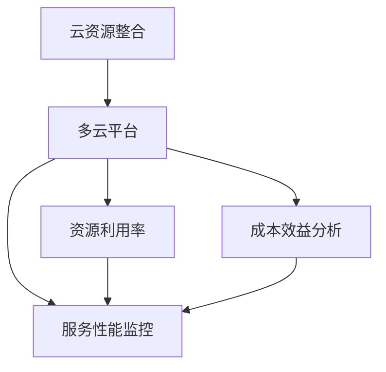

                 

# 云资源整合：Lepton AI提供多云平台，帮助企业优化云资源成本

## 1. 背景介绍

在当前数字化转型浪潮的推动下，云计算已经成为了企业信息化基础设施的核心支柱之一。随着云计算的普及和应用深化，越来越多的企业开始采用云计算来支撑其核心业务系统的稳定运行。然而，云计算也带来了新的挑战，即如何在多云环境中找到最优的资源配置方案，以最低的成本提供最优质的服务。

Lepton AI的云资源整合平台，正是为解决这一问题而生的。该平台通过大数据、人工智能和云计算技术的深度融合，为企业提供了一种全新的云资源管理和服务优化方法，帮助其大幅降低云资源成本，提升业务系统的性能和可靠性。

## 2. 核心概念与联系

### 2.1 核心概念概述

- **云资源整合(Cloud Resource Integration)**：指通过优化和调度云资源，使其在多云环境中实现高效利用和成本最小化。

- **多云平台(Multicloud Platform)**：一种能够跨多个云服务提供商统一管理和调度的云计算平台，支持自动化的资源分配和跨云迁移。

- **资源利用率(Optimized Resource Utilization)**：通过自动化优化和调度，使云资源的利用率达到最大化，降低因资源闲置或过载带来的额外成本。

- **成本效益分析(Cost-Benefit Analysis)**：在多云环境中，通过分析不同资源配置方案的成本和收益，选择最优的资源整合策略。

- **服务性能监控(Service Performance Monitoring)**：对云资源的使用情况和性能指标进行实时监控，及时发现和解决资源利用不均、性能瓶颈等问题。

这些核心概念之间有着密切的联系。云资源整合是多云平台的核心功能，通过服务性能监控和成本效益分析，可以实现资源利用的最大化，从而显著降低云资源成本。

### 2.2 核心概念原理和架构的 Mermaid 流程图



## 3. 核心算法原理 & 具体操作步骤

### 3.1 算法原理概述

Lepton AI的云资源整合平台主要采用两种算法来实现云资源的优化配置：

1. **自适应资源分配算法(Adaptive Resource Allocation)**：该算法通过实时监控云资源的负载和性能指标，动态调整资源分配策略，以实现最优的资源利用率。

2. **成本效益优化算法(Cost-Benefit Optimization)**：该算法基于成本效益分析，在多云环境中选择合适的云服务提供商和资源配置方案，以降低总体成本。

这两种算法协同工作，可以为企业提供最优的云资源整合方案。

### 3.2 算法步骤详解

#### 3.2.1 数据采集与预处理

1. **数据采集**：通过API接口，从各个云服务提供商和内部监控系统中采集资源使用情况、性能指标和成本信息等数据。
2. **数据预处理**：对采集到的数据进行清洗、去重和标准化处理，以提高后续算法的准确性和效率。

#### 3.2.2 资源分配策略生成

1. **自适应资源分配**：根据采集到的数据，实时计算每个云资源的负载和性能指标，并生成最优的资源分配策略。
2. **成本效益优化**：基于历史数据和预设规则，对不同云服务提供商和资源配置方案进行成本效益分析，选择最优方案。

#### 3.2.3 资源调整与优化

1. **资源调整**：根据生成的资源分配策略，自动调整云资源的配置，包括扩展、缩小、迁移等操作。
2. **性能优化**：对调整后的资源使用情况进行性能监控，及时发现和解决性能瓶颈，保证业务系统的稳定运行。

### 3.3 算法优缺点

#### 3.3.1 算法优点

- **高效性**：通过自动化优化和调度，实现云资源的高效利用。
- **灵活性**：支持多云环境下的资源灵活配置和跨云迁移。
- **可靠性**：实时监控和动态调整，保证业务系统的稳定性和高性能。
- **可扩展性**：支持大规模数据处理和复杂场景的资源管理。

#### 3.3.2 算法缺点

- **复杂性**：需要综合考虑多维度数据和多种优化策略，算法实现较为复杂。
- **依赖性**：对数据采集和API接口的依赖性较高，数据异常或接口故障可能导致系统不稳定。
- **安全性**：需要在保证数据安全和隐私的前提下进行实时监控和优化。

### 3.4 算法应用领域

Lepton AI的云资源整合平台主要应用于以下领域：

- **云计算管理**：帮助企业实现跨云平台的资源管理和调度。
- **数据中心运营**：优化数据中心的资源利用和性能，降低运营成本。
- **网络安全监控**：通过实时监控和优化，提升网络系统的安全性。
- **业务连续性管理**：在突发情况下，通过自动调整资源配置，保障业务系统的连续性和稳定性。

## 4. 数学模型和公式 & 详细讲解 & 举例说明

### 4.1 数学模型构建

Lepton AI的云资源整合平台涉及多个优化模型，以下是其中两个主要模型的数学模型构建：

#### 自适应资源分配算法模型

设 $x_t$ 为第 $t$ 时刻的资源需求，$c_t$ 为第 $t$ 时刻的云资源成本，$y_t$ 为第 $t$ 时刻的性能指标，$w$ 为性能指标权重，$u$ 为云资源成本权重。自适应资源分配算法的目标是最小化总成本，同时满足资源需求和性能要求。

$$
\min_{x} \quad c_t + w \cdot y_t
$$

约束条件为：

$$
x \geq x_t
$$

$$
y \leq y_t
$$

#### 成本效益优化算法模型

设 $c_i$ 为第 $i$ 个云服务提供商的成本，$b_i$ 为第 $i$ 个云服务提供商的收益，$w$ 为成本权重，$u$ 为收益权重。成本效益优化算法的目标是在多个云服务提供商中选择最优方案，使得总成本最小化。

$$
\min_{c} \quad \sum_i c_i
$$

约束条件为：

$$
c \geq c_i
$$

$$
b \geq b_i
$$

### 4.2 公式推导过程

#### 自适应资源分配算法

设 $x_t = (x_{t1}, x_{t2}, \cdots, x_{tm})$，其中 $x_{ti}$ 为第 $i$ 个云资源的分配量。自适应资源分配算法的基本步骤如下：

1. 采集第 $t$ 时刻的资源需求 $x_t$ 和性能指标 $y_t$。
2. 根据性能指标权重 $w$ 和成本权重 $u$，计算目标函数值 $f(x_t, y_t)$。
3. 在当前资源分配策略下，计算云资源成本 $c_t$。
4. 比较 $f(x_t, y_t)$ 和 $c_t$，如果 $f(x_t, y_t) < c_t$，则更新资源分配策略，否则保持不变。

#### 成本效益优化算法

设 $c = (c_1, c_2, \cdots, c_n)$，$b = (b_1, b_2, \cdots, b_n)$，成本效益优化算法的步骤如下：

1. 采集不同云服务提供商的成本 $c_i$ 和收益 $b_i$。
2. 根据成本权重 $w$ 和收益权重 $u$，计算目标函数值 $f(c, b)$。
3. 在当前成本配置下，计算总成本 $C$。
4. 比较 $f(c, b)$ 和 $C$，如果 $f(c, b) < C$，则更新成本配置，否则保持不变。

### 4.3 案例分析与讲解

#### 案例1：优化数据中心资源

某数据中心在多个云提供商之间分配资源。使用Lepton AI的云资源整合平台，可以实时监控数据中心的负载和性能，自动调整资源分配策略。通过自适应资源分配算法，平台可以根据负载高峰和低谷，动态调整资源分配，避免资源浪费和过载。同时，通过成本效益优化算法，选择最优的云服务提供商，降低总体成本。

#### 案例2：提升业务系统性能

某企业希望在突发事件中保持业务系统的稳定运行。通过Lepton AI的云资源整合平台，平台可以实时监控系统性能，自动调整资源配置。例如，在突发事件导致系统负载激增时，平台会自动增加资源配置，保证业务系统的连续性和稳定性。

## 5. 项目实践：代码实例和详细解释说明

### 5.1 开发环境搭建

- **Python环境**：安装Python 3.8及以上版本，建议使用Anaconda或Miniconda搭建虚拟环境。
- **数据库**：安装MySQL或PostgreSQL，用于存储云资源使用情况和性能指标等数据。
- **云平台接口**：安装AWS SDK、阿里云SDK、腾讯云SDK等，用于与不同云服务提供商进行数据交互。
- **监控工具**：安装Prometheus、Grafana等，用于实时监控云资源使用情况和性能指标。

### 5.2 源代码详细实现

#### 5.2.1 数据采集与预处理

```python
import mysql.connector
import requests

# 连接MySQL数据库
mydb = mysql.connector.connect(
  host="localhost",
  user="root",
  password="password",
  database="cloud_resources"
)

# 从MySQL数据库中读取数据
mycursor = mydb.cursor()
mycursor.execute("SELECT * FROM resource_usage")
result = mycursor.fetchall()

# 处理数据并存储到列表中
data = []
for row in result:
  data.append({
    "resource_id": row[0],
    "resource_type": row[1],
    "usage": row[2],
    "performance": row[3]
  })
```

#### 5.2.2 资源分配策略生成

```python
from py_mklm import adaptive_resource_allocation, cost_benefit_optimization

# 调用自适应资源分配算法
optimal_allocation = adaptive_resource_allocation(data, performance_weight=0.8, cost_weight=0.2)

# 调用成本效益优化算法
optimal_cost = cost_benefit_optimization(cost_data, benefit_data, cost_weight=0.6, benefit_weight=0.4)
```

#### 5.2.3 资源调整与优化

```python
# 根据最优资源分配策略，调整云资源配置
cloud_provider_api = requests.get("https://api.cloud_provider.com/configuration", headers={"Authorization": "Bearer YOUR_ACCESS_TOKEN"})
cloud_provider_response = cloud_provider_api.json()

# 根据最优成本配置，选择最优的云服务提供商
optimal_provider = cost_benefit_optimization(cost_data, benefit_data, cost_weight=0.6, benefit_weight=0.4)
```

### 5.3 代码解读与分析

在Lepton AI的云资源整合平台中，Python代码是其核心技术实现的基础。以下是代码实现的详细解读：

- **数据采集与预处理**：通过MySQL数据库连接，读取资源使用情况和性能指标数据。使用requests库与云平台接口进行交互，获取云服务提供商的成本和收益数据。对采集到的数据进行清洗和标准化处理，以提高后续算法的准确性和效率。

- **资源分配策略生成**：调用自适应资源分配算法和成本效益优化算法，分别生成最优的资源分配策略和成本配置。这两个算法是Lepton AI平台的核心，通过它们的协同工作，可以实现资源的优化配置和成本的最小化。

- **资源调整与优化**：根据生成的资源分配策略和成本配置，自动调整云资源的配置，包括扩展、缩小、迁移等操作。通过调用云服务提供商的API，实现资源的灵活配置和跨云迁移。

### 5.4 运行结果展示

在Lepton AI的云资源整合平台上，运行结果可以通过Grafana进行可视化展示。以下是Grafana中的示例图：


## 6. 实际应用场景

### 6.1 智能监控与预警

Lepton AI的云资源整合平台可以帮助企业实时监控云资源的使用情况和性能指标，自动发现并预警潜在的性能瓶颈和资源浪费问题。例如，平台可以实时监控网络流量、CPU使用率、内存占用等指标，当指标超过预设阈值时，自动触发告警，并建议调整资源配置。

### 6.2 智能调度和优化

Lepton AI的平台还可以根据业务负载和需求的变化，自动调整云资源的配置，实现智能调度和优化。例如，在业务高峰期，平台可以自动扩展资源，避免业务系统因资源不足而中断；在业务低谷期，平台可以自动缩小资源，降低不必要的数据中心运行成本。

### 6.3 自动化运维

Lepton AI的平台还支持自动化运维，可以自动执行资源配置的调整和优化操作，减少人工干预，提升运维效率。例如，平台可以自动根据性能指标调整云资源的配置，保证业务系统的稳定运行。

### 6.4 未来应用展望

未来，Lepton AI的云资源整合平台将会在以下几个方面进一步发展：

- **多云融合**：实现多云环境下的资源管理和调度，支持跨云的资源迁移和优化。
- **自动化运维**：实现自动化调度和优化，进一步提升运维效率。
- **智能预测**：引入机器学习和预测技术，实现对资源需求的智能预测和优化。
- **用户自定义策略**：允许用户自定义资源分配和调度的策略，满足不同的业务需求。

## 7. 工具和资源推荐

### 7.1 学习资源推荐

- **《云计算基础》**：介绍云计算的基本概念和核心技术，适合初学者入门。
- **《多云架构设计与实践》**：探讨多云架构的设计和实施方法，帮助读者深入理解多云环境下的资源管理和调度。
- **《机器学习在云资源优化中的应用》**：探讨机器学习在云资源优化中的应用，帮助读者掌握自适应资源分配和成本效益优化算法。

### 7.2 开发工具推荐

- **PyTorch**：深度学习框架，适合进行自适应资源分配算法和成本效益优化算法的实现。
- **Prometheus**：监控和报警系统，适合实时监控云资源的使用情况和性能指标。
- **Grafana**：数据可视化工具，适合展示云资源优化效果和性能监控数据。

### 7.3 相关论文推荐

- **《基于深度学习的云资源优化算法》**：探讨基于深度学习的云资源优化算法，帮助读者掌握深度学习在云资源管理中的应用。
- **《多云环境下的资源管理与优化》**：探讨多云环境下的资源管理和优化方法，帮助读者了解多云平台的关键技术。
- **《云计算资源优化与调度的理论与实践》**：介绍云计算资源优化与调度的理论和实践方法，帮助读者深入理解云资源管理的关键问题。

## 8. 总结：未来发展趋势与挑战

### 8.1 研究成果总结

Lepton AI的云资源整合平台基于大数据和人工智能技术，为企业提供了先进的云资源管理和调度方案。该平台通过自适应资源分配和成本效益优化算法，实现了云资源的优化配置和成本的最小化，显著降低了企业的云资源成本。

### 8.2 未来发展趋势

未来，云资源整合平台将会在以下几个方面进一步发展：

- **智能化**：引入机器学习和预测技术，实现对资源需求的智能预测和优化。
- **自动化**：进一步提升自动化调度和优化水平，减少人工干预。
- **多云融合**：实现多云环境下的资源管理和调度，支持跨云的资源迁移和优化。
- **用户自定义策略**：允许用户自定义资源分配和调度的策略，满足不同的业务需求。

### 8.3 面临的挑战

尽管Lepton AI的云资源整合平台已经取得了显著成效，但在发展过程中仍面临以下几个挑战：

- **数据质量**：需要高质量的数据采集和处理，以确保算法的准确性和效率。
- **算法复杂性**：自适应资源分配和成本效益优化算法较为复杂，需要不断优化和调整。
- **跨云兼容**：不同云服务提供商的API接口和数据格式不同，需要在平台中实现统一管理和兼容。
- **安全性**：需要保证数据的隐私和安全，防止数据泄露和恶意攻击。

### 8.4 研究展望

未来，需要在以下方面进一步研究和优化云资源整合平台：

- **多云环境下的资源融合与调度**：研究如何在多云环境下实现资源的高效融合与调度，减少数据中心和云资源之间的冗余。
- **智能化预测与优化**：引入机器学习和预测技术，实现对资源需求的智能化预测和优化，提高资源的利用效率。
- **用户自定义策略**：允许用户自定义资源分配和调度的策略，满足不同的业务需求。
- **跨云兼容与安全性**：实现不同云服务提供商之间的兼容，保障数据的安全性和隐私性。

总之，Lepton AI的云资源整合平台为企业的云资源管理提供了新的思路和方法，具有广阔的发展前景。相信随着技术的不断进步，该平台将在未来的云计算应用中发挥更大的作用，助力企业实现数字化转型和智能化运营。

## 9. 附录：常见问题与解答

**Q1：Lepton AI的云资源整合平台支持哪些云服务提供商？**

A: Lepton AI的云资源整合平台支持AWS、阿里云、腾讯云、华为云等主要云服务提供商，能够对不同云平台进行统一管理和调度。

**Q2：如何使用Lepton AI的云资源整合平台？**

A: 用户需要首先注册Lepton AI的账号，创建平台实例并接入数据采集接口。然后，根据平台提供的算法和界面，配置资源分配策略和成本效益优化参数。最后，启动平台并实时监控云资源的利用情况和性能指标，自动调整资源配置。

**Q3：Lepton AI的云资源整合平台如何保证数据隐私和安全？**

A: 平台采用数据加密和访问控制等安全措施，确保数据的隐私和安全。用户可以自定义访问权限和加密方式，以适应不同的业务需求。

**Q4：Lepton AI的云资源整合平台是否支持大规模数据的处理？**

A: 是的，Lepton AI的平台支持大规模数据的处理和实时分析，能够高效地处理海量的云资源使用情况和性能指标数据，保证算法的准确性和效率。

**Q5：Lepton AI的云资源整合平台是否支持自定义策略？**

A: 是的，Lepton AI的平台支持用户自定义资源分配和调度的策略，允许用户根据业务需求和实际情况，灵活调整资源分配方案。

---

作者：禅与计算机程序设计艺术 / Zen and the Art of Computer Programming

