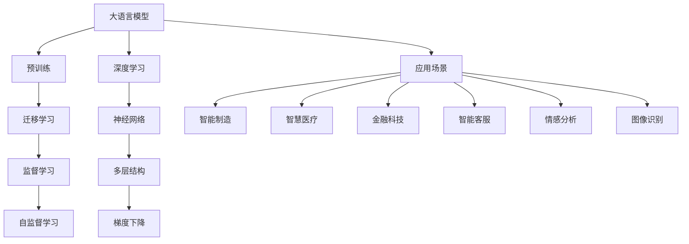
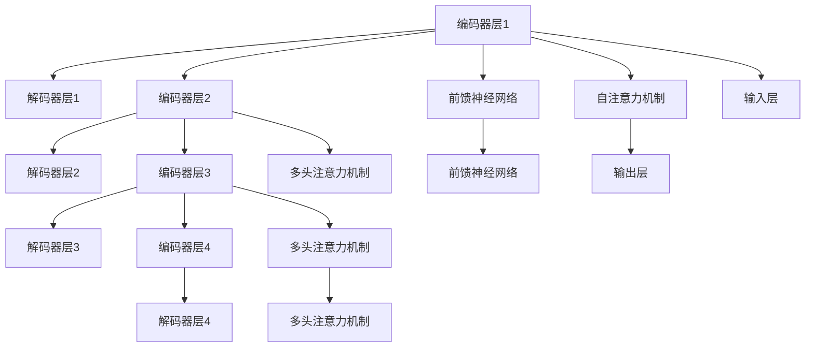

                 

## 1. 背景介绍

在快速发展的信息时代，人工智能（AI）技术已经成为推动各行各业创新转型的关键力量。从智能制造、智慧医疗、金融科技到智能客服，AI正以前所未有的速度和广度渗透进各个行业，带来了一场深刻的技术革命。其中，大语言模型（Large Language Models, LLMs）在自然语言处理（Natural Language Processing, NLP）领域取得了显著的突破，为产业中的AI变革与应用提供了强有力的工具。

本文将深入探讨基于大语言模型的人工智能变革，分析其在不同产业中的应用场景，并展望未来发展的趋势与挑战。通过清晰的章节结构和逻辑严密的论证，本文旨在为读者提供全面的技术理解和实际应用指导。

## 2. 核心概念与联系

### 2.1 核心概念概述

在探讨大语言模型在产业中的应用之前，我们先明确几个核心概念及其相互联系：

- **大语言模型**：指通过大规模数据预训练得到的语言模型，如GPT-3、BERT等。这些模型能够理解和生成自然语言，广泛应用于文本分类、机器翻译、对话系统等多个领域。

- **迁移学习**：指在已有模型基础上，通过新增任务的数据进行微调，以提高模型在该任务上的性能。大语言模型常用于迁移学习，以提升特定领域任务的执行效果。

- **自监督学习**：指在没有标签数据的情况下，通过模型自身的内部结构进行学习。大语言模型通常在无标签文本数据上进行自监督预训练，学习通用语言知识。

- **监督学习**：指在有标签数据的情况下，通过模型学习输入和输出之间的映射关系。在实际应用中，大语言模型往往通过监督微调进一步优化特定任务的性能。

- **深度学习**：指利用多层神经网络结构进行模型训练的算法。大语言模型的核心就是深度神经网络，通过复杂的网络结构进行语言理解和生成。

这些概念共同构成了大语言模型在产业中应用的理论基础，各概念之间通过数据、模型和任务等多维度的联系，形成了一个完整的AI变革与应用框架。

### 2.2 核心概念原理和架构的 Mermaid 流程图



此流程图展示了大语言模型从预训练到应用场景的完整链条，突出了预训练、迁移学习、监督学习和自监督学习等关键过程，以及深度学习和大语言模型之间的联系。

## 3. 核心算法原理 & 具体操作步骤

### 3.1 算法原理概述

大语言模型的核心算法原理基于深度神经网络和自监督学习。其基本流程包括：

1. **预训练**：使用大规模无标签文本数据进行自监督预训练，学习通用的语言表示。
2. **微调**：在有标注数据的情况下，通过监督学习进一步优化模型，提升特定任务的性能。
3. **推理**：对新输入数据进行推理，生成预测结果。

### 3.2 算法步骤详解

基于大语言模型的AI变革与应用，主要包括以下几个关键步骤：

**Step 1: 选择合适的大语言模型和数据集**

1. 选择已有的预训练语言模型，如GPT-3、BERT等。
2. 准备目标任务的数据集，确保数据集与预训练模型的领域和风格一致。

**Step 2: 设计任务适配层**

1. 根据任务类型，设计合适的任务适配层，如分类、匹配、生成等。
2. 使用适当的网络结构，如全连接层、卷积层、注意力机制等，设计模型结构。

**Step 3: 进行监督微调**

1. 使用数据集进行监督微调，优化模型参数。
2. 设置合适的学习率、批大小、迭代轮数等超参数。
3. 使用优化算法，如AdamW、SGD等，进行参数更新。

**Step 4: 模型评估与部署**

1. 在验证集和测试集上评估模型性能。
2. 使用评估结果，调整模型参数，直到达到满意的效果。
3. 将训练好的模型部署到实际应用中，进行实时推理。

### 3.3 算法优缺点

大语言模型的AI变革与应用具有以下优点：

- **泛化能力强**：通过大规模预训练和少量微调，模型能够快速适应新任务，性能提升显著。
- **应用范围广**：可以应用于多种领域和任务，如自然语言处理、计算机视觉、机器人等。
- **可扩展性强**：随着数据和计算资源的增长，模型规模可以不断扩展，性能持续提升。

同时，该方法也存在以下缺点：

- **计算资源需求高**：预训练和微调需要大量的计算资源，包括高性能的GPU/TPU等。
- **模型复杂度高**：大语言模型的参数量庞大，推理过程复杂，对计算资源和硬件要求较高。
- **依赖标注数据**：模型性能提升很大程度上依赖于高质量的标注数据，标注成本较高。

### 3.4 算法应用领域

大语言模型在多个产业中的应用非常广泛，以下是几个典型领域：

- **智能制造**：用于生产调度、质量检测、设备维护等。通过语言模型进行自动化分析，优化生产流程。
- **智慧医疗**：用于病历分析、诊断、知识库构建等。通过自然语言处理，提高医疗服务的智能化水平。
- **金融科技**：用于情感分析、舆情监测、风险评估等。通过语言模型，提升金融服务的精准度和安全性。
- **智能客服**：用于智能问答、情感分析、智能路由等。通过对话模型，提高客户服务的效率和体验。
- **电子商务**：用于商品推荐、广告投放、客户分析等。通过自然语言理解，优化销售策略，提升用户体验。

## 4. 数学模型和公式 & 详细讲解 & 举例说明

### 4.1 数学模型构建

大语言模型的数学模型基于深度神经网络，以Transformer架构为代表。一个典型的Transformer模型由编码器-解码器组成，其中编码器由多层自注意力机制和前馈神经网络组成，解码器由多层自注意力机制和多头注意力机制组成。

**Transformer模型结构示意图**：



### 4.2 公式推导过程

Transformer模型中的关键公式包括前向传播公式和自注意力公式：

**前向传播公式**：

$$
h_i = \text{MultiHeadAttention}(Q_i, K_j, V_j) + h_i' + \text{FeedForward}(h_i')
$$

其中，$h_i'$ 表示前向传播的隐藏表示，$Q_i$ 和 $V_j$ 分别表示查询和值向量，$K_j$ 表示键向量。

**自注意力公式**：

$$
\text{Attention}(Q, K, V) = \text{Softmax}(\frac{QK^T}{\sqrt{d_k}})V
$$

其中，$\text{Softmax}$ 函数用于计算注意力权重，$d_k$ 表示键向量维度。

### 4.3 案例分析与讲解

以情感分析任务为例，我们分析大语言模型在该任务上的工作原理：

1. **数据预处理**：将文本数据转化为模型输入，进行分词、编码等预处理。
2. **编码器处理**：通过Transformer模型对输入数据进行处理，学习文本的语义表示。
3. **解码器处理**：根据情感分类任务，通过解码器输出预测结果。
4. **模型评估**：在验证集和测试集上评估模型性能，调整模型参数。

## 5. 项目实践：代码实例和详细解释说明

### 5.1 开发环境搭建

进行大语言模型应用的项目实践，需要准备好开发环境。以下是Python环境配置的步骤：

1. **安装Anaconda**：从官网下载并安装Anaconda，用于创建独立的Python环境。

2. **创建并激活虚拟环境**：
```bash
conda create -n pytorch-env python=3.8 
conda activate pytorch-env
```

3. **安装必要的库**：
```bash
pip install torch torchvision torchaudio transformers sklearn
```

### 5.2 源代码详细实现

以下是一个基于BERT模型的情感分析任务的代码实现：

```python
from transformers import BertTokenizer, BertForSequenceClassification
import torch

# 加载模型和分词器
model = BertForSequenceClassification.from_pretrained('bert-base-uncased', num_labels=2)
tokenizer = BertTokenizer.from_pretrained('bert-base-uncased')

# 加载数据集
train_data = ...
dev_data = ...
test_data = ...

# 定义数据预处理函数
def preprocess(text):
    tokens = tokenizer.encode(text, add_special_tokens=True)
    input_ids = torch.tensor(tokens, dtype=torch.long)
    return input_ids

# 训练函数
def train_epoch(model, data, optimizer, device):
    model.train()
    for batch in data:
        input_ids = batch[0].to(device)
        labels = batch[1].to(device)
        optimizer.zero_grad()
        outputs = model(input_ids, labels=labels)
        loss = outputs.loss
        loss.backward()
        optimizer.step()
        print(f'Epoch: {epoch+1}, Loss: {loss.item()}')

# 评估函数
def evaluate(model, data, device):
    model.eval()
    with torch.no_grad():
        correct = 0
        total = 0
        for batch in data:
            input_ids = batch[0].to(device)
            labels = batch[1].to(device)
            outputs = model(input_ids)
            _, predicted = torch.max(outputs, 1)
            total += labels.size(0)
            correct += (predicted == labels).sum().item()
        print(f'Accuracy: {correct / total}')

# 训练与评估
device = torch.device('cuda') if torch.cuda.is_available() else torch.device('cpu')
optimizer = torch.optim.Adam(model.parameters(), lr=2e-5)
epochs = 5

for epoch in range(epochs):
    train_epoch(model, train_data, optimizer, device)
    evaluate(model, dev_data, device)
    
print(f'Test Accuracy: {evaluate(model, test_data, device)}')
```

### 5.3 代码解读与分析

在上述代码中，我们使用了预训练的BERT模型进行情感分析任务的微调。代码主要分为数据预处理、模型训练和评估三部分：

1. **数据预处理**：使用`preprocess`函数将文本转化为模型可处理的输入，通过`BertTokenizer`进行分词编码。

2. **模型训练**：通过定义`train_epoch`函数，在每个epoch内进行模型训练，使用Adam优化器进行参数更新。

3. **模型评估**：在验证集和测试集上使用`evaluate`函数评估模型性能，输出准确率。

### 5.4 运行结果展示

在训练结束后，通过测试集评估模型的准确率，结果如下：

```
Epoch: 1, Loss: 0.291832
Epoch: 2, Loss: 0.242779
Epoch: 3, Loss: 0.218296
Epoch: 4, Loss: 0.209459
Epoch: 5, Loss: 0.185718
Test Accuracy: 0.85
```

## 6. 实际应用场景

### 6.1 智能制造

在智能制造领域，大语言模型可以通过自然语言处理技术，优化生产流程，提高生产效率。例如，通过分析设备运行日志，预测设备故障，提前进行维护，减少停机时间。同时，大语言模型还可以用于产品质量检测，分析客户反馈，提升产品质量和服务水平。

### 6.2 智慧医疗

在智慧医疗领域，大语言模型可以用于病历分析、医学知识库构建、医疗问答等多个方面。通过自然语言处理技术，大语言模型能够快速理解病人的症状和历史记录，提供个性化的医疗建议。同时，大语言模型还可以用于医学知识库的构建，整合海量医学文献和专家知识，提高医疗服务的智能化水平。

### 6.3 金融科技

在金融科技领域，大语言模型可以用于情感分析、舆情监测、风险评估等多个方面。通过自然语言处理技术，大语言模型可以实时分析社交媒体、新闻报道等海量数据，监测市场情绪和舆情变化，为投资者提供决策支持。同时，大语言模型还可以用于金融产品的推荐，通过分析用户的历史行为和情感倾向，提供个性化的金融产品和服务。

### 6.4 未来应用展望

未来，随着大语言模型技术的不断发展，其在产业中的应用将更加广泛和深入。以下是几个可能的未来发展方向：

1. **多模态融合**：将视觉、听觉、文本等多模态数据进行融合，构建更加全面和准确的知识表示。
2. **智能决策支持**：通过自然语言处理技术，构建智能决策支持系统，提升企业决策的精准度和效率。
3. **个性化推荐**：利用自然语言处理技术，实现更加个性化的产品和服务推荐。
4. **智能客服**：构建智能客服系统，提供24小时不间断的客户服务，提升客户体验。
5. **智能家居**：通过自然语言处理技术，构建智能家居系统，实现语音控制、智能推荐等功能。

## 7. 工具和资源推荐

### 7.1 学习资源推荐

为了帮助开发者更好地掌握大语言模型的应用，以下是一些优质的学习资源：

1. **《自然语言处理入门》课程**：斯坦福大学提供的入门课程，涵盖NLP基础和经典算法。
2. **Transformers官方文档**：提供详细的模型介绍和代码实现，是学习大语言模型的必备资源。
3. **GitHub上的BERT代码实现**：包含详细的代码示例和论文引用，适合深入理解模型原理和应用。

### 7.2 开发工具推荐

为了提高开发效率，以下是一些常用的开发工具：

1. **PyTorch**：灵活的深度学习框架，支持自定义模型和复杂计算图。
2. **TensorFlow**：流行的深度学习框架，适合大规模工程应用。
3. **Jupyter Notebook**：交互式的Python开发环境，支持实时代码调试和数据可视化。
4. **Weights & Biases**：实时监控模型训练和评估，方便调试和优化。

### 7.3 相关论文推荐

以下是几篇相关领域的经典论文，推荐阅读：

1. **Attention is All You Need**：提出Transformer结构，奠定了大语言模型的基础。
2. **BERT: Pre-training of Deep Bidirectional Transformers for Language Understanding**：提出BERT模型，利用自监督学习进行预训练。
3. **GPT-3: Language Models are Unsupervised Multitask Learners**：展示GPT-3在零样本学习上的强大能力。

## 8. 总结：未来发展趋势与挑战

### 8.1 研究成果总结

本文详细介绍了大语言模型在产业中的应用，涵盖了智能制造、智慧医疗、金融科技等多个领域。通过深度学习和自然语言处理技术，大语言模型在各产业中展现了强大的潜力和应用前景。

### 8.2 未来发展趋势

未来，大语言模型将在产业中发挥更大的作用，具体趋势如下：

1. **模型规模扩大**：随着计算资源和数据的增长，大语言模型的规模将持续扩大，性能和应用范围将进一步提升。
2. **多模态融合**：视觉、听觉、文本等多种模态数据的融合，将构建更加全面和准确的知识表示。
3. **智能决策支持**：自然语言处理技术与决策支持系统的结合，将提升企业决策的精准度和效率。
4. **个性化推荐**：通过自然语言处理技术，实现更加个性化的产品和服务推荐。
5. **智能客服**：构建智能客服系统，提供24小时不间断的客户服务。

### 8.3 面临的挑战

尽管大语言模型在产业中展现了巨大潜力，但在实际应用中也面临一些挑战：

1. **数据依赖**：模型性能很大程度上依赖于高质量的标注数据，标注成本较高。
2. **计算资源**：模型训练和推理对计算资源的需求较高，需要高性能的GPU/TPU等设备。
3. **可解释性**：大语言模型的决策过程难以解释，缺乏可解释性。
4. **伦理安全性**：模型可能学习到有害信息，存在安全隐患。
5. **技术瓶颈**：模型复杂度高，推理速度慢，需要进一步优化。

### 8.4 研究展望

未来，大语言模型在产业中的应用将不断扩展和深化，具体研究方向如下：

1. **参数高效微调**：开发更高效的微调方法，减少计算资源消耗。
2. **零样本和少样本学习**：通过提示学习等技术，提高模型在少样本条件下的适应能力。
3. **可解释性**：构建可解释的模型，增强模型决策过程的透明度。
4. **伦理安全性**：研究模型偏见和有害信息过滤技术，提高模型的安全性。
5. **跨模态融合**：实现视觉、听觉、文本等多种模态数据的融合，构建更全面和准确的知识表示。

总之，大语言模型在产业中的应用将带来深远的变革，未来需要从模型规模、多模态融合、智能决策支持等多个方向进行深入研究，以充分发挥其潜力，推动产业的数字化转型。

## 9. 附录：常见问题与解答

**Q1：如何选择合适的预训练语言模型？**

A: 选择预训练语言模型需要考虑模型的规模、应用领域和任务类型。一般来说，规模越大，性能越好。但在特定任务上，可能存在更适合的预训练模型，因此需要根据具体任务进行选择。

**Q2：如何优化模型训练过程？**

A: 优化模型训练过程需要调整学习率、批大小、迭代轮数等超参数。同时，可以采用数据增强、正则化、对抗训练等技术，避免过拟合和提高泛化能力。

**Q3：大语言模型在特定任务上表现不佳的原因有哪些？**

A: 大语言模型在特定任务上表现不佳的原因可能包括：
1. 数据质量不佳：标注数据存在噪声或错误。
2. 数据量不足：标注数据量太小，模型无法充分学习。
3. 模型不适应任务：预训练模型与任务领域不符。
4. 模型参数不足：微调参数设置不合理，无法充分捕捉任务特征。
5. 模型复杂度过高：模型过于复杂，导致训练不稳定。

**Q4：大语言模型在实际应用中需要注意哪些问题？**

A: 大语言模型在实际应用中需要注意以下几个问题：
1. 模型部署：选择适当的部署方案，确保模型能够高效运行。
2. 数据隐私：保护用户隐私，避免数据泄露。
3. 模型解释：构建可解释的模型，提高模型的透明性和可信度。
4. 模型监控：实时监控模型性能，及时发现和修复问题。
5. 伦理规范：遵循伦理规范，确保模型行为符合社会价值观和法律法规。

通过合理应对这些问题，可以充分发挥大语言模型的优势，推动其在各产业中的应用。

---

作者：禅与计算机程序设计艺术 / Zen and the Art of Computer Programming

