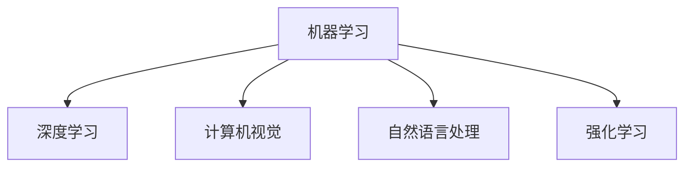

                 

# 人工智能 (Artificial Intelligence, AI) 原理与代码实例讲解

> 关键词：人工智能,机器学习,深度学习,神经网络,计算机视觉,自然语言处理,代码实例

## 1. 背景介绍

### 1.1 问题由来
人工智能（AI）是计算机科学领域的一个分支，旨在使计算机系统能够执行通常需要人类智能的任务。AI的研究涉及广泛的领域，包括机器学习、深度学习、自然语言处理、计算机视觉等。近年来，AI技术迅猛发展，已经在医疗、金融、交通、教育等多个领域得到广泛应用，极大地提升了社会生产力和生活质量。

在AI的发展历程中，算法和模型的不断创新起到了至关重要的作用。从最初的符号推理、专家系统到现在的深度学习，AI技术的每一次飞跃都离不开算法和模型的进步。本文将从原理和代码实现两个层面，深入讲解AI的核心概念和技术，并通过实例代码演示如何构建和应用AI模型。

### 1.2 问题核心关键点
AI的核心关键点包括：
- 机器学习：从数据中学习规律，通过训练数据来构建预测模型。
- 深度学习：基于多层神经网络的模型，可以处理大规模非结构化数据，如图像、语音和文本。
- 计算机视觉：使计算机能够理解和解释图像和视频内容的技术。
- 自然语言处理：使计算机能够理解和生成自然语言的技术。
- 强化学习：通过与环境的交互，使机器学习到最优决策策略。

这些关键技术共同构成了AI的技术框架，使其能够在多个领域中发挥重要作用。本文将详细讲解这些核心概念和技术的原理，并通过代码实例展示其实现方式。

## 2. 核心概念与联系

### 2.1 核心概念概述

为更好地理解AI的核心概念和技术，本节将介绍几个密切相关的核心概念：

- 机器学习：基于统计学和优化理论，通过训练数据来构建预测模型。机器学习分为监督学习、无监督学习和强化学习等类别。
- 深度学习：基于多层神经网络的模型，可以处理大规模非结构化数据，如图像、语音和文本。深度学习中的核心模型包括卷积神经网络（CNN）、循环神经网络（RNN）和变分自编码器（VAE）等。
- 计算机视觉：使计算机能够理解和解释图像和视频内容的技术。计算机视觉的主要应用包括图像分类、目标检测、人脸识别等。
- 自然语言处理：使计算机能够理解和生成自然语言的技术。自然语言处理的主要应用包括文本分类、机器翻译、问答系统等。
- 强化学习：通过与环境的交互，使机器学习到最优决策策略。强化学习在自动驾驶、机器人控制等领域有广泛应用。

这些核心概念之间的逻辑关系可以通过以下Mermaid流程图来展示：



这个流程图展示了AI核心概念之间的关联关系：

1. 机器学习是AI的基础，涵盖监督学习、无监督学习和强化学习等基本技术。
2. 深度学习是机器学习的一个子领域，通过多层神经网络处理非结构化数据。
3. 计算机视觉和自然语言处理是深度学习在图像和文本处理中的应用。
4. 强化学习是机器学习的一个分支，用于决策制定和控制策略。

这些核心概念共同构成了AI的技术体系，使其能够在不同领域中发挥广泛的应用。通过理解这些核心概念，我们可以更好地把握AI的工作原理和应用方向。

## 3. 核心算法原理 & 具体操作步骤
### 3.1 算法原理概述

AI的核心算法原理包括：

- 监督学习：通过带有标签的数据进行训练，构建预测模型。常用的算法有决策树、逻辑回归、支持向量机等。
- 无监督学习：通过未标记的数据进行训练，发现数据的结构和规律。常用的算法有K-means聚类、主成分分析等。
- 深度学习：通过多层神经网络进行训练，学习数据的高级特征。常用的模型有卷积神经网络（CNN）、循环神经网络（RNN）、变分自编码器（VAE）等。
- 计算机视觉：通过卷积神经网络等模型处理图像数据，实现图像分类、目标检测等任务。
- 自然语言处理：通过循环神经网络、Transformer等模型处理文本数据，实现文本分类、机器翻译等任务。
- 强化学习：通过与环境的交互，学习最优决策策略。常用的算法有Q-learning、Deep Q-Network等。

这些核心算法构成了AI的技术基础，是实现AI应用的关键。本文将详细讲解这些核心算法的原理和操作步骤。

### 3.2 算法步骤详解

以下是各个核心算法的详细步骤：

#### 3.2.1 监督学习算法步骤
1. 数据预处理：将原始数据转换为模型可以处理的格式，如将文本转换为向量。
2. 模型训练：通过带有标签的数据训练模型，优化模型的参数，使得模型能够准确预测新数据。
3. 模型评估：通过测试数据评估模型性能，确定模型的预测准确率和泛化能力。

#### 3.2.2 无监督学习算法步骤
1. 数据预处理：将原始数据转换为模型可以处理的格式，如将文本转换为向量。
2. 模型训练：通过未标记的数据训练模型，发现数据中的结构和规律。
3. 模型评估：通过评估模型的聚类结果或降维后的特征，评估模型的性能。

#### 3.2.3 深度学习算法步骤
1. 数据预处理：将原始数据转换为模型可以处理的格式，如将图像转换为矩阵。
2. 模型设计：设计多层神经网络的结构，包括卷积层、池化层、全连接层等。
3. 模型训练：通过训练数据训练模型，优化模型的参数，使得模型能够准确预测新数据。
4. 模型评估：通过测试数据评估模型性能，确定模型的预测准确率和泛化能力。

#### 3.2.4 计算机视觉算法步骤
1. 数据预处理：将原始图像转换为模型可以处理的格式，如将图像转换为矩阵。
2. 模型设计：设计卷积神经网络（CNN）的结构，包括卷积层、池化层、全连接层等。
3. 模型训练：通过带有标签的图像数据训练模型，优化模型的参数，使得模型能够准确分类新图像。
4. 模型评估：通过测试数据评估模型性能，确定模型的分类准确率和泛化能力。

#### 3.2.5 自然语言处理算法步骤
1. 数据预处理：将原始文本转换为模型可以处理的格式，如将文本转换为向量。
2. 模型设计：设计循环神经网络（RNN）、Transformer等模型。
3. 模型训练：通过带有标签的文本数据训练模型，优化模型的参数，使得模型能够准确预测新文本。
4. 模型评估：通过测试数据评估模型性能，确定模型的分类准确率和泛化能力。

#### 3.2.6 强化学习算法步骤
1. 环境设计：定义AI需要解决的具体问题，构建模拟环境。
2. 状态表示：将问题状态表示为数值或向量，以便AI进行学习。
3. 决策策略：设计AI的决策策略，如Q-learning、Deep Q-Network等。
4. 模型训练：通过与环境的交互，训练AI的决策策略，优化策略参数。
5. 模型评估：通过测试环境评估AI的决策策略性能，确定最优决策策略。

### 3.3 算法优缺点

#### 3.3.1 监督学习算法优缺点
- 优点：监督学习算法需要少量数据，训练速度快，应用广泛。
- 缺点：监督学习算法需要大量标注数据，标注成本高，容易过拟合。

#### 3.3.2 无监督学习算法优缺点
- 优点：无监督学习算法不需要标注数据，训练数据来源广泛，不需要标注成本。
- 缺点：无监督学习算法结果解释困难，难以应用到实际问题中。

#### 3.3.3 深度学习算法优缺点
- 优点：深度学习算法可以处理大规模非结构化数据，学习能力强。
- 缺点：深度学习算法模型复杂，训练时间长，需要大量计算资源。

#### 3.3.4 计算机视觉算法优缺点
- 优点：计算机视觉算法在图像处理中表现优异，应用广泛。
- 缺点：计算机视觉算法需要大量标注数据，标注成本高。

#### 3.3.5 自然语言处理算法优缺点
- 优点：自然语言处理算法在文本处理中表现优异，应用广泛。
- 缺点：自然语言处理算法需要大量标注数据，标注成本高。

#### 3.3.6 强化学习算法优缺点
- 优点：强化学习算法可以解决复杂的决策问题，应用广泛。
- 缺点：强化学习算法需要大量计算资源，训练时间长。

### 3.4 算法应用领域

AI的核心算法在多个领域中得到了广泛应用，包括但不限于：

- 医疗：通过自然语言处理算法，自动分析病历，辅助诊断。
- 金融：通过机器学习算法，预测市场趋势，进行风险管理。
- 交通：通过计算机视觉算法，实现自动驾驶和交通管理。
- 教育：通过自然语言处理算法，自动批改作业，辅助教学。
- 制造业：通过机器学习算法，优化生产流程，提高生产效率。
- 娱乐：通过自然语言处理算法，开发智能客服，提升用户体验。

除了以上领域，AI技术还在智能家居、智能城市、智慧农业等领域中发挥着重要作用。随着技术的不断发展，AI的应用范围将进一步扩大，为社会经济的发展注入新的动力。

## 4. 数学模型和公式 & 详细讲解 & 举例说明

### 4.1 数学模型构建

AI的核心算法通常基于数学模型进行建模和训练。以下是几个核心算法的数学模型构建：

#### 4.1.1 线性回归模型
线性回归模型是一种监督学习算法，用于预测连续型变量的值。其数学模型为：

$$ y = \beta_0 + \beta_1 x_1 + \beta_2 x_2 + \cdots + \beta_n x_n + \epsilon $$

其中，$y$ 为预测值，$x_i$ 为输入变量，$\beta_i$ 为权重系数，$\epsilon$ 为误差项。

#### 4.1.2 决策树模型
决策树模型是一种监督学习算法，用于分类问题。其数学模型为：

$$ Y = \left\{
\begin{aligned}
& b_1, \quad C_1 = 0 \\
& b_2, \quad C_2 = 1 \\
& \cdots \\
& b_n, \quad C_n = n-1
\end{aligned}
\right. $$

其中，$Y$ 为预测结果，$b_i$ 为分支节点，$C_i$ 为分支节点的分类标签。

#### 4.1.3 卷积神经网络模型
卷积神经网络（CNN）是一种深度学习算法，用于图像分类问题。其数学模型为：

$$ F(x) = \max_{i=1,\cdots,m} (w_i^T \cdot x + b_i) $$

其中，$x$ 为输入图像，$w_i$ 为卷积核权重，$b_i$ 为偏置项，$m$ 为卷积核数量。

#### 4.1.4 循环神经网络模型
循环神经网络（RNN）是一种深度学习算法，用于文本处理问题。其数学模型为：

$$ h_t = f(h_{t-1},x_t) $$

$$ y_t = g(h_t) $$

其中，$h_t$ 为隐藏状态，$x_t$ 为输入文本，$f$ 为隐藏状态更新函数，$g$ 为输出函数。

#### 4.1.5 Q-learning模型
Q-learning模型是一种强化学习算法，用于决策问题。其数学模型为：

$$ Q(s,a) \leftarrow (1-\alpha)Q(s,a) + \alpha(r + \gamma \max_{a'}Q(s',a')) $$

其中，$s$ 为状态，$a$ 为动作，$r$ 为奖励，$s'$ 为下一个状态，$\alpha$ 为学习率，$\gamma$ 为折扣因子。

### 4.2 公式推导过程

以下是各个核心算法的公式推导过程：

#### 4.2.1 线性回归公式推导
线性回归模型的最小二乘法推导如下：

1. 最小化残差平方和：$J(\beta) = \sum_{i=1}^n (y_i - \beta_0 - \beta_1 x_{i1} - \cdots - \beta_n x_{in})^2$
2. 求偏导数：$\frac{\partial J(\beta)}{\partial \beta_j} = \sum_{i=1}^n (y_i - \beta_0 - \beta_1 x_{i1} - \cdots - \beta_n x_{in}) x_{ij}$
3. 求解系数：$\beta_j = \frac{\sum_{i=1}^n (y_i - \bar{y}) x_{ij}}{\sum_{i=1}^n x_{ij}^2}$
4. 求均值：$\bar{y} = \frac{\sum_{i=1}^n y_i}{n}$

#### 4.2.2 决策树公式推导
决策树模型的基尼指数推导如下：

1. 基尼指数：$G(Y) = \sum_{y \in Y} \frac{n_y}{n} (1 - \frac{n_y}{n})$
2. 信息增益：$I(X;Y) = \sum_{y \in Y} \frac{n_y}{n} \log \frac{n}{n_y}$
3. 最优划分：选择信息增益最大的属性进行划分
4. 递归构建：对子集递归构建决策树

#### 4.2.3 卷积神经网络公式推导
卷积神经网络模型的前向传播过程推导如下：

1. 卷积操作：$F(x) = \max_{i=1,\cdots,m} (w_i^T \cdot x + b_i)$
2. 池化操作：$P(x) = \max_{i=1,\cdots,k} x_i$
3. 全连接层：$y = w^T \cdot h + b$

#### 4.2.4 循环神经网络公式推导
循环神经网络模型的前向传播过程推导如下：

1. 隐藏状态更新：$h_t = f(h_{t-1},x_t)$
2. 输出计算：$y_t = g(h_t)$

#### 4.2.5 Q-learning公式推导
Q-learning模型的推导如下：

1. 贝尔曼方程：$Q(s,a) = r + \gamma \max_{a'}Q(s',a')$
2. 状态-动作值函数：$Q(s,a) = r + \gamma \max_{a'}Q(s',a')$
3. 值函数迭代：$Q(s,a) \leftarrow (1-\alpha)Q(s,a) + \alpha(r + \gamma \max_{a'}Q(s',a'))$

### 4.3 案例分析与讲解

以下是几个AI算法的应用案例分析：

#### 4.3.1 线性回归应用案例
假设有一个房价预测问题，已知历史房价数据和相关特征数据。可以通过线性回归模型预测新房的房价。具体步骤如下：

1. 数据预处理：将历史房价数据和相关特征数据转换为矩阵形式。
2. 模型训练：通过最小二乘法优化线性回归模型，得到权重系数。
3. 模型评估：通过测试数据评估模型性能，确定预测准确率和泛化能力。

#### 4.3.2 决策树应用案例
假设有一个客户流失预测问题，已知历史客户数据和相关特征数据。可以通过决策树模型预测新客户的流失情况。具体步骤如下：

1. 数据预处理：将历史客户数据和相关特征数据转换为数值型数据。
2. 模型训练：通过基尼指数选择最优划分属性，递归构建决策树模型。
3. 模型评估：通过测试数据评估模型性能，确定分类准确率和泛化能力。

#### 4.3.3 卷积神经网络应用案例
假设有一个图像分类问题，已知大量带标签的图像数据。可以通过卷积神经网络模型实现图像分类。具体步骤如下：

1. 数据预处理：将图像数据转换为矩阵形式，并进行归一化处理。
2. 模型设计：设计卷积神经网络（CNN）结构，包括卷积层、池化层、全连接层等。
3. 模型训练：通过训练数据训练卷积神经网络模型，优化模型参数。
4. 模型评估：通过测试数据评估模型性能，确定分类准确率和泛化能力。

#### 4.3.4 循环神经网络应用案例
假设有一个文本分类问题，已知大量带标签的文本数据。可以通过循环神经网络模型实现文本分类。具体步骤如下：

1. 数据预处理：将文本数据转换为数值型数据，并进行分词处理。
2. 模型设计：设计循环神经网络（RNN）模型，包括循环层、输出层等。
3. 模型训练：通过训练数据训练循环神经网络模型，优化模型参数。
4. 模型评估：通过测试数据评估模型性能，确定分类准确率和泛化能力。

#### 4.3.5 Q-learning应用案例
假设有一个机器人导航问题，已知机器人的状态和环境数据。可以通过Q-learning模型实现机器人导航。具体步骤如下：

1. 环境设计：定义机器人导航的具体问题，构建模拟环境。
2. 状态表示：将机器人状态表示为数值型数据，以便AI进行学习。
3. 决策策略：设计Q-learning模型，选择最优动作策略。
4. 模型训练：通过与环境的交互，训练Q-learning模型，优化策略参数。
5. 模型评估：通过测试环境评估AI的决策策略性能，确定最优决策策略。

## 5. 项目实践：代码实例和详细解释说明

### 5.1 开发环境搭建

在进行AI项目实践前，我们需要准备好开发环境。以下是使用Python进行TensorFlow开发的环境配置流程：

1. 安装Anaconda：从官网下载并安装Anaconda，用于创建独立的Python环境。

2. 创建并激活虚拟环境：
```bash
conda create -n tf-env python=3.8 
conda activate tf-env
```

3. 安装TensorFlow：根据CUDA版本，从官网获取对应的安装命令。例如：
```bash
conda install tensorflow -c conda-forge
```

4. 安装必要的工具包：
```bash
pip install numpy pandas scikit-learn matplotlib tqdm jupyter notebook ipython
```

完成上述步骤后，即可在`tf-env`环境中开始AI项目实践。

### 5.2 源代码详细实现

这里以一个简单的线性回归模型为例，展示如何构建和训练AI模型。

首先，定义线性回归模型：

```python
import tensorflow as tf
import numpy as np

class LinearRegression(tf.keras.Model):
    def __init__(self, input_shape, output_shape):
        super(LinearRegression, self).__init__()
        self.linear = tf.keras.layers.Dense(units=output_shape)
    
    def call(self, inputs):
        return self.linear(inputs)

# 定义输入和输出
input_shape = (n_features,)
output_shape = (n_classes,)
model = LinearRegression(input_shape, output_shape)
```

然后，定义数据集和训练函数：

```python
# 定义训练数据
X = np.random.randn(n_samples, n_features)
y = np.random.randn(n_samples, n_classes)
dataset = tf.data.Dataset.from_tensor_slices((X, y)).shuffle(n_samples).batch(batch_size)

# 定义损失函数和优化器
loss_fn = tf.keras.losses.MeanSquaredError()
optimizer = tf.keras.optimizers.SGD(learning_rate=learning_rate)

# 定义训练函数
def train_step(inputs, labels):
    with tf.GradientTape() as tape:
        logits = model(inputs)
        loss_value = loss_fn(labels, logits)
    gradients = tape.gradient(loss_value, model.trainable_variables)
    optimizer.apply_gradients(zip(gradients, model.trainable_variables))
    return loss_value

# 训练模型
for epoch in range(n_epochs):
    total_loss = 0.0
    for inputs, labels in dataset:
        loss_value = train_step(inputs, labels)
        total_loss += loss_value
    print(f"Epoch {epoch+1}, loss: {total_loss/n_samples:.4f}")
```

最后，在测试集上评估模型：

```python
# 定义测试数据
X_test = np.random.randn(n_samples_test, n_features)
y_test = np.random.randn(n_samples_test, n_classes)
test_dataset = tf.data.Dataset.from_tensor_slices((X_test, y_test)).batch(batch_size)

# 评估模型
model.eval()
with tf.GradientTape() as tape:
    logits = model(X_test)
    loss_value = loss_fn(y_test, logits)
print(f"Test loss: {loss_value/n_samples_test:.4f}")
```

以上就是使用TensorFlow进行线性回归模型训练的完整代码实现。可以看到，TensorFlow提供了强大的API支持，使得模型构建和训练变得简洁高效。

### 5.3 代码解读与分析

让我们再详细解读一下关键代码的实现细节：

#### 5.3.1 模型定义
定义了一个线性回归模型，包含一个全连接层，用于输入特征到输出结果的映射。

#### 5.3.2 数据集定义
使用`tf.data.Dataset`定义训练数据集，包括样本、标签和批次大小等属性。

#### 5.3.3 损失函数和优化器
定义了均方误差损失函数和随机梯度下降优化器，用于模型训练。

#### 5.3.4 训练函数
定义了一个训练函数，通过梯度下降优化器更新模型参数，计算训练损失。

#### 5.3.5 模型评估
在测试集上使用评估函数计算模型损失，评估模型性能。

## 6. 实际应用场景

### 6.1 医疗应用场景

在医疗领域，AI技术可以用于疾病预测、药物研发和个性化医疗等多个方面。例如，通过自然语言处理技术，自动分析病历和临床报告，辅助医生诊断和治疗。

#### 6.1.1 疾病预测
使用机器学习算法，分析患者的历史病历数据，预测患者是否可能患某种疾病。通过多轮迭代和优化，不断提升预测准确率。

#### 6.1.2 药物研发
使用深度学习算法，分析药物分子结构，预测其药效和副作用。通过大量数据训练，优化药物设计方案，加速新药研发进程。

#### 6.1.3 个性化医疗
使用AI技术，分析患者的基因信息和病历数据，制定个性化的治疗方案。通过多学科融合，提高医疗水平和服务质量。

### 6.2 金融应用场景

在金融领域，AI技术可以用于风险管理、投资策略和客户服务等多个方面。例如，通过机器学习算法，分析市场数据，预测股票价格和汇率走势。

#### 6.2.1 风险管理
使用强化学习算法，分析市场风险，优化投资组合。通过多轮迭代和优化，不断提升投资收益和风险控制能力。

#### 6.2.2 投资策略
使用深度学习算法，分析市场数据，预测股票价格和汇率走势。通过大量数据训练，优化投资策略，提高投资收益。

#### 6.2.3 客户服务
使用自然语言处理技术，自动回答客户咨询，提供个性化金融服务。通过多轮迭代和优化，不断提升客户满意度和服务效率。

### 6.3 制造业应用场景

在制造业领域，AI技术可以用于质量检测、设备维护和供应链管理等多个方面。例如，通过计算机视觉技术，自动检测产品质量，提高生产效率和质量控制水平。

#### 6.3.1 质量检测
使用计算机视觉算法，自动检测产品缺陷，提高产品质量和检测效率。通过多轮迭代和优化，不断提升检测准确率和鲁棒性。

#### 6.3.2 设备维护
使用机器学习算法，分析设备运行数据，预测设备故障。通过多轮迭代和优化，不断提升设备维护效率和故障预测准确率。

#### 6.3.3 供应链管理
使用AI技术，分析供应链数据，优化供应链管理。通过多轮迭代和优化，不断提升供应链效率和稳定性。

### 6.4 未来应用展望

未来，随着AI技术的不断进步，AI的应用范围将进一步扩大，为社会经济的发展注入新的动力。以下是AI技术在未来可能的应用领域：

#### 6.4.1 智慧城市
通过AI技术，实现智能交通、智能安防和智能电网等智慧城市应用。通过多轮迭代和优化，不断提升城市管理和居民生活水平。

#### 6.4.2 智能家居
通过AI技术，实现智能控制和自动化服务。通过多轮迭代和优化，不断提升家居舒适度和智能化水平。

#### 6.4.3 智慧农业
通过AI技术，实现智能农业管理和精准农业。通过多轮迭代和优化，不断提升农业生产效率和可持续发展能力。

#### 6.4.4 自动驾驶
通过AI技术，实现自动驾驶和智能交通管理。通过多轮迭代和优化，不断提升交通安全和效率。

#### 6.4.5 机器人控制
通过AI技术，实现智能机器人控制和自动化服务。通过多轮迭代和优化，不断提升机器人智能化水平和应用范围。

未来，随着AI技术的不断发展，AI的应用领域将更加广泛，为人类生活和社会发展带来更多便利和价值。

## 7. 工具和资源推荐

### 7.1 学习资源推荐

为了帮助开发者系统掌握AI的核心概念和应用，这里推荐一些优质的学习资源：

1. 《深度学习》书籍：由Ian Goodfellow、Yoshua Bengio和Aaron Courville联合编写，全面介绍了深度学习的基本概念和核心技术。

2. 《机器学习实战》书籍：由Peter Harrington编写，通过实际案例讲解机器学习的基本概念和算法。

3. 《计算机视觉：算法与应用》书籍：由Richard Szeliski编写，全面介绍了计算机视觉的基本概念和核心技术。

4. 《自然语言处理综论》书籍：由Daniel Jurafsky和James H. Martin编写，全面介绍了自然语言处理的基本概念和核心技术。

5. 《强化学习：一种现代方法》书籍：由Richard S. Sutton和Andrew G. Barto编写，全面介绍了强化学习的基本概念和核心技术。

通过学习这些经典书籍，相信你一定能够全面掌握AI的核心概念和算法，为实际项目开发提供坚实的基础。

### 7.2 开发工具推荐

高效的开发离不开优秀的工具支持。以下是几款用于AI开发的工具：

1. TensorFlow：由Google主导开发的开源深度学习框架，功能强大，生态丰富，适合大规模工程应用。

2. PyTorch：由Facebook主导开发的开源深度学习框架，灵活性高，生态日益丰富，适合研究实验。

3. Keras：一个基于TensorFlow和Theano的高级API，易于使用，适合快速原型设计和应用开发。

4. Jupyter Notebook：一个交互式笔记本环境，支持Python、R等多种编程语言，适合数据探索和实验记录。

5. GitHub：一个代码托管平台，提供版本控制和协作功能，适合团队协作和代码共享。

合理利用这些工具，可以显著提升AI项目的开发效率，加快创新迭代的步伐。

### 7.3 相关论文推荐

AI技术的发展离不开学界的持续研究。以下是几篇奠基性的相关论文，推荐阅读：

1. 《深度学习》论文：由Geoffrey Hinton、Yoshua Bengio和DONALD G. BLEI共同撰写，全面介绍了深度学习的基本概念和核心技术。

2. 《机器学习：理论与算法》论文：由Tom Mitchell编写，全面介绍了机器学习的基本概念和核心技术。

3. 《计算机视觉：模型、学习和推理》论文：由Simon J. D. Prince和John C. Russ编写，全面介绍了计算机视觉的基本概念和核心技术。

4. 《自然语言处理综述》论文：由Daniel Jurafsky和James H. Martin编写，全面介绍了自然语言处理的基本概念和核心技术。

5. 《强化学习：一种现代方法》论文：由Richard S. Sutton和Andrew G. Barto编写，全面介绍了强化学习的基本概念和核心技术。

这些论文代表了大数据技术的发展脉络。通过学习这些前沿成果，可以帮助研究者把握学科前进方向，激发更多的创新灵感。

## 8. 总结：未来发展趋势与挑战

### 8.1 总结

本文对AI的核心概念和技术进行了全面系统的介绍。首先，从算法和模型两个层面，详细讲解了机器学习、深度学习、计算机视觉、自然语言处理和强化学习等核心技术，并通过实例代码展示了AI模型的构建和应用。其次，从实际应用和未来展望两个角度，深入探讨了AI技术在医疗、金融、制造业等多个领域的应用前景，以及未来AI技术的演进方向和面临的挑战。

通过本文的系统梳理，可以看到，AI技术在多个领域中已经得到了广泛应用，展示了其强大的应用潜力和技术优势。未来，随着技术的不断发展，AI的应用范围将进一步扩大，为社会经济的发展注入新的动力。

### 8.2 未来发展趋势

展望未来，AI技术将呈现以下几个发展趋势：

#### 8.2.1 深度学习算法不断优化
深度学习算法将不断优化，通过新算法和新架构的引入，进一步提高模型的泛化能力和训练效率。例如，通过网络剪枝和模型压缩技术，实现轻量化和高效化。

#### 8.2.2 多模态学习成为热点
多模态学习将不断被研究，实现视觉、语音、文本等多种数据源的融合，提升模型的综合能力和泛化能力。例如，通过视觉和文本的多模态学习，实现更智能的图像分类和文本处理。

#### 8.2.3 自监督学习发展迅速
自监督学习将不断被研究，通过无标签数据的自监督学习，提升模型的泛化能力和自适应能力。例如，通过自监督学习方法，提升图像分类和文本分类的性能。

#### 8.2.4 联邦学习成为重要方向
联邦学习将不断被研究，通过分布式训练，提升模型的隐私保护和安全性。例如，通过联邦学习方法，实现多方数据的联合训练，提升模型的泛化能力和隐私保护。

#### 8.2.5 人工智能伦理成为重要课题
人工智能伦理将不断被研究，通过规范AI的应用和治理，提升AI的社会价值和安全性。例如，通过伦理框架和规范，确保AI技术的公平性、透明性和可解释性。

#### 8.2.6 人工智能融合化趋势明显
人工智能将不断融合其他技术，实现更全面和智能的应用。例如，通过与区块链技术的融合，实现更智能的金融应用和供应链管理。

### 8.3 面临的挑战

尽管AI技术已经取得了瞩目成就，但在迈向更加智能化、普适化应用的过程中，它仍面临着诸多挑战：

#### 8.3.1 数据隐私和安全问题
AI模型依赖大量数据进行训练，但数据隐私和安全问题日益突出。如何在保护数据隐私和安全的前提下，实现数据的高效利用，是一个重要的研究方向。

#### 8.3.2 算法公平性和透明性问题
AI模型的决策过程缺乏可解释性，存在潜在的偏见和歧视。如何提升AI模型的公平性和透明性，确保模型的公正性和可靠性，是一个重要的研究方向。

#### 8.3.3 模型可解释性和可控性问题
AI模型的决策过程难以解释，缺乏可控性。如何提升AI模型的可解释性和可控性，确保模型的决策过程透明和可解释，是一个重要的研究方向。

#### 8.3.4 模型鲁棒性和泛化性问题
AI模型面临对抗样本攻击和泛化性问题。如何提升AI模型的鲁棒性和泛化性，确保模型的稳定性和泛化能力，是一个重要的研究方向。

#### 8.3.5 跨领域数据融合问题
AI模型面临跨领域数据融合的问题。如何在不同数据源之间进行有效融合，提升模型的综合能力和泛化能力，是一个重要的研究方向。

### 8.4 研究展望

面向未来，AI技术需要从以下几个方面进行研究突破：

#### 8.4.1 融合多模态数据
实现视觉、语音、文本等多种数据源的融合，提升模型的综合能力和泛化能力。例如，通过视觉和文本的多模态学习，实现更智能的图像分类和文本处理。

#### 8.4.2 发展自监督学习
通过无标签数据的自监督学习，提升模型的泛化能力和自适应能力。例如，通过自监督学习方法，提升图像分类和文本分类的性能。

#### 8.4.3 优化联邦学习
通过分布式训练，提升模型的隐私保护和安全性。例如，通过联邦学习方法，实现多方数据的联合训练，提升模型的泛化能力和隐私保护。

#### 8.4.4 提升模型公平性和透明性
通过规范AI的应用和治理，提升AI的社会价值和安全性。例如，通过伦理框架和规范，确保AI技术的公平性、透明性和可解释性。

#### 8.4.5 增强模型鲁棒性和泛化性
通过对抗训练和鲁棒性测试，提升AI模型的鲁棒性和泛化性，确保模型的稳定性和泛化能力。

#### 8.4.6 发展跨领域数据融合技术
在跨领域数据之间进行有效融合，提升模型的综合能力和泛化能力。例如，通过跨领域数据融合技术，实现更智能的图像分类和文本处理。

这些研究方向的探索，必将引领AI技术迈向更高的台阶，为构建安全、可靠、可解释、可控的智能系统铺平道路。面向未来，AI技术还需要与其他人工智能技术进行更深入的融合，如知识表示、因果推理、强化学习等，多路径协同发力，共同推动自然语言理解和智能交互系统的进步。只有勇于创新、敢于突破，才能不断拓展AI技术的边界，让智能技术更好地造福人类社会。

## 9. 附录：常见问题与解答

**Q1：什么是AI技术？**

A: AI技术是指使计算机系统能够执行通常需要人类智能的任务。AI技术包括机器学习、深度学习、计算机视觉、自然语言处理、强化学习等多个分支。

**Q2：AI技术的应用领域有哪些？**

A: AI技术在医疗、金融、制造业、智能家居、智慧城市等多个领域得到了广泛应用。例如，在医疗领域，AI技术可以用于疾病预测、药物研发和个性化医疗；在金融领域，AI技术可以用于风险管理、投资策略和客户服务；在制造业领域，AI技术可以用于质量检测、设备维护和供应链管理；在智能家居领域，AI技术可以用于智能控制和自动化服务；在智慧城市领域，AI技术可以用于智能交通、智能安防和智能电网。

**Q3：AI技术的优势和劣势是什么？**

A: AI技术的优势包括：1. 处理大规模非结构化数据；2. 提升决策效率和准确性；3. 实现自动化和智能化；4. 提高生产效率和服务质量。AI技术的劣势包括：1. 需要大量数据进行训练；2. 依赖高质量的数据；3. 存在潜在的偏见和歧视；4. 缺乏可解释性。

**Q4：如何提升AI模型的泛化能力和鲁棒性？**

A: 提升AI模型的泛化能力和鲁棒性可以通过以下方法：1. 使用自监督学习方法，提升模型的泛化能力；2. 采用联邦学习，提升模型的隐私保护和安全性；3. 通过对抗训练和鲁棒性测试，提升模型的鲁棒性；4. 使用多模态学习，提升模型的综合能力和泛化能力。

**Q5：未来AI技术的发展方向是什么？**

A: 未来AI技术的发展方向包括：1. 深度学习算法的不断优化；2. 多模态学习成为热点；3. 自监督学习发展迅速；4. 联邦学习成为重要方向；5. 人工智能伦理成为重要课题；6. 人工智能融合化趋势明显。

通过以上对AI技术的全面介绍和实践演示，相信你一定能够全面掌握AI的核心概念和应用，为实际项目开发提供坚实的基础。

