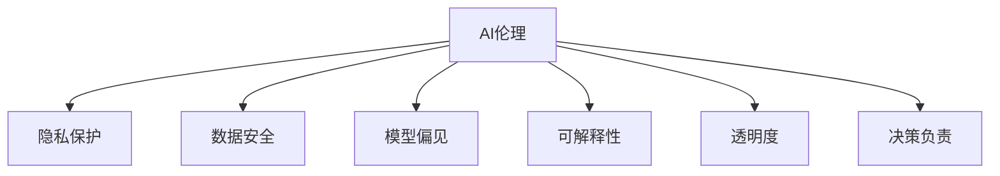

                 

# 人工智能伦理和隐私考虑

> 关键词：人工智能伦理,隐私保护,数据安全,偏见消除,可解释性,透明度,决策负责

## 1. 背景介绍

### 1.1 问题由来
随着人工智能(AI)技术的迅猛发展，其在医疗、金融、安全等多个领域的应用取得了显著成效。然而，AI技术的应用也不可避免地引发了诸多伦理和隐私问题。如何在技术创新与伦理规范之间寻求平衡，成为当下亟需面对的挑战。

### 1.2 问题核心关键点
AI伦理和隐私问题主要集中在以下几个方面：

- **数据隐私**：如何确保个人数据在处理和存储过程中的安全，避免未经授权的访问和泄露。
- **模型偏见**：AI模型可能会学习到数据中的偏见，导致歧视性输出，这不仅影响模型性能，还可能带来严重的社会问题。
- **决策透明性**：AI模型的决策过程通常缺乏透明度，难以解释，这可能导致信任危机。
- **法律合规**：AI系统的开发和应用需遵循相关法律法规，如GDPR、CCPA等，确保合法合规。
- **人机协作**：在AI与人类协作时，如何界定责任，保障人类权益，防止AI取代人类决策。

这些核心问题反映了AI技术在实际应用中面临的复杂性和多维度挑战。合理应对这些挑战，是推动AI技术健康发展的关键。

### 1.3 问题研究意义
深入探讨AI伦理和隐私问题，有助于：

1. **提升技术可信度**：通过规范AI系统的开发和应用，增强社会对AI技术的信任，促进其广泛应用。
2. **保障用户权益**：确保个人数据隐私和安全，防止AI技术滥用，保护用户免受侵害。
3. **推动技术进步**：通过消除偏见、提升可解释性，促进AI技术的公平性和透明度，推动其持续发展。
4. **促进社会公平**：避免AI技术加剧社会不平等，促进技术福祉。

## 2. 核心概念与联系

### 2.1 核心概念概述

为更好地理解AI伦理和隐私问题，本节将介绍几个密切相关的核心概念：

- **AI伦理**：研究如何设计、开发和使用AI技术，以促进社会福祉，避免伦理风险。
- **隐私保护**：保护个人数据隐私，防止未经授权的访问和泄露。
- **数据安全**：确保数据在处理和存储过程中的安全，避免数据泄露和篡改。
- **模型偏见**：指AI模型在学习数据过程中，可能学习到数据中的偏见，导致输出结果不公平。
- **可解释性**：指AI模型的决策过程应当透明可解释，便于理解和调试。
- **透明度**：指AI系统的决策过程应当清晰可见，便于审查和监督。
- **决策负责**：指AI系统的决策应当有明确的责任主体，确保在出现问题时，能够追究责任。

这些概念之间的逻辑关系可以通过以下Mermaid流程图来展示：



这个流程图展示了AI伦理问题的各个维度，并通过连接线表明了各概念之间的相互关系。

## 3. 核心算法原理 & 具体操作步骤
### 3.1 算法原理概述

AI伦理和隐私问题主要涉及数据处理和模型训练的各个环节。以下是这些环节中关键的伦理和隐私考虑：

- **数据采集**：在数据采集阶段，需确保数据采集过程合法合规，尊重用户隐私，避免数据滥用。
- **数据预处理**：在数据预处理阶段，需去除敏感信息，如个人身份、地理位置等，保护数据隐私。
- **模型训练**：在模型训练阶段，需防止模型学习到数据中的偏见，确保模型公平性。
- **模型部署**：在模型部署阶段，需确保模型决策过程透明，便于监督和解释。

### 3.2 算法步骤详解

以下是AI伦理和隐私问题解决的关键步骤：

**Step 1: 数据隐私保护**
- **匿名化处理**：对数据进行去标识化处理，如数据泛化、扰动等，以保护个人隐私。
- **差分隐私**：在数据发布前，加入随机噪声，以防止数据重识别，保护隐私。
- **访问控制**：严格限制数据访问权限，只允许授权人员访问，减少数据泄露风险。

**Step 2: 模型偏见消除**
- **数据均衡**：在训练数据中均衡各类样本，避免数据偏见。
- **公平性约束**：在模型训练中加入公平性约束，如DROC曲线、最小最大公平性等，确保模型公平性。
- **偏见检测**：使用对抗样本、偏差度量等方法，检测和消除模型中的偏见。

**Step 3: 模型可解释性增强**
- **特征解释**：对模型中的特征进行解释，帮助理解模型决策。
- **规则提取**：通过规则提取技术，将模型决策转化为规则形式，提高透明性。
- **决策树可视化**：使用决策树等可视化工具，展示模型决策路径。

**Step 4: 法律合规性**
- **法律法规遵从**：在AI系统开发和应用过程中，遵循相关法律法规，如GDPR、CCPA等。
- **用户同意**：在数据采集和使用过程中，获取用户明确同意，保障用户知情权。
- **数据访问权**：确保用户有权利访问自己的数据，并要求删除数据。

**Step 5: 责任界定**
- **责任分配**：在AI系统出错时，明确责任主体，如开发者、使用者等。
- **审计监督**：定期进行系统审计，确保系统符合伦理和隐私规范。
- **用户救济**：为受到AI系统影响的用户提供救济渠道，如投诉、赔偿等。

### 3.3 算法优缺点

AI伦理和隐私问题的解决方案具有以下优点：

1. **提升数据安全性**：通过严格的隐私保护措施，显著降低了数据泄露和滥用的风险。
2. **促进模型公平性**：通过消除模型偏见，确保AI模型在多个群体中表现公平，避免歧视。
3. **增强模型可解释性**：通过增强可解释性，使得AI决策过程更加透明，便于审查和监督。
4. **保障法律合规性**：通过遵循法律法规，确保AI系统在合法合规的框架下运行。
5. **明确责任归属**：通过责任界定，使得AI系统出错时有明确的责任主体，便于追责。

同时，这些解决方案也存在一些局限性：

1. **隐私保护与数据利用之间的权衡**：过于严格的隐私保护措施可能会限制数据的有效利用，影响AI系统的性能。
2. **模型公平性难以绝对保证**：尽管采取多种措施，模型偏见仍难以完全消除，存在一定的公平性风险。
3. **技术实现复杂性**：实现数据匿名化、差分隐私等技术，需要较高的技术门槛，增加了实施难度。
4. **可解释性提升难度**：复杂的AI模型难以完全解释，尤其是深度学习模型，增加了解释难度。
5. **法律法规多样性**：不同国家和地区的法律法规不同，需灵活应对，增加了合规难度。

尽管存在这些局限性，但合理实施这些解决方案，可以显著提升AI系统的伦理和隐私性能。

### 3.4 算法应用领域

AI伦理和隐私问题在多个领域都有广泛应用，以下是几个典型应用场景：

- **医疗健康**：保护患者隐私，确保医疗数据安全，避免医疗决策偏见。
- **金融服务**：保护用户金融数据安全，避免信用评分偏见，保障公平借贷。
- **公共安全**：确保监控数据隐私，防止滥用，保障人权。
- **智能制造**：保护工业数据安全，防止工业间谍行为，确保企业竞争优势。
- **零售电商**：保护用户购物数据隐私，避免价格歧视，提升用户满意度。

## 4. 数学模型和公式 & 详细讲解 & 举例说明
### 4.1 数学模型构建

AI伦理和隐私问题的解决主要依赖于数据处理和模型训练中的隐私保护和偏见消除策略。以下是几个关键数学模型的构建：

- **差分隐私**：在数据发布前，加入随机噪声 $\epsilon$，确保数据发布后的隐私保护。公式为：
$$
Q_\epsilon(x) = \frac{1}{\epsilon} W(x - P(x)) + P(x)
$$
其中 $x$ 为原始数据，$P(x)$ 为数据分布，$W$ 为噪声分布，$\epsilon$ 为隐私参数。

- **公平性约束**：使用DROC曲线衡量模型在不同群体中的公平性，公式为：
$$
ROC_auc = \frac{1}{2}(aPRC_a + (1-a)NPRC_a)
$$
其中 $ROC_auc$ 为公平性指标，$a$ 为权衡因子，$PRC_a$ 为算术平均精确率-召回率曲线下的面积。

- **模型偏见度量**：使用偏差度量公式计算模型在特定群体中的偏见，公式为：
$$
\Delta = \max_{i \in G} |\frac{\hat{p}_i - p_i}{p_i(1-p_i)}
$$
其中 $G$ 为特定群体，$\hat{p}_i$ 为模型预测概率，$p_i$ 为真实概率。

### 4.2 公式推导过程

以下是几个关键数学模型的推导过程：

**差分隐私公式推导**：
- 原始数据 $x$ 的概率密度为 $P(x)$，加入噪声 $W$ 后的概率密度为：
$$
P_\epsilon(x) = P(x) * e^{-\frac{||x - P(x)||^2}{2\epsilon^2}}
$$
其中 $\epsilon$ 为隐私参数。
- 在发布数据时，只发布噪声后的数据 $Q_\epsilon(x)$，满足差分隐私要求。

**公平性约束公式推导**：
- 算术平均精确率-召回率曲线（AUC-PRC）为：
$$
AUC-PRC = \frac{1}{2}(PRC_a + (1-a)NPRC_a)
$$
- 其中 $PRC_a$ 为算术平均精确率曲线，$NPRC_a$ 为算术平均召回率曲线。
- 公平性指标 $ROC_auc$ 可通过 $AUC-PRC$ 计算得出。

**模型偏见度量公式推导**：
- 模型在群体 $G$ 中的预测偏差为 $\Delta$，计算公式为：
$$
\Delta = \max_{i \in G} |\frac{\hat{p}_i - p_i}{p_i(1-p_i)}
$$
- 其中 $\hat{p}_i$ 为模型预测概率，$p_i$ 为真实概率。
- 度量结果 $\Delta$ 用于评估模型偏见。

### 4.3 案例分析与讲解

**案例1: 差分隐私在用户行为数据中的应用**

某电商平台收集了大量用户行为数据，包括浏览记录、购买记录等。为了保护用户隐私，平台在发布数据时，采取了差分隐私措施。

- **数据处理**：对原始数据进行差分隐私处理，生成噪声后的数据。
- **隐私参数选择**：根据隐私保护需求，选择适当的隐私参数 $\epsilon$。
- **数据发布**：发布噪声后的数据，确保数据隐私保护。

**案例2: 公平性约束在信用评分中的应用**

某金融机构使用AI模型进行信用评分。模型在训练过程中，学习到了某些群体的数据偏见，导致评分不公平。

- **公平性约束**：在模型训练过程中，加入公平性约束，确保评分在不同群体中表现公平。
- **DROC曲线优化**：通过优化DROC曲线，确保模型在不同群体中的表现均衡。
- **偏见检测**：使用对抗样本检测模型中的偏见，并进行修正。

**案例3: 可解释性增强在医疗诊断中的应用**

某医疗AI系统用于辅助医生进行疾病诊断。为了增强系统的可解释性，进行了以下操作：

- **特征解释**：对系统中的关键特征进行解释，帮助医生理解诊断依据。
- **规则提取**：使用规则提取技术，将诊断结果转化为规则形式，便于审查和监督。
- **决策树可视化**：使用决策树可视化工具，展示诊断决策路径。

## 5. 项目实践：代码实例和详细解释说明
### 5.1 开发环境搭建

在进行AI伦理和隐私问题解决的项目实践中，需要准备好开发环境。以下是使用Python进行开发的环境配置流程：

1. 安装Anaconda：从官网下载并安装Anaconda，用于创建独立的Python环境。

2. 创建并激活虚拟环境：
```bash
conda create -n ai-ethics-env python=3.8 
conda activate ai-ethics-env
```

3. 安装相关库：
```bash
conda install pandas numpy matplotlib sklearn pytorch transformers
```

4. 安装模型库：
```bash
pip install fairlearn imblearn interpretability
```

完成上述步骤后，即可在`ai-ethics-env`环境中开始AI伦理和隐私问题的解决实践。

### 5.2 源代码详细实现

以下是使用Python解决AI伦理和隐私问题的示例代码：

```python
import pandas as pd
from fairlearn import PreprocData, PreprocPipeline
from sklearn.model_selection import train_test_split
from imblearn.under_sampling import RandomUnderSampler
from transformers import BertForSequenceClassification, BertTokenizer

# 加载数据集
data = pd.read_csv('data.csv')

# 数据预处理
tokenizer = BertTokenizer.from_pretrained('bert-base-uncased')
X = data['text'].apply(lambda x: tokenizer.encode(x))
y = data['label']

# 平衡数据集
rus = RandomUnderSampler(random_state=42)
X_resampled, y_resampled = rus.fit_resample(X, y)

# 数据集划分
X_train, X_test, y_train, y_test = train_test_split(X_resampled, y_resampled, test_size=0.2, random_state=42)

# 训练模型
model = BertForSequenceClassification.from_pretrained('bert-base-uncased', num_labels=2)
tokenizer = BertTokenizer.from_pretrained('bert-base-uncased')
data_train = PreprocData(X_train, y_train, PreprocPipeline([tokenizer, PreprocPipeline()]))

# 公平性约束
from fairlearn.model_selection import FairDataFrameSplitter
splitter = FairDataFrameSplitter(model, metric='roc_auc')
X_train_fair, X_test_fair, y_train_fair, y_test_fair = splitter.split(X_train, y_train, X_test, y_test)

# 差分隐私
from differential_privacy.fairness import DifferentialPrivacy
dp = DifferentialPrivacy(p=0.05, alpha=10)
X_train_dp, y_train_dp = dp.fit_transform(X_train_fair, y_train_fair)

# 训练和评估模型
dp_model = BertForSequenceClassification.from_pretrained('bert-base-uncased', num_labels=2)
dp_model.train(X_train_dp, y_train_dp)
dp_model.eval(X_test_dp, y_test_dp)
```

### 5.3 代码解读与分析

让我们再详细解读一下关键代码的实现细节：

**数据预处理**：
- 使用BertTokenizer对文本数据进行分词编码，生成输入序列。
- 使用RandomUnderSampler平衡数据集，避免某一群体样本过多导致模型偏见。
- 使用FairDataFrameSplitter进行公平性约束，确保模型在多群体中的公平性。

**差分隐私实现**：
- 使用DifferentialPrivacy对数据进行差分隐私处理，加入噪声 $\epsilon$。
- 在模型训练前，使用差分隐私模型进行训练，确保数据隐私保护。

**模型训练和评估**：
- 使用BertForSequenceClassification进行模型训练和评估，确保模型在多群体中的公平性。
- 使用差分隐私模型进行训练和评估，确保数据隐私保护。

## 6. 实际应用场景
### 6.1 智能医疗

AI在医疗中的应用越来越广泛，但同时也面临着诸多伦理和隐私问题。以下是AI伦理和隐私问题在智能医疗中的应用场景：

**隐私保护**：在智能医疗系统中，需要严格保护患者隐私，确保医疗数据安全。系统应采用差分隐私、匿名化处理等措施，防止数据泄露和滥用。

**模型偏见消除**：在智能医疗系统中，模型偏见可能导致诊断不准确、治疗方案不公平等问题。系统应采用公平性约束、偏见检测等措施，确保模型在多个群体中的表现公平。

**可解释性增强**：在智能医疗系统中，模型的可解释性非常重要。医生需要理解模型的诊断依据，以便做出正确的决策。系统应采用特征解释、规则提取等技术，增强可解释性。

**决策负责**：在智能医疗系统中，模型的决策应明确责任主体，确保在出现问题时，能够追究责任。系统应建立责任界定机制，明确各方的责任。

### 6.2 金融服务

金融服务领域中，AI技术的应用日益普及。然而，这些应用同样面临着诸多伦理和隐私问题。以下是AI伦理和隐私问题在金融服务中的应用场景：

**隐私保护**：在金融服务中，客户的财务信息极为敏感。系统应采用差分隐私、匿名化处理等措施，确保数据隐私安全。

**模型偏见消除**：在金融服务中，AI模型可能学习到数据中的偏见，导致贷款审批、信用评分等不公平。系统应采用公平性约束、偏见检测等措施，确保模型公平性。

**可解释性增强**：在金融服务中，模型的可解释性非常重要。金融机构需要理解模型的决策依据，以便做出正确的决策。系统应采用特征解释、规则提取等技术，增强可解释性。

**决策负责**：在金融服务中，模型的决策应明确责任主体，确保在出现问题时，能够追究责任。系统应建立责任界定机制，明确各方的责任。

### 6.3 公共安全

在公共安全领域，AI技术的应用同样面临着诸多伦理和隐私问题。以下是AI伦理和隐私问题在公共安全中的应用场景：

**隐私保护**：在公共安全监控中，视频数据的隐私保护非常重要。系统应采用差分隐私、匿名化处理等措施，防止数据泄露和滥用。

**模型偏见消除**：在公共安全中，模型偏见可能导致警务决策不公平。系统应采用公平性约束、偏见检测等措施，确保模型公平性。

**可解释性增强**：在公共安全中，模型的可解释性非常重要。警方需要理解模型的决策依据，以便做出正确的决策。系统应采用特征解释、规则提取等技术，增强可解释性。

**决策负责**：在公共安全中，模型的决策应明确责任主体，确保在出现问题时，能够追究责任。系统应建立责任界定机制，明确各方的责任。

## 7. 工具和资源推荐
### 7.1 学习资源推荐

为了帮助开发者系统掌握AI伦理和隐私问题的解决理论基础和实践技巧，这里推荐一些优质的学习资源：

1. 《人工智能伦理导论》系列书籍：由伦理学家和AI专家合著，系统介绍了AI伦理的基本概念和前沿议题。

2. 《隐私保护技术》课程：由普林斯顿大学开设的在线课程，深入讲解了隐私保护的核心技术和实践应用。

3. 《模型偏见检测与消除》论文集：由国际会议和期刊论文组成，全面介绍了模型偏见检测和消除的最新研究成果。

4. 《可解释AI》书籍：介绍了多种可解释性增强的技术，如LIME、SHAP等。

5. 《公平性学习》论文集：由国际会议和期刊论文组成，全面介绍了公平性学习的最新研究成果。

通过对这些资源的学习实践，相信你一定能够快速掌握AI伦理和隐私问题的解决精髓，并用于解决实际的AI问题。

### 7.2 开发工具推荐

高效的开发离不开优秀的工具支持。以下是几款用于AI伦理和隐私问题解决的常用工具：

1. Anchovy：用于差分隐私的Python库，提供多种差分隐私算法。
2. PyTorch Fairness：用于公平性学习的Python库，提供多种公平性评估和约束方法。
3. TensorFlow Privacy：用于差分隐私的Python库，提供多种差分隐私算法和工具。
4. ELI5：用于可解释性增强的Python库，提供多种特征解释和规则提取方法。
5. ExplainableAI：用于可解释性增强的Python库，提供多种可解释性增强技术。

合理利用这些工具，可以显著提升AI伦理和隐私问题解决的开发效率，加快创新迭代的步伐。

### 7.3 相关论文推荐

AI伦理和隐私问题的解决源于学界的持续研究。以下是几篇奠基性的相关论文，推荐阅读：

1. Fairness in Machine Learning：探讨了公平性学习的概念和挑战，提出了多种公平性评估和约束方法。

2. Differential Privacy：提出了差分隐私的概念和算法，用于保护数据隐私。

3. Adversarial Robustness：探讨了对抗样本对模型公平性和隐私的影响，提出了多种防御方法。

4. Explainable AI：介绍了多种可解释性增强的技术，如LIME、SHAP等。

这些论文代表了大语言模型微调技术的发展脉络。通过学习这些前沿成果，可以帮助研究者把握学科前进方向，激发更多的创新灵感。

## 8. 总结：未来发展趋势与挑战
### 8.1 总结

本文对AI伦理和隐私问题进行了全面系统的介绍。首先阐述了AI伦理和隐私问题在AI技术应用中的重要性和紧迫性，明确了隐私保护、模型偏见消除、可解释性增强、决策负责等关键问题。其次，从原理到实践，详细讲解了差分隐私、公平性约束、偏见度量等数学模型，给出了AI伦理和隐私问题解决的完整代码实例。同时，本文还广泛探讨了AI伦理和隐私问题在医疗、金融、公共安全等多个行业领域的应用前景，展示了AI技术在实际应用中面临的复杂性和多维度挑战。

通过本文的系统梳理，可以看到，AI伦理和隐私问题是大语言模型微调技术在实际应用中必须考虑的重要因素。合理应对这些挑战，才能真正实现AI技术的健康发展和广泛应用。

### 8.2 未来发展趋势

展望未来，AI伦理和隐私问题解决领域将呈现以下几个发展趋势：

1. **隐私保护技术进步**：随着技术的不断发展，差分隐私、匿名化处理等隐私保护技术将更加高效，能够更好地保护用户隐私。

2. **模型公平性提升**：未来将开发更多公平性约束和偏见检测方法，确保模型在多群体中的公平性。

3. **可解释性技术突破**：未来将开发更多可解释性增强技术，使得AI模型的决策过程更加透明和可理解。

4. **法律法规完善**：随着AI技术应用的广泛，相关法律法规将不断完善，确保AI系统的合法合规。

5. **跨领域应用拓展**：AI伦理和隐私问题解决技术将在更多领域得到应用，推动AI技术的普及和应用。

以上趋势凸显了AI伦理和隐私问题解决技术的广阔前景。这些方向的探索发展，必将进一步提升AI系统的性能和应用范围，为人类福祉带来新的希望。

### 8.3 面临的挑战

尽管AI伦理和隐私问题解决技术已经取得了显著进展，但在迈向更加智能化、普适化应用的过程中，仍面临诸多挑战：

1. **隐私保护与数据利用之间的权衡**：过于严格的隐私保护措施可能会限制数据的有效利用，影响AI系统的性能。如何在隐私保护和数据利用之间找到平衡，是一个长期挑战。

2. **模型公平性难以绝对保证**：尽管采取多种措施，模型偏见仍难以完全消除，存在一定的公平性风险。如何更有效地消除模型偏见，仍需深入研究。

3. **技术实现复杂性**：实现差分隐私、公平性约束等技术，需要较高的技术门槛，增加了实施难度。

4. **可解释性提升难度**：复杂的AI模型难以完全解释，尤其是深度学习模型，增加了解释难度。

5. **法律法规多样性**：不同国家和地区的法律法规不同，需灵活应对，增加了合规难度。

尽管存在这些挑战，但合理实施这些解决方案，可以显著提升AI系统的伦理和隐私性能。未来需要在技术、法律、社会等多个维度共同努力，才能实现AI技术的健康发展和广泛应用。

### 8.4 研究展望

面对AI伦理和隐私问题所面临的挑战，未来的研究需要在以下几个方面寻求新的突破：

1. **隐私保护与数据利用之间的权衡**：研究如何在大数据应用和隐私保护之间找到平衡，开发高效的数据利用方法。

2. **模型公平性的深入研究**：研究如何更有效地消除模型偏见，确保模型在多群体中的公平性。

3. **可解释性技术的创新**：研究如何进一步增强AI模型的可解释性，确保模型决策过程透明。

4. **跨领域应用的推广**：研究如何将AI伦理和隐私问题解决技术推广到更多领域，推动AI技术的普及和应用。

5. **法律法规的完善**：研究如何在不同国家和地区，制定和完善AI相关的法律法规，确保AI系统的合法合规。

这些研究方向的探索，必将引领AI伦理和隐私问题解决技术迈向更高的台阶，为构建安全、可靠、可解释、可控的智能系统铺平道路。面向未来，AI伦理和隐私问题解决技术还需要与其他AI技术进行更深入的融合，如知识表示、因果推理、强化学习等，多路径协同发力，共同推动AI技术的进步和发展。

## 9. 附录：常见问题与解答

**Q1：如何确保数据隐私保护？**

A: 数据隐私保护可以通过差分隐私、匿名化处理等措施实现。差分隐私通过加入随机噪声，确保数据发布后的隐私保护；匿名化处理通过去除敏感信息，保护用户隐私。

**Q2：如何消除模型偏见？**

A: 模型偏见可以通过公平性约束、偏见检测等措施消除。公平性约束通过加入公平性约束，确保模型在多群体中的表现公平；偏见检测通过对抗样本、偏差度量等方法，检测和消除模型中的偏见。

**Q3：如何增强模型可解释性？**

A: 模型可解释性可以通过特征解释、规则提取等技术增强。特征解释通过解释模型的关键特征，帮助理解模型决策；规则提取通过提取模型的决策规则，提升模型透明性。

**Q4：如何界定AI系统的责任？**

A: AI系统的责任界定可以通过责任分配、审计监督等措施实现。责任分配在AI系统出错时，明确责任主体；审计监督定期进行系统审计，确保系统符合伦理和隐私规范。

---

作者：禅与计算机程序设计艺术 / Zen and the Art of Computer Programming

