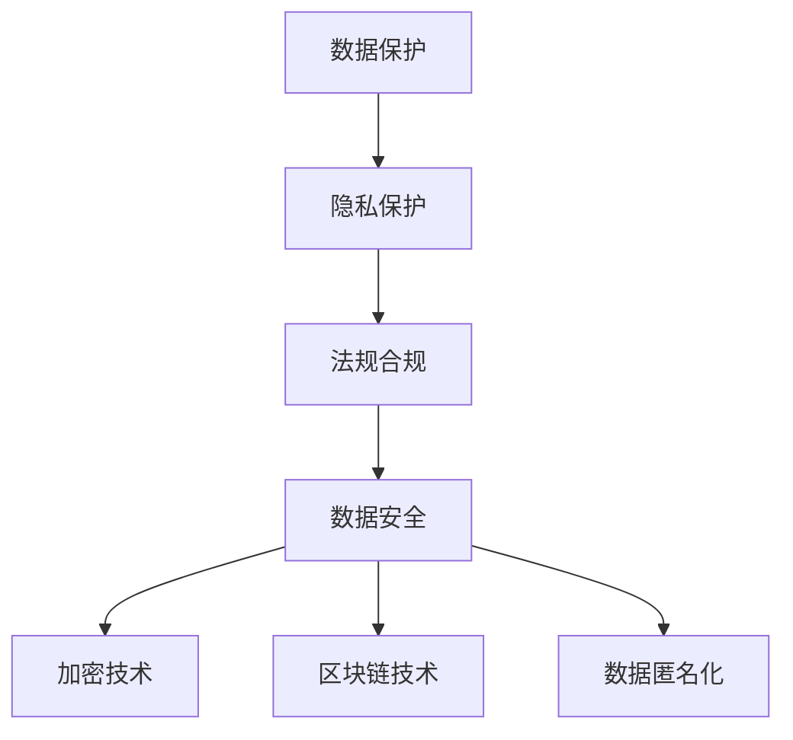

                 

# 人工智能创业数据保护措施

> 关键词：人工智能, 数据保护, 隐私保护, 法规合规, 数据安全, 加密技术, 区块链技术, 数据匿名化

## 1. 背景介绍

在当今数字化时代，数据已经成为企业最宝贵的资产之一。对于初创人工智能(AI)企业来说，数据的获取和利用是至关重要的，但随之而来的数据保护问题也日益严峻。随着GDPR、CCPA等国际法规的日益严格，以及用户隐私意识的提高，数据保护成为了AI企业必须严格遵守的底线。本文将深入探讨如何通过技术手段和合规措施，确保AI创业企业的数据保护，同时提升数据利用效率。

## 2. 核心概念与联系

### 2.1 核心概念概述

为更好地理解数据保护措施，本节将介绍几个密切相关的核心概念：

- **数据保护**：指对个人或企业数据的收集、存储、使用和传输过程中，采取的预防和缓解隐私泄露、数据滥用等风险的措施。
- **隐私保护**：指保护个人隐私不被未经授权的第三方获取和使用的过程，如通过数据匿名化、差分隐私等手段。
- **法规合规**：指在数据处理过程中，遵循相关法律法规的要求，如GDPR、CCPA等，确保数据的合法合规使用。
- **数据安全**：指数据在存储和传输过程中，通过加密、访问控制等技术手段，确保数据的完整性和保密性。
- **加密技术**：指将数据转换为不可读的形式，仅授权用户可以解密并恢复原始数据的技术。
- **区块链技术**：一种去中心化、分布式账本技术，通过区块链不可篡改的特征，保证数据的透明性和不可抵赖性。
- **数据匿名化**：指将个人数据去标识化处理，使无法直接识别个体，从而保护用户隐私。

这些核心概念之间的逻辑关系可以通过以下Mermaid流程图来展示：



这个流程图展示了一些核心概念之间的逻辑关系：

1. 数据保护是整个数据安全工作的基石，涵盖隐私保护、法规合规、数据安全等多个方面。
2. 隐私保护是数据保护的重要组成部分，主要通过数据匿名化等手段实现。
3. 法规合规是确保数据处理合法性的重要手段，主要遵循GDPR、CCPA等国际法规。
4. 数据安全主要通过加密技术和区块链技术等手段，确保数据在存储和传输过程中的安全。
5. 数据匿名化是隐私保护的一种重要手段，通过去标识化处理保护用户隐私。

## 3. 核心算法原理 & 具体操作步骤
### 3.1 算法原理概述

数据保护措施的核心思想是通过技术手段和管理措施，对数据从采集、存储、使用到销毁的整个生命周期进行严格控制，避免数据泄露和滥用。主要包括：

1. **数据匿名化**：通过去标识化处理，将个人数据去关联化，使其无法直接识别个体，从而保护隐私。
2. **加密技术**：对数据进行加密处理，使其在传输和存储过程中无法被未授权者访问和解读。
3. **区块链技术**：通过去中心化和不可篡改的特征，确保数据记录的透明性和不可抵赖性。
4. **访问控制**：通过角色和权限管理，限制数据的访问和使用，确保数据的安全性和合规性。
5. **审计与监控**：对数据访问和使用进行持续监控和审计，及时发现和响应潜在的安全威胁。

### 3.2 算法步骤详解

基于数据保护的核心思想，数据保护措施可以大致分为以下几个步骤：

**Step 1: 数据采集与存储**

- **数据采集**：在数据采集过程中，尽可能遵循“最小化原则”，只收集必要的数据。同时，采用数据匿名化技术，去除与个人身份直接相关的信息。
- **数据存储**：对采集到的数据进行加密处理，确保在存储过程中数据的保密性和完整性。同时，采用数据分片和分布式存储，分散数据风险。

**Step 2: 数据访问与使用**

- **访问控制**：根据不同角色的需求，分配相应的访问权限。通过角色和权限管理，确保数据仅被授权用户访问和使用。
- **数据使用**：在数据使用过程中，采用差分隐私等技术手段，保护用户隐私。同时，对数据使用过程进行监控和审计，确保数据使用的合法性和合规性。

**Step 3: 数据销毁与备份**

- **数据销毁**：对不再需要的数据进行安全销毁，采用不可恢复的删除方式，确保数据无法被恢复。
- **数据备份**：对重要数据进行备份，确保数据在意外丢失或损坏时能够恢复。

### 3.3 算法优缺点

数据保护措施具有以下优点：

1. **提升数据安全**：通过技术手段和管理措施，确保数据在存储和传输过程中的安全，避免数据泄露和滥用。
2. **保障合规性**：遵循GDPR、CCPA等国际法规，确保数据处理合法合规。
3. **增强隐私保护**：通过数据匿名化和差分隐私等技术手段，保护用户隐私，避免个人数据被滥用。

同时，该方法也存在一定的局限性：

1. **技术复杂性高**：实现数据保护需要较高的技术水平和资源投入，特别是对于数据加密和访问控制等技术。
2. **成本高**：数据保护措施的实施需要投入大量资金，特别是对于数据量大、处理复杂的企业。
3. **法律风险**：数据保护措施需要严格遵守相关法律法规，一旦出现违规行为，可能会面临高额罚款和法律诉讼。

尽管存在这些局限性，但就目前而言，数据保护措施仍然是保障数据安全的重要手段，对AI创业企业尤为重要。

### 3.4 算法应用领域

数据保护措施广泛应用于各种行业，如金融、医疗、电商等，确保数据的安全和隐私。特别是在AI领域，数据保护措施对企业的发展和用户信任至关重要。以下是几个典型应用场景：

1. **金融领域**：金融机构需要处理大量敏感的金融数据，数据保护措施可以有效防范数据泄露和欺诈行为，保障用户资金安全。
2. **医疗领域**：医疗机构需要处理病人的病历和医疗数据，数据保护措施可以确保数据的安全和隐私，避免医疗数据泄露。
3. **电商领域**：电商平台需要处理用户的购物数据和支付信息，数据保护措施可以确保用户数据的安全和隐私，提升用户信任。
4. **AI创业企业**：AI企业依赖大量数据进行模型训练和优化，数据保护措施可以确保数据的合法合规使用，提升企业竞争力。

## 4. 数学模型和公式 & 详细讲解 & 举例说明
### 4.1 数学模型构建

本节将使用数学语言对数据保护措施进行更加严格的刻画。

假设需要保护的数据集为 $D$，其中 $D=\{x_i\}_{i=1}^N$，其中 $x_i \in X$，$X$ 为数据空间。数据保护的目标是最大化数据的安全性和隐私性，即最小化数据泄露的概率。

定义隐私损失函数 $\mathcal{L}_{\text{privacy}}$，用于衡量数据泄露的风险。一般采用差分隐私等方法，计算数据泄露的概率。

### 4.2 公式推导过程

以下我们以差分隐私为例，推导隐私损失函数的计算公式。

假设模型 $M$ 在数据集 $D$ 上的隐私损失为 $\epsilon$-差分隐私，则有：

$$
\mathcal{L}_{\text{privacy}}(D, M) = \epsilon
$$

其中 $\epsilon$ 为隐私参数，表示数据泄露概率的上限。

在实际应用中，差分隐私可以通过添加噪声来达到。假设 $M$ 在 $D$ 上的真实输出为 $y$，在加入噪声后的输出为 $y'$，则隐私保护的目标是：

$$
\mathbb{P}(y' \neq y) \leq \frac{\epsilon}{2}
$$

其中 $\epsilon$ 为隐私参数。

### 4.3 案例分析与讲解

假设某AI创业公司需要保护用户的个人信息，可以采用差分隐私技术，对用户数据进行隐私化处理。具体步骤如下：

1. **数据匿名化**：对用户的个人信息进行去标识化处理，去除与个人身份直接相关的信息。
2. **添加噪声**：在用户数据上添加随机噪声，使得泄露数据的概率满足隐私参数 $\epsilon$ 的要求。
3. **差分隐私模型**：在差分隐私模型中，采用采样方法，对添加噪声后的数据进行预测。

例如，某金融公司需要保护用户的交易记录，可以采用差分隐私技术，对用户交易记录进行隐私化处理。具体步骤如下：

1. **数据匿名化**：对用户的交易记录进行去标识化处理，去除与个人身份直接相关的信息。
2. **添加噪声**：在用户交易记录上添加随机噪声，使得泄露数据的概率满足隐私参数 $\epsilon$ 的要求。
3. **差分隐私模型**：在差分隐私模型中，采用采样方法，对添加噪声后的数据进行预测。

## 5. 项目实践：代码实例和详细解释说明
### 5.1 开发环境搭建

在进行数据保护实践前，我们需要准备好开发环境。以下是使用Python进行PyTorch开发的环境配置流程：

1. 安装Anaconda：从官网下载并安装Anaconda，用于创建独立的Python环境。

2. 创建并激活虚拟环境：
```bash
conda create -n pytorch-env python=3.8 
conda activate pytorch-env
```

3. 安装PyTorch：根据CUDA版本，从官网获取对应的安装命令。例如：
```bash
conda install pytorch torchvision torchaudio cudatoolkit=11.1 -c pytorch -c conda-forge
```

4. 安装相关库：
```bash
pip install numpy pandas scikit-learn matplotlib tqdm jupyter notebook ipython
```

完成上述步骤后，即可在`pytorch-env`环境中开始数据保护实践。

### 5.2 源代码详细实现

以下是一个简单的数据保护实践示例，演示了如何使用差分隐私技术对用户数据进行隐私化处理。

```python
import numpy as np
from sklearn.datasets import make_classification
from sklearn.model_selection import train_test_split
from sklearn.linear_model import LogisticRegression
from sklearn.metrics import accuracy_score
from differential_privacy import PrivacyController

# 生成一个分类数据集
X, y = make_classification(n_samples=1000, n_features=10, random_state=0)

# 划分训练集和测试集
X_train, X_test, y_train, y_test = train_test_split(X, y, test_size=0.2, random_state=0)

# 构建逻辑回归模型
model = LogisticRegression()

# 定义隐私保护参数
epsilon = 0.1
delta = 0.1

# 创建隐私保护控制器
privacy_controller = PrivacyController(model, epsilon, delta)

# 训练模型
privacy_controller.train(X_train, y_train)

# 预测测试集结果
y_pred = privacy_controller.predict(X_test)

# 计算模型准确率
accuracy = accuracy_score(y_test, y_pred)
print(f"模型准确率: {accuracy}")
```

### 5.3 代码解读与分析

让我们再详细解读一下关键代码的实现细节：

**隐私保护参数**：
- `epsilon`：隐私参数，表示数据泄露概率的上限。
- `delta`：隐私参数，表示数据泄露概率的差值。

**隐私保护控制器**：
- 使用差分隐私库 `differential_privacy`，创建隐私保护控制器 `PrivacyController`，并指定隐私参数 `epsilon` 和 `delta`。
- `train` 方法用于训练模型，并在训练过程中加入差分隐私技术。

**模型训练**：
- 使用 `train_test_split` 划分数据集为训练集和测试集。
- 使用 `LogisticRegression` 构建逻辑回归模型。
- 使用 `train` 方法训练模型，并在训练过程中加入差分隐私技术。
- 使用 `predict` 方法预测测试集结果，并计算模型准确率。

## 6. 实际应用场景
### 6.1 金融领域

在金融领域，数据保护措施尤为重要。金融机构需要处理大量敏感的金融数据，如用户的交易记录、账户信息等。数据泄露不仅会带来经济损失，还可能引发用户信任危机，甚至影响金融市场的稳定。

以下是一些实际应用场景：

1. **交易记录隐私化**：对用户的交易记录进行隐私化处理，确保交易记录在存储和传输过程中不被泄露。
2. **客户信息保护**：对客户的个人信息进行去标识化处理，确保客户信息的安全。
3. **反欺诈检测**：对用户的交易行为进行监控和分析，保护用户免受欺诈行为的侵害。

### 6.2 医疗领域

医疗机构需要处理病人的病历和医疗数据，数据保护措施可以有效防范数据泄露和滥用，保障患者隐私和数据安全。

以下是一些实际应用场景：

1. **病历隐私化**：对病人的病历数据进行隐私化处理，确保病历数据在存储和传输过程中不被泄露。
2. **医疗数据保护**：对病人的医疗数据进行去标识化处理，确保医疗数据的安全。
3. **临床试验数据保护**：对临床试验数据进行隐私化处理，确保患者数据的安全和隐私。

### 6.3 电商领域

电商平台需要处理用户的购物数据和支付信息，数据保护措施可以有效防范数据泄露和滥用，提升用户信任。

以下是一些实际应用场景：

1. **用户行为数据保护**：对用户的购物行为数据进行隐私化处理，确保用户行为数据的安全。
2. **交易记录保护**：对用户的交易记录进行隐私化处理，确保交易记录在存储和传输过程中不被泄露。
3. **客户信息保护**：对客户的个人信息进行去标识化处理，确保客户信息的安全。

### 6.4 未来应用展望

随着数据保护技术的不断发展，未来数据保护措施将呈现出以下几个趋势：

1. **隐私计算崛起**：隐私计算技术如联邦学习、多方安全计算等，可以在不共享原始数据的情况下，实现数据处理和模型训练。
2. **区块链技术融合**：区块链技术可以在数据存储和传输过程中，提供透明性和不可抵赖性，保障数据的安全和隐私。
3. **人工智能技术应用**：人工智能技术如差分隐私、联邦学习等，可以在数据保护过程中，提升数据的利用效率和隐私保护水平。
4. **数据安全立法加强**：各国政府将加强数据保护立法，提升数据保护水平，保障用户隐私和数据安全。

## 7. 工具和资源推荐
### 7.1 学习资源推荐

为了帮助开发者系统掌握数据保护的理论基础和实践技巧，这里推荐一些优质的学习资源：

1. **《数据科学导论》**：讲授数据科学基础理论，涵盖数据采集、处理、分析和可视化等方面。
2. **《数据保护与隐私工程》**：介绍数据保护和隐私工程的基本概念和技术手段，如差分隐私、数据匿名化等。
3. **《人工智能伦理与法律》**：探讨人工智能伦理与法律问题，包括数据隐私、算法偏见等。
4. **《区块链技术与应用》**：介绍区块链技术的基本原理和应用场景，如数据安全和隐私保护等。
5. **《数据科学实战》**：结合实战案例，讲解数据科学的全流程，包括数据采集、处理、分析和模型构建等。

通过对这些资源的学习实践，相信你一定能够快速掌握数据保护的技术精髓，并用于解决实际的隐私保护问题。

### 7.2 开发工具推荐

高效的开发离不开优秀的工具支持。以下是几款用于数据保护开发的常用工具：

1. **TensorFlow**：基于Python的开源深度学习框架，支持差分隐私和数据匿名化等技术。
2. **PyTorch**：基于Python的开源深度学习框架，支持差分隐私和数据匿名化等技术。
3. **Differential Privacy**：差分隐私库，支持差分隐私技术，可以在数据处理过程中加入噪声。
4. **Federated Learning**：联邦学习库，支持联邦学习技术，可以在不共享原始数据的情况下，进行模型训练。
5. **Homomorphic Encryption**：同态加密库，支持同态加密技术，可以在数据处理过程中保持数据隐私。

合理利用这些工具，可以显著提升数据保护任务的开发效率，加快创新迭代的步伐。

### 7.3 相关论文推荐

数据保护技术的发展源于学界的持续研究。以下是几篇奠基性的相关论文，推荐阅读：

1. **《Differential Privacy》**：差分隐私技术的开创性论文，提出差分隐私的基本概念和实现方法。
2. **《Federated Learning》**：联邦学习技术的开创性论文，提出联邦学习的基本框架和实现方法。
3. **《Homomorphic Encryption》**：同态加密技术的开创性论文，提出同态加密的基本概念和实现方法。
4. **《Blockchain Technology》**：区块链技术的开创性论文，提出区块链的基本原理和应用场景。

这些论文代表了大数据保护技术的发展脉络。通过学习这些前沿成果，可以帮助研究者把握学科前进方向，激发更多的创新灵感。

## 8. 总结：未来发展趋势与挑战
### 8.1 总结

本文对数据保护措施进行了全面系统的介绍。首先阐述了数据保护的重要性，明确了数据保护在AI创业企业中的核心地位。其次，从原理到实践，详细讲解了数据保护的核心思想和关键步骤，给出了数据保护任务开发的完整代码实例。同时，本文还探讨了数据保护措施在金融、医疗、电商等领域的实际应用，展示了数据保护范式的巨大潜力。此外，本文精选了数据保护技术的各类学习资源，力求为读者提供全方位的技术指引。

通过本文的系统梳理，可以看到，数据保护措施是AI企业必须严格遵守的底线，是保障数据安全和隐私的重要手段。未来，伴随数据保护技术的持续演进，数据保护措施必将在构建安全、可靠、可控的智能系统中发挥越来越重要的作用。

### 8.2 未来发展趋势

展望未来，数据保护技术将呈现以下几个发展趋势：

1. **隐私计算技术发展**：隐私计算技术如联邦学习、多方安全计算等，可以在不共享原始数据的情况下，实现数据处理和模型训练。
2. **区块链技术融合**：区块链技术可以在数据存储和传输过程中，提供透明性和不可抵赖性，保障数据的安全和隐私。
3. **人工智能技术应用**：人工智能技术如差分隐私、联邦学习等，可以在数据保护过程中，提升数据的利用效率和隐私保护水平。
4. **数据安全立法加强**：各国政府将加强数据保护立法，提升数据保护水平，保障用户隐私和数据安全。

这些趋势凸显了数据保护技术的广阔前景，为数据保护的未来发展提供了新的方向。

### 8.3 面临的挑战

尽管数据保护技术已经取得了一定的进展，但在迈向更加智能化、普适化应用的过程中，它仍面临着诸多挑战：

1. **技术复杂性高**：实现数据保护需要较高的技术水平和资源投入，特别是对于数据加密和访问控制等技术。
2. **成本高**：数据保护措施的实施需要投入大量资金，特别是对于数据量大、处理复杂的企业。
3. **法律风险**：数据保护措施需要严格遵守相关法律法规，一旦出现违规行为，可能会面临高额罚款和法律诉讼。

尽管存在这些挑战，但就目前而言，数据保护措施仍然是保障数据安全的重要手段，对AI创业企业尤为重要。

### 8.4 研究展望

面对数据保护所面临的种种挑战，未来的研究需要在以下几个方面寻求新的突破：

1. **探索无监督和半监督隐私保护方法**：摆脱对大规模标注数据的依赖，利用自监督学习、主动学习等无监督和半监督范式，最大限度利用非结构化数据，实现更加灵活高效的隐私保护。
2. **研究参数高效和计算高效的隐私保护范式**：开发更加参数高效和计算高效的隐私保护方法，在固定大部分原始数据的情况下，只更新极少量的任务相关数据。
3. **融合因果分析和博弈论工具**：将因果分析方法引入隐私保护，识别出隐私保护的关键特征，增强隐私保护的因果性和逻辑性。借助博弈论工具刻画人机交互过程，主动探索并规避隐私保护的脆弱点，提高系统稳定性。
4. **纳入伦理道德约束**：在隐私保护目标中引入伦理导向的评估指标，过滤和惩罚有偏见、有害的输出倾向。加强人工干预和审核，建立隐私保护的监管机制，确保输出符合人类价值观和伦理道德。

这些研究方向的探索，必将引领数据保护技术迈向更高的台阶，为构建安全、可靠、可解释、可控的智能系统铺平道路。

## 9. 附录：常见问题与解答

**Q1: 数据保护措施是否适用于所有数据类型？**

A: 数据保护措施适用于各类数据，包括结构化数据、非结构化数据、多媒体数据等。具体实施时，需要根据数据类型选择合适的隐私保护技术，如数据匿名化、加密技术等。

**Q2: 数据保护措施是否会限制数据利用效率？**

A: 数据保护措施在保障数据隐私的同时，可能会对数据利用效率产生一定影响。例如，差分隐私技术需要在数据上添加噪声，可能影响模型的预测精度。但通过优化参数和算法，可以在数据保护和数据利用效率之间取得平衡。

**Q3: 如何选择合适的隐私保护技术？**

A: 选择合适的隐私保护技术需要根据数据类型、数据量、隐私需求等因素进行综合考虑。例如，对于敏感的个人数据，可以采用差分隐私技术；对于公开的数据，可以采用数据匿名化技术。

**Q4: 如何评估隐私保护措施的效果？**

A: 评估隐私保护措施的效果通常需要从多个维度进行考虑，如隐私参数、数据泄露概率、数据利用效率等。可以使用隐私保护库提供的评估工具，进行隐私保护的自动化测试和评估。

**Q5: 数据保护措施是否会影响用户体验？**

A: 数据保护措施可能会对用户体验产生一定影响，如数据隐私化处理可能导致数据失去原有格式，影响数据的可用性。但通过优化隐私保护技术，可以在保障隐私的同时，减少对用户体验的影响。

总之，数据保护措施是AI创业企业必须严格遵守的底线，是保障数据安全和隐私的重要手段。未来，伴随数据保护技术的持续演进，数据保护措施必将在构建安全、可靠、可控的智能系统中发挥越来越重要的作用。

---

作者：禅与计算机程序设计艺术 / Zen and the Art of Computer Programming

