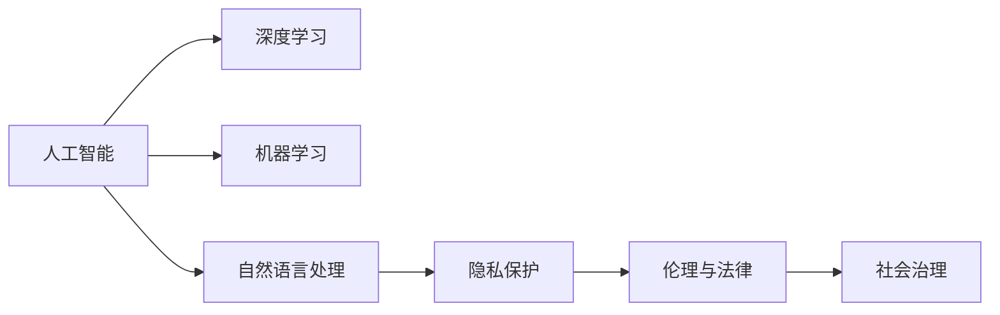

                 

# 人工智能：社会影响与思考

## 1. 背景介绍

### 1.1 问题由来

人工智能（AI）技术在近年来取得了突破性进展，特别是深度学习和机器学习的发展，使得AI技术能够处理越来越复杂的任务，从图像识别到自然语言处理，再到决策支持系统，AI的应用领域日益广泛。然而，随着AI技术的快速发展，其对社会的影响也逐渐显现，引发了诸多讨论和思考。本文旨在深入探讨AI技术对社会的正面和负面影响，并提出相应的应对策略，以期在推动技术进步的同时，保障社会的和谐发展。

### 1.2 问题核心关键点

AI技术对社会的影响是多方面的，既包括经济、医疗、教育等各个领域，也包括伦理、法律、隐私保护等社会治理层面。本文将从以下几个方面对AI的社会影响进行深入分析：

- 经济影响：AI如何改变就业结构、产业分布、企业运营模式。
- 社会影响：AI对教育、医疗、文化娱乐等领域的影响。
- 伦理与法律：AI技术带来的隐私、安全、公平等问题。
- 政策与治理：政府如何制定AI政策，规范AI技术发展。

## 2. 核心概念与联系

### 2.1 核心概念概述

在深入探讨AI的社会影响之前，我们需要对几个核心概念进行梳理：

- **人工智能（Artificial Intelligence, AI）**：指由计算机系统执行的智能行为，包括机器学习、自然语言处理、计算机视觉等多个子领域。
- **深度学习（Deep Learning）**：基于神经网络模型的机器学习方法，能够在图像、语音、文本等复杂数据上取得优异效果。
- **机器学习（Machine Learning）**：指让计算机通过数据学习规律并做出预测或决策的技术。
- **自然语言处理（Natural Language Processing, NLP）**：研究如何让计算机理解、生成和处理自然语言的技术。
- **隐私保护（Privacy Protection）**：指在AI应用中保护个人数据不被滥用的措施。
- **伦理与法律（Ethics & Law）**：指导AI技术应用的道德规范和法律法规，确保技术应用的合法性和合理性。
- **社会治理（Social Governance）**：指政府和社会各界如何共同管理和规范AI技术的发展，确保其在社会中的应用符合公众利益。

这些概念之间存在密切的联系，共同构成了AI技术对社会影响的全貌。

### 2.2 核心概念原理和架构的 Mermaid 流程图



这个流程图展示了AI技术的主要组成部分及其与隐私保护、伦理法律、社会治理等社会层面的联系。

## 3. 核心算法原理 & 具体操作步骤

### 3.1 算法原理概述

AI技术对社会的影响主要通过以下几个方面体现：

- **经济结构变革**：AI技术改变了劳动力的需求结构，导致部分低技能工作岗位的消失，同时催生了新的高技能岗位。
- **医疗健康改善**：AI在医学影像分析、疾病预测、个性化治疗等方面展现出了巨大的潜力，能够显著提升医疗服务的质量和效率。
- **教育模式创新**：AI辅助教学、个性化推荐、智能评估等技术，改变了传统教育模式，提高了教育资源的分配效率。
- **隐私与安全风险**：AI处理大量个人数据时，如果数据管理不当，可能引发隐私泄露、身份盗用等问题。
- **公平与伦理挑战**：AI决策的透明性和公正性问题，以及算法偏见问题，需要得到重视和解决。

### 3.2 算法步骤详解

AI技术的社会影响评估一般包括以下几个步骤：

1. **数据收集与分析**：收集不同领域、不同规模的数据，包括经济、医疗、教育等领域的数据，分析AI技术在这些领域的应用情况。
2. **模型构建与测试**：构建AI模型，通过实验测试其在特定场景下的表现，评估其对社会的正面和负面影响。
3. **伦理与法律审查**：对AI模型进行伦理和法律审查，确保其应用符合公众利益和法律法规。
4. **政策制定与执行**：根据AI技术对社会的实际影响，制定相应的政策，规范AI技术的应用，确保其健康发展。

### 3.3 算法优缺点

AI技术对社会的正面影响主要体现在以下几个方面：

- **提升生产力**：通过自动化和优化，AI技术能够显著提高生产效率，降低成本。
- **改善生活质量**：AI在医疗、教育、交通等领域的应用，能够提升人们的生活质量。
- **推动创新**：AI技术为各行业带来了新的发展机遇，促进了技术创新。

然而，AI技术也存在一些负面影响：

- **就业结构变化**：AI技术的普及可能导致部分低技能岗位的消失，对劳动力的需求结构产生影响。
- **数据隐私问题**：AI处理大量个人数据时，如果管理不当，可能导致隐私泄露、身份盗用等问题。
- **算法偏见**：AI模型可能存在算法偏见，导致不公平的决策结果。

### 3.4 算法应用领域

AI技术已经在经济、医疗、教育、交通等多个领域得到了广泛应用，取得了显著的成效。以下是一些典型的应用场景：

- **经济领域**：AI在金融风控、供应链管理、市场分析等方面的应用，能够显著提高企业的运营效率。
- **医疗领域**：AI在医学影像诊断、疾病预测、个性化治疗等方面的应用，能够显著提升医疗服务的质量和效率。
- **教育领域**：AI在智能评估、个性化推荐、辅助教学等方面的应用，能够提高教育资源的分配效率，提升教学质量。
- **交通领域**：AI在智能交通管理、自动驾驶等方面的应用，能够提升交通系统的安全性和效率。

## 4. 数学模型和公式 & 详细讲解

### 4.1 数学模型构建

在评估AI技术对社会的正面和负面影响时，我们通常会构建以下几个数学模型：

- **经济模型**：评估AI技术对就业、产业分布、企业运营模式的影响。
- **医疗模型**：评估AI技术在医学影像分析、疾病预测、个性化治疗等方面的效果。
- **教育模型**：评估AI技术在智能评估、个性化推荐、辅助教学等方面的效果。
- **隐私模型**：评估AI技术对个人数据的处理和隐私保护的效果。
- **伦理与法律模型**：评估AI技术应用的伦理和法律风险。

### 4.2 公式推导过程

以下是几个典型公式的推导过程：

1. **就业变化模型**：
   $$
   \Delta E = f(AI, L)
   $$
   其中，$\Delta E$ 表示就业变化量，$AI$ 表示AI技术的应用情况，$L$ 表示劳动力需求结构。公式表示AI技术的应用导致就业结构发生变化。

2. **医疗效果模型**：
   $$
   E = h(AI, D)
   $$
   其中，$E$ 表示医疗效果，$AI$ 表示AI技术的应用情况，$D$ 表示患者数据。公式表示AI技术在医疗中的应用提升了医疗效果。

3. **隐私保护模型**：
   $$
   P = g(AI, S)
   $$
   其中，$P$ 表示隐私泄露概率，$AI$ 表示AI技术的应用情况，$S$ 表示数据安全措施。公式表示AI技术的应用增加了隐私泄露的风险。

4. **伦理与法律风险模型**：
   $$
   R = w(AI, L)
   $$
   其中，$R$ 表示伦理与法律风险，$AI$ 表示AI技术的应用情况，$L$ 表示法律法规。公式表示AI技术的应用可能引发伦理和法律风险。

### 4.3 案例分析与讲解

以AI在医疗领域的应用为例，以下是对相关案例的分析：

**案例一**：AI在医学影像分析中的应用

AI技术能够对医学影像进行自动分析和诊断，提升诊断的准确性和效率。例如，Google的DeepMind开发的AlphaGo模型在皮肤癌诊断中的应用，通过分析皮肤影像，能够显著提高诊断的准确率。

**案例二**：AI在个性化治疗中的应用

AI技术能够根据患者的历史数据和基因信息，提供个性化的治疗方案。例如，IBM的Watson for Oncology系统，能够根据患者的基因信息和病史，提供最优化的治疗方案，显著提高了治疗效果。

**案例三**：AI在医疗资源分配中的应用

AI技术能够优化医疗资源的分配，提高医疗服务的效率。例如，IBM的Watson Health应用，通过分析医疗数据，能够预测疾病流行趋势，优化医院的资源分配。

## 5. 项目实践：代码实例和详细解释说明

### 5.1 开发环境搭建

在进行AI项目开发前，我们需要准备好开发环境。以下是使用Python进行PyTorch开发的环境配置流程：

1. 安装Anaconda：从官网下载并安装Anaconda，用于创建独立的Python环境。
2. 创建并激活虚拟环境：
```bash
conda create -n pytorch-env python=3.8 
conda activate pytorch-env
```
3. 安装PyTorch：根据CUDA版本，从官网获取对应的安装命令。例如：
```bash
conda install pytorch torchvision torchaudio cudatoolkit=11.1 -c pytorch -c conda-forge
```
4. 安装各类工具包：
```bash
pip install numpy pandas scikit-learn matplotlib tqdm jupyter notebook ipython
```

完成上述步骤后，即可在`pytorch-env`环境中开始AI项目开发。

### 5.2 源代码详细实现

以下是一个简单的医疗影像分类项目的代码实现：

```python
import torch
import torch.nn as nn
import torch.optim as optim
from torchvision import datasets, transforms

# 定义模型
class MedicalImageClassifier(nn.Module):
    def __init__(self):
        super(MedicalImageClassifier, self).__init__()
        self.conv1 = nn.Conv2d(3, 16, kernel_size=3, stride=1, padding=1)
        self.conv2 = nn.Conv2d(16, 32, kernel_size=3, stride=1, padding=1)
        self.fc1 = nn.Linear(32 * 64 * 64, 64)
        self.fc2 = nn.Linear(64, 2)

    def forward(self, x):
        x = torch.relu(self.conv1(x))
        x = torch.max_pool2d(x, 2)
        x = torch.relu(self.conv2(x))
        x = torch.max_pool2d(x, 2)
        x = x.view(-1, 32 * 64 * 64)
        x = torch.relu(self.fc1(x))
        x = self.fc2(x)
        return x

# 加载数据集
train_dataset = datasets.MNIST(root='./data', train=True, download=True, transform=transforms.ToTensor())
test_dataset = datasets.MNIST(root='./data', train=False, download=True, transform=transforms.ToTensor())

# 构建数据加载器
train_loader = torch.utils.data.DataLoader(train_dataset, batch_size=64, shuffle=True)
test_loader = torch.utils.data.DataLoader(test_dataset, batch_size=64, shuffle=False)

# 定义模型、损失函数和优化器
model = MedicalImageClassifier()
criterion = nn.CrossEntropyLoss()
optimizer = optim.Adam(model.parameters(), lr=0.001)

# 训练模型
for epoch in range(10):
    running_loss = 0.0
    for i, data in enumerate(train_loader, 0):
        inputs, labels = data
        optimizer.zero_grad()
        outputs = model(inputs)
        loss = criterion(outputs, labels)
        loss.backward()
        optimizer.step()

        running_loss += loss.item()
        if i % 100 == 99:
            print('[%d, %5d] loss: %.3f' %
                  (epoch + 1, i + 1, running_loss / 100))
            running_loss = 0.0

# 测试模型
correct = 0
total = 0
with torch.no_grad():
    for data in test_loader:
        images, labels = data
        outputs = model(images)
        _, predicted = torch.max(outputs.data, 1)
        total += labels.size(0)
        correct += (predicted == labels).sum().item()

print('Accuracy of the network on the 10000 test images: %d %%' % (
    100 * correct / total))
```

### 5.3 代码解读与分析

让我们再详细解读一下关键代码的实现细节：

**MedicalImageClassifier类**：
- `__init__方法`：初始化卷积层和全连接层，定义模型的结构。
- `forward方法`：定义模型的前向传播过程，通过卷积和全连接层处理输入数据，并输出预测结果。

**数据加载器**：
- 使用`torch.utils.data.DataLoader`创建训练和测试数据加载器，批量加载数据。

**模型训练**：
- 在每个epoch中，对训练数据进行前向传播、损失计算、反向传播和参数更新。
- 通过打印loss来监控训练进度。

**模型测试**：
- 对测试数据进行前向传播，计算预测准确率。
- 打印模型的测试准确率。

## 6. 实际应用场景

### 6.1 经济领域

AI技术在经济领域的应用已经广泛应用于金融、供应链、市场分析等多个方面。以下是一些典型应用：

- **金融风控**：AI技术能够通过分析历史数据，预测金融市场的风险，提高金融决策的准确性。
- **供应链管理**：AI技术能够优化供应链管理，降低成本，提高效率。
- **市场分析**：AI技术能够分析市场数据，预测市场趋势，指导企业决策。

### 6.2 医疗领域

AI技术在医疗领域的应用已经取得了显著的成效，以下是一些典型应用：

- **医学影像分析**：AI技术能够自动分析医学影像，辅助医生诊断。
- **疾病预测**：AI技术能够分析患者的基因信息和病史，预测疾病风险。
- **个性化治疗**：AI技术能够提供个性化的治疗方案，提高治疗效果。

### 6.3 教育领域

AI技术在教育领域的应用能够提升教育资源的分配效率，提高教学质量。以下是一些典型应用：

- **智能评估**：AI技术能够自动评估学生的作业和考试，提高评估效率。
- **个性化推荐**：AI技术能够根据学生的兴趣和学习行为，推荐个性化的学习资源。
- **辅助教学**：AI技术能够提供个性化的教学建议，提高教学效果。

### 6.4 交通领域

AI技术在交通领域的应用能够提升交通系统的安全性和效率。以下是一些典型应用：

- **智能交通管理**：AI技术能够优化交通信号控制，减少交通拥堵。
- **自动驾驶**：AI技术能够实现自动驾驶，提高交通安全。

## 7. 工具和资源推荐

### 7.1 学习资源推荐

为了帮助开发者系统掌握AI技术的应用，这里推荐一些优质的学习资源：

1. **《深度学习》课程**：由吴恩达教授开设，系统介绍了深度学习的基本概念和应用。
2. **《机器学习实战》书籍**：介绍机器学习算法和实际应用案例。
3. **Kaggle平台**：提供大量数据集和竞赛，让开发者练习AI算法。
4. **TensorFlow官方文档**：提供详细的API和代码示例。

通过对这些资源的学习实践，相信你一定能够快速掌握AI技术的应用，并将其应用于实际问题解决。

### 7.2 开发工具推荐

高效的开发离不开优秀的工具支持。以下是几款用于AI项目开发的常用工具：

1. **PyTorch**：基于Python的开源深度学习框架，灵活动态的计算图，适合快速迭代研究。
2. **TensorFlow**：由Google主导开发的开源深度学习框架，生产部署方便，适合大规模工程应用。
3. **Jupyter Notebook**：交互式的代码编辑器，方便快速迭代和分享代码。
4. **GitHub**：版本控制和协作开发平台，方便团队协作和代码管理。
5. **AWS SageMaker**：AWS提供的AI服务平台，提供云端机器学习服务和资源。

合理利用这些工具，可以显著提升AI项目开发的效率，加快创新迭代的步伐。

### 7.3 相关论文推荐

AI技术的发展得益于学界的持续研究。以下是几篇奠基性的相关论文，推荐阅读：

1. **《深度学习》书籍**：Ian Goodfellow、Yoshua Bengio、Aaron Courville合著，全面介绍了深度学习的基本原理和应用。
2. **《机器学习实战》书籍**：Peter Harrington著，介绍机器学习算法和实际应用案例。
3. **《自然语言处理综论》书籍**：Daniel Jurafsky、James H. Martin合著，全面介绍自然语言处理的基本概念和应用。
4. **《人工智能：一种现代方法》书籍**：Stuart Russell、Peter Norvig合著，全面介绍人工智能的基本概念和应用。

这些论文代表了大数据和AI技术的发展脉络。通过学习这些前沿成果，可以帮助研究者把握学科前进方向，激发更多的创新灵感。

## 8. 总结：未来发展趋势与挑战

### 8.1 总结

本文对AI技术对社会的正面和负面影响进行了全面系统的探讨。通过分析AI技术在经济、医疗、教育等领域的实际应用，以及其对就业结构、隐私保护、算法偏见等方面的影响，揭示了AI技术在推动社会进步的同时，也带来了诸多挑战。文章还提出了相应的应对策略，包括政策制定、技术改进、伦理审查等，以期在推动AI技术发展的同时，保障社会的和谐稳定。

通过本文的系统梳理，可以看到，AI技术在提升生产力、改善生活质量、推动创新等方面具有巨大的潜力，但其应用也需注意伦理、法律、隐私保护等方面的挑战。未来，伴随AI技术的进一步发展，如何在推动技术进步的同时，保障社会的和谐发展，将是全社会共同面临的重要课题。

### 8.2 未来发展趋势

展望未来，AI技术的发展将呈现以下几个趋势：

1. **技术创新**：AI技术将不断进步，带来更多新的应用场景和解决方案。
2. **多领域融合**：AI技术将与其他技术如物联网、区块链、5G等融合，带来更广泛的应用。
3. **伦理与法律**：AI技术的伦理和法律问题将得到更多重视，相关规范和标准将逐步完善。
4. **国际合作**：AI技术的发展将依赖全球合作，国际间的交流与合作将更加紧密。
5. **社会治理**：政府和社会各界将共同管理和规范AI技术的应用，确保其健康发展。

### 8.3 面临的挑战

尽管AI技术的发展带来了诸多积极影响，但在迈向更加智能化、普适化应用的过程中，也面临着诸多挑战：

1. **就业结构变化**：AI技术的普及可能导致部分低技能岗位的消失，对劳动力的需求结构产生影响。
2. **数据隐私问题**：AI处理大量个人数据时，如果管理不当，可能导致隐私泄露、身份盗用等问题。
3. **算法偏见**：AI模型可能存在算法偏见，导致不公平的决策结果。
4. **伦理与法律风险**：AI技术的伦理和法律问题将得到更多重视，相关规范和标准将逐步完善。
5. **社会接受度**：AI技术在带来便利的同时，也可能引发公众的抵触情绪。

### 8.4 研究展望

未来的研究需要在以下几个方面寻求新的突破：

1. **技术创新**：开发更高效的算法和模型，提高AI技术的实际应用效果。
2. **伦理与法律**：建立和完善AI技术的伦理和法律规范，确保其健康发展。
3. **社会治理**：政府和社会各界将共同管理和规范AI技术的应用，确保其健康发展。
4. **国际合作**：促进国际间的合作，共享AI技术发展的成果。

这些研究方向的探索，将引领AI技术迈向更高的台阶，为构建安全、可靠、可解释、可控的智能系统铺平道路。面向未来，AI技术还需要与其他技术进行更深入的融合，如知识表示、因果推理、强化学习等，多路径协同发力，共同推动自然语言理解和智能交互系统的进步。只有勇于创新、敢于突破，才能不断拓展AI技术的边界，让智能技术更好地造福人类社会。

## 9. 附录：常见问题与解答

**Q1：AI技术是否会对就业产生影响？**

A: AI技术的发展可能导致部分低技能岗位的消失，但同时也催生了新的高技能岗位。未来，AI技术将与人类协作，提升工作效率，创造更多就业机会。

**Q2：AI技术如何保护个人隐私？**

A: AI技术在处理个人数据时，应采用严格的数据保护措施，如数据脱敏、加密等。同时，应建立完善的隐私保护法规，确保数据使用的合法性和合理性。

**Q3：AI技术是否会引发算法偏见？**

A: AI模型可能存在算法偏见，导致不公平的决策结果。应通过数据清洗、算法设计等手段，尽可能消除偏见，确保公平性。

**Q4：AI技术的发展如何得到公众的接受？**

A: AI技术的应用应透明、可解释，通过公众参与和科普教育，提升公众对AI技术的理解和信任。

**Q5：AI技术的应用如何得到政府的规范？**

A: 政府应制定相关政策，规范AI技术的应用，确保其健康发展。同时，应建立监督机制，防止滥用和滥用。

---

作者：禅与计算机程序设计艺术 / Zen and the Art of Computer Programming

