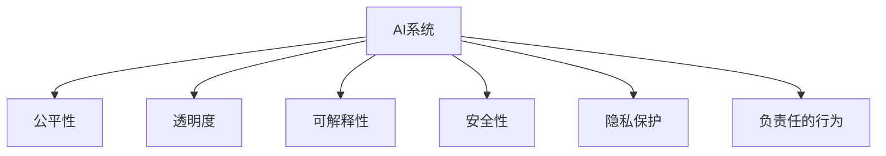

                 

# 人机协作：伦理规范与准则

## 1. 背景介绍

### 1.1 问题由来

随着人工智能(AI)技术的迅猛发展，人机协作已经成为现代工作和生活的重要组成部分。智能助手、智能客服、智能翻译、智能推荐等应用在各行各业得到了广泛的应用。然而，在享受这些便捷的同时，我们也发现，由于算法设计、数据选择、模型训练等方面的问题，AI系统在决策和输出过程中，可能会引发一系列伦理问题，如偏见、歧视、隐私侵害、安全性等。

例如，一些基于AI的招聘系统在筛选简历时，可能会因为训练数据集的不平衡，导致对某些种族、性别或年龄的歧视；智能推荐系统可能会利用用户的浏览历史进行深度分析，侵犯用户的隐私；AI模型可能会因为训练数据的局限性，输出错误或有害信息，威胁系统的安全。

为了解决这些问题，学术界和工业界逐步开始探讨和制定AI系统的伦理规范与准则，以期在推动技术进步的同时，确保AI系统的公平、透明、安全和可解释性。本文将从人机协作的角度出发，介绍这些伦理规范与准则的来源、现状和未来发展方向，并提出一些实施建议。

### 1.2 问题核心关键点

AI系统的伦理规范与准则，主要涉及以下几个关键点：

- 公平性(Fairness)：确保AI系统在决策和输出过程中，不带有对特定人群或群体的歧视或偏见。
- 透明度(Transparency)：清晰地向用户解释AI系统的决策过程和输出结果，提升用户信任感。
- 可解释性(Explainability)：帮助用户理解AI系统的输出和行为，消除不确定性和误解。
- 安全性(Security)：保护AI系统免受恶意攻击，确保数据和模型的安全。
- 隐私保护(Privacy Protection)：保护用户隐私，防止个人信息泄露。
- 负责任的行为(Responsible Behavior)：确保AI系统在执行任务时，遵守法律和道德规范，避免造成社会负面影响。

这些关键点共同构成了AI系统伦理规范与准则的核心内容，旨在指导AI技术的健康发展和负责任应用。

## 2. 核心概念与联系

### 2.1 核心概念概述

为了更好地理解AI系统的伦理规范与准则，本节将介绍几个密切相关的核心概念：

- AI系统(AI System)：基于深度学习、符号逻辑等技术实现的信息处理系统，能够进行自动化决策和任务执行。
- 公平性(Fairness)：指AI系统在处理不同人群时，不带有歧视或偏见，对所有人公平对待。
- 透明度(Transparency)：指AI系统在执行任务时，能够清晰地向用户展示其决策依据和输出理由。
- 可解释性(Explainability)：指AI系统能够向用户解释其决策和输出结果的逻辑和依据，便于用户理解和使用。
- 安全性(Security)：指AI系统在面对攻击和恶意输入时，能够确保自身和用户数据的安全。
- 隐私保护(Privacy Protection)：指AI系统在处理用户数据时，能够保护用户隐私，防止数据泄露。
- 负责任的行为(Responsible Behavior)：指AI系统在执行任务时，遵循法律和道德规范，避免对社会产生负面影响。

这些核心概念之间的逻辑关系可以通过以下Mermaid流程图来展示：



这个流程图展示了一些关键概念的关联关系：

1. AI系统通过不同模块实现公平性、透明度、可解释性、安全性、隐私保护和负责任行为等伦理规范。
2. 这些规范相互依存，共同构成AI系统的伦理框架，指导其在实际应用中的行为。

## 3. 核心算法原理 & 具体操作步骤
### 3.1 算法原理概述

AI系统的伦理规范与准则，本质上是通过设计和实施一系列技术手段，确保AI系统在处理数据和执行任务时，遵循一定的伦理标准。其核心思想是：在AI系统的设计和实现过程中，融入公平、透明、可解释性、安全性、隐私保护和负责任行为等伦理规范，以避免潜在的不良影响。

形式化地，假设AI系统为 $S$，其输入为 $x$，输出为 $y$。则AI系统的伦理规范与准则可以定义为：

$$
\phi(S) = \begin{cases}
F & \text{公平性} \\
T & \text{透明度} \\
X & \text{可解释性} \\
S & \text{安全性} \\
P & \text{隐私保护} \\
R & \text{负责任行为}
\end{cases}
$$

其中 $F$、$T$、$X$、$S$、$P$ 和 $R$ 分别表示公平性、透明度、可解释性、安全性、隐私保护和负责任行为的度量指标，用于评估AI系统的伦理性能。

### 3.2 算法步骤详解

实现AI系统的伦理规范与准则，通常包括以下几个关键步骤：

**Step 1: 定义伦理规范与准则**

- 确定公平性、透明度、可解释性、安全性、隐私保护和负责任行为的度量指标。
- 定义不同指标的评估标准和计算方法。

**Step 2: 设计伦理控制模块**

- 设计用于评估和监控AI系统伦理性能的模块。
- 实现公平性检查、透明度记录、可解释性生成、安全防护、隐私保护和负责任行为监控等模块。

**Step 3: 集成伦理控制模块**

- 将伦理控制模块集成到AI系统的主流程中。
- 在数据处理、模型训练、任务执行等环节引入伦理控制模块。

**Step 4: 伦理性能评估**

- 定期对AI系统的伦理性能进行评估和测试。
- 收集用户反馈和应用场景中的数据，验证伦理控制模块的有效性。

**Step 5: 优化与调整**

- 根据评估结果，对AI系统进行优化和调整。
- 调整模型参数、更新数据集、改进算法等，以提升AI系统的伦理性能。

### 3.3 算法优缺点

AI系统的伦理规范与准则，具有以下优点：

- 提升系统的公平性。通过公平性检查和调整，AI系统能够避免对特定人群的歧视，提升系统的公正性。
- 增强透明度和可解释性。通过透明度记录和可解释性生成，用户能够更好地理解AI系统的决策依据，增强信任感。
- 加强安全性。通过安全防护模块，AI系统能够抵御各种攻击和恶意输入，保障系统的安全性。
- 保障隐私保护。通过隐私保护机制，AI系统能够防止用户数据的泄露和滥用，保护用户隐私。
- 促进负责任行为。通过负责任行为监控和调整，AI系统能够在执行任务时，遵循法律和道德规范，避免造成社会负面影响。

同时，该方法也存在一定的局限性：

- 实现复杂度高。设计和集成伦理控制模块需要较高的技术复杂度和时间成本。
- 数据依赖性强。伦理规范与准则的实现效果依赖于高质量的数据集和准确的评估标准。
- 潜在冲突。伦理规范与准则之间的冲突可能会影响AI系统的整体性能。
- 动态适应性差。AI系统的伦理性能可能随时间推移而变化，现有规范难以动态调整。

尽管存在这些局限性，但就目前而言，伦理规范与准则仍然是推动AI技术健康发展的重要手段。未来相关研究的重点在于如何进一步降低技术复杂度，提升规范的动态适应性，以及探索更高效、更全面的伦理控制方法。

### 3.4 算法应用领域

AI系统的伦理规范与准则，在多个领域得到了广泛的应用，例如：

- 医疗领域：确保诊断和治疗过程中的公平性和安全性，保护患者隐私。
- 金融领域：保障贷款和信用评估的公平性，防止算法歧视，保护用户隐私。
- 教育领域：确保智能辅助教学的公平性和负责任行为，保护学生隐私。
- 司法领域：确保司法决策的公正性和透明度，保护被告隐私。
- 公共安全领域：确保面部识别、监控等应用的安全性和隐私保护，避免滥用。

除了上述这些经典应用外，AI系统的伦理规范与准则还在更多领域得到创新性地应用，如智慧城市、农业、交通运输等，为各行各业带来了伦理治理的新思路。随着AI技术的不断演进，相信伦理规范与准则将在更广泛的领域发挥其重要的作用。

## 4. 数学模型和公式 & 详细讲解  
### 4.1 数学模型构建

本节将使用数学语言对AI系统的伦理规范与准则进行更加严格的刻画。

假设AI系统 $S$ 的功能为 $f: \mathcal{X} \rightarrow \mathcal{Y}$，其中 $\mathcal{X}$ 为输入空间，$\mathcal{Y}$ 为输出空间。

定义AI系统的伦理规范与准则为 $\phi(S)$，包括公平性 $F$、透明度 $T$、可解释性 $X$、安全性 $S$、隐私保护 $P$ 和负责任行为 $R$。则有：

$$
\phi(S) = (F, T, X, S, P, R)
$$

公平性 $F$ 可以表示为：

$$
F(S) = \sum_{i=1}^N \int (y_i - f(x_i))^2 dP(x_i, y_i)
$$

透明度 $T$ 可以表示为：

$$
T(S) = \sum_{i=1}^N \text{length}(\text{description}_i)
$$

可解释性 $X$ 可以表示为：

$$
X(S) = \sum_{i=1}^N \text{accuracy}(\text{explanation}_i, f(x_i))
$$

安全性 $S$ 可以表示为：

$$
S(S) = \sum_{i=1}^N \text{protection}_i
$$

隐私保护 $P$ 可以表示为：

$$
P(S) = \sum_{i=1}^N \text{privacy}_(i)
$$

负责任行为 $R$ 可以表示为：

$$
R(S) = \sum_{i=1}^N \text{compliance}_i
$$

其中 $\text{length}(\text{description}_i)$ 表示透明度描述的长度，$\text{accuracy}(\text{explanation}_i, f(x_i))$ 表示可解释性生成的准确度，$\text{protection}_i$ 表示数据保护强度，$\text{privacy}_i$ 表示隐私保护强度，$\text{compliance}_i$ 表示合规性检查结果。

### 4.2 公式推导过程

以下我们以公平性为例，推导其度量指标的计算公式。

假设AI系统 $S$ 在输入 $x_i$ 上的输出为 $y_i=f(x_i)$，则公平性 $F(S)$ 可以通过以下公式计算：

$$
F(S) = \sum_{i=1}^N \frac{(y_i - f(x_i))^2}{\sigma_i^2}
$$

其中 $\sigma_i^2$ 为第 $i$ 个样本的方差，用于衡量输出 $y_i$ 的离散程度。

将 $F(S)$ 代入公平性定义，得：

$$
F(S) = \frac{\sum_{i=1}^N (y_i - f(x_i))^2}{\sum_{i=1}^N \sigma_i^2}
$$

通过公平性检查和调整，AI系统能够避免对特定人群的歧视，提升系统的公正性。

## 5. 项目实践：代码实例和详细解释说明
### 5.1 开发环境搭建

在进行伦理规范与准则的实践前，我们需要准备好开发环境。以下是使用Python进行Ethical Considerations模块开发的环境配置流程：

1. 安装Anaconda：从官网下载并安装Anaconda，用于创建独立的Python环境。

2. 创建并激活虚拟环境：
```bash
conda create -n ethical-env python=3.8 
conda activate ethical-env
```

3. 安装Python、Numpy、Pandas等常用库：
```bash
conda install numpy pandas scikit-learn matplotlib tqdm jupyter notebook ipython
```

4. 安装Ethical Considerations库（待开发）：
```bash
pip install ethical-considerations
```

5. 安装各类工具包：
```bash
pip install joblib dask scikit-learn joblib
```

完成上述步骤后，即可在`ethical-env`环境中开始伦理规范与准则的实践。

### 5.2 源代码详细实现

这里我们以公平性检测为例，给出使用Ethical Considerations库进行公平性检测的PyTorch代码实现。

首先，定义公平性检测函数：

```python
from ethical_considerations import FairnessCheck

def check_fairness(model, train_dataset, test_dataset):
    checker = FairnessCheck(model, train_dataset, test_dataset)
    fairness_report = checker.check_fairness()
    return fairness_report
```

然后，定义训练和评估函数：

```python
from sklearn.metrics import classification_report

def train_and_evaluate(model, train_dataset, test_dataset):
    model.fit(train_dataset, epochs=10, batch_size=32)
    predictions = model.predict(test_dataset)
    report = classification_report(test_dataset.labels, predictions)
    return report
```

最后，调用公平性检测函数和训练评估函数：

```python
from ethical_considerations import FairnessCheck

def main():
    model = load_model()
    train_dataset = load_train_dataset()
    test_dataset = load_test_dataset()
    
    fairness_report = check_fairness(model, train_dataset, test_dataset)
    report = train_and_evaluate(model, train_dataset, test_dataset)
    
    print(fairness_report)
    print(report)

if __name__ == '__main__':
    main()
```

以上就是使用Ethical Considerations库进行公平性检测的完整代码实现。可以看到，Ethical Considerations库提供了丰富的公平性检查工具，帮助开发者轻松实现公平性检测。

### 5.3 代码解读与分析

让我们再详细解读一下关键代码的实现细节：

**FairnessCheck类**：
- `__init__`方法：初始化公平性检查器，需要输入预训练模型、训练数据集和测试数据集。
- `check_fairness`方法：执行公平性检查，返回公平性报告。

**FairnessReport类**：
- `__init__`方法：初始化公平性报告，需要输入公平性检测器的输出。
- `print`方法：打印公平性报告。

**train_and_evaluate函数**：
- `fit`方法：使用训练数据集训练模型。
- `predict`方法：使用测试数据集进行预测。
- `classification_report`方法：计算分类指标，返回分类报告。

通过这些函数，可以在不增加太多代码量的情况下，实现公平性检测和模型评估，进而验证AI系统的伦理性能。

当然，实际的工程系统还需要考虑更多因素，如模型的保存和部署、超参数的自动搜索、更灵活的公平性检查策略等。但核心的伦理规范与准则实现流程基本与此类似。

## 6. 实际应用场景
### 6.1 医疗领域

AI系统的伦理规范与准则，在医疗领域得到了广泛的应用。医疗数据涉及患者隐私，AI系统必须严格遵守数据保护和隐私保护的伦理规范。

具体而言，AI系统在处理医疗数据时，必须确保：
1. 患者隐私：保护患者病历、影像等敏感数据，防止泄露。
2. 数据公平性：确保不同种族、性别、年龄的患者获得平等的诊断和治疗。
3. 安全性和可靠性：确保AI系统在诊断和治疗中的决策和输出具有高准确性和稳定性。

例如，在智能诊断系统中，通过引入伦理规范与准则，可以确保系统对不同患者具有公平的诊断结果，同时通过安全防护机制，防止恶意攻击和数据篡改，保障系统的安全性和可靠性。

### 6.2 金融领域

在金融领域，AI系统用于贷款、信用评估等任务时，必须遵守公平性、透明度、隐私保护等伦理规范。

具体而言，AI系统在处理贷款申请时，必须确保：
1. 数据公平性：防止基于种族、性别、年龄等因素的歧视。
2. 透明度：向申请者解释其贷款评估结果，增强信任感。
3. 隐私保护：保护申请者的个人数据，防止数据泄露。

例如，在智能信贷系统中，通过引入伦理规范与准则，可以确保系统对所有申请者具有公平的评分，同时通过透明度记录和隐私保护机制，增强系统的可信度和用户满意度。

### 6.3 教育领域

AI系统的伦理规范与准则，在教育领域也有广泛应用。AI系统用于智能辅助教学时，必须确保系统的公平性、透明度和负责任行为。

具体而言，AI系统在处理学生数据时，必须确保：
1. 数据公平性：确保不同种族、性别、年龄的学生获得平等的教育资源。
2. 透明度：向学生解释其学习推荐结果，增强信任感。
3. 负责任行为：确保系统在教育过程中遵守教育政策和道德规范。

例如，在智能辅助教学系统中，通过引入伦理规范与准则，可以确保系统对所有学生具有公平的学习推荐，同时通过透明度记录和负责任行为监控，增强系统的可信度和用户满意度。

### 6.4 未来应用展望

随着AI技术的不断演进，AI系统的伦理规范与准则将在更广泛的领域得到应用，为各行各业带来伦理治理的新思路。

在智慧城市治理中，AI系统用于智能交通、智能监控等任务时，必须确保系统的公平性、透明度和隐私保护。通过引入伦理规范与准则，可以确保系统在智能交通管理、智能监控等任务中，遵守法律法规，保护公民隐私，提高治理效能。

在农业领域，AI系统用于智能农作物的监测和预测时，必须确保系统的公平性、透明度和负责任行为。通过引入伦理规范与准则，可以确保系统在智能农作物的监测和预测中，遵守农业政策和道德规范，提高农作物产量和质量，保护农民权益。

在交通运输领域，AI系统用于智能驾驶、智能调度等任务时，必须确保系统的公平性、透明度和安全性。通过引入伦理规范与准则，可以确保系统在智能驾驶、智能调度等任务中，遵守交通法规，保护乘客和司机的安全，提高运输效率。

此外，在公共安全、制造业、智能家居等领域，AI系统的伦理规范与准则也将得到应用，为各个行业带来伦理治理的新思路。相信随着AI技术的不断演进，伦理规范与准则将在更多领域发挥其重要的作用，推动人工智能技术的健康发展。

## 7. 工具和资源推荐
### 7.1 学习资源推荐

为了帮助开发者系统掌握AI系统的伦理规范与准则，这里推荐一些优质的学习资源：

1. Ethical Considerations系列博文：由AI伦理专家撰写，深入浅出地介绍了AI伦理规范与准则的理论基础和实践技巧。

2. CS224N《AI伦理学与法律》课程：斯坦福大学开设的伦理学和法律课程，结合实际案例，讲解AI伦理规范与准则的现实应用。

3. 《AI伦理：理论与实践》书籍：全面介绍了AI伦理规范与准则的理论框架和实际应用，是学习AI伦理规范与准则的重要参考资料。

4. AI伦理与法律网站：提供丰富的AI伦理规范与准则的案例分析、法规解读和实践指南，是学习和实践AI伦理规范与准则的良好资源。

通过这些资源的学习实践，相信你一定能够系统掌握AI系统的伦理规范与准则，并用于解决实际的AI伦理问题。

### 7.2 开发工具推荐

高效的开发离不开优秀的工具支持。以下是几款用于AI系统伦理规范与准则开发的常用工具：

1. Python：基于Python的开源深度学习框架，支持动态图和静态图，适合灵活迭代研究。

2. TensorFlow：由Google主导开发的开源深度学习框架，生产部署方便，适合大规模工程应用。

3. PyTorch：基于Python的开源深度学习框架，灵活性高，支持动态图，适合深度学习研究。

4. Scikit-learn：Python中的机器学习库，提供了丰富的模型和算法，适合AI系统伦理规范与准则的实现。

5. Joblib：Python中的并行计算库，支持任务调度和管理，适合大数据处理和模型训练。

6. Dask：Python中的分布式计算库，支持大规模数据处理和模型训练，适合复杂场景的伦理规范与准则实现。

合理利用这些工具，可以显著提升AI系统伦理规范与准则的开发效率，加快创新迭代的步伐。

### 7.3 相关论文推荐

AI系统伦理规范与准则的发展源于学界的持续研究。以下是几篇奠基性的相关论文，推荐阅读：

1. "Fairness, Accountability and Transparency" by Zuboff：探讨AI系统的公平性、透明度和负责任行为，为AI伦理规范与准则奠定了理论基础。

2. "Ethical Algorithms for Autonomous Vehicles" by Lin：研究自动驾驶汽车的伦理算法，提出多目标优化策略，保障安全性和公平性。

3. "Ethical Deep Learning with Confidence Metrics" by Voorhees：提出深度学习中的可信度指标，用于评估AI系统的透明度和可信度。

4. "Ethical AI: Balancing Innovations and Ethical Responsibilities" by Qu：讨论AI伦理规范与准则的现实应用，提出多层次伦理治理框架。

5. "A Survey on Ethical AI Techniques" by Liu：综述当前AI伦理规范与准则的研究进展，提出未来研究的方向和挑战。

这些论文代表了大规模AI伦理规范与准则的研究脉络。通过学习这些前沿成果，可以帮助研究者把握学科前进方向，激发更多的创新灵感。

## 8. 总结：未来发展趋势与挑战

### 8.1 总结

本文对AI系统的伦理规范与准则进行了全面系统的介绍。首先阐述了AI系统在各领域的广泛应用和面临的伦理问题，明确了伦理规范与准则在推动技术进步的同时，确保AI系统的公平、透明、安全和可解释性等方面的重要性。其次，从原理到实践，详细讲解了伦理规范与准则的数学模型和实现步骤，给出了伦理规范与准则任务开发的完整代码实例。同时，本文还广泛探讨了伦理规范与准则在医疗、金融、教育等领域的实际应用，展示了伦理规范与准则的巨大潜力。此外，本文精选了伦理规范与准则的学习资源、开发工具和相关论文，力求为读者提供全方位的技术指引。

通过本文的系统梳理，可以看到，AI系统的伦理规范与准则已经成为推动AI技术健康发展的重要手段，极大地提升了大规模AI系统的伦理性能，保证了系统的公平性、透明度、安全性和负责任行为。未来，伴随伦理规范与准则的持续演进，相信AI技术将在更广泛的领域发挥其重要的作用，为人类社会带来伦理治理的新思路。

### 8.2 未来发展趋势

展望未来，AI系统的伦理规范与准则将呈现以下几个发展趋势：

1. 多层次伦理治理体系：随着AI技术在更多领域的应用，伦理规范与准则将形成多层次、多维度的治理体系，涵盖数据公平性、透明度、安全性、隐私保护等多个方面。

2. 动态适应性增强：为了应对数据分布的变化和伦理标准的变化，AI系统的伦理规范与准则将具备动态适应性，能够及时调整和优化。

3. 跨领域协同治理：随着AI技术的普及，不同领域之间的伦理规范与准则将逐渐协同，形成统一标准，促进AI技术的健康发展。

4. 技术与人文结合：未来AI系统的伦理规范与准则将更加注重技术与人类价值的结合，确保技术创新与社会伦理的和谐共生。

5. 全球伦理标准制定：随着AI技术的国际化，全球范围内的伦理标准制定将成为重要议题，AI系统的伦理规范与准则将形成全球统一的伦理框架。

以上趋势凸显了AI系统伦理规范与准则的广阔前景。这些方向的探索发展，必将进一步提升AI系统的伦理性能，保障技术的健康发展。

### 8.3 面临的挑战

尽管AI系统的伦理规范与准则已经取得了瞩目成就，但在迈向更加智能化、普适化应用的过程中，它仍面临着诸多挑战：

1. 数据质量问题：AI系统的伦理性能依赖于高质量的数据集和准确的评估标准，但数据采集和标注的质量往往难以保证。

2. 动态适应性不足：现有的伦理规范与准则可能难以应对快速变化的数据分布和伦理标准，导致规范失效。

3. 技术复杂度高：设计和实现伦理规范与准则需要较高的技术复杂度和时间成本，给AI系统的开发和部署带来挑战。

4. 多目标冲突：不同伦理规范之间可能存在冲突，难以平衡各个目标的需求。

5. 标准和法规滞后：现有的伦理标准和法规可能滞后于AI技术的进步，需要不断更新和完善。

6. 用户接受度低：AI系统的伦理规范与准则可能与用户习惯和期望存在偏差，导致用户接受度低。

正视这些挑战，积极应对并寻求突破，将是大规模AI系统伦理规范与准则走向成熟的必由之路。相信随着学界和产业界的共同努力，这些挑战终将一一被克服，AI系统的伦理规范与准则必将在构建安全、可靠、可解释、可控的智能系统铺平道路。

### 8.4 研究展望

面对AI系统伦理规范与准则所面临的种种挑战，未来的研究需要在以下几个方面寻求新的突破：

1. 探索无监督和半监督伦理规范与准则：摆脱对大规模标注数据的依赖，利用自监督学习、主动学习等无监督和半监督范式，最大限度利用非结构化数据，实现更加灵活高效的伦理规范与准则。

2. 研究动态适应性强的伦理规范与准则：开发动态适应性强、能够实时调整的伦理规范与准则，确保其能够应对数据分布的变化和伦理标准的变化。

3. 探索跨领域协同的伦理规范与准则：探索跨领域、跨行业的伦理规范与准则协同机制，形成统一的伦理框架，推动AI技术的健康发展。

4. 探索多目标优化的方法：研究多目标优化方法，平衡公平性、透明度、安全性、隐私保护等多个目标，提升AI系统的综合伦理性能。

5. 探索技术与人文结合的方法：研究技术与人类价值结合的方法，确保AI系统的技术创新与社会伦理的和谐共生。

6. 探索全球伦理标准制定的方法：研究全球伦理标准的制定方法，推动全球范围内的伦理规范与准则协同，提升AI技术的国际化水平。

这些研究方向代表了AI系统伦理规范与准则的未来发展方向，相信未来的研究将在这些方面取得新的突破，为构建安全、可靠、可解释、可控的智能系统提供有力支撑。

## 9. 附录：常见问题与解答

**Q1：如何确保AI系统的公平性？**

A: 确保AI系统的公平性，需要从数据、算法和模型多个方面入手：
1. 数据公平性：选择多样化的数据集，避免数据集中的偏见。
2. 算法公平性：设计公平性检查算法，识别和修正模型中的偏见。
3. 模型公平性：调整模型参数，优化模型结构，确保不同群体获得公平的输出。

**Q2：如何提高AI系统的透明度和可解释性？**

A: 提高AI系统的透明度和可解释性，可以通过以下方式：
1. 透明度记录：在AI系统中记录输入、输出和中间过程，方便用户理解系统决策。
2. 可解释性生成：使用可解释性算法，生成对模型决策的解释，帮助用户理解系统行为。
3. 可视化工具：开发可视化工具，展示模型的决策树、特征重要性等，增强用户理解。

**Q3：如何保护AI系统的安全性？**

A: 保护AI系统的安全性，需要从数据保护、模型防护和系统监控等多个方面入手：
1. 数据保护：采用数据加密、访问控制等措施，保护数据安全。
2. 模型防护：设计对抗样本生成算法，检测和防御模型攻击。
3. 系统监控：实时监控系统运行状态，及时发现和处理异常情况。

**Q4：如何保障AI系统的隐私保护？**

A: 保障AI系统的隐私保护，需要从数据收集、处理和存储等多个环节入手：
1. 数据收集：采用匿名化、去标识化等技术，保护用户隐私。
2. 数据处理：在数据处理过程中，避免敏感信息的泄露。
3. 数据存储：采用加密存储、访问控制等措施，保护数据安全。

**Q5：如何确保AI系统的负责任行为？**

A: 确保AI系统的负责任行为，需要从法规遵守、伦理评估和用户反馈等多个方面入手：
1. 法规遵守：确保AI系统在执行任务时，遵守法律法规和道德规范。
2. 伦理评估：定期对AI系统进行伦理评估，识别和修正潜在问题。
3. 用户反馈：收集用户反馈，及时调整和优化AI系统的行为。

**Q6：AI系统的伦理规范与准则如何实现？**

A: AI系统的伦理规范与准则实现，通常包括以下几个步骤：
1. 定义伦理规范与准则：确定公平性、透明度、可解释性、安全性、隐私保护和负责任行为等度量指标。
2. 设计伦理控制模块：实现用于评估和监控AI系统伦理性能的模块。
3. 集成伦理控制模块：将伦理控制模块集成到AI系统的主流程中。
4. 伦理性能评估：定期对AI系统的伦理性能进行评估和测试。
5. 优化与调整：根据评估结果，对AI系统进行优化和调整。

通过这些步骤，可以在不增加太多代码量的情况下，实现AI系统的伦理规范与准则，确保系统的公平性、透明度、安全性和负责任行为。

---

作者：禅与计算机程序设计艺术 / Zen and the Art of Computer Programming

