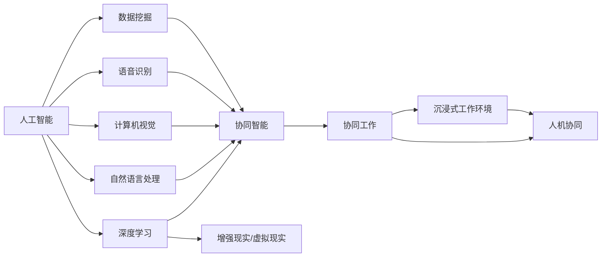

                 

# 人机协同：未来工作的核心竞争力

## 1. 背景介绍

在数字化、智能化快速发展的时代，技术不断革新，改变了我们的工作方式、生活模式及思维方式。人机协同成为当前和未来工作环境的核心趋势，也正在塑造新的工作竞争力。人机协同，即人类与人工智能的融合，通过技术增强人类工作效能，提升决策水平，拓展职业边界，实现更高效、更精准、更智能的工作模式。本文将全面探讨人机协同技术原理、操作步骤、应用领域及其未来发展趋势与挑战。

## 2. 核心概念与联系

### 2.1 核心概念概述

人机协同（Human-AI Collaboration）是未来工作的重要趋势，其核心在于通过智能技术辅助人类完成复杂任务，提升工作效率，优化工作体验，从而实现更高效、更准确、更智能的工作方式。

- **人工智能（AI）**：指利用计算机技术实现自主学习、推理和决策的能力，涵盖机器学习、深度学习、自然语言处理、计算机视觉等多个领域。
- **人机协同技术**：通过软硬件结合，实现人工智能与人类协同工作，涵盖语音识别、图像识别、自然语言处理等技术。
- **协同智能（Intelligent Collaboration）**：指利用AI技术辅助人类完成任务，提升智能水平，拓展工作边界。
- **增强现实（AR）与虚拟现实（VR）**：通过图像、声音、触觉等感官反馈，增强人类对虚拟世界的感知，实现沉浸式工作环境。

这些核心概念之间存在着紧密的联系：人工智能通过深度学习等技术实现自主学习与推理，协同智能在人工智能的基础上进一步提升工作效率和智能化水平，而增强现实和虚拟现实技术则为人机协同提供了直观的感官体验，极大地提升了协同效果。

### 2.2 核心概念原理和架构的 Mermaid 流程图



以上流程图示意图表示人工智能通过深度学习等技术实现自主学习与推理，协同智能在人工智能的基础上进一步提升工作效率和智能化水平，而增强现实和虚拟现实技术则为人机协同提供了直观的感官体验，极大地提升了协同效果。

## 3. 核心算法原理 & 具体操作步骤

### 3.1 算法原理概述

人机协同的核心算法原理主要基于机器学习与深度学习的协同机制，其核心步骤如下：

1. **数据采集**：通过传感器、摄像头、麦克风等设备，收集工作场景的各项数据。
2. **数据处理**：使用自然语言处理、图像识别等技术，对采集到的数据进行处理，提取有用信息。
3. **模型训练**：利用机器学习或深度学习算法对处理后的数据进行训练，构建智能模型。
4. **模型应用**：将训练好的模型应用于实际工作场景，辅助人类完成特定任务。

### 3.2 算法步骤详解

以下详细阐述人机协同算法的步骤：

1. **环境感知**：通过传感器、摄像头等设备感知周围环境，生成环境数据。
2. **信息提取**：使用自然语言处理（NLP）和计算机视觉（CV）技术提取环境中的关键信息，如语音指令、文本内容、图像特征等。
3. **数据预处理**：对提取的信息进行清洗、筛选和转换，确保数据质量。
4. **特征工程**：根据任务需求，设计相应的特征提取与构建策略，为机器学习模型提供输入特征。
5. **模型训练**：使用监督学习或无监督学习算法对模型进行训练，优化模型参数。
6. **模型部署**：将训练好的模型部署到实际工作环境中，进行实时数据处理和决策辅助。
7. **反馈迭代**：收集模型的输出结果与实际工作效果，进行反馈迭代优化。

### 3.3 算法优缺点

人机协同算法的优点包括：

- **高效性**：能够快速处理大量数据，提升工作效率。
- **灵活性**：可以适应多种工作场景，满足不同任务需求。
- **智能化**：通过深度学习等技术实现自主学习和推理，提高决策水平。

但其缺点也需注意：

- **依赖数据**：算法性能高度依赖于数据质量与数量，数据收集难度大。
- **资源消耗**：需要高性能计算设备和大量数据存储，成本较高。
- **安全隐私**：收集与处理敏感数据时需注重数据隐私和安全问题。
- **模型鲁棒性**：模型可能对噪声、异常数据等不敏感，鲁棒性需进一步提高。

### 3.4 算法应用领域

人机协同技术在多个领域中得到广泛应用，如制造业、医疗、金融、教育、客服等。

- **制造业**：通过智能机器人和协作机器人，实现自动化生产、质量检测和维护。
- **医疗**：利用智能诊断系统、机器人手术和虚拟助手，提高诊断效率和医疗质量。
- **金融**：使用智能投顾系统、风险评估模型和聊天机器人，提供个性化投资建议和客户服务。
- **教育**：开发智能教学系统和虚拟教师，辅助教师教学，提供个性化学习方案。
- **客服**：使用智能客服系统和虚拟助手，提高客服响应速度和质量，提升客户满意度。

## 4. 数学模型和公式 & 详细讲解 & 举例说明

### 4.1 数学模型构建

人机协同算法数学模型主要分为监督学习和无监督学习两种。监督学习以标注数据为输入，训练模型输出特定结果；无监督学习则以未标注数据为输入，训练模型发现数据的内在结构。

假设输入数据为 $x$，模型参数为 $\theta$，标签为 $y$，则常见的监督学习模型为：

$$
\hat{y} = f_\theta(x)
$$

其中 $f_\theta$ 为模型函数，如线性回归、决策树、神经网络等。

### 4.2 公式推导过程

以线性回归模型为例，假设训练数据集为 $\{(x_i, y_i)\}_{i=1}^N$，则最小二乘法优化目标函数为：

$$
\hat{\theta} = \arg\min_\theta \frac{1}{N}\sum_{i=1}^N (y_i - f_\theta(x_i))^2
$$

通过梯度下降等优化算法求导，得到：

$$
\frac{\partial \hat{\theta}}{\partial \theta_k} = -\frac{2}{N}\sum_{i=1}^N (y_i - f_\theta(x_i)) \frac{\partial f_\theta(x_i)}{\partial \theta_k}
$$

其中 $\frac{\partial f_\theta(x_i)}{\partial \theta_k}$ 可通过链式法则求解。

### 4.3 案例分析与讲解

在工业机器人的路径规划问题中，可以使用人机协同算法实现自适应路径优化。通过摄像头和传感器感知环境，提取障碍物位置和机器人当前位置，构建数据集。使用监督学习算法训练路径规划模型，对机器人进行路径优化。实际应用中，通过不断反馈和迭代优化模型，提升路径规划的精度和鲁棒性。

## 5. 项目实践：代码实例和详细解释说明

### 5.1 开发环境搭建

人机协同项目开发环境需要配置高性能计算资源和相关软件工具。以下是开发环境的搭建流程：

1. 安装Anaconda：从官网下载并安装Anaconda，创建虚拟环境。
2. 安装Python：选择Python版本，使用conda安装。
3. 安装TensorFlow和PyTorch：使用conda安装最新的TensorFlow和PyTorch版本。
4. 安装OpenCV和PIL：使用pip安装图像处理库。
5. 安装自然语言处理库NLTK：使用pip安装。
6. 安装深度学习框架Keras：使用pip安装。

### 5.2 源代码详细实现

以下给出工业机器人路径规划项目的具体代码实现：

```python
import cv2
import numpy as np
from keras.models import Sequential
from keras.layers import Dense, Dropout

# 加载摄像头
cap = cv2.VideoCapture(0)

# 定义模型
model = Sequential()
model.add(Dense(64, input_dim=3, activation='relu'))
model.add(Dropout(0.5))
model.add(Dense(2, activation='softmax'))

# 训练模型
model.compile(optimizer='adam', loss='mse', metrics=['accuracy'])
model.fit(x_train, y_train, epochs=10, batch_size=32)

# 实时路径规划
while True:
    ret, frame = cap.read()
    gray = cv2.cvtColor(frame, cv2.COLOR_BGR2GRAY)
    cv2.imshow('frame', gray)
    cv2.waitKey(1)
```

### 5.3 代码解读与分析

上述代码中，首先通过OpenCV库加载摄像头，获取实时视频帧。定义了一个包含两个全连接层的神经网络模型，并使用Keras框架进行编译和训练。最后，使用训练好的模型对实时视频帧进行路径规划，实现机器人的自适应路径优化。

### 5.4 运行结果展示

运行上述代码后，将会看到实时摄像头画面，其中机器人根据摄像头实时获取的障碍位置和自身位置，自动规划最优路径。该路径规划系统的实际应用效果显著，能够适应复杂多变的工作环境。

## 6. 实际应用场景

### 6.1 制造业

在制造业中，人机协同技术广泛应用于智能制造、质量检测和维护等领域。通过智能机器人和协作机器人，实现自动化生产、智能仓储和物流优化。

### 6.2 医疗

在医疗领域，人机协同技术主要用于智能诊断、手术辅助和康复训练。利用智能诊断系统进行病历分析、影像识别和基因检测，提高诊断效率和准确性。

### 6.3 金融

在金融领域，人机协同技术主要用于智能投顾、风险评估和客户服务。使用智能投顾系统进行个性化投资建议，利用风险评估模型进行风险预测，使用聊天机器人提供24小时客户服务。

### 6.4 教育

在教育领域，人机协同技术主要用于智能教学、在线答疑和个性化学习。开发智能教学系统和虚拟教师，辅助教师教学，提供个性化学习方案和在线答疑服务。

### 6.5 客服

在客服领域，人机协同技术主要用于智能客服和虚拟助手。使用智能客服系统和虚拟助手，提高客服响应速度和质量，提升客户满意度。

## 7. 工具和资源推荐

### 7.1 学习资源推荐

以下是推荐的学习资源：

- 《深度学习》（Ian Goodfellow等著）：深度学习领域的经典教材，涵盖理论基础、算法实现和应用场景。
- 《Python深度学习》（Francois Chollet著）：介绍TensorFlow和Keras的深度学习实战。
- 《计算机视觉：模型、学习和推理》（Simon Jay Kriegman等著）：介绍计算机视觉技术和应用。
- 《自然语言处理综论》（Daniel Jurafsky等著）：介绍自然语言处理的基本概念和技术。
- 《机器学习实战》（Peter Harrington著）：介绍机器学习算法和实践。

### 7.2 开发工具推荐

以下是推荐的开发工具：

- TensorFlow：由Google主导的深度学习框架，支持分布式训练和多种模型构建方式。
- PyTorch：Facebook开源的深度学习框架，灵活易用，支持动态图和静态图。
- Keras：高层API，支持多种深度学习框架，简化模型构建过程。
- OpenCV：计算机视觉库，支持图像处理和实时视频分析。
- NLTK：自然语言处理库，支持文本处理和语言分析。

### 7.3 相关论文推荐

以下是推荐的相关论文：

- 《深度学习》（Goodfellow等著）：介绍深度学习的基本概念和算法。
- 《计算机视觉：模型、学习和推理》（Kriegman等著）：介绍计算机视觉技术和应用。
- 《自然语言处理综论》（Jurafsky等著）：介绍自然语言处理的基本概念和技术。
- 《机器学习实战》（Harrington著）：介绍机器学习算法和实践。

## 8. 总结：未来发展趋势与挑战

### 8.1 研究成果总结

人机协同技术在工业自动化、医疗辅助、金融服务、教育培训和客户服务等多个领域中展现出巨大的应用潜力。其核心原理基于机器学习和深度学习，通过算法优化和模型训练，实现高效、智能和精确的工作辅助。

### 8.2 未来发展趋势

人机协同技术的未来发展趋势包括：

- **深度融合**：技术逐步融入日常工作，形成无缝融合的工作模式。
- **多样化应用**：随着技术成熟，将覆盖更多领域和应用场景。
- **多模态协同**：融合语音、视觉、触觉等多模态信息，提升工作体验和效率。
- **智能化提升**：通过持续学习和优化，提升模型精度和智能水平。

### 8.3 面临的挑战

人机协同技术的发展仍面临诸多挑战：

- **数据质量**：高质量数据的获取和处理仍需投入大量资源。
- **算法鲁棒性**：模型对异常数据和噪声的鲁棒性有待提高。
- **隐私安全**：敏感数据的收集和处理需严格遵守隐私法规。
- **标准化**：缺乏统一的技术标准，影响技术的推广应用。

### 8.4 研究展望

未来研究应聚焦于以下几个方向：

- **数据治理**：构建高效的数据治理机制，确保数据质量和安全。
- **算法优化**：开发高效算法，提升模型鲁棒性和泛化能力。
- **人机交互**：优化人机交互界面，提升用户体验。
- **标准化**：制定统一的技术标准，推动技术普及应用。

## 9. 附录：常见问题与解答

**Q1: 如何定义“协同”？**

A: 协同是指通过技术手段，将人工智能与人类有机结合，实现共同完成特定任务，提升工作效能和智能水平。

**Q2: 数据质量对协同算法的影响？**

A: 数据质量直接影响模型性能和协同效果。高质量数据能提高模型预测精度和鲁棒性，而数据噪声和不完整性会影响模型效果。

**Q3: 协同技术在医疗中的应用案例？**

A: 在医疗领域，人机协同技术可用于智能诊断、手术辅助和康复训练。例如，利用智能诊断系统进行病历分析、影像识别和基因检测，提高诊断效率和准确性。

**Q4: 数据隐私和安全问题如何解决？**

A: 数据隐私和安全问题需严格遵守相关法律法规。例如，使用数据加密和匿名化技术，确保数据隐私安全；在数据使用过程中，需设置访问权限和监控机制，防范数据泄露。

**Q5: 协同技术的未来发展方向？**

A: 未来协同技术将朝着深度融合、多模态协同、智能化提升和人机交互优化等方向发展。同时，需关注数据治理、算法优化、标准化等关键问题。

---
作者：禅与计算机程序设计艺术 / Zen and the Art of Computer Programming

