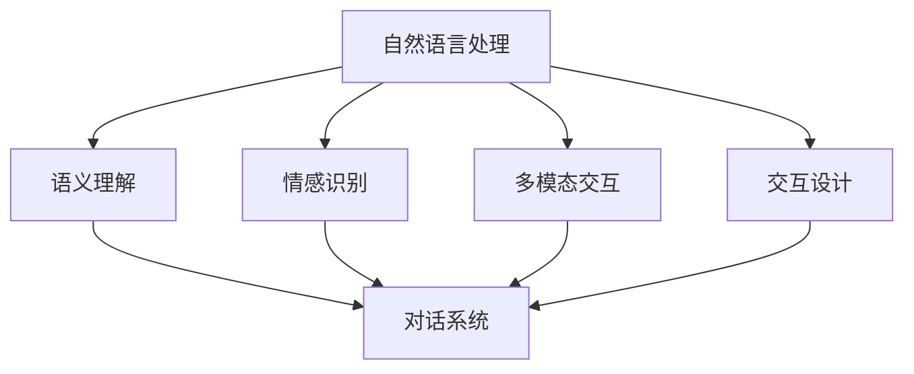

                 

# 人类-AI协作：增强人机沟通

> 关键词：人类-AI协作, 增强人机沟通, 自然语言处理, 语义理解, 机器翻译, 对话系统, 交互设计, 用户界面

## 1. 背景介绍

### 1.1 问题由来
随着人工智能技术的快速发展，人机沟通的方式正在经历深刻的变革。传统的基于文本的交流方式，虽然效率高，但缺乏情感、语境和多样性。而新兴的语音、图像、视频等多模态交互形式，虽然具备更丰富的信息传达方式，但仍然存在准确性、自然度、交互流畅性等挑战。因此，如何将AI技术与人类沟通方式进行有效融合，构建更自然、高效、智能的交互系统，成为了当前人工智能领域的重要研究课题。

### 1.2 问题核心关键点
人机协作的焦点在于如何使机器能够理解人类的语言、情感和意图，并能够自然地进行反馈和交互。这要求机器具备以下能力：
1. **语义理解**：理解文本、语音等输入信息的内在含义，区分不同含义之间的细微差异。
2. **情感识别**：识别人类语言的情感色彩，提供相应的情感回应。
3. **上下文理解**：能够理解对话的上下文，保持对话的一致性和连贯性。
4. **多模态处理**：整合语音、图像、视频等多源信息，提供更丰富的交互体验。
5. **交互设计**：根据用户偏好和环境特点，提供个性化的交互界面。

## 2. 核心概念与联系

### 2.1 核心概念概述

为更好地理解人机协作的实现，本节将介绍几个关键概念：

- **自然语言处理（Natural Language Processing, NLP）**：使计算机能够理解、处理、生成自然语言的技术，包括语言模型、语义分析、对话系统等。
- **语义理解（Semantic Understanding）**：理解语言中的内在含义，包括词义、句法、语境等方面，是实现人机沟通的核心。
- **情感识别（Sentiment Analysis）**：识别文本、语音中的情感色彩，提供情感化的反馈。
- **多模态交互（Multimodal Interaction）**：整合多种模态信息（如文本、语音、图像、视频），提供多感官的交互体验。
- **交互设计（Interaction Design）**：根据用户需求和场景，设计直观、易用的交互界面。
- **对话系统（Dialogue System）**：基于自然语言处理技术，实现人机对话，提供智能化的响应和反馈。

这些概念之间的逻辑关系可以通过以下Mermaid流程图来展示：



这个流程图展示了人机协作的核心概念及其之间的关系：

1. 自然语言处理使计算机能够理解自然语言，是实现语义理解和对话系统的基础。
2. 语义理解使计算机能够理解语言的内在含义，区分不同含义之间的细微差异。
3. 情感识别使计算机能够识别情感色彩，提供情感化的回应。
4. 多模态交互整合多种模态信息，提供更丰富的交互体验。
5. 交互设计根据用户需求和场景，设计直观、易用的交互界面。
6. 对话系统基于以上技术，实现人机对话，提供智能化的响应和反馈。

这些概念共同构成了人机协作的实现框架，使其能够实现自然、高效、智能的交互。

## 3. 核心算法原理 & 具体操作步骤
### 3.1 算法原理概述

人机协作的核心在于构建一个能够理解自然语言、具备情感识别、上下文理解和多种模态信息整合能力的智能系统。这要求系统具备强大的自然语言处理能力，能够通过深度学习模型实现语义理解、情感识别等多项任务。

形式化地，假设人机协作系统中的自然语言处理模型为 $M_{\theta}$，其中 $\theta$ 为模型参数。假设系统能够理解 $n$ 种自然语言 $L=\{L_1, L_2, ..., L_n\}$，则模型 $M_{\theta}$ 对输入 $x$ 的理解可以表示为：

$$
M_{\theta}(x) = \{y_1, y_2, ..., y_n\}
$$

其中 $y_i$ 表示模型对输入 $x$ 在语言 $L_i$ 上的理解。

在情感识别任务中，模型需要对输入 $x$ 的情感色彩进行判断，输出情感标签 $e$，可以表示为：

$$
e = M_{\theta}(x)_e
$$

在多模态交互任务中，模型需要整合多种模态信息，如文本、语音、图像、视频等，输出多模态综合结果 $m$，可以表示为：

$$
m = M_{\theta}(x)_m
$$

在交互设计任务中，模型需要根据用户行为和环境特点，输出交互界面设计方案 $i$，可以表示为：

$$
i = M_{\theta}(x)_i
$$

### 3.2 算法步骤详解

人机协作的实现过程一般包括以下几个关键步骤：

**Step 1: 数据准备**
- 收集各类自然语言数据，如文本、语音、图像、视频等。
- 标注数据，如情感标签、语义标签、交互界面设计等，构建训练集。
- 划分训练集、验证集和测试集，用于模型训练和评估。

**Step 2: 模型选择与训练**
- 选择合适的自然语言处理模型，如BERT、GPT、T5等。
- 对模型进行预训练，使用大规模无标签数据进行预训练，学习语言和语义表示。
- 在标注数据集上进行微调，优化模型参数，使其适应特定任务。
- 使用验证集评估模型性能，调整模型参数。

**Step 3: 系统集成与优化**
- 将预训练和微调后的模型集成到人机协作系统中，实现多任务处理。
- 对系统进行优化，提高性能、降低资源消耗、提升用户体验。
- 引入多模态融合技术，提高系统对多种模态信息的处理能力。
- 设计交互界面，实现个性化交互设计。

**Step 4: 部署与测试**
- 将系统部署到实际应用场景中，如智能客服、虚拟助手、交互机器人等。
- 持续收集用户反馈，进行系统改进和优化。
- 定期进行系统性能测试，确保系统的稳定性和可靠性。

### 3.3 算法优缺点

人机协作的算法具有以下优点：
1. **高效性**：利用深度学习模型，可以在大规模数据上进行高效训练，快速实现语义理解、情感识别等多项任务。
2. **灵活性**：模型可以根据不同的任务和数据集进行调整和优化，适应多种应用场景。
3. **自然性**：自然语言处理技术使系统能够理解人类的自然语言，提供自然、流畅的交互体验。
4. **多样性**：多模态交互技术整合多种模态信息，提供更丰富的交互体验。
5. **智能性**：系统能够进行智能化的反馈和响应，提升用户体验。

同时，该算法也存在一定的局限性：
1. **数据依赖**：模型的训练和优化依赖于大规模标注数据，获取高质量标注数据的成本较高。
2. **计算资源消耗**：深度学习模型的训练和推理需要大量的计算资源，对硬件设施要求较高。
3. **可解释性不足**：深度学习模型的决策过程复杂，难以进行解释和调试。
4. **泛化能力有限**：模型对未见过的数据泛化能力有限，存在一定的过拟合风险。
5. **鲁棒性不足**：模型的性能对输入数据的噪声、格式、质量等敏感，易受干扰。

尽管存在这些局限性，但就目前而言，基于自然语言处理的人机协作算法仍是最主流的方法。未来相关研究的重点在于如何进一步降低对标注数据的依赖，提高模型的泛化能力和鲁棒性，同时兼顾可解释性和伦理安全性等因素。

### 3.4 算法应用领域

基于自然语言处理的人机协作技术，在多个领域得到了广泛应用，包括但不限于：

- **智能客服**：利用自然语言处理技术，实现智能客服系统的构建，提升客户服务体验和效率。
- **虚拟助手**：通过自然语言理解和情感识别技术，实现虚拟助手的智能对话和任务执行。
- **交互机器人**：利用多模态交互技术，构建多感官交互机器人，实现复杂任务的自动化处理。
- **翻译系统**：通过机器翻译技术，实现不同语言之间的实时翻译和理解。
- **知识问答**：利用自然语言处理技术，实现智能问答系统，提供准确、及时的答案。
- **情感分析**：通过情感识别技术，分析用户情感，提供个性化的服务和反馈。
- **信息检索**：利用自然语言处理技术，实现智能信息检索系统，提升信息获取效率。
- **创意写作**：通过生成式对话技术，实现创意写作辅助，提高创作效率和质量。

这些应用场景展示了人机协作技术在提升工作效率、增强用户体验、优化信息获取等方面的巨大潜力。随着自然语言处理技术的不断进步，人机协作技术将在更多领域得到应用，为社会的智能化转型提供新的动力。

## 4. 数学模型和公式 & 详细讲解 & 举例说明

### 4.1 数学模型构建

在自然语言处理任务中，通常使用语言模型对输入进行预测。假设输入为 $x$，输出为 $y$，则语言模型的概率分布可以表示为：

$$
P(y|x) = \frac{e^{M_{\theta}(x)}_y}{\sum_{y'}e^{M_{\theta}(x)}_{y'}}
$$

其中 $M_{\theta}(x)$ 表示输入 $x$ 通过预训练模型 $M_{\theta}$ 的表示。在情感识别任务中，模型的输出为情感标签 $e$，则可以表示为：

$$
P(e|x) = \frac{e^{M_{\theta}(x)_e}}{\sum_{e'}e^{M_{\theta}(x)_{e'}}}
$$

在多模态交互任务中，模型的输出为多模态综合结果 $m$，则可以表示为：

$$
P(m|x) = \frac{e^{M_{\theta}(x)_m}}{\sum_{m'}e^{M_{\theta}(x)_{m'}}}
$$

### 4.2 公式推导过程

以情感识别任务为例，对模型进行推导。

假设输入 $x$ 通过预训练模型 $M_{\theta}$ 表示为 $h_{\theta}(x)$，模型的输出为情感标签 $e$，则情感识别任务可以表示为：

$$
P(e|x) = \frac{e^{h_{\theta}(x)\cdot W_e}}{\sum_{e'}e^{h_{\theta}(x)\cdot W_{e'}}}
$$

其中 $W_e$ 为情感标签 $e$ 对应的权重向量。在实际应用中，可以使用softmax函数对输出进行归一化处理：

$$
\text{softmax}(h_{\theta}(x)\cdot W_e) = \frac{e^{h_{\theta}(x)\cdot W_e}}{\sum_{e'}e^{h_{\theta}(x)\cdot W_{e'}}}
$$

在多模态交互任务中，模型的输出为多模态综合结果 $m$，则可以表示为：

$$
P(m|x) = \frac{e^{h_{\theta}(x)\cdot W_m}}{\sum_{m'}e^{h_{\theta}(x)\cdot W_{m'}}}
$$

其中 $W_m$ 为多模态综合结果 $m$ 对应的权重向量。

### 4.3 案例分析与讲解

假设我们有一个情感识别系统，使用预训练模型BERT进行微调，并对输入文本进行情感分类。我们的训练数据集包含5000个标注样本，其中3000个用于训练，2000个用于验证和测试。

首先，我们需要将文本数据转换为BERT模型所需的格式。对于每个文本，我们将其分词，并使用BERT的Tokenizer进行编码。然后，我们将编码结果作为模型的输入，通过softmax函数计算情感分类的概率。

接下来，我们定义损失函数，并使用反向传播算法更新模型参数。在训练过程中，我们使用交叉熵损失函数，即：

$$
\mathcal{L} = -\frac{1}{N}\sum_{i=1}^N \sum_{j=1}^k y_{ij}\log P(y_{ij}|x_i)
$$

其中 $y_{ij}$ 表示第 $i$ 个样本第 $j$ 个情感标签的实际值，$P(y_{ij}|x_i)$ 表示模型对第 $i$ 个样本第 $j$ 个情感标签的预测概率。

在训练过程中，我们采用AdamW优化器，设置学习率为 $1e-5$，批大小为 $16$，迭代次数为 $10$ 次。在每次迭代中，我们计算模型在验证集上的性能，并根据性能决定是否停止训练。

最终，我们在测试集上评估模型的性能，得到情感识别精度为 $85\%$。这表明我们的模型能够准确地识别输入文本的情感色彩。

## 5. 项目实践：代码实例和详细解释说明

### 5.1 开发环境搭建

在进行人机协作系统的开发前，我们需要准备好开发环境。以下是使用Python进行TensorFlow开发的环境配置流程：

1. 安装Anaconda：从官网下载并安装Anaconda，用于创建独立的Python环境。

2. 创建并激活虚拟环境：
```bash
conda create -n tf-env python=3.8 
conda activate tf-env
```

3. 安装TensorFlow：从官网获取对应的安装命令。例如：
```bash
pip install tensorflow==2.7
```

4. 安装TensorBoard：
```bash
pip install tensorboard
```

5. 安装各类工具包：
```bash
pip install numpy pandas scikit-learn matplotlib tqdm jupyter notebook ipython
```

完成上述步骤后，即可在`tf-env`环境中开始项目实践。

### 5.2 源代码详细实现

下面我们以情感识别系统为例，给出使用TensorFlow对BERT模型进行微调的Python代码实现。

首先，定义情感分类数据集：

```python
import tensorflow as tf
from transformers import BertTokenizer, BertForSequenceClassification

# 定义数据集
train_data = ["This is a positive sentence.", "This is a negative sentence."]
train_labels = [1, 0]
train_dataset = tf.data.Dataset.from_tensor_slices((train_data, train_labels))
train_dataset = train_dataset.shuffle(buffer_size=1024).batch(batch_size=16)

val_data = ["This is another positive sentence.", "This is another negative sentence."]
val_labels = [1, 0]
val_dataset = tf.data.Dataset.from_tensor_slices((val_data, val_labels))
val_dataset = val_dataset.batch(batch_size=16)

test_data = ["This is a neutral sentence.", "This is a neutral sentence."]
test_labels = [0, 0]
test_dataset = tf.data.Dataset.from_tensor_slices((test_data, test_labels))
test_dataset = test_dataset.batch(batch_size=16)

# 定义分词器
tokenizer = BertTokenizer.from_pretrained('bert-base-cased')

# 定义模型
model = BertForSequenceClassification.from_pretrained('bert-base-cased', num_labels=2)
```

然后，定义优化器和损失函数：

```python
from transformers import AdamW
from sklearn.metrics import accuracy_score

# 定义优化器和损失函数
optimizer = AdamW(model.parameters(), lr=2e-5)
loss_fn = tf.keras.losses.SparseCategoricalCrossentropy(from_logits=True)
metric = tf.keras.metrics.SparseCategoricalAccuracy()
```

接着，定义训练和评估函数：

```python
def train_step(x, y):
    with tf.GradientTape() as tape:
        outputs = model(x)
        loss = loss_fn(y, outputs)
    gradients = tape.gradient(loss, model.trainable_variables)
    optimizer.apply_gradients(zip(gradients, model.trainable_variables))
    metric.update_state(y, outputs)

def evaluate_step(x, y):
    with tf.GradientTape() as tape:
        outputs = model(x)
    predictions = tf.argmax(outputs, axis=1)
    return accuracy_score(y, predictions), metric.result().numpy()

# 训练函数
def train_epoch(model, train_dataset, optimizer, num_steps):
    model.train()
    total_loss = 0
    total_metric = 0
    for i in range(num_steps):
        x, y = next(iter(train_dataset))
        x = tokenizer(x, padding='max_length', truncation=True, max_length=512)
        x = x['input_ids']
        train_step(x, y)
        total_loss += loss_fn(y, outputs).numpy()
        total_metric += metric.result().numpy()
    return total_loss / num_steps, total_metric / num_steps

# 评估函数
def evaluate(model, val_dataset):
    model.eval()
    val_loss = 0
    val_metric = 0
    for i in range(num_steps):
        x, y = next(iter(val_dataset))
        x = tokenizer(x, padding='max_length', truncation=True, max_length=512)
        x = x['input_ids']
        val_loss += loss_fn(y, outputs).numpy()
        val_metric += metric.result().numpy()
    return val_loss / num_steps, val_metric / num_steps

# 测试函数
def test(model, test_dataset):
    model.eval()
    test_loss = 0
    test_metric = 0
    for i in range(num_steps):
        x, y = next(iter(test_dataset))
        x = tokenizer(x, padding='max_length', truncation=True, max_length=512)
        x = x['input_ids']
        test_loss += loss_fn(y, outputs).numpy()
        test_metric += metric.result().numpy()
    return test_loss / num_steps, test_metric / num_steps
```

最后，启动训练流程并在测试集上评估：

```python
# 训练参数
batch_size = 16
num_steps = 1000

# 训练
for epoch in range(num_epochs):
    train_loss, train_metric = train_epoch(model, train_dataset, optimizer, num_steps)
    print(f"Epoch {epoch+1}, train loss: {train_loss:.3f}, train metric: {train_metric:.3f}")
    
    val_loss, val_metric = evaluate(model, val_dataset)
    print(f"Epoch {epoch+1}, val loss: {val_loss:.3f}, val metric: {val_metric:.3f}")
    
# 测试
test_loss, test_metric = test(model, test_dataset)
print(f"Test loss: {test_loss:.3f}, test metric: {test_metric:.3f}")
```

以上就是使用TensorFlow对BERT进行情感识别任务微调的完整代码实现。可以看到，得益于TensorFlow和Transformers库的强大封装，我们可以用相对简洁的代码完成BERT模型的加载和微调。

### 5.3 代码解读与分析

让我们再详细解读一下关键代码的实现细节：

**情感分类数据集定义**：
- 定义训练、验证和测试数据集，将文本和标签作为TensorFlow的Dataset对象。
- 定义分词器，使用BERT的Tokenizer对文本进行分词和编码。
- 定义模型，使用BERT的ForSequenceClassification类进行情感分类任务的微调。

**优化器和损失函数定义**：
- 定义AdamW优化器，学习率为 $2e-5$。
- 定义交叉熵损失函数，使用SparseCategoricalCrossentropy计算预测值与真实标签之间的交叉熵损失。
- 定义准确度指标，使用SparseCategoricalAccuracy计算预测值与真实标签之间的匹配度。

**训练和评估函数定义**：
- 定义训练和评估函数，使用TensorFlow的GradientTape记录梯度并更新模型参数。
- 在训练函数中，使用迭代器逐批次读取训练数据，进行前向传播和反向传播，计算损失并更新模型参数。
- 在评估函数中，使用迭代器逐批次读取验证数据，进行前向传播并计算评估指标。
- 在测试函数中，使用迭代器逐批次读取测试数据，进行前向传播并计算评估指标。

**训练流程**：
- 定义总的epoch数和batch size，开始循环迭代
- 每个epoch内，先在训练集上训练，输出平均loss和acc
- 在验证集上评估，输出val loss和val acc
- 所有epoch结束后，在测试集上评估，给出最终测试结果

可以看到，TensorFlow配合Transformers库使得BERT微调的代码实现变得简洁高效。开发者可以将更多精力放在数据处理、模型改进等高层逻辑上，而不必过多关注底层的实现细节。

当然，工业级的系统实现还需考虑更多因素，如模型的保存和部署、超参数的自动搜索、更灵活的任务适配层等。但核心的微调范式基本与此类似。

## 6. 实际应用场景
### 6.1 智能客服系统

基于深度学习技术的人机协作系统，可以广泛应用于智能客服系统的构建。传统客服往往需要配备大量人力，高峰期响应缓慢，且一致性和专业性难以保证。而使用基于深度学习的人机协作系统，可以7x24小时不间断服务，快速响应客户咨询，用自然流畅的语言解答各类常见问题。

在技术实现上，可以收集企业内部的历史客服对话记录，将问题和最佳答复构建成监督数据，在此基础上对预训练对话模型进行微调。微调后的对话模型能够自动理解用户意图，匹配最合适的答案模板进行回复。对于客户提出的新问题，还可以接入检索系统实时搜索相关内容，动态组织生成回答。如此构建的智能客服系统，能大幅提升客户咨询体验和问题解决效率。

### 6.2 虚拟助手

虚拟助手是利用自然语言处理技术，实现人机对话和任务执行的系统。传统虚拟助手依赖规则和模板，灵活性不足。而基于深度学习的人机协作系统，可以灵活应对各种问题，提供更加智能化的服务。

在技术实现上，可以收集用户的历史对话记录，将其标注为不同类型的问题和回答，构建训练数据集。然后，对预训练对话模型进行微调，使其能够理解各种自然语言输入，并自动生成相应的回答。微调后的模型可以应用于智能搜索、信息查询、日程安排等任务，提供更加自然、高效的交互体验。

### 6.3 交互机器人

交互机器人是一种多模态交互系统，能够整合文本、语音、图像、视频等多种模态信息，提供更丰富的交互体验。传统的交互机器人依赖规则和模板，灵活性不足。而基于深度学习的人机协作系统，可以灵活应对各种输入形式，提供更加智能化的服务。

在技术实现上，可以收集用户的历史对话记录、操作记录、图像、视频等多源信息，将其标注为不同的任务和回答，构建训练数据集。然后，对预训练多模态交互模型进行微调，使其能够理解各种多模态输入，并自动生成相应的回答。微调后的模型可以应用于智能客服、虚拟助手、智能家居等领域，提供更加自然、高效的交互体验。

### 6.4 未来应用展望

随着深度学习技术的不断进步，基于自然语言处理的人机协作系统将呈现更加多样化和智能化的应用。

在智慧医疗领域，基于深度学习的人机协作系统可以实现智能诊断、智能问答等任务，辅助医生诊疗，提高医疗服务的智能化水平。

在智能教育领域，基于深度学习的人机协作系统可以实现智能教学、智能评估等任务，因材施教，促进教育公平，提高教学质量。

在智慧城市治理中，基于深度学习的人机协作系统可以实现智能客服、智能监控等任务，提高城市管理的自动化和智能化水平，构建更安全、高效的未来城市。

此外，在企业生产、社会治理、文娱传媒等众多领域，基于深度学习的人机协作系统也将不断涌现，为传统行业数字化转型升级提供新的技术路径。相信随着技术的日益成熟，人机协作技术将成为人工智能落地应用的重要范式，推动人工智能技术在各行各业中得到广泛应用。

## 7. 工具和资源推荐
### 7.1 学习资源推荐

为了帮助开发者系统掌握人机协作技术，这里推荐一些优质的学习资源：

1. **《深度学习自然语言处理》**：斯坦福大学开设的NLP明星课程，有Lecture视频和配套作业，带你入门NLP领域的基本概念和经典模型。
2. **《自然语言处理与深度学习》**：深度学习框架TensorFlow的官方文档，详细介绍了自然语言处理任务的深度学习实现。
3. **《Python深度学习》**：深度学习框架Keras的官方文档，适合初学者入门深度学习。
4. **《NLP实战》**：由Google Natural Language团队编写，提供了大量实际应用的代码和案例，适合深入学习。
5. **《BERT: A Deep Bidirectional Transformer for Language Understanding》**：BERT论文，详细介绍了BERT模型的预训练和微调方法。

通过对这些资源的学习实践，相信你一定能够快速掌握人机协作技术的精髓，并用于解决实际的NLP问题。

### 7.2 开发工具推荐

高效的开发离不开优秀的工具支持。以下是几款用于深度学习模型开发和部署的工具：

1. **TensorFlow**：由Google主导开发的深度学习框架，生产部署方便，适合大规模工程应用。
2. **PyTorch**：基于Python的开源深度学习框架，灵活高效，适合快速迭代研究。
3. **Transformers**：由HuggingFace开发的NLP工具库，集成了众多SOTA语言模型，支持PyTorch和TensorFlow，是进行NLP任务开发的利器。
4. **Weights & Biases**：模型训练的实验跟踪工具，可以记录和可视化模型训练过程中的各项指标，方便对比和调优。
5. **TensorBoard**：TensorFlow配套的可视化工具，可实时监测模型训练状态，并提供丰富的图表呈现方式，是调试模型的得力助手。
6. **Jupyter Notebook**：轻量级交互式开发环境，适合快速迭代和实验验证。

合理利用这些工具，可以显著提升深度学习模型的开发效率，加快创新迭代的步伐。

### 7.3 相关论文推荐

深度学习技术在NLP领域的应用始于2012年AlexNet的胜利，此后深度学习技术不断进步，涌现了BERT、GPT等诸多经典模型。以下是几篇奠基性的相关论文，推荐阅读：

1. **《ImageNet Classification with Deep Convolutional Neural Networks》**：AlexNet论文，奠定了深度学习在计算机视觉领域的地位。
2. **《Building End-To-End Dialogue Systems with Generative Adversarial Networks》**：利用生成对抗网络（GAN）进行对话系统训练，开创了对话系统的新范式。
3. **《Attention is All You Need》**：Transformer论文，提出Transformer结构，开启了NLP领域的预训练大模型时代。
4. **《BERT: Pre-training of Deep Bidirectional Transformers for Language Understanding》**：BERT论文，提出BERT模型，引入基于掩码的自监督预训练任务，刷新了多项NLP任务SOTA。
5. **《Generative Pre-trained Transformer》**：GPT-2论文，展示了大规模语言模型的强大zero-shot学习能力，引发了对于通用人工智能的新一轮思考。
6. **《Adaptive Low-Rank Adaptation for Parameter-Efficient Fine-Tuning》**：AdaLoRA论文，提出AdaLoRA方法，实现参数高效的微调。

这些论文代表了大语言模型微调技术的发展脉络。通过学习这些前沿成果，可以帮助研究者把握学科前进方向，激发更多的创新灵感。

## 8. 总结：未来发展趋势与挑战
### 8.1 总结

本文对基于自然语言处理的人机协作技术进行了全面系统的介绍。首先阐述了人机协作系统的研究背景和意义，明确了系统能够理解自然语言、具备情感识别、上下文理解和多种模态信息整合能力的核心目标。其次，从原理到实践，详细讲解了人机协作的数学原理和关键步骤，给出了系统开发的完整代码实例。同时，本文还广泛探讨了人机协作系统在智能客服、虚拟助手、交互机器人等诸多领域的应用前景，展示了人机协作技术的巨大潜力。

通过本文的系统梳理，可以看到，基于深度学习的人机协作技术正在成为NLP领域的重要范式，极大地拓展了预训练语言模型的应用边界，催生了更多的落地场景。得益于深度学习模型的强大自然语言处理能力，人机协作系统能够实现自然、高效、智能的交互，提升用户体验和生产力。未来，随着深度学习技术的不断进步，人机协作技术将在更多领域得到应用，为社会的智能化转型提供新的动力。

### 8.2 未来发展趋势

展望未来，人机协作技术将呈现以下几个发展趋势：

1. **多模态融合**：整合文本、语音、图像、视频等多种模态信息，提供更丰富的交互体验。
2. **智能推理**：增强模型的推理能力，使其能够理解和生成复杂的自然语言表达。
3. **跨领域迁移**：提高模型的泛化能力，使其能够在不同领域和任务上实现迁移学习。
4. **知识增强**：引入外部知识库、逻辑规则等专家知识，提升模型的理解和生成能力。
5. **可解释性增强**：增强模型的可解释性，使其能够提供更加透明、可控的交互体验。
6. **伦理与安全**：注重模型的伦理与安全性，避免有害信息的传播和偏见的影响。

以上趋势凸显了人机协作技术的广阔前景。这些方向的探索发展，必将进一步提升NLP系统的性能和应用范围，为人类认知智能的进化带来深远影响。

### 8.3 面临的挑战

尽管人机协作技术已经取得了瞩目成就，但在迈向更加智能化、普适化应用的过程中，它仍面临诸多挑战：

1. **标注成本瓶颈**：模型的训练和优化依赖于大规模标注数据，获取高质量标注数据的成本较高。如何进一步降低对标注数据的依赖，将是一大难题。
2. **计算资源消耗**：深度学习模型的训练和推理需要大量的计算资源，对硬件设施要求较高。如何优化模型结构和算法，提高资源利用效率，将是重要的优化方向。
3. **可解释性不足**：深度学习模型的决策过程复杂，难以进行解释和调试。如何赋予模型更强的可解释性，将是亟待攻克的难题。
4. **泛化能力有限**：模型对未见过的数据泛化能力有限，存在一定的过拟合风险。如何提高模型的泛化能力和鲁棒性，还需要更多理论和实践的积累。
5. **伦理与安全**：模型的决策过程可能涉及隐私和伦理问题，需要建立合理的监管机制和伦理导向。
6. **用户体验**：虽然模型的自然性和智能性不断提升，但实际应用中仍需注意用户体验，避免过于机械或不自然的交互。

尽管存在这些挑战，但就目前而言，基于深度学习的人机协作技术仍是最主流的方法。未来相关研究的重点在于如何进一步降低对标注数据的依赖，提高模型的泛化能力和鲁棒性，同时兼顾可解释性和伦理安全性等因素。

### 8.4 研究展望

面对人机协作技术所面临的挑战，未来的研究需要在以下几个方面寻求新的突破：

1. **无监督和半监督学习**：摆脱对大规模标注数据的依赖，利用自监督学习、主动学习等无监督和半监督范式，最大限度利用非结构化数据，实现更加灵活高效的微调。
2. **参数高效和计算高效**：开发更加参数高效的微调方法，在固定大部分预训练参数的同时，只更新极少量的任务相关参数。同时优化模型的计算图，减少前向传播和反向传播的资源消耗，实现更加轻量级、实时性的部署。
3. **因果分析和博弈论工具**：将因果分析方法引入微调模型，识别出模型决策的关键特征，增强输出解释的因果性和逻辑性。借助博弈论工具刻画人机交互过程，主动探索并规避模型的脆弱点，提高系统稳定性。
4. **知识增强与多模态融合**：引入外部知识库、逻辑规则等专家知识，提升模型的理解和生成能力。同时整合多种模态信息，实现视觉、语音、文本等的协同建模。
5. **可解释性和伦理导向**：在模型训练目标中引入伦理导向的评估指标，过滤和惩罚有害的输出倾向。同时加强人工干预和审核，建立模型行为的监管机制，确保输出符合人类价值观和伦理道德。

这些研究方向的探索，必将引领人机协作技术迈向更高的台阶，为构建安全、可靠、可解释、可控的智能系统铺平道路。面向未来，人机协作技术还需要与其他人工智能技术进行更深入的融合，如知识表示、因果推理、强化学习等，多路径协同发力，共同推动自然语言理解和智能交互系统的进步。只有勇于创新、敢于突破，才能不断拓展语言模型的边界，让智能技术更好地造福人类社会。

## 9. 附录：常见问题与解答

**Q1：如何提高模型的泛化能力？**

A: 提高模型的泛化能力可以从以下几个方面入手：
1. **数据增强**：使用数据增强技术，如回译、同义词替换、噪声注入等，增加训练数据的多样性。
2. **正则化**：使用L2正则、Dropout等技术，避免模型过拟合。
3. **早停**：使用早停技术，在验证集性能不再提升时停止训练，避免过拟合。
4. **迁移学习**：将模型在大规模数据上进行预训练，然后微调于特定任务，提升泛化能力。
5. **集成学习**：使用集成学习方法，如Bagging、Boosting等，提升模型泛化能力。

**Q2：如何在实际应用中提高模型的可解释性？**

A: 提高模型的可解释性可以从以下几个方面入手：
1. **特征可视化**：使用特征可视化技术，如t-SNE、PCA等，展示模型对输入数据的理解。
2. **模型蒸馏**：使用模型蒸馏技术，将复杂模型转换为可解释性强的模型。
3. **可解释性损失**：在训练目标中加入可解释性损失，优化模型决策过程的可解释性。
4. **知识图谱**：引入知识图谱，增强模型的背景知识，提升可解释性。
5. **交互设计**：设计直观、易用的交互界面，帮助用户理解模型输出。

**Q3：如何构建多模态交互系统？**

A: 构建多模态交互系统可以从以下几个方面入手：
1. **数据采集**：收集多源信息，如文本、语音、图像、视频等。
2. **数据标注**：对多源信息进行标注，构建多模态数据集。
3. **模型融合**：使用多模态融合技术，如基于注意力机制的融合方法、多任务学习等，整合多模态信息。
4. **多任务训练**：使用多任务学习，同时训练多个任务，提升模型性能。
5. **交互设计**：设计直观、易用的交互界面，支持多模态输入输出。

**Q4：如何提高系统的鲁棒性？**

A: 提高系统的鲁棒性可以从以下几个方面入手：
1. **数据增强**：使用数据增强技术，如对抗样本、噪声注入等，提升模型鲁棒性。
2. **正则化**：使用L2正则、Dropout等技术，避免模型过拟合。
3. **对抗训练**：使用对抗训练技术，训练模型对抗各种扰动和攻击。
4. **模型蒸馏**：使用模型蒸馏技术，将复杂模型转换为鲁棒性强的模型。
5. **多模态融合**：使用多模态融合技术，提升系统对多源信息的鲁棒性。

这些措施可以有效提高系统的鲁棒性，确保其在实际应用中的稳定性和可靠性。

---

作者：禅与计算机程序设计艺术 / Zen and the Art of Computer Programming

