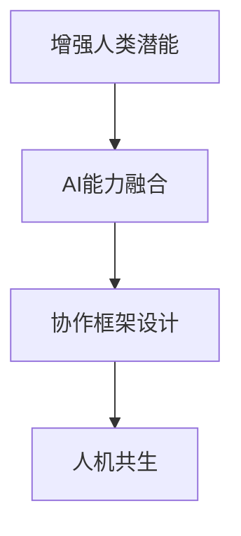

                 

# 人类-AI协作：增强人类潜能与AI能力的融合发展趋势预测分析机遇挑战机遇

> 关键词：人类-AI协作,增强人类潜能,AI能力融合,发展趋势,机遇与挑战

## 1. 背景介绍

在数字化时代，人工智能（AI）技术迅猛发展，逐渐成为推动社会进步、经济繁荣的重要引擎。与此同时，人工智能正在深刻地改变人类的生活方式、工作方式乃至思维方式。然而，这一发展也引发了人们对于人工智能与人类关系的广泛关注和深刻思考。如何实现人类与AI的和谐共生，最大化地发挥二者的协同效应，成为了一个值得深入探讨的问题。

### 1.1 问题由来

随着深度学习、自然语言处理、计算机视觉等技术的不断突破，人工智能在各领域的应用日益广泛，取得了令人瞩目的成就。从自动驾驶、智能客服到医疗诊断、教育辅助，AI正以各种形式渗透到人类生活的方方面面。但与此同时，AI技术的发展也带来了新的挑战，包括数据隐私、伦理道德、安全性等问题，引发了广泛的讨论和反思。

### 1.2 问题核心关键点

如何实现人工智能与人类之间的良性互动和深度融合，最大化地发挥AI技术的优势，同时确保人类的核心价值和伦理边界不受损害，是一个复杂而重要的问题。关键点包括：

- **人类-AI协作的实现**：如何设计合适的AI系统框架和交互界面，使得人类能够有效地与AI系统进行协作。
- **增强人类潜能**：利用AI技术提升人类在决策、认知、创造等方面的能力。
- **AI能力的融合**：将AI的能力融入人类知识体系，形成互补，提升整体智慧水平。
- **发展趋势预测**：分析人工智能与人类协作的趋势，预见未来发展方向。
- **机遇与挑战**：明确人工智能与人类协作过程中所面临的机遇与挑战，为后续研究和应用提供方向。

## 2. 核心概念与联系

### 2.1 核心概念概述

要深刻理解人类-AI协作的融合发展，需先明确几个核心概念：

- **增强人类潜能**：利用AI技术提升人类的认知、决策、创造等能力，推动人类智慧的发展。
- **AI能力的融合**：将AI的计算、推理、感知等能力融入人类的知识体系，形成互补。
- **协作框架设计**：设计合适的AI系统架构和交互界面，使得人类与AI能够高效协作。
- **人机共生**：构建基于信任、透明、互动的人机共生生态系统，实现双方的共赢。

这些核心概念之间存在紧密联系，共同构成了人类-AI协作的基础。通过这些概念的深入理解和实际应用，我们可以更好地实现增强人类潜能与AI能力的融合发展。

### 2.2 核心概念原理和架构的 Mermaid 流程图



## 3. 核心算法原理 & 具体操作步骤

### 3.1 算法原理概述

基于人类-AI协作的融合发展，可以采用以下算法原理：

1. **强化学习**：通过不断与环境交互，AI系统可以学习到最优的决策策略，提升协作效率。
2. **知识图谱**：构建包含人类知识和AI能力的数据图谱，帮助双方理解和协作。
3. **自然语言处理**：通过自然语言理解与生成技术，实现人机之间的自然语言交互。
4. **迁移学习**：将AI在特定任务上学习到的知识迁移到其他任务，提升整体的协作能力。
5. **协同进化**：通过相互学习和适应，实现AI与人类之间的协同进化。

### 3.2 算法步骤详解

基于上述原理，具体的操作步骤如下：

1. **数据采集与预处理**：收集人类与AI系统互动的数据，包括人类输入、AI输出、交互过程等。
2. **模型训练与优化**：利用强化学习、知识图谱等技术，训练AI系统，优化其决策策略和知识结构。
3. **人机交互界面设计**：设计友好的交互界面，实现自然语言交互和可视化展示。
4. **实时监测与反馈**：实时监测人机协作效果，根据反馈不断优化AI系统。
5. **系统集成与部署**：将训练好的AI系统集成到实际应用中，进行大规模部署。

### 3.3 算法优缺点

人类-AI协作的融合发展算法具有以下优点：

- **高效协作**：通过优化AI系统，提升人机协作效率。
- **广泛应用**：适用于各种场景，如教育、医疗、制造等。
- **动态适应**：AI系统能够根据人类反馈动态调整，提升协作效果。

同时，也存在一些缺点：

- **数据隐私**：在数据收集和处理过程中，可能涉及隐私泄露。
- **伦理问题**：AI系统在决策过程中可能涉及伦理道德问题。
- **技术挑战**：实现高效人机协作需要解决诸多技术难题。

### 3.4 算法应用领域

人类-AI协作的融合发展算法广泛应用于多个领域，包括：

- **教育**：辅助教师教学，提升学生的学习体验和效果。
- **医疗**：辅助医生诊断，提升医疗服务的质量和效率。
- **金融**：提供风险评估、投资建议等服务。
- **制造**：优化生产流程，提升生产效率和质量。
- **安全**：在公共安全、网络安全等领域提供预警和防护服务。

## 4. 数学模型和公式 & 详细讲解 & 举例说明

### 4.1 数学模型构建

为了实现增强人类潜能与AI能力的融合发展，需要构建一个包含人类与AI系统交互数据的数学模型。以教育场景为例，构建如下模型：

- **输入**：学生、教师的输入，包括提问、回答、课堂表现等。
- **输出**：AI系统根据输入生成的建议、预测等。
- **损失函数**：定义模型输出的误差，如学生满意度的评分。

### 4.2 公式推导过程

设输入为 $x$，输出为 $y$，损失函数为 $L$，则模型的优化目标为：

$$
\min_{\theta} L(y, f(x; \theta))
$$

其中，$f(x; \theta)$ 为模型参数 $\theta$ 的函数。在教育场景中，$x$ 为学生和教师的输入，$y$ 为AI系统的输出，$L$ 为学生满意度的评分函数。

### 4.3 案例分析与讲解

以医疗领域为例，分析人类-AI协作的融合发展：

1. **数据采集**：收集患者的病历、影像、基因数据等，以及医生的诊断和治疗记录。
2. **模型训练**：利用机器学习和深度学习技术，训练AI系统，使其能够辅助医生进行诊断和治疗决策。
3. **实时监测**：通过实时监测患者的病情变化，AI系统能够及时调整治疗方案，提高治疗效果。
4. **反馈优化**：根据医生的反馈，不断优化AI系统的决策策略，提升协作效率。

## 5. 项目实践：代码实例和详细解释说明

### 5.1 开发环境搭建

实现人类-AI协作的融合发展，需要构建一个包含数据采集、模型训练、人机交互等环节的开发环境。以下是Python环境搭建的步骤：

1. **安装Anaconda**：从官网下载并安装Anaconda，用于创建独立的Python环境。
2. **创建虚拟环境**：
```bash
conda create -n my_env python=3.8
conda activate my_env
```
3. **安装相关库**：
```bash
pip install torch torchvision torchaudio scikit-learn pandas numpy matplotlib
```

### 5.2 源代码详细实现

以下是使用PyTorch实现医疗领域的AI协作系统的代码：

```python
import torch
import torch.nn as nn
import torch.optim as optim
from torch.utils.data import DataLoader
from torchvision import datasets, transforms

# 定义模型
class Model(nn.Module):
    def __init__(self):
        super(Model, self).__init__()
        self.conv1 = nn.Conv2d(1, 32, 3)
        self.conv2 = nn.Conv2d(32, 64, 3)
        self.pool = nn.MaxPool2d(2)
        self.fc1 = nn.Linear(64 * 7 * 7, 120)
        self.fc2 = nn.Linear(120, 84)
        self.fc3 = nn.Linear(84, 10)
        
    def forward(self, x):
        x = self.pool(F.relu(self.conv1(x)))
        x = self.pool(F.relu(self.conv2(x)))
        x = x.view(-1, 64 * 7 * 7)
        x = F.relu(self.fc1(x))
        x = F.relu(self.fc2(x))
        x = self.fc3(x)
        return x

# 加载数据集
train_dataset = datasets.MNIST(root='./data', train=True, download=True,
                               transform=transforms.ToTensor())
test_dataset = datasets.MNIST(root='./data', train=False, download=True,
                             transform=transforms.ToTensor())

# 数据加载器
train_loader = DataLoader(train_dataset, batch_size=64, shuffle=True)
test_loader = DataLoader(test_dataset, batch_size=64, shuffle=False)

# 定义模型、损失函数和优化器
model = Model()
criterion = nn.CrossEntropyLoss()
optimizer = optim.SGD(model.parameters(), lr=0.001, momentum=0.9)

# 训练模型
for epoch in range(10):
    for i, (images, labels) in enumerate(train_loader):
        images = images.view(images.size(0), 1, 28, 28)
        optimizer.zero_grad()
        outputs = model(images)
        loss = criterion(outputs, labels)
        loss.backward()
        optimizer.step()
        if (i+1) % 100 == 0:
            print('Epoch [{}/{}], Step [{}/{}], Loss: {:.4f}'
                  .format(epoch+1, 10, i+1, len(train_loader), loss.item()))
```

### 5.3 代码解读与分析

这段代码实现了使用PyTorch搭建的简单的卷积神经网络（CNN）模型，用于医疗领域的图像分类任务。具体解读如下：

1. **模型定义**：定义了一个包含两个卷积层和三个全连接层的CNN模型。
2. **数据加载**：从MNIST数据集中加载训练和测试数据，并进行预处理。
3. **训练循环**：在每个epoch中，对训练集进行迭代，计算损失函数，并更新模型参数。
4. **输出显示**：每100步输出一次训练进度和损失值。

## 6. 实际应用场景

### 6.1 教育

在教育领域，AI系统可以辅助教师进行个性化教学，提升学生的学习效果。具体应用场景包括：

- **智能辅导**：利用AI技术，对学生进行智能辅导，解决个性化问题。
- **学习分析**：分析学生的学习行为和表现，提供个性化学习建议。
- **虚拟助教**：构建虚拟助教系统，实时回答学生问题，提供学习支持。

### 6.2 医疗

在医疗领域，AI系统可以辅助医生进行诊断和治疗决策，提升医疗服务的质量和效率。具体应用场景包括：

- **智能诊断**：利用AI技术，对患者的病历和影像数据进行智能诊断，辅助医生做出决策。
- **治疗优化**：根据患者的病情和历史治疗记录，AI系统可以提供个性化的治疗方案。
- **手术辅助**：在手术过程中，AI系统可以提供实时反馈，辅助医生进行手术操作。

### 6.3 金融

在金融领域，AI系统可以提供风险评估、投资建议等服务，提升金融服务的质量和效率。具体应用场景包括：

- **风险预测**：利用AI技术，对客户的信用和风险进行评估，提供个性化的贷款方案。
- **投资建议**：根据市场数据和客户需求，AI系统可以提供个性化的投资建议。
- **智能客服**：构建智能客服系统，解答客户的投资咨询和疑问。

### 6.4 未来应用展望

未来，人类-AI协作的融合发展将呈现以下几个趋势：

1. **跨领域融合**：AI系统将在更多领域得到应用，如农业、环保、能源等。
2. **智能增强**：AI系统将更好地理解人类语言和行为，提供更精准的决策建议。
3. **人机共生**：构建基于信任、透明、互动的人机共生生态系统，实现双方的共赢。
4. **伦理道德**：在AI系统设计和使用过程中，将伦理道德作为重要考量。
5. **可持续发展**：AI系统的开发和应用将更加注重环保和社会责任。

## 7. 工具和资源推荐

### 7.1 学习资源推荐

为了深入理解人类-AI协作的融合发展，推荐以下学习资源：

1. **《深度学习》（周志华）**：全面介绍深度学习的基本概念和算法，涵盖多个应用领域。
2. **《机器学习实战》（Peter Harrington）**：提供实用的机器学习项目案例，帮助读者掌握实际应用技巧。
3. **《Python深度学习》（Francois Chollet）**：详细介绍使用Keras进行深度学习开发的实践方法。
4. **Coursera的深度学习课程**：斯坦福大学、谷歌等知名机构提供的深度学习课程，涵盖基础理论与实战案例。
5. **ArXiv论文库**：获取最新的AI研究论文，了解前沿进展。

### 7.2 开发工具推荐

实现人类-AI协作的融合发展，需要选择合适的开发工具。以下是几个常用的开发工具：

1. **PyTorch**：基于Python的开源深度学习框架，灵活高效，支持动态图。
2. **TensorFlow**：由Google开发的深度学习框架，支持静态图和动态图。
3. **Jupyter Notebook**：交互式的Python开发环境，支持代码块、数据分析和可视化。
4. **Visual Studio Code**：轻量级的代码编辑器，支持多种语言和扩展插件。
5. **Git**：版本控制系统，方便团队协作和代码管理。

### 7.3 相关论文推荐

人类-AI协作的融合发展涉及多个研究领域，以下是几篇具有代表性的论文：

1. **《深度强化学习》（Richard S. Sutton和Andrew G. Barto）**：介绍深度强化学习的基本原理和算法。
2. **《知识图谱构建与查询》（Han Liu和Geoffrey I. Webb）**：介绍知识图谱的构建方法和应用场景。
3. **《自然语言处理综述》（Christopher D. Manning和Hinrich Schütze）**：全面综述自然语言处理的基本概念和算法。
4. **《协同过滤推荐算法》（Joachim M. Brefeld）**：介绍协同过滤推荐算法的基本原理和应用场景。
5. **《人工智能与伦理》（Marco Anzenbacher）**：探讨AI技术在伦理道德方面的应用和挑战。

## 8. 总结：未来发展趋势与挑战

### 8.1 研究成果总结

人类-AI协作的融合发展已经取得显著进展，在教育、医疗、金融等领域展现了巨大的潜力。未来，随着技术的不断进步，AI系统将更加智能、高效、可靠，与人类的协作也将更加紧密、高效。

### 8.2 未来发展趋势

未来，人类-AI协作的融合发展将呈现以下几个趋势：

1. **深度融合**：AI系统将在更多领域得到应用，与人类协作更加深入。
2. **智能化提升**：AI系统将更好地理解人类语言和行为，提供更精准的决策建议。
3. **人机共生**：构建基于信任、透明、互动的人机共生生态系统，实现双方的共赢。
4. **伦理道德**：在AI系统设计和使用过程中，将伦理道德作为重要考量。
5. **可持续发展**：AI系统的开发和应用将更加注重环保和社会责任。

### 8.3 面临的挑战

虽然人类-AI协作的融合发展前景广阔，但也面临着诸多挑战：

1. **技术难题**：实现高效人机协作需要解决诸多技术难题，如数据隐私、模型鲁棒性等。
2. **伦理问题**：AI系统在决策过程中可能涉及伦理道德问题，需要建立相应的监管机制。
3. **数据隐私**：在数据收集和处理过程中，可能涉及隐私泄露问题。
4. **资源限制**：大规模AI系统的部署需要高昂的计算资源和存储成本。
5. **社会影响**：AI系统在社会上的广泛应用可能带来就业、公平等方面的问题。

### 8.4 研究展望

未来的研究需要在以下几个方面进行深入探索：

1. **深度融合技术**：进一步提升人机协作的深度和广度，探索新的交互方式和应用场景。
2. **智能化提升**：开发更智能、更可靠的AI系统，提升人机协作的效果和质量。
3. **伦理道德研究**：构建合理的伦理道德框架，确保AI系统在决策过程中符合人类价值观。
4. **可持续发展**：探索AI系统在环保、社会责任等方面的应用，实现可持续发展。
5. **社会影响研究**：深入研究AI系统在社会上的广泛应用对就业、公平等方面的影响，制定相应的政策措施。

## 9. 附录：常见问题与解答

### Q1：人类-AI协作中如何设计合适的协作框架？

A：设计合适的协作框架需要考虑多个方面：

1. **界面设计**：设计友好的交互界面，实现自然语言交互和可视化展示。
2. **任务分工**：明确人类与AI系统在任务中的分工，确定协作模式。
3. **反馈机制**：建立有效的反馈机制，及时获取人类对AI系统的反馈，进行优化。

### Q2：在教育领域，AI系统如何辅助教师进行个性化教学？

A：AI系统可以通过以下方式辅助教师进行个性化教学：

1. **数据分析**：利用AI技术分析学生的学习行为和表现，提供个性化学习建议。
2. **智能辅导**：利用AI技术，对学生进行智能辅导，解决个性化问题。
3. **虚拟助教**：构建虚拟助教系统，实时回答学生问题，提供学习支持。

### Q3：在医疗领域，AI系统如何辅助医生进行诊断和治疗决策？

A：AI系统可以通过以下方式辅助医生进行诊断和治疗决策：

1. **智能诊断**：利用AI技术，对患者的病历和影像数据进行智能诊断，辅助医生做出决策。
2. **治疗优化**：根据患者的病情和历史治疗记录，AI系统可以提供个性化的治疗方案。
3. **手术辅助**：在手术过程中，AI系统可以提供实时反馈，辅助医生进行手术操作。

### Q4：在金融领域，AI系统如何提供风险评估、投资建议等服务？

A：AI系统可以通过以下方式提供风险评估、投资建议等服务：

1. **风险预测**：利用AI技术，对客户的信用和风险进行评估，提供个性化的贷款方案。
2. **投资建议**：根据市场数据和客户需求，AI系统可以提供个性化的投资建议。
3. **智能客服**：构建智能客服系统，解答客户的投资咨询和疑问。

---

作者：禅与计算机程序设计艺术 / Zen and the Art of Computer Programming

