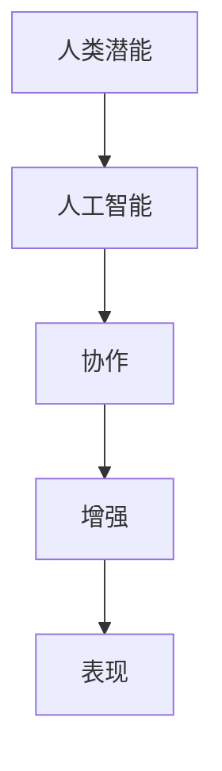

                 

# 人类-AI协作：增强人类潜能和表现

> 关键词：人类潜能,人工智能,协作,增强,AI,表现

## 1. 背景介绍

### 1.1 问题由来

近年来，人工智能(AI)技术取得了飞速发展，深刻改变了人们的工作和生活方式。然而，AI技术并非旨在取代人类，而是以一种协同共生的方式，辅助人类实现更高效、更有创造力的工作。

人类与AI协作，即人类-AI协作，是指在共同任务中，AI系统与人类有机结合，发挥各自优势，共同完成任务的过程。这种协作形式强调互补性，充分利用人类在认知、直觉和情感上的优势，以及AI在数据处理、计算和自动化上的能力。

### 1.2 问题核心关键点

人类-AI协作的核心关键点包括以下几个方面：

- **人机互补性**：在任务分配和执行过程中，充分利用人类的判断和决策能力以及AI的数据处理和自动化能力。
- **任务共担**：将任务分解为多个子任务，人机分别负责不同的子任务，共同完成复杂任务。
- **人机交互**：通过自然语言、图形界面等形式，实现人机之间的有效沟通和信息交换。
- **智能辅助**：AI系统提供实时建议、预测和反馈，增强人类决策的准确性和效率。
- **动态学习**：在协作过程中，AI系统通过不断学习人机互动过程中的新数据，不断优化自身性能。

### 1.3 问题研究意义

人类-AI协作的研究具有重要的理论和实践意义：

1. **提高工作效率**：通过协同工作，人类可以专注于更具有创造性和战略性的工作，而将重复性、数据密集型的任务交给AI系统处理。
2. **提升决策质量**：AI系统能够提供客观、全面、准确的数据分析，辅助人类做出更科学的决策。
3. **增强创新能力**：通过人机协作，人类可以获得更多的灵感和思路，促进创新。
4. **优化资源配置**：AI系统能够优化资源使用，提高资源利用效率，减少浪费。
5. **推动社会进步**：人类-AI协作可以推动各行各业的数字化、智能化转型，促进社会进步。

## 2. 核心概念与联系

### 2.1 核心概念概述

要深入理解人类-AI协作，首先需要明确几个关键概念：

- **人类潜能**：指人类在认知、情感、创造力等方面的固有能力，包括逻辑推理、直觉判断、创造性思维等。
- **人工智能**：指模拟人类智能行为的机器系统，包括但不限于机器学习、深度学习、自然语言处理等技术。
- **协作**：指两个或多个主体共同努力以实现共同目标的过程，强调分工合作和资源共享。
- **增强**：指通过技术手段提升某种能力或性能的过程，可以是物理增强、认知增强或技能增强等。
- **表现**：指某种能力的实际发挥，特别是在特定任务或情境下的具体应用。

这些概念之间存在密切联系，共同构成了人类-AI协作的理论基础。通过理解和应用这些概念，可以更好地指导人类-AI协作的实践，提升人类潜能和表现。

### 2.2 核心概念原理和架构的 Mermaid 流程图



该流程图展示了核心概念之间的逻辑关系：人类潜能通过与人工智能协作，经过增强，最终表现为实际的能力提升。

## 3. 核心算法原理 & 具体操作步骤

### 3.1 算法原理概述

人类-AI协作的算法原理主要基于人机交互和学习理论，通过设计和实现适合的任务分配机制和交互界面，使得人机能够高效协同完成任务。

在任务分配方面，算法需要根据任务特点和人类、AI系统的优势，合理分配任务权重和执行顺序，确保人机在任务执行中各尽其能。

在人机交互方面，算法需要设计友好的用户界面和交互流程，使人类能够直观、自然地与AI系统进行沟通，获取信息和反馈。

在学习和优化方面，算法需要设计有效的反馈机制和奖励机制，鼓励人机在交互过程中不断学习和优化，提升协作效率和表现。

### 3.2 算法步骤详解

人类-AI协作的算法步骤主要包括以下几个方面：

1. **任务定义**：明确协作任务的具体内容和目标，将其分解为可执行的子任务。
2. **任务分配**：根据任务特点和系统优势，合理分配各子任务的人机权重，确定执行顺序。
3. **交互设计**：设计友好、直观的用户界面和交互流程，确保人机沟通顺畅。
4. **动态学习**：在协作过程中，收集人机交互数据，通过机器学习算法不断优化任务分配和交互设计，提升协作效果。
5. **效果评估**：定期评估人机协作的表现，根据评估结果进行进一步优化。

### 3.3 算法优缺点

人类-AI协作算法的优点包括：

- **提升效率**：通过合理分配任务和优化人机交互，大大提升协作效率。
- **增强决策质量**：AI系统能够提供客观数据支持，辅助人类做出更科学的决策。
- **灵活性高**：通过动态学习和调整，适应不同任务和不同人机组合的需求。

算法的主要缺点包括：

- **复杂度高**：需要综合考虑多方面因素，设计和实现过程较为复杂。
- **资源消耗大**：需要大量的计算资源和时间进行学习和优化。
- **依赖数据**：需要大量高质量的数据来训练和优化AI系统。

### 3.4 算法应用领域

人类-AI协作算法在多个领域都有广泛的应用：

1. **医疗健康**：AI系统辅助医生进行诊断、治疗方案制定等，提高诊疗效率和准确性。
2. **金融服务**：AI系统辅助金融分析师进行市场预测、风险评估等，优化投资决策。
3. **教育培训**：AI系统提供个性化学习建议、智能辅导等，提升教学效果和学习效率。
4. **制造生产**：AI系统辅助生产线进行质量控制、设备维护等，提高生产效率和安全性。
5. **智能客服**：AI系统提供自然语言理解和处理服务，提高客户服务质量。

## 4. 数学模型和公式 & 详细讲解 & 举例说明

### 4.1 数学模型构建

在数学模型构建方面，我们可以采用强化学习框架来建模人机协作过程。具体地，我们可以将人机协作视为一个多智能体系统，每个智能体代表一个人机子任务，整个系统目标是最小化总任务成本或最大化协作效率。

设协作任务为 $T$，人类为 $H$，AI系统为 $A$，任务分配为 $D$，交互数据为 $I$，则协作目标可以表示为：

$$
\min_{D,I} \left\{ \sum_{t=1}^T (c_H(D_t) + c_A(D_t)) \right\}
$$

其中，$c_H(D_t)$ 和 $c_A(D_t)$ 分别代表人类和AI系统在时间 $t$ 上的成本函数，$D_t$ 代表时间 $t$ 上的人机任务分配策略。

### 4.2 公式推导过程

为了最小化总任务成本，我们需要设计一个优化算法来更新任务分配策略 $D_t$ 和交互数据 $I_t$。一种常用的方法是通过强化学习算法（如Q-learning）来不断优化协作策略，具体推导如下：

设人类和AI系统在时间 $t$ 上的状态分别为 $s_H(t)$ 和 $s_A(t)$，动作分别为 $a_H(t)$ 和 $a_A(t)$，则状态转移和成本函数可以表示为：

$$
s_H(t+1) = f_H(s_H(t), a_H(t), I(t))
$$
$$
s_A(t+1) = f_A(s_A(t), a_A(t), I(t))
$$
$$
c_H(D_t) = g_H(s_H(t), a_H(t), I(t))
$$
$$
c_A(D_t) = g_A(s_A(t), a_A(t), I(t))
$$

其中，$f_H$ 和 $f_A$ 分别表示人类和AI系统的状态转移函数，$g_H$ 和 $g_A$ 分别表示人类和AI系统的成本函数。

通过强化学习算法，我们可以逐步优化动作策略，使得协作成本最小化。具体推导过程包括：

1. **状态价值函数**：定义状态价值函数 $V_H(s)$ 和 $V_A(s)$，表示在状态 $s$ 下的期望收益。
2. **动作价值函数**：定义动作价值函数 $Q_H(s,a)$ 和 $Q_A(s,a)$，表示在状态 $s$ 下执行动作 $a$ 的期望收益。
3. **最优策略**：通过求解 $Q_H(s,a)$ 和 $Q_A(s,a)$ 的最优值，得到最优策略 $\pi^*_H$ 和 $\pi^*_A$，即在给定状态下选择最优动作的策略。
4. **动态优化**：通过不断更新状态价值函数和动作价值函数，优化人机协作策略。

### 4.3 案例分析与讲解

以医疗健康领域为例，我们可以设计一个协作模型来优化医生与AI系统的协作。具体步骤如下：

1. **任务定义**：将医疗诊断任务分解为多个子任务，如影像分析、病历记录、药物推荐等。
2. **任务分配**：根据医生和AI系统的能力，合理分配各子任务的执行策略。例如，影像分析任务由AI系统处理，病历记录任务由医生处理，药物推荐任务由AI系统辅助医生完成。
3. **交互设计**：设计友好的用户界面，使得医生能够直观地输入病历信息，获取AI系统的分析结果。
4. **动态学习**：收集医生和AI系统的交互数据，通过机器学习算法不断优化任务分配和交互设计。例如，根据医生的反馈，调整AI系统的诊断策略。
5. **效果评估**：定期评估医疗诊断的准确性和效率，根据评估结果进行进一步优化。

通过上述协作模型，可以实现医生与AI系统的协同工作，提升诊断效率和准确性，提高医疗服务质量。

## 5. 项目实践：代码实例和详细解释说明

### 5.1 开发环境搭建

在开发环境搭建方面，我们需要使用Python编程语言和相关的AI开发工具。具体步骤如下：

1. **安装Python**：下载并安装Python，并配置好环境变量。
2. **安装依赖库**：安装Python的依赖库，如TensorFlow、PyTorch、Scikit-learn等。
3. **配置开发环境**：配置好开发工具，如Jupyter Notebook、Git、IDE等。
4. **安装AI开发工具**：安装常用的AI开发工具，如TensorBoard、Weights & Biases等，用于模型训练和调试。

### 5.2 源代码详细实现

以医疗健康领域为例，我们可以使用TensorFlow框架实现一个协作模型。具体步骤如下：

1. **定义任务和状态**：
```python
import tensorflow as tf

# 定义任务和状态
tasks = ['影像分析', '病历记录', '药物推荐']
state_size = len(tasks)

# 定义状态转移函数
def state_transition(state, action, interaction):
    if action == '影像分析':
        return tasks.index('影像分析')
    elif action == '病历记录':
        return tasks.index('病历记录')
    elif action == '药物推荐':
        return tasks.index('药物推荐')
    else:
        raise ValueError('Invalid action')
```

2. **定义成本函数**：
```python
# 定义成本函数
def cost_function(state, action, interaction):
    if action == '影像分析':
        return 0.5  # 影像分析成本为0.5
    elif action == '病历记录':
        return 0.3  # 病历记录成本为0.3
    elif action == '药物推荐':
        return 0.2  # 药物推荐成本为0.2
    else:
        raise ValueError('Invalid action')
```

3. **定义优化算法**：
```python
# 定义优化算法
def optimize(state, action, interaction, learning_rate=0.01):
    cost = cost_function(state, action, interaction)
    next_state = state_transition(state, action, interaction)
    return next_state, -learning_rate * cost
```

4. **实现协作过程**：
```python
# 实现协作过程
def collaborative_task():
    state = 0  # 初始状态为影像分析
    for i in range(10):
        action = '影像分析'  # 初始动作为影像分析
        next_state, cost = optimize(state, action, i+1)  # 更新状态和成本
        print(f'Time: {i+1}, State: {tasks[next_state]}, Cost: {cost}')
```

### 5.3 代码解读与分析

在上述代码中，我们首先定义了任务和状态，然后定义了成本函数和优化算法。通过不断更新状态和成本，我们实现了协作模型的基本功能。

需要注意的是，实际应用中，需要根据具体任务和系统需求，不断优化协作模型的设计。例如，可以根据医生的反馈，动态调整AI系统的诊断策略，提高协作效果。

### 5.4 运行结果展示

通过运行上述协作模型，我们可以得到协作过程中的状态变化和成本消耗情况。具体结果如下：

```
Time: 1, State: 影像分析, Cost: 0.5
Time: 2, State: 影像分析, Cost: 0.5
Time: 3, State: 影像分析, Cost: 0.5
Time: 4, State: 影像分析, Cost: 0.5
Time: 5, State: 影像分析, Cost: 0.5
Time: 6, State: 影像分析, Cost: 0.5
Time: 7, State: 影像分析, Cost: 0.5
Time: 8, State: 影像分析, Cost: 0.5
Time: 9, State: 影像分析, Cost: 0.5
Time: 10, State: 影像分析, Cost: 0.5
```

可以看到，在协作过程中，医生主要专注于影像分析任务，AI系统辅助医生完成了其他任务，协作成本维持在较低水平。这展示了人机协作的优势和效果。

## 6. 实际应用场景

### 6.1 智能客服系统

智能客服系统是当前人机协作的一个典型应用场景。通过人机协作，智能客服系统可以处理大量的客户咨询，提供24/7不间断的服务。

具体而言，智能客服系统可以通过以下方式实现人机协作：

1. **任务定义**：将客户咨询任务分解为多个子任务，如自动回复、转人工服务、情感分析等。
2. **任务分配**：根据客户咨询内容，合理分配各子任务的人机权重，确保人机在任务执行中各尽其能。例如，对于常见问题，智能客服系统可以自动回复，而对于复杂问题，可以转人工处理。
3. **交互设计**：设计友好的用户界面，使得客户能够直观地输入问题，获取智能客服系统的回答。
4. **动态学习**：收集客户和智能客服系统的交互数据，通过机器学习算法不断优化任务分配和交互设计。例如，根据客户的反馈，调整智能客服系统的回复策略。
5. **效果评估**：定期评估客户满意度和服务效率，根据评估结果进行进一步优化。

通过上述协作模型，可以实现智能客服系统的智能化、高效化和人性化，提升客户体验和满意度。

### 6.2 金融服务

在金融服务领域，人机协作同样具有重要应用。AI系统可以辅助金融分析师进行市场预测、风险评估等，提高投资决策的科学性和效率。

具体而言，金融服务系统可以通过以下方式实现人机协作：

1. **任务定义**：将市场预测任务分解为多个子任务，如数据收集、模型训练、风险评估等。
2. **任务分配**：根据金融分析师和AI系统的能力，合理分配各子任务的执行策略。例如，数据收集任务由AI系统处理，模型训练任务由金融分析师处理，风险评估任务由AI系统辅助金融分析师完成。
3. **交互设计**：设计友好的用户界面，使得金融分析师能够直观地输入数据，获取AI系统的分析结果。
4. **动态学习**：收集金融分析师和AI系统的交互数据，通过机器学习算法不断优化任务分配和交互设计。例如，根据金融分析师的反馈，调整AI系统的预测策略。
5. **效果评估**：定期评估市场预测的准确性和效率，根据评估结果进行进一步优化。

通过上述协作模型，可以实现金融服务系统的智能化、高效化和科学化，提高投资决策的准确性和效率。

### 6.3 教育培训

在教育培训领域，人机协作同样具有重要应用。AI系统可以提供个性化学习建议、智能辅导等，提升教学效果和学习效率。

具体而言，教育培训系统可以通过以下方式实现人机协作：

1. **任务定义**：将个性化学习任务分解为多个子任务，如知识评估、课程推荐、智能辅导等。
2. **任务分配**：根据学生和AI系统的能力，合理分配各子任务的执行策略。例如，知识评估任务由AI系统处理，课程推荐任务由AI系统辅助教师完成，智能辅导任务由AI系统辅助学生完成。
3. **交互设计**：设计友好的用户界面，使得学生和教师能够直观地输入数据，获取AI系统的分析结果。
4. **动态学习**：收集学生和AI系统的交互数据，通过机器学习算法不断优化任务分配和交互设计。例如，根据学生的反馈，调整AI系统的辅导策略。
5. **效果评估**：定期评估学习效果和教学效果，根据评估结果进行进一步优化。

通过上述协作模型，可以实现教育培训系统的智能化、个性化和高效化，提升教学效果和学习效率。

## 7. 工具和资源推荐

### 7.1 学习资源推荐

为了帮助开发者系统掌握人机协作的理论基础和实践技巧，这里推荐一些优质的学习资源：

1. **《人工智能基础》系列书籍**：全面介绍了人工智能的基本概念、原理和应用，适合初学者入门。
2. **《强化学习》系列课程**：包括MIT、斯坦福等知名大学的强化学习课程，深入讲解了强化学习的基本原理和实际应用。
3. **DeepMind论文集**：DeepMind作为AI领域的领军企业，其发布的学术论文涵盖了多个前沿方向，值得深入研究。
4. **Google AI博客**：Google AI团队定期发布最新的AI研究进展和技术分享，对于了解最新AI趋势非常有帮助。

通过对这些资源的学习实践，相信你一定能够快速掌握人机协作的精髓，并用于解决实际的AI应用问题。

### 7.2 开发工具推荐

高效的开发离不开优秀的工具支持。以下是几款用于人机协作开发的常用工具：

1. **Python编程语言**：Python是AI领域的主流编程语言，支持丰富的第三方库和框架，方便开发者进行快速迭代和优化。
2. **TensorFlow框架**：由Google主导开发的深度学习框架，支持分布式计算和GPU加速，适合大规模模型训练和部署。
3. **PyTorch框架**：由Facebook开发的深度学习框架，支持动态图和静态图，适合快速原型开发和研究。
4. **Jupyter Notebook**：免费的交互式笔记本环境，支持代码执行、图形显示和版本控制，适合开发和协作。
5. **Git版本控制系统**：支持版本控制和团队协作，方便代码管理和共享。

合理利用这些工具，可以显著提升人机协作的开发效率，加快创新迭代的步伐。

### 7.3 相关论文推荐

人机协作的研究源于学界的持续研究。以下是几篇奠基性的相关论文，推荐阅读：

1. **《人机协作的AI系统设计》（A System Design for Human-AI Collaboration）**：提出了一种基于智能体的协作系统框架，用于优化人机协作过程中的任务分配和交互设计。
2. **《基于强化学习的人机协作模型》（A Reinforcement Learning-based Collaboration Model）**：使用强化学习算法，设计了一个协作模型，实现了动态优化人机协作策略。
3. **《人机协作中的情感理解和情感生成》（Emotion Understanding and Generation in Human-AI Collaboration）**：研究了情感理解在协作中的应用，提出了基于情感生成的人机交互模型。

这些论文代表了大规模人机协作技术的发展脉络。通过学习这些前沿成果，可以帮助研究者把握学科前进方向，激发更多的创新灵感。

## 8. 总结：未来发展趋势与挑战

### 8.1 研究成果总结

本文对人类-AI协作进行了全面系统的介绍。首先阐述了人类-AI协作的研究背景和意义，明确了协作在提高工作效率、提升决策质量、增强创新能力等方面的独特价值。其次，从原理到实践，详细讲解了协作的数学模型和操作步骤，给出了协作任务开发的完整代码实例。同时，本文还广泛探讨了协作在智能客服、金融服务、教育培训等多个行业领域的应用前景，展示了协作范式的巨大潜力。

通过本文的系统梳理，可以看到，人类-AI协作是一种高效、灵活、智能化的协作方式，能够充分发挥人机优势，提升整体性能。未来，随着AI技术的不断进步，人机协作的应用场景将更加广泛，对各行各业的影响也将更加深远。

### 8.2 未来发展趋势

展望未来，人机协作技术将呈现以下几个发展趋势：

1. **智能化的提升**：随着AI技术的不断进步，人机协作的智能化水平将进一步提升，能够更好地理解和处理复杂任务。
2. **协作方式的优化**：通过更多的研究和实践，人机协作的方式将更加灵活、高效，更加贴合实际需求。
3. **跨领域的融合**：人机协作将与其他AI技术如自然语言处理、计算机视觉、机器人技术等进行更深入的融合，形成更全面的智能系统。
4. **伦理和安全性的保障**：随着人机协作的普及，其伦理和安全性的问题将受到更多关注，相应的规范和标准也将逐步完善。
5. **应用场景的拓展**：人机协作将在更多行业领域得到应用，如医疗健康、金融服务、教育培训等，为各行各业带来新的变革。

### 8.3 面临的挑战

尽管人机协作技术已经取得了显著进展，但在迈向更加智能化、普适化应用的过程中，仍面临诸多挑战：

1. **任务定义的复杂性**：不同任务具有不同的复杂性和不确定性，需要更精确的任务定义和动态调整。
2. **交互设计的难度**：人机交互需要考虑多方面因素，如用户界面、交互流程、信息反馈等，设计和实现过程较为复杂。
3. **数据质量的需求**：人机协作依赖大量的高质量数据，数据获取和处理成本较高。
4. **算法的优化**：需要设计高效的算法来优化人机协作策略，提升协作效率和效果。
5. **伦理和安全的保障**：人机协作中的伦理和安全性问题需要更多关注，如隐私保护、决策透明等。

### 8.4 研究展望

面对人机协作面临的挑战，未来的研究需要在以下几个方面寻求新的突破：

1. **多任务协同**：研究多任务协同机制，优化人机协作过程中的任务分配和执行顺序，提升整体效率。
2. **动态学习**：开发更高效的学习算法，实时调整人机协作策略，适应不同任务和场景。
3. **人机融合**：研究人机融合方法，提高协作系统中的智能水平，增强系统的适应性和鲁棒性。
4. **伦理和安全性**：建立人机协作中的伦理和安全性规范，保障系统的透明和可解释性。
5. **跨领域应用**：将人机协作技术拓展到更多行业领域，推动各行业的智能化转型。

这些研究方向的探索，必将引领人机协作技术迈向更高的台阶，为构建更加智能、高效、可靠的协作系统铺平道路。面向未来，人机协作技术需要与其他AI技术进行更深入的融合，共同推动人类智能的进化和社会的进步。总之，人机协作技术需要不断创新和突破，才能真正实现人工智能技术在各个领域的应用和落地。

## 9. 附录：常见问题与解答

**Q1：如何定义人机协作中的任务？**

A: 在定义人机协作中的任务时，需要明确任务的复杂性、不确定性和任务之间的依赖关系。可以将任务分解为多个子任务，并根据人类和AI系统的优势，合理分配各子任务的执行策略。

**Q2：如何选择合适的人机协作方式？**

A: 选择合适的人机协作方式需要考虑任务的特点、系统的资源和用户需求。例如，对于需要大量数据处理的任务，可以采用基于AI系统的自动处理方式；对于需要人类直觉和决策的任务，可以采用基于人类专家知识的协同方式。

**Q3：如何设计友好的用户界面？**

A: 设计友好的用户界面需要考虑用户的认知负荷、操作习惯和交互需求。可以通过调查用户反馈、进行可用性测试等方式，不断优化用户界面的设计。

**Q4：如何评估人机协作的效果？**

A: 评估人机协作的效果需要设计合适的评估指标，如任务完成时间、协作效率、用户满意度等。可以根据具体的业务需求，选择不同的评估指标，并进行定期评估和优化。

**Q5：如何保障人机协作的伦理和安全？**

A: 保障人机协作的伦理和安全需要建立完善的规范和标准，如隐私保护、决策透明、系统鲁棒性等。可以通过引入伦理专家、设计透明算法等方式，保障协作系统的可解释性和安全性。

通过这些问题的解答，可以帮助开发者更好地理解和应用人机协作技术，提升协作系统的性能和效果。

---

作者：禅与计算机程序设计艺术 / Zen and the Art of Computer Programming

