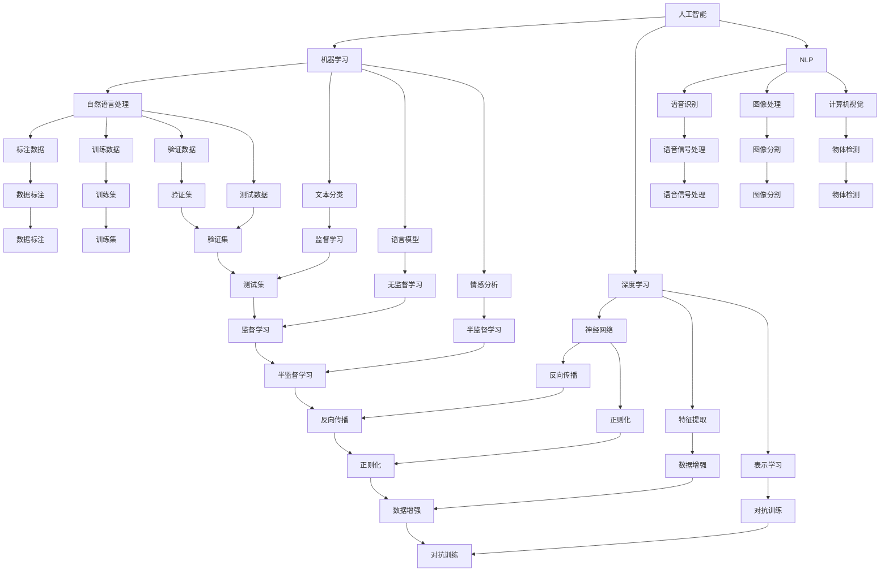

                 

# 人类与 AI 的关系：共存与合作

> 关键词：人工智能,机器学习,深度学习,自然语言处理,人类与AI,伦理,合作,共存,社会影响

## 1. 背景介绍

在过去的几十年里，人工智能（AI）技术取得了突飞猛进的发展。从最早的符号推理，到机器学习，再到深度学习的蓬勃兴起，AI技术在多个领域展现了巨大的潜力。然而，随着AI技术逐渐渗透到人类的生活方方面面，其对人类社会的影响也引起了广泛的讨论和关注。本文将从背景介绍入手，探讨人类与AI之间的关系，分析两者之间的共存与合作。

### 1.1 人工智能的发展历程

人工智能的起源可以追溯到20世纪50年代。早期的AI研究主要集中在符号逻辑和推理上，通过构建规则和逻辑进行问题求解。然而，随着计算能力的提升，基于规则的AI系统逐渐暴露出灵活性和适应性不足的问题。

1986年，BP神经网络的提出，标志着深度学习时代的到来。深度学习通过多层神经网络的非线性变换，可以从大规模数据中学习到复杂的特征表示，显著提升了AI系统的泛化能力。深度学习的成功也引发了机器学习的广泛应用，涵盖计算机视觉、自然语言处理、语音识别等领域。

### 1.2 人工智能的现状与挑战

目前，AI技术在医疗、金融、交通、教育等多个领域展现了卓越的潜力。然而，AI技术的发展也面临着诸多挑战：

- **数据依赖**：AI系统通常依赖大规模标注数据进行训练，数据质量和数量直接影响模型的性能。
- **算法黑箱**：深度学习模型通常被视为“黑盒”，难以解释其内部决策过程，缺乏透明性和可解释性。
- **伦理问题**：AI在决策过程中可能存在偏见和歧视，引发伦理和社会问题。
- **安全与隐私**：AI系统在处理敏感数据时可能面临数据泄露和隐私侵害的风险。

## 2. 核心概念与联系

### 2.1 核心概念概述

为了更好地理解人类与AI之间的关系，本节将介绍几个关键概念：

- **人工智能（Artificial Intelligence, AI）**：通过算法和计算能力模拟人类智能的技术。主要包括机器学习、深度学习、自然语言处理（NLP）、计算机视觉等子领域。
- **机器学习（Machine Learning, ML）**：使计算机通过数据学习模型的算法和技术，通过训练数据自动提升性能。
- **深度学习（Deep Learning, DL）**：一种机器学习的子领域，通过多层神经网络进行特征提取和表示学习。
- **自然语言处理（Natural Language Processing, NLP）**：使计算机理解和处理人类语言的技术，涵盖文本分类、语言模型、情感分析等任务。
- **伦理（Ethics）**：研究AI技术应用中的道德、法律和社会问题，确保技术应用的合理性和合法性。
- **合作（Cooperation）**：人类与AI系统在任务执行和问题解决中的协同工作。
- **共存（Coexistence）**：人类与AI系统在社会生活和工作中的和谐共处。

这些概念之间的逻辑关系可以通过以下Mermaid流程图来展示：



这个流程图展示了AI技术的主要组成和各个子领域之间的联系。

## 3. 核心算法原理 & 具体操作步骤
### 3.1 算法原理概述

人工智能的核心算法原理包括机器学习和深度学习。这些算法通过数据驱动的方式，使计算机系统能够自动提升性能，并在特定任务上达到人类水平甚至超越。

### 3.2 算法步骤详解

机器学习和深度学习的算法步骤通常包括：

1. **数据准备**：收集、清洗和标注训练数据，确保数据的质量和多样性。
2. **模型设计**：选择或设计合适的模型架构，如神经网络、决策树、支持向量机等。
3. **模型训练**：通过训练数据对模型进行迭代优化，最小化损失函数。
4. **模型评估**：使用验证数据评估模型性能，调整模型参数。
5. **模型部署**：将训练好的模型部署到实际应用场景中，进行推理和预测。

### 3.3 算法优缺点

机器学习和深度学习具有以下优点：

- **自动化**：能够自动从数据中学习模型，减少人工干预。
- **高效性**：在特定任务上，通常能够取得比传统方法更高的精度和性能。
- **可扩展性**：模型规模可以随着计算资源的增加而扩大，适应复杂的任务需求。

然而，这些算法也存在一些缺点：

- **数据依赖**：需要大量高质量的标注数据，数据质量直接影响模型性能。
- **计算资源需求高**：训练和推理需要大量的计算资源，如GPU/TPU。
- **可解释性差**：深度学习模型通常被视为“黑盒”，难以解释其内部决策过程。

### 3.4 算法应用领域

人工智能技术已经广泛应用于多个领域，包括：

- **医疗**：通过自然语言处理技术，自动分析病历和医学文献，辅助医生诊断和治疗。
- **金融**：使用机器学习进行信用评估、风险预测、股票交易等。
- **教育**：通过自然语言处理技术，自动评估学生作业和提供个性化学习建议。
- **智能制造**：使用机器视觉和深度学习技术，进行质量检测、故障诊断和生产调度。
- **自动驾驶**：通过计算机视觉和深度学习技术，实现车辆自主导航和避障。

## 4. 数学模型和公式 & 详细讲解 & 举例说明

### 4.1 数学模型构建

本节将使用数学语言对AI算法的核心模型进行详细讲解。

以深度学习中的卷积神经网络（Convolutional Neural Network, CNN）为例，构建数学模型。

设输入图像为 $x \in \mathbb{R}^{h \times w \times c}$，其中 $h$ 和 $w$ 为图像的高度和宽度，$c$ 为通道数。卷积神经网络的输出层为 $y \in \mathbb{R}^{n}$，其中 $n$ 为输出类别数。

定义卷积核为 $w \in \mathbb{R}^{k \times k \times c}$，其中 $k$ 为卷积核大小。卷积操作可以表示为：

$$
y = \sigma(\sum_{i=1}^{n}w_i \ast x_i)
$$

其中 $\sigma$ 为激活函数，$\ast$ 为卷积操作。

定义损失函数为交叉熵损失，可以表示为：

$$
L(y, \hat{y}) = -\frac{1}{n}\sum_{i=1}^{n}y_i \log \hat{y}_i
$$

在训练过程中，通过反向传播算法，计算损失函数对参数 $w$ 的梯度，并使用梯度下降等优化算法更新参数。

### 4.2 公式推导过程

以反向传播算法为例，推导其公式和过程。

反向传播算法的核心是链式法则，将损失函数对模型参数的梯度传递到每一层。假设模型的输出为 $y$，输入为 $x$，定义损失函数为 $L(y, \hat{y})$，则反向传播过程如下：

1. **前向传播**：计算模型输出 $y = f(x, \theta)$，其中 $\theta$ 为模型参数。
2. **计算梯度**：根据损失函数对输出 $y$ 求导，得到梯度 $\nabla L(y, \hat{y})$。
3. **反向传播**：从输出层开始，逐步计算每个参数的梯度。具体步骤为：
   - 计算输出层每个神经元的梯度 $\nabla L(y, \hat{y})$。
   - 将梯度向后传递到前一层，计算每个神经元的梯度 $\nabla L'(y, \hat{y})$。
   - 重复上述步骤，直到计算出所有参数的梯度。
4. **参数更新**：使用梯度下降等优化算法更新模型参数，完成一次迭代。

通过反向传播算法，可以将损失函数对模型参数的梯度高效计算出来，进行参数更新。

### 4.3 案例分析与讲解

以自然语言处理中的文本分类为例，展示机器学习算法的应用。

文本分类任务通常包括收集和预处理数据，选择和训练分类模型，评估和调整模型参数等步骤。

1. **数据准备**：收集标注好的文本数据，将文本转换为向量表示。
2. **模型选择**：选择适当的分类模型，如朴素贝叶斯、支持向量机、深度神经网络等。
3. **模型训练**：使用标注数据训练模型，调整模型参数，最小化损失函数。
4. **模型评估**：使用验证数据评估模型性能，调整模型参数。
5. **模型部署**：将训练好的模型部署到实际应用场景中，进行文本分类和预测。

## 5. 项目实践：代码实例和详细解释说明

### 5.1 开发环境搭建

在进行AI项目实践前，需要准备相应的开发环境。以下是Python环境下使用PyTorch进行深度学习开发的配置步骤：

1. 安装Anaconda：从官网下载并安装Anaconda，用于创建独立的Python环境。
2. 创建并激活虚拟环境：
```bash
conda create -n pytorch-env python=3.8 
conda activate pytorch-env
```
3. 安装PyTorch：根据CUDA版本，从官网获取对应的安装命令。例如：
```bash
conda install pytorch torchvision torchaudio cudatoolkit=11.1 -c pytorch -c conda-forge
```
4. 安装TensorFlow：如果需要进行TensorFlow的开发，可以使用以下命令：
```bash
pip install tensorflow
```
5. 安装TensorBoard：用于可视化训练过程和模型性能，可以同时运行TensorFlow和PyTorch项目。

### 5.2 源代码详细实现

下面以深度学习中的卷积神经网络（CNN）为例，展示PyTorch代码实现。

首先，定义CNN模型：

```python
import torch.nn as nn
import torch.nn.functional as F

class CNN(nn.Module):
    def __init__(self, in_channels, num_classes):
        super(CNN, self).__init__()
        self.conv1 = nn.Conv2d(in_channels, 32, kernel_size=3, stride=1, padding=1)
        self.relu1 = nn.ReLU(inplace=True)
        self.pool1 = nn.MaxPool2d(kernel_size=2, stride=2)
        self.conv2 = nn.Conv2d(32, 64, kernel_size=3, stride=1, padding=1)
        self.relu2 = nn.ReLU(inplace=True)
        self.pool2 = nn.MaxPool2d(kernel_size=2, stride=2)
        self.fc1 = nn.Linear(64 * 14 * 14, 256)
        self.relu3 = nn.ReLU(inplace=True)
        self.fc2 = nn.Linear(256, num_classes)
    
    def forward(self, x):
        x = self.conv1(x)
        x = self.relu1(x)
        x = self.pool1(x)
        x = self.conv2(x)
        x = self.relu2(x)
        x = self.pool2(x)
        x = x.view(-1, 64 * 7 * 7)
        x = self.fc1(x)
        x = self.relu3(x)
        x = self.fc2(x)
        return F.softmax(x, dim=1)
```

然后，定义训练和评估函数：

```python
from torch.utils.data import DataLoader
from torchvision import datasets, transforms

class MNISTDataset(datasets.MNIST):
    def __init__(self, root, train=True, transform=None):
        super(MNISTDataset, self).__init__(root, train, transform)
        self.train = train

    def __getitem__(self, index):
        img, target = super(MNISTDataset, self).__getitem__(index)
        if self.train:
            img = transforms.ToTensor()(img)
            target = transforms.ToTensor()(target)
        return img, target

train_dataset = MNISTDataset(root='./mnist', train=True, transform=transforms.ToTensor())
test_dataset = MNISTDataset(root='./mnist', train=False, transform=transforms.ToTensor())

train_loader = DataLoader(train_dataset, batch_size=64, shuffle=True)
test_loader = DataLoader(test_dataset, batch_size=64, shuffle=False)

device = torch.device('cuda' if torch.cuda.is_available() else 'cpu')
model = CNN(1, 10).to(device)
criterion = nn.CrossEntropyLoss()
optimizer = torch.optim.SGD(model.parameters(), lr=0.01, momentum=0.9)

def train_epoch(model, data_loader, optimizer, criterion):
    model.train()
    for batch_idx, (data, target) in enumerate(data_loader):
        data, target = data.to(device), target.to(device)
        optimizer.zero_grad()
        output = model(data)
        loss = criterion(output, target)
        loss.backward()
        optimizer.step()
        if batch_idx % 100 == 0:
            print('Train Epoch: {} [{}/{} ({:.0f}%)]\tLoss: {:.6f}'.format(
                epoch, batch_idx * len(data), len(train_loader.dataset),
                100. * batch_idx / len(train_loader), loss.item()))

def evaluate(model, data_loader, criterion):
    model.eval()
    test_loss = 0
    correct = 0
    with torch.no_grad():
        for data, target in data_loader:
            data, target = data.to(device), target.to(device)
            output = model(data)
            test_loss += criterion(output, target).item()
            pred = output.argmax(dim=1, keepdim=True)
            correct += pred.eq(target.view_as(pred)).sum().item()

    print('\nTest set: Average loss: {:.4f}, Accuracy: {}/{} ({:.0f}%)\n'.format(
        test_loss / len(test_loader), correct, len(test_loader.dataset),
        100. * correct / len(test_loader.dataset)))

def main():
    for epoch in range(10):
        train_epoch(model, train_loader, optimizer, criterion)
        evaluate(model, test_loader, criterion)
```

通过上述代码，可以构建并训练一个简单的卷积神经网络模型，对MNIST数据集进行分类。可以看到，使用PyTorch进行深度学习开发非常方便和高效。

### 5.3 代码解读与分析

让我们再详细解读一下关键代码的实现细节：

**CNN模型类**：
- `__init__`方法：定义卷积层、激活函数和池化层等组件。
- `forward`方法：定义前向传播过程，对输入数据进行卷积、池化和全连接操作，最终输出分类结果。

**数据准备和加载**：
- `MNISTDataset类`：继承自`datasets.MNIST`，实现数据预处理和加载。
- `transforms.ToTensor()`：将PIL图像转换为Tensor格式，方便模型输入。

**训练和评估函数**：
- `train_epoch`方法：定义一个epoch的训练过程，使用SGD优化器进行参数更新，并在每100个batch后输出训练日志。
- `evaluate`方法：定义模型在测试集上的评估过程，计算准确率和损失。
- `main`方法：训练和评估整个模型，并输出结果。

**训练流程**：
- 循环迭代10个epoch，在每个epoch中训练模型，并在测试集上评估模型性能。

可以看到，使用PyTorch进行深度学习开发非常方便和高效。开发者可以将更多精力放在模型设计和数据处理等核心问题上，而不必过多关注底层的实现细节。

## 6. 实际应用场景

### 6.1 智能制造

在智能制造领域，深度学习和计算机视觉技术被广泛应用于质量检测、故障诊断和生产调度。通过采集生产线上的图像数据，使用卷积神经网络进行特征提取和分类，可以实现自动化检测和决策。例如，在汽车制造中，可以使用计算机视觉技术检测零件的缺陷和损坏，避免不合格品进入下一道工序，从而提升生产效率和产品质量。

### 6.2 金融风控

在金融风控领域，深度学习和自然语言处理技术被广泛应用于信用评估、风险预测和欺诈检测。通过收集和分析用户的社交媒体、财务记录等数据，使用深度学习模型进行特征提取和分类，可以预测用户的信用风险和欺诈行为。例如，银行可以使用自然语言处理技术分析用户的贷款申请文档，判断其还款能力和还款意愿，从而降低贷款违约率。

### 6.3 智能客服

在智能客服领域，自然语言处理技术被广泛应用于客户咨询和问题解决。通过收集和标注大量的客户咨询数据，使用深度学习模型进行训练，可以实现自动回答客户问题。例如，银行可以使用自然语言处理技术分析客户的咨询记录，提供个性化的服务和建议，提升客户满意度和忠诚度。

### 6.4 未来应用展望

随着深度学习和计算机视觉技术的不断发展，AI技术将在更多领域得到应用，为各行各业带来变革性影响。

在智慧医疗领域，深度学习和自然语言处理技术被广泛应用于医学影像分析、疾病诊断和药物研发。通过收集和分析医学影像和病历数据，使用深度学习模型进行特征提取和分类，可以辅助医生进行诊断和治疗。例如，医院可以使用计算机视觉技术分析医学影像，判断病灶和异常情况，从而提高诊断的准确率和效率。

在智能交通领域，深度学习和计算机视觉技术被广泛应用于自动驾驶和交通监控。通过收集和分析道路交通数据，使用深度学习模型进行特征提取和分类，可以实现自动驾驶和交通流量监控。例如，自动驾驶汽车可以使用计算机视觉技术识别道路标志和障碍物，避免交通事故和交通拥堵，从而提升交通安全和效率。

## 7. 工具和资源推荐

### 7.1 学习资源推荐

为了帮助开发者系统掌握深度学习、自然语言处理等技术，这里推荐一些优质的学习资源：

1. 《深度学习》（Ian Goodfellow, Yoshua Bengio, Aaron Courville著）：深度学习的经典教材，系统介绍了深度学习的原理和应用。
2. 《自然语言处理综论》（Daniel Jurafsky, James H. Martin著）：自然语言处理的经典教材，涵盖语言建模、信息抽取、机器翻译等任务。
3. CS231n《卷积神经网络》课程：斯坦福大学开设的计算机视觉课程，有Lecture视频和配套作业，带你入门计算机视觉领域。
4. CS224n《自然语言处理》课程：斯坦福大学开设的自然语言处理课程，有Lecture视频和配套作业，带你入门自然语言处理领域。
5. TensorFlow官方文档：TensorFlow的官方文档，提供了丰富的示例和API参考，是TensorFlow开发者的必备资料。
6. PyTorch官方文档：PyTorch的官方文档，提供了丰富的示例和API参考，是PyTorch开发者的必备资料。

通过对这些资源的学习实践，相信你一定能够快速掌握深度学习和自然语言处理的技术。

### 7.2 开发工具推荐

高效的开发离不开优秀的工具支持。以下是几款用于深度学习和自然语言处理开发的常用工具：

1. PyTorch：基于Python的开源深度学习框架，灵活动态的计算图，适合快速迭代研究。
2. TensorFlow：由Google主导开发的开源深度学习框架，生产部署方便，适合大规模工程应用。
3. Keras：基于TensorFlow的高级神经网络API，简单易用，适合快速原型开发。
4. NLTK：Python自然语言处理库，提供了丰富的文本处理和语言分析功能。
5. spaCy：Python自然语言处理库，提供了高性能的文本处理和语言分析功能。
6. Stanford CoreNLP：Java自然语言处理工具包，提供了丰富的文本处理和语言分析功能。

合理利用这些工具，可以显著提升深度学习和自然语言处理项目的开发效率，加快创新迭代的步伐。

### 7.3 相关论文推荐

深度学习和自然语言处理技术的不断发展源于学界的持续研究。以下是几篇奠基性的相关论文，推荐阅读：

1. AlexNet：ImageNet大规模视觉识别竞赛的冠军模型，标志着深度学习在计算机视觉领域的突破。
2. RNN：递归神经网络，通过时间序列建模，广泛应用于自然语言处理任务。
3. Transformer：谷歌提出的基于自注意力机制的神经网络架构，广泛应用于自然语言处理任务。
4. BERT：谷歌提出的预训练语言模型，通过掩码语言模型和下一句预测任务进行预训练，广泛应用于自然语言处理任务。
5. GPT：OpenAI提出的基于自回归模型的语言模型，广泛应用于自然语言生成和理解任务。

这些论文代表了大语言模型和微调技术的发展脉络。通过学习这些前沿成果，可以帮助研究者把握学科前进方向，激发更多的创新灵感。

## 8. 总结：未来发展趋势与挑战

### 8.1 总结

本文对深度学习和自然语言处理技术在人类与AI共存与合作中的应用进行了全面系统的介绍。首先探讨了AI技术的背景和现状，明确了AI技术在各领域的应用前景。其次，从算法原理和具体操作步骤入手，详细讲解了深度学习和自然语言处理模型的构建和训练。最后，结合实际应用场景，分析了AI技术的未来发展趋势和面临的挑战。

通过本文的系统梳理，可以看到，深度学习和自然语言处理技术已经成为推动各行各业发展的重要动力。AI技术在提升效率、降低成本、优化决策等方面的潜力，使得其在医疗、金融、制造等多个领域得以广泛应用。然而，AI技术的发展也面临着数据依赖、算法复杂性、伦理问题等诸多挑战。未来，需要在算法创新、数据治理、伦理监管等方面进行更加深入的研究和探索，才能实现AI技术的可持续发展和应用。

### 8.2 未来发展趋势

展望未来，深度学习和自然语言处理技术将呈现以下几个发展趋势：

1. **模型规模增大**：随着计算资源的增加，深度学习模型的规模将进一步增大，能够处理更加复杂和精细的任务。
2. **任务多样化**：深度学习和自然语言处理技术将应用到更多领域，涵盖医疗、金融、制造、教育等多个行业。
3. **算法多样化**：深度学习和自然语言处理算法将更加多样化，结合符号计算和神经网络的优势，提升模型的性能和可解释性。
4. **数据来源丰富**：深度学习和自然语言处理技术将结合多模态数据，如文本、图像、语音、视频等，提升模型的泛化能力和适应性。
5. **实时性增强**：深度学习和自然语言处理技术将更加实时化，能够实时处理和响应用户需求，提升用户体验。

### 8.3 面临的挑战

尽管深度学习和自然语言处理技术已经取得了显著的进展，但在迈向更加智能化、普适化应用的过程中，仍然面临诸多挑战：

1. **数据依赖**：深度学习和自然语言处理技术需要大量的标注数据进行训练，标注成本较高。如何降低数据依赖，利用无监督学习和半监督学习等技术，是未来重要的研究方向。
2. **算法复杂性**：深度学习和自然语言处理模型通常较为复杂，难以解释其内部决策过程。如何提高模型的可解释性和透明度，增强用户信任，是未来重要的研究方向。
3. **伦理问题**：深度学习和自然语言处理技术的应用可能引发伦理和社会问题，如偏见、歧视、隐私侵害等。如何在技术设计中考虑伦理和社会因素，确保技术应用的合理性和合法性，是未来重要的研究方向。
4. **资源消耗高**：深度学习和自然语言处理模型通常需要大量的计算资源进行训练和推理，如何提高模型效率，降低资源消耗，是未来重要的研究方向。
5. **鲁棒性和稳定性**：深度学习和自然语言处理模型在面对噪声数据和对抗攻击时，可能出现鲁棒性不足的问题。如何提高模型的鲁棒性和稳定性，确保技术应用的可靠性，是未来重要的研究方向。

### 8.4 研究展望

未来，深度学习和自然语言处理技术需要在以下几个方面进行进一步的研究和探索：

1. **数据治理**：探索无监督学习和半监督学习等技术，降低深度学习和自然语言处理技术的标注成本。
2. **模型可解释性**：结合符号计算和神经网络的优势，提高深度学习和自然语言处理模型的可解释性和透明度。
3. **伦理和社会责任**：在深度学习和自然语言处理技术的设计和应用中，考虑伦理和社会因素，确保技术应用的合理性和合法性。
4. **资源优化**：通过算法优化和模型压缩等技术，提高深度学习和自然语言处理模型的计算效率和实时性。
5. **鲁棒性和稳定性**：研究鲁棒性和稳定性优化技术，提高深度学习和自然语言处理模型的鲁棒性和稳定性，确保技术应用的可靠性。

这些研究方向的探索，必将引领深度学习和自然语言处理技术迈向更高的台阶，为构建更加智能、普适、安全的技术系统铺平道路。面向未来，深度学习和自然语言处理技术还需要与其他人工智能技术进行更深入的融合，如知识表示、因果推理、强化学习等，多路径协同发力，共同推动自然语言理解和智能交互系统的进步。只有勇于创新、敢于突破，才能不断拓展技术边界，让AI技术更好地造福人类社会。

## 9. 附录：常见问题与解答

**Q1：深度学习和自然语言处理技术在实际应用中存在哪些挑战？**

A: 深度学习和自然语言处理技术在实际应用中面临以下挑战：

1. **数据依赖**：需要大量高质量的标注数据进行训练，标注成本较高。如何降低数据依赖，利用无监督学习和半监督学习等技术，是未来重要的研究方向。
2. **算法复杂性**：深度学习和自然语言处理模型通常较为复杂，难以解释其内部决策过程。如何提高模型的可解释性和透明度，增强用户信任，是未来重要的研究方向。
3. **伦理问题**：深度学习和自然语言处理技术的应用可能引发伦理和社会问题，如偏见、歧视、隐私侵害等。如何在技术设计中考虑伦理和社会因素，确保技术应用的合理性和合法性，是未来重要的研究方向。
4. **资源消耗高**：深度学习和自然语言处理模型通常需要大量的计算资源进行训练和推理，如何提高模型效率，降低资源消耗，是未来重要的研究方向。
5. **鲁棒性和稳定性**：深度学习和自然语言处理模型在面对噪声数据和对抗攻击时，可能出现鲁棒性不足的问题。如何提高模型的鲁棒性和稳定性，确保技术应用的可靠性，是未来重要的研究方向。

**Q2：深度学习和自然语言处理技术在实际应用中有哪些成功的案例？**

A: 深度学习和自然语言处理技术在实际应用中取得了许多成功的案例：

1. **自然语言处理**：
   - **机器翻译**：谷歌的BERT模型和Facebook的Marian模型，已经在机器翻译领域取得了最先进的表现。
   - **情感分析**：社交媒体情感分析、产品评论情感分析等，广泛应用于电商、金融、媒体等领域。
   - **问答系统**：基于深度学习技术开发的智能问答系统，广泛应用于在线客服、智能家居等领域。

2. **计算机视觉**：
   - **图像分类**：AlexNet和VGGNet在ImageNet比赛中取得了优异成绩。
   - **目标检测**：Faster R-CNN和YOLO等模型在目标检测领域表现优异。
   - **图像分割**：U-Net和Mask R-CNN等模型在图像分割领域取得了重大突破。

3. **自然语言生成**：
   - **文本生成**：OpenAI的GPT系列模型，已经在文本生成、对话系统等领域取得了广泛应用。
   - **机器写作**：基于深度学习技术的智能写作系统，已经在新闻、广告、文学创作等领域取得了显著成效。

4. **医疗应用**：
   - **医学影像分析**：基于深度学习技术的医学影像分析系统，已经在病灶检测、病理切片分析等领域取得了突破性进展。
   - **疾病预测**：基于深度学习技术的疾病预测系统，已经在乳腺癌、心脏病等领域取得了显著成果。

5. **金融应用**：
   - **信用评估**：基于深度学习技术的信用评估模型，已经在贷款审批、反欺诈等领域取得了重要应用。
   - **股票交易**：基于深度学习技术的股票交易模型，已经在量化交易、高频交易等领域取得了显著成效。

这些案例展示了深度学习和自然语言处理技术在实际应用中的巨大潜力，也为其他领域的智能化转型提供了重要借鉴。

**Q3：深度学习和自然语言处理技术未来的发展趋势有哪些？**

A: 深度学习和自然语言处理技术的未来发展趋势如下：

1. **模型规模增大**：随着计算资源的增加，深度学习模型的规模将进一步增大，能够处理更加复杂和精细的任务。
2. **任务多样化**：深度学习和自然语言处理技术将应用到更多领域，涵盖医疗、金融、制造、教育等多个行业。
3. **算法多样化**：深度学习和自然语言处理算法将更加多样化，结合符号计算和神经网络的优势，提升模型的性能和可解释性。
4. **数据来源丰富**：深度学习和自然语言处理技术将结合多模态数据，如文本、图像、语音、视频等，提升模型的泛化能力和适应性。
5. **实时性增强**：深度学习和自然语言处理技术将更加实时化，能够实时处理和响应用户需求，提升用户体验。

**Q4：深度学习和自然语言处理技术在实际应用中需要注意哪些问题？**

A: 深度学习和自然语言处理技术在实际应用中需要注意以下问题：

1. **数据质量**：深度学习和自然语言处理模型依赖高质量的数据进行训练，数据清洗和标注工作必不可少。
2. **模型选择**：选择合适的模型架构和算法，根据任务需求进行模型设计。
3. **训练过程**：注意训练过程的优化，避免过拟合和欠拟合问题。
4. **推理效率**：选择合适的推理方式，提高模型推理效率。
5. **部署策略**：合理选择模型的部署策略，确保模型在高性能计算资源和低性能计算资源下的高效运行。

总之，深度学习和自然语言处理技术在实际应用中需要注意多方面的问题，从数据准备到模型训练，再到模型部署，每一个环节都需要精心设计和优化。只有全面考虑这些因素，才能确保深度学习和自然语言处理技术在实际应用中的高效和可靠。

---

作者：禅与计算机程序设计艺术 / Zen and the Art of Computer Programming

