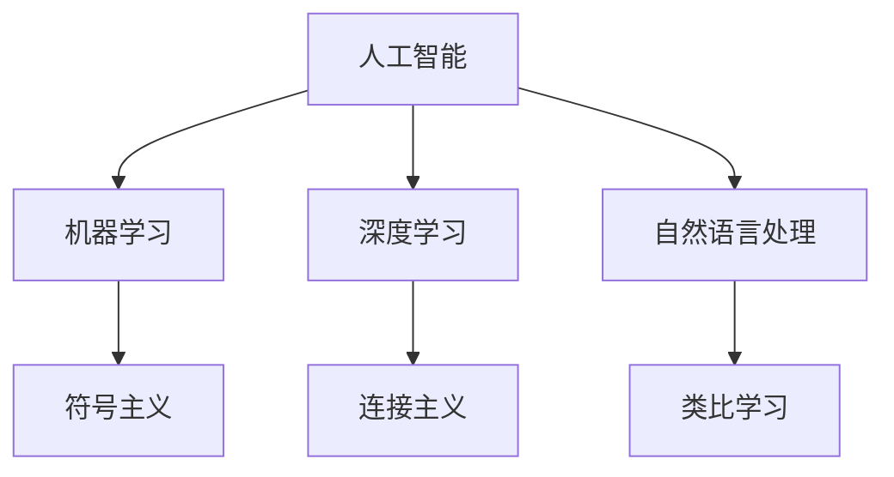

                 

# 人类智能与人工智能的关系

在当今科技飞速发展的时代，人工智能（AI）已成为最热门的话题之一。无论是科研界还是工业界，都在探讨如何通过机器学习、深度学习等技术手段模拟人类智能，并使之服务于人类生活。本文旨在深入探讨人类智能与人工智能的关系，从多个角度分析人工智能技术如何模拟人类智能，以及未来发展的方向与挑战。

## 1. 背景介绍

### 1.1 问题由来

人工智能的起源可以追溯到20世纪50年代，当时计算机科学家已经开始尝试让机器执行像人类一样复杂的任务。在过去的几十年里，人工智能技术取得了显著进展，从最初的专家系统到如今的深度学习模型，AI已经能够处理包括图像识别、自然语言处理、语音识别等多种任务。

然而，尽管AI在许多方面已经超越了人类的能力，但它仍然不能完全模拟人类的智能。人类智能不仅包括认知和理解能力，还涉及情感、道德和创造力等方面，这些都是目前AI技术难以完全解决的难题。

### 1.2 问题核心关键点

为了更好地理解人类智能与人工智能的关系，我们需要明确几个关键问题：

1. 什么是人工智能？
2. 人工智能如何模拟人类智能？
3. 人工智能在哪些方面已经超越人类，哪些方面仍需改进？
4. 未来人工智能的发展方向是什么？

这些问题将贯穿整个文章，帮助我们全面理解人类智能与人工智能之间的关系。

## 2. 核心概念与联系

### 2.1 核心概念概述

在探讨人类智能与人工智能的关系之前，我们需要先了解一些核心概念：

- **人工智能（Artificial Intelligence, AI）**：一种模拟人类智能的技术，包括机器学习、深度学习、自然语言处理等子领域。

- **人类智能（Human Intelligence, HI）**：指人类具有的感知、认知、学习、情感等能力，是机器难以完全模拟的。

- **类比学习（Analogical Learning）**：一种机器学习方式，通过建立不同对象之间的类比关系来获取新知识。

- **符号主义（Symbolism）**：一种早期的AI理论，强调使用符号和规则来模拟人类思维。

- **连接主义（Connectionism）**：一种现代AI理论，侧重于使用神经网络来模拟人类大脑的计算方式。

- **深度学习（Deep Learning）**：一种使用多层神经网络来模拟人类感知和认知的AI技术。

### 2.2 核心概念原理和架构的 Mermaid 流程图(Mermaid 流程节点中不要有括号、逗号等特殊字符)



这个流程图展示了AI技术的主要组成部分，以及它们之间的关系。

## 3. 核心算法原理 & 具体操作步骤

### 3.1 算法原理概述

人工智能模拟人类智能的方式主要包括以下几个方面：

1. **符号主义**：通过使用符号和规则来模拟人类思维。
2. **连接主义**：使用神经网络来模拟人类大脑的计算方式。
3. **深度学习**：使用多层神经网络来模拟人类感知和认知。
4. **自然语言处理**：通过机器学习技术，使机器能够理解和生成人类语言。

这些技术手段各有优缺点，但它们共同构成了现代AI的基础。

### 3.2 算法步骤详解

以深度学习为例，深度学习模型通常包括以下几个步骤：

1. **数据预处理**：将原始数据转换为机器可以处理的形式，如图片归一化、文本分词等。
2. **模型构建**：设计并训练神经网络模型，包括选择网络结构、损失函数、优化器等。
3. **训练过程**：使用大量标注数据训练模型，调整模型参数，使其能够准确地预测目标变量。
4. **模型评估**：在测试集上评估模型性能，根据评估结果调整模型参数或选择更好的模型。

### 3.3 算法优缺点

深度学习在许多任务上已经超越了人类，例如图像识别、语音识别等。然而，它也存在一些缺点：

1. **数据需求高**：需要大量标注数据进行训练，数据收集和标注成本高。
2. **计算资源消耗大**：深度学习模型通常需要大量的计算资源进行训练和推理。
3. **模型复杂**：深度学习模型结构复杂，难以理解和调试。
4. **泛化能力差**：过度拟合训练数据，导致模型在新数据上表现不佳。

### 3.4 算法应用领域

深度学习已经广泛应用于多个领域，包括医疗、金融、交通等。例如，在医疗领域，深度学习可以用于图像诊断、药物发现等任务；在金融领域，可以用于风险评估、欺诈检测等任务。

## 4. 数学模型和公式 & 详细讲解 & 举例说明

### 4.1 数学模型构建

深度学习模型通常使用多层神经网络来实现。以卷积神经网络（CNN）为例，其基本结构如图1所示。

```
图1: 卷积神经网络结构
```

### 4.2 公式推导过程

以CNN的前向传播过程为例，其计算公式如下：

$$
f(x)=\sigma\left(W_{3} \sigma\left(W_{2} \sigma\left(W_{1} x+b_{1}\right)+b_{2}\right)+b_{3}\right)
$$

其中，$W$ 为权重矩阵，$b$ 为偏置向量，$\sigma$ 为激活函数。

### 4.3 案例分析与讲解

以图像分类任务为例，使用CNN模型进行图像识别。将图像数据输入模型，经过多层卷积和池化操作，将特征提取出来，最终通过全连接层进行分类预测。

## 5. 项目实践：代码实例和详细解释说明

### 5.1 开发环境搭建

首先需要安装Python、TensorFlow等开发工具，搭建深度学习开发环境。

```bash
pip install tensorflow
```

### 5.2 源代码详细实现

以手写数字识别为例，使用TensorFlow实现一个简单的CNN模型：

```python
import tensorflow as tf
from tensorflow.keras import datasets, layers, models

# 加载数据集
(train_images, train_labels), (test_images, test_labels) = datasets.mnist.load_data()

# 数据预处理
train_images = train_images.reshape((60000, 28, 28, 1))
test_images = test_images.reshape((10000, 28, 28, 1))
train_images, test_images = train_images / 255.0, test_images / 255.0

# 构建模型
model = models.Sequential([
    layers.Conv2D(32, (3, 3), activation='relu', input_shape=(28, 28, 1)),
    layers.MaxPooling2D((2, 2)),
    layers.Conv2D(64, (3, 3), activation='relu'),
    layers.MaxPooling2D((2, 2)),
    layers.Conv2D(64, (3, 3), activation='relu'),
    layers.Flatten(),
    layers.Dense(64, activation='relu'),
    layers.Dense(10)
])

# 编译模型
model.compile(optimizer='adam',
              loss=tf.keras.losses.SparseCategoricalCrossentropy(from_logits=True),
              metrics=['accuracy'])

# 训练模型
model.fit(train_images, train_labels, epochs=5, 
          validation_data=(test_images, test_labels))

# 评估模型
test_loss, test_acc = model.evaluate(test_images, test_labels)
print(f'Test accuracy: {test_acc}')
```

### 5.3 代码解读与分析

代码中，我们首先加载了MNIST手写数字数据集，然后对数据进行预处理，包括将数据reshape和归一化。接着，我们构建了一个简单的CNN模型，包括多个卷积层、池化层和全连接层。最后，我们使用Adam优化器进行模型训练，并在测试集上评估模型性能。

## 6. 实际应用场景

### 6.1 医疗影像诊断

在医疗领域，深度学习可以用于影像诊断任务，如X光片、CT片等影像的自动诊断。例如，可以使用卷积神经网络（CNN）对肺部CT影像进行肺癌检测。

### 6.2 金融风险评估

金融领域中，深度学习可以用于风险评估和欺诈检测。例如，可以使用循环神经网络（RNN）对信用卡交易进行实时监控，及时发现异常行为。

### 6.3 自动驾驶

自动驾驶是深度学习的重要应用之一。通过使用深度神经网络，车辆可以感知周围环境，预测其他车辆的行动，并做出相应的决策。

### 6.4 未来应用展望

未来，人工智能将在更多领域得到应用。例如，在教育领域，可以使用AI进行个性化学习辅导；在农业领域，可以使用AI进行作物识别和病虫害检测。

## 7. 工具和资源推荐

### 7.1 学习资源推荐

- Coursera《深度学习专项课程》：由吴恩达教授讲授，涵盖深度学习的理论基础和实际应用。
- Udacity《深度学习纳米学位》：提供深度学习项目实践机会，从基础到高级全面覆盖。

### 7.2 开发工具推荐

- PyTorch：使用方便，功能强大，是深度学习开发的首选框架。
- TensorFlow：Google开发的开源深度学习框架，支持分布式计算和GPU加速。
- Keras：高层API，易于上手，可以快速构建深度学习模型。

### 7.3 相关论文推荐

- 《ImageNet Classification with Deep Convolutional Neural Networks》：深度学习在图像分类任务上的经典论文。
- 《Attention is All You Need》：介绍Transformer架构的论文，开启了NLP领域预训练大模型的时代。

## 8. 总结：未来发展趋势与挑战

### 8.1 研究成果总结

深度学习在许多任务上已经超越了人类，但仍存在一些挑战。未来，需要进一步提升数据利用效率、降低计算资源消耗、增强模型的泛化能力。

### 8.2 未来发展趋势

未来，深度学习将更加注重模型的可解释性和鲁棒性，同时，跨模态学习、多任务学习等新技术也将得到广泛应用。

### 8.3 面临的挑战

1. 数据需求高：需要大量标注数据进行训练，数据收集和标注成本高。
2. 计算资源消耗大：深度学习模型通常需要大量的计算资源进行训练和推理。
3. 模型复杂：深度学习模型结构复杂，难以理解和调试。
4. 泛化能力差：过度拟合训练数据，导致模型在新数据上表现不佳。

### 8.4 研究展望

未来的研究需要关注以下问题：

1. 如何提高深度学习模型的可解释性。
2. 如何降低深度学习模型的计算资源消耗。
3. 如何增强深度学习模型的泛化能力。
4. 如何更好地模拟人类情感、道德等复杂智能。

## 9. 附录：常见问题与解答

**Q1: 什么是人工智能？**

A: 人工智能是指通过计算机模拟人类智能的技术，包括机器学习、深度学习、自然语言处理等子领域。

**Q2: 人工智能如何模拟人类智能？**

A: 人工智能通过符号主义、连接主义和深度学习等技术手段模拟人类智能。

**Q3: 人工智能在哪些方面已经超越人类，哪些方面仍需改进？**

A: 人工智能在图像识别、语音识别等任务上已经超越人类，但在情感、道德等复杂智能方面仍需改进。

**Q4: 未来人工智能的发展方向是什么？**

A: 未来人工智能将更加注重模型的可解释性、鲁棒性和泛化能力，同时，跨模态学习、多任务学习等新技术也将得到广泛应用。

**Q5: 人工智能面临哪些挑战？**

A: 人工智能面临数据需求高、计算资源消耗大、模型复杂、泛化能力差等挑战。

作者：禅与计算机程序设计艺术 / Zen and the Art of Computer Programming

