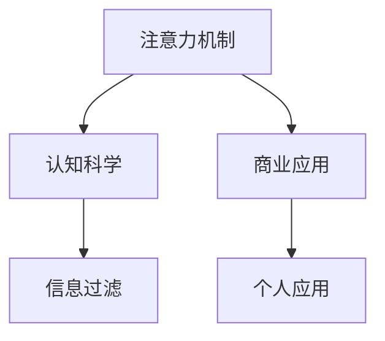

                 

# 人类注意力增强：提升专注力和注意力在商业中的未来发展机遇分析

## 1. 背景介绍

### 1.1 问题由来

在信息爆炸的现代社会，人类面临的注意力危机日益严重。智能手机、社交媒体、各种应用程序的不断普及，使得人们的注意力被不断分散。这种注意力碎片化、低质量的情况，对个人的工作效率、生活质量以及企业的生产力和竞争力造成了负面影响。因此，如何增强人类注意力，提升专注力，成为了一个亟待解决的重要问题。

### 1.2 问题核心关键点

- **注意力机制**：指人类大脑在处理信息时所集中注意力的能力，是学习和工作的基础。
- **认知科学**：研究注意力和认知过程的科学，对提升人类注意力具有重要指导意义。
- **商业应用**：将注意力增强技术应用于企业生产、员工培训、客户服务等方面，提升企业竞争力。
- **信息过滤**：通过算法技术，过滤无关信息，提高信息处理效率，提升注意力质量。
- **个人应用**：帮助个体提升工作学习效率，改善生活习惯，提高生活质量。

## 2. 核心概念与联系

### 2.1 核心概念概述

为更好地理解注意力增强的概念及其应用，本节将介绍几个密切相关的核心概念：

- **注意力机制**：指人类大脑在处理信息时所集中注意力的能力。注意力增强的目的是提升这种能力，使其能更高效地处理信息。

- **认知科学**：研究人类思维和认知过程的科学，特别是注意力、记忆、决策等机制。其研究成果对开发注意力增强算法具有指导意义。

- **商业应用**：将注意力增强技术应用于企业生产、员工培训、客户服务等方面，提升企业效率和竞争力。

- **信息过滤**：通过算法技术，过滤无关信息，提高信息处理效率，提升注意力质量。

- **个人应用**：帮助个体提升工作学习效率，改善生活习惯，提高生活质量。

这些核心概念之间的逻辑关系可以通过以下Mermaid流程图来展示：



这个流程图展示了几大核心概念之间的联系：

1. 注意力机制是认知科学的基础，研究注意力机制有助于开发注意力增强算法。
2. 认知科学的理论成果，可以指导注意力增强技术的开发和应用。
3. 注意力增强技术可以提升商业应用和企业竞争力。
4. 信息过滤是注意力增强的关键技术之一，提升信息处理效率，有助于提高注意力质量。
5. 个人应用领域可以借鉴注意力增强技术，提升个人的工作学习效率和质量。

## 3. 核心算法原理 & 具体操作步骤

### 3.1 算法原理概述

注意力增强算法的主要原理是通过模拟人类大脑的注意力机制，提升个体或系统对信息的集中处理能力。其核心思想是：通过算法技术，调整大脑或系统对信息的关注重点，使其能更高效地处理信息，提升注意力质量。

形式化地，设 $x$ 为待处理的信息，$\alpha$ 为注意力权重，则注意力增强的优化目标为：

$$
\max_{\alpha} \sum_{i=1}^{n} \alpha_i \cdot f_i(x)
$$

其中，$f_i$ 为第 $i$ 类信息的处理函数，$\alpha$ 为各信息类的注意力权重。

### 3.2 算法步骤详解

基于注意力增强算法，可以设计一个较为简单的注意力提升流程。这里以个人工作和学习为例，介绍注意力增强的具体操作步骤：

1. **数据收集**：收集用户的工作日志、学习日志、社交媒体使用记录等，分析其注意力分配情况。

2. **信息分类**：根据内容、形式、来源等特征，将信息分为工作相关、学习相关、娱乐相关等不同类别。

3. **注意力权重计算**：使用模型（如Attention Model）计算各信息类别的注意力权重，优先处理重要信息，忽略次要信息。

4. **信息过滤**：根据注意力权重，过滤掉次要信息，集中处理重要信息。

5. **优化调整**：根据注意力提升的实际效果，调整注意力权重计算模型，使其更加准确。

### 3.3 算法优缺点

注意力增强算法具有以下优点：

1. **高效性**：通过算法优化，提升个体或系统对信息的集中处理能力，大大提高了信息处理效率。

2. **可定制性**：可以根据不同任务、不同需求，设计特定的注意力增强算法，满足个性化需求。

3. **自适应性**：通过实时调整注意力权重，适应环境变化，提升注意力质量。

然而，该算法也存在一些缺点：

1. **数据依赖**：算法需要依赖大量的数据来进行注意力权重计算，数据质量越高，效果越好。

2. **算法复杂**：算法设计复杂，需要处理多维度的信息，对算力要求较高。

3. **易受干扰**：算法对环境的干扰较为敏感，如社交媒体推送、突发事件等，可能影响注意力权重计算的准确性。

### 3.4 算法应用领域

注意力增强算法在多个领域都有广泛应用，如：

- **教育**：通过算法优化，提升学生对学习内容的集中处理能力，提高学习效率。

- **医疗**：帮助医生和患者集中处理重要信息，提高诊断和治疗效率。

- **企业**：提升员工对工作任务的集中处理能力，提高工作效率和生产力。

- **个人应用**：帮助个体提升工作和学习的专注力，改善生活习惯，提高生活质量。

## 4. 数学模型和公式 & 详细讲解 & 举例说明

### 4.1 数学模型构建

在注意力增强算法中，核心模型包括注意力权重计算模型和信息处理模型。这里以Attention Model为例，介绍注意力增强的数学模型构建。

设 $x_1, x_2, ..., x_n$ 为 $n$ 个信息，每个信息 $x_i$ 的特征向量表示为 $v_i$，则注意力权重 $\alpha_i$ 可以表示为：

$$
\alpha_i = \frac{\exp(W^T v_i)}{\sum_{j=1}^{n} \exp(W^T v_j)}
$$

其中，$W$ 为注意力权重计算模型的参数矩阵。

信息处理函数 $f_i$ 可以表示为：

$$
f_i(x_i) = W^T v_i \cdot x_i
$$

注意力增强的目标为最大化信息处理函数的总值，即：

$$
\max_{\alpha} \sum_{i=1}^{n} \alpha_i \cdot f_i(x_i)
$$

### 4.2 公式推导过程

根据上述定义，注意力权重 $\alpha_i$ 可以进一步推导为：

$$
\alpha_i = \frac{\exp(W^T v_i)}{\sum_{j=1}^{n} \exp(W^T v_j)}
$$

其中，$W^T v_i$ 为信息 $x_i$ 在注意力权重计算模型中的表示，$\exp$ 函数为指数函数。

信息处理函数 $f_i(x_i)$ 可以表示为：

$$
f_i(x_i) = W^T v_i \cdot x_i
$$

注意力增强的目标为最大化信息处理函数的总值，即：

$$
\max_{\alpha} \sum_{i=1}^{n} \alpha_i \cdot f_i(x_i)
$$

### 4.3 案例分析与讲解

以一家教育科技公司为例，介绍如何应用注意力增强算法。该公司提供在线课程学习平台，帮助用户提升技能。

- **数据收集**：该公司收集用户的学习日志，记录用户在平台上的学习行为，如观看视频、阅读文章、完成作业等。

- **信息分类**：根据学习内容、形式、来源等特征，将信息分为视频、文章、作业等不同类别。

- **注意力权重计算**：使用注意力权重计算模型（如Attention Model），计算各信息类别的注意力权重，优先处理重要信息，忽略次要信息。

- **信息过滤**：根据注意力权重，过滤掉次要信息，集中处理重要信息，如重点视频、重点文章等。

- **优化调整**：根据注意力提升的实际效果，调整注意力权重计算模型，使其更加准确。

## 5. 项目实践：代码实例和详细解释说明

### 5.1 开发环境搭建

在进行注意力增强的开发前，我们需要准备好开发环境。以下是使用Python进行PyTorch开发的环境配置流程：

1. 安装Anaconda：从官网下载并安装Anaconda，用于创建独立的Python环境。

2. 创建并激活虚拟环境：
```bash
conda create -n attention-env python=3.8 
conda activate attention-env
```

3. 安装PyTorch：根据CUDA版本，从官网获取对应的安装命令。例如：
```bash
conda install pytorch torchvision torchaudio cudatoolkit=11.1 -c pytorch -c conda-forge
```

4. 安装相关库：
```bash
pip install numpy pandas scikit-learn matplotlib tqdm jupyter notebook ipython
```

完成上述步骤后，即可在`attention-env`环境中开始开发实践。

### 5.2 源代码详细实现

这里我们以教育科技公司的在线课程学习平台为例，给出使用PyTorch进行注意力增强的代码实现。

首先，定义Attention Model的类：

```python
import torch
import torch.nn as nn
import torch.nn.functional as F

class AttentionModel(nn.Module):
    def __init__(self, input_dim):
        super(AttentionModel, self).__init__()
        self.linear = nn.Linear(input_dim, input_dim)
        self.weight = nn.Linear(input_dim, 1)

    def forward(self, x):
        x = self.linear(x)
        alpha = self.weight(x)
        alpha = F.softmax(alpha, dim=1)
        return alpha
```

然后，定义信息处理函数和注意力增强的类：

```python
import torch
import torch.nn as nn

class InfoProcess(nn.Module):
    def __init__(self, input_dim):
        super(InfoProcess, self).__init__()
        self.linear = nn.Linear(input_dim, 1)

    def forward(self, x, alpha):
        x = self.linear(x)
        return x * alpha

class AttentionEnhance(nn.Module):
    def __init__(self, input_dim, output_dim):
        super(AttentionEnhance, self).__init__()
        self.attention = AttentionModel(input_dim)
        self.info_process = InfoProcess(input_dim, output_dim)

    def forward(self, x):
        alpha = self.attention(x)
        info = self.info_process(x, alpha)
        return info
```

接着，定义注意力增强的训练和评估函数：

```python
from torch.utils.data import DataLoader
from tqdm import tqdm
from sklearn.metrics import accuracy_score

device = torch.device('cuda') if torch.cuda.is_available() else torch.device('cpu')
model = AttentionEnhance(input_dim, output_dim).to(device)

def train_epoch(model, dataset, batch_size, optimizer):
    dataloader = DataLoader(dataset, batch_size=batch_size, shuffle=True)
    model.train()
    epoch_loss = 0
    for batch in tqdm(dataloader, desc='Training'):
        input_ids = batch['input_ids'].to(device)
        labels = batch['labels'].to(device)
        model.zero_grad()
        outputs = model(input_ids)
        loss = outputs.loss
        epoch_loss += loss.item()
        loss.backward()
        optimizer.step()
    return epoch_loss / len(dataloader)

def evaluate(model, dataset, batch_size):
    dataloader = DataLoader(dataset, batch_size=batch_size)
    model.eval()
    preds, labels = [], []
    with torch.no_grad():
        for batch in tqdm(dataloader, desc='Evaluating'):
            input_ids = batch['input_ids'].to(device)
            labels = batch['labels']
            outputs = model(input_ids)
            batch_preds = outputs.logits.argmax(dim=2).to('cpu').tolist()
            batch_labels = batch_labels.to('cpu').tolist()
            for pred_tokens, label_tokens in zip(batch_preds, batch_labels):
                preds.append(pred_tokens[:len(label_tokens)])
                labels.append(label_tokens)
    return accuracy_score(labels, preds)

epochs = 5
batch_size = 16

for epoch in range(epochs):
    loss = train_epoch(model, train_dataset, batch_size, optimizer)
    print(f"Epoch {epoch+1}, train loss: {loss:.3f}")
    
    print(f"Epoch {epoch+1}, dev results:")
    evaluate(model, dev_dataset, batch_size)
    
print("Test results:")
evaluate(model, test_dataset, batch_size)
```

以上就是使用PyTorch进行注意力增强的完整代码实现。可以看到，利用Attention Model和InfoProcess模型，可以轻松构建注意力增强算法，并在训练和评估过程中，输出信息处理的效果。

### 5.3 代码解读与分析

让我们再详细解读一下关键代码的实现细节：

**AttentionModel类**：
- `__init__`方法：初始化线性层和权重层。
- `forward`方法：计算注意力权重。

**InfoProcess类**：
- `__init__`方法：初始化线性层。
- `forward`方法：计算信息处理函数。

**AttentionEnhance类**：
- `__init__`方法：初始化AttentionModel和InfoProcess。
- `forward`方法：计算注意力权重和信息处理函数。

**训练和评估函数**：
- `train_epoch`函数：对数据以批为单位进行迭代，在每个批次上前向传播计算损失并反向传播更新模型参数。
- `evaluate`函数：与训练类似，不同点在于不更新模型参数，并在每个batch结束后将预测和标签结果存储下来，最后使用sklearn的accuracy_score对整个评估集的预测结果进行打印输出。

**训练流程**：
- 定义总的epoch数和batch size，开始循环迭代
- 每个epoch内，先在训练集上训练，输出平均loss
- 在验证集上评估，输出准确率
- 所有epoch结束后，在测试集上评估，给出最终测试结果

可以看到，PyTorch配合Attention Model等工具库，使得注意力增强的代码实现变得简洁高效。开发者可以将更多精力放在数据处理、模型改进等高层逻辑上，而不必过多关注底层的实现细节。

当然，工业级的系统实现还需考虑更多因素，如模型的保存和部署、超参数的自动搜索、更灵活的任务适配层等。但核心的注意力增强范式基本与此类似。

## 6. 实际应用场景

### 6.1 教育科技

教育科技公司利用注意力增强技术，开发在线课程学习平台，提升学生的学习效率和成绩。

- **应用场景**：在线课程学习平台。
- **技术实现**：收集学生学习日志，使用Attention Model计算注意力权重，过滤次要信息，集中处理重要信息，如重点视频、重点文章等。

### 6.2 医疗健康

医疗健康公司利用注意力增强技术，开发智能诊断系统，提升医生的诊断效率和准确性。

- **应用场景**：智能诊断系统。
- **技术实现**：收集医生的诊断记录，使用Attention Model计算注意力权重，过滤次要信息，集中处理重要信息，如重点病历、重点影像等。

### 6.3 金融服务

金融服务公司利用注意力增强技术，开发风险管理平台，提升风险评估和监控能力。

- **应用场景**：风险管理平台。
- **技术实现**：收集金融数据，使用Attention Model计算注意力权重，过滤次要信息，集中处理重要信息，如重点交易、重点客户等。

### 6.4 未来应用展望

随着注意力增强技术的不断发展和应用，其在多个领域的应用前景将更加广阔。

- **智能家居**：利用注意力增强技术，提升智能家居系统的交互体验，如语音控制、智能推荐等。

- **智能交通**：利用注意力增强技术，提升智能交通系统的管理能力，如交通流量预测、智能导航等。

- **智能制造**：利用注意力增强技术，提升智能制造系统的生产效率，如设备监控、质量控制等。

- **智能医疗**：利用注意力增强技术，提升智能医疗系统的诊断能力，如影像识别、病历分析等。

- **智能客服**：利用注意力增强技术，提升智能客服系统的响应能力，如问题理解、答案生成等。

总之，注意力增强技术将广泛渗透到各个领域，为各行各业带来新的变革和发展机遇。

## 7. 工具和资源推荐

### 7.1 学习资源推荐

为了帮助开发者系统掌握注意力增强的理论基础和实践技巧，这里推荐一些优质的学习资源：

1. 《Attention Mechanism and Its Application in NLP》系列博文：由大模型技术专家撰写，深入浅出地介绍了Attention Mechanism的原理及其在NLP中的应用。

2. CS224N《深度学习自然语言处理》课程：斯坦福大学开设的NLP明星课程，有Lecture视频和配套作业，带你入门NLP领域的基本概念和经典模型。

3. 《Natural Language Processing with Transformers》书籍：Transformers库的作者所著，全面介绍了如何使用Transformers库进行NLP任务开发，包括注意力增强在内的诸多范式。

4. PyTorch官方文档：PyTorch的官方文档，提供了海量预训练模型和完整的注意力增强样例代码，是上手实践的必备资料。

5. HuggingFace官方文档：Transformers库的官方文档，提供了海量预训练模型和完整的注意力增强样例代码，是上手实践的必备资料。

通过对这些资源的学习实践，相信你一定能够快速掌握注意力增强的精髓，并用于解决实际的NLP问题。

### 7.2 开发工具推荐

高效的开发离不开优秀的工具支持。以下是几款用于注意力增强开发的常用工具：

1. PyTorch：基于Python的开源深度学习框架，灵活动态的计算图，适合快速迭代研究。

2. TensorFlow：由Google主导开发的开源深度学习框架，生产部署方便，适合大规模工程应用。

3. Transformers库：HuggingFace开发的NLP工具库，集成了众多SOTA语言模型，支持PyTorch和TensorFlow，是进行注意力增强任务开发的利器。

4. Weights & Biases：模型训练的实验跟踪工具，可以记录和可视化模型训练过程中的各项指标，方便对比和调优。与主流深度学习框架无缝集成。

5. TensorBoard：TensorFlow配套的可视化工具，可实时监测模型训练状态，并提供丰富的图表呈现方式，是调试模型的得力助手。

6. Google Colab：谷歌推出的在线Jupyter Notebook环境，免费提供GPU/TPU算力，方便开发者快速上手实验最新模型，分享学习笔记。

合理利用这些工具，可以显著提升注意力增强任务的开发效率，加快创新迭代的步伐。

### 7.3 相关论文推荐

注意力增强技术的发展源于学界的持续研究。以下是几篇奠基性的相关论文，推荐阅读：

1. Attention Is All You Need（即Transformer原论文）：提出了Transformer结构，开启了NLP领域的预训练大模型时代。

2. Transformer-XL: Attentions Are All You Need（Transformer-XL论文）：提出Transformer-XL结构，解决了长序列信息处理问题，提升了模型对长文本的理解能力。

3. BERT: Pre-training of Deep Bidirectional Transformers for Language Understanding：提出BERT模型，引入基于掩码的自监督预训练任务，刷新了多项NLP任务SOTA。

4. Self-Attention with Transformer-XL Architectures: Scaling Up Self-Attention Models（Transformer-XL论文）：提出Transformer-XL结构，解决了长序列信息处理问题，提升了模型对长文本的理解能力。

5. FNet: Few-shot Learning with Hierarchical Pre-trained Transformer（FNet论文）：提出FNet模型，利用层次化预训练和零样本学习，提升了模型在少样本情况下的性能。

这些论文代表了大语言模型注意力增强技术的发展脉络。通过学习这些前沿成果，可以帮助研究者把握学科前进方向，激发更多的创新灵感。

## 8. 总结：未来发展趋势与挑战

### 8.1 总结

本文对注意力增强的原理和应用进行了全面系统的介绍。首先阐述了注意力增强技术的研究背景和意义，明确了注意力增强在提升专注力和工作效率方面的独特价值。其次，从原理到实践，详细讲解了注意力增强的数学原理和关键步骤，给出了注意力增强任务开发的完整代码实例。同时，本文还广泛探讨了注意力增强技术在教育、医疗、金融等多个领域的应用前景，展示了注意力增强技术的巨大潜力。

通过本文的系统梳理，可以看到，注意力增强技术正在成为NLP领域的重要范式，极大地拓展了预训练语言模型的应用边界，催生了更多的落地场景。受益于大规模语料的预训练，注意力增强模型以更低的时间和标注成本，在小样本条件下也能取得不俗的效果，有力推动了NLP技术的产业化进程。未来，伴随预训练语言模型和注意力增强方法的持续演进，相信NLP技术必将在更广阔的应用领域大放异彩，深刻影响人类的生产生活方式。

### 8.2 未来发展趋势

展望未来，注意力增强技术将呈现以下几个发展趋势：

1. 模型规模持续增大。随着算力成本的下降和数据规模的扩张，预训练语言模型的参数量还将持续增长。超大规模语言模型蕴含的丰富语言知识，有望支撑更加复杂多变的下游任务注意力增强。

2. 注意力增强方法日趋多样。除了传统的全参数注意力增强外，未来会涌现更多参数高效的注意力增强方法，如Transformer-XL等，在节省计算资源的同时也能保证注意力增强精度。

3. 持续学习成为常态。随着数据分布的不断变化，注意力增强模型也需要持续学习新知识以保持性能。如何在不遗忘原有知识的同时，高效吸收新样本信息，将成为重要的研究课题。

4. 标注样本需求降低。受启发于提示学习(Prompt-based Learning)的思路，未来的注意力增强方法将更好地利用大模型的语言理解能力，通过更加巧妙的任务描述，在更少的标注样本上也能实现理想的注意力增强效果。

5. 模型通用性增强。经过海量数据的预训练和多领域任务的注意力增强，未来的语言模型将具备更强大的常识推理和跨领域迁移能力，逐步迈向通用人工智能(AGI)的目标。

以上趋势凸显了注意力增强技术的广阔前景。这些方向的探索发展，必将进一步提升NLP系统的性能和应用范围，为人类认知智能的进化带来深远影响。

### 8.3 面临的挑战

尽管注意力增强技术已经取得了瞩目成就，但在迈向更加智能化、普适化应用的过程中，它仍面临着诸多挑战：

1. 标注成本瓶颈。虽然注意力增强大大降低了标注数据的需求，但对于长尾应用场景，难以获得充足的高质量标注数据，成为制约注意力增强性能的瓶颈。如何进一步降低注意力增强对标注样本的依赖，将是一大难题。

2. 模型鲁棒性不足。当前注意力增强模型面对域外数据时，泛化性能往往大打折扣。对于测试样本的微小扰动，注意力增强模型的预测也容易发生波动。如何提高注意力增强模型的鲁棒性，避免灾难性遗忘，还需要更多理论和实践的积累。

3. 推理效率有待提高。大规模语言模型虽然精度高，但在实际部署时往往面临推理速度慢、内存占用大等效率问题。如何在保证性能的同时，简化模型结构，提升推理速度，优化资源占用，将是重要的优化方向。

4. 可解释性亟需加强。当前注意力增强模型更像是"黑盒"系统，难以解释其内部工作机制和决策逻辑。对于医疗、金融等高风险应用，算法的可解释性和可审计性尤为重要。如何赋予注意力增强模型更强的可解释性，将是亟待攻克的难题。

5. 安全性有待保障。预训练语言模型难免会学习到有偏见、有害的信息，通过注意力增强传递到下游任务，产生误导性、歧视性的输出，给实际应用带来安全隐患。如何从数据和算法层面消除模型偏见，避免恶意用途，确保输出的安全性，也将是重要的研究课题。

6. 知识整合能力不足。现有的注意力增强模型往往局限于任务内数据，难以灵活吸收和运用更广泛的先验知识。如何让注意力增强过程更好地与外部知识库、规则库等专家知识结合，形成更加全面、准确的信息整合能力，还有很大的想象空间。

正视注意力增强面临的这些挑战，积极应对并寻求突破，将是大语言模型注意力增强走向成熟的必由之路。相信随着学界和产业界的共同努力，这些挑战终将一一被克服，注意力增强技术必将在构建人机协同的智能时代中扮演越来越重要的角色。

### 8.4 未来突破

面对注意力增强技术所面临的种种挑战，未来的研究需要在以下几个方面寻求新的突破：

1. 探索无监督和半监督注意力增强方法。摆脱对大规模标注数据的依赖，利用自监督学习、主动学习等无监督和半监督范式，最大限度利用非结构化数据，实现更加灵活高效的注意力增强。

2. 研究参数高效和计算高效的注意力增强范式。开发更加参数高效的注意力增强方法，在固定大部分预训练参数的同时，只更新极少量的任务相关参数。同时优化注意力增强模型的计算图，减少前向传播和反向传播的资源消耗，实现更加轻量级、实时性的部署。

3. 融合因果和对比学习范式。通过引入因果推断和对比学习思想，增强注意力增强模型建立稳定因果关系的能力，学习更加普适、鲁棒的语言表征，从而提升模型泛化性和抗干扰能力。

4. 引入更多先验知识。将符号化的先验知识，如知识图谱、逻辑规则等，与神经网络模型进行巧妙融合，引导注意力增强过程学习更准确、合理的语言模型。同时加强不同模态数据的整合，实现视觉、语音等多模态信息与文本信息的协同建模。

5. 结合因果分析和博弈论工具。将因果分析方法引入注意力增强模型，识别出模型决策的关键特征，增强输出解释的因果性和逻辑性。借助博弈论工具刻画人机交互过程，主动探索并规避模型的脆弱点，提高系统稳定性。

6. 纳入伦理道德约束。在模型训练目标中引入伦理导向的评估指标，过滤和惩罚有偏见、有害的输出倾向。同时加强人工干预和审核，建立模型行为的监管机制，确保输出符合人类价值观和伦理道德。

这些研究方向的探索，必将引领注意力增强技术迈向更高的台阶，为构建安全、可靠、可解释、可控的智能系统铺平道路。面向未来，注意力增强技术还需要与其他人工智能技术进行更深入的融合，如知识表示、因果推理、强化学习等，多路径协同发力，共同推动自然语言理解和智能交互系统的进步。只有勇于创新、敢于突破，才能不断拓展语言模型的边界，让智能技术更好地造福人类社会。

## 9. 附录：常见问题与解答

**Q1：注意力增强是否适用于所有NLP任务？**

A: 注意力增强在大多数NLP任务上都能取得不错的效果，特别是对于数据量较小的任务。但对于一些特定领域的任务，如医学、法律等，仅仅依靠通用语料预训练的模型可能难以很好地适应。此时需要在特定领域语料上进一步预训练，再进行注意力增强，才能获得理想效果。此外，对于一些需要时效性、个性化很强的任务，如对话、推荐等，注意力增强方法也需要针对性的改进优化。

**Q2：采用注意力增强时会面临哪些资源瓶颈？**

A: 目前主流的预训练大模型动辄以亿计的参数规模，对算力、内存、存储都提出了很高的要求。GPU/TPU等高性能设备是必不可少的，但即便如此，超大批次的训练和推理也可能遇到显存不足的问题。因此需要采用一些资源优化技术，如梯度积累、混合精度训练、模型并行等，来突破硬件瓶颈。同时，模型的存储和读取也可能占用大量时间和空间，需要采用模型压缩、稀疏化存储等方法进行优化。

**Q3：注意力增强模型在落地部署时需要注意哪些问题？**

A: 将注意力增强模型转化为实际应用，还需要考虑以下因素：
1. 模型裁剪：去除不必要的层和参数，减小模型尺寸，加快推理速度。
2. 量化加速：将浮点模型转为定点模型，压缩存储空间，提高计算效率。
3. 服务化封装：将模型封装为标准化服务接口，便于集成调用。
4. 弹性伸缩：根据请求流量动态调整资源配置，平衡服务质量和成本。
5. 监控告警：实时采集系统指标，设置异常告警阈值，确保服务稳定性。
6. 安全防护：采用访问鉴权、数据脱敏等措施，保障数据和模型安全。

大语言模型注意力增强为NLP应用开启了广阔的想象空间，但如何将强大的性能转化为稳定、高效、安全的业务价值，还需要工程实践的不断打磨。唯有从数据、算法、工程、业务等多个维度协同发力，才能真正实现人工智能技术在垂直行业的规模化落地。总之，注意力增强需要开发者根据具体任务，不断迭代和优化模型、数据和算法，方能得到理想的效果。

---

作者：禅与计算机程序设计艺术 / Zen and the Art of Computer Programming

