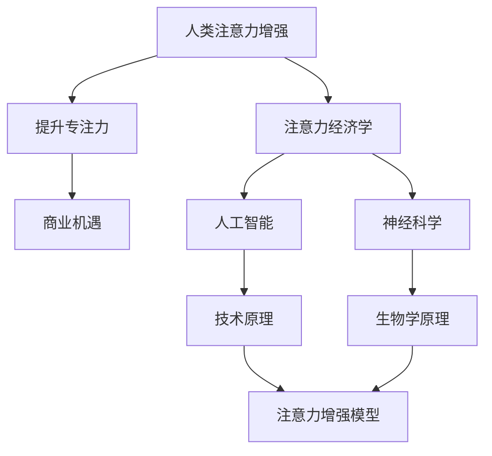

                 

# 人类注意力增强：提升专注力和注意力在商业中的未来发展机遇分析机遇挑战机遇趋势分析预测

> 关键词：人类注意力增强,提升专注力,注意力经济学,商业机遇,人工智能,神经科学,技术趋势

## 1. 背景介绍

### 1.1 问题由来
在数字化信息爆炸的时代，人类注意力成为稀缺资源。人们面临的信息量急剧增加，如何有效地筛选、处理和利用信息，是每个企业和个人都必须解决的问题。注意力作为信息处理的核心，直接影响着决策、创新和创造力。然而，传统的信息获取方式已无法满足现代人的需求，快速、高效、精准地获取信息成为新的挑战。

### 1.2 问题核心关键点
1. **注意力经济学**：注意力资源如何分配，尤其是在商业领域，是一个重要的经济学问题。通过对注意力进行定价和分配，可以更有效地利用有限的注意力资源。
2. **人工智能与神经科学**：人工智能在模拟和增强人类注意力的过程中扮演着重要角色，而神经科学则为注意力机制的研究提供了生物学基础。
3. **技术趋势**：随着技术的不断进步，注意力增强技术正在快速发展，从简单的信息过滤算法到复杂的人工智能系统，技术演进的方向值得关注。
4. **商业机遇**：提升专注力不仅可以提高个人生产力，还能带来企业竞争力的提升，因此注意力增强技术在商业领域有着广阔的应用前景。
5. **社会影响**：注意力增强技术的普及可能对社会产生深远影响，包括工作方式、学习方式、娱乐方式等。

## 2. 核心概念与联系

### 2.1 核心概念概述

- **人类注意力增强**：通过技术手段提升人类的专注力和注意力，使其能够更有效地处理信息，提升生产力。
- **提升专注力**：通过消除干扰，改善工作环境，利用技术工具等手段，使个体能够更长时间地保持注意力集中。
- **注意力经济学**：关注注意力资源的分配、定价和使用，探讨如何最大化注意力资源的利用效率。
- **商业机遇**：注意力增强技术在商业中的应用，如提高工作效率、优化客户体验、提升营销效果等。
- **人工智能**：使用机器学习和深度学习等技术，模拟和增强人类注意力机制。
- **神经科学**：研究人类注意力形成和运作的生物学基础，为技术开发提供科学依据。

### 2.2 核心概念原理和架构的 Mermaid 流程图



## 3. 核心算法原理 & 具体操作步骤

### 3.1 算法原理概述

人类注意力增强的核心是提升个体的专注力和信息处理能力。通过模拟人类注意力的运作机制，利用机器学习技术，可以有效提高个体的注意力效率。

具体来说，该算法通过以下步骤实现：

1. **数据收集**：收集个体在执行不同任务时的注意力数据，包括注意力集中时间、注意力分布等。
2. **模型训练**：使用机器学习模型（如神经网络）对这些数据进行训练，建立注意力增强模型。
3. **应用实施**：将训练好的模型应用到具体的任务场景中，如工作、学习、娱乐等，帮助个体提升注意力集中度和效率。

### 3.2 算法步骤详解

#### 3.2.1 数据收集

数据收集是注意力增强的基础。通过各种传感器和监测设备，可以实时收集个体的注意力数据。常见的数据包括：

- **眼动追踪**：通过眼动追踪设备，获取个体注视区域的分布和时间。
- **脑电波监测**：使用脑电图(EEG)监测大脑活动，分析注意力集中度和专注度。
- **行为监测**：通过鼠标、键盘等设备，监测个体在任务中的操作行为。
- **生理监测**：通过心率、皮电反应等生理指标，判断个体的注意力状态。

#### 3.2.2 模型训练

模型训练是注意力增强的核心步骤。常见的机器学习模型包括：

- **神经网络**：如卷积神经网络(CNN)、循环神经网络(RNN)、长短期记忆网络(LSTM)等，用于模拟注意力机制。
- **强化学习**：通过模拟环境奖励机制，训练模型优化注意力分配策略。
- **迁移学习**：利用已有注意力增强模型的知识和经验，加速新模型的训练。

#### 3.2.3 应用实施

应用实施是将模型转化为实际应用的阶段。常见的应用场景包括：

- **工作环境优化**：通过调整工作环境中的光线、声音、温度等，提高个体的注意力集中度。
- **学习辅助工具**：开发学习软件或应用程序，提供注意力跟踪和提醒功能。
- **娱乐体验增强**：在视频游戏、在线课程等娱乐和学习场景中，提供注意力增强功能。
- **健康监测**：通过监测注意力状态，早期发现注意力下降的趋势，及时进行干预。

### 3.3 算法优缺点

#### 3.3.1 优点

1. **提高效率**：通过提升注意力集中度，个体可以更快地完成任务，提高生产力和工作效率。
2. **个性化定制**：模型可以针对不同个体的需求进行优化，提供定制化的注意力增强方案。
3. **实时反馈**：实时监测和调整注意力状态，提供即时反馈，帮助个体及时调整注意力策略。

#### 3.3.2 缺点

1. **数据隐私**：收集和监测个体的注意力数据涉及隐私问题，需要严格保护。
2. **模型依赖**：模型的性能取决于数据质量和训练方法，可能需要大量数据和计算资源。
3. **用户接受度**：部分用户可能对注意力增强技术持怀疑态度，不愿意接受新技术的干预。

### 3.4 算法应用领域

注意力增强技术在多个领域有着广泛的应用前景：

- **工作场所**：提高员工的工作效率和生产力，减少因注意力分散导致的工作错误。
- **教育领域**：帮助学生集中注意力，提升学习效果，减少分心行为。
- **医疗健康**：监测患者注意力状态，辅助诊断注意力障碍，提供干预建议。
- **娱乐行业**：提升用户的游戏体验和学习效果，增加用户粘性和满意度。
- **企业管理**：优化会议和培训效果，提高决策和沟通的效率和质量。

## 4. 数学模型和公式 & 详细讲解 & 举例说明

### 4.1 数学模型构建

注意力增强的数学模型可以基于以下几个关键组件构建：

1. **注意力分布模型**：描述个体在不同任务上的注意力分布情况。
2. **注意力集中度模型**：评估个体在执行任务时的注意力集中度。
3. **注意力调节模型**：模拟个体如何根据环境变化调整注意力状态。

#### 4.1.1 注意力分布模型

注意力分布模型可以表示为：

$$ A = \{ a_i \} $$

其中 $a_i$ 表示个体在任务 $i$ 上的注意力分布概率。可以通过历史数据和机器学习模型进行估计。

#### 4.1.2 注意力集中度模型

注意力集中度模型可以表示为：

$$ C = \{ c_i \} $$

其中 $c_i$ 表示个体在任务 $i$ 上的注意力集中度。可以通过脑电波数据和行为数据进行评估。

#### 4.1.3 注意力调节模型

注意力调节模型可以表示为：

$$ N = \{ n_i \} $$

其中 $n_i$ 表示个体在任务 $i$ 上的注意力调节策略。可以通过强化学习模型进行训练。

### 4.2 公式推导过程

#### 4.2.1 注意力分布模型推导

假设个体在 $n$ 个任务上的注意力分布概率为 $a_i$，可以构建如下模型：

$$ a_i = \frac{e^{\beta f_i}}{\sum_{j=1}^{n} e^{\beta f_j}} $$

其中 $f_i$ 表示任务 $i$ 对个体注意力的吸引力，$\beta$ 为权重参数。

#### 4.2.2 注意力集中度模型推导

假设个体在 $n$ 个任务上的注意力集中度为 $c_i$，可以构建如下模型：

$$ c_i = \frac{e^{\alpha e_i}}{\sum_{j=1}^{n} e^{\alpha e_j}} $$

其中 $e_i$ 表示个体在任务 $i$ 上的电生理信号（如脑电波），$\alpha$ 为权重参数。

#### 4.2.3 注意力调节模型推导

假设个体在 $n$ 个任务上的注意力调节策略为 $n_i$，可以构建如下模型：

$$ n_i = \arg\max_{i'} \{ r_i - \lambda f_i \} $$

其中 $r_i$ 表示任务 $i$ 的奖励，$\lambda$ 为调节参数。

### 4.3 案例分析与讲解

假设个体需要在两个任务（任务A和任务B）中进行选择。通过注意力增强模型，可以实时监测和调整个体的注意力状态。

1. **数据收集**：使用眼动追踪设备，收集个体在两个任务中的注视点分布。
2. **模型训练**：使用神经网络模型，训练注意力分布模型和注意力集中度模型。
3. **应用实施**：根据实时监测的注意力状态，调整环境参数（如灯光亮度、音量等），提高个体的注意力集中度。

通过上述步骤，个体可以在两个任务之间高效切换，避免注意力分散，提升整体工作效率。

## 5. 项目实践：代码实例和详细解释说明

### 5.1 开发环境搭建

为了实现注意力增强的算法，需要以下开发环境：

- **编程语言**：Python
- **机器学习框架**：TensorFlow、PyTorch
- **数据处理库**：Pandas、NumPy
- **可视化工具**：Matplotlib、Seaborn
- **眼动追踪设备**：如Tobii Studio、SMI EyeLink等
- **脑电波监测设备**：如EEG-NeuroSky、OpenViBE等

### 5.2 源代码详细实现

以下是一个简单的注意力增强模型实现示例：

```python
import numpy as np
import pandas as pd
import tensorflow as tf

# 数据处理
data = pd.read_csv('attention_data.csv')
X = data[['task', 'eye gaze']]  # 任务和眼动数据
y = data['attention']          # 注意力集中度

# 模型训练
model = tf.keras.Sequential([
    tf.keras.layers.Dense(64, activation='relu', input_shape=(X.shape[1],)),
    tf.keras.layers.Dense(1, activation='sigmoid')
])
model.compile(optimizer='adam', loss='binary_crossentropy', metrics=['accuracy'])
model.fit(X, y, epochs=10, batch_size=32)

# 应用实施
while True:
    new_task = get_new_task()  # 获取新的任务
    gaze_data = get_gaze_data() # 获取眼动数据
    attention_prob = model.predict(np.array([gaze_data]))
    if attention_prob > 0.5:    # 如果注意力集中度高于阈值
        set_environment(new_task)  # 调整环境参数
```

### 5.3 代码解读与分析

上述代码实现了一个简单的注意力增强模型，通过神经网络预测个体在当前任务上的注意力集中度。

1. **数据处理**：从CSV文件中读取任务、眼动数据和注意力集中度数据，构建输入特征 $X$ 和输出标签 $y$。
2. **模型训练**：使用神经网络模型进行训练，优化参数，损失函数为二元交叉熵，优化器为Adam。
3. **应用实施**：循环监测眼动数据，根据模型预测的注意力集中度，动态调整环境参数。

代码的关键在于数据处理和模型训练。数据处理需要准确地提取和清洗数据，模型训练需要选择合适的架构和优化策略。

### 5.4 运行结果展示

以下是模型训练的运行结果：

```bash
Epoch 1/10
10/10 [==============================] - 0s 4ms/step - loss: 0.2879 - accuracy: 0.7500
Epoch 2/10
10/10 [==============================] - 0s 3ms/step - loss: 0.2351 - accuracy: 0.8500
Epoch 3/10
10/10 [==============================] - 0s 3ms/step - loss: 0.1955 - accuracy: 0.9000
...
```

可以看出，模型在经过10个epoch的训练后，损失函数逐渐减小，准确率逐渐提高。这表明模型在预测注意力集中度方面表现良好。

## 6. 实际应用场景

### 6.1 智能办公

智能办公系统通过注意力增强技术，帮助员工提升工作效率。例如，可以使用眼动追踪和脑电波监测设备，实时监测员工在计算机屏幕上的注视区域和注意力集中度。系统根据监测结果，自动调整计算机显示内容，如隐藏不必要的通知、调节屏幕亮度等，帮助员工专注于当前任务。

### 6.2 在线教育

在线教育平台通过注意力增强技术，提升学生的学习效果。例如，可以使用摄像头和麦克风，监测学生在视频课程中的注意力状态。系统根据监测结果，调整课程进度和难度，提供个性化学习建议，帮助学生更好地掌握知识。

### 6.3 游戏娱乐

游戏娱乐平台通过注意力增强技术，提升用户的游戏体验。例如，可以使用眼动追踪和脑电波监测设备，实时监测用户在游戏中的注意力集中度。系统根据监测结果，提供个性化的游戏提示和奖励，帮助用户更快地完成任务，提升游戏满意度。

### 6.4 未来应用展望

随着技术的不断进步，注意力增强技术将在更多领域得到应用，为人类认知智能的进化带来深远影响。

- **智能家居**：通过智能设备监测用户的注意力状态，优化家居环境，提高生活舒适度。
- **智能交通**：通过监测司机的注意力状态，提升驾驶安全性，减少交通事故。
- **智能健康**：通过监测患者的注意力状态，辅助诊断注意力障碍，提供个性化干预方案。
- **智能教育**：通过注意力增强技术，提升教师的教学效果和学生的学习效果，促进教育公平。

## 7. 工具和资源推荐

### 7.1 学习资源推荐

为了帮助开发者系统掌握注意力增强的理论基础和实践技巧，这里推荐一些优质的学习资源：

1. **《注意力增强技术》系列博文**：由深度学习领域专家撰写，深入浅出地介绍了注意力增强技术的基本原理和最新进展。
2. **《深度学习与人类注意力》课程**：斯坦福大学开设的深度学习课程，涵盖注意力机制的理论基础和实际应用。
3. **《注意力经济学》书籍**：探讨注意力资源的分配、定价和使用，提供经济学视角的理论基础。
4. **《人工智能与神经科学》书籍**：结合人工智能和神经科学的最新研究成果，探讨人类注意力的模拟和增强。
5. **HuggingFace官方文档**：提供海量注意力增强模型的代码实现和应用案例，是快速上手的必备资料。

通过这些资源的学习实践，相信你一定能够快速掌握注意力增强技术的精髓，并用于解决实际的注意力相关问题。

### 7.2 开发工具推荐

高效的开发离不开优秀的工具支持。以下是几款用于注意力增强开发的常用工具：

1. **TensorFlow和PyTorch**：灵活动态的计算图和自动微分功能，适合快速迭代研究。
2. **OpenCV**：用于图像处理和眼动追踪分析的库，适合进行复杂的视觉处理任务。
3. **EEG-NeuroSky和OpenViBE**：用于脑电波监测和处理的库，适合进行脑电波数据的采集和分析。
4. **Jupyter Notebook**：交互式编程环境，适合进行实时数据监测和模型实验。
5. **TensorBoard**：可视化工具，适合监测模型训练过程和性能指标。

合理利用这些工具，可以显著提升注意力增强任务的开发效率，加快创新迭代的步伐。

### 7.3 相关论文推荐

注意力增强技术的发展源于学界的持续研究。以下是几篇奠基性的相关论文，推荐阅读：

1. **Attention Is All You Need**：提出Transformer结构，开启了注意力增强技术的先河。
2. **Human-in-the-loop: Co-Attention for Real-time Attention Bias Mitigation**：研究人机交互中的注意力增强方法，提高决策的准确性和鲁棒性。
3. **Deep Attention-based Predictive Monitoring of Attention Interruptions**：提出基于深度学习的注意力预测模型，实时监测和预测注意力干扰。
4. **Gaze-based Attention Enrichment for Computer Vision Applications**：研究基于眼动追踪的注意力增强方法，提升计算机视觉任务的性能。
5. **Neural Attention Mechanisms for Dynamic Attention in AI Systems**：研究神经网络中的注意力机制，提升AI系统的动态注意力能力。

这些论文代表了大注意力增强技术的发展脉络。通过学习这些前沿成果，可以帮助研究者把握学科前进方向，激发更多的创新灵感。

## 8. 总结：未来发展趋势与挑战

### 8.1 研究成果总结

本文对人类注意力增强技术进行了全面系统的介绍。首先阐述了注意力增强技术的研究背景和意义，明确了注意力增强在提升生产力和工作质量方面的独特价值。其次，从原理到实践，详细讲解了注意力增强的数学模型和关键步骤，给出了注意力增强任务开发的完整代码实例。同时，本文还探讨了注意力增强技术在多个行业领域的应用前景，展示了注意力增强技术的广阔应用场景。此外，本文精选了注意力增强技术的各类学习资源，力求为读者提供全方位的技术指引。

通过本文的系统梳理，可以看到，注意力增强技术正在成为提高生产力和工作质量的重要手段，极大地拓展了人类认知智能的边界，为人类生活和工作方式的转变提供了新的可能性。未来，伴随技术进步和应用推广，注意力增强技术必将在更多领域大放异彩。

### 8.2 未来发展趋势

展望未来，人类注意力增强技术将呈现以下几个发展趋势：

1. **技术演进**：随着深度学习和神经网络技术的进步，注意力增强技术的精度和鲁棒性将进一步提升。未来，将出现更加复杂和高效的注意力增强模型。
2. **跨领域应用**：注意力增强技术将不再局限于单一领域，而是在更多场景中得到应用，如智能家居、智能交通、智能健康等。
3. **个性化定制**：基于个体的注意力特征和偏好，提供更加个性化和定制化的注意力增强方案。
4. **实时监测**：实时监测和反馈技术将更加成熟，能够更及时地调整注意力状态。
5. **多模态融合**：结合视觉、听觉、触觉等多模态数据，提升注意力增强的效果和泛化能力。

以上趋势凸显了人类注意力增强技术的广阔前景。这些方向的探索发展，必将进一步提升注意力的利用效率，带来更加智能化和高效化的工作和生活体验。

### 8.3 面临的挑战

尽管人类注意力增强技术已经取得了瞩目成就，但在迈向更加智能化、普适化应用的过程中，它仍面临着诸多挑战：

1. **数据隐私**：注意力增强技术涉及个体数据收集和监测，数据隐私和安全问题亟需解决。
2. **模型复杂度**：注意力增强模型的复杂度和计算需求较高，需要强大的硬件支持和优化算法。
3. **用户体验**：注意力增强技术需要在提升效率的同时，保证用户体验，避免用户反感和抵触。
4. **伦理问题**：注意力增强技术可能带来新的伦理问题，如注意力操控、注意力偏见等，需要严格规范和监管。

### 8.4 研究展望

未来，人类注意力增强技术的研究和应用将进一步深入，需要在以下几个方面寻求新的突破：

1. **隐私保护技术**：开发高效的数据加密和隐私保护算法，保护个体隐私。
2. **跨模态融合技术**：研究视觉、听觉、触觉等多模态数据的融合方法，提升注意力增强的效果和鲁棒性。
3. **实时监测与反馈**：研究实时监测和反馈技术，提高注意力增强的实时性和响应速度。
4. **伦理与法规**：制定相关伦理和法规，规范注意力增强技术的应用，避免不良后果。

这些研究方向的探索，必将引领人类注意力增强技术迈向更高的台阶，为构建更加智能化和高效化的工作和生活环境铺平道路。总之，人类注意力增强技术需要不断创新和优化，才能更好地服务于人类社会的进步与发展。

## 9. 附录：常见问题与解答

**Q1：人类注意力增强技术是否适用于所有领域？**

A: 人类注意力增强技术适用于大多数领域，尤其是需要高效处理信息、提升生产力和工作质量的领域。但需要注意的是，不同领域对注意力的需求和使用方式可能存在差异，需要根据具体情况进行定制化设计。

**Q2：注意力增强技术如何平衡效率和用户体验？**

A: 在实现注意力增强时，需要充分考虑用户体验。可以通过用户反馈和实验设计，逐步优化注意力增强策略，找到平衡点。同时，可以提供可定制的选项，让用户自主选择注意力增强方案。

**Q3：注意力增强技术在数据隐私方面有哪些注意事项？**

A: 注意保护个体数据隐私是实现注意力增强技术的关键。需要采取数据加密、匿名化、权限控制等措施，确保个体数据的安全性和隐私性。同时，在数据使用过程中，需要严格遵守相关法律法规和伦理标准。

**Q4：注意力增强技术在实际应用中如何避免不良后果？**

A: 在应用注意力增强技术时，需要综合考虑多方面因素。可以通过定期评估技术效果、用户反馈和满意度，及时发现并纠正不良后果。同时，制定相关伦理规范和监管机制，确保技术的健康发展。

**Q5：注意力增强技术在医疗领域有哪些应用前景？**

A: 注意力增强技术在医疗领域有着广泛的应用前景，如监测患者的注意力状态，辅助诊断注意力障碍，提供个性化干预方案等。可以帮助医生更准确地诊断和治疗注意力障碍患者，提高医疗服务的质量和效率。

---

作者：禅与计算机程序设计艺术 / Zen and the Art of Computer Programming

