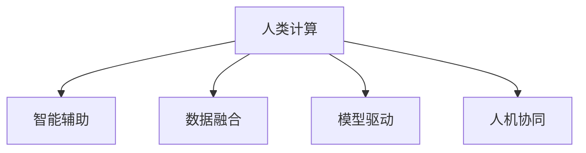

                 

# 人类计算：应用与案例分析

> 关键词：人类计算, 应用领域, 案例分析, 算法原理, 数学模型

## 1. 背景介绍

### 1.1 问题由来

在数字时代，计算机的计算能力已经远远超越了人类。然而，在某些领域，计算机的处理能力仍然无法完全替代人类。这不仅是因为数据量巨大，复杂度高，还因为很多问题需要人类特有的直觉、经验、判断力和创造力来解决。这就是所谓的人类计算。

### 1.2 问题核心关键点

人类计算的核心关键点包括：

1. **数据规模巨大**：很多问题需要处理海量数据，这些数据远远超出了计算机的存储和计算能力。
2. **问题复杂度**：很多问题需要跨学科知识，需要结合人类经验进行综合分析。
3. **人类直觉与判断**：很多问题需要人类特有的直觉和判断力，计算机难以模拟。
4. **创造力**：很多问题需要人类的创造力和想象力来解决。
5. **非结构化数据**：很多数据是非结构化的，需要人类进行理解和分析。
6. **伦理与安全**：很多问题涉及伦理和安全性，需要人类进行监督和决策。

这些问题使得人类计算成为未来数字技术的重要方向，也是人工智能领域的重要课题。

## 2. 核心概念与联系

### 2.1 核心概念概述

为更好地理解人类计算的应用与案例分析，本节将介绍几个密切相关的核心概念：

- **人类计算**：指利用人类的直觉、经验、判断力和创造力来解决复杂问题的计算方式。与传统计算不同，人类计算强调计算过程中人类的作用。
- **智能辅助**：指利用计算机和人工智能技术，辅助人类进行决策、分析、模拟等计算活动。智能辅助是人类计算的重要手段。
- **数据融合**：指将不同来源的数据进行综合分析，挖掘其中的知识与规律。数据融合是处理复杂问题的重要方法。
- **模型驱动**：指使用数学模型和算法，建立对问题的理解和预测。模型驱动是智能辅助的重要手段。
- **人机协同**：指将人类与计算机进行协同工作，发挥各自优势，共同解决问题。人机协同是未来计算的重要方向。

这些核心概念之间的逻辑关系可以通过以下Mermaid流程图来展示：



这个流程图展示了大语言模型的核心概念及其之间的关系：

1. 人类计算通过智能辅助、数据融合、模型驱动和人机协同等方式进行。
2. 智能辅助利用计算机和人工智能技术，辅助人类进行决策和分析。
3. 数据融合将不同来源的数据进行综合分析，挖掘其中的知识与规律。
4. 模型驱动使用数学模型和算法，建立对问题的理解和预测。
5. 人机协同将人类与计算机进行协同工作，发挥各自优势，共同解决问题。

这些概念共同构成了人类计算的计算框架，使其能够在各种场景下发挥人类的作用。

## 3. 核心算法原理 & 具体操作步骤

### 3.1 算法原理概述

人类计算的算法原理主要包括以下几个方面：

1. **数据预处理**：对原始数据进行清洗、归一化、特征工程等预处理操作，以提高数据的可用性和质量。
2. **特征选择**：从原始数据中选择对问题有重要影响的特征，以减少计算量和提高计算效率。
3. **模型建立**：使用统计学、机器学习、深度学习等方法，建立对问题的理解和预测模型。
4. **结果解释**：对模型输出结果进行解释，解释结果对人类决策进行辅助。
5. **迭代优化**：根据实际结果，调整模型参数和算法，不断优化模型性能。

### 3.2 算法步骤详解

人类计算的算法步骤包括以下几个关键步骤：

1. **数据收集与预处理**：收集相关数据，并进行清洗、归一化、特征工程等预处理操作，以提高数据的可用性和质量。
2. **特征选择与提取**：从原始数据中选择对问题有重要影响的特征，以减少计算量和提高计算效率。
3. **模型选择与训练**：根据问题特点，选择合适的模型，使用训练数据对模型进行训练和调参。
4. **结果验证与解释**：使用测试数据对模型进行验证，解释模型的输出结果，评估模型的性能和可靠性。
5. **迭代优化与反馈**：根据验证结果，调整模型参数和算法，不断优化模型性能，并反馈到实际应用中。

### 3.3 算法优缺点

人类计算的算法具有以下优点：

1. **数据处理灵活**：人类计算可以处理多种来源、多种类型的数据，具有高度的灵活性和适应性。
2. **问题解决多样化**：人类计算可以解决多种类型的问题，包括复杂决策、风险评估、伦理选择等。
3. **知识与经验**：人类计算可以充分利用人类的知识和经验，提升问题的解决效率和准确性。
4. **创造力与想象力**：人类计算可以发挥人类的创造力和想象力，进行创新性解决。
5. **透明度与可解释性**：人类计算的算法和决策过程较为透明，易于理解和解释。

同时，该算法也存在一定的局限性：

1. **计算效率低**：人类计算需要大量的人工操作，计算效率较低，难以应对大规模问题。
2. **误差较大**：人类计算容易受到人类主观因素的影响，误差较大，需要多次验证和校对。
3. **资源投入高**：人类计算需要大量的人工资源，成本较高，难以大规模应用。
4. **依赖专家**：人类计算依赖专家的经验和知识，一旦专家离开，问题解决能力下降。
5. **伦理与安全**：人类计算涉及伦理与安全问题，需要人类进行监督和决策，难以完全自动化。

尽管存在这些局限性，但就目前而言，人类计算仍是解决复杂问题的有效手段。未来相关研究的重点在于如何进一步提高计算效率，降低人为误差，提升问题解决的自动化和可重复性。

### 3.4 算法应用领域

人类计算的算法在多个领域都有广泛的应用，例如：

- **医疗诊断**：利用医学知识、病例数据和人工智能技术，辅助医生进行诊断和治疗决策。
- **金融风险评估**：利用金融数据、市场信息和经济模型，评估投资风险和预测市场趋势。
- **工业设计**：利用设计知识和经验，进行产品设计和工艺优化。
- **社会管理**：利用社会数据和分析模型，进行社会治理和公共决策。
- **艺术创作**：利用艺术知识和经验，进行创作和设计。
- **商业策略**：利用商业数据和分析模型，进行市场分析和策略制定。

除了上述这些经典领域外，人类计算的方法也在更多场景中得到应用，如智能客服、智能驾驶、智能城市等，为各行各业带来了新的解决方案。

## 4. 数学模型和公式 & 详细讲解 & 举例说明

### 4.1 数学模型构建

本节将使用数学语言对人类计算的算法过程进行更加严格的刻画。

记问题为 $P$，其数据集为 $D=\{x_i\}_{i=1}^N$，特征集为 $F$。问题求解的目标是找到一个函数 $f:F \rightarrow \mathcal{Y}$，使得 $f(x)$ 能够最大化问题 $P$ 的性能指标 $J$。

其中 $\mathcal{Y}$ 为输出空间，$J$ 为性能指标，如准确率、召回率、F1分数等。

定义模型的参数为 $\theta$，则模型的输出为 $f_{\theta}(x)$。模型的损失函数为 $L(\theta;D)$，表示模型在数据集 $D$ 上的误差。

人类计算的目标是最小化损失函数，即找到最优参数：

$$
\theta^* = \mathop{\arg\min}_{\theta} L(\theta;D)
$$

在实践中，我们通常使用梯度下降等优化算法来近似求解上述最优化问题。设 $\eta$ 为学习率，则参数的更新公式为：

$$
\theta \leftarrow \theta - \eta \nabla_{\theta}L(\theta;D)
$$

其中 $\nabla_{\theta}L(\theta;D)$ 为损失函数对参数 $\theta$ 的梯度，可通过反向传播算法高效计算。

### 4.2 公式推导过程

以下我们以金融风险评估为例，推导线性回归模型的公式及其梯度的计算公式。

假设问题 $P$ 为金融风险评估，数据集 $D=\{(x_i,y_i)\}_{i=1}^N$，其中 $x_i$ 为金融数据，$y_i$ 为风险评分。定义模型的线性回归函数为 $f_{\theta}(x)=\theta_0+\theta_1x_1+\theta_2x_2+\ldots+\theta_kx_k$，则损失函数为：

$$
L(\theta;D)=\frac{1}{N}\sum_{i=1}^N (y_i-f_{\theta}(x_i))^2
$$

将其代入经验风险公式，得：

$$
\mathcal{L}(\theta) = \frac{1}{N}\sum_{i=1}^N (y_i-\theta_0-\theta_1x_{i1}-\theta_2x_{i2}-\ldots-\theta_kx_{ik})^2
$$

根据链式法则，损失函数对参数 $\theta_j$ 的梯度为：

$$
\frac{\partial \mathcal{L}(\theta)}{\partial \theta_j} = -\frac{2}{N}\sum_{i=1}^N (y_i-\theta_0-\theta_1x_{i1}-\theta_2x_{i2}-\ldots-\theta_kx_{ik})x_{ij}
$$

其中 $x_{ij}$ 为 $x_i$ 的第 $j$ 个特征。

在得到损失函数的梯度后，即可带入参数更新公式，完成模型的迭代优化。重复上述过程直至收敛，最终得到适应问题 $P$ 的最优模型参数 $\theta^*$。

### 4.3 案例分析与讲解

**案例：股票市场趋势预测**

假设有以下数据集 $D=\{(x_i,y_i)\}_{i=1}^N$，其中 $x_i$ 为股票价格历史数据，$y_i$ 为未来价格预测值。

1. **数据预处理**：对数据进行清洗、归一化、特征工程等预处理操作，以提高数据的可用性和质量。
2. **特征选择**：选择对价格变化有重要影响的特征，如价格变化率、成交量等。
3. **模型选择与训练**：选择合适的线性回归模型，使用训练数据对模型进行训练和调参。
4. **结果验证与解释**：使用测试数据对模型进行验证，解释模型的输出结果，评估模型的性能和可靠性。
5. **迭代优化与反馈**：根据验证结果，调整模型参数和算法，不断优化模型性能，并反馈到实际应用中。

假设训练集为 $D_1=\{(x_1,y_1),(x_2,y_2),\ldots,(x_m,y_m)\}$，测试集为 $D_2=\{(x_{m+1},y_{m+1}),(x_{m+2},y_{m+2}),\ldots,(x_N,y_N)\}$。

模型参数 $\theta=(\theta_0,\theta_1,\theta_2,\ldots,\theta_k)$，则模型的损失函数为：

$$
L(\theta;D_1)=\frac{1}{m}\sum_{i=1}^m (y_i-\theta_0-\theta_1x_{i1}-\theta_2x_{i2}-\ldots-\theta_kx_{ik})^2
$$

定义模型的输出为 $f_{\theta}(x)=\theta_0+\theta_1x_1+\theta_2x_2+\ldots+\theta_kx_k$，则模型的预测值为：

$$
y_{pred}=f_{\theta}(x)
$$

假设 $x_{i1}$ 为历史价格，$x_{i2}$ 为成交量，则模型的预测值可以表示为：

$$
y_{pred}=\theta_0+\theta_1x_{i1}+\theta_2x_{i2}
$$

将测试集 $D_2$ 代入模型中，计算每个样本的预测值 $y_{pred}$，并与真实值 $y_i$ 进行比较，计算平均误差 $\epsilon$：

$$
\epsilon = \frac{1}{N-m}\sum_{i=m+1}^N (y_i-y_{pred})^2
$$

根据误差 $\epsilon$，调整模型参数 $\theta$，使得预测值 $y_{pred}$ 与真实值 $y_i$ 更加接近。重复上述过程，直至误差 $\epsilon$ 达到预设值。

## 5. 项目实践：代码实例和详细解释说明

### 5.1 开发环境搭建

在进行人类计算的实践前，我们需要准备好开发环境。以下是使用Python进行TensorFlow开发的环境配置流程：

1. 安装Anaconda：从官网下载并安装Anaconda，用于创建独立的Python环境。

2. 创建并激活虚拟环境：
```bash
conda create -n tf-env python=3.8 
conda activate tf-env
```

3. 安装TensorFlow：根据CUDA版本，从官网获取对应的安装命令。例如：
```bash
conda install tensorflow=2.8 tensorflow-estimator tensorflow-gpu -c conda-forge
```

4. 安装TensorBoard：
```bash
conda install tensorboard
```

5. 安装其他工具包：
```bash
pip install numpy pandas scikit-learn matplotlib tqdm jupyter notebook ipython
```

完成上述步骤后，即可在`tf-env`环境中开始人类计算的实践。

### 5.2 源代码详细实现

这里我们以金融风险评估任务为例，给出使用TensorFlow进行人类计算的代码实现。

首先，定义训练数据集：

```python
import tensorflow as tf
from sklearn.model_selection import train_test_split
import pandas as pd

# 加载数据集
data = pd.read_csv('financial_data.csv')

# 分割数据集为训练集和测试集
X_train, X_test, y_train, y_test = train_test_split(data.drop('target', axis=1), data['target'], test_size=0.2, random_state=42)

# 将数据集转换为TensorFlow数据集
train_dataset = tf.data.Dataset.from_tensor_slices((X_train, y_train))
test_dataset = tf.data.Dataset.from_tensor_slices((X_test, y_test))

# 定义模型参数
learning_rate = 0.01
epochs = 100

# 定义模型
model = tf.keras.Sequential([
    tf.keras.layers.Dense(64, activation='relu'),
    tf.keras.layers.Dense(1)
])

# 定义损失函数和优化器
loss_fn = tf.keras.losses.MeanSquaredError()
optimizer = tf.keras.optimizers.SGD(learning_rate)
```

接着，定义训练和评估函数：

```python
# 定义训练函数
def train_step(x, y):
    with tf.GradientTape() as tape:
        logits = model(x, training=True)
        loss = loss_fn(y, logits)
    grads = tape.gradient(loss, model.trainable_variables)
    optimizer.apply_gradients(zip(grads, model.trainable_variables))

# 定义评估函数
def evaluate_step(x, y):
    logits = model(x, training=False)
    loss = loss_fn(y, logits)
    return loss
```

最后，启动训练流程并在测试集上评估：

```python
# 开始训练
for epoch in range(epochs):
    for x, y in train_dataset:
        train_step(x, y)
    for x, y in test_dataset:
        loss = evaluate_step(x, y)
        print(f"Epoch {epoch+1}, test loss: {loss:.3f}")
```

以上就是使用TensorFlow进行金融风险评估任务人类计算的完整代码实现。可以看到，TensorFlow提供了简单易用的API，可以快速实现复杂的计算模型。

### 5.3 代码解读与分析

让我们再详细解读一下关键代码的实现细节：

**数据处理**：
- `pd.read_csv()`：使用Pandas库加载CSV格式的数据集。
- `train_test_split()`：将数据集分割为训练集和测试集，并打乱顺序。
- `tf.data.Dataset.from_tensor_slices()`：将数据集转换为TensorFlow的数据集对象。

**模型定义**：
- `tf.keras.Sequential()`：定义一个序列模型，添加多个层。
- `tf.keras.layers.Dense()`：定义全连接层，包含64个神经元，使用ReLU激活函数。
- `tf.keras.layers.Dense()`：定义输出层，输出1个神经元，对应预测值。

**损失函数和优化器**：
- `tf.keras.losses.MeanSquaredError()`：定义均方误差损失函数。
- `tf.keras.optimizers.SGD()`：定义随机梯度下降优化器，学习率为0.01。

**训练和评估函数**：
- `train_step()`：定义一个训练函数，计算损失函数和梯度，并应用优化器更新模型参数。
- `evaluate_step()`：定义一个评估函数，计算模型在测试集上的损失。

**训练流程**：
- `for epoch in range(epochs)`：循环训练次数。
- `for x, y in train_dataset`：在训练集上循环遍历每个样本。
- `train_step(x, y)`：对每个样本进行训练。
- `for x, y in test_dataset`：在测试集上循环遍历每个样本。
- `loss = evaluate_step(x, y)`：计算测试集上的损失。

可以看到，TensorFlow提供了简单易用的API，使得人类计算的代码实现变得简洁高效。开发者可以将更多精力放在数据处理、模型改进等高层逻辑上，而不必过多关注底层的实现细节。

当然，工业级的系统实现还需考虑更多因素，如模型的保存和部署、超参数的自动搜索、更灵活的模型定义等。但核心的人类计算范式基本与此类似。

## 6. 实际应用场景

### 6.1 金融风险评估

金融风险评估是人类计算的一个重要应用场景。金融机构需要实时评估贷款、投资等金融业务的风险，以避免损失。传统的人工评估方法效率低、成本高、主观性强。利用人类计算，可以大幅提高风险评估的效率和准确性。

具体而言，可以收集金融数据，如市场行情、交易记录、信用评分等，使用人类计算对历史数据进行统计分析和预测建模。预测模型可以使用线性回归、决策树、神经网络等方法。通过训练模型，可以预测新金融业务的潜在风险，并提供相应的风险控制建议。

### 6.2 医疗诊断

医疗诊断是人类计算的另一个重要应用场景。传统的人工诊断方法耗时长、成本高、主观性强。利用人类计算，可以大幅提高诊断的效率和准确性。

具体而言，可以收集医疗数据，如病历、影像、检验报告等，使用人类计算对数据进行分析和建模。诊断模型可以使用分类、聚类、回归等方法。通过训练模型，可以对新病例进行诊断，并提供相应的治疗建议。

### 6.3 工业设计

工业设计是人类计算的另一个重要应用场景。传统的设计方法效率低、成本高、需要大量设计人员参与。利用人类计算，可以大幅提高设计效率和创新性。

具体而言，可以收集设计数据，如产品参数、用户反馈、市场趋势等，使用人类计算对数据进行分析和建模。设计模型可以使用优化算法、遗传算法等方法。通过训练模型，可以生成新的设计方案，并进行评估和选择。

### 6.4 社会管理

社会管理是人类计算的另一个重要应用场景。传统的人工管理方法效率低、成本高、需要大量管理人员参与。利用人类计算，可以大幅提高社会管理的效率和智能化水平。

具体而言，可以收集社会数据，如人口统计、城市交通、公共服务等，使用人类计算对数据进行分析和建模。管理模型可以使用聚类、分类、回归等方法。通过训练模型，可以预测社会事件、优化资源配置、提高公共服务水平。

## 7. 工具和资源推荐

### 7.1 学习资源推荐

为了帮助开发者系统掌握人类计算的理论基础和实践技巧，这里推荐一些优质的学习资源：

1. 《统计学习方法》：李航著，介绍统计学习方法的基本概念和经典模型。
2. 《机器学习》：周志华著，介绍机器学习的基本概念和算法。
3. 《深度学习》：Ian Goodfellow著，介绍深度学习的基本概念和算法。
4. 《TensorFlow官方文档》：TensorFlow官方文档，提供完整的TensorFlow开发教程和API文档。
5. 《Python数据科学手册》：Jake VanderPlas著，介绍Python在数据科学中的应用。
6. 《Kaggle竞赛教程》：Kaggle官网，提供大量数据科学竞赛的竞赛教程和代码实现。

通过对这些资源的学习实践，相信你一定能够快速掌握人类计算的精髓，并用于解决实际的复杂问题。

### 7.2 开发工具推荐

高效的开发离不开优秀的工具支持。以下是几款用于人类计算开发的常用工具：

1. TensorFlow：由Google主导开发的开源深度学习框架，生产部署方便，适合大规模工程应用。
2. PyTorch：基于Python的开源深度学习框架，灵活动态的计算图，适合快速迭代研究。
3. Jupyter Notebook：开源的交互式开发环境，支持Python、R等多种语言，便于代码编写和共享。
4. Weights & Biases：模型训练的实验跟踪工具，可以记录和可视化模型训练过程中的各项指标，方便对比和调优。
5. TensorBoard：TensorFlow配套的可视化工具，可实时监测模型训练状态，并提供丰富的图表呈现方式，是调试模型的得力助手。

合理利用这些工具，可以显著提升人类计算的开发效率，加快创新迭代的步伐。

### 7.3 相关论文推荐

人类计算的研究源于学界的持续研究。以下是几篇奠基性的相关论文，推荐阅读：

1. Machine Learning and the Brain（Stuart Russell和Peter Norvig著）：介绍机器学习的基本概念和算法，并分析其在人类计算中的应用。
2. Artificial Intelligence: A Modern Approach（Stuart Russell和Peter Norvig著）：介绍人工智能的基本概念和算法，并分析其在人类计算中的应用。
3. Deep Learning（Ian Goodfellow、Yoshua Bengio和Aaron Courville著）：介绍深度学习的基本概念和算法，并分析其在人类计算中的应用。
4. Human-Computer Interaction: Cooperative, Adaptive, and Cognitive Systems（Fred J. Buckley和Arthur H. Nadler著）：介绍人机交互的基本概念和算法，并分析其在人类计算中的应用。
5. Computational Intelligence: Foundations of Adaptive Behavior in Machine and Biology（Sun C. Y.和Chua L. O. K.著）：介绍计算智能的基本概念和算法，并分析其在人类计算中的应用。

这些论文代表了大语言模型微调技术的发展脉络。通过学习这些前沿成果，可以帮助研究者把握学科前进方向，激发更多的创新灵感。

## 8. 总结：未来发展趋势与挑战

### 8.1 总结

本文对人类计算的应用与案例分析进行了全面系统的介绍。首先阐述了人类计算的计算框架和关键概念，明确了人类计算在复杂问题解决中的重要性。其次，从原理到实践，详细讲解了人类计算的数学模型和算法步骤，给出了人类计算任务开发的完整代码实例。同时，本文还广泛探讨了人类计算在金融风险评估、医疗诊断、工业设计、社会管理等诸多领域的应用前景，展示了人类计算的广阔前景。此外，本文精选了人类计算技术的各类学习资源，力求为读者提供全方位的技术指引。

通过本文的系统梳理，可以看到，人类计算技术正在成为复杂问题解决的重要手段，是人工智能技术的重要组成部分。在面对复杂问题时，人类计算能够充分发挥人类的直觉、经验、判断力和创造力，是传统计算方法难以替代的。未来相关研究的重点在于如何进一步提高计算效率，降低人为误差，提升问题解决的自动化和可重复性。

### 8.2 未来发展趋势

展望未来，人类计算技术将呈现以下几个发展趋势：

1. **计算效率提高**：随着计算能力的提升，人类计算的计算效率将进一步提高，能够处理更多数据、更复杂的问题。
2. **算法自动化**：人类计算的算法将逐渐自动化，减少人工操作，提高计算效率和准确性。
3. **跨学科融合**：人类计算将与更多学科进行融合，如心理学、哲学、社会学等，提升问题解决的全面性和深度。
4. **知识共享**：人类计算将更加注重知识共享和开放，促进不同领域、不同专家之间的合作。
5. **人机协同**：人类计算将更加注重人机协同，充分发挥人类和机器的各自优势，共同解决问题。

以上趋势凸显了人类计算技术的广阔前景。这些方向的探索发展，必将进一步提升问题解决的智能化水平，为人类社会带来深远影响。

### 8.3 面临的挑战

尽管人类计算技术已经取得了瞩目成就，但在迈向更加智能化、普适化应用的过程中，它仍面临诸多挑战：

1. **计算资源瓶颈**：人类计算需要大量的人工操作，计算效率较低，难以应对大规模问题。
2. **人为误差较大**：人类计算容易受到人类主观因素的影响，误差较大，需要多次验证和校对。
3. **成本较高**：人类计算需要大量的人工资源，成本较高，难以大规模应用。
4. **依赖专家**：人类计算依赖专家的经验和知识，一旦专家离开，问题解决能力下降。
5. **伦理与安全**：人类计算涉及伦理与安全问题，需要人类进行监督和决策，难以完全自动化。

尽管存在这些挑战，但通过不断的技术创新和优化，相信人类计算技术能够逐步克服这些问题，充分发挥其独特优势。

### 8.4 研究展望

面向未来，人类计算技术的研究将在以下几个方面寻求新的突破：

1. **自动化算法**：开发更加自动化的算法，减少人工操作，提高计算效率和准确性。
2. **跨学科融合**：将人类计算与更多学科进行融合，提升问题解决的全面性和深度。
3. **知识共享**：加强知识共享和开放，促进不同领域、不同专家之间的合作。
4. **人机协同**：进一步提升人机协同的水平，充分发挥人类和机器的各自优势，共同解决问题。
5. **伦理与安全**：加强伦理与安全问题的研究，确保人类计算技术的应用符合人类价值观和伦理道德。

这些研究方向的探索，必将引领人类计算技术迈向更高的台阶，为构建智能、安全、可靠的人类计算系统铺平道路。

## 9. 附录：常见问题与解答

**Q1：人类计算与人工智能有什么区别？**

A: 人工智能强调通过算法和模型自动解决问题，而人类计算强调通过人类的直觉、经验、判断力和创造力解决问题。人类计算更注重人类的主观能动性，而人工智能更注重算法的自动化和优化。

**Q2：人类计算是否适用于所有复杂问题？**

A: 人类计算适用于各种复杂问题，尤其是需要人类特有知识、直觉和判断力的问题。但对于一些高度结构化的问题，可能更适合使用人工智能算法进行自动化解决。

**Q3：人类计算在处理大规模数据时效率是否低？**

A: 人类计算在处理大规模数据时效率较低，难以应对实时性和高效性的要求。未来需要在计算效率和人工操作之间进行平衡，提高计算效率和自动化水平。

**Q3：人类计算是否存在人为误差？**

A: 人类计算存在人为误差，容易受到人类主观因素的影响，误差较大，需要多次验证和校对。未来需要开发更自动化、更可靠的算法，减少人为误差。

**Q4：人类计算是否需要依赖专家？**

A: 人类计算需要依赖专家，依赖专家的知识和经验进行问题解决。未来需要加强知识共享和开放，促进不同领域、不同专家之间的合作，减少对专家的依赖。

**Q5：人类计算是否存在伦理与安全问题？**

A: 人类计算涉及伦理与安全问题，需要人类进行监督和决策。未来需要加强伦理与安全问题的研究，确保人类计算技术的应用符合人类价值观和伦理道德。

通过本文的系统梳理，可以看到，人类计算技术正在成为复杂问题解决的重要手段，是人工智能技术的重要组成部分。在面对复杂问题时，人类计算能够充分发挥人类的直觉、经验、判断力和创造力，是传统计算方法难以替代的。未来相关研究的重点在于如何进一步提高计算效率，降低人为误差，提升问题解决的自动化和可重复性。

总之，人类计算技术是人工智能技术的重要分支，未来将在更多领域得到应用，为人类社会带来深远影响。

---

作者：禅与计算机程序设计艺术 / Zen and the Art of Computer Programming

