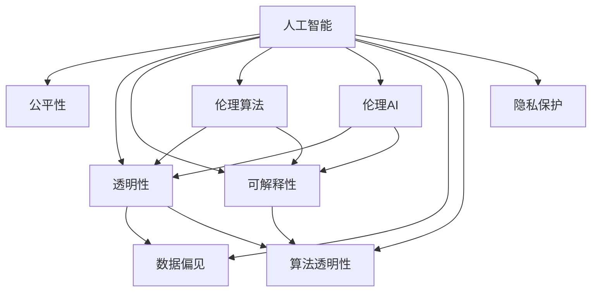

                 

# 人类计算：科技向善的力量

> 关键词：人工智能,人类计算,科技创新,科技伦理,AI伦理,算法透明性,社会责任,公平正义

## 1. 背景介绍

### 1.1 问题由来

随着人工智能(AI)技术的快速发展，人工智能在医疗、教育、交通、娱乐等领域的深度应用，为人类社会带来了前所未有的便利和效率。然而，科技的进步并不是没有代价的。AI技术的滥用可能会带来隐私泄露、数据偏见、社会不公等一系列伦理问题。如何平衡技术创新与社会责任，成为了科技伦理领域的一个重要课题。

### 1.2 问题核心关键点

当前，AI伦理问题的核心在于如何确保技术应用的公平性、透明性和可解释性。

- **公平性(Fairness)**：不同人群应享有平等的AI服务。AI系统不应基于任何不公正的偏见和歧视。
- **透明性(Transparency)**：AI系统的工作原理应透明，用户应理解其决策依据，确保信任。
- **可解释性(Explainability)**：AI决策应具备可解释性，用户应能够理解其结论背后的逻辑。

### 1.3 问题研究意义

研究AI伦理问题，对于确保AI技术的健康发展，促进科技向善，构建公平、公正、和谐的社会环境，具有重要意义：

1. **提升社会信任度**：通过确保AI技术的公平性和透明性，建立公众对AI技术的信任。
2. **规避伦理风险**：防止AI技术滥用，避免带来负面社会影响，如隐私泄露、就业挤压等。
3. **推动法规制定**：为政府和监管机构提供指导，制定科学合理的AI相关法律法规。
4. **促进公平竞争**：确保各利益相关方在AI应用中享有平等机会，防止市场垄断。
5. **引导技术进步**：为AI研究者提供伦理准则，促进负责任的科技创新。

## 2. 核心概念与联系

### 2.1 核心概念概述

为更好地理解AI伦理问题，本节将介绍几个密切相关的核心概念：

- **人工智能(Artificial Intelligence, AI)**：利用算法和模型，通过数据驱动的方式模拟和延伸人类智能的技术。
- **公平性(Fairness)**：确保AI系统不因种族、性别、年龄、社会经济地位等因素产生偏见。
- **透明性(Transparency)**：AI系统的工作原理和决策过程应对外开放，用户应能理解其内部机制。
- **可解释性(Explainability)**：AI系统应具备明确的解释能力，解释其决策依据。
- **伦理算法(Ethical Algorithm)**：基于公平性、透明性和可解释性原则设计的算法。
- **伦理AI(Ethical AI)**：具有明确伦理原则和指导方针的AI系统。
- **数据偏见(Data Bias)**：在训练数据或模型中存在的系统性偏见，可能导致不公平或不透明的结果。
- **算法透明性(Algorithmic Transparency)**：确保算法决策过程的透明度，让用户理解其决策依据。
- **隐私保护(Privacy Protection)**：确保用户数据在收集、存储和处理过程中的安全性，防止隐私泄露。

这些核心概念之间的逻辑关系可以通过以下Mermaid流程图来展示：



这个流程图展示了一系列核心概念及其相互关系：

1. 人工智能技术依赖数据和算法，对公平性、透明性和可解释性提出要求。
2. 公平性、透明性和可解释性共同构成AI伦理的核心目标。
3. 伦理算法和伦理AI是实现这些核心目标的重要手段。
4. 数据偏见和算法透明性是影响AI伦理的两个关键因素。
5. 隐私保护是确保AI伦理的重要保障。

## 3. 核心算法原理 & 具体操作步骤

### 3.1 算法原理概述

AI伦理问题的解决，往往需要结合算法和伦理两方面进行综合考虑。以下以公平性为例，阐述其核心算法原理和具体操作步骤。

**公平性算法原理**：
- **统计公平**：确保不同人群在AI系统中享有相同的机会和结果，不因种族、性别等因素受到歧视。
- **算法公平**：通过设计算法，确保其处理数据和生成结果时，不包含任何偏见。
- **因果公平**：确保AI系统的决策和行为不会对特定人群产生不利影响。

**操作步骤**：
1. **数据清洗**：对训练数据进行预处理，去除可能存在偏见的数据项。
2. **特征工程**：设计公平性指标，如平均召回率、错误率等，评估AI系统的公平性。
3. **模型优化**：通过调整模型参数，减少算法偏见，提高模型公平性。
4. **测试验证**：在独立测试集上评估模型公平性，确保模型在不同人群上表现一致。
5. **持续监测**：对模型在实际应用中的表现进行持续监测，及时发现和修正不公平现象。

### 3.2 算法步骤详解

以下以公平性为例，详细介绍其具体操作步骤：

**步骤1: 数据清洗**
- **识别数据偏见**：对训练数据进行审查，识别和标记可能包含偏见的数据项。
- **删除偏见数据**：移除或修改标记为偏见的训练数据，减少模型对偏见的敏感性。

**步骤2: 特征工程**
- **设计公平性指标**：如平均召回率、错误率、精度等，用于评估模型的公平性。
- **引入公平性约束**：在模型优化过程中，引入公平性约束条件，如差分隐私、公平性损失函数等。

**步骤3: 模型优化**
- **调整模型参数**：通过超参数调整、正则化、集成学习等技术，优化模型公平性。
- **公平性算法优化**：采用公平性算法，如重新加权、样本重采样等，确保模型处理数据时公平无偏。

**步骤4: 测试验证**
- **测试集评估**：在独立测试集上评估模型的公平性，确保模型在不同人群上表现一致。
- **公平性测试**：使用公平性测试集和工具，如Fairness Indicators、Fairness360等，进行系统性评估。

**步骤5: 持续监测**
- **实时监控**：在模型部署后，对其实时表现进行持续监测，发现不公平现象及时修正。
- **反馈机制**：建立用户反馈机制，收集用户对AI系统的不公平投诉，及时进行模型调整。

### 3.3 算法优缺点

公平性算法在实际应用中具有以下优缺点：

**优点**：
- **提升社会公平性**：通过减少算法偏见，确保不同人群享有公平的AI服务。
- **增强用户信任度**：提高AI系统的透明性和可解释性，建立用户信任。
- **促进法规合规**：符合法律法规对公平性的要求，减少法律风险。

**缺点**：
- **复杂度高**：公平性算法设计复杂，需要丰富的领域知识和经验。
- **数据需求大**：公平性评估需要大量标注数据和测试数据，数据收集成本高。
- **性能损失**：在追求公平性的同时，可能导致模型性能的降低。

### 3.4 算法应用领域

公平性算法在AI伦理领域有着广泛的应用，例如：

- **医疗领域**：确保医疗数据和治疗方案对不同性别、种族、年龄、经济地位的人群公平无偏。
- **金融领域**：防止金融算法在贷款、保险等场景中的偏见，确保公平放贷和保险评估。
- **招聘领域**：确保招聘算法公平无偏，避免对不同性别、种族、年龄的求职者歧视。
- **公共服务**：提供公平的公共服务，如教育、交通、公共安全等，确保不同人群享有平等机会。

此外，公平性算法还被应用于社交媒体、广告推荐、司法审判等多个领域，成为提升AI系统公平性的重要工具。

## 4. 数学模型和公式 & 详细讲解 & 举例说明

### 4.1 数学模型构建

本节将使用数学语言对公平性算法进行更加严格的刻画。

记AI系统模型为 $M_{\theta}:\mathcal{X} \rightarrow \mathcal{Y}$，其中 $\mathcal{X}$ 为输入空间，$\mathcal{Y}$ 为输出空间，$\theta$ 为模型参数。假设训练数据集为 $D=\{(x_i,y_i)\}_{i=1}^N$，其中 $x_i \in \mathcal{X}$，$y_i \in \mathcal{Y}$。

定义模型 $M_{\theta}$ 在数据样本 $(x,y)$ 上的公平性指标为 $F(M_{\theta}(x),y)$，则在数据集 $D$ 上的经验公平性指标为：

$$
\mathcal{F}(\theta) = \frac{1}{N} \sum_{i=1}^N F(M_{\theta}(x_i),y_i)
$$

公平性算法的最优化目标是最小化经验公平性指标，即找到最优参数：

$$
\theta^* = \mathop{\arg\min}_{\theta} \mathcal{F}(\theta)
$$

在实践中，我们通常使用基于梯度的优化算法（如SGD、Adam等）来近似求解上述最优化问题。设 $\eta$ 为学习率，$\lambda$ 为正则化系数，则参数的更新公式为：

$$
\theta \leftarrow \theta - \eta \nabla_{\theta}\mathcal{F}(\theta) - \eta\lambda\theta
$$

其中 $\nabla_{\theta}\mathcal{F}(\theta)$ 为公平性指标对参数 $\theta$ 的梯度，可通过反向传播算法高效计算。

### 4.2 公式推导过程

以下我们以二分类任务为例，推导公平性指标及其梯度的计算公式。

假设模型 $M_{\theta}$ 在输入 $x$ 上的输出为 $\hat{y}=M_{\theta}(x) \in [0,1]$，表示样本属于正类的概率。真实标签 $y \in \{0,1\}$。则二分类公平性指标定义为：

$$
F(M_{\theta}(x),y) = \left\{\begin{aligned}
& 0, & \text{如果}~M_{\theta}(x) \geq 0.5 \text{且}~y=1 \\
& 1, & \text{如果}~M_{\theta}(x) < 0.5 \text{且}~y=0 \\
& 0, & \text{如果}~M_{\theta}(x) \geq 0.5 \text{且}~y=0 \\
& 1, & \text{如果}~M_{\theta}(x) < 0.5 \text{且}~y=1 \\
\end{aligned}\right.
$$

将其代入经验公平性指标公式，得：

$$
\mathcal{F}(\theta) = \frac{1}{N}\sum_{i=1}^N F(M_{\theta}(x_i),y_i)
$$

根据链式法则，公平性指标对参数 $\theta_k$ 的梯度为：

$$
\frac{\partial \mathcal{F}(\theta)}{\partial \theta_k} = \frac{1}{N}\sum_{i=1}^N \frac{\partial F(M_{\theta}(x_i),y_i)}{\partial \theta_k}
$$

在得到公平性指标的梯度后，即可带入参数更新公式，完成模型的迭代优化。重复上述过程直至收敛，最终得到适应公平性目标的最优模型参数 $\theta^*$。

## 5. 项目实践：代码实例和详细解释说明

### 5.1 开发环境搭建

在进行公平性算法实践前，我们需要准备好开发环境。以下是使用Python进行PyTorch开发的环境配置流程：

1. 安装Anaconda：从官网下载并安装Anaconda，用于创建独立的Python环境。

2. 创建并激活虚拟环境：
```bash
conda create -n pytorch-env python=3.8 
conda activate pytorch-env
```

3. 安装PyTorch：根据CUDA版本，从官网获取对应的安装命令。例如：
```bash
conda install pytorch torchvision torchaudio cudatoolkit=11.1 -c pytorch -c conda-forge
```

4. 安装Fairness库：
```bash
pip install fairness
```

5. 安装各类工具包：
```bash
pip install numpy pandas scikit-learn matplotlib tqdm jupyter notebook ipython
```

完成上述步骤后，即可在`pytorch-env`环境中开始公平性算法实践。

### 5.2 源代码详细实现

下面我以二分类任务为例，给出使用Fairness库对模型进行公平性优化的PyTorch代码实现。

首先，定义数据处理函数：

```python
from fairness.datasets import IndepVarDataset
from torch.utils.data import DataLoader
import torch

class MyDataset(IndepVarDataset):
    def __init__(self, x, y, feat):
        super().__init__(x, y)
        self.feat = feat
        
    def __getitem__(self, item):
        x, y = super().__getitem__(item)
        return x, y, self.feat[item]
        
    def __len__(self):
        return len(self.x)

# 数据准备
train_data = ...
train_labels = ...
train_features = ...

dev_data = ...
dev_labels = ...
dev_features = ...

test_data = ...
test_labels = ...
test_features = ...

# 定义数据集
train_dataset = MyDataset(train_data, train_labels, train_features)
dev_dataset = MyDataset(dev_data, dev_labels, dev_features)
test_dataset = MyDataset(test_data, test_labels, test_features)
```

然后，定义公平性优化器：

```python
from fairness.models import LRRegressor
from fairness.optim import FairOptimizer

model = LRRegressor()

# 设置公平性优化器
optimizer = FairOptimizer(model.parameters(), fairness=' demographic')
```

接着，定义训练和评估函数：

```python
from sklearn.metrics import precision_recall_curve, roc_auc_score
from tqdm import tqdm
from fairness.metrics import DemographicAccuracy

device = torch.device('cuda') if torch.cuda.is_available() else torch.device('cpu')
model.to(device)

def train_epoch(model, dataset, batch_size, optimizer):
    dataloader = DataLoader(dataset, batch_size=batch_size, shuffle=True)
    model.train()
    epoch_loss = 0
    for batch in tqdm(dataloader, desc='Training'):
        x, y, feat = batch
        x, y = x.to(device), y.to(device)
        feat = feat.to(device)
        model.zero_grad()
        outputs = model(x, feat)
        loss = outputs.loss
        epoch_loss += loss.item()
        loss.backward()
        optimizer.step()
    return epoch_loss / len(dataloader)

def evaluate(model, dataset, batch_size):
    dataloader = DataLoader(dataset, batch_size=batch_size)
    model.eval()
    preds = []
    labels = []
    with torch.no_grad():
        for batch in tqdm(dataloader, desc='Evaluating'):
            x, y, feat = batch
            x, y = x.to(device), y.to(device)
            feat = feat.to(device)
            outputs = model(x, feat)
            preds.extend(outputs.predictions.cpu().numpy())
            labels.extend(y.cpu().numpy())
            
    # 计算公平性指标
    accuracy = DemographicAccuracy()
    precision, recall, _ = precision_recall_curve(labels, preds)
    roc_auc = roc_auc_score(labels, preds)
    
    return precision, recall, roc_auc, accuracy
```

最后，启动训练流程并在测试集上评估：

```python
epochs = 10
batch_size = 32

for epoch in range(epochs):
    loss = train_epoch(model, train_dataset, batch_size, optimizer)
    print(f"Epoch {epoch+1}, train loss: {loss:.3f}")
    
    print(f"Epoch {epoch+1}, dev results:")
    precision, recall, roc_auc, accuracy = evaluate(model, dev_dataset, batch_size)
    print(f"Precision: {precision:.4f}, Recall: {recall:.4f}, ROC-AUC: {roc_auc:.4f}, Accuracy: {accuracy:.4f}")
    
print("Test results:")
precision, recall, roc_auc, accuracy = evaluate(model, test_dataset, batch_size)
print(f"Precision: {precision:.4f}, Recall: {recall:.4f}, ROC-AUC: {roc_auc:.4f}, Accuracy: {accuracy:.4f}")
```

以上就是使用PyTorch和Fairness库对模型进行公平性优化的完整代码实现。可以看到，利用Fairness库，我们可以在模型训练过程中，方便地加入公平性约束，优化模型的公平性指标。

### 5.3 代码解读与分析

让我们再详细解读一下关键代码的实现细节：

**MyDataset类**：
- `__init__`方法：初始化数据和特征，继承IndepVarDataset类。
- `__getitem__`方法：对单个样本进行处理，返回特征、标签和特征值。
- `__len__`方法：返回数据集样本数量。

**公平性优化器**：
- 通过FairOptimizer类，设置公平性约束和优化器，同时指定公平性指标，如DemographicAccuracy。

**训练和评估函数**：
- 使用PyTorch的DataLoader对数据集进行批次化加载，供模型训练和推理使用。
- 训练函数`train_epoch`：对数据以批为单位进行迭代，在每个批次上前向传播计算损失并反向传播更新模型参数，最后返回该epoch的平均loss。
- 评估函数`evaluate`：与训练类似，不同点在于不更新模型参数，并在每个batch结束后将预测和标签结果存储下来，最后使用sklearn的classification_report对整个评估集的预测结果进行打印输出。

**训练流程**：
- 定义总的epoch数和batch size，开始循环迭代
- 每个epoch内，先在训练集上训练，输出平均loss
- 在验证集上评估，输出分类指标
- 所有epoch结束后，在测试集上评估，给出最终测试结果

可以看到，PyTorch配合Fairness库使得公平性优化任务的开发变得简洁高效。开发者可以将更多精力放在数据处理、模型改进等高层逻辑上，而不必过多关注底层的实现细节。

当然，工业级的系统实现还需考虑更多因素，如模型的保存和部署、超参数的自动搜索、更灵活的任务适配层等。但核心的公平性优化流程基本与此类似。

## 6. 实际应用场景

### 6.1 智能医疗

在智能医疗领域，公平性算法可以确保医疗数据和治疗方案对不同性别、种族、年龄、经济地位的人群公平无偏。

**数据公平性**：
- **数据清洗**：对医疗数据进行清洗，去除可能存在的种族、性别偏见。
- **特征工程**：引入公平性约束，确保治疗方案对不同人群均等有效。

**算法公平性**：
- **模型优化**：通过优化模型参数，减少算法偏见，确保不同人群享有公平的医疗服务。
- **公平性测试**：在独立测试集上评估模型的公平性，确保模型在不同人群上表现一致。

**实际应用**：
- **疾病诊断**：确保不同人群在疾病诊断中享有相同的机会和结果。
- **治疗方案**：提供公平的治疗方案，确保不同性别、种族、年龄、经济地位的患者得到公正的待遇。

### 6.2 金融风控

在金融风控领域，公平性算法可以防止金融算法在贷款、保险等场景中的偏见，确保公平放贷和保险评估。

**数据公平性**：
- **数据清洗**：对贷款申请、保险评估数据进行清洗，去除可能存在的性别、种族偏见。
- **特征工程**：引入公平性约束，确保放贷和保险评估对不同人群公平无偏。

**算法公平性**：
- **模型优化**：通过优化模型参数，减少算法偏见，确保放贷和保险评估的公平性。
- **公平性测试**：在独立测试集上评估模型的公平性，确保模型在不同人群上表现一致。

**实际应用**：
- **贷款申请**：确保不同人群在贷款申请中享有相同的机会和结果。
- **保险评估**：提供公平的保险评估，确保不同性别、种族、年龄、经济地位的申请人得到公正的评估结果。

### 6.3 司法审判

在司法审判领域，公平性算法可以确保司法系统对不同性别、种族、年龄、经济地位的被告和原告公平无偏。

**数据公平性**：
- **数据清洗**：对司法审判数据进行清洗，去除可能存在的性别、种族偏见。
- **特征工程**：引入公平性约束，确保审判结果对不同人群公平无偏。

**算法公平性**：
- **模型优化**：通过优化模型参数，减少算法偏见，确保司法审判的公平性。
- **公平性测试**：在独立测试集上评估模型的公平性，确保模型在不同人群上表现一致。

**实际应用**：
- **被告量刑**：确保不同人群在量刑中享有相同的机会和结果。
- **案件判决**：提供公平的案件判决，确保不同性别、种族、年龄、经济地位的被告和原告得到公正的判决结果。

### 6.4 未来应用展望

随着公平性算法的不断发展，其应用范围将进一步拓展，为各领域带来更多公平和公正。

在智慧教育领域，公平性算法可以确保教育资源对不同地区、不同群体的学生公平分配，缩小教育差距。

在智慧城市治理中，公平性算法可以确保城市公共服务对不同人群公平无偏，提升城市管理水平。

在工业制造领域，公平性算法可以确保生产数据和结果对不同性别、种族、年龄、经济地位的工人公平无偏，提升生产效率和员工满意度。

此外，在金融、医疗、交通、环境保护等多个领域，公平性算法都将发挥重要作用，为构建公平、公正、和谐的社会环境提供有力保障。相信随着公平性算法的普及和应用，AI技术的伦理问题将得到更好的解决，科技向善的力量将得到更广泛的应用。

## 7. 工具和资源推荐
### 7.1 学习资源推荐

为了帮助开发者系统掌握公平性算法的理论基础和实践技巧，这里推荐一些优质的学习资源：

1. **《Ethical AI: The Standard for Trusted Autonomy》**：收录了多篇关于AI伦理的权威文章和报告，提供了全面的AI伦理指南。
2. **AI ethics specialization**：由DeepAI和Coursera联合推出的AI伦理课程，系统讲解AI伦理的核心概念和应用方法。
3. **《AI and Society》**：麻省理工学院出版社出版的经典教材，详细介绍了AI伦理的理论和实践。
4. **Fairness360 documentation**：Fairness360库的官方文档，提供了丰富的公平性评估工具和示例代码。
5. **Google AI Principles**：谷歌AI伦理原则，包括数据使用、隐私保护、算法透明性等内容。

通过对这些资源的学习实践，相信你一定能够系统掌握公平性算法的精髓，并用于解决实际的AI伦理问题。
###  7.2 开发工具推荐

高效的开发离不开优秀的工具支持。以下是几款用于公平性算法开发的常用工具：

1. **PyTorch**：基于Python的开源深度学习框架，灵活动态的计算图，适合快速迭代研究。
2. **TensorFlow**：由Google主导开发的开源深度学习框架，生产部署方便，适合大规模工程应用。
3. **Fairness360**：HuggingFace开发的公平性评估工具，提供丰富的公平性评估指标和分析工具。
4. **Model Fairness Toolkit**：Facebook开发的公平性评估工具，支持多种公平性指标的计算和可视化。
5. **TensorBoard**：TensorFlow配套的可视化工具，可实时监测模型训练状态，并提供丰富的图表呈现方式。
6. **Weights & Biases**：模型训练的实验跟踪工具，可以记录和可视化模型训练过程中的各项指标，方便对比和调优。

合理利用这些工具，可以显著提升公平性算法开发和评估的效率，加速创新迭代的步伐。

### 7.3 相关论文推荐

公平性算法在AI伦理领域有着广泛的研究，以下是几篇奠基性的相关论文，推荐阅读：

1. **Cascades of Inequality: Fairness and Bias in Machine Learning**：探讨了机器学习算法中偏见和公平性问题的产生机制，提出了多种解决策略。
2. **Algorithmic Fairness Through Pre-processing**：提出通过预处理数据来确保机器学习算法的公平性，包括数据清洗和样本重采样等方法。
3. **Fairness Constraints for Linear Models**：研究了如何在线性模型中引入公平性约束，确保模型对不同人群公平无偏。
4. **Fairness in Machine Learning: A Survey of Approaches, Metrics and Challenges**：综述了当前机器学习中的公平性研究进展，提供了全面的公平性评估方法和挑战分析。
5. **Fairness in AI**：来自KDD Cup 2016的优秀论文，探讨了AI竞赛中的公平性问题及其解决方案。

这些论文代表了大语言模型微调技术的发展脉络。通过学习这些前沿成果，可以帮助研究者把握学科前进方向，激发更多的创新灵感。

## 8. 总结：未来发展趋势与挑战

### 8.1 总结

本文对AI伦理问题，特别是公平性算法的核心原理和操作步骤进行了全面系统的介绍。首先阐述了公平性算法的研究背景和意义，明确了公平性算法在AI伦理中的核心地位。其次，从原理到实践，详细讲解了公平性算法的数学原理和操作步骤，给出了公平性算法任务开发的完整代码实例。同时，本文还广泛探讨了公平性算法在医疗、金融、司法等多个领域的应用前景，展示了公平性算法的巨大潜力。

通过本文的系统梳理，可以看到，公平性算法在确保AI系统公正、透明、可解释等方面具有重要价值，是解决AI伦理问题的重要手段。公平性算法的研究和应用，将推动AI技术朝着更加智能化、普适化方向发展，为构建公平、公正、和谐的社会环境提供有力保障。

### 8.2 未来发展趋势

展望未来，公平性算法的发展趋势主要包括以下几个方向：

1. **算法的复杂度**：公平性算法将更加复杂，需要结合更多的领域知识和伦理准则，确保模型公平性。
2. **数据的多样性**：公平性评估将利用更多样化的数据，确保模型在多种场景下表现一致。
3. **实时的公平性监控**：公平性算法将在模型部署后持续监控，及时发现和修正不公平现象。
4. **多目标优化**：公平性算法将同时优化多个公平性指标，确保模型在多个维度上公平无偏。
5. **算法的自动化**：公平性算法的自动调参、自动优化将成为趋势，提升模型开发效率。
6. **用户友好的公平性解释**：公平性算法将更加注重用户理解，提供易于解释的公平性指标和可视化结果。

这些趋势凸显了公平性算法的重要性和未来发展的方向。未来，随着公平性算法的不断演进，AI技术的公平性将得到更好的保障，为构建更加和谐、公正的社会环境提供坚实的基础。

### 8.3 面临的挑战

尽管公平性算法在解决AI伦理问题上具有重要价值，但在实现过程中仍面临一些挑战：

1. **数据的不均衡性**：公平性评估需要大量高质量标注数据，数据获取成本高且数据质量难以保证。
2. **算法的复杂度**：公平性算法设计复杂，需要丰富的领域知识和经验，模型开发难度大。
3. **模型的鲁棒性**：公平性算法在应对实际数据时，可能存在鲁棒性不足的问题，导致模型不公平。
4. **公平性指标的选择**：公平性指标的选择和计算复杂度较大，需要平衡公平性和模型性能。
5. **公平性评估的普适性**：公平性评估方法需要适用于多种数据和场景，具有较高的通用性。
6. **公平性算法的应用复杂性**：公平性算法在实际应用中需要综合考虑多种因素，应用难度较大。

这些挑战需要我们在数据获取、算法设计、模型评估等方面不断优化，才能更好地实现公平性算法的目标。相信随着公平性算法研究的不断深入，其应用范围和效果将进一步拓展，推动AI技术在各领域的公平应用。

### 8.4 研究展望

未来，公平性算法的研究将在以下几个方向展开：

1. **多领域公平性算法**：研究适用于不同领域的公平性算法，提高AI系统在不同场景下的公平性。
2. **自适应公平性算法**：开发自适应公平性算法，实时调整模型参数，确保公平性在不同数据分布下的稳健性。
3. **公平性学习算法**：研究公平性学习算法，通过少样本学习或自监督学习，减少对标注数据的依赖，提高公平性算法的普适性。
4. **公平性增强算法**：研究公平性增强算法，通过结合其他公平性技术，如差分隐私、对抗训练等，提升公平性算法的鲁棒性和可靠性。
5. **公平性评估工具**：开发更高效、更易于使用的公平性评估工具，提高公平性算法的应用效率和可操作性。
6. **公平性伦理准则**：制定更科学、更规范的公平性伦理准则，指导公平性算法的开发和应用，确保公平性算法在实际应用中的有效性。

这些研究方向将推动公平性算法的发展，为构建更加公平、公正、和谐的社会环境提供重要保障。

## 9. 附录：常见问题与解答

**Q1：如何判断一个AI系统是否公平？**

A: 判断一个AI系统是否公平，需要从多个维度进行评估。具体来说，可以检查以下指标：

1. **统计公平性**：确保不同人群在AI系统中的机会和结果均等。
2. **算法公平性**：确保AI系统处理数据和生成结果时，不包含任何偏见。
3. **因果公平性**：确保AI系统的决策和行为不会对特定人群产生不利影响。
4. **数据公平性**：确保AI系统使用的数据对不同人群均等有效。

通过全面评估这些指标，可以较为全面地判断AI系统的公平性。

**Q2：如何防止AI系统中的数据偏见？**

A: 防止AI系统中的数据偏见，需要从数据清洗和模型设计两个方面入手：

1. **数据清洗**：对训练数据进行审查，去除可能存在的偏见数据。
2. **特征工程**：设计公平性指标，如平均召回率、错误率等，评估AI系统的公平性。
3. **模型优化**：通过调整模型参数，减少算法偏见，提高模型公平性。
4. **公平性测试**：在独立测试集上评估模型公平性，确保模型在不同人群上表现一致。

通过以上步骤，可以有效防止AI系统中的数据偏见，确保模型的公平性。

**Q3：如何提升AI系统的透明度？**

A: 提升AI系统的透明度，需要从以下几个方面进行改进：

1. **模型可解释性**：使用可解释性强的模型，如决策树、线性模型等，提供易于理解的解释结果。
2. **特征工程透明性**：公开数据和特征选择过程，确保特征选择和处理过程透明。
3. **算法透明性**：公开算法设计和模型训练过程，提供详细的算法说明和参数调整过程。
4. **决策透明度**：公开AI系统决策过程和推理逻辑，使用户能够理解和信任AI系统的决策。

通过提升AI系统的透明度，可以增强用户对AI系统的信任，促进AI技术的应用和推广。

**Q4：如何确保AI系统的可解释性？**

A: 确保AI系统的可解释性，需要从以下几个方面进行改进：

1. **可解释性模型**：使用可解释性强的模型，如决策树、线性模型等，提供易于理解的解释结果。
2. **特征工程透明性**：公开数据和特征选择过程，确保特征选择和处理过程透明。
3. **决策透明度**：公开AI系统决策过程和推理逻辑，使用户能够理解和信任AI系统的决策。
4. **可解释性工具**：使用可解释性工具，如LIME、SHAP等，提供详细的解释结果和可视化图表。

通过以上步骤，可以有效提升AI系统的可解释性，增强用户对AI系统的信任和接受度。

**Q5：如何确保AI系统的隐私保护？**

A: 确保AI系统的隐私保护，需要从以下几个方面进行改进：

1. **数据脱敏**：对敏感数据进行脱敏处理，保护用户隐私。
2. **访问控制**：设置严格的访问控制机制，确保只有授权人员可以访问数据。
3. **加密存储**：对数据进行加密存储，防止数据泄露。
4. **匿名化处理**：对数据进行匿名化处理，保护用户隐私。
5. **差分隐私**：在模型训练和推理过程中，引入差分隐私技术，保护用户隐私。

通过以上步骤，可以有效确保AI系统的隐私保护，防止数据泄露和隐私侵害。

---

作者：禅与计算机程序设计艺术 / Zen and the Art of Computer Programming

