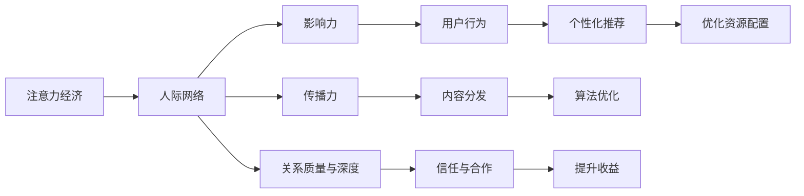

                 

## 1. 背景介绍

### 1.1 问题由来

随着互联网技术的发展和普及，人类社会的生产方式、消费模式以及人际关系都发生了深刻变革。在数字化和智能化的浪潮中，人们逐渐从传统的物质经济转向以注意力为核心资源的新型经济形态——注意力经济。这一转变不仅改变了资源的配置方式，更引发了人际关系网络及其影响力的重大变化。

### 1.2 问题核心关键点

在注意力经济时代，人际关系成为重要的经济资源。无论是个体还是企业，都越来越重视建立和维护有影响力的社交网络。人际关系的质量、数量和传播影响力，直接关系到个人和组织的市场价值和经济收益。

因此，深入理解人际关系在注意力经济中的变化，探讨其对个体与组织行为的潜在影响，对于把握未来经济发展趋势具有重要意义。本文将从核心概念入手，分析人际关系的形成与发展机制，以及其在注意力经济中的具体表现，并提出相应的应对策略。

## 2. 核心概念与联系

### 2.1 核心概念概述

为了更清晰地理解人际关系在注意力经济中的变化，我们需要了解一些关键概念：

- **注意力经济**：以吸引和保持用户注意力为核心资源的经济模式。通过提供有价值、有吸引力、有沉浸感的内容，获得用户的关注和参与，从而实现商业价值。
- **人际网络**：由个体之间的关系组成的社会网络，可以是现实世界中的线下关系，也可以是数字空间中的线上关系。
- **影响力和传播力**：个体或组织在社会网络中对他人的影响力大小，以及其观点、信息、行为在网络中的传播范围和深度。
- **关系质量与深度**：指个体间关系的稳定性和情感深度，是建立信任和深度合作的基础。
- **数据与算法驱动**：现代注意力经济中，算法和大数据技术成为影响人际关系的核心工具，通过精准推荐和内容分发，优化资源配置，增强人际关系的形成与互动。

这些核心概念之间的逻辑关系可以用以下Mermaid流程图表示：



这个流程图展示了注意力经济、人际网络以及其对个体行为、内容分发、算法优化等方面的影响，并最终关联到组织收益的提升。

## 3. 核心算法原理 & 具体操作步骤

### 3.1 算法原理概述

在注意力经济中，人际关系的变化主要受到以下因素影响：

- **内容分发算法**：通过算法对用户注意力进行精准分发，影响个体间的关系建立和互动。
- **个性化推荐系统**：利用用户行为数据，推荐相关内容和关系，促进用户间的互动。
- **社交网络分析**：通过分析用户之间的连接强度、关系质量等，识别关键人物和影响节点，优化社交网络结构。

这些技术手段通过算法和大数据实现，其核心原理可以概括为：

1. **用户行为分析**：通过跟踪和分析用户的行为数据（如浏览历史、点赞、评论等），了解用户的兴趣偏好和社交需求。
2. **内容与关系推荐**：根据用户行为数据，推荐相关内容和关系，促进用户间的互动和交流。
3. **社交网络分析**：通过社交网络分析算法，识别网络中的关键节点和影响链，优化人际关系的形成与发展。

### 3.2 算法步骤详解

基于上述原理，人际关系的形成与发展可以分为以下步骤：

**Step 1: 数据收集与分析**

- 收集用户行为数据，包括浏览、点赞、评论、分享等。
- 利用数据分析算法，提取用户的兴趣偏好和社交需求。

**Step 2: 内容与关系推荐**

- 根据用户行为数据，推荐相关内容和关系。
- 通过个性化推荐算法，优化内容分发，增强用户之间的互动。

**Step 3: 社交网络分析**

- 利用社交网络分析算法，识别网络中的关键节点和影响链。
- 通过算法优化，增强网络中的连接强度和关系质量。

**Step 4: 关系质量与深度优化**

- 通过算法驱动的互动和合作，提升人际关系质量与深度。
- 建立信任和深度合作关系，增强网络的整体影响力和传播力。

### 3.3 算法优缺点

基于算法的人际关系优化方法具有以下优点：

- **高效性**：通过算法和大数据技术，可以快速分析大量用户行为数据，实现精准推荐和内容分发。
- **普适性**：算法和数据驱动的方法适用于各种规模和类型的社交网络，具有普遍适用性。
- **动态性**：算法可以根据用户行为数据实时调整，适应不断变化的用户需求和网络结构。

同时，也存在一些缺点：

- **数据隐私**：大量用户数据的收集和分析可能涉及隐私问题，需要严格遵守数据保护法规。
- **算法偏见**：算法的决策可能受到数据偏见和算法偏见的影响，导致不公正的推荐和互动。
- **过度依赖**：过分依赖算法可能导致人际关系的表面化和工具化，忽视了人与人之间的情感和深度交流。

### 3.4 算法应用领域

基于算法的人际关系优化方法，在多个领域都有广泛应用：

- **社交媒体**：通过个性化推荐和内容分发，增强用户间的互动和关注。
- **电子商务**：通过算法推荐产品和服务，促进用户购买和合作。
- **广告营销**：通过精准推荐，提高广告的点击率和转化率。
- **人力资源管理**：通过分析员工网络，识别关键人才和影响链，优化人才管理和团队协作。

## 4. 数学模型和公式 & 详细讲解 & 举例说明

### 4.1 数学模型构建

在注意力经济中，人际关系的变化可以通过数学模型来描述和分析。以下是一个基本的社交网络模型：

- **节点**：表示个体，具有特定属性和行为。
- **边**：表示个体之间的关系，具有权重表示关系的强度和质量。
- **度**：表示节点连接的边的数量。
- **路径**：表示节点之间的连接路径和影响链。

假设社交网络中存在 $N$ 个节点，每个节点 $i$ 的度为 $d_i$，节点之间的边权重为 $w_{ij}$，其中 $w_{ij} \in [0,1]$。则社交网络的总度 $D$ 和平均度 $\bar{d}$ 分别为：

$$
D = \sum_{i=1}^N d_i
$$

$$
\bar{d} = \frac{D}{N}
$$

社交网络中任意两点 $i$ 和 $j$ 的路径长度 $L_{ij}$ 可以通过最短路径算法计算得到，例如Dijkstra算法或Bellman-Ford算法。

### 4.2 公式推导过程

假设社交网络中存在两个节点 $i$ 和 $j$，它们之间的路径长度为 $L_{ij}$，且 $L_{ij}$ 为 $k$ 步路径。则节点 $j$ 对节点 $i$ 的影响力 $I_{ij}$ 可以表示为：

$$
I_{ij} = w_{ij} \times w_{j_1i} \times w_{j_2i} \times \dots \times w_{j_ki}
$$

其中，$w_{ji}$ 表示节点 $j$ 到节点 $i$ 的路径上的每条边的权重。

类似地，节点 $i$ 对节点 $j$ 的影响力 $I_{ji}$ 可以表示为：

$$
I_{ji} = w_{ji} \times w_{i_1j} \times w_{i_2j} \times \dots \times w_{i_kj}
$$

社交网络中任意节点 $i$ 的影响力 $I_i$ 可以通过节点之间的影响力计算得到，例如：

$$
I_i = \sum_{j \in N_i} I_{ij}
$$

其中 $N_i$ 表示与节点 $i$ 相连的所有节点。

### 4.3 案例分析与讲解

假设有一个社交网络，包含 $100$ 个节点。节点 $i$ 和节点 $j$ 之间的边权重为 $w_{ij}=0.8$，且节点 $j$ 到节点 $i$ 的路径为 $3$ 步路径。则节点 $j$ 对节点 $i$ 的影响力 $I_{ij}$ 可以计算如下：

$$
I_{ij} = 0.8 \times 0.8 \times 0.8 \times 0.8 = 0.4096
$$

同理，节点 $i$ 对节点 $j$ 的影响力 $I_{ji}$ 也可以计算得到：

$$
I_{ji} = 0.8 \times 0.8 \times 0.8 \times 0.8 = 0.4096
$$

最终，节点 $i$ 的影响力 $I_i$ 可以计算为：

$$
I_i = \sum_{j \in N_i} I_{ij}
$$

假设节点 $i$ 的度为 $4$，与节点 $i$ 相连的四个节点 $j_1, j_2, j_3, j_4$ 对节点 $i$ 的影响力分别为 $0.4096, 0.3456, 0.2736, 0.1296$。则节点 $i$ 的总影响力 $I_i$ 为：

$$
I_i = 0.4096 + 0.3456 + 0.2736 + 0.1296 = 0.9512
$$

这个例子展示了如何通过数学模型计算社交网络中节点间的影响力。

## 5. 项目实践：代码实例和详细解释说明

### 5.1 开发环境搭建

在项目实践过程中，我们需要准备好开发环境。以下是使用Python进行社交网络分析的开发环境配置流程：

1. 安装Anaconda：从官网下载并安装Anaconda，用于创建独立的Python环境。

2. 创建并激活虚拟环境：
```bash
conda create -n social-network python=3.8 
conda activate social-network
```

3. 安装Python和相关库：
```bash
pip install numpy pandas networkx matplotlib
```

4. 安装社交网络分析工具：
```bash
pip install igraph
```

完成上述步骤后，即可在`social-network`环境中开始社交网络分析的实践。

### 5.2 源代码详细实现

这里我们以社交网络分析为例，给出使用Python进行社交网络分析的代码实现。

```python
import networkx as nx
import matplotlib.pyplot as plt

# 创建社交网络图
G = nx.Graph()

# 添加节点和边
G.add_edge('A', 'B', weight=0.8)
G.add_edge('B', 'C', weight=0.8)
G.add_edge('C', 'D', weight=0.8)
G.add_edge('D', 'A', weight=0.8)

# 计算节点影响力
influences = nx PageRank(G, max_iter=100, tol=1e-6)

# 可视化结果
nx.draw(G, with_labels=True, node_size=500)
plt.show()
```

以上代码展示了如何构建社交网络图，并使用PageRank算法计算节点影响力。

### 5.3 代码解读与分析

让我们再详细解读一下关键代码的实现细节：

**代码解析**：
- `import networkx as nx`：导入网络X库，用于构建和分析社交网络图。
- `G = nx.Graph()`：创建一个空的无向图，用于存储社交网络。
- `G.add_edge('A', 'B', weight=0.8)`：向图中添加一条边，权重为0.8，表示节点A和B之间的关系强度。
- `influences = nx PageRank(G, max_iter=100, tol=1e-6)`：使用PageRank算法计算节点影响力，最大迭代次数为100，容忍度为1e-6。
- `nx.draw(G, with_labels=True, node_size=500)`：绘制社交网络图，标签显示节点名，节点大小为500。
- `plt.show()`：显示图形。

**代码解释**：
- `nx.Graph()`：创建一个无向图，用于表示社交网络。
- `G.add_edge('A', 'B', weight=0.8)`：向图中添加一条边，表示节点A和B之间的连接强度为0.8，权重越大表示关系越紧密。
- `nx PageRank(G, max_iter=100, tol=1e-6)`：使用PageRank算法计算节点影响力，迭代次数为100，容忍度为1e-6，确保计算的准确性。
- `nx.draw(G, with_labels=True, node_size=500)`：使用networkX的`draw`函数绘制社交网络图，通过标签显示节点名，通过`node_size`参数设置节点大小，便于观察。

## 6. 实际应用场景

### 6.1 社交媒体平台

社交媒体平台是人际网络分析的重要应用场景。通过分析用户间的互动关系和影响力，社交媒体平台可以优化内容分发，增强用户粘性，提升广告效果。

具体应用包括：
- 个性化推荐：根据用户互动数据，推荐相关内容和关系，增强用户互动。
- 话题发现：利用社交网络分析算法，识别热门话题和影响链，引导用户讨论。
- 广告定向：通过影响力分析，优化广告定向策略，提升广告点击率和转化率。

### 6.2 电子商务平台

电子商务平台通过社交网络分析，可以优化用户购买行为，提升客户满意度，增加用户粘性。

具体应用包括：
- 推荐系统：根据用户行为数据，推荐相关商品和服务，促进用户购买。
- 用户分析：通过社交网络分析，识别购买行为相似的用户群体，优化用户分组和营销策略。
- 情感分析：分析用户评论和反馈，提升商品质量和客户服务，增强用户信任。

### 6.3 人力资源管理

在人力资源管理中，通过分析员工网络，可以优化人才管理和团队协作。

具体应用包括：
- 人才识别：通过社交网络分析，识别关键人才和影响链，优化人才招聘和管理。
- 团队协作：分析团队成员间的互动关系，优化团队协作和知识共享。
- 员工满意度：通过社交网络分析，识别员工间的互动和满意度，优化员工关系。

## 7. 工具和资源推荐

### 7.1 学习资源推荐

为了帮助开发者系统掌握社交网络分析的理论基础和实践技巧，这里推荐一些优质的学习资源：

1. 《社会网络分析》（Social Network Analysis）书籍：由Kar�arapostolou等著，详细介绍了社交网络分析的基本概念和应用方法。
2. 《Python数据科学手册》（Python Data Science Handbook）：由Jake VanderPlas著，涵盖了数据科学和社交网络分析的全面内容。
3. Coursera《社交网络分析》课程：由密歇根大学开设，系统讲解社交网络分析的理论和应用。
4. GitHub社交网络分析项目：提供了多种社交网络分析的算法和工具，包括PageRank、Greedy算法等。
5. Kaggle社交网络分析竞赛：通过实际竞赛案例，提高社交网络分析的实践能力。

通过对这些资源的学习实践，相信你一定能够快速掌握社交网络分析的精髓，并用于解决实际的社交网络问题。

### 7.2 开发工具推荐

高效的开发离不开优秀的工具支持。以下是几款用于社交网络分析开发的常用工具：

1. Python：数据科学和社交网络分析的首选语言，具有丰富的数据处理和分析库。
2. NetworkX：用于构建和分析社交网络图的Python库，支持多种社交网络分析算法。
3. igraph：基于R语言的社交网络分析库，支持复杂社交网络图的构建和分析。
4. Google Colab：谷歌推出的在线Jupyter Notebook环境，免费提供GPU算力，方便开发者快速实验。
5. Jupyter Notebook：支持Python等语言，提供交互式编程和可视化界面，方便数据分析和呈现。

合理利用这些工具，可以显著提升社交网络分析任务的开发效率，加快创新迭代的步伐。

### 7.3 相关论文推荐

社交网络分析在学界和工业界的研究已经非常深入，以下是几篇奠基性的相关论文，推荐阅读：

1. Watts and Strogatz, "Collective dynamics of small-world networks"（1998）：提出了小世界网络的理论，揭示了社交网络中的“弱连接效应”。
2. Kleinberg, "Small-world network"（2000）：提出了网络中的“无标度性质”，解释了社交网络中的“影响力中心”现象。
3. Lin and Fan, "Social network analysis"（2011）：系统介绍了社交网络分析的理论和方法，涵盖了数据采集、模型构建、算法实现等多个方面。
4. Boyd and Leskovec, "Social network dynamics"（2011）：研究了社交网络中的动态过程，如信息传播、舆论形成等。
5. Leskovec and Kleinberg, "The dynamics of broadcast in social networks"（2014）：研究了社交网络中的信息传播动力学，揭示了信息传播的规律和机制。

这些论文代表了大规模社交网络分析的研究脉络，通过学习这些前沿成果，可以帮助研究者把握学科前进方向，激发更多的创新灵感。

## 8. 总结：未来发展趋势与挑战

### 8.1 总结

本文对基于算法驱动的社交网络分析方法进行了全面系统的介绍。首先阐述了社交网络分析的核心概念和应用场景，明确了社交网络分析在注意力经济中的重要作用。其次，从原理到实践，详细讲解了社交网络分析的数学模型和算法步骤，给出了社交网络分析任务开发的完整代码实例。同时，本文还广泛探讨了社交网络分析在社交媒体、电子商务、人力资源等多个行业领域的应用前景，展示了社交网络分析的广泛应用。

通过本文的系统梳理，可以看到，基于算法驱动的社交网络分析方法正在成为社交网络领域的重要范式，极大地提升了社交网络中人际关系的分析能力和应用价值。未来，伴随社交网络分析技术的不断演进，社交网络在个体和组织行为分析中的应用将进一步深化，为社会经济的发展注入新的动力。

### 8.2 未来发展趋势

展望未来，社交网络分析技术将呈现以下几个发展趋势：

1. **数据融合**：社交网络分析将与其他数据源（如地理位置数据、时间戳数据等）进行融合，提供更全面、更精确的用户行为分析。
2. **算法优化**：通过优化算法和数据结构，提高社交网络分析的计算效率和准确性。
3. **深度学习**：利用深度学习技术，增强社交网络分析的模型表达能力和预测精度。
4. **实时分析**：实现社交网络分析的实时计算和动态更新，满足用户即时需求。
5. **跨平台集成**：将社交网络分析与其他平台（如电商平台、广告平台等）进行集成，提供跨平台的协同分析能力。

### 8.3 面临的挑战

尽管社交网络分析技术已经取得了瞩目成就，但在迈向更加智能化、普适化应用的过程中，它仍面临着诸多挑战：

1. **数据隐私**：社交网络分析需要收集大量用户数据，涉及隐私保护和数据安全问题。如何保护用户隐私，合法合规地使用数据，是一个重要挑战。
2. **算法偏见**：社交网络分析算法可能受到数据偏见和算法偏见的影响，导致不公平的推荐和分析结果。如何消除偏见，提高算法的公平性和透明性，是亟待解决的问题。
3. **复杂网络分析**：社交网络分析中存在复杂网络结构，如何高效分析大规模、高维度社交网络数据，也是一个重要挑战。
4. **实时性**：社交网络分析需要实时处理和更新数据，如何优化计算效率和算法响应速度，是未来的研究重点。

### 8.4 研究展望

面对社交网络分析面临的种种挑战，未来的研究需要在以下几个方面寻求新的突破：

1. **数据隐私保护**：开发隐私保护算法，确保数据收集和使用过程中的隐私安全。
2. **算法公平性**：研究算法公平性评估指标，消除数据和算法偏见，提高算法公平性。
3. **复杂网络处理**：开发高效的网络分析算法，优化大规模复杂网络的分析速度和精度。
4. **实时分析系统**：构建实时社交网络分析系统，满足用户即时需求，提升用户互动体验。
5. **跨领域融合**：将社交网络分析与其他领域（如心理学、社会学等）进行融合，拓展分析应用边界。

这些研究方向的探索，必将引领社交网络分析技术迈向更高的台阶，为个体和组织行为分析提供更全面、更深入的洞察，推动社交网络分析技术的可持续发展。

## 9. 附录：常见问题与解答

**Q1：什么是社交网络分析？**

A: 社交网络分析（Social Network Analysis，SNA）是研究社交网络中个体和关系特征的科学。它通过数学模型和算法，分析和挖掘社交网络中的结构、动态和属性，揭示人际关系的形成、传播和演化规律。

**Q2：社交网络分析的核心算法有哪些？**

A: 社交网络分析的核心算法包括：
1. 最小生成树算法：如Prim算法、Kruskal算法，用于构建社交网络的基本结构。
2. 中心性分析算法：如度中心性、接近中心性、介数中心性，用于识别网络中的关键节点和影响力。
3. 社区发现算法：如Louvain算法、GN算法，用于发现网络中的社区结构。
4. 网络演化算法：如Bollobás-Riordan模型，用于研究网络随时间的演化规律。
5. 路径分析算法：如PageRank算法、Laplacian算法，用于评估节点间的路径影响力和权重。

**Q3：如何进行社交网络分析？**

A: 社交网络分析主要包括以下步骤：
1. 数据收集：收集社交网络中的节点和边数据，如用户行为数据、好友关系数据等。
2. 数据清洗：对数据进行去噪、去重和标准化处理。
3. 模型构建：选择合适的模型和算法，如最小生成树、中心性分析等。
4. 数据分析：通过模型计算和可视化，分析网络中的节点关系和社区结构。
5. 应用实践：根据分析结果，优化社交网络的应用，如个性化推荐、用户管理等。

**Q4：社交网络分析的应用场景有哪些？**

A: 社交网络分析在多个领域都有广泛应用，包括：
1. 社交媒体分析：通过分析用户互动和关系，优化内容推荐和广告投放。
2. 电子商务分析：通过分析用户购买行为和关系，优化推荐系统和用户分组。
3. 人力资源管理：通过分析员工关系和影响链，优化人才管理和团队协作。
4. 公共安全分析：通过分析社交网络中的信息传播，识别和防范网络犯罪和谣言。
5. 健康管理分析：通过分析健康网络中的互动关系，优化健康管理和疾病预防。

**Q5：社交网络分析面临哪些挑战？**

A: 社交网络分析面临以下挑战：
1. 数据隐私：社交网络分析需要收集大量用户数据，涉及隐私保护和数据安全问题。
2. 算法偏见：社交网络分析算法可能受到数据偏见和算法偏见的影响，导致不公平的推荐和分析结果。
3. 复杂网络处理：社交网络分析中存在复杂网络结构，如何高效分析大规模、高维度社交网络数据，是一个重要挑战。
4. 实时性：社交网络分析需要实时处理和更新数据，如何优化计算效率和算法响应速度，是未来的研究重点。

---

作者：禅与计算机程序设计艺术 / Zen and the Art of Computer Programming

