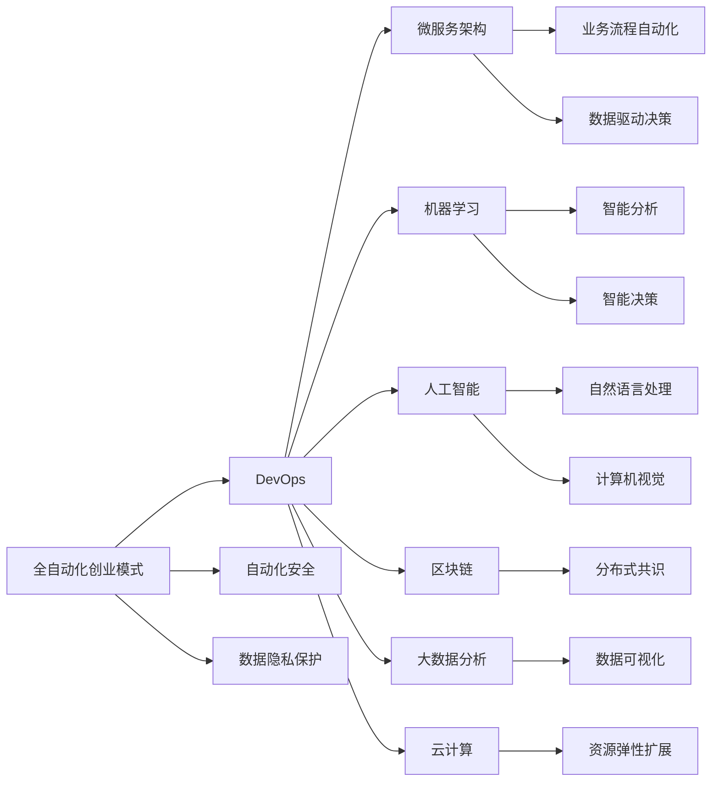

                 

## 1. 背景介绍

### 1.1 问题由来
在全球经济逐步迈向数字化转型的今天，自动化技术已经成为一个热门话题。其原因在于，自动化技术可以提高工作效率，减少人力成本，同时也能在生产过程中提供更加精准、稳定和一致的性能。而在创业模式中，全自动化更是能够快速响应市场需求，以极高的效率和灵活性进行资源调配，从而保持竞争优势。

然而，由于技术壁垒、成本高昂、实施难度大等因素，许多初创企业对于如何打造全自动化创业模式仍然感到困惑。而本篇文章将为你深入解读全自动化创业模式的原理、实现方法和未来发展趋势，助你在创业道路上赢得先机。

### 1.2 问题核心关键点
构建全自动化创业模式的关键点在于以下几个方面：

- **技术选择与架构设计**：选择合适的技术栈和架构模式，构建具有高度自动化、高可用性、高可扩展性的系统。
- **流程自动化**：将业务流程中的重复性、规律性、非关键性任务进行自动化，提升效率。
- **人工智能集成**：通过机器学习、自然语言处理、计算机视觉等人工智能技术，进一步提升系统的智能化水平。
- **持续集成与持续交付**：建立CI/CD流程，实现代码版本管理、自动化测试、自动部署等，加速产品迭代。
- **数据驱动决策**：依托大数据分析和业务智能，实现决策的精准化和智能化。
- **安全性与隐私保护**：在构建自动化系统时，必须考虑安全性和隐私保护，避免潜在风险。

只有全面理解这些关键点，才能真正实现全自动化创业模式，提升企业的核心竞争力。

## 2. 核心概念与联系

### 2.1 核心概念概述
为帮助读者更深刻地理解全自动化创业模式，下面列出一些核心概念及其联系：

- **全自动化创业模式**：利用自动化技术，实现企业运营、生产、管理等各个环节的全面自动化，从而大幅提升效率，降低成本，增强企业竞争力。

- **DevOps**：一种敏捷的软件开发生命周期方法，强调开发与运维的集成，通过持续集成、持续交付和持续部署等实践，提高软件交付效率和质量。

- **微服务架构**：一种架构风格，将应用拆分为多个小的、独立的服务单元，每个服务独立部署、独立运行，具备高可扩展性、高可用性和高可靠性。

- **机器学习**：一种人工智能技术，通过训练模型，让机器自动学习数据中的规律，并应用到新的数据中，提高决策和预测的准确性。

- **人工智能(AI)**：一个广泛的领域，包括机器学习、自然语言处理、计算机视觉、机器人学等，致力于使机器具有类似人类的智能。

- **区块链**：一种分布式数据库技术，通过加密和共识机制，实现去中心化、不可篡改的数据记录和共享。

- **大数据分析**：通过对海量数据的收集、存储、处理和分析，从中挖掘有价值的信息，支持决策制定。

- **云计算**：通过互联网提供计算服务，具备高可扩展性、高可用性和高可靠性，降低IT基础设施的运营成本。

这些概念之间存在着紧密的联系，共同构成了全自动化创业模式的技术框架。

### 2.2 核心概念原理和架构的 Mermaid 流程图



这个流程图展示了全自动化创业模式中各个概念之间的联系和相互影响。

## 3. 核心算法原理 & 具体操作步骤
### 3.1 算法原理概述

构建全自动化创业模式的算法原理主要基于以下几个方面：

- **自动化流程设计**：通过分析企业业务流程，识别可自动化的环节，设计自动化流程。
- **流程编排与调度**：通过编排引擎，实现自动化流程的编排和调度，确保任务按序执行。
- **智能决策支持**：结合业务智能和大数据分析，支持决策自动化和智能化。
- **持续集成与交付**：建立CI/CD流程，实现自动化的代码部署和版本管理，加速产品迭代。

### 3.2 算法步骤详解

构建全自动化创业模式的详细步骤包括：

1. **需求分析与业务流程建模**：分析业务流程，识别可自动化环节，设计自动化方案。
2. **技术选型与架构设计**：选择合适的技术栈和架构模式，构建自动化系统。
3. **自动化流程设计**：将业务流程中的重复性、规律性、非关键性任务进行自动化，设计自动化流程。
4. **编排与调度引擎开发**：开发编排与调度引擎，实现自动化流程的编排和调度。
5. **智能决策支持系统开发**：结合业务智能和大数据分析，开发智能决策支持系统。
6. **持续集成与持续交付(CI/CD)**：建立CI/CD流程，实现自动化的代码部署和版本管理。
7. **数据安全与隐私保护**：确保数据安全和隐私保护，避免潜在风险。

### 3.3 算法优缺点

构建全自动化创业模式的优势包括：

- **高效性**：通过自动化流程设计，大幅提升工作效率，减少人工干预。
- **可扩展性**：基于微服务架构，系统可按需扩展，满足业务快速增长的需求。
- **智能性**：结合AI和大数据分析，提升决策的精准度和智能化水平。
- **可靠性**：通过持续集成和持续交付，快速响应市场变化，保持竞争力。

然而，构建全自动化创业模式也存在一些缺点：

- **技术复杂度**：涉及多个技术领域的知识，实现难度大。
- **实施成本高**：需要大量的技术投入和资源支持。
- **安全与隐私风险**：数据安全和隐私保护需要特别关注，避免潜在风险。

### 3.4 算法应用领域

构建全自动化创业模式的技术和实践已经被广泛应用于多个领域，例如：

- **制造行业**：通过自动化设备和技术，实现生产流程的全面自动化，提高生产效率和质量。
- **金融行业**：通过自动化的风险控制、交易监控等系统，提升业务效率和风险管理能力。
- **零售行业**：通过自动化的库存管理、客户服务系统，提升运营效率和客户满意度。
- **医疗行业**：通过自动化的病历管理、诊断系统，提高医疗服务的效率和准确性。
- **能源行业**：通过自动化的设备监控、能源管理，提高资源利用率和安全性。
- **物流行业**：通过自动化的仓储管理、配送系统，提升物流效率和精准性。

## 4. 数学模型和公式 & 详细讲解 & 举例说明

### 4.1 数学模型构建

在全自动化创业模式中，我们可以构建以下数学模型：

1. **自动化流程模型**：定义自动化流程的输入、处理和输出，使用状态机描述自动化流程的执行顺序和状态转换。
2. **调度模型**：定义任务调度的优先级、依赖关系和时间窗口，使用图论描述任务的编排和调度。
3. **智能决策模型**：定义业务指标和决策变量，使用优化算法实现智能决策。
4. **持续集成模型**：定义代码的版本控制和自动化测试流程，使用状态图描述持续集成的过程。

### 4.2 公式推导过程

以下是几个关键的公式推导：

1. **状态机模型**：
   $$
   S_{next} = f(S_{current}, A)
   $$
   其中 $S_{current}$ 表示当前状态，$A$ 表示事件，$S_{next}$ 表示下一个状态。

2. **图论模型**：
   $$
   G(V,E)
   $$
   其中 $G$ 表示图，$V$ 表示顶点集，$E$ 表示边集。

3. **优化模型**：
   $$
   \min \sum_{i=1}^{n} c_i x_i
   $$
   $$
   \text{s.t.} \quad A x = b
   $$
   $$
   x_i \geq 0
   $$
   其中 $x_i$ 表示变量，$c_i$ 表示系数，$A$ 表示系数矩阵，$b$ 表示常数项。

4. **状态图模型**：
   $$
   G(V,E)
   $$
   其中 $G$ 表示状态图，$V$ 表示节点集，$E$ 表示边集。

### 4.3 案例分析与讲解

以制造行业为例，分析自动化流程的构建过程：

- **需求分析**：
  - 分析生产流程，识别可自动化环节。
  - 设计自动化方案，如设备监控、设备维护、生产调度等。

- **技术选型**：
  - 选择合适的技术栈，如MES系统（制造执行系统）。
  - 设计微服务架构，实现系统的高度模块化和可扩展性。

- **自动化流程设计**：
  - 设计生产流程的自动化流程，如设备监控自动化、生产调度自动化等。
  - 开发编排与调度引擎，实现自动化流程的编排和调度。

- **智能决策支持**：
  - 结合生产数据分析，构建智能决策支持系统，如设备故障预测、生产调度优化等。
  - 应用机器学习算法，实现预测和优化决策。

## 5. 项目实践：代码实例和详细解释说明

### 5.1 开发环境搭建

构建全自动化创业模式的开发环境包括以下步骤：

1. **环境配置**：
   - 安装Python和相关依赖包，如Flask、SQLAlchemy等。
   - 安装docker和kubernetes，搭建容器化环境。

2. **开发工具配置**：
   - 配置IDE，如PyCharm、VSCode等。
   - 配置版本控制系统，如Git。

3. **测试环境配置**：
   - 配置测试框架，如pytest。
   - 配置CI/CD工具，如Jenkins、Travis CI等。

4. **部署环境配置**：
   - 配置生产环境，如AWS、Azure等云平台。
   - 配置监控和日志工具，如Prometheus、ELK Stack等。

### 5.2 源代码详细实现

以下是一个自动化流程编排的Python代码实现：

```python
from flask import Flask, jsonify

app = Flask(__name__)

@app.route('/api/schedule', methods=['POST'])
def schedule():
    # 解析请求体，获取任务信息
    task_info = request.get_json()

    # 根据任务信息编排调度
    schedule_engine = ScheduleEngine()
    result = schedule_engine.schedule(task_info)

    # 返回结果
    return jsonify(result)

if __name__ == '__main__':
    app.run(debug=True)
```

### 5.3 代码解读与分析

以上代码展示了自动化流程编排的基本流程：

- **API设计**：定义了一个API，用于接受任务信息，并返回调度结果。
- **任务信息解析**：解析请求体，获取任务信息。
- **调度引擎设计**：使用ScheduleEngine类实现调度引擎，根据任务信息编排调度。
- **结果返回**：将调度结果返回给API客户端。

## 6. 实际应用场景

### 6.1 智能制造

智能制造是利用信息技术和自动化技术，实现制造全过程的数字化、网络化、智能化。通过构建全自动化创业模式，可以实现生产流程的全面自动化，提升生产效率和质量。

- **设备监控**：通过自动化设备监控系统，实现设备的实时监控、故障预测和维护。
- **生产调度**：通过生产调度系统，实现生产任务的自动排程和调度。
- **质量检测**：通过自动化质量检测系统，实现产品质量的自动检测和分析。

### 6.2 智能物流

智能物流是通过自动化技术，实现物流过程的高效管理和精准控制。通过构建全自动化创业模式，可以实现物流运营的全面自动化。

- **仓储管理**：通过自动化仓储管理系统，实现仓储设备的自动控制和物料的智能存储。
- **配送管理**：通过自动化配送系统，实现配送任务的自动调度和物流路径的优化。
- **库存管理**：通过自动化库存管理系统，实现库存数据的自动记录和分析。

### 6.3 智能客服

智能客服是通过自动化技术，实现客服过程的全面自动化。通过构建全自动化创业模式，可以实现客服流程的自动化和智能化。

- **问题识别**：通过自然语言处理技术，自动识别用户的问题。
- **智能应答**：通过智能应答系统，自动生成回答。
- **用户反馈**：通过自动化反馈系统，收集用户反馈，优化智能客服系统。

## 7. 工具和资源推荐

### 7.1 学习资源推荐

以下是一些推荐的资源，帮助读者学习全自动化创业模式：

1. **《DevOps：基础设施自动化》**：这本书详细介绍了DevOps的原理和实践，包括持续集成、持续部署、容器化技术等。

2. **《微服务架构设计》**：这本书讲解了微服务架构的设计原则和实现方法，涵盖微服务拆分、编排与调度等。

3. **《机器学习实战》**：这本书讲解了机器学习的基本原理和实战案例，帮助读者掌握机器学习技术。

4. **《人工智能：一种现代方法》**：这本书是人工智能领域的经典教材，讲解了人工智能的基本理论和实践。

5. **《云计算基础》**：这本书讲解了云计算的基本原理和实现方法，包括公有云、私有云和混合云等。

6. **《大数据分析与数据科学》**：这本书讲解了大数据分析的基本原理和实战案例，帮助读者掌握大数据分析技术。

### 7.2 开发工具推荐

以下是一些推荐的开发工具，帮助读者开发全自动化创业模式：

1. **Flask**：一个轻量级的Web框架，易于上手，适合开发API接口。
2. **Docker**：一个容器化技术，可以实现应用的自动化部署和运维。
3. **Kubernetes**：一个容器编排平台，可以实现应用的自动扩展和容错。
4. **Jenkins**：一个持续集成和持续交付工具，可以实现自动化构建和部署。
5. **Prometheus**：一个监控和告警系统，可以实现实时监控和告警。
6. **ELK Stack**：一个日志管理系统，可以实现集中式日志收集和分析。

### 7.3 相关论文推荐

以下是一些推荐的相关论文，帮助读者深入了解全自动化创业模式：

1. **《微服务架构的演进与挑战》**：这篇论文详细介绍了微服务架构的演进历程和面临的挑战。
2. **《云计算对企业转型的作用》**：这篇论文讲解了云计算对企业转型的影响和作用。
3. **《智能制造：现状与未来》**：这篇论文讲解了智能制造的现状和未来发展方向。
4. **《智能物流的现状与挑战》**：这篇论文讲解了智能物流的现状和面临的挑战。
5. **《智能客服的发展现状与未来》**：这篇论文讲解了智能客服的发展现状和未来趋势。

## 8. 总结：未来发展趋势与挑战

### 8.1 研究成果总结

全自动化创业模式的技术和实践已经被广泛应用于多个领域，取得了显著的成效。其主要研究成果包括：

1. **自动化流程的全面实现**：通过自动化流程设计，实现了企业运营、生产、管理等各个环节的全面自动化。
2. **智能决策支持系统的开发**：结合业务智能和大数据分析，实现了智能决策支持系统的开发，提高了决策的精准度和智能化水平。
3. **持续集成与持续交付的建立**：建立了CI/CD流程，实现了自动化的代码部署和版本管理，加速了产品迭代。

### 8.2 未来发展趋势

未来全自动化创业模式将呈现以下几个发展趋势：

1. **智能化水平的提升**：随着人工智能技术的发展，全自动化创业模式将进一步提升其智能化水平，实现更精准的决策和更智能的运营。
2. **自动化程度的提高**：通过自动化流程设计和微服务架构，全自动化创业模式将进一步提高其自动化程度，实现更高效的运营。
3. **云计算和区块链的普及**：云计算和区块链技术的普及，将进一步降低企业对IT基础设施的运营成本，提高系统的可靠性和安全性。
4. **大数据分析的深化**：通过大数据分析和业务智能，全自动化创业模式将实现更精准的业务洞察和决策支持。

### 8.3 面临的挑战

尽管全自动化创业模式具有显著的优势，但也面临一些挑战：

1. **技术复杂度**：涉及多个技术领域的知识，实现难度大。
2. **实施成本高**：需要大量的技术投入和资源支持。
3. **安全与隐私风险**：数据安全和隐私保护需要特别关注，避免潜在风险。

### 8.4 研究展望

未来的研究将从以下几个方向进行：

1. **智能算法的研究**：研究更高效、更智能的算法，提升系统的智能化水平。
2. **自动化流程设计**：研究更高效的自动化流程设计方法，提高系统的自动化程度。
3. **数据安全与隐私保护**：研究更高效、更安全的数据安全与隐私保护技术。
4. **云计算和区块链的融合**：研究云计算和区块链技术的融合应用，提升系统的可靠性与安全性。

## 9. 附录：常见问题与解答

### Q1：构建全自动化创业模式需要哪些资源？

A: 构建全自动化创业模式需要以下资源：

- **技术资源**：包括软件开发人员、系统架构师、数据科学家等。
- **硬件资源**：包括服务器、网络设备等。
- **数据资源**：包括业务数据、用户数据等。

### Q2：如何选择合适的技术栈？

A: 选择合适的技术栈需要考虑以下几个方面：

- **技术成熟度**：选择成熟、稳定的技术栈，避免技术风险。
- **性能要求**：选择性能优秀、适合高并发场景的技术栈。
- **扩展性**：选择易于扩展、支持微服务架构的技术栈。
- **成本效益**：选择成本低、易于部署和维护的技术栈。

### Q3：如何实现持续集成与持续交付？

A: 实现持续集成与持续交付需要建立CI/CD流程，包括：

- **自动化构建**：使用构建工具，如Jenkins，实现代码的自动化构建。
- **自动化测试**：使用测试工具，如JUnit、pytest，实现代码的自动化测试。
- **自动化部署**：使用部署工具，如Kubernetes，实现代码的自动化部署。

### Q4：如何保障数据安全和隐私保护？

A: 保障数据安全和隐私保护需要采取以下措施：

- **数据加密**：使用数据加密技术，保护数据传输和存储的安全。
- **访问控制**：使用访问控制技术，限制数据访问权限。
- **安全监控**：使用安全监控工具，实时监控系统安全状态。
- **审计记录**：使用审计工具，记录数据访问和操作日志。

### Q5：如何衡量全自动化创业模式的效果？

A: 衡量全自动化创业模式的效果需要考虑以下几个指标：

- **生产效率**：通过自动化流程实现，提高生产效率，减少人工干预。
- **成本节约**：通过自动化流程实现，降低人力成本和运营成本。
- **质量提升**：通过自动化流程实现，提高产品质量和稳定性。
- **用户满意度**：通过智能客服等自动化系统，提高用户满意度和用户体验。

通过以上系统全面的分析和解答，希望能够帮助读者深入理解全自动化创业模式，并解决实际应用中的问题，从而在创业道路上取得成功。

---

作者：禅与计算机程序设计艺术 / Zen and the Art of Computer Programming

