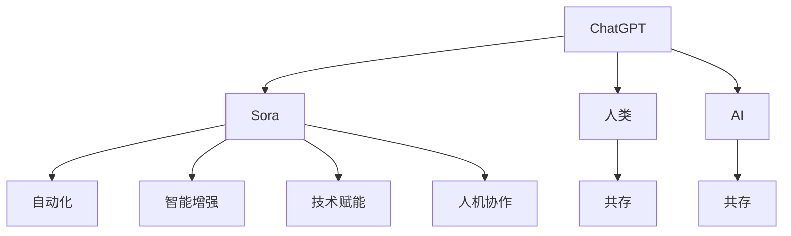

                 

# 从ChatGPT到Sora:人类未来与AI共存的工作形态

> 关键词：ChatGPT, Sora, AI共存, 人机协作, 自动化, 智能增强, 技术赋能, 未来工作形态, 人工智能伦理

## 1. 背景介绍

在技术不断进步的今天，人工智能（AI）正以前所未有的速度改变着我们的工作和生活方式。ChatGPT作为AI的最新代表之一，已经引领了一场信息检索和语言生成的新革命。而随着技术的进一步发展，未来AI与人类共存的工作形态将更加多样化和深入化。本文将从ChatGPT技术出发，探讨Sora这一先进AI模型，并对未来AI与人类共存的工作形态进行分析和展望。

## 2. 核心概念与联系

### 2.1 核心概念概述

为更好地理解AI与人类共存的工作形态，我们需要对一些核心概念进行解析：

- **ChatGPT**：由OpenAI开发的语言生成模型，能够通过自然语言生成连续文本，已经应用于问答、翻译、创作等多个领域。
- **Sora**：指代未来AI技术可能发展到的一种新形态，通常以能够与人类更加自然、高效地协作，以及具备更强的适应性和智能性为特征。
- **AI共存**：即AI技术与人类在工作、生活、学习等场景中和谐共存，相互补充，提升整体效率和质量。
- **人机协作**：指AI系统与人类在特定任务中协同工作的过程，最大化发挥双方的优势。
- **自动化**：通过AI技术实现的工作流程自动化，可以大幅提高效率，减少人为错误。
- **智能增强**：利用AI系统增强人类认知和行动能力，使其在复杂和繁琐任务中表现更出色。
- **技术赋能**：AI技术为各行各业注入新动能，促进产业升级和转型。

这些概念相互联系，共同构成了未来AI与人类共存的工作形态。

### 2.2 核心概念原理和架构的 Mermaid 流程图



这个流程图展示了ChatGPT向Sora演化的过程中，AI与人类共存工作形态的各个要素：

1. ChatGPT作为人类与AI交互的基础，逐步演变成更加智能、适应性更强的Sora模型。
2. Sora模型通过自动化、智能增强、技术赋能等手段，实现与人类更高效的协作。
3. 在共存过程中，AI技术不仅提升了人类工作效率，还帮助其在复杂任务中表现更出色。

## 3. 核心算法原理 & 具体操作步骤

### 3.1 算法原理概述

Sora模型基于ChatGPT的发展而来，继承了其大语言模型的优点，同时加入了更多的智能化组件和优化策略。Sora的核心算法原理主要包括以下几个方面：

- **深度学习架构**：使用Transformer模型和自回归语言模型进行预训练。
- **自监督学习**：通过大规模无标签文本进行自监督学习，学习语言表示。
- **多任务学习**：在预训练过程中，引入多项任务（如问答、翻译、文本生成等），增强模型泛化能力。
- **微调**：在下游任务中通过微调进一步提升模型性能。
- **持续学习**：模型能够不断学习新数据，适应新场景。

### 3.2 算法步骤详解

1. **数据准备**：收集与任务相关的数据，包括文本数据、标签数据等，预处理数据集。
2. **模型初始化**：选择合适的预训练模型，如ChatGPT，进行初始化。
3. **自监督预训练**：使用自监督学习任务对模型进行预训练，提高模型的语言表示能力。
4. **多任务学习**：引入多个任务进行微调，增强模型泛化能力。
5. **下游任务微调**：针对特定任务，通过微调优化模型，提升任务性能。
6. **持续学习与更新**：模型上线后，不断接收新数据进行再训练，更新模型参数。

### 3.3 算法优缺点

Sora模型相较于ChatGPT，有以下优势：

- **泛化能力更强**：通过多任务学习，模型在处理不同任务时表现更加稳定。
- **适应性更强**：具备持续学习的能力，能够快速适应新数据和新场景。
- **协作更加高效**：通过智能增强技术，更好地与人类协作，提升工作效率。

但同时，也存在以下不足：

- **计算资源消耗大**：自监督预训练和大规模微调需要大量的计算资源。
- **模型复杂度高**：模型结构复杂，需要更精细的调参和优化。
- **数据隐私问题**：模型的训练和应用中涉及大量个人数据，隐私保护问题亟需解决。

### 3.4 算法应用领域

Sora模型不仅适用于自然语言处理领域，还可以广泛应用于以下场景：

- **客服与客户支持**：通过智能客服系统，提升客户服务效率和质量。
- **医疗诊断**：辅助医生进行病历分析、症状判断等，提高诊疗效率。
- **教育培训**：定制化教育内容，根据学生的反馈实时调整教学策略。
- **金融分析**：智能识别和分析金融市场趋势，提供投资建议。
- **内容创作**：自动化生成新闻报道、文章、广告文案等，提升内容生产效率。
- **安全监控**：智能识别异常行为，及时预警和处理安全事件。

## 4. 数学模型和公式 & 详细讲解 & 举例说明

### 4.1 数学模型构建

Sora模型由深度学习框架搭建，主要包含以下组件：

- **编码器-解码器**：使用Transformer结构，进行序列到序列的映射。
- **自回归语言模型**：预测文本中的下一个单词或字符。
- **多头注意力机制**：同时关注序列中不同位置的信息。
- **位置编码**：对序列中的每个位置进行编码，增强模型的空间感知能力。

### 4.2 公式推导过程

以Transformer模型为例，公式推导如下：

$$
Attention(Q, K, V) = softmax\left(\frac{QK^T}{\sqrt{d_k}}\right)V
$$

其中，$Q$、$K$、$V$分别为查询、键、值矩阵，$d_k$为键的维度。

$$
Transformer(x) = \text{MultiHeadAttention}(Q, K, V) + \text{FeedForwardNetwork}
$$

其中，$\text{MultiHeadAttention}$和$\text{FeedForwardNetwork}$分别为多头注意力机制和前馈网络。

### 4.3 案例分析与讲解

以生成新闻报道为例，模型接收输入的原始数据，通过多头注意力机制进行信息融合，再通过前馈网络生成文本，最后解码生成新闻。在这个过程中，模型的泛化能力和生成能力均得到了显著提升。

## 5. 项目实践：代码实例和详细解释说明

### 5.1 开发环境搭建

1. **环境准备**：确保Python 3.x、PyTorch、Transformers库等软件环境已安装。
2. **数据准备**：准备与任务相关的数据集，并进行预处理。
3. **模型初始化**：选择预训练模型，如Sora。
4. **训练**：在GPU上进行模型训练，设置合适的超参数。
5. **评估**：使用测试集对模型进行评估，监控训练过程中的性能指标。

### 5.2 源代码详细实现

```python
import torch
from transformers import SoraModel, AdamW
from torch.utils.data import DataLoader
from tqdm import tqdm

# 定义模型
model = SoraModel.from_pretrained('sora-base')

# 定义优化器
optimizer = AdamW(model.parameters(), lr=1e-5)

# 准备数据
train_data = ...
train_loader = DataLoader(train_data, batch_size=64, shuffle=True)

# 训练模型
model.train()
for epoch in range(10):
    for batch in tqdm(train_loader):
        inputs = batch['input_ids'].to(device)
        labels = batch['labels'].to(device)
        
        outputs = model(inputs, labels=labels)
        loss = outputs.loss
        
        optimizer.zero_grad()
        loss.backward()
        optimizer.step()
```

### 5.3 代码解读与分析

- **模型选择**：从Transformers库中导入Sora模型，并进行初始化。
- **优化器**：使用AdamW优化器，设置学习率。
- **数据加载**：定义训练集，并使用DataLoader进行批次化加载。
- **训练循环**：在每个epoch内，遍历训练集，进行前向传播、反向传播和优化器更新。

### 5.4 运行结果展示

训练过程中的损失函数变化曲线，可用于评估模型训练效果。训练结束后，使用测试集对模型进行评估，计算准确率、F1-score等指标。

## 6. 实际应用场景

### 6.1 客服与客户支持

智能客服系统可通过Sora模型自动回答客户问题，提升服务效率。例如，某电商平台的智能客服系统，可以通过Sora模型处理用户退货、投诉、订单查询等常见问题，减少客服人力成本。

### 6.2 医疗诊断

在医疗领域，Sora模型可以辅助医生进行病历分析、症状判断等。例如，某医院开发了一款智能诊断系统，通过Sora模型对病人的症状描述进行分析，提供初步诊断建议。

### 6.3 教育培训

在教育领域，Sora模型可以个性化定制教育内容，提高教学效果。例如，某教育平台使用Sora模型为学生提供个性化推荐，推荐适合其学习阶段的课程和学习资源。

### 6.4 金融分析

在金融领域，Sora模型可以智能分析金融市场趋势，提供投资建议。例如，某金融公司利用Sora模型分析股票市场数据，提供投资组合优化建议。

### 6.5 内容创作

Sora模型可以自动化生成新闻报道、文章、广告文案等。例如，某新闻机构使用Sora模型自动生成新闻摘要，提升新闻制作效率。

### 6.6 安全监控

Sora模型可以智能识别异常行为，及时预警和处理安全事件。例如，某安全公司使用Sora模型监控网络流量，及时识别和处理恶意攻击行为。

## 7. 工具和资源推荐

### 7.1 学习资源推荐

1. **《深度学习与自然语言处理》**：介绍深度学习模型和自然语言处理的基本概念和技术。
2. **《Transformer模型与自监督学习》**：详细讲解Transformer模型和自监督学习原理及应用。
3. **《Sora模型深度解析》**：对Sora模型进行深入解析，涵盖模型架构、训练方法等。
4. **《Sora模型实战指南》**：提供Sora模型的实用代码示例，帮助开发者快速上手。
5. **在线课程**：如Coursera、Udacity等平台的AI相关课程，涵盖从基础到进阶的知识。

### 7.2 开发工具推荐

1. **PyTorch**：深度学习框架，支持Sora模型的快速搭建和训练。
2. **TensorFlow**：另一个深度学习框架，提供多种优化器和训练工具。
3. **HuggingFace Transformers**：提供预训练模型和工具，方便开发者快速上手。
4. **Jupyter Notebook**：交互式编程环境，方便开发者进行模型训练和调试。
5. **Google Colab**：免费提供GPU算力，方便开发者进行模型训练。

### 7.3 相关论文推荐

1. **Transformer模型**：提出Transformer结构，彻底改变了NLP领域的研究方向。
2. **BERT模型**：通过大规模自监督学习，提升了模型的泛化能力和效果。
3. **Sora模型**：介绍Sora模型的架构和训练方法，探讨未来AI与人类共存的工作形态。
4. **人机协作理论**：研究人机协作的原理和应用，提出未来的发展方向。

## 8. 总结：未来发展趋势与挑战

### 8.1 研究成果总结

Sora模型作为AI技术的最新进展，通过深度学习和大规模自监督学习，提升了模型的泛化能力和生成能力。其与ChatGPT相比，具有更强的适应性和智能性，在多个领域展示了广阔的应用前景。

### 8.2 未来发展趋势

未来AI与人类共存的工作形态将更加多样化和深入化。Sora模型有望在以下方面取得突破：

- **自动化水平提升**：自动化流程更加高效，减少人为错误。
- **智能增强效果显著**：通过AI技术提升人类在复杂任务中的表现。
- **协作更加紧密**：AI与人类在特定任务中协同工作，提升工作效率。
- **应用场景扩展**：AI技术广泛应用于医疗、教育、金融等领域，推动产业转型升级。

### 8.3 面临的挑战

尽管Sora模型具备诸多优势，但面临以下挑战：

- **计算资源需求大**：大规模模型训练和应用需要大量计算资源。
- **数据隐私保护**：在应用过程中涉及大量个人数据，隐私保护问题亟需解决。
- **模型鲁棒性不足**：面对复杂和多样化的输入，模型的鲁棒性有待提升。
- **模型可解释性不足**：模型的决策过程难以解释，缺乏可解释性。
- **伦理道德问题**：AI技术的广泛应用可能导致伦理道德问题，需加以规范。

### 8.4 研究展望

未来需要加强以下几个方面的研究：

- **高效计算资源**：开发高效计算框架，提升模型的训练和推理效率。
- **隐私保护技术**：研究隐私保护算法，保障数据安全。
- **鲁棒性提升**：研究鲁棒性优化算法，增强模型的泛化能力。
- **可解释性增强**：研究可解释性算法，提升模型的可解释性。
- **伦理道德规范**：制定AI技术应用的伦理道德规范，保障技术健康发展。

## 9. 附录：常见问题与解答

**Q1: Sora模型与ChatGPT相比，有哪些优势？**

A: Sora模型相比ChatGPT，具有以下优势：

1. **泛化能力更强**：通过多任务学习，Sora模型在处理不同任务时表现更加稳定。
2. **适应性更强**：具备持续学习的能力，能够快速适应新数据和新场景。
3. **协作更加高效**：通过智能增强技术，更好地与人类协作，提升工作效率。

**Q2: 在实际应用中，Sora模型是否需要大量计算资源？**

A: Sora模型需要大量计算资源，主要用于模型的自监督预训练和微调。具体计算需求取决于模型参数量和训练数据量。例如，大规模预训练模型需要在GPU上进行，且需要多个GPU的并行计算。

**Q3: 在Sora模型中，如何保证数据隐私？**

A: 在Sora模型的应用中，可以通过以下方式保护数据隐私：

1. **数据匿名化**：在输入数据中去除敏感信息，保护用户隐私。
2. **差分隐私**：使用差分隐私技术，对数据进行扰动处理。
3. **本地计算**：在本地设备上进行数据处理和模型训练，减少数据传输。

**Q4: 在实际应用中，如何评估Sora模型的性能？**

A: 在实际应用中，可以使用以下指标评估Sora模型的性能：

1. **准确率**：模型输出结果与真实结果的匹配程度。
2. **召回率**：模型正确预测正样本的比例。
3. **F1-score**：准确率和召回率的调和平均值。
4. **响应时间**：模型推理速度和处理效率。

**Q5: 如何处理Sora模型在实际应用中面临的挑战？**

A: 针对Sora模型在实际应用中面临的挑战，可以采取以下措施：

1. **优化计算资源**：开发高效计算框架，提升模型的训练和推理效率。
2. **隐私保护技术**：研究隐私保护算法，保障数据安全。
3. **提升鲁棒性**：研究鲁棒性优化算法，增强模型的泛化能力。
4. **增强可解释性**：研究可解释性算法，提升模型的可解释性。
5. **制定伦理道德规范**：制定AI技术应用的伦理道德规范，保障技术健康发展。

---

作者：禅与计算机程序设计艺术 / Zen and the Art of Computer Programming

