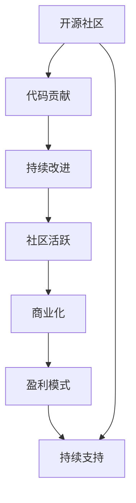

                 

# 从代码贡献到开源商业化之路

> 关键词：开源, 代码贡献, 商业化, 开源社区, 盈利模式, 社区驱动

## 1. 背景介绍

### 1.1 问题由来

开源软件项目（Open Source Software, OSS）是近年来互联网技术发展的重要推动力之一，通过开放源码，吸引了全球各地的开发者、企业、研究机构的积极参与。开源项目不仅推动了软件质量的提升，还加速了技术创新，培养了大量的技术人才，促进了技术的普及和应用。

然而，开源项目的持续维护和商业化运营一直是其面临的主要挑战之一。开源项目初期往往依赖社区志愿者的贡献，资金和人力有限，难以持续保持项目质量和活跃度。同时，开源项目如何实现盈利，既能保持项目的开放性，又能实现可持续发展，也是一个重要的问题。

### 1.2 问题核心关键点

本文将聚焦于开源项目的持续发展和商业化运营，探讨开源社区与商业化之间的平衡关系，提出一些可行的策略，旨在帮助开源项目实现商业化，同时又能保持其社区的活跃和开放性。

## 2. 核心概念与联系

### 2.1 核心概念概述

为更好地理解开源项目的商业化运营，本文将介绍几个关键概念：

- **开源社区**：指围绕一个开源项目形成的开发者、使用者、贡献者、专家等构成的社会网络。开源社区是项目持续发展的重要动力。
- **代码贡献**：指开发者将代码提交到开源项目，包括Bug修复、新特性开发、文档完善等。代码贡献是开源项目成长的基石。
- **商业化**：指开源项目通过商业模式实现盈利，包括版权授权、咨询服务、订阅服务、广告等。
- **盈利模式**：指开源项目实现盈利的手段，如企业赞助、个人捐赠、社区收费、商业应用等。
- **社区驱动**：指开源项目通过社区力量驱动发展，包括开发者、使用者、公司等各方共同参与，形成良性循环。

这些概念之间的关系可以通过以下Mermaid流程图来展示：



这个流程图展示开源项目的核心概念及其之间的逻辑关系：

1. 开源社区通过代码贡献，不断改进项目，保持其活跃和生命力。
2. 持续改进的项目吸引更多的社区成员，形成良性循环。
3. 商业化有助于开源项目获得更多资源支持，进一步提升项目质量和影响力。
4. 多样化的盈利模式为开源项目提供多元化的资金来源。
5. 持续的支持（如企业赞助、个人捐赠等）有助于开源项目的持续发展。

## 3. 核心算法原理 & 具体操作步骤
### 3.1 算法原理概述

开源项目的商业化运营，本质上是一个平衡开源社区的贡献与商业利益的过程。其核心在于如何既能实现项目的可持续发展和商业盈利，又能保持社区的开放性和活跃度。

1. **社区驱动**：开源项目的成功依赖于一个活跃的社区，因此项目需要持续提供有价值的内容，吸引社区成员参与。这包括发布高质量的代码、文档、示例等，满足社区成员的需求。
2. **盈利模式多样化**：开源项目可以通过多种方式实现盈利，如企业赞助、个人捐赠、商业应用等。多样化的盈利模式有助于减少项目对单一来源的依赖，降低风险。
3. **利益分配透明**：开源项目需要建立透明的利益分配机制，确保贡献者、用户、企业等各方的利益得到合理分配。透明性有助于增强社区的信任和忠诚度。

### 3.2 算法步骤详解

开源项目的商业化运营一般包括以下关键步骤：

**Step 1: 建立并维护开源社区**

- 制定明确的项目目标和愿景，吸引志同道合的开发者和用户。
- 提供完善的技术文档和示例，降低新手入门门槛。
- 建立活跃的社区平台，如GitHub、Discord、Slack等，促进交流和协作。

**Step 2: 吸引和留住贡献者**

- 定期发布高质量的更新和特性，满足社区成员的需求。
- 提供激励机制，如贡献证书、开源荣誉等，激励社区成员参与贡献。
- 举办社区活动，如线上线下的Meetup、Workshop等，增强社区凝聚力。

**Step 3: 确定盈利模式**

- 探索适合项目的盈利模式，如企业赞助、个人捐赠、商业应用等。
- 建立透明的收费标准和利益分配机制，确保各方利益平衡。
- 提供高质量的商业服务，满足企业用户的特定需求。

**Step 4: 商业化运营**

- 寻找潜在的商业合作伙伴，如大型企业、初创公司等。
- 根据商业需求定制开发，提供定制化解决方案。
- 提供开源与商业服务两种模式，满足不同用户的需求。

### 3.3 算法优缺点

开源项目商业化运营的优势包括：

1. **降低风险**：多样化的盈利模式分散了项目风险，减少对单一来源的依赖。
2. **增强社区活力**：商业支持有助于提升项目资源，增强社区成员的参与感和归属感。
3. **促进技术创新**：商业化运营的投入和需求，推动了技术的不断进步。

其缺点包括：

1. **社区分裂风险**：盈利模式可能会引起社区成员的不满和分歧。
2. **商业需求限制**：过度商业化可能限制项目的开放性和灵活性。
3. **资源分配问题**：平衡社区贡献和商业盈利，需要精细化的管理和决策。

### 3.4 算法应用领域

开源项目商业化运营的应用领域包括：

1. **开源软件项目**：如Apache、Linux、Kubernetes等，通过企业赞助、商业应用实现盈利。
2. **开源硬件项目**：如Arduino、Raspberry Pi等，通过销售硬件和软件许可实现盈利。
3. **开源技术平台**：如AWS、Google Cloud等，通过云服务、API访问等方式实现盈利。

## 4. 数学模型和公式 & 详细讲解 & 举例说明

### 4.1 数学模型构建

在开源项目商业化运营中，我们可以通过以下数学模型来量化项目的可持续性和盈利性：

- **社区参与度模型**：衡量社区成员的活跃度，包括代码贡献、文档提交、讨论参与等指标。
- **商业贡献度模型**：衡量商业合作带来的收益和资源，包括赞助金额、商业应用收入、咨询费用等指标。
- **项目健康度模型**：衡量项目的整体健康状况，包括代码质量、文档完整性、社区活跃度等指标。

### 4.2 公式推导过程

以社区参与度模型为例，假设社区活跃度为 $A$，包括代码贡献次数 $C$、文档提交次数 $D$、讨论参与次数 $T$，则社区参与度可以表示为：

$$
A = \alpha C + \beta D + \gamma T
$$

其中 $\alpha$、$\beta$、$\gamma$ 为权重系数，可以通过数据分析确定。

### 4.3 案例分析与讲解

以Apache基金会为例，Apache通过多样化的盈利模式实现了项目的可持续发展和商业化运营：

- **企业赞助**：Apache基金会吸引了大量企业赞助，如Red Hat、Google、IBM等，提供了稳定的资金支持。
- **开源社区**：Apache基金会拥有庞大的开发者和用户社区，不断贡献高质量的代码和文档，保持项目的活跃和质量。
- **商业应用**：Apache基金会通过开源技术的商业应用，实现了多样化的盈利，如Hadoop、Hive等技术在企业中被广泛应用。

## 5. 项目实践：代码实例和详细解释说明

### 5.1 开发环境搭建

开源项目商业化运营的开发环境搭建主要包括以下步骤：

1. **选择合适的开源平台**：如GitHub、Bitbucket、GitLab等，提供代码托管和协作功能。
2. **配置开发工具**：如Visual Studio Code、Atom、Sublime Text等，支持代码编写和调试。
3. **部署应用环境**：如Docker、Kubernetes等，提供容器化和容器编排功能。

### 5.2 源代码详细实现

以下以Apache基金会为例，给出开源项目商业化运营的代码实现流程：

1. **建立Git仓库**：

```bash
git init
git remote add origin https://github.com/apache/example-project.git
git checkout -b main
```

2. **编写代码和文档**：

```bash
cd example-project
touch README.md
echo "# Example Project" > README.md
```

3. **发布更新和特性**：

```bash
git add README.md
git commit -m "Initial commit"
git push -u origin main
```

### 5.3 代码解读与分析

开源项目商业化运营的代码实现涉及多方面的工作，包括代码管理、版本控制、协作工具等。开发者需要熟练掌握这些工具的使用，确保项目的开放性和社区的协作性。

### 5.4 运行结果展示

运行结果展示包括代码的提交记录、项目的分支情况、社区的活跃度等。开发者可以使用GitHub、GitLab等平台提供的统计工具，获取这些数据，确保项目的健康和可持续性。

## 6. 实际应用场景

### 6.1 企业内部开源项目

企业内部开源项目可以帮助企业内部团队协作开发，提升代码质量和项目效率。以下是一个企业内部开源项目的实现流程：

1. **建立Git仓库**：

```bash
git init
git remote add origin https://github.com/company/example-project.git
git checkout -b main
```

2. **编写代码和文档**：

```bash
cd example-project
touch README.md
echo "# Example Project" > README.md
```

3. **发布更新和特性**：

```bash
git add README.md
git commit -m "Initial commit"
git push -u origin main
```

### 6.2 开源社区项目

开源社区项目通常吸引全球各地的开发者参与贡献。以下是一个开源社区项目的实现流程：

1. **建立Git仓库**：

```bash
git init
git remote add origin https://github.com/username/example-project.git
git checkout -b main
```

2. **编写代码和文档**：

```bash
cd example-project
touch README.md
echo "# Example Project" > README.md
```

3. **发布更新和特性**：

```bash
git add README.md
git commit -m "Initial commit"
git push -u origin main
```

### 6.3 开源平台商业化运营

开源平台的商业化运营主要通过收取平台使用费、提供商业应用等方式实现盈利。以下是一个开源平台的实现流程：

1. **建立Git仓库**：

```bash
git init
git remote add origin https://github.com/platform/example-project.git
git checkout -b main
```

2. **编写代码和文档**：

```bash
cd example-project
touch README.md
echo "# Example Project" > README.md
```

3. **发布更新和特性**：

```bash
git add README.md
git commit -m "Initial commit"
git push -u origin main
```

## 7. 工具和资源推荐

### 7.1 学习资源推荐

为了帮助开发者系统掌握开源项目商业化运营的理论基础和实践技巧，这里推荐一些优质的学习资源：

1. **《开源社区管理与运营》**：详细介绍了开源社区的管理、运营和商业化策略。
2. **《开源项目商业化指南》**：提供了开源项目商业化的详细案例和实践经验。
3. **《开源项目管理与开发》**：讲解了开源项目的项目管理、代码管理和协作工具。
4. **GitHub官方文档**：提供了GitHub平台的使用和配置指南。
5. **Apache基金会官方文档**：详细介绍了Apache基金会的商业化运营策略和实践。

通过对这些资源的学习实践，相信你一定能够快速掌握开源项目商业化运营的精髓，并用于解决实际的开源项目问题。

### 7.2 开发工具推荐

高效的开发离不开优秀的工具支持。以下是几款用于开源项目商业化运营开发的常用工具：

1. **GitHub**：提供了代码托管、版本控制、协作管理等功能，是开源项目商业化运营的主流平台。
2. **Bitbucket**：提供了与GitHub类似的功能，支持多种版本控制系统。
3. **GitLab**：提供了CI/CD、容器编排、项目管理等功能，适合大规模开源项目的商业化运营。
4. **Visual Studio Code**：一款轻量级的代码编辑器，支持多种编程语言和插件。
5. **Atom**：一款现代化的代码编辑器，支持多种编程语言和插件。

合理利用这些工具，可以显著提升开源项目商业化运营的开发效率，加快创新迭代的步伐。

### 7.3 相关论文推荐

开源项目商业化运营的发展源于学界的持续研究。以下是几篇奠基性的相关论文，推荐阅读：

1. **《开源社区的动力和演化》**：研究开源社区的发展机制和动力源泉。
2. **《开源项目的商业化：模式、挑战与机遇》**：分析了开源项目商业化的模式和面临的挑战。
3. **《开源项目的维护和治理》**：讨论了开源项目的维护和治理策略。
4. **《开源平台商业化运营的实践》**：介绍了开源平台商业化运营的案例和实践经验。
5. **《开源项目的商业模式》**：分析了开源项目的多种盈利模式和商业模式。

这些论文代表了大规模开源项目商业化运营的发展脉络。通过学习这些前沿成果，可以帮助研究者把握学科前进方向，激发更多的创新灵感。

## 8. 总结：未来发展趋势与挑战

### 8.1 总结

本文对开源项目的商业化运营进行了全面系统的介绍。首先阐述了开源项目的社区驱动和商业化的平衡关系，明确了商业化在开源项目中的重要意义。其次，从原理到实践，详细讲解了开源项目商业化运营的数学模型和关键步骤，给出了开源项目商业化运营的完整代码实例。同时，本文还广泛探讨了开源项目在企业内部、开源社区、开源平台等不同场景下的商业化运营，展示了开源项目的巨大潜力和应用前景。

通过本文的系统梳理，可以看到，开源项目商业化运营需要开发者根据具体场景，不断迭代和优化模型、数据和算法，方能得到理想的效果。开源项目通过社区驱动和商业化运营相结合，既可以保持项目的开放性和活力，又能实现可持续发展和商业盈利，为开源社区和商业伙伴创造共赢的局面。

### 8.2 未来发展趋势

展望未来，开源项目商业化运营将呈现以下几个发展趋势：

1. **社区与商业的深度融合**：开源项目将更加注重社区和商业的深度融合，通过开放源码和商业应用的结合，形成良性循环。
2. **开源工具的商业化**：越来越多的开源工具和平台将提供商业服务和定制化解决方案，满足企业的具体需求。
3. **多样化的盈利模式**：开源项目将探索更多的盈利模式，如平台订阅、API访问、服务付费等，实现多元化的商业化运营。
4. **开源社区的全球化**：开源项目将进一步全球化，吸引全球各地的开发者和用户参与贡献。
5. **开源项目的生态化**：开源项目将构建完整的生态系统，包括开发、部署、运维、培训等各个环节，提升项目的整体价值。

以上趋势凸显了开源项目商业化运营的广阔前景。这些方向的探索发展，必将进一步推动开源社区的成长和技术的普及，为人类社会的数字化转型注入新的动力。

### 8.3 面临的挑战

尽管开源项目商业化运营已经取得了显著成果，但在迈向更加智能化、普适化应用的过程中，它仍面临诸多挑战：

1. **社区分裂风险**：商业化模式可能引起社区成员的不满和分歧，如何平衡各方利益，是一个重要的问题。
2. **商业需求限制**：过度商业化可能限制项目的开放性和灵活性，如何保持项目的灵活性，是一个关键挑战。
3. **资源分配问题**：开源项目的商业化运营需要精细化的管理和决策，如何在开源和商业之间进行平衡，是一个复杂的问题。
4. **盈利模式单一**：当前开源项目的盈利模式较为单一，如何探索更多的盈利模式，增加项目的收入来源，是一个重要的研究方向。

### 8.4 研究展望

面对开源项目商业化运营所面临的种种挑战，未来的研究需要在以下几个方面寻求新的突破：

1. **社区驱动与商业化的平衡**：探索新的社区驱动和商业化结合的策略，既满足商业化的需求，又保持项目的开放性和活力。
2. **多样化的盈利模式**：开发新的盈利模式，如平台订阅、API访问、服务付费等，实现多元化的商业化运营。
3. **开源社区的全球化**：如何吸引全球各地的开发者和用户参与贡献，提升开源项目的国际影响力。
4. **开源项目的生态化**：构建完整的开源项目生态系统，包括开发、部署、运维、培训等各个环节，提升项目的整体价值。
5. **开源项目的商业应用**：探索开源技术的商业应用场景，推动技术的普及和应用。

这些研究方向的探索，必将引领开源项目商业化运营技术迈向更高的台阶，为构建安全、可靠、可控的智能系统铺平道路。面向未来，开源项目商业化运营需要开发者根据具体场景，不断迭代和优化模型、数据和算法，方能得到理想的效果。

## 9. 附录：常见问题与解答

**Q1: 开源项目如何进行商业化运营？**

A: 开源项目的商业化运营主要通过以下方式实现：

1. **企业赞助**：吸引大型企业赞助，提供稳定的资金支持。
2. **开源社区**：通过开放源码，吸引全球各地的开发者和用户贡献。
3. **商业应用**：提供开源技术的商业应用，满足企业用户的特定需求。
4. **多样化的盈利模式**：通过多种方式实现盈利，如企业赞助、个人捐赠、商业应用等。

**Q2: 开源项目如何平衡社区贡献和商业盈利？**

A: 开源项目平衡社区贡献和商业盈利，需要采取以下措施：

1. **透明利益分配**：建立透明的利益分配机制，确保贡献者、用户、企业等各方的利益得到合理分配。
2. **多样化的盈利模式**：通过多种方式实现盈利，减少对单一来源的依赖，降低风险。
3. **社区驱动**：通过提供高质量的代码和文档，吸引社区成员的积极参与，保持项目的开放性和活力。

**Q3: 开源项目的商业化运营有哪些挑战？**

A: 开源项目商业化运营面临的挑战包括：

1. **社区分裂风险**：商业化模式可能引起社区成员的不满和分歧。
2. **商业需求限制**：过度商业化可能限制项目的开放性和灵活性。
3. **资源分配问题**：开源项目的商业化运营需要精细化的管理和决策。
4. **盈利模式单一**：当前开源项目的盈利模式较为单一，需要探索更多盈利模式。

**Q4: 开源项目的未来发展趋势是什么？**

A: 开源项目的未来发展趋势包括：

1. **社区与商业的深度融合**：通过开放源码和商业应用的结合，形成良性循环。
2. **开源工具的商业化**：提供商业服务和定制化解决方案。
3. **多样化的盈利模式**：实现多元化的商业化运营。
4. **开源社区的全球化**：吸引全球各地的开发者和用户参与贡献。
5. **开源项目的生态化**：构建完整的开源项目生态系统，提升项目的整体价值。

通过对这些问题的解答，希望读者能够更好地理解开源项目商业化运营的实际应用，并具备解决相关问题的能力。

---

作者：禅与计算机程序设计艺术 / Zen and the Art of Computer Programming

