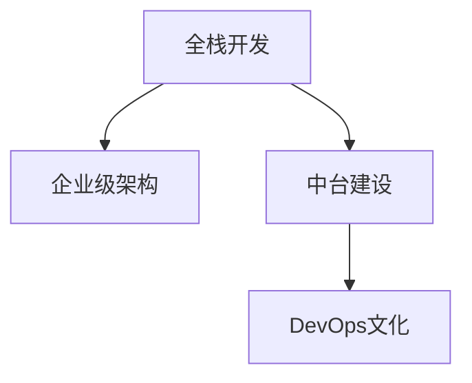

                 

## 1. 背景介绍

### 1.1 问题由来

随着信息技术的迅猛发展，全栈开发工程师已成为企业信息化建设的重要力量。全栈开发工程师不仅要掌握前端技术，还需精通后端开发、数据库、架构设计等多方面的技能。然而，随着企业规模的扩大和业务需求的复杂化，单一全栈开发工程师难以全面应对系统构建和维护的挑战。为此，企业级架构师成为企业信息化建设中的核心角色，负责定义系统架构，组织协同开发，优化技术栈，推动业务与技术的融合。

### 1.2 问题核心关键点

企业级架构师不仅需要熟悉各类技术栈，还需具备系统思考、架构设计、项目管理、业务理解和沟通协调等多方面的能力。然而，全栈开发工程师往往缺乏系统架构设计的经验，难以胜任复杂系统的构建和管理。因此，将全栈开发技能与架构设计能力相结合，是成为企业级架构师的必由之路。

## 2. 核心概念与联系

### 2.1 核心概念概述

为了更好地理解全栈开发到企业级架构师进阶的过程，本节将介绍几个关键概念：

- **全栈开发**：指同时掌握前端开发和后端开发的技术栈，能够独立完成网站或应用从设计到部署的整个过程。全栈开发工程师通常具备多种编程语言和框架的使用经验，能够处理从用户交互到数据存储的全链路技术问题。

- **企业级架构**：指对大型系统的技术体系进行顶层设计，包括系统架构、技术栈、数据治理、接口规范等方面的全面规划和标准化。企业级架构师需要从业务需求出发，设计出可扩展、高性能、高可靠的系统架构，并制定相应的标准和规范，确保系统的持续稳定运行。

- **中台建设**：指通过建设服务中台、数据中台等中间件，实现技术资源的共享和复用，降低系统构建和维护的成本，加速业务创新和技术迭代。中台建设是实现企业级架构的重要手段，有助于提升系统的灵活性和可扩展性。

- **DevOps文化**：指通过持续集成、持续部署、持续监控等实践，实现开发、测试、运维各环节的高效协同和自动化，提升系统的交付效率和稳定性。DevOps文化强调团队协作和自动化，是构建企业级架构的关键支撑。

这些核心概念之间的逻辑关系可以通过以下Mermaid流程图来展示：



这个流程图展示了好栈开发到企业级架构进阶的关键步骤：

1. 通过掌握前端和后端技术，打好全栈基础。
2. 学习企业级架构设计，理解系统架构的核心原则和设计方法。
3. 参与中台建设，了解如何将系统架构设计转化为技术实现。
4. 了解DevOps文化，掌握持续集成、持续部署等自动化工具。

只有通过系统学习和实践，全栈开发工程师才能逐步成长为能够设计复杂系统架构的企业级架构师。

## 3. 核心算法原理 & 具体操作步骤
### 3.1 算法原理概述

全栈开发到企业级架构师的进阶，本质上是从技术实现到系统架构设计的转变。其核心思想是：通过系统化学习和技术积累，提升对复杂系统的理解和设计能力，最终能够独立设计并构建大型系统架构。

具体而言，包括以下几个关键步骤：

1. **技术栈掌握**：熟练掌握前端、后端、数据库、网络、安全等多方面的技术栈，具备从需求分析到系统实现的全链路开发能力。
2. **系统架构设计**：理解系统架构设计的基本原则和设计模式，能够从业务需求出发，设计出合理、可扩展的系统架构。
3. **中台建设实践**：参与中台建设的实践，了解如何将系统架构设计转化为技术实现，掌握中间件开发和微服务架构的技能。
4. **DevOps文化融入**：熟悉DevOps文化和持续集成、持续部署等实践，提升系统交付效率和稳定性，确保系统的持续优化和迭代。

### 3.2 算法步骤详解

**Step 1: 系统学习与技术积累**

1. **技术栈全面学习**：
   - 深入学习前端技术栈，包括HTML、CSS、JavaScript、React、Vue等，掌握Web开发技能。
   - 学习后端技术栈，包括Java、Python、Node.js、Django、Flask等，掌握服务器端开发技能。
   - 学习数据库技术，包括MySQL、Oracle、MongoDB等，掌握数据存储和操作技能。
   - 学习网络与安全技术，包括HTTP协议、RESTful API、SSL/TLS、OAuth等，掌握网络通信和安全性保障技能。

2. **实战项目积累**：
   - 通过参与中小型项目，积累实际开发经验，熟悉开发流程和项目管理。
   - 通过开源社区贡献代码，参与社区项目，提升技术水平和团队协作能力。

**Step 2: 系统架构设计与思考**

1. **理解系统架构设计**：
   - 学习系统架构设计的基本原则，如模块化、分层、解耦、可扩展性等。
   - 学习常见设计模式，如MVC、MVVM、RESTful API、微服务等，理解如何通过设计模式提升系统架构的灵活性和可维护性。

2. **实战架构设计**：
   - 通过参与复杂项目，独立设计系统架构，从业务需求和技术实现两方面进行综合考虑。
   - 通过撰写技术方案和架构设计文档，提升文档编写和沟通协调能力。

**Step 3: 中台建设与实践**

1. **学习中间件开发**：
   - 学习服务中台、数据中台等中间件的开发技术，掌握微服务架构和API网关设计。
   - 学习数据治理和数据湖技术，理解数据模型和数据治理的最佳实践。

2. **实战中台构建**：
   - 参与企业级中台的构建和优化，了解如何将系统架构设计转化为技术实现。
   - 通过与架构师、产品经理等协同工作，提升业务理解和技术融合能力。

**Step 4: DevOps文化融入**

1. **学习DevOps工具与实践**：
   - 学习持续集成(CI)和持续部署(CD)工具，如Jenkins、GitLab CI、GitHub Actions等。
   - 学习自动化测试、自动化部署、自动化监控等实践，提升系统交付效率和稳定性。

2. **实战DevOps实践**：
   - 参与DevOps项目的实践，熟悉开发、测试、运维各环节的自动化工具和技术。
   - 通过敏捷开发和DevOps文化的融入，提升团队协作和系统协同能力。

### 3.3 算法优缺点

全栈开发到企业级架构师的进阶，具有以下优点：

1. **综合技术能力提升**：通过掌握前端和后端技术，能够更全面地理解和设计系统架构。
2. **系统架构设计能力提升**：理解系统架构设计的核心原则和设计模式，能够从业务需求出发，设计出合理、可扩展的系统架构。
3. **实战经验积累**：通过参与复杂项目和开源社区，积累实际开发和架构设计经验，提升技术水平和项目管理能力。
4. **团队协作能力提升**：通过与架构师、产品经理等协同工作，提升业务理解和技术融合能力，增强团队协作和沟通能力。

同时，该过程也存在一定的局限性：

1. **时间成本高**：从全栈开发到企业级架构师的进阶，需要大量时间和精力投入，可能会影响日常工作和生活。
2. **技术门槛高**：掌握全栈开发和系统架构设计需要较高的技术水平，需要系统学习和持续实践。
3. **知识更新快**：随着技术快速迭代，需要不断学习和跟进最新技术和实践，保持技术领先。

尽管存在这些局限性，但通过系统学习和持续实践，全栈开发工程师完全有可能成长为优秀的企业级架构师。

### 3.4 算法应用领域

全栈开发到企业级架构师的进阶方法，在软件开发和系统构建的各个领域都有广泛应用，例如：

- **互联网企业**：通过掌握全栈开发和系统架构设计能力，设计并构建高性能、高可扩展的Web应用。
- **传统行业信息化**：通过参与企业级中台的建设，提升系统集成和数据治理能力，推动传统行业数字化转型。
- **金融科技**：通过DevOps实践，提升系统交付效率和稳定性，构建高可靠、高安全性的金融应用系统。
- **人工智能应用**：通过系统架构设计能力，设计并构建高性能、可扩展的人工智能应用系统，推动AI技术落地应用。

## 4. 数学模型和公式 & 详细讲解 & 举例说明

### 4.1 数学模型构建

企业级架构的设计，可以通过数学模型来量化和优化。例如，系统性能可以通过吞吐量、响应时间、并发用户数等指标进行量化，系统可靠性可以通过系统可用性、错误率、恢复时间等指标进行量化。

以系统性能为例，设系统在某段时间内的吞吐量为$T$，响应时间为$R$，并发用户数为$C$，则系统性能可以用以下数学模型来描述：

$$
T = \frac{Q}{C} \times R
$$

其中$Q$为系统处理能力，$R$为响应时间，$C$为并发用户数。

### 4.2 公式推导过程

以上述系统性能模型为例，推导其最优值。

设系统在$t$时刻的吞吐量为$T(t)$，响应时间为$R(t)$，并发用户数为$C(t)$，则系统性能模型为：

$$
T(t) = \frac{Q}{C(t)} \times R(t)
$$

为了求最优性能，需要对上述公式进行优化。假设系统性能为$f(C(t))$，则有：

$$
f(C(t)) = \frac{Q}{C(t)} \times R(t)
$$

通过对$f(C(t))$求导，可以找到最优的并发用户数$C_{opt}$：

$$
\frac{df(C(t))}{dC(t)} = \frac{R(t)}{C(t)^2}
$$

解上述方程，得到：

$$
C_{opt} = \sqrt{\frac{Q}{R(t)}}
$$

这意味着在给定处理能力和响应时间的情况下，系统的最优并发用户数为$\sqrt{\frac{Q}{R(t)}}$。

### 4.3 案例分析与讲解

假设某电商平台系统，其处理能力$Q=100$，响应时间$R(t)=10ms$，初始并发用户数$C_0=100$，通过求解上述方程，可以得到最优并发用户数$C_{opt}=\sqrt{\frac{100}{10}}\approx3.16$。这表明，在处理能力和响应时间不变的情况下，最优并发用户数仅为3.16，可以通过负载均衡、系统扩展等方式提升系统性能。

## 5. 项目实践：代码实例和详细解释说明
### 5.1 开发环境搭建

在进行企业级架构实践前，我们需要准备好开发环境。以下是使用Python进行Flask开发的环境配置流程：

1. 安装Anaconda：从官网下载并安装Anaconda，用于创建独立的Python环境。

2. 创建并激活虚拟环境：
```bash
conda create -n flask-env python=3.8 
conda activate flask-env
```

3. 安装Flask：
```bash
pip install Flask
```

4. 安装Flask-RESTful等扩展：
```bash
pip install Flask-RESTful
```

5. 安装SQLAlchemy：用于数据库连接和操作：
```bash
pip install SQLAlchemy
```

6. 安装Flask-SQLAlchemy：
```bash
pip install Flask-SQLAlchemy
```

完成上述步骤后，即可在`flask-env`环境中开始Flask应用的开发。

### 5.2 源代码详细实现

下面以Flask开发Web服务为例，给出Flask应用的基本实现。

首先，定义Flask应用和路由：

```python
from flask import Flask, jsonify
from flask_sqlalchemy import SQLAlchemy

app = Flask(__name__)
app.config['SQLALCHEMY_DATABASE_URI'] = 'sqlite:///example.db'
db = SQLAlchemy(app)

class User(db.Model):
    id = db.Column(db.Integer, primary_key=True)
    username = db.Column(db.String(80), unique=True, nullable=False)
    email = db.Column(db.String(120), unique=True, nullable=False)

@app.route('/')
def index():
    return jsonify({'message': 'Hello, World!'})

@app.route('/users')
def get_users():
    users = User.query.all()
    results = [{'id': user.id, 'username': user.username, 'email': user.email} for user in users]
    return jsonify(results)
```

然后，定义数据库迁移和模型实例：

```python
from flask_migrate import Migrate

migrate = Migrate(app, db)

@app.route('/users/<int:user_id>')
def get_user(user_id):
    user = User.query.get_or_404(user_id)
    return jsonify({'id': user.id, 'username': user.username, 'email': user.email})
```

最后，启动Flask应用：

```python
if __name__ == '__main__':
    app.run(debug=True)
```

以上就是Flask应用的完整代码实现。可以看到，Flask的框架设计使得应用开发变得简洁高效。开发者可以将更多精力放在业务逻辑的实现上，而不必过多关注底层的Web服务开发。

### 5.3 代码解读与分析

让我们再详细解读一下关键代码的实现细节：

**Flask应用**：
- `Flask`类：定义Flask应用实例，设置应用配置。
- `SQLAlchemy`：用于数据库连接和操作。
- `User`类：定义数据库表结构，包括`id`、`username`、`email`三个字段。

**路由定义**：
- `@app.route`：定义路由路径和处理函数，`/`路径返回`index`函数，`/users`路径返回`get_users`函数。
- `jsonify`：将Python字典序列化为JSON格式响应。

**数据库迁移**：
- `Flask-Migrate`：用于数据库迁移管理，`migrate`实例定义了应用与数据库的映射关系。

**路由实现**：
- `@app.route`：定义路由路径和处理函数，`/users/<int:user_id>`路径返回`get_user`函数，其中`<int:user_id>`用于动态匹配用户ID。

在实际应用中，Flask框架还提供了路由、模板、会话等丰富功能，帮助开发者快速构建Web应用。Flask的灵活性和扩展性，使得其成为构建企业级架构中的重要工具。

当然，在工业级的系统实现中，还需要考虑更多因素，如多线程、异步IO、缓存、负载均衡、安全性等。但核心的Flask开发流程基本与此类似。

## 6. 实际应用场景

### 6.1 互联网企业

全栈开发到企业级架构师的进阶方法，在互联网企业的Web应用开发中得到了广泛应用。互联网企业需要快速构建和部署Web应用，以满足用户需求的快速变化。

具体而言，互联网企业可以通过Flask等框架，快速构建Web服务，处理用户请求。同时，通过引入DevOps文化，提升系统交付效率和稳定性。例如，通过持续集成和持续部署工具，自动化构建、测试和部署应用，提升开发效率和系统质量。

### 6.2 传统行业信息化

传统的制造、金融、零售等行业，需要通过信息化建设提升业务效率和竞争力。全栈开发到企业级架构师的进阶方法，在这些行业的应用也日益增多。

例如，通过Flask等框架，开发Web服务，处理业务流程和数据管理。通过引入DevOps文化，提升系统稳定性和交付效率。同时，通过服务中台、数据中台等中间件，实现技术资源的共享和复用，推动传统行业数字化转型。

### 6.3 金融科技

金融科技公司需要构建高可靠、高安全的金融应用系统，满足海量用户的交易需求。全栈开发到企业级架构师的进阶方法，在金融科技中的应用也广泛存在。

例如，通过Flask等框架，开发Web服务和API接口，处理金融数据和交易请求。通过引入DevOps文化，提升系统交付效率和稳定性。同时，通过服务中台、数据中台等中间件，实现技术资源的共享和复用，提升系统灵活性和可扩展性。

### 6.4 人工智能应用

人工智能技术在医疗、教育、安防等领域的广泛应用，需要构建高性能、可扩展的AI应用系统。全栈开发到企业级架构师的进阶方法，在这些领域的应用也越来越多。

例如，通过Flask等框架，开发Web服务和API接口，处理AI数据和任务请求。通过引入DevOps文化，提升系统交付效率和稳定性。同时，通过服务中台、数据中台等中间件，实现技术资源的共享和复用，提升系统灵活性和可扩展性。

## 7. 工具和资源推荐

### 7.1 学习资源推荐

为了帮助开发者系统掌握全栈开发到企业级架构师的进阶技能，这里推荐一些优质的学习资源：

1. 《Flask Web开发》系列博文：由Flask官方文档作者撰写，系统介绍了Flask框架的使用方法和最佳实践。
2. 《Flask教程》书籍：Flask官方推荐的书，全面介绍了Flask框架的使用方法和开发流程。
3. 《Web开发实战》课程：由知名IT培训机构提供，涵盖前端、后端、数据库、网络等多方面的开发技能。
4. 《企业级架构设计》书籍：介绍企业级架构设计的核心概念和设计方法，帮助开发者系统理解架构设计的原则和实践。
5. 《DevOps实践》书籍：涵盖持续集成、持续部署、持续监控等DevOps文化，帮助开发者提升系统交付效率和稳定性。

通过对这些资源的学习实践，相信你一定能够快速掌握全栈开发到企业级架构师的进阶技能，并用于解决实际的开发问题。

### 7.2 开发工具推荐

高效的开发离不开优秀的工具支持。以下是几款用于全栈开发和系统构建的常用工具：

1. Python：全栈开发和系统构建的首选编程语言，拥有丰富的第三方库和框架，支持大规模项目开发。
2. Flask：轻量级Web框架，支持快速构建Web服务，处理用户请求。
3. SQLAlchemy：数据库连接和操作的高级ORM框架，支持多种数据库和数据模型。
4. Jenkins：开源持续集成和持续部署工具，支持自动化构建、测试和部署应用。
5. GitLab CI/CD：GitLab提供的持续集成和持续部署工具，支持多种CI/CD实践和自动化测试。

合理利用这些工具，可以显著提升开发效率和系统质量，加快创新迭代的步伐。

### 7.3 相关论文推荐

全栈开发到企业级架构师的进阶方法，源于学界的持续研究。以下是几篇奠基性的相关论文，推荐阅读：

1. The Principles of Web Application Architecture（《Web应用架构原理》）：介绍Web应用架构设计的基本原则和最佳实践。
2. Microservices: A Personal Story（《微服务：我的个人故事》）：介绍微服务架构的起源和设计方法，推动微服务架构在企业级应用中的广泛应用。
3. Software Architecture in Practice（《实践中的软件架构》）：涵盖软件架构设计的核心概念和设计方法，帮助开发者系统理解架构设计的原则和实践。
4. DevOps: The Journey Towards Cloud-Native（《DevOps：走向云原生的旅程》）：介绍DevOps文化的起源和实践方法，帮助开发者提升系统交付效率和稳定性。
5. Microservice Architecture in Practice（《微服务架构实践》）：介绍微服务架构在企业级应用中的实际应用案例，推动微服务架构的落地应用。

这些论文代表了大语言模型微调技术的发展脉络。通过学习这些前沿成果，可以帮助研究者把握学科前进方向，激发更多的创新灵感。

## 8. 总结：未来发展趋势与挑战

### 8.1 研究成果总结

本文对全栈开发到企业级架构师进阶的过程进行了全面系统的介绍。首先，阐述了全栈开发到企业级架构师进阶的背景和意义，明确了全栈开发工程师向企业级架构师转变的过程中的关键技能和知识点。其次，从原理到实践，详细讲解了全栈开发、系统架构设计、中台建设、DevOps文化等核心概念，给出了Flask应用开发的完整代码实现。同时，本文还广泛探讨了全栈开发到企业级架构师进阶在互联网企业、传统行业信息化、金融科技、人工智能应用等多个领域的应用前景，展示了进阶方法的巨大潜力。

通过本文的系统梳理，可以看到，全栈开发到企业级架构师的进阶，不仅需要掌握全栈开发技能，还需具备系统架构设计、中台建设、DevOps文化等多方面的能力。只有通过系统学习和持续实践，全栈开发工程师才能逐步成长为优秀的企业级架构师，推动企业信息化建设的不断进步。

### 8.2 未来发展趋势

展望未来，全栈开发到企业级架构师进阶的方法将呈现以下几个发展趋势：

1. **技术栈不断升级**：随着技术快速迭代，全栈开发工程师需要不断学习和跟进最新技术，掌握新的编程语言、框架和中间件。例如，学习Flask、Django、React、Vue等框架，提升开发效率和系统性能。
2. **架构设计能力提升**：理解系统架构设计的核心原则和设计模式，能够从业务需求出发，设计出合理、可扩展的系统架构。例如，掌握微服务架构、服务网格、容器化等技术，提升系统架构设计的灵活性和可维护性。
3. **中台建设持续推进**：参与企业级中台的构建和优化，了解如何将系统架构设计转化为技术实现。例如，通过学习API网关、中间件、数据湖等技术，提升技术资源的共享和复用能力。
4. **DevOps文化深入融合**：熟悉DevOps文化和持续集成、持续部署等实践，提升系统交付效率和稳定性。例如，通过学习Jenkins、GitLab CI/CD等工具，提升系统的自动化程度和交付效率。
5. **数据驱动能力增强**：数据驱动是企业级架构的重要组成部分，全栈开发工程师需要掌握数据治理、数据湖等技术，提升数据驱动的能力。例如，学习大数据技术、数据模型设计、数据可视化等技术，提升数据驱动的决策能力。

这些趋势凸显了全栈开发到企业级架构师进阶方法的广阔前景。这些方向的探索发展，必将进一步提升全栈开发工程师的技术水平和系统构建能力，为企业的信息化建设注入新的动力。

### 8.3 面临的挑战

尽管全栈开发到企业级架构师进阶的方法已经取得了一定成果，但在迈向更加智能化、普适化应用的过程中，它仍面临着诸多挑战：

1. **技术门槛高**：掌握全栈开发和系统架构设计需要较高的技术水平，需要系统学习和持续实践。例如，学习多种编程语言、框架和中间件，理解复杂系统的架构设计。
2. **时间成本高**：从全栈开发到企业级架构师的进阶，需要大量时间和精力投入，可能会影响日常工作和生活。例如，学习新技能、参与复杂项目，需要大量时间和精力。
3. **知识更新快**：随着技术快速迭代，需要不断学习和跟进最新技术和实践，保持技术领先。例如，学习新框架、新工具，掌握最新技术趋势。
4. **团队协作难度大**：企业级架构师需要与产品经理、架构师、运维团队等多方面协同工作，需要较强的沟通和协调能力。例如，参与需求分析、技术方案编写、项目评审等，需要较强的团队协作能力。

尽管存在这些挑战，但通过系统学习和持续实践，全栈开发工程师完全有可能成长为优秀的企业级架构师。

### 8.4 研究展望

面向未来，全栈开发到企业级架构师进阶的研究需要在以下几个方面寻求新的突破：

1. **持续学习和实践**：通过系统学习和持续实践，掌握全栈开发和系统架构设计能力，提升技术水平和系统构建能力。例如，学习最新技术、参与复杂项目，提升技术水平和系统构建能力。
2. **多学科融合**：结合业务需求和技术特点，设计出合理、可扩展的系统架构。例如，结合业务需求、技术特点，设计出灵活、可扩展的系统架构。
3. **技术栈优化**：通过优化技术栈，提升系统性能和开发效率。例如，选择适合的编程语言、框架和中间件，提升系统性能和开发效率。
4. **DevOps文化深化**：通过引入DevOps文化，提升系统交付效率和稳定性。例如，通过持续集成、持续部署、持续监控等实践，提升系统交付效率和稳定性。
5. **数据驱动能力提升**：通过数据驱动，提升系统决策能力。例如，通过学习大数据技术、数据模型设计、数据可视化等技术，提升数据驱动的决策能力。

这些研究方向和实践方法，必将推动全栈开发到企业级架构师进阶技术的发展，推动企业信息化建设的不断进步。只有勇于创新、敢于突破，才能不断拓展全栈开发工程师的边界，为企业的信息化建设注入新的动力。

## 9. 附录：常见问题与解答

**Q1：全栈开发工程师和架构师的区别是什么？**

A: 全栈开发工程师通常具备前端开发和后端开发的技术栈，能够独立完成网站或应用从设计到部署的整个过程。而架构师则不仅需要掌握技术栈，还需具备系统思考、架构设计、项目管理、业务理解、沟通协调等多方面的能力。架构师负责定义系统架构，组织协同开发，优化技术栈，推动业务与技术的融合。

**Q2：如何从全栈开发转型为架构师？**

A: 从全栈开发转型为架构师，需要系统学习和持续实践。具体步骤如下：

1. **技术栈全面学习**：掌握前端、后端、数据库、网络、安全等多方面的技术栈，具备从需求分析到系统实现的全链路开发能力。
2. **系统架构设计思考**：理解系统架构设计的基本原则和设计模式，能够从业务需求出发，设计出合理、可扩展的系统架构。
3. **中台建设实践**：参与企业级中台的构建和优化，了解如何将系统架构设计转化为技术实现。
4. **DevOps文化融入**：熟悉DevOps文化和持续集成、持续部署等实践，提升系统交付效率和稳定性。

通过系统学习和持续实践，全栈开发工程师可以逐步成长为优秀的企业级架构师。

**Q3：全栈开发到企业级架构师进阶的时间成本和投入成本是多少？**

A: 全栈开发到企业级架构师进阶需要大量时间和精力投入，具体成本取决于个人技术水平、项目复杂度、企业环境等因素。一般情况下，需要数月到数年的时间，通过学习新技术、参与复杂项目、优化架构设计等方式，逐步提升技术水平和系统构建能力。

**Q4：全栈开发到企业级架构师进阶的难点在哪里？**

A: 全栈开发到企业级架构师进阶的难点主要在于以下几个方面：

1. **技术门槛高**：掌握全栈开发和系统架构设计需要较高的技术水平，需要系统学习和持续实践。
2. **时间成本高**：需要大量时间和精力投入，可能会影响日常工作和生活。
3. **知识更新快**：需要不断学习和跟进最新技术和实践，保持技术领先。
4. **团队协作难度大**：需要与产品经理、架构师、运维团队等多方面协同工作，需要较强的沟通和协调能力。

尽管存在这些挑战，但通过系统学习和持续实践，全栈开发工程师完全有可能成长为优秀的企业级架构师。

**Q5：如何提升全栈开发工程师的技术水平和系统构建能力？**

A: 提升全栈开发工程师的技术水平和系统构建能力，可以通过以下方法：

1. **系统学习新技术**：通过参加培训、阅读书籍、观看视频等方式，学习新技术和新方法。
2. **参与复杂项目**：通过参与复杂项目，积累实际开发和架构设计经验，提升技术水平和项目管理能力。
3. **优化技术栈**：通过优化技术栈，提升系统性能和开发效率。例如，选择适合的编程语言、框架和中间件，提升系统性能和开发效率。
4. **引入DevOps文化**：通过引入DevOps文化，提升系统交付效率和稳定性。例如，通过持续集成、持续部署、持续监控等实践，提升系统交付效率和稳定性。
5. **数据驱动能力提升**：通过数据驱动，提升系统决策能力。例如，通过学习大数据技术、数据模型设计、数据可视化等技术，提升数据驱动的决策能力。

通过系统学习和持续实践，全栈开发工程师可以逐步成长为优秀的企业级架构师，推动企业信息化建设的不断进步。

---

作者：禅与计算机程序设计艺术 / Zen and the Art of Computer Programming

