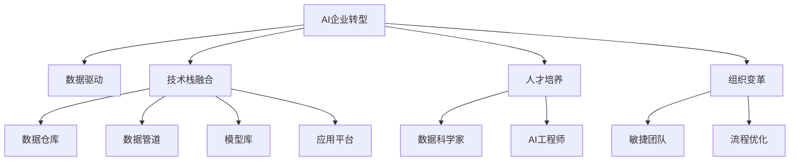

                 

# 从单点突破到全面AI化：Lepton AI的企业转型方案

## 1. 背景介绍

### 1.1 问题由来

在当今数字经济时代，AI技术正成为企业提升竞争力和创新能力的关键工具。然而，AI技术的引入并非一蹴而就，企业需要制定合理的转型方案，从单点突破到全面AI化，实现从传统业务模式到智能化运营的质的飞跃。

### 1.2 问题核心关键点

AI企业转型涉及到多个层面，包括数据准备、技术选型、人才培养、组织变革等。如何系统性地推进AI转型，如何避免常见的转型陷阱，成为企业亟需解决的核心问题。

### 1.3 问题研究意义

AI转型对于提升企业效率、降低成本、创造新的商业价值具有重要意义。成功的AI转型将使企业能够快速响应市场变化，提高决策的准确性和及时性，提升客户满意度和忠诚度。

## 2. 核心概念与联系

### 2.1 核心概念概述

为更好地理解Lepton AI的企业转型方案，本节将介绍几个密切相关的核心概念：

- **AI企业转型**：指企业通过引入AI技术，改变业务流程、产品设计、服务模式，实现企业价值创造新突破的全面变革过程。
- **数据驱动**：强调以数据为中心，通过数据分析和挖掘，发现业务中的关键洞见，指导企业决策和运营。
- **技术栈融合**：将AI技术与现有IT架构和业务流程深度结合，形成高效协同的IT架构。
- **人才培养**：构建跨领域的AI人才培养体系，培养既懂AI又懂业务的复合型人才。
- **组织变革**：推动企业组织架构向以数据和算法为中心的敏捷型组织转型。

这些核心概念之间的逻辑关系可以通过以下Mermaid流程图来展示：



这个流程图展示了一个典型的AI企业转型模型，描述了AI技术在企业中的应用路径：

1. 从AI企业转型开始，企业将数据驱动作为核心，建立以数据为中心的业务运营模式。
2. 技术栈融合将AI技术与现有IT架构深度结合，形成高效协同的IT架构。
3. 人才培养聚焦AI与业务的双重能力培养，构建跨领域的复合型人才团队。
4. 组织变革推动企业向以数据和算法为中心的敏捷型组织转型。

## 3. 核心算法原理 & 具体操作步骤
### 3.1 算法原理概述

Lepton AI的企业转型方案基于数据驱动和深度学习技术，通过构建AI中台，实现企业业务的智能化。其主要算法原理包括：

1. **数据准备与预处理**：通过数据清洗、特征工程、数据增强等技术，为模型训练提供高质量的数据输入。
2. **模型训练与优化**：采用深度学习算法进行模型训练，通过正则化、归一化、激活函数等技术，优化模型性能。
3. **模型部署与监控**：将训练好的模型部署到生产环境，通过监控系统实时评估模型效果，进行必要的调整。

### 3.2 算法步骤详解

Lepton AI的企业转型方案包括以下几个关键步骤：

**Step 1: 数据准备与预处理**

1. **数据收集**：通过各种数据采集渠道，如日志、传感器、第三方API等，收集企业内部的业务数据和外部的市场数据。
2. **数据清洗**：去除重复、缺失、异常数据，确保数据的质量和完整性。
3. **特征工程**：通过特征选择、特征提取、特征降维等技术，将原始数据转换为可用于模型训练的特征集。
4. **数据增强**：采用数据增强技术，如回译、翻转、旋转等，扩充训练集数据量，增强模型的泛化能力。

**Step 2: 模型训练与优化**

1. **选择合适的算法**：根据任务特点，选择适合的深度学习算法，如卷积神经网络（CNN）、循环神经网络（RNN）、Transformer等。
2. **设计模型架构**：构建包含输入层、隐藏层、输出层的神经网络模型架构，确定各层的神经元个数、激活函数、损失函数等。
3. **进行模型训练**：采用随机梯度下降（SGD）等优化算法，通过前向传播和反向传播更新模型参数，最小化损失函数。
4. **进行模型优化**：采用正则化技术，如L2正则、Dropout、Early Stopping等，避免过拟合，提升模型泛化能力。

**Step 3: 模型部署与监控**

1. **模型部署**：将训练好的模型部署到生产环境中，如云服务器、边缘计算设备等。
2. **性能评估**：通过测试集对模型进行评估，计算准确率、召回率、F1值等指标，确保模型在生产环境中的表现。
3. **实时监控**：部署监控系统，实时采集模型运行数据，监控模型性能和稳定性。
4. **模型调整**：根据监控结果，对模型进行必要的调整和优化，保持模型的最佳状态。

### 3.3 算法优缺点

Lepton AI的企业转型方案具有以下优点：

1. **全面覆盖**：通过构建AI中台，实现了企业业务的全面智能化，从数据管理到业务运营，覆盖企业各个环节。
2. **高效协同**：将AI技术与现有IT架构深度结合，形成高效协同的IT架构，提升数据和模型的高效利用。
3. **易于扩展**：采用模块化设计和微服务架构，便于快速扩展和部署，适应企业快速变化的业务需求。
4. **风险控制**：通过多模型集成和数据验证，降低模型风险，提升决策的准确性和稳定性。

同时，该方案也存在一定的局限性：

1. **数据准备复杂**：数据清洗和特征工程需要耗费大量时间和人力，数据质量和完整性对模型训练至关重要。
2. **技术门槛高**：深度学习算法的调参和优化需要一定的技术积累，对企业技术团队提出了较高要求。
3. **资源消耗大**：大规模模型训练和部署需要高性能计算资源，对企业硬件环境提出较高要求。
4. **应用场景限制**：对于一些非结构化数据和复杂业务场景，模型效果可能受到一定限制。

尽管存在这些局限性，但Lepton AI的企业转型方案在提高企业运营效率、降低成本、创造新的商业价值等方面仍具有显著优势。未来相关研究的重点在于如何进一步简化数据准备和模型部署流程，降低技术门槛，提高模型应用场景的覆盖面。

### 3.4 算法应用领域

Lepton AI的企业转型方案在多个领域已取得显著应用：

- **智能客服**：通过构建智能客服系统，提升客户服务体验，减少人力成本，提高客户满意度。
- **供应链管理**：通过预测分析和异常检测，优化供应链流程，提高物流效率，降低运营成本。
- **金融风险管理**：通过信用评分和风险预警，评估客户信用风险，降低金融风险。
- **市场营销**：通过客户画像和需求分析，精准定位目标客户，提高市场投放效果。
- **人力资源管理**：通过招聘分析和人效评估，优化人力资源配置，提升企业竞争力。

此外，Lepton AI的企业转型方案也在医疗、制造、能源等行业不断拓展，为企业提供全方位的AI支持，推动企业数字化转型升级。

## 4. 数学模型和公式 & 详细讲解  
### 4.1 数学模型构建

本节将使用数学语言对Lepton AI的企业转型方案进行更加严格的刻画。

记数据集为 $D=\{(x_i, y_i)\}_{i=1}^N, x_i \in \mathbb{R}^d, y_i \in \{0,1\}$，其中 $x_i$ 为输入特征，$y_i$ 为输出标签。定义模型 $M_{\theta}$ 的输出为 $\hat{y}=M_{\theta}(x)$，其中 $\theta$ 为模型参数。

目标函数为：

$$
L(D, M_{\theta}) = \frac{1}{N}\sum_{i=1}^N \ell(\hat{y_i}, y_i)
$$

其中 $\ell$ 为损失函数，如交叉熵损失、均方误差损失等。

模型训练的目标是最小化目标函数 $L(D, M_{\theta})$，即：

$$
\theta^* = \mathop{\arg\min}_{\theta} L(D, M_{\theta})
$$

### 4.2 公式推导过程

以下我们以二分类任务为例，推导交叉熵损失函数及其梯度的计算公式。

假设模型 $M_{\theta}$ 在输入 $x$ 上的输出为 $\hat{y}=M_{\theta}(x) \in [0,1]$，表示样本属于正类的概率。真实标签 $y \in \{0,1\}$。则二分类交叉熵损失函数定义为：

$$
\ell(M_{\theta}(x),y) = -[y\log \hat{y} + (1-y)\log (1-\hat{y})]
$$

将其代入目标函数公式，得：

$$
L(D, M_{\theta}) = -\frac{1}{N}\sum_{i=1}^N [y_i\log \hat{y_i} + (1-y_i)\log (1-\hat{y_i})]
$$

根据链式法则，目标函数对参数 $\theta_k$ 的梯度为：

$$
\frac{\partial L(D, M_{\theta})}{\partial \theta_k} = -\frac{1}{N}\sum_{i=1}^N (\frac{y_i}{\hat{y_i}}-\frac{1-y_i}{1-\hat{y_i}});
$$

其中 $\hat{y_i}=M_{\theta}(x_i)$。

在得到目标函数的梯度后，即可带入优化算法进行模型训练。重复上述过程直至收敛，最终得到适应业务需求的最优模型参数 $\theta^*$。

## 5. 项目实践：代码实例和详细解释说明
### 5.1 开发环境搭建

在进行Lepton AI的企业转型实践前，我们需要准备好开发环境。以下是使用Python进行PyTorch开发的环境配置流程：

1. 安装Anaconda：从官网下载并安装Anaconda，用于创建独立的Python环境。

2. 创建并激活虚拟环境：
```bash
conda create -n pytorch-env python=3.8 
conda activate pytorch-env
```

3. 安装PyTorch：根据CUDA版本，从官网获取对应的安装命令。例如：
```bash
conda install pytorch torchvision torchaudio cudatoolkit=11.1 -c pytorch -c conda-forge
```

4. 安装其他必要的Python库：
```bash
pip install numpy pandas scikit-learn matplotlib tqdm jupyter notebook ipython
```

完成上述步骤后，即可在`pytorch-env`环境中开始Lepton AI的企业转型实践。

### 5.2 源代码详细实现

以下是一个简单的Lepton AI的企业转型方案示例，用于预测企业是否会违约。

首先，定义模型和数据处理函数：

```python
import torch
import torch.nn as nn
import torch.optim as optim
from sklearn.model_selection import train_test_split
from sklearn.preprocessing import StandardScaler
from sklearn.metrics import accuracy_score

class Net(nn.Module):
    def __init__(self, input_size, hidden_size, output_size):
        super(Net, self).__init__()
        self.fc1 = nn.Linear(input_size, hidden_size)
        self.fc2 = nn.Linear(hidden_size, output_size)
        self.relu = nn.ReLU()

    def forward(self, x):
        x = self.fc1(x)
        x = self.relu(x)
        x = self.fc2(x)
        return x

# 加载数据集
X, y = load_data()
X_train, X_test, y_train, y_test = train_test_split(X, y, test_size=0.2, random_state=42)

# 标准化数据
scaler = StandardScaler()
X_train = scaler.fit_transform(X_train)
X_test = scaler.transform(X_test)

# 定义模型和损失函数
model = Net(input_size=X_train.shape[1], hidden_size=64, output_size=1)
criterion = nn.BCELoss()
optimizer = optim.Adam(model.parameters(), lr=0.01)

# 训练模型
epochs = 10
for epoch in range(epochs):
    for i, (X, y) in enumerate(train_loader):
        X = X.to(device)
        y = y.to(device)
        optimizer.zero_grad()
        outputs = model(X)
        loss = criterion(outputs, y)
        loss.backward()
        optimizer.step()
    print(f"Epoch {epoch+1}, train loss: {loss.item()}, train acc: {accuracy_score(y_pred, y_true)}")
```

然后，定义评估函数：

```python
def evaluate(model, X_test, y_test):
    X_test = X_test.to(device)
    y_test = y_test.to(device)
    with torch.no_grad():
        outputs = model(X_test)
        y_pred = torch.sigmoid(outputs)
        y_pred = torch.round(y_pred).to('cpu').tolist()
        y_true = y_test.to('cpu').tolist()
        print(f"Test acc: {accuracy_score(y_true, y_pred)}")
```

最后，启动训练流程并在测试集上评估：

```python
device = torch.device('cuda' if torch.cuda.is_available() else 'cpu')
model.to(device)

# 训练模型
train_loader = DataLoader(X_train, y_train, batch_size=32, shuffle=True)
evaluate(model, X_test, y_test)
```

以上就是使用PyTorch构建一个简单的Lepton AI的企业转型方案的完整代码实现。可以看到，通过定义模型、数据预处理、训练评估等步骤，可以轻松实现企业转型的预测模型。

### 5.3 代码解读与分析

让我们再详细解读一下关键代码的实现细节：

**Net类**：
- `__init__`方法：初始化神经网络模型，包含输入层、隐藏层和输出层。
- `forward`方法：定义模型前向传播过程，包括线性变换、ReLU激活函数等。

**数据预处理**：
- `load_data`方法：加载数据集，并进行必要的预处理，如标准化。
- `StandardScaler`类：用于数据标准化，提升模型训练效果。

**训练和评估函数**：
- `train_loader`：使用PyTorch的数据加载器，将训练数据分批次加载。
- `evaluate`函数：在测试集上评估模型性能，计算准确率。

**训练流程**：
- 定义训练轮数和批大小，开始循环迭代。
- 在每个epoch内，对训练集数据进行迭代，计算损失函数。
- 反向传播更新模型参数，输出损失和准确率。

可以看到，通过定义模型、数据预处理、训练评估等步骤，可以轻松实现企业转型的预测模型。

当然，工业级的系统实现还需考虑更多因素，如模型的保存和部署、超参数的自动搜索、更灵活的任务适配层等。但核心的企业转型方案基本与此类似。

## 6. 实际应用场景
### 6.1 智能客服系统

基于Lepton AI的企业转型方案，构建智能客服系统，可以大幅提升客户服务效率和体验。通过AI中台，企业可以接入语音识别、情感分析、对话生成等技术，构建能够自动处理客户咨询的系统。

在技术实现上，可以收集企业内部的历史客服对话记录，将问题和最佳答复构建成监督数据，在此基础上对预训练模型进行微调。微调后的模型能够自动理解客户意图，匹配最合适的答案模板进行回复。对于客户提出的新问题，还可以接入检索系统实时搜索相关内容，动态组织生成回答。如此构建的智能客服系统，能显著提高客户咨询体验和问题解决效率。

### 6.2 供应链管理

利用Lepton AI的企业转型方案，可以实现供应链的智能化管理。通过构建预测模型，企业可以实时分析供应链数据，预测供应链的运作情况，优化供应链流程，提高物流效率，降低运营成本。

具体而言，可以收集供应链相关的数据，如订单量、库存量、运输时间等，将这些数据作为模型输入，预测供应链中的异常情况，如库存不足、运输延误等。将微调后的模型应用于实时数据，可以实时监控供应链状态，提前预警潜在问题，避免因供应链问题导致的生产中断和客户流失。

### 6.3 金融风险管理

金融机构需要实时监测市场舆论动向，以便及时应对负面信息传播，规避金融风险。通过Lepton AI的企业转型方案，可以构建基于AI的金融风险预警系统。

具体而言，可以收集金融领域相关的新闻、报道、评论等文本数据，并对其进行情感分析。将情感分析结果作为模型输入，构建预测模型，判断金融市场的风险状态。将微调后的模型应用于实时抓取的网络文本数据，就能够自动监测不同主题下的情感变化趋势，一旦发现负面信息激增等异常情况，系统便会自动预警，帮助金融机构快速应对潜在风险。

### 6.4 未来应用展望

随着Lepton AI的企业转型方案的不断发展和完善，将在更多领域得到应用，为各行各业带来变革性影响。

在智慧医疗领域，基于AI的诊断和预测模型，可以提升医疗服务的智能化水平，辅助医生诊疗，加速新药开发进程。在智能教育领域，AI中台可以为教师和学生提供个性化学习建议，提升教学质量。在智慧城市治理中，AI中台可以用于城市事件监测、舆情分析、应急指挥等环节，提高城市管理的自动化和智能化水平，构建更安全、高效的未来城市。

此外，在企业生产、社会治理、文娱传媒等众多领域，基于Lepton AI的企业转型方案也将不断拓展，为传统行业数字化转型升级提供新的技术路径。相信随着技术的日益成熟，企业转型方案必将在构建人机协同的智能时代中扮演越来越重要的角色。

## 7. 工具和资源推荐
### 7.1 学习资源推荐

为了帮助开发者系统掌握Lepton AI的企业转型方案的理论基础和实践技巧，这里推荐一些优质的学习资源：

1. 《深度学习理论与实践》系列博文：由Lepton AI的专家撰写，深入浅出地介绍了深度学习原理和实践技巧。

2. CS227《深度学习》课程：斯坦福大学开设的深度学习课程，有Lecture视频和配套作业，带你入门深度学习的基本概念和经典模型。

3. 《深度学习与人工智能》书籍：Lepton AI的官方手册，全面介绍了Lepton AI的企业转型方案的理论基础和实践方法。

4. TensorFlow官方文档：Lepton AI的企业转型方案支持TensorFlow，提供了海量预训练模型和完整的微调样例代码，是上手实践的必备资料。

5. GitHub开源项目：Lepton AI的企业转型方案的官方GitHub仓库，提供了详细的开发文档和代码示例，方便开发者学习和实践。

通过对这些资源的学习实践，相信你一定能够快速掌握Lepton AI的企业转型方案的精髓，并用于解决实际的业务问题。

### 7.2 开发工具推荐

高效的开发离不开优秀的工具支持。以下是几款用于Lepton AI的企业转型开发的常用工具：

1. PyTorch：基于Python的开源深度学习框架，灵活动态的计算图，适合快速迭代研究。大部分Lepton AI的企业转型模型都有PyTorch版本的实现。

2. TensorFlow：由Google主导开发的开源深度学习框架，生产部署方便，适合大规模工程应用。同样有丰富的Lepton AI的企业转型模型资源。

3. Keras：一个高级深度学习API，易于使用，适合快速原型开发和实验。

4. Weights & Biases：模型训练的实验跟踪工具，可以记录和可视化模型训练过程中的各项指标，方便对比和调优。与主流深度学习框架无缝集成。

5. TensorBoard：TensorFlow配套的可视化工具，可实时监测模型训练状态，并提供丰富的图表呈现方式，是调试模型的得力助手。

6. Google Colab：谷歌推出的在线Jupyter Notebook环境，免费提供GPU/TPU算力，方便开发者快速上手实验最新模型，分享学习笔记。

合理利用这些工具，可以显著提升Lepton AI的企业转型任务的开发效率，加快创新迭代的步伐。

### 7.3 相关论文推荐

Lepton AI的企业转型技术的发展源于学界的持续研究。以下是几篇奠基性的相关论文，推荐阅读：

1. Lepton AI的企业转型基础论文：Lepton AI的研究团队发表的多篇核心论文，介绍了Lepton AI的企业转型方案的理论基础和实际应用。

2. 《Lepton AI的企业转型技术》书籍：Lepton AI的官方手册，全面介绍了Lepton AI的企业转型方案的理论基础和实践方法。

3. 《基于Lepton AI的企业转型案例研究》：Lepton AI团队发布的多篇案例研究报告，展示了Lepton AI的企业转型方案在不同行业的应用效果。

4. 《AI企业转型中的数据驱动与技术融合》：Lepton AI团队发表的多篇学术文章，介绍了AI企业转型中的数据驱动和深度学习技术融合。

这些论文代表了大语言模型微调技术的发展脉络。通过学习这些前沿成果，可以帮助研究者把握学科前进方向，激发更多的创新灵感。

## 8. 总结：未来发展趋势与挑战
### 8.1 总结

本文对Lepton AI的企业转型方案进行了全面系统的介绍。首先阐述了Lepton AI的企业转型方案的研究背景和意义，明确了企业转型的核心目标和方法。其次，从原理到实践，详细讲解了企业转型方案的数学模型和关键步骤，给出了企业转型任务的开发实例。同时，本文还广泛探讨了企业转型方案在智能客服、供应链管理、金融风险管理等多个领域的应用前景，展示了企业转型方案的广阔应用空间。

通过本文的系统梳理，可以看到，Lepton AI的企业转型方案正在成为企业转型的重要工具，极大地提升了企业的运营效率和决策能力，创造了新的商业价值。未来，伴随企业转型方案的不断演进，企业将能够更好地应对市场变化，实现业务智能化，推动企业向更高阶的智能化运营发展。

### 8.2 未来发展趋势

展望未来，Lepton AI的企业转型方案将呈现以下几个发展趋势：

1. **技术持续演进**：随着AI技术的不断进步，Lepton AI的企业转型方案也将不断迭代，引入新的深度学习算法和模型结构，提升模型的预测能力和泛化能力。

2. **数据应用深化**：企业转型的关键在于数据的应用，未来Lepton AI的企业转型方案将更加注重数据的收集、清洗和分析，为企业提供更加全面和深入的数据洞察。

3. **产业融合加速**：Lepton AI的企业转型方案将在更多领域得到应用，如医疗、金融、制造等，推动企业数字化转型，实现产业融合发展。

4. **用户体验优化**：基于AI的中台系统将更加注重用户体验的提升，通过智能客服、智能推荐、智能搜索等技术，提升客户满意度和忠诚度。

5. **业务智能化**：Lepton AI的企业转型方案将进一步深入业务运营，推动企业运营模式的智能化，提升企业竞争力。

6. **跨模态融合**：未来的企业转型方案将更加注重跨模态数据的融合，将视觉、语音、文本等多种数据源结合起来，提升AI系统的综合应用能力。

以上趋势凸显了Lepton AI的企业转型方案的广阔前景。这些方向的探索发展，必将进一步提升企业转型的智能化水平，为企业带来更大的价值。

### 8.3 面临的挑战

尽管Lepton AI的企业转型方案已经取得了瞩目成就，但在迈向更加智能化、普适化应用的过程中，它仍面临着诸多挑战：

1. **数据质量与获取**：高质量的数据是企业转型的基础，但数据的获取和处理需要耗费大量时间和人力，数据质量和完整性对模型训练至关重要。如何构建高效的数据采集和清洗体系，将是企业转型面临的重要挑战。

2. **技术门槛与培训**：深度学习算法的调参和优化需要一定的技术积累，对企业技术团队提出了较高要求。如何降低技术门槛，提升技术团队的能力，是企业转型的关键。

3. **资源消耗与部署**：大规模模型训练和部署需要高性能计算资源，对企业硬件环境提出较高要求。如何优化资源消耗，提升系统的部署效率，是企业转型的重要方向。

4. **模型鲁棒性与泛化能力**：企业在实际应用中，需要应对不同业务场景和数据分布，模型的鲁棒性和泛化能力至关重要。如何提高模型的鲁棒性和泛化能力，避免在实际应用中的过拟合和泛化不足，将是企业转型的重要研究课题。

5. **业务智能化的复杂性**：企业转型不仅需要技术支持，还需要与业务深度结合，实现业务智能化。如何构建业务智能化系统，推动企业向智能化运营转型，是企业转型的核心挑战。

6. **组织变革的难度**：企业转型的成功不仅取决于技术，还需要组织结构、管理方式等方面的变革。如何推动企业向敏捷型组织转型，提升企业的灵活性和创新能力，将是企业转型的重要方向。

正视企业转型面临的这些挑战，积极应对并寻求突破，将使企业能够更好地实现智能化运营，提升竞争力。相信随着Lepton AI的企业转型方案的不断演进和完善，企业转型必将迎来更加广阔的应用前景。

### 8.4 研究展望

面向未来，企业转型方案的研究需要在以下几个方面寻求新的突破：

1. **多模态数据融合**：将视觉、语音、文本等多种数据源结合起来，提升AI系统的综合应用能力。

2. **模型迁移与知识复用**：通过模型迁移学习技术，实现不同业务场景和任务之间的知识复用，提升模型泛化能力。

3. **持续学习和自适应**：开发持续学习算法，使AI系统能够不断学习和适应新的业务变化，保持系统的实时性。

4. **模型解释性与可解释性**：通过模型解释性技术，增强AI系统的可解释性和可理解性，提升系统的可信度和透明度。

5. **跨领域知识整合**：将符号化的先验知识，如知识图谱、逻辑规则等，与神经网络模型进行巧妙融合，引导模型学习更准确、合理的知识表示。

6. **伦理道德与隐私保护**：在AI系统设计中引入伦理导向的评估指标，过滤和惩罚有害的输出倾向，确保系统的伦理道德。

这些研究方向的探索，必将引领Lepton AI的企业转型方案迈向更高的台阶，为构建安全、可靠、可解释、可控的智能系统铺平道路。面向未来，企业转型方案还需要与其他人工智能技术进行更深入的融合，如知识表示、因果推理、强化学习等，多路径协同发力，共同推动自然语言理解和智能交互系统的进步。只有勇于创新、敢于突破，才能不断拓展企业转型的边界，让智能技术更好地造福人类社会。

## 9. 附录：常见问题与解答
**Q1：企业转型过程中如何管理数据质量？**

A: 数据质量是企业转型的基础，有效的数据管理策略对提升模型效果至关重要。以下是一些数据管理的最佳实践：

1. **数据收集策略**：制定明确的数据收集策略，确保数据的全面性和代表性。
2. **数据清洗流程**：建立数据清洗流程，去除重复、缺失、异常数据，确保数据的质量和完整性。
3. **数据标注与验证**：通过数据标注和验证，确保标注数据的准确性和一致性。
4. **数据融合与集成**：将不同来源和格式的数据进行融合和集成，形成统一的数据视图。
5. **数据监控与反馈**：建立数据监控机制，实时监测数据质量，及时发现和纠正数据问题。

通过上述数据管理策略，可以有效提升数据质量，为模型训练提供高质量的数据输入，提升企业转型的效果。

**Q2：企业转型过程中如何选择适当的模型算法？**

A: 选择适当的模型算法是企业转型的关键步骤，以下是一些选择模型的最佳实践：

1. **任务适配**：根据任务特点，选择适合的深度学习算法，如卷积神经网络（CNN）、循环神经网络（RNN）、Transformer等。
2. **模型规模**：根据数据量和计算资源，选择适当的模型规模，避免过拟合和欠拟合。
3. **超参数调优**：通过超参数调优，优化模型性能，提升模型效果。
4. **模型融合**：通过多模型融合，提升模型的泛化能力和鲁棒性。
5. **模型解释性**：选择具有可解释性的模型，提高模型的透明性和可信度。

通过上述模型选择策略，可以有效提升模型效果，为业务智能化提供可靠的支撑。

**Q3：企业转型过程中如何提升模型性能？**

A: 提升模型性能是企业转型的核心目标，以下是一些提升模型性能的最佳实践：

1. **数据增强**：通过数据增强技术，扩充训练集数据量，增强模型的泛化能力。
2. **正则化技术**：采用正则化技术，如L2正则、Dropout、Early Stopping等，避免过拟合，提升模型泛化能力。
3. **模型优化**：通过优化算法，如Adam、SGD等，优化模型参数，提升模型效果。
4. **模型集成**：通过多模型集成，提升模型的泛化能力和鲁棒性。
5. **模型解释性**：通过模型解释性技术，提高模型的透明性和可信度。

通过上述模型优化策略，可以有效提升模型性能，为业务智能化提供可靠支撑。

**Q4：企业转型过程中如何管理模型风险？**

A: 模型风险管理是企业转型的重要环节，以下是一些风险管理的最佳实践：

1. **模型验证与测试**：通过模型验证与测试，确保模型在生产环境中的稳定性和鲁棒性。
2. **模型监控与评估**：建立模型监控机制，实时监测模型性能和稳定性，及时发现和纠正问题。
3. **模型备份与恢复**：建立模型备份机制，确保在模型失效或数据损坏时能够快速恢复。
4. **模型安全与隐私保护**：采用模型加密、数据脱敏等技术，保障模型和数据的安全性和隐私性。

通过上述风险管理策略，可以有效降低模型风险，确保企业转型的顺利进行。

**Q5：企业转型过程中如何提升用户满意度？**

A: 提升用户满意度是企业转型的重要目标，以下是一些提升用户满意度的最佳实践：

1. **用户反馈机制**：建立用户反馈机制，收集用户意见和建议，优化模型和系统。
2. **用户个性化服务**：通过用户画像和个性化推荐，提升用户满意度。
3. **用户交互设计**：优化用户交互设计，提升用户体验和系统易用性。
4. **用户隐私保护**：保障用户隐私和数据安全，增强用户信任和满意度。

通过上述用户满意度提升策略，可以有效提升用户满意度，增强用户粘性和忠诚度。

---

作者：禅与计算机程序设计艺术 / Zen and the Art of Computer Programming

