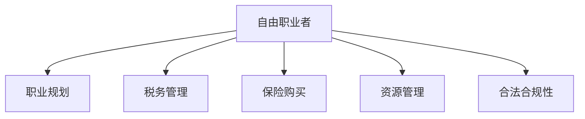

                 

# 从员工到自由职业者的转型指南

## 1. 背景介绍

### 1.1 问题由来
在数字化转型的大潮下，许多传统行业的工作岗位面临缩减，大量员工面临转型的挑战。然而，经济发展的需要使得各类自由职业者需求急剧增加，这就促使一批有志于追求更灵活工作方式的专业人士考虑从传统雇佣模式转型为自由职业者。

### 1.2 问题核心关键点
对于转型为自由职业者的员工来说，首要面临的问题包括如何规划职业路径，如何构建稳定的收入来源，以及如何管理和优化个人时间与资源。其次，如何合法合规地进行税务申报、保险购买等事务，也是转型中必须解决的实际问题。

## 2. 核心概念与联系

### 2.1 核心概念概述

在探讨如何转型为自由职业者之前，我们首先需要明确几个关键概念：

- **自由职业者(Freelancers)**：独立工作者，不固定于某一雇主，通过提供专业技能或服务获得报酬。自由职业者可以从事软件开发、写作、设计、营销等多种职业。
- **职业规划(Career Planning)**：在职业发展的各个阶段，通过明确目标、规划路径、优化资源，使个人职业发展更有条理和方向。
- **税务管理(Tax Management)**：自由职业者需要了解和遵守相关的税务法规，合法合规地进行收入申报和税务处理。
- **保险购买(Insurance Coverage)**：自由职业者通常需要为自己购买健康保险、养老保险、意外保险等，以保障工作期间的身体健康和财务稳定。
- **资源管理(Resource Management)**：合理管理个人时间、财务、技能等资源，以提高工作效率和收入。
- **合法合规性(Legal Compliance)**：自由职业者需遵守相关的劳动法规、税法、合同法等，确保自身行为的合法合规。

这些概念之间的逻辑关系可以通过以下Mermaid流程图来展示：



这个流程图展示自由职业者在职业转型过程中需要考虑的关键环节。

## 3. 核心算法原理 & 具体操作步骤
### 3.1 算法原理概述

转型为自由职业者，其核心原理是优化个人资源，构建稳定的收入来源，并合理管理风险。具体到算法层面，可视为一个多目标优化问题，主要目标包括提高收入、降低成本、提升工作效率和维持财务稳定。

### 3.2 算法步骤详解

以下步骤详细描述了自由职业者转型过程中应遵循的主要操作流程：

**Step 1: 自我评估与技能提升**
- 评估自身技能和兴趣，确定转型目标和可行的职业路径。
- 根据需求，进行针对性的技能提升和知识补充。
- 利用在线课程、工作坊、研讨会等资源进行自我学习。

**Step 2: 建立个人品牌和网络**
- 创建个人网站或博客，展示个人能力和案例。
- 在社交平台如LinkedIn、GitHub等建立专业形象，积极与同行互动。
- 参与行业会议、活动，扩大个人影响力和市场网络。

**Step 3: 选择合适的项目和客户**
- 根据个人技能和兴趣，寻找合适的项目和客户。
- 使用自由职业平台如Upwork、Freelancer等，寻找工作机会。
- 与潜在客户进行沟通和交流，确保项目与个人目标一致。

**Step 4: 制定工作流程和项目管理**
- 制定标准化的工作流程，包括需求分析、项目启动、进度跟踪等。
- 使用项目管理工具如Asana、Trello等，帮助组织和监控项目进展。
- 建立与客户间的沟通机制，及时获取反馈并调整工作计划。

**Step 5: 财务管理和税务申报**
- 根据项目合同和收入情况，进行收入和支出预算。
- 建立财务管理制度，如定期记账、月度财务报告等。
- 遵守当地税法规定，定期进行税务申报，考虑雇佣税务顾问。

**Step 6: 保险购买和风险管理**
- 根据自身需求，购买健康保险、养老保险、意外保险等。
- 制定风险管理计划，包括应急资金储备、备用项目和客户等。
- 定期进行风险评估和调整，确保财务和业务的安全稳定。

**Step 7: 合法合规性保障**
- 了解并遵守劳动法规、税法、合同法等相关法律。
- 建立合法合规的业务架构，如个人独资公司、咨询公司等。
- 与律师、会计师等专业人士合作，确保法律问题得到妥善处理。

### 3.3 算法优缺点

自由职业者的转型模型具有以下优点：
1. 提高灵活性和自主性，可以根据自己的兴趣和需求灵活安排工作。
2. 能接手更多不同类型的项目，拓宽职业发展路径。
3. 接触不同客户，积累更丰富的行业经验。
4. 提升个人品牌和市场竞争力。

同时，转型过程也面临一些挑战：
1. 初期收入不稳定，需付出大量时间和精力进行市场开拓。
2. 需要较强的自我管理能力和项目协调能力。
3. 面临较高的税务和财务管理负担。
4. 需要具备较强的沟通和谈判能力。

### 3.4 算法应用领域

自由职业者转型模型不仅适用于软件工程师、设计师、作家等技术密集型职业，也适用于营销、咨询、教育等领域的专业人士。通过合理规划和操作，任何拥有特定技能和经验的人都可以在自由职业领域取得成功。

## 4. 数学模型和公式 & 详细讲解  
### 4.1 数学模型构建

转型为自由职业者的过程可以视为一个多目标优化问题，主要目标为：
- 最大化收入（Income Maximization）
- 最小化成本（Cost Minimization）
- 提高工作效率（Efficiency Improvement）
- 维持财务稳定（Financial Stability）

用数学模型表示为：

$$ \begin{align}
\max & \quad I(x_1, x_2, \dots, x_n) \\
\min & \quad C(x_1, x_2, \dots, x_n) \\
\text{s.t.} & \quad E(x_1, x_2, \dots, x_n) \geq 0 \\
& \quad S(x_1, x_2, \dots, x_n) \geq 0 \\
\end{align}
$$

其中 $x_i$ 代表第 $i$ 项资源（如时间、财务、客户关系等）的投入量，$I$ 代表收入，$C$ 代表成本，$E$ 和 $S$ 分别代表效率和工作状态。

### 4.2 公式推导过程

以最大化收入为例，设 $I(x)$ 为收入函数，$C(x)$ 为成本函数，$e(x)$ 为效率函数，$s(x)$ 为工作状态函数。通过线性规划、整数规划或混合整数规划等方法，求解上述优化问题。以线性规划为例，目标函数和约束条件可表示为：

$$
\max I(x) = a_1x_1 + a_2x_2 + \dots + a_nx_n
$$

$$
\begin{cases}
b_1x_1 + b_2x_2 + \dots + b_nx_n \leq d \\
c_1x_1 + c_2x_2 + \dots + c_nx_n = e \\
d_1x_1 + d_2x_2 + \dots + d_nx_n \geq 0 \\
e_1x_1 + e_2x_2 + \dots + e_nx_n \geq 0
\end{cases}
$$

其中 $a_i, b_i, c_i, d_i, e_i$ 分别为常数，代表不同的约束条件。

### 4.3 案例分析与讲解

假设某自由职业者小李，通过承接多个项目来提升收入。根据数据，小李每天可完成 $10$ 个软件开发任务，每个任务收入 $100$ 元，但完成这些任务需要 $5$ 小时，成本为 $30$ 元。同时，小李还可以接手广告设计工作，每天可完成 $3$ 个设计任务，每个任务收入 $300$ 元，成本为 $60$ 元。小李每天可工作 $8$ 小时，其中 $2$ 小时用于项目管理和营销，剩余 $6$ 小时可用于接任务。小李还需保持 $30\%$ 的时间用于学习新技能。

使用线性规划模型求解，可以确定小李每天应投入多少时间在软件开发和广告设计任务上，以达到最大化收入的目标。

## 5. 项目实践：代码实例和详细解释说明
### 5.1 开发环境搭建

在进行自由职业者转型模型的项目实践前，我们需要准备好开发环境。以下是使用Python进行Pandas、NumPy、SciPy等数据科学工具包的环境配置流程：

1. 安装Anaconda：从官网下载并安装Anaconda，用于创建独立的Python环境。

2. 创建并激活虚拟环境：
```bash
conda create -n freelancer python=3.8 
conda activate freelancer
```

3. 安装相关库：
```bash
conda install pandas numpy scipy matplotlib seaborn
```

4. 导入项目数据：
```python
import pandas as pd

# 导入数据
data = pd.read_csv('freelancer_data.csv')
```

完成上述步骤后，即可在`freelancer`环境中开始自由职业者转型模型的开发和应用。

### 5.2 源代码详细实现

以下是一个简单的自由职业者转型模型，使用线性规划求解最优解：

```python
from scipy.optimize import linprog

# 设定收入和成本函数
def objective_function(x):
    return [100 * x[0] + 300 * x[1]]

# 设定约束条件
def constraint(x):
    return [5 * x[0] + 3 * x[1] - 8, 6 * x[0] + 3 * x[1] - 8, 0.3 * x[0] + 0.3 * x[1] - 1]

# 定义问题
model = linprog(c=objective_function([x[0], x[1]]), A_ub=constraint, b_ub=[5, 6, 0.3], bounds=[(0, 8), (0, 3)], method='simplex')

# 输出最优解
print("最优解：", model.x)
print("最大收入：", model.fun)
```

### 5.3 代码解读与分析

让我们详细解读一下关键代码的实现细节：

**linprog函数**：
- `linprog`是SciPy库中的线性规划求解函数，可解决多目标优化问题。
- 输入参数包括目标函数、约束条件、上下界等。
- `c`参数代表目标函数的系数向量，`A_ub`和`b_ub`分别代表约束条件矩阵和向量。

**目标函数**：
- `objective_function`函数计算总收益，即每小时的收入。
- `x[0]`和`x[1]`分别代表小李在软件开发和广告设计任务上的时间投入。

**约束条件**：
- `constraint`函数计算总工作时间和技能投入的限制。
- 约束条件设定了工作时间、任务数和技能投入的上限。

**模型求解**：
- 调用`linprog`函数求解线性规划问题，获取最优解`model.x`和最优值`model.fun`。

## 6. 实际应用场景
### 6.1 项目管理和任务分配

项目管理和任务分配是自由职业者转型模型中非常重要的环节。通过合理规划和调度，确保任务按时完成并最大化收入。

**Step 1: 任务评估与优先级排序**
- 评估所有项目需求，确定优先级和紧急程度。
- 根据项目的复杂度和收益，制定详细的项目计划和时间表。

**Step 2: 工作时间与任务分配**
- 使用时间块管理法，将工作时间分成固定块，每块时间集中处理单一任务。
- 根据任务优先级和紧急程度，合理分配时间块。

**Step 3: 项目进度跟踪**
- 使用项目管理工具如Trello、Asana等，实时监控项目进度。
- 定期更新项目状态和资源分配，及时调整工作计划。

### 6.2 财务管理与税务申报

财务管理与税务申报是自由职业者转型模型中的核心操作。通过科学管理财务和合法合规的税务申报，确保收入和成本的平衡。

**Step 1: 收入和支出预算**
- 根据历史数据和当前业务情况，制定详细的收入和支出预算。
- 使用Excel或Quicken等财务软件，进行预算管理和跟踪。

**Step 2: 财务报告与分析**
- 定期生成财务报告，包括月度收入、支出、利润等。
- 使用财务分析工具如Tableau、Power BI等，进行数据可视化分析。

**Step 3: 税务申报与管理**
- 使用税务申报软件如TurboTax、QuickBooks等，进行税务申报。
- 与税务顾问合作，确保申报信息的准确性和合法合规。

### 6.3 风险管理与保险购买

风险管理与保险购买是自由职业者转型模型中的重要保障。通过合理规划风险和购买保险，确保工作期间的财务稳定。

**Step 1: 风险评估与应急储备**
- 进行风险评估，确定高风险任务和关键客户。
- 建立应急资金储备，如救济基金、备用项目等。

**Step 2: 保险购买与保障**
- 根据自身需求，购买健康保险、养老保险、意外保险等。
- 与保险公司合作，确定保险方案和保障范围。

**Step 3: 风险监控与调整**
- 定期评估风险情况，调整应急储备和保险方案。
- 通过风险管理软件，实时监控风险变化。

## 7. 工具和资源推荐
### 7.1 学习资源推荐

为了帮助自由职业者更好地掌握转型技能和工具，这里推荐一些优质的学习资源：

1. **Coursera《自由职业者的营销与财务管理》课程**：涵盖自由职业者的基础营销、财务管理、法律合规等内容，系统性学习自由职业者的核心技能。

2. **Udemy《从员工到自由职业者的转型指南》课程**：深入浅出地讲解自由职业者的转型步骤、注意事项、实战案例，是自由职业者的必备指南。

3. **LinkedIn Learning《自由职业者的项目管理》课程**：介绍项目管理的基本原理、工具和技巧，帮助自由职业者高效管理项目。

4. **ACG《自由职业者税务指南》书籍**：详细介绍自由职业者的税务申报、税务筹划等内容，确保合法合规。

5. **Freelancers Union《自由职业者的保险指南》网站**：提供全面的保险购买、风险管理信息，帮助自由职业者选择适合的保险方案。

通过对这些资源的学习实践，相信自由职业者能够全面掌握转型所需的各项技能和工具。

### 7.2 开发工具推荐

自由职业者的转型模型开发需要借助多种工具进行数据处理、项目管理和财务管理等。以下是一些推荐的开发工具：

1. **Python**：灵活高效的数据处理和计算工具，适合数据科学和自动化开发。

2. **Excel**：广泛使用的电子表格工具，方便进行财务预算、报表生成和数据分析。

3. **Tableau**：强大的数据可视化工具，支持复杂的数据分析和报表生成。

4. **Trello**：直观的项目管理工具，支持任务分配、进度跟踪和时间块管理。

5. **TurboTax**：常用的税务申报软件，支持详细的税务申报和信息管理。

6. **Power BI**：微软推出的数据分析工具，支持复杂的财务分析和报表生成。

合理利用这些工具，可以显著提升自由职业者转型模型的开发效率，快速实现自动化管理。

### 7.3 相关论文推荐

自由职业者的转型模型涉及多学科知识，包括经济、管理、财务等。以下是几篇相关的经典论文，推荐阅读：

1. **《自由职业者的商业管理》**：探讨自由职业者在商业管理中的挑战和机遇。

2. **《自由职业者的心理与行为研究》**：研究自由职业者在心理、行为上的特点，探讨如何提升工作满意度和效率。

3. **《自由职业者的财务管理》**：详细介绍自由职业者的财务管理方法，包括预算、财务报告和税务申报等。

4. **《自由职业者的法律合规》**：阐述自由职业者在法律合规方面的要求和措施，确保合法合规。

5. **《自由职业者的风险管理》**：探讨自由职业者在风险管理中的策略和方法，确保工作期间的财务和业务安全。

这些论文代表了大规模自由职业者转型模型的发展脉络。通过学习这些前沿成果，可以帮助自由职业者更好地规划和实现转型。

## 8. 总结：未来发展趋势与挑战
### 8.1 总结

本文对自由职业者转型模型的开发和应用进行了系统介绍。首先阐述了自由职业者转型模型的核心概念和操作流程，明确了转型过程中应重点关注的各个环节。其次，通过数学模型和编程实现，详细讲解了自由职业者转型模型的原理和操作步骤。同时，本文还广泛探讨了自由职业者在项目管理、财务管理、风险管理等方面的实际应用场景，展示了自由职业者转型模型的广泛适用性。

通过本文的系统梳理，可以看到，自由职业者转型模型为各类技术密集型和专业型人才提供了灵活、自主、高效的工作方式，具有广阔的应用前景。未来，伴随相关技术的不断发展和完善，自由职业者转型模型必将在更多的行业和领域中发挥重要作用，推动人类工作方式的持续变革。

### 8.2 未来发展趋势

展望未来，自由职业者转型模型将呈现以下几个发展趋势：

1. **技术工具的普及**：随着人工智能、大数据、区块链等技术的普及，自由职业者转型模型将更加智能化、自动化，进一步提高工作效率和收入水平。

2. **行业应用的扩展**：自由职业者转型模型将逐步扩展到更多行业，如金融、医疗、教育等，帮助不同领域的自由职业者实现转型。

3. **远程协作的增强**：借助云平台、远程协作工具，自由职业者转型模型将支持全球化的协作和市场开拓，提高国际竞争力。

4. **法律合规的改进**：随着法律法规的完善和数字化进程的加速，自由职业者转型模型将更好地集成法律合规信息，确保合法合规性。

5. **风险管理的创新**：利用大数据、人工智能等技术，自由职业者转型模型将提供更精准的风险评估和预警，帮助自由职业者规避风险。

以上趋势凸显了自由职业者转型模型的广阔前景，这些方向的探索发展，必将进一步提升自由职业者的工作效率和收入水平，推动自由职业市场的持续壮大。

### 8.3 面临的挑战

尽管自由职业者转型模型具有显著优势，但在实际应用中仍面临一些挑战：

1. **初始成本较高**：自由职业者转型初期需投入大量时间和精力进行市场开拓，经济成本较高。

2. **技能要求高**：自由职业者需具备较强的项目管理和财务分析能力，对自身要求较高。

3. **法律合规复杂**：不同地区的法律法规各异，自由职业者需了解并遵守相关法律，确保合法合规性。

4. **风险管理难度大**：自由职业者需具备较强的风险评估和应对能力，确保财务和业务稳定。

5. **技术工具依赖强**：自由职业者转型模型需依赖各种技术工具进行开发和应用，需具备相应的技术能力。

正视自由职业者转型模型面临的这些挑战，积极应对并寻求突破，将是大规模自由职业者成功转型的关键。相信随着学界和产业界的共同努力，这些挑战终将一一被克服，自由职业者转型模型必将在自由职业市场中发挥更大作用。

### 8.4 研究展望

未来的自由职业者转型模型研究将在以下几个方向进行深入探索：

1. **多目标优化算法**：研究更高效的多目标优化算法，优化资源分配，提升自由职业者的工作效率和收入。

2. **智能决策支持**：结合人工智能和数据分析技术，提供智能化的决策支持，帮助自由职业者做出更合理的资源分配和管理决策。

3. **个性化服务**：根据自由职业者的个人特点和需求，提供个性化的转型指导和资源推荐，提升转型成功率。

4. **全球化协作**：研究如何通过远程协作工具和平台，支持全球化的市场开拓和项目合作，提高国际竞争力。

5. **风险管理模型**：利用大数据和机器学习技术，构建更精准的风险管理模型，帮助自由职业者规避风险。

这些研究方向和创新将进一步提升自由职业者转型模型的实用性和科学性，推动自由职业市场和自由职业者行业的持续发展。总之，自由职业者转型模型需要通过不断的技术创新和优化，才能更好地适应数字化时代的变化，助力自由职业者实现转型成功。

## 9. 附录：常见问题与解答

**Q1: 自由职业者的主要收入来源是什么？**

A: 自由职业者的主要收入来源包括：
1. 项目咨询费：根据项目复杂度和时间，按小时或项目收费。
2. 合同项目费：签订长期合同，按阶段或项目成果收费。
3. 长期合作：与客户建立长期合作关系，按月或季度收费。
4. 个人品牌收入：通过个人网站、博客、社交平台等获取广告和赞助收入。

**Q2: 如何确保自由职业者的税务合法合规？**

A: 自由职业者需要遵守当地税法规定，合法合规地进行收入申报和税务处理。具体步骤包括：
1. 了解当地税法规定，注册税务编号。
2. 使用税务申报软件如TurboTax、QuickBooks等进行申报。
3. 定期进行税务申报，如季度申报、年度申报等。
4. 与税务顾问合作，确保申报信息的准确性和合法合规。

**Q3: 自由职业者如何进行风险管理？**

A: 自由职业者应通过以下步骤进行风险管理：
1. 进行风险评估，确定高风险任务和关键客户。
2. 建立应急资金储备，如救济基金、备用项目等。
3. 购买健康保险、养老保险、意外保险等，保障工作期间的财务稳定。
4. 定期评估风险情况，调整应急储备和保险方案。
5. 通过风险管理软件，实时监控风险变化。

**Q4: 自由职业者的技能要求有哪些？**

A: 自由职业者需要具备以下核心技能：
1. 项目管理：高效管理项目进度和资源。
2. 财务分析：掌握预算、财务报告等基本技能。
3. 法律合规：了解并遵守相关法律法规。
4. 风险管理：评估和规避风险，确保财务稳定。
5. 沟通能力：与客户和同行进行有效沟通，确保任务顺利完成。

**Q5: 自由职业者的工作时间如何管理？**

A: 自由职业者可以通过以下方法进行时间管理：
1. 时间块管理法：将工作时间分成固定块，每块时间集中处理单一任务。
2. 优先级排序：根据任务的重要性和紧急程度，合理分配时间块。
3. 使用项目管理工具如Trello、Asana等，实时监控项目进度。
4. 定期更新工作计划，调整任务分配。

通过系统性的学习和管理，自由职业者能够更好地应对转型过程中的各种挑战，实现高效、自主、灵活的工作方式，迈向成功之路。

