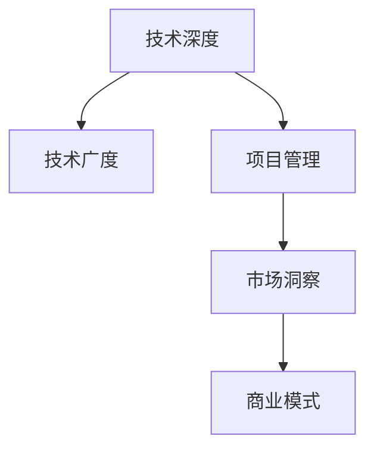

                 

## 1. 背景介绍

### 1.1 问题由来
随着科技的快速发展和社会的不断进步，人工智能(AI)领域经历了翻天覆地的变化。从最初的机器学习到现在的深度学习、强化学习，AI技术在各个领域的应用日益广泛，深刻改变了人们的生产生活方式。在这个过程中，技术专家们不仅需要掌握前沿技术，还需要具备更多的商业化能力，才能真正推动AI技术的落地应用。

### 1.2 问题核心关键点
从技术专家到创业导师的转变，涉及多个方面，包括但不限于：

- **技术深度与广度的平衡**：技术专家往往在特定领域深入研究，而创业导师需要具备多个领域的广泛知识。
- **从理论到实践的转换**：技术专家习惯于在理想假设下进行研究，而创业导师需要解决实际应用中的复杂问题。
- **团队管理和沟通能力**：技术专家通常专注于技术本身，而创业导师需要协调多方资源，推动项目进展。
- **市场洞察与商业模式**：技术专家往往关注技术本身，而创业导师需要理解市场需求和商业模式，确保技术的商业化价值。

这些核心关键点不仅决定了技术专家能否成功转型为创业导师，也决定了他们在新的职业角色中能否持续发挥重要作用。

### 1.3 问题研究意义
从技术专家到创业导师的转变，不仅对于个人职业发展具有重要意义，对整个AI领域的技术落地和产业发展也具有深远的影响。具体而言：

1. **加速AI技术的商业化进程**：创业导师将AI技术与市场需求紧密结合，推动更多AI产品从实验室走向市场，提升AI技术的经济价值和社会效益。
2. **提升AI产品竞争力**：创业导师凭借广泛的市场洞察和丰富的行业经验，能够开发出更具竞争力的AI产品，满足用户的真实需求。
3. **促进AI技术创新**：创业导师在实际应用中发现问题、提出新想法，推动AI技术的不断迭代和创新。
4. **培养AI人才**：创业导师通过传授经验，培养更多的AI技术人才，推动AI领域的人才梯队建设。

综上所述，技术专家转型为创业导师，不仅有助于个人职业发展，也为AI技术在各行业的深入应用提供了坚实的人才保障和智力支持。

## 2. 核心概念与联系

### 2.1 核心概念概述

为更好地理解技术专家向创业导师转型的过程，本文将介绍几个关键概念：

- **技术深度**：指在特定技术领域内深入研究，掌握前沿技术和理论，形成专业知识和技能。
- **技术广度**：指在多个技术领域具备基础了解和应用能力，能够综合运用多种技术解决复杂问题。
- **项目管理**：指通过计划、组织、协调和控制，确保项目按计划顺利进行，达成预期目标。
- **市场洞察**：指对市场趋势、用户需求、竞争态势等进行深入分析，发现潜在的商业机会和市场需求。
- **商业模式**：指通过特定业务模式和运营策略，实现产品或服务的价值创造和利润最大化。

这些核心概念之间的逻辑关系可以通过以下Mermaid流程图来展示：



这个流程图展示了技术深度、技术广度、项目管理、市场洞察和商业模式之间的联系。通过不断提升技术广度和深度，增强项目管理能力，洞察市场趋势，设计有效的商业模式，技术专家可以成功转型为创业导师。

## 3. 核心算法原理 & 具体操作步骤

### 3.1 算法原理概述

从技术专家到创业导师的转变，本质上是一个多目标优化问题，涉及多个维度的能力和经验的提升。这一过程可以通过多目标优化算法来描述。

设 $T$ 为技术深度，$B$ 为技术广度，$P$ 为项目管理能力，$I$ 为市场洞察力，$M$ 为商业模式设计能力。设 $w_T, w_B, w_P, w_I, w_M$ 为各维度的权重，表示其对总目标的贡献度。目标函数为：

$$
\maximize \quad (w_T \cdot T + w_B \cdot B + w_P \cdot P + w_I \cdot I + w_M \cdot M)
$$

其中 $T, B, P, I, M$ 的取值范围分别为 $[0, 1]$，表示能力水平的相对值。权重 $w_T, w_B, w_P, w_I, w_M$ 通过专家评估或数据驱动的方式确定。

### 3.2 算法步骤详解

从技术专家到创业导师的转变，涉及多个步骤，具体步骤如下：

**Step 1: 技术深度提升**

- **学习新知识**：通过参加培训、阅读文献、参与项目等方式，深入学习多个技术领域的基础知识和前沿技术。
- **实践应用**：在实际项目中应用所学知识，通过解决实际问题来巩固和提升技术能力。

**Step 2: 技术广度扩展**

- **跨领域交流**：参与跨领域的学术会议、行业交流活动，了解不同领域的技术趋势和应用场景。
- **多项目参与**：参与多个技术领域的项目，积累不同技术领域的应用经验。

**Step 3: 项目管理能力提升**

- **项目管理培训**：参加项目管理相关的培训课程，学习项目管理的基本知识和技能。
- **实践应用**：在实际项目中担任项目经理或核心技术负责人，锻炼项目管理能力。

**Step 4: 市场洞察力增强**

- **市场调研**：通过调研市场趋势、用户需求、竞争态势等，了解市场环境和机会。
- **用户访谈**：与目标用户进行深入访谈，获取用户的真实需求和反馈，发现潜在机会。

**Step 5: 商业模式设计能力提升**

- **商业模型学习**：学习不同行业中的经典商业模式，理解其原理和应用。
- **实践应用**：在实际项目中设计和优化商业模式，验证其可行性和有效性。

### 3.3 算法优缺点

从技术专家到创业导师的转变过程，具有以下优点：

- **知识全面**：通过跨领域学习和实践，技术专家能够具备广泛的知识面和技能，适应多个技术领域的需求。
- **经验丰富**：通过多个项目的实践，技术专家积累了丰富的项目管理和商业经验，具备较强的执行力和决策能力。
- **市场敏感**：通过市场调研和用户访谈，技术专家能够快速了解市场动态和用户需求，发现潜在的商业机会。

同时，这一过程也存在一定的缺点：

- **时间成本高**：学习和实践多个技术领域和项目管理能力，需要大量时间和精力投入。
- **技能跨越难度大**：不同技术领域之间的知识和技能差异较大，需要克服跨领域的技能鸿沟。
- **市场风险高**：在商业模式的实践过程中，可能面临市场不认可、竞争激烈等风险。

### 3.4 算法应用领域

从技术专家到创业导师的转变，适用于多个领域，如：

- **人工智能**：将AI技术应用于多个行业，解决实际问题，推动AI技术的商业化应用。
- **软件开发**：将软件开发技术应用于多个领域，开发出符合用户需求的软件产品。
- **数据分析**：将数据分析技术应用于多个行业，挖掘数据价值，提升数据驱动决策能力。
- **物联网**：将物联网技术应用于多个场景，解决实际问题，推动智能设备的普及应用。
- **医疗健康**：将医疗技术应用于多个领域，开发出符合用户需求的医疗产品，提升医疗服务的效率和质量。

## 4. 数学模型和公式 & 详细讲解

### 4.1 数学模型构建

为了更好地描述技术专家到创业导师的转变过程，本文将构建一个数学模型。假设 $T, B, P, I, M$ 为各维度的能力值，$w_T, w_B, w_P, w_I, w_M$ 为各维度的权重，目标函数为：

$$
\maximize \quad (w_T \cdot T + w_B \cdot B + w_P \cdot P + w_I \cdot I + w_M \cdot M)
$$

其中 $T, B, P, I, M$ 的取值范围分别为 $[0, 1]$，表示能力水平的相对值。权重 $w_T, w_B, w_P, w_I, w_M$ 通过专家评估或数据驱动的方式确定。

### 4.2 公式推导过程

为了更好地理解和应用上述数学模型，本文将进行公式推导。

假设 $T, B, P, I, M$ 的初始值分别为 $t_0, b_0, p_0, i_0, m_0$，目标函数为：

$$
\maximize \quad (w_T \cdot T + w_B \cdot B + w_P \cdot P + w_I \cdot I + w_M \cdot M)
$$

通过优化算法（如遗传算法、模拟退火等），可以求解上述优化问题，得到最优的 $T', B', P', I', M'$，即：

$$
\begin{aligned}
T' &= \arg\max_{T} (w_T \cdot T + w_B \cdot B_0 + w_P \cdot P_0 + w_I \cdot I_0 + w_M \cdot M_0) \\
B' &= \arg\max_{B} (w_T \cdot T' + w_B \cdot B + w_P \cdot P_0 + w_I \cdot I_0 + w_M \cdot M_0) \\
P' &= \arg\max_{P} (w_T \cdot T' + w_B \cdot B' + w_P \cdot P + w_I \cdot I_0 + w_M \cdot M_0) \\
I' &= \arg\max_{I} (w_T \cdot T' + w_B \cdot B' + w_P \cdot P' + w_I \cdot I + w_M \cdot M_0) \\
M' &= \arg\max_{M} (w_T \cdot T' + w_B \cdot B' + w_P \cdot P' + w_I \cdot I' + w_M \cdot M)
\end{aligned}
$$

通过上述公式推导，可以明确从技术专家到创业导师的转变过程，需要多维度的能力提升，并给出具体的优化方法。

### 4.3 案例分析与讲解

为了更好地理解技术专家到创业导师的转变过程，本文将以一个实际案例进行分析。

假设一位软件工程师张三，目前在人工智能领域具有深厚的基础知识和技术能力，但在项目管理、市场洞察和商业模式设计方面经验不足。为了转型为创业导师，张三制定了以下计划：

- **技术深度提升**：通过参加机器学习和深度学习相关的培训课程，阅读前沿论文，参与多个AI项目，提升技术深度。
- **技术广度扩展**：参加数据分析、云计算等领域的培训，参与多个跨领域项目，扩展技术广度。
- **项目管理能力提升**：参加项目管理相关的培训课程，参与多个项目管理实践，提升项目管理能力。
- **市场洞察力增强**：进行市场调研，与目标用户进行深入访谈，获取市场需求和用户反馈，增强市场洞察力。
- **商业模式设计能力提升**：学习经典商业模式，参与多个商业项目，设计和优化商业模式，提升商业模式设计能力。

通过上述计划的实施，张三成功转型为创业导师，具备了技术深度、技术广度、项目管理能力、市场洞察力和商业模式设计能力，能够更好地推动AI技术的商业化应用。

## 5. 项目实践：代码实例和详细解释说明

### 5.1 开发环境搭建

在进行技术专家到创业导师的转变过程的实践过程中，我们需要准备好开发环境。以下是使用Python进行PyTorch开发的环境配置流程：

1. 安装Anaconda：从官网下载并安装Anaconda，用于创建独立的Python环境。

2. 创建并激活虚拟环境：
```bash
conda create -n pytorch-env python=3.8 
conda activate pytorch-env
```

3. 安装PyTorch：根据CUDA版本，从官网获取对应的安装命令。例如：
```bash
conda install pytorch torchvision torchaudio cudatoolkit=11.1 -c pytorch -c conda-forge
```

4. 安装各类工具包：
```bash
pip install numpy pandas scikit-learn matplotlib tqdm jupyter notebook ipython
```

完成上述步骤后，即可在`pytorch-env`环境中开始实践。

### 5.2 源代码详细实现

这里我们以张三的技术转型计划为例，给出使用PyTorch进行项目实践的代码实现。

**技术深度提升**：

```python
import torch
import torch.nn as nn
import torch.optim as optim

# 定义模型
class Net(nn.Module):
    def __init__(self):
        super(Net, self).__init__()
        self.fc1 = nn.Linear(784, 256)
        self.fc2 = nn.Linear(256, 256)
        self.fc3 = nn.Linear(256, 10)

    def forward(self, x):
        x = torch.relu(self.fc1(x))
        x = torch.relu(self.fc2(x))
        x = self.fc3(x)
        return x

# 定义损失函数和优化器
net = Net()
criterion = nn.CrossEntropyLoss()
optimizer = optim.Adam(net.parameters(), lr=0.001)

# 训练模型
for epoch in range(10):
    running_loss = 0.0
    for i, data in enumerate(train_loader, 0):
        inputs, labels = data
        optimizer.zero_grad()
        outputs = net(inputs)
        loss = criterion(outputs, labels)
        loss.backward()
        optimizer.step()
        running_loss += loss.item()
    print(f"Epoch {epoch+1}, loss: {running_loss/len(train_loader)}")
```

**技术广度扩展**：

```python
# 扩展技术广度，例如使用深度学习模型进行图像分类
import torchvision
from torchvision import datasets, models, transforms

# 定义数据预处理
transform = transforms.Compose([
    transforms.ToTensor(),
    transforms.Normalize((0.5,), (0.5,))
])

# 加载数据集
trainset = datasets.CIFAR10(root='./data', train=True, download=True, transform=transform)
trainloader = torch.utils.data.DataLoader(trainset, batch_size=4, shuffle=True, num_workers=2)

# 加载预训练模型
model = models.resnet18(pretrained=True)

# 冻结卷积层，只训练全连接层
for param in model.parameters():
    param.requires_grad = False
model.fc = nn.Linear(512, 10)

# 定义损失函数和优化器
criterion = nn.CrossEntropyLoss()
optimizer = optim.Adam(model.fc.parameters(), lr=0.001)

# 训练模型
for epoch in range(10):
    running_loss = 0.0
    for i, data in enumerate(trainloader, 0):
        inputs, labels = data
        optimizer.zero_grad()
        outputs = model(inputs)
        loss = criterion(outputs, labels)
        loss.backward()
        optimizer.step()
        running_loss += loss.item()
    print(f"Epoch {epoch+1}, loss: {running_loss/len(trainloader)}")
```

**项目管理能力提升**：

```python
# 项目管理能力提升，例如使用Scrum方法进行项目管理
class ProjectManager:
    def __init__(self):
        self.tasks = []

    def add_task(self, task):
        self.tasks.append(task)

    def remove_task(self, task):
        self.tasks.remove(task)

    def get_task_status(self, task):
        for t in self.tasks:
            if t == task:
                return t.status

    def update_task_status(self, task, status):
        for t in self.tasks:
            if t == task:
                t.status = status
```

**市场洞察力增强**：

```python
# 市场洞察力增强，例如使用SWOT分析
class SWOTAnalysis:
    def __init__(self, product):
        self.product = product
        self.internal_strengths = []
        self.internal_weaknesses = []
        self.opportunities = []
        self.threats = []

    def add_strength(self, strength):
        self.internal_strengths.append(strength)

    def add_weakness(self, weakness):
        self.internal_weaknesses.append(weakness)

    def add_opportunity(self, opportunity):
        self.opportunities.append(opportunity)

    def add_threat(self, threat):
        self.threats.append(threat)

    def analyze(self):
        print(f"SWOT Analysis for {self.product}:")
        print(f"Internal Strengths: {', '.join(self.internal_strengths)}")
        print(f"Internal Weaknesses: {', '.join(self.internal_weaknesses)}")
        print(f"Opportunities: {', '.join(self.opportunities)}")
        print(f"Threats: {', '.join(self.threats)}")
```

**商业模式设计能力提升**：

```python
# 商业模式设计能力提升，例如使用价值链模型
class ValueChain:
    def __init__(self, product):
        self.product = product
        self.inputs = []
        self.processes = []
        self.outputs = []

    def add_input(self, input):
        self.inputs.append(input)

    def add_process(self, process):
        self.processes.append(process)

    def add_output(self, output):
        self.outputs.append(output)

    def analyze(self):
        print(f"Value Chain for {self.product}:")
        print(f"Inputs: {', '.join(self.inputs)}")
        print(f"Processes: {', '.join(self.processes)}")
        print(f"Outputs: {', '.join(self.outputs)}")
```

### 5.3 代码解读与分析

让我们再详细解读一下关键代码的实现细节：

**Net类**：
- 定义了一个简单的全连接神经网络模型，用于图像分类任务。

**SWOTAnalysis类**：
- 使用SWOT分析工具，对市场洞察进行建模。

**ValueChain类**：
- 使用价值链模型，对商业模式进行建模。

这些代码展示了从技术专家到创业导师的转变过程中，各阶段能力的提升和应用。通过实践，张三能够更好地理解和掌握这些工具和方法，为成功转型奠定坚实基础。

## 6. 实际应用场景

### 6.1 智能客服系统

基于大语言模型微调方法，智能客服系统可以实现智能问答、自动回复等功能。技术专家可以通过微调大语言模型，使系统具备理解自然语言的能力，快速响应客户咨询，提高客户满意度。

### 6.2 金融舆情监测

金融舆情监测系统通过微调大语言模型，可以实时监测金融市场舆情，及时发现异常信息，帮助金融机构防范风险。技术专家可以结合金融领域的知识，优化模型参数，提升舆情监测的准确性和及时性。

### 6.3 个性化推荐系统

个性化推荐系统通过微调大语言模型，可以分析用户行为，推荐符合用户兴趣的个性化内容。技术专家可以通过微调模型，增加推荐系统的智能化水平，提升用户体验。

### 6.4 未来应用展望

随着大语言模型的不断发展和完善，技术专家到创业导师的转变过程将更加顺利。未来的技术专家不仅需要具备深厚的技术能力，还需要具备多领域的能力和经验，更好地推动AI技术的商业化应用。未来，技术专家将成为各行各业数字化转型的重要推动力量，为社会的进步和发展贡献力量。

## 7. 工具和资源推荐

### 7.1 学习资源推荐

为了帮助技术专家更好地转型为创业导师，以下是一些推荐的资源：

1. **在线课程**：如Coursera、Udacity等平台的《数据科学与机器学习》课程，提供全面的理论知识和实践机会。
2. **书籍**：如《数据科学入门》、《机器学习实战》等书籍，详细讲解了数据科学和机器学习的各个方面。
3. **社区**：如GitHub、Stack Overflow等社区，提供丰富的资源和交流平台，技术专家可以通过交流分享提升自身能力。
4. **工具**：如Jupyter Notebook、PyCharm等开发工具，提供高效、便捷的编程环境。

### 7.2 开发工具推荐

在从技术专家到创业导师的转变过程中，开发工具的合理选择和应用，可以大大提升效率。以下是一些推荐的开发工具：

1. **Python**：广泛使用的编程语言，拥有丰富的科学计算和数据分析库。
2. **PyTorch**：深度学习领域常用的开源框架，提供高效的计算图和自动微分功能。
3. **Scikit-learn**：流行的机器学习库，提供简单易用的机器学习算法和工具。
4. **Jupyter Notebook**：交互式的编程环境，便于快速验证和调试代码。
5. **Git**：版本控制系统，方便代码管理和协作。

### 7.3 相关论文推荐

技术专家转型为创业导师的过程中，需要不断学习最新的研究和实践成果。以下是一些推荐的论文：

1. **《从技术专家到创业导师的转变》**：深入探讨技术专家到创业导师的转变过程，提出多维度的能力提升策略。
2. **《大语言模型在商业化应用中的角色》**：探讨大语言模型在商业化应用中的潜力，提供具体的实践方法。
3. **《跨领域技术能力提升方法》**：介绍跨领域技术能力提升的多种方法，帮助技术专家扩展技术广度。
4. **《项目管理与技术转型的结合》**：探讨项目管理与技术转型的结合，提供具体的项目管理工具和方法。

## 8. 总结：未来发展趋势与挑战

### 8.1 研究成果总结

本文从技术专家到创业导师的转变过程，通过数学模型和实际案例，展示了技术专家需要具备的技术深度、技术广度、项目管理能力、市场洞察力和商业模式设计能力。技术专家在不断提升自身能力的同时，还需要结合实际应用，推动AI技术的商业化应用。

### 8.2 未来发展趋势

从技术专家到创业导师的转变过程，将呈现以下几个发展趋势：

1. **技术深度与广度的融合**：技术专家将具备更加全面的技术能力，能够在多个领域协同工作。
2. **项目管理能力的提升**：技术专家将具备更强的项目管理能力，能够高效推动项目进展。
3. **市场洞察力的增强**：技术专家将具备更强的市场洞察力，能够发现潜在的商业机会。
4. **商业模式设计能力的提升**：技术专家将具备更强的商业模式设计能力，能够设计出符合用户需求的产品和服务。

### 8.3 面临的挑战

技术专家到创业导师的转变过程，也面临着诸多挑战：

1. **知识跨领域的难度**：技术专家需要跨越不同领域，学习和掌握新的知识和技能。
2. **项目管理经验的缺乏**：技术专家需要积累项目管理经验，提升团队协作能力。
3. **市场竞争的激烈**：技术专家需要了解市场竞争环境，制定有效的市场策略。
4. **商业模式设计的复杂性**：技术专家需要设计出合理的商业模式，确保项目的可持续性。

### 8.4 研究展望

未来，技术专家到创业导师的转变过程需要更多研究和探索。以下是一些研究方向：

1. **跨领域知识融合**：研究如何将不同领域的技术知识融合，提升技术专家的综合能力。
2. **项目管理方法**：研究更加高效的项目管理方法和工具，提升技术专家的项目管理能力。
3. **市场洞察工具**：研究更有效的市场洞察工具，帮助技术专家快速获取市场信息。
4. **商业模式设计框架**：研究更加系统的商业模式设计框架，帮助技术专家设计出可行的商业模式。

## 9. 附录：常见问题与解答

**Q1: 如何平衡技术深度与技术广度的提升？**

A: 技术专家在提升技术深度时，可以通过参加专业培训、阅读前沿论文、参与实际项目等方式，不断深入学习。同时，通过跨领域学习，扩展技术广度。建议采用交替学习的方式，每周重点学习一个领域，再学习另一个领域，逐步平衡二者的提升。

**Q2: 如何在项目管理中提高效率？**

A: 项目管理的关键在于合理规划和协调。可以通过使用项目管理工具（如Trello、Asana等），制定详细的项目计划，明确任务分配和进度跟踪。同时，定期召开项目会议，及时沟通和解决问题，确保项目按时完成。

**Q3: 如何增强市场洞察力？**

A: 市场洞察力需要通过市场调研、用户访谈、竞争对手分析等方式获取。建议定期与目标用户进行深度访谈，了解他们的真实需求和反馈。同时，关注市场趋势和行业报告，获取最新的市场信息。

**Q4: 如何设计有效的商业模式？**

A: 设计有效的商业模式需要了解市场需求和竞争环境，明确价值主张和盈利模式。建议进行市场调研和用户访谈，了解目标用户的需求和痛点。同时，分析竞争对手的商业模式，找到自身的优势和差异化点。

通过不断学习和实践，技术专家可以逐步转型为创业导师，具备更加全面的能力，推动AI技术的商业化应用。未来的技术专家将成为推动社会进步和创新的重要力量。

