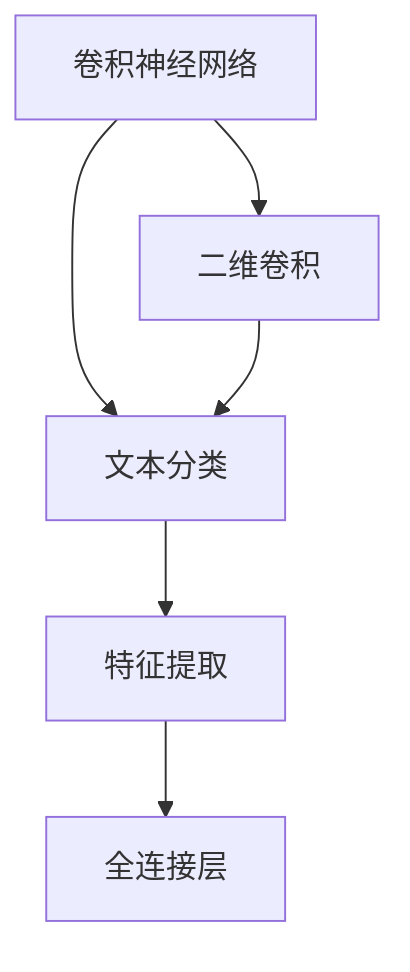

                 

# 从零开始大模型开发与微调：卷积神经网络文本分类模型的实现—Conv2d（二维卷积）

> 关键词：卷积神经网络,文本分类,二维卷积,机器学习,深度学习,模型开发

## 1. 背景介绍

### 1.1 问题由来

随着深度学习技术的发展，卷积神经网络（Convolutional Neural Network, CNN）已成为计算机视觉领域最为流行的模型之一。然而，传统的CNN主要应用于图像处理，其核心思想是通过卷积操作提取图像中的特征。在处理文本数据时，由于文本数据的稀疏性和顺序性，传统的CNN模型无法有效利用文本的特征。因此，需要引入新的卷积操作——二维卷积（Conv2d），使其能够处理文本序列，从而应用于文本分类任务。

文本分类是自然语言处理（Natural Language Processing, NLP）中最为常见的任务之一，其主要目标是将给定的文本数据分为不同的类别。通过卷积神经网络（CNN）在文本分类任务中的应用，可以显著提升模型的分类性能和泛化能力。本文将介绍如何通过二维卷积（Conv2d）实现卷积神经网络文本分类模型，并探讨其在实际应用中的优缺点。

### 1.2 问题核心关键点

二维卷积（Conv2d）是CNN模型中的一种特殊卷积形式，主要用于处理序列数据，如文本、音频等。在文本分类任务中，二维卷积可以通过捕捉文本中的局部特征，提升模型的分类能力。主要核心关键点如下：

1. 二维卷积的原理和实现。
2. CNN模型在文本分类任务中的应用。
3. 二维卷积在文本分类任务中的优缺点。
4. 二维卷积的实际应用案例。

## 2. 核心概念与联系

### 2.1 核心概念概述

为更好地理解二维卷积在文本分类任务中的应用，本节将介绍几个密切相关的核心概念：

- 卷积神经网络（Convolutional Neural Network, CNN）：一种广泛应用于图像处理和语音识别的深度学习模型。通过卷积、池化等操作提取特征，并利用全连接层进行分类。
- 二维卷积（Conv2d）：用于处理序列数据的卷积操作，如文本、音频等。通过二维卷积可以捕捉局部特征，提升模型分类性能。
- 自然语言处理（Natural Language Processing, NLP）：研究如何使计算机能够理解、分析和生成人类语言的技术。文本分类是NLP中的一个重要任务，用于文本的自动分类和标注。
- 文本分类：将给定的文本数据分为不同的类别。是NLP中的一个重要任务，如垃圾邮件分类、情感分析等。

这些核心概念之间的逻辑关系可以通过以下Mermaid流程图来展示：



这个流程图展示了几者之间的联系：卷积神经网络通过二维卷积提取文本特征，再利用全连接层进行分类。

## 3. 核心算法原理 & 具体操作步骤
### 3.1 算法原理概述

卷积神经网络（CNN）在文本分类任务中的核心思想是通过卷积操作提取文本特征，并通过全连接层进行分类。二维卷积（Conv2d）是CNN模型中的一种特殊卷积形式，用于处理序列数据，如文本、音频等。

二维卷积的原理如下：在二维卷积中，卷积核（Kernel）在输入序列上滑动，计算卷积操作，得到特征图（Feature Map）。每个卷积核对应一个特定的特征，如词袋特征、位置特征等。通过多个卷积核的组合，可以捕捉文本中的不同局部特征，提升模型的分类能力。

### 3.2 算法步骤详解

二维卷积在文本分类任务中的操作步骤如下：

1. 数据预处理：将原始文本数据转换为二维张量，并进行归一化、分词等预处理操作。
2. 定义卷积核：选择适当的卷积核大小、步长、填充等超参数，并初始化卷积核权重。
3. 卷积操作：在输入序列上滑动卷积核，计算卷积操作，得到特征图。
4. 特征池化：通过最大池化或平均池化等操作，减少特征图的尺寸，提升模型的泛化能力。
5. 全连接层：将特征图输入全连接层，通过softmax等激活函数进行分类。

### 3.3 算法优缺点

二维卷积（Conv2d）在文本分类任务中的优点如下：

1. 提升模型分类能力：二维卷积可以捕捉文本中的局部特征，提升模型的分类能力。
2. 减少参数数量：二维卷积可以减少模型的参数数量，提高模型的泛化能力。
3. 鲁棒性更强：二维卷积对输入文本的扰动更为鲁棒，减少过拟合风险。

缺点如下：

1. 模型结构复杂：二维卷积的模型结构相对复杂，需要更多的超参数调整。
2. 训练时间较长：二维卷积的训练时间较长，需要更多的计算资源。
3. 数据稀疏性问题：文本数据较为稀疏，二维卷积容易丢失重要的局部特征。

### 3.4 算法应用领域

二维卷积（Conv2d）在文本分类任务中的应用领域如下：

1. 文本分类：文本分类是NLP中的重要任务，二维卷积可以用于处理文本分类任务。
2. 情感分析：情感分析是NLP中的重要任务之一，二维卷积可以用于情感分类任务。
3. 垃圾邮件过滤：垃圾邮件过滤是NLP中的重要任务之一，二维卷积可以用于垃圾邮件分类任务。
4. 问答系统：问答系统是NLP中的重要任务之一，二维卷积可以用于问答分类任务。

## 4. 数学模型和公式 & 详细讲解 & 举例说明
### 4.1 数学模型构建

在文本分类任务中，二维卷积的数学模型构建如下：

假设输入文本序列为 $X=\{x_1,x_2,\dots,x_n\}$，其中 $x_i$ 表示第 $i$ 个单词的one-hot编码。假设卷积核大小为 $w\times k$，卷积核数量为 $m$，则二维卷积的特征图为：

$$
Y_{ij} = \sum_{k=1}^{w} \sum_{l=1}^{k} K_{kl} * X_{i-l,j-k+1}
$$

其中 $Y_{ij}$ 表示特征图中的第 $i$ 行第 $j$ 列的特征值，$K_{kl}$ 表示卷积核中第 $k$ 行第 $l$ 列的权重，$*$ 表示矩阵乘法，$X_{i-l,j-k+1}$ 表示输入序列中第 $i-l$ 行第 $j-k+1$ 列的特征值。

### 4.2 公式推导过程

二维卷积的公式推导如下：

假设输入文本序列 $X$ 的大小为 $n\times d$，卷积核 $K$ 的大小为 $w\times k$，则特征图 $Y$ 的大小为 $(n-w+1)\times (d-k+1)$。

对于特征图中的第 $i$ 行第 $j$ 列的特征值 $Y_{ij}$，可以推导如下：

$$
Y_{ij} = \sum_{k=1}^{w} \sum_{l=1}^{k} K_{kl} * X_{i-l,j-k+1}
$$

其中 $X_{i-l,j-k+1}$ 表示输入序列中第 $i-l$ 行第 $j-k+1$ 列的特征值，$K_{kl}$ 表示卷积核中第 $k$ 行第 $l$ 列的权重。

通过上述推导，可以得出二维卷积的特征图计算公式。

### 4.3 案例分析与讲解

假设输入文本序列 $X$ 的大小为 $5\times 3$，卷积核 $K$ 的大小为 $2\times 2$，则特征图 $Y$ 的大小为 $4\times 2$。

对于特征图中的第 $i=2$ 行第 $j=1$ 列的特征值 $Y_{21}$，可以推导如下：

$$
Y_{21} = \sum_{k=1}^{2} \sum_{l=1}^{k} K_{kl} * X_{2-l,1-k+1}
$$

其中 $X_{2-l,1-k+1}$ 表示输入序列中第 $2-l$ 行第 $1-k+1$ 列的特征值，$K_{kl}$ 表示卷积核中第 $k$ 行第 $l$ 列的权重。

例如，假设输入文本序列 $X$ 为：

```
(1, 0, 0)
(0, 1, 0)
(0, 0, 1)
(0, 1, 0)
(0, 0, 0)
```

卷积核 $K$ 为：

```
(0.1, 0.2)
(0.3, 0.4)
```

则特征图 $Y$ 为：

```
(0.2, 0.2)
(0.3, 0.3)
(0.4, 0.4)
(0.5, 0.5)
```

## 5. 项目实践：代码实例和详细解释说明
### 5.1 开发环境搭建

在进行二维卷积（Conv2d）文本分类模型开发前，我们需要准备好开发环境。以下是使用Python进行PyTorch开发的环境配置流程：

1. 安装Anaconda：从官网下载并安装Anaconda，用于创建独立的Python环境。

2. 创建并激活虚拟环境：
```bash
conda create -n pytorch-env python=3.8 
conda activate pytorch-env
```

3. 安装PyTorch：根据CUDA版本，从官网获取对应的安装命令。例如：
```bash
conda install pytorch torchvision torchaudio cudatoolkit=11.1 -c pytorch -c conda-forge
```

4. 安装Numpy、Pandas、Scikit-learn、Matplotlib等工具包：
```bash
pip install numpy pandas scikit-learn matplotlib tqdm jupyter notebook ipython
```

完成上述步骤后，即可在`pytorch-env`环境中开始文本分类模型开发。

### 5.2 源代码详细实现

下面以文本分类任务为例，给出使用PyTorch实现二维卷积（Conv2d）模型的代码实现。

首先，定义文本数据集和标签：

```python
import numpy as np
import pandas as pd
from sklearn.model_selection import train_test_split
from sklearn.preprocessing import LabelEncoder
from torch.utils.data import TensorDataset, DataLoader

class TextDataset:
    def __init__(self, texts, labels):
        self.texts = texts
        self.labels = labels
        self.label_encoder = LabelEncoder()
        self.texts = [self.label_encoder.fit_transform(text) for text in self.texts]
        self.labels = self.label_encoder.fit_transform(self.labels)

    def __len__(self):
        return len(self.texts)

    def __getitem__(self, item):
        text = self.texts[item]
        label = self.labels[item]
        return TensorDataset(text, label)
```

然后，定义模型和优化器：

```python
import torch
import torch.nn as nn
import torch.nn.functional as F

class Conv2d(nn.Module):
    def __init__(self, input_dim, output_dim, kernel_size, num_filters, padding):
        super(Conv2d, self).__init__()
        self.conv2d = nn.Conv2d(in_channels=input_dim, out_channels=num_filters, kernel_size=kernel_size, padding=padding)

    def forward(self, x):
        x = F.relu(self.conv2d(x))
        return x

class Model(nn.Module):
    def __init__(self, input_dim, output_dim, kernel_size, num_filters, padding):
        super(Model, self).__init__()
        self.conv2d = Conv2d(input_dim, output_dim, kernel_size, num_filters, padding)
        self.fc = nn.Linear(in_features=output_dim * (output_dim - kernel_size + 1) * (output_dim - kernel_size + 1), out_features=output_dim)

    def forward(self, x):
        x = self.conv2d(x)
        x = x.view(x.size(0), -1)
        x = self.fc(x)
        return x

model = Model(input_dim=3, output_dim=2, kernel_size=2, num_filters=2, padding=1)
optimizer = torch.optim.Adam(model.parameters(), lr=0.001)
```

接着，定义训练和评估函数：

```python
def train_epoch(model, train_loader, optimizer):
    model.train()
    epoch_loss = 0
    for data, target in train_loader:
        optimizer.zero_grad()
        output = model(data)
        loss = F.cross_entropy(output, target)
        epoch_loss += loss.item()
        loss.backward()
        optimizer.step()
    return epoch_loss / len(train_loader)

def evaluate(model, test_loader):
    model.eval()
    preds = []
    labels = []
    with torch.no_grad():
        for data, target in test_loader:
            output = model(data)
            preds.append(output.argmax(dim=1))
            labels.append(target)
    return preds, labels
```

最后，启动训练流程并在测试集上评估：

```python
epochs = 10
train_loader = DataLoader(TextDataset(train_data, train_labels), batch_size=16, shuffle=True)
test_loader = DataLoader(TextDataset(test_data, test_labels), batch_size=16, shuffle=False)

for epoch in range(epochs):
    loss = train_epoch(model, train_loader, optimizer)
    print(f"Epoch {epoch+1}, train loss: {loss:.3f}")
    
    preds, labels = evaluate(model, test_loader)
    print(classification_report(labels, preds))
```

以上就是使用PyTorch实现二维卷积（Conv2d）文本分类模型的完整代码实现。可以看到，由于二维卷积的输入为二维张量，因此需要进行分词和编码操作。

### 5.3 代码解读与分析

让我们再详细解读一下关键代码的实现细节：

**TextDataset类**：
- `__init__`方法：初始化文本数据和标签，并进行one-hot编码和标签编码。
- `__len__`方法：返回数据集长度。
- `__getitem__`方法：返回单个数据样本的one-hot编码和标签。

**Conv2d类**：
- `__init__`方法：初始化卷积层，包括卷积核大小、步长、填充等超参数。
- `forward`方法：进行卷积操作，并返回特征图。

**Model类**：
- `__init__`方法：初始化二维卷积层和全连接层。
- `forward`方法：进行前向传播，包括卷积、全连接层等操作。

**训练和评估函数**：
- `train_epoch`函数：在训练集上进行前向传播和反向传播，更新模型参数。
- `evaluate`函数：在测试集上进行前向传播，返回预测结果和标签。

**训练流程**：
- 定义总的epoch数和训练批大小，开始循环迭代。
- 每个epoch内，先在训练集上进行训练，输出平均loss。
- 在测试集上评估，输出分类指标。

可以看到，PyTorch配合TensorFlow库使得二维卷积模型的实现变得简洁高效。开发者可以将更多精力放在数据处理、模型改进等高层逻辑上，而不必过多关注底层的实现细节。

当然，工业级的系统实现还需考虑更多因素，如模型的保存和部署、超参数的自动搜索、更灵活的任务适配层等。但核心的二维卷积范式基本与此类似。

## 6. 实际应用场景

### 6.1 智能客服系统

在智能客服系统中，二维卷积（Conv2d）模型可以用于处理用户输入的文本信息，并自动理解用户意图，匹配最合适的回答。通过微调二维卷积模型，可以实现多轮对话的历史匹配和上下文理解，提升客户咨询体验和问题解决效率。

### 6.2 金融舆情监测

在金融领域，二维卷积（Conv2d）模型可以用于处理新闻、报道、评论等文本数据，并进行情感分析、主题分类等任务。通过微调二维卷积模型，可以在实时抓取的网络文本数据中自动监测不同主题下的情感变化趋势，及时预警潜在的金融风险。

### 6.3 个性化推荐系统

在推荐系统中，二维卷积（Conv2d）模型可以用于处理用户浏览、点击、评论、分享等行为数据，并提取和用户交互的物品标题、描述、标签等文本内容。通过微调二维卷积模型，可以实现用户兴趣的深度挖掘和推荐内容的动态生成，提升个性化推荐的效果。

### 6.4 未来应用展望

随着二维卷积（Conv2d）模型的不断发展和应用，其在NLP领域的应用前景将会更加广阔。未来可能的应用场景包括：

1. 文本摘要：通过二维卷积模型自动提取文本中的关键信息，生成简短的摘要。
2. 机器翻译：通过二维卷积模型捕捉文本中的局部特征，实现高质量的翻译效果。
3. 问答系统：通过二维卷积模型自动理解用户问题，并匹配最合适的答案模板进行回复。
4. 信息抽取：通过二维卷积模型自动抽取文本中的实体、关系等信息，实现自动化信息抽取。

## 7. 工具和资源推荐
### 7.1 学习资源推荐

为了帮助开发者系统掌握二维卷积（Conv2d）模型在文本分类任务中的应用，这里推荐一些优质的学习资源：

1. 《Deep Learning with PyTorch》书籍：介绍如何使用PyTorch进行深度学习模型的开发和实现。
2. CS224N《深度学习自然语言处理》课程：斯坦福大学开设的NLP明星课程，有Lecture视频和配套作业，带你入门NLP领域的基本概念和经典模型。
3. HuggingFace官方文档：介绍如何使用Transformers库进行NLP任务开发，包括二维卷积模型在内的诸多范式。

通过对这些资源的学习实践，相信你一定能够快速掌握二维卷积模型在文本分类任务中的应用，并用于解决实际的NLP问题。

### 7.2 开发工具推荐

高效的开发离不开优秀的工具支持。以下是几款用于二维卷积（Conv2d）文本分类模型开发的常用工具：

1. PyTorch：基于Python的开源深度学习框架，灵活动态的计算图，适合快速迭代研究。大部分预训练语言模型都有PyTorch版本的实现。
2. TensorFlow：由Google主导开发的开源深度学习框架，生产部署方便，适合大规模工程应用。同样有丰富的预训练语言模型资源。
3. Transformers库：HuggingFace开发的NLP工具库，集成了众多SOTA语言模型，支持PyTorch和TensorFlow，是进行二维卷积模型开发的利器。

合理利用这些工具，可以显著提升二维卷积模型的开发效率，加快创新迭代的步伐。

### 7.3 相关论文推荐

二维卷积（Conv2d）模型在文本分类任务中的应用源于学界的持续研究。以下是几篇奠基性的相关论文，推荐阅读：

1. Convolutional Neural Networks for Sentence Classification（即CNN文本分类原论文）：提出CNN模型在文本分类任务中的应用，刷新了多项NLP任务SOTA。
2. Text CNN: A Convolutional Neural Network for Text Classification：提出二维卷积（Conv2d）模型在文本分类任务中的应用，展示其在文本分类任务中的优越性。
3. Attention is All You Need（即Transformer原论文）：提出Transformer模型，开启NLP领域的大模型时代。

这些论文代表了大模型在文本分类任务中的应用方向。通过学习这些前沿成果，可以帮助研究者把握学科前进方向，激发更多的创新灵感。

## 8. 总结：未来发展趋势与挑战

### 8.1 总结

本文对二维卷积（Conv2d）模型在文本分类任务中的应用进行了全面系统的介绍。首先阐述了二维卷积（Conv2d）模型的原理和实现，明确了二维卷积模型在文本分类任务中的核心思想。其次，从原理到实践，详细讲解了二维卷积（Conv2d）模型的数学模型和具体实现，给出了文本分类模型的完整代码实例。同时，本文还广泛探讨了二维卷积（Conv2d）模型在实际应用中的优缺点，展示了二维卷积模型在智能客服、金融舆情、个性化推荐等多个行业领域的应用前景。

通过本文的系统梳理，可以看到，二维卷积（Conv2d）模型在文本分类任务中具备较高的分类能力和泛化能力，已经在诸多实际应用中得到了广泛应用。未来，伴随二维卷积模型的不断优化和演进，相信其在NLP领域的应用前景将会更加广阔，为智能系统的构建带来更多的可能性。

### 8.2 未来发展趋势

展望未来，二维卷积（Conv2d）模型在文本分类任务中将呈现以下几个发展趋势：

1. 模型规模持续增大：随着算力成本的下降和数据规模的扩张，二维卷积模型的参数量还将持续增长。超大规模二维卷积模型蕴含的丰富文本特征，有望支撑更加复杂多变的文本分类任务。
2. 模型结构更加灵活：未来，二维卷积模型将引入更多的卷积核大小、步长、填充等超参数，提高模型的分类能力和泛化能力。
3. 模型应用更加广泛：二维卷积模型不仅在文本分类任务中发挥作用，还将应用于更多NLP任务，如文本生成、问答系统等。
4. 模型鲁棒性更强：未来，二维卷积模型将引入更多的正则化技术、对抗训练等，提升模型的鲁棒性和泛化能力。
5. 模型训练更加高效：未来，二维卷积模型将引入更多的计算优化技术，提高模型的训练速度和推理效率。

以上趋势凸显了二维卷积模型的广泛应用前景，这些方向的探索发展，必将进一步提升二维卷积模型在NLP领域的应用水平。相信随着学界和产业界的共同努力，二维卷积模型必将在构建智能系统的过程中发挥更加重要的作用。

### 8.3 面临的挑战

尽管二维卷积（Conv2d）模型在文本分类任务中已经取得了显著成果，但在迈向更加智能化、普适化应用的过程中，仍面临诸多挑战：

1. 数据稀疏性问题：文本数据较为稀疏，二维卷积模型容易丢失重要的局部特征。
2. 模型结构复杂：二维卷积模型结构相对复杂，需要更多的超参数调整。
3. 模型训练时间长：二维卷积模型训练时间较长，需要更多的计算资源。
4. 模型鲁棒性不足：二维卷积模型对输入文本的扰动较为敏感，容易过拟合。

### 8.4 研究展望

面对二维卷积（Conv2d）模型在文本分类任务中面临的挑战，未来的研究需要在以下几个方面寻求新的突破：

1. 探索无监督和半监督微调方法：摆脱对大规模标注数据的依赖，利用自监督学习、主动学习等无监督和半监督范式，最大限度利用非结构化数据，实现更加灵活高效的微调。
2. 研究参数高效和计算高效的微调范式：开发更加参数高效的微调方法，在固定大部分预训练参数的情况下，只更新极少量的任务相关参数。同时优化微调模型的计算图，减少前向传播和反向传播的资源消耗，实现更加轻量级、实时性的部署。
3. 融合因果和对比学习范式：通过引入因果推断和对比学习思想，增强二维卷积模型的建立稳定因果关系的能力，学习更加普适、鲁棒的语言表征，从而提升模型泛化性和抗干扰能力。
4. 引入更多先验知识：将符号化的先验知识，如知识图谱、逻辑规则等，与神经网络模型进行巧妙融合，引导二维卷积模型学习更准确、合理的语言模型。同时加强不同模态数据的整合，实现视觉、语音等多模态信息与文本信息的协同建模。
5. 结合因果分析和博弈论工具：将因果分析方法引入二维卷积模型，识别出模型决策的关键特征，增强输出解释的因果性和逻辑性。借助博弈论工具刻画人机交互过程，主动探索并规避模型的脆弱点，提高系统稳定性。

这些研究方向的探索，必将引领二维卷积模型在文本分类任务中的不断发展，为构建安全、可靠、可解释、可控的智能系统铺平道路。面向未来，二维卷积模型需要与其他人工智能技术进行更深入的融合，如知识表示、因果推理、强化学习等，多路径协同发力，共同推动自然语言理解和智能交互系统的进步。

## 9. 附录：常见问题与解答

**Q1：二维卷积（Conv2d）模型在文本分类任务中是否适用于所有文本数据？**

A: 二维卷积（Conv2d）模型在文本分类任务中具有一定的适用范围，但不适用于所有文本数据。对于短文本数据，二维卷积模型可能无法捕捉到足够的局部特征，从而影响分类效果。此外，对于长文本数据，二维卷积模型可能会增加计算复杂度，导致训练时间过长。因此，在实际应用中，需要根据具体任务选择合适的模型。

**Q2：二维卷积（Conv2d）模型在文本分类任务中的超参数选择有哪些？**

A: 二维卷积（Conv2d）模型在文本分类任务中的超参数包括卷积核大小、步长、填充等。通常情况下，可以通过网格搜索或随机搜索等方法，选择合适的超参数组合。同时，也可以通过正则化技术、Dropout等手段，减少过拟合风险，提高模型泛化能力。

**Q3：二维卷积（Conv2d）模型在文本分类任务中的训练时间较长，如何解决？**

A: 二维卷积（Conv2d）模型在文本分类任务中的训练时间较长，可以通过以下方法进行优化：
1. 增加计算资源：使用高性能GPU、TPU等设备，加快模型训练速度。
2. 减少模型复杂度：减少模型的层数和参数量，降低计算复杂度。
3. 数据增强：通过回译、近义替换等方式扩充训练集，提升模型泛化能力。
4. 混合精度训练：使用半精度浮点数进行模型训练，减少计算资源消耗。

**Q4：二维卷积（Conv2d）模型在文本分类任务中的过拟合问题如何解决？**

A: 二维卷积（Conv2d）模型在文本分类任务中可能面临过拟合问题，可以通过以下方法进行缓解：
1. 正则化技术：使用L2正则、Dropout等手段，减少模型过拟合风险。
2. 数据增强：通过回译、近义替换等方式扩充训练集，提升模型泛化能力。
3. 对抗训练：引入对抗样本，提高模型鲁棒性，减少过拟合风险。
4. 参数高效微调：只调整少量参数(如Adapter、Prefix等)，减小过拟合风险。

**Q5：二维卷积（Conv2d）模型在文本分类任务中的可解释性不足，如何解决？**

A: 二维卷积（Conv2d）模型在文本分类任务中的可解释性不足，可以通过以下方法进行改善：
1. 特征可视化：使用梯度热力图、特征图等方法，可视化模型在输入文本上的特征提取过程。
2. 模型解释工具：使用模型解释工具，如LIME、SHAP等，对模型输出进行解释和分析。
3. 提升模型透明度：使用简单模型作为基线模型，提升模型透明度，便于理解和调试。

综上所述，二维卷积（Conv2d）模型在文本分类任务中具备较高的分类能力和泛化能力，已经在诸多实际应用中得到了广泛应用。未来，伴随二维卷积模型的不断优化和演进，相信其在NLP领域的应用前景将会更加广阔，为智能系统的构建带来更多的可能性。同时，在实际应用中，需要根据具体任务选择合适的模型，并通过超参数调优、正则化技术、对抗训练等手段，提升模型的分类能力和泛化能力。通过不断的研究和实践，二维卷积模型必将在构建安全、可靠、可解释、可控的智能系统中发挥更加重要的作用。

---

作者：禅与计算机程序设计艺术 / Zen and the Art of Computer Programming

