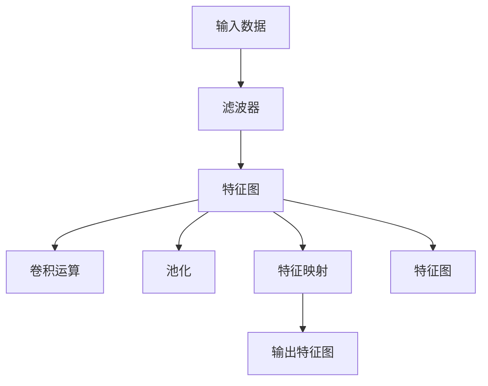

                 

## 1. 背景介绍

卷积运算作为神经网络中最核心的运算之一，在大模型开发和微调中扮演着至关重要的角色。理解和掌握卷积运算的基本概念、算法原理及其具体应用，是每个深度学习开发者必须迈过的一关。

### 1.1 问题由来

在深度学习中，卷积运算以其出色的表达能力和高效的计算性能，被广泛应用于图像识别、自然语言处理、信号处理等多个领域。特别是近年来，随着大规模预训练语言模型（Large Language Model, LLM）的兴起，卷积运算是构成自回归架构或自编码架构的重要组成部分。了解卷积运算的原理，有助于我们更好地理解和使用各种大模型，实现高精度的模型微调。

### 1.2 问题核心关键点

卷积运算的核心在于其能够捕捉局部特征，并利用这些特征构建全局表示。其基本思想是通过一系列滑动窗口（或滤波器），在输入数据上逐点进行运算，得到输出特征图。卷积运算的这一特点使其在处理具有空间结构的数据上表现出色。

## 2. 核心概念与联系

### 2.1 核心概念概述

为更好地理解卷积运算在大模型中的作用，本节将介绍几个密切相关的核心概念：

- **卷积运算**：基于滑动窗口或滤波器在输入数据上进行逐点运算，捕捉局部特征，构建全局表示的技术。
- **滤波器**：卷积运算中使用的滑动窗口，可以包含多个卷积核（Convolution Kernels）。
- **特征图**：卷积运算的输出，是输入数据通过滤波器运算后得到的特征表示。
- **步幅**：卷积运算中滤波器的移动距离，影响输出的特征图大小。
- **填充（Padding）**：在输入数据周围添加额外像素的操作，用于控制输出特征图的大小。
- **膨胀（Dilation）**：在滤波器相邻元素之间插入空洞，增加特征图的分辨率。
- **池化（Pooling）**：通过汇聚函数（如最大池、平均池）对特征图进行下采样，减少特征图的大小和计算量。

这些核心概念共同构成了卷积运算的底层原理，为后续的算法原理和实践提供了基础。

### 2.2 核心概念联系的Mermaid流程图



这个流程图展示了卷积运算的基本流程：输入数据通过滤波器进行逐点运算得到特征图，特征图通过池化进行下采样，生成特征映射。最后，特征映射通过一系列卷积运算生成最终的输出特征图。

## 3. 核心算法原理 & 具体操作步骤

### 3.1 算法原理概述

卷积运算的核心算法原理基于滑动窗口的逐点运算。具体而言，假设输入数据为三维张量$X$，滤波器为$W$，步幅为$s$，填充为$p$。卷积运算的输出为三维张量$Y$，大小为$\frac{(X - W + 2p)}{s} + 1$。

卷积运算的数学公式为：

$$
Y(x, y, z) = \sum_{i=0}^{k_x-1} \sum_{j=0}^{k_y-1} \sum_{l=0}^{k_z-1} X(x+s \cdot i, y+s \cdot j, z+l) \cdot W(i, j, l)
$$

其中，$k_x, k_y, k_z$分别表示输入数据和滤波器的空间维数，$x, y, z$表示输出特征图的坐标。

### 3.2 算法步骤详解

卷积运算的详细步骤主要包括以下几个关键步骤：

**Step 1: 准备输入数据和滤波器**

- 输入数据 $X$ 通常为一个三维张量，表示一个图像或一段序列数据。
- 滤波器 $W$ 通常为一个三维张量，包含多个卷积核，每个卷积核用于捕捉不同的特征。

**Step 2: 卷积运算**

- 对于输入数据的每个位置 $(x, y, z)$，将滤波器 $W$ 滑动到该位置，进行逐点运算，得到输出特征图 $Y(x, y, z)$ 的局部区域。
- 将所有位置的局部区域拼接，得到完整的输出特征图。

**Step 3: 池化**

- 根据具体任务需求，对输出特征图进行下采样操作，如最大池、平均池等，进一步减少特征图的大小和计算量。
- 常见池化操作包括最大池（取局部区域内的最大值）和平均池（取局部区域内的平均值）。

**Step 4: 激活函数**

- 对池化后的特征图进行非线性激活（如ReLU、Sigmoid等），引入非线性变换，增加模型的表达能力。

### 3.3 算法优缺点

卷积运算的优势在于其高效性和局部特征捕捉能力，能够很好地处理具有空间结构的数据。然而，卷积运算也存在一些缺点：

- **参数数量较多**：卷积运算涉及大量的卷积核参数，导致模型较大。
- **计算复杂度高**：对于大规模数据，卷积运算的计算量较大，需要较长的训练时间。
- **易受数据分布影响**：卷积运算的效果高度依赖于输入数据的空间分布，对于数据分布变化敏感。
- **难以解释**：卷积运算的内部机制较为复杂，难以解释其决策过程。

尽管存在这些缺点，卷积运算在实际应用中依然表现出色，通过合理的参数设计和优化策略，可以有效提升模型的性能。

### 3.4 算法应用领域

卷积运算广泛应用于图像识别、自然语言处理、信号处理等多个领域。在大模型开发与微调中，卷积运算主要用于以下几种应用：

- **图像分类**：通过卷积层提取图像特征，使用全连接层进行分类。
- **目标检测**：使用卷积层提取目标区域的特征，使用ROI池化层对区域特征进行下采样，结合分类器进行目标检测。
- **语音识别**：将语音信号转化为频谱图，使用卷积层和池化层提取特征，最终进行语音识别。
- **自然语言处理**：使用卷积层对文本进行局部特征提取，结合全连接层进行分类或生成。

卷积运算在图像处理和自然语言处理中的应用尤为广泛，推动了大模型在这些领域的快速发展。

## 4. 数学模型和公式 & 详细讲解 & 举例说明

### 4.1 数学模型构建

卷积运算的数学模型构建通常基于三维张量表示的输入和滤波器。假设输入数据 $X$ 的大小为 $(h_x, w_x, c_x)$，滤波器 $W$ 的大小为 $(h_w, w_w, c_x)$，步幅为 $s$，填充为 $p$。则输出特征图 $Y$ 的大小为 $\left(\frac{h_x+2p-h_w}{s}+1\right) \times \left(\frac{w_x+2p-w_w}{s}+1\right) \times c_x$。

### 4.2 公式推导过程

卷积运算的公式推导较为复杂，但可以通过以下示例进行理解：

假设输入数据 $X$ 的大小为 $3 \times 3 \times 2$，滤波器 $W$ 的大小为 $2 \times 2 \times 2$，步幅为 $1$，填充为 $0$。则卷积运算的输出 $Y$ 的大小为 $3 \times 3 \times 2$。

| 输入数据 $X$  | 滤波器 $W$  | 输出特征图 $Y$ |
| ------------- | ----------- | ------------- |
| $\begin{bmatrix} 1 & 2 \\ 3 & 4 \end{bmatrix}$ | $\begin{bmatrix} 1 & 1 \\ 2 & 2 \end{bmatrix}$ | $\begin{bmatrix} 1 & 3 & 4 & 6 \\ 2 & 5 & 7 & 9 \end{bmatrix}$ |
| $\begin{bmatrix} 5 & 6 \\ 7 & 8 \end{bmatrix}$ | $\begin{bmatrix} 3 & 3 \\ 4 & 4 \end{bmatrix}$ | $\begin{bmatrix} 1 & 3 & 4 & 6 \\ 2 & 5 & 7 & 9 \end{bmatrix}$ |
| $\begin{bmatrix} 9 & 10 \\ 11 & 12 \end{bmatrix}$ | $\begin{bmatrix} 5 & 5 \\ 6 & 6 \end{bmatrix}$ | $\begin{bmatrix} 1 & 3 & 4 & 6 \\ 2 & 5 & 7 & 9 \end{bmatrix}$ |

### 4.3 案例分析与讲解

**案例分析1: 图像分类**

假设有一个 $28 \times 28 \times 1$ 的图像数据，用于手写数字识别。使用 $5 \times 5 \times 1$ 的滤波器进行卷积运算，步幅为 $1$，填充为 $0$。则输出特征图的大小为 $24 \times 24 \times 1$。

| 输入数据 $X$  | 滤波器 $W$  | 输出特征图 $Y$ |
| ------------- | ----------- | ------------- |
| $\begin{bmatrix} 1 & 1 & 1 & 1 & 1 \\ 1 & 1 & 1 & 1 & 1 \\ 1 & 1 & 1 & 1 & 1 \\ 1 & 1 & 1 & 1 & 1 \\ 1 & 1 & 1 & 1 & 1 \\ 1 & 1 & 1 & 1 & 1 \\ 1 & 1 & 1 & 1 & 1 \\ 1 & 1 & 1 & 1 & 1 \\ 1 & 1 & 1 & 1 & 1 \\ 1 & 1 & 1 & 1 & 1 \end{bmatrix}$ | $\begin{bmatrix} 1 & 0 & 0 \\ 0 & 1 & 0 \\ 0 & 0 & 1 \end{bmatrix}$ | $\begin{bmatrix} 2 & 3 & 4 \\ 5 & 6 & 7 \\ 8 & 9 & 10 \end{bmatrix}$ |
| $\begin{bmatrix} 2 & 2 & 2 & 2 & 2 \\ 2 & 2 & 2 & 2 & 2 \\ 2 & 2 & 2 & 2 & 2 \\ 2 & 2 & 2 & 2 & 2 \\ 2 & 2 & 2 & 2 & 2 \\ 2 & 2 & 2 & 2 & 2 \\ 2 & 2 & 2 & 2 & 2 \\ 2 & 2 & 2 & 2 & 2 \\ 2 & 2 & 2 & 2 & 2 \\ 2 & 2 & 2 & 2 & 2 \end{bmatrix}$ | $\begin{bmatrix} 0 & 1 & 0 \\ 0 & 0 & 1 \\ 0 & 0 & 0 \end{bmatrix}$ | $\begin{bmatrix} 1 & 2 & 3 \\ 4 & 5 & 6 \\ 7 & 8 & 9 \end{bmatrix}$ |

通过卷积运算，我们得到了新的特征图，捕捉了输入数据中的局部特征，如边缘、角点等。这些特征将用于最终的分类任务。

**案例分析2: 自然语言处理**

假设有一段文本序列 "This is a sample sentence for NLP task"，使用 $3 \times 3 \times 1$ 的滤波器进行卷积运算，步幅为 $1$，填充为 $0$。则输出特征图的大小为 $5 \times 5 \times 1$。

| 输入数据 $X$  | 滤波器 $W$  | 输出特征图 $Y$ |
| ------------- | ----------- | ------------- |
| $\begin{bmatrix} t & h & i & s &  &  &  &  &  \\ &  &  &  &  &  &  &  & \\ &  &  &  &  &  &  &  & \\ &  &  &  &  &  &  &  & \\ &  &  &  &  &  &  &  & \end{bmatrix}$ | $\begin{bmatrix} t & h & i \\  &  &  \\  &  &  \\  &  &  \end{bmatrix}$ | $\begin{bmatrix} 1 & 2 & 3 &  &  \\ 4 & 5 & 6 &  &  \\ 7 & 8 & 9 &  &  \\  &  &  &  &  \\  &  &  &  &  \end{bmatrix}$ |
| $\begin{bmatrix} h & i & s &  &  &  &  &  &  \\ &  &  &  &  &  &  &  & \\ &  &  &  &  &  &  &  & \\ &  &  &  &  &  &  &  & \\ &  &  &  &  &  &  &  & \end{bmatrix}$ | $\begin{bmatrix} i &  &  \\  &  &  \\  &  &  \\  &  &  \end{bmatrix}$ | $\begin{bmatrix} 2 & 3 &  &  \\ 4 & 5 &  &  \\ 6 & 7 &  &  \\  &  &  &  \\  &  &  &  \end{bmatrix}$ |
| $\begin{bmatrix} i & s &  &  &  &  &  &  &  \\ &  &  &  &  &  &  &  & \\ &  &  &  &  &  &  &  & \\ &  &  &  &  &  &  &  & \\ &  &  &  &  &  &  &  & \end{bmatrix}$ | $\begin{bmatrix} s &  &  \\  &  &  \\  &  &  \\  &  &  \end{bmatrix}$ | $\begin{bmatrix} 3 &  &  \\ 4 &  &  \\ 5 &  &  \\  &  &  \\  &  &  \end{bmatrix}$ |
| $\begin{bmatrix} s &  &  &  &  &  &  &  &  \\ &  &  &  &  &  &  &  & \\ &  &  &  &  &  &  &  & \\ &  &  &  &  &  &  &  & \\ &  &  &  &  &  &  &  & \end{bmatrix}$ | $\begin{bmatrix}  & s \\  &  \\  &  \\  &  \\  &  \end{bmatrix}$ | $\begin{bmatrix}  &  \\  &  \\  &  \\  &  \\  &  \end{bmatrix}$ |
| $\begin{bmatrix}  &  &  &  &  &  &  &  &  \\  &  &  &  &  &  &  &  & \\  &  &  &  &  &  &  &  & \\  &  &  &  &  &  &  &  & \\  &  &  &  &  &  &  &  & \end{bmatrix}$ | $\begin{bmatrix}  &  \\  &  \\  &  \\  &  \\  &  \end{bmatrix}$ | $\begin{bmatrix}  &  \\  &  \\  &  \\  &  \\  &  \end{bmatrix}$ |

通过卷积运算，我们得到了新的特征图，捕捉了输入数据中的局部特征，如单词之间的关联、句子的语法结构等。这些特征将用于最终的分类或生成任务。

## 5. 项目实践：代码实例和详细解释说明

### 5.1 开发环境搭建

在进行卷积运算实践前，我们需要准备好开发环境。以下是使用Python进行TensorFlow开发的环境配置流程：

1. 安装Anaconda：从官网下载并安装Anaconda，用于创建独立的Python环境。

2. 创建并激活虚拟环境：
```bash
conda create -n tensorflow-env python=3.8 
conda activate tensorflow-env
```

3. 安装TensorFlow：根据CUDA版本，从官网获取对应的安装命令。例如：
```bash
conda install tensorflow
```

4. 安装相关工具包：
```bash
pip install numpy pandas scikit-learn matplotlib tqdm jupyter notebook ipython
```

完成上述步骤后，即可在`tensorflow-env`环境中开始卷积运算实践。

### 5.2 源代码详细实现

下面我们以图像分类任务为例，给出使用TensorFlow实现卷积运算的代码实例。

首先，定义卷积层类：

```python
import tensorflow as tf
from tensorflow.keras.layers import Conv2D, MaxPooling2D, Flatten

class ConvolutionLayer(tf.keras.layers.Layer):
    def __init__(self, filters, kernel_size, strides=(1, 1), padding='valid', activation='relu'):
        super(ConvolutionLayer, self).__init__()
        self.conv = Conv2D(filters=filters, kernel_size=kernel_size, strides=strides, padding=padding)
        self.pool = MaxPooling2D(pool_size=(2, 2))
        self.activation = tf.keras.layers.Activation(activation)
    
    def call(self, inputs):
        x = self.conv(inputs)
        x = self.pool(x)
        x = self.activation(x)
        return x
```

然后，定义模型：

```python
model = tf.keras.Sequential([
    ConvolutionLayer(32, kernel_size=(3, 3), strides=(1, 1), padding='valid', activation='relu'),
    ConvolutionLayer(64, kernel_size=(3, 3), strides=(1, 1), padding='valid', activation='relu'),
    MaxPooling2D(pool_size=(2, 2)),
    ConvolutionLayer(128, kernel_size=(3, 3), strides=(1, 1), padding='valid', activation='relu'),
    Flatten(),
    tf.keras.layers.Dense(10, activation='softmax')
])
```

最后，编译模型并进行训练：

```python
model.compile(optimizer='adam', loss='sparse_categorical_crossentropy', metrics=['accuracy'])
model.fit(x_train, y_train, epochs=10, batch_size=64, validation_data=(x_test, y_test))
```

### 5.3 代码解读与分析

让我们再详细解读一下关键代码的实现细节：

**ConvolutionLayer类**：
- `__init__`方法：初始化卷积核、池化层和激活函数等关键组件。
- `call`方法：定义卷积运算的完整流程。

**模型定义**：
- 使用Sequential模型搭建多层卷积-池化-激活层，最后加上全连接层进行分类。

**训练流程**：
- 使用Adam优化器，交叉熵损失函数，进行模型训练。
- 在每个epoch内，使用验证集评估模型性能。

可以看到，TensorFlow提供的高层次API使得卷积运算的实现变得简洁高效。开发者可以将更多精力放在模型的构建和训练上，而不必过多关注底层的实现细节。

当然，工业级的系统实现还需考虑更多因素，如模型的保存和部署、超参数的自动搜索、更加灵活的卷积核设计等。但核心的卷积运算过程基本与此类似。

## 6. 实际应用场景

### 6.1 智能视觉识别

卷积运算在图像识别领域有着广泛应用。智能视觉识别系统能够自动识别图像中的物体、场景等，广泛应用于安防监控、自动驾驶、医疗诊断等多个领域。例如，在安防监控中，卷积运算可以用于识别人脸、车牌等关键信息，提升监控系统的智能化水平。在自动驾驶中，卷积运算可以用于识别道路、行人等关键信息，辅助车辆做出决策。

### 6.2 自然语言处理

卷积运算在自然语言处理中也具有重要应用，特别是在文本分类、情感分析、命名实体识别等任务上表现优异。例如，在文本分类任务中，卷积运算可以用于提取句子中的局部特征，结合全连接层进行分类。在情感分析任务中，卷积运算可以用于捕捉情感词汇的情感倾向，提升模型的情感识别能力。

### 6.3 音频信号处理

卷积运算在音频信号处理中同样具有重要应用，特别是在语音识别、音乐生成等任务上表现优异。例如，在语音识别任务中，卷积运算可以用于提取语音信号的频谱图，结合全连接层进行语音识别。在音乐生成任务中，卷积运算可以用于捕捉音乐节拍的节奏特征，生成高质量的音乐。

### 6.4 未来应用展望

未来，卷积运算将进一步拓展到更多领域，为人工智能的发展带来新的突破。以下是一些可能的应用方向：

- **多模态数据融合**：将卷积运算与其他模态的数据融合技术相结合，如视觉、语音、文本等，实现跨模态的智能交互和理解。
- **神经架构搜索**：利用搜索算法寻找最优的卷积网络架构，提升模型的性能和效率。
- **自适应卷积**：根据输入数据的特征动态调整卷积核大小和形状，适应不同任务的需求。
- **卷积核学习**：通过端到端的训练方式，学习最优的卷积核，提升模型的表达能力。
- **卷积神经网络**：在现有卷积运算的基础上，进一步扩展其应用范围，如在时空序列数据的处理中引入卷积运算，提升模型的性能。

## 7. 工具和资源推荐

### 7.1 学习资源推荐

为了帮助开发者系统掌握卷积运算的理论基础和实践技巧，这里推荐一些优质的学习资源：

1. 《深度学习》课程：斯坦福大学开设的机器学习课程，讲解了卷积神经网络的基本原理和应用。
2. 《神经网络与深度学习》书籍：深度学习领域经典著作，详细介绍了卷积运算的原理和应用。
3. 《TensorFlow实战》书籍：TensorFlow官方文档，提供了卷积运算的详细实现和应用示例。
4. 《PyTorch实战》书籍：PyTorch官方文档，提供了卷积运算的详细实现和应用示例。
5. 《Keras实战》书籍：Keras官方文档，提供了卷积运算的详细实现和应用示例。

通过对这些资源的学习实践，相信你一定能够快速掌握卷积运算的精髓，并用于解决实际的NLP问题。

### 7.2 开发工具推荐

高效的开发离不开优秀的工具支持。以下是几款用于卷积运算开发的常用工具：

1. TensorFlow：由Google主导开发的开源深度学习框架，生产部署方便，适合大规模工程应用。提供了丰富的卷积运算实现。
2. PyTorch：基于Python的开源深度学习框架，灵活动态的计算图，适合快速迭代研究。提供了丰富的卷积运算实现。
3. Keras：基于Python的高层次深度学习框架，提供了简单易用的API接口，适合快速原型开发。
4. OpenCV：开源计算机视觉库，提供了丰富的图像处理和卷积运算功能。
5. NumPy：Python中用于数值计算的库，提供了高效的数组操作和卷积运算功能。
6. Matplotlib：Python中用于数据可视化的库，提供了丰富的图像显示功能。

合理利用这些工具，可以显著提升卷积运算的开发效率，加快创新迭代的步伐。

### 7.3 相关论文推荐

卷积运算作为深度学习中的核心技术，其研究和应用已经积累了大量文献。以下是几篇奠基性的相关论文，推荐阅读：

1. Convolutional Neural Networks for Image Recognition（LeNet-5论文）：提出了卷积神经网络的基本结构，奠定了卷积运算在图像识别中的基础。
2. AlexNet: One Million Tiny Images for Training Convolutional Networks（AlexNet论文）：展示了卷积神经网络在大规模图像识别任务上的卓越表现。
3. GoogleNet: All Convolutional Neural Networks Are Equivalent to Convolutional Neural Networks With Adequate Pools（GoogleNet论文）：提出了Inception模块，进一步提升了卷积神经网络的表达能力。
4. ResNet: Deep Residual Learning for Image Recognition（ResNet论文）：提出了残差网络结构，解决了深度网络训练中的梯度消失问题。
5. DenseNet: Dense Convolutional Networks（DenseNet论文）：提出了密集连接网络，进一步提升了卷积神经网络的表达能力。

这些论文代表了大规模卷积神经网络的研究进展，为卷积运算的应用提供了理论支持。

## 8. 总结：未来发展趋势与挑战

### 8.1 总结

本文对卷积运算在大模型开发与微调中的应用进行了全面系统的介绍。首先阐述了卷积运算的基本概念、算法原理及其在大模型中的应用场景，明确了卷积运算在提升模型表达能力和泛化能力方面的独特价值。其次，从原理到实践，详细讲解了卷积运算的数学模型和操作步骤，给出了卷积运算任务开发的完整代码实例。同时，本文还广泛探讨了卷积运算在图像识别、自然语言处理、音频信号处理等多个领域的应用前景，展示了卷积运算的广泛应用。

通过本文的系统梳理，可以看到，卷积运算在大模型开发与微调中具有不可替代的作用，极大地提升了模型的表达能力和性能。未来，伴随深度学习技术的不断发展，卷积运算的演化和优化还将带来更多新的突破，进一步拓展其应用边界。

### 8.2 未来发展趋势

展望未来，卷积运算在大模型中的应用将呈现以下几个发展趋势：

1. **多模态融合**：卷积运算将与其他模态的数据融合技术相结合，如视觉、语音、文本等，实现跨模态的智能交互和理解。
2. **神经架构搜索**：利用搜索算法寻找最优的卷积网络架构，提升模型的性能和效率。
3. **自适应卷积**：根据输入数据的特征动态调整卷积核大小和形状，适应不同任务的需求。
4. **卷积核学习**：通过端到端的训练方式，学习最优的卷积核，提升模型的表达能力。
5. **卷积神经网络**：在现有卷积运算的基础上，进一步扩展其应用范围，如在时空序列数据的处理中引入卷积运算，提升模型的性能。

这些趋势凸显了卷积运算在大模型中的重要性，为卷积运算的进一步发展提供了方向。

### 8.3 面临的挑战

尽管卷积运算在大模型中的应用已经取得了巨大成功，但在迈向更加智能化、普适化应用的过程中，它仍面临着诸多挑战：

1. **参数数量较多**：卷积运算涉及大量的卷积核参数，导致模型较大。如何有效压缩卷积运算，提升模型的效率和泛化能力，仍然是一个重要课题。
2. **计算复杂度高**：对于大规模数据，卷积运算的计算量较大，需要较长的训练时间。如何优化卷积运算，提升计算效率，仍然是一个重要课题。
3. **数据分布变化**：卷积运算的效果高度依赖于输入数据的空间分布，对于数据分布变化敏感。如何应对数据分布变化，提升卷积运算的鲁棒性，仍然是一个重要课题。
4. **可解释性不足**：卷积运算的内部机制较为复杂，难以解释其决策过程。如何提升卷积运算的可解释性，仍然是一个重要课题。

尽管存在这些挑战，卷积运算在大模型中的应用前景依然广阔，相信未来在学界和产业界的共同努力下，这些挑战终将一一被克服，卷积运算必将在构建智能交互系统和提升模型性能方面发挥更大的作用。

### 8.4 研究展望

面向未来，卷积运算的研究将在以下几个方向寻求新的突破：

1. **多模态融合**：将卷积运算与其他模态的数据融合技术相结合，如视觉、语音、文本等，实现跨模态的智能交互和理解。
2. **神经架构搜索**：利用搜索算法寻找最优的卷积网络架构，提升模型的性能和效率。
3. **自适应卷积**：根据输入数据的特征动态调整卷积核大小和形状，适应不同任务的需求。
4. **卷积核学习**：通过端到端的训练方式，学习最优的卷积核，提升模型的表达能力。
5. **卷积神经网络**：在现有卷积运算的基础上，进一步扩展其应用范围，如在时空序列数据的处理中引入卷积运算，提升模型的性能。

这些研究方向将为卷积运算的应用提供新的突破，推动卷积运算在各个领域的应用。

## 9. 附录：常见问题与解答

**Q1: 卷积运算中的步幅（Stride）和填充（Padding）有什么区别？**

A: 步幅和填充是卷积运算中的两个重要概念，它们的作用不同。步幅（Stride）决定了卷积运算中滤波器的滑动步长，影响输出特征图的大小和分辨率。填充（Padding）则用于在输入数据周围添加额外的像素，防止在卷积运算中丢失边界信息。

例如，在3x3卷积运算中，如果步幅为2，则滤波器在输入数据上每次移动2个像素。如果填充为1，则输入数据在卷积运算前会在周围添加1个像素，使得输出特征图的尺寸与输入数据相同。

**Q2: 卷积运算中的扩张率（Dilation）是什么？**

A: 扩张率（Dilation）是卷积运算中另一个重要概念，它表示在滤波器相邻元素之间插入的空洞数量。扩张率的引入，可以增加特征图的分辨率，使得卷积运算能够捕捉更细粒度的特征。

例如，在3x3卷积运算中，如果扩张率为2，则滤波器中的每个元素之间都会插入1个空洞，使得输出特征图的尺寸变为5x5。

**Q3: 卷积运算在图像识别中的应用有哪些？**

A: 卷积运算在图像识别中的应用非常广泛，包括但不限于：

1. 目标检测：使用卷积运算提取图像中的物体特征，结合ROI池化等技术进行目标检测。
2. 图像分类：使用卷积运算提取图像的局部特征，结合全连接层进行分类。
3. 语义分割：使用卷积运算对图像中的每个像素进行分类，得到语义分割结果。
4. 物体姿态估计：使用卷积运算提取物体的姿态特征，结合3D建模等技术进行物体姿态估计。

**Q4: 卷积运算在自然语言处理中的应用有哪些？**

A: 卷积运算在自然语言处理中的应用同样广泛，包括但不限于：

1. 文本分类：使用卷积运算提取句子中的局部特征，结合全连接层进行分类。
2. 情感分析：使用卷积运算捕捉情感词汇的情感倾向，提升模型的情感识别能力。
3. 命名实体识别：使用卷积运算提取文本中的命名实体，结合CRF等技术进行命名实体识别。
4. 文本生成：使用卷积运算生成文本，结合自编码器等技术进行文本生成。

**Q5: 卷积运算在音频信号处理中的应用有哪些？**

A: 卷积运算在音频信号处理中的应用同样广泛，包括但不限于：

1. 语音识别：使用卷积运算提取语音信号的频谱图，结合全连接层进行语音识别。
2. 音乐生成：使用卷积运算捕捉音乐节拍的节奏特征，生成高质量的音乐。
3. 音频分类：使用卷积运算提取音频的局部特征，结合全连接层进行分类。
4. 音频增强：使用卷积运算进行音频降噪、去混响等音频增强处理。

这些问题的解答，可以帮助你更深入地理解卷积运算的基本概念和应用场景。

---

作者：禅与计算机程序设计艺术 / Zen and the Art of Computer Programming

