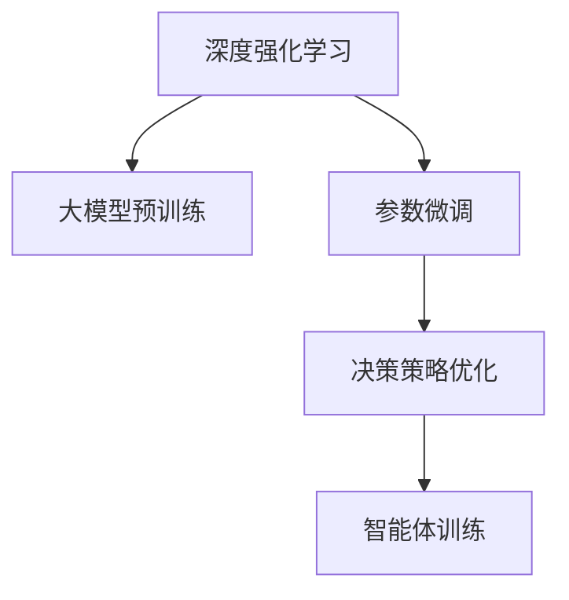

                 

# 从零开始大模型开发与微调：基于PyTorch 2.0的强化学习实战

## 1. 背景介绍

### 1.1 问题由来

近年来，人工智能技术迅猛发展，深度学习和大模型在各个领域展现出卓越的性能。其中，强化学习(RL)作为一种能够使智能体在复杂环境中自我优化、学习的技术，已经在自动驾驶、游戏AI、机器人控制等领域取得了显著成果。

然而，RL 的实际应用仍面临诸多挑战：

- **状态空间大**：大多数RL任务的状态空间极其庞大，难以使用传统的数值方法进行优化。
- **高维度决策空间**：连续动作空间的RL问题难以求解，传统方法难以有效应对。
- **复杂奖励函数设计**：优化目标难以确定，奖励函数设计复杂且难以优化。
- **样本效率低下**：RL任务通常需要大量样本进行学习，尤其是复杂任务。

为了应对这些挑战，深度强化学习(DRL)成为研究热点，其结合了深度神经网络与强化学习，可以处理高维输入和输出，更高效地从数据中学习，极大提升了RL的实际应用能力。

### 1.2 问题核心关键点

大模型在DRL中的作用主要体现在两方面：

- **状态表示学习**：通过预训练或微调大模型，学习任务特定或通用状态表示，作为智能体的输入。
- **决策策略优化**：在预训练状态表示的基础上，通过微调大模型获得最优决策策略，直接或间接影响智能体的动作输出。

本文聚焦于基于PyTorch 2.0的DRL实践，涵盖大模型的预训练、微调以及实际应用场景，旨在帮助读者系统掌握大模型在DRL中的开发与优化。

## 2. 核心概念与联系

### 2.1 核心概念概述

为更好地理解基于PyTorch 2.0的DRL，本节将介绍几个关键概念：

- **深度强化学习(DRL)**：结合深度神经网络与强化学习的技术，能够处理高维输入和输出，更高效地从数据中学习。
- **大模型预训练**：通过大规模无监督学习任务训练模型，获得丰富语义表示。
- **参数微调**：在大模型基础上，通过有监督学习任务优化模型，提升其在特定任务上的表现。
- **决策策略优化**：学习或微调大模型，以获得最优决策策略，作为智能体的输出。

这些概念之间的逻辑关系可以通过以下Mermaid流程图来展示：



这个流程图展示了大模型在DRL中的核心概念及其之间的关系：

1. 大模型通过预训练获得基础能力。
2. 参数微调在大模型基础上优化，以适应特定任务。
3. 决策策略优化直接或间接影响智能体的输出。
4. 智能体训练在上述基础上进行，提升任务性能。

## 3. 核心算法原理 & 具体操作步骤
### 3.1 算法原理概述

DRL结合了深度神经网络和强化学习，其核心算法包括Q-learning、SARSA、Deep Q Network(DQN)等。这些算法利用深度神经网络逼近Q值函数或策略函数，通过梯度下降方法优化模型参数。

具体地，以DQN算法为例，其核心流程如下：

1. 利用预训练的大模型或神经网络作为状态表示器，将当前状态转换为特征向量。
2. 通过前向传播计算每个动作的Q值估计。
3. 选择Q值最高的动作进行执行，并观察环境反馈。
4. 使用Greedy策略或Epsilon-greedy策略探索动作空间。
5. 使用当前状态和反馈，通过最小化目标Q值函数更新Q网络参数。

### 3.2 算法步骤详解

基于PyTorch 2.0的DRL主要包括以下几个关键步骤：

**Step 1: 准备环境与模型**

- 安装PyTorch 2.0：从官网下载并安装最新版本的PyTorch，并配置环境。
- 准备任务环境：如Unity环境、Simulator环境等，确保环境可以顺利运行。
- 选择或训练大模型：使用已有的预训练模型如BERT、GPT等，或自定义模型进行微调。

**Step 2: 定义状态表示器**

- 定义模型输入：如位置、速度、目标等。
- 利用大模型对输入进行编码，得到状态向量。
- 使用Transformer编码器或卷积神经网络(CNN)等对状态向量进行特征提取。

**Step 3: 设计Q网络**

- 定义Q网络：如前馈神经网络(Feedforward Neural Network)、卷积神经网络(CNN)等。
- 选择优化器：如Adam、RMSprop等。
- 设置学习率：如2e-4。
- 定义损失函数：如均方误差损失(MSE)。

**Step 4: 定义智能体策略**

- 定义策略函数：如Epsilon-greedy策略，设置探索和利用的平衡参数Epsilon。
- 定义决策函数：如Softmax策略，根据Q值选择动作。

**Step 5: 训练智能体**

- 定义训练过程：如回合训练、集合并训练等。
- 使用DQN算法进行训练，不断更新Q网络参数。
- 记录训练结果：如累计回报、成功率等指标。

### 3.3 算法优缺点

基于PyTorch 2.0的DRL具有以下优点：

- **高效处理高维数据**：利用深度神经网络处理高维输入和输出，提高学习效率。
- **参数共享**：在大模型基础上微调，共享底层参数，提升泛化能力。
- **模块化设计**：易于扩展和优化，方便实验和调试。
- **开源社区支持**：PyTorch拥有活跃的开源社区，提供丰富的教程和工具。

同时，DRL也存在一些局限性：

- **样本效率较低**：大模型需要大量数据进行预训练，微调过程也需大量样本进行训练。
- **模型复杂度高**：深度神经网络模型的训练和优化复杂度高，易过拟合。
- **计算资源需求大**：高维输入和输出需要大量计算资源，尤其是在训练和推理阶段。
- **鲁棒性不足**：模型对数据分布变化敏感，鲁棒性需进一步提升。

尽管存在这些局限性，但DRL在实际应用中已展现出强大的能力，为许多复杂问题的解决提供了新的思路。

### 3.4 算法应用领域

DRL已经在自动驾驶、游戏AI、机器人控制、金融交易等多个领域得到了广泛应用，如：

- **自动驾驶**：通过RL训练车辆自动驾驶策略，提升安全性和效率。
- **游戏AI**：利用DRL训练智能体在复杂游戏中自主决策。
- **机器人控制**：训练机器人执行复杂的物理操作，提升自主性和适应性。
- **金融交易**：使用DRL进行高频交易和风险管理，优化投资策略。
- **推荐系统**：优化用户行为预测和个性化推荐，提升用户体验。

DRL在这些领域的应用展示了其在解决复杂系统优化问题上的巨大潜力。

## 4. 数学模型和公式 & 详细讲解  
### 4.1 数学模型构建

DRL的核心模型是Q网络，其目标是最大化累计回报。假设状态空间为$S$，动作空间为$A$，Q网络将状态表示为$h_s$，输出的Q值为$Q(h_s, a)$。则Q网络的目标函数为：

$$
\max_{\theta} \mathbb{E}_{s \sim \mathcal{P}}[\sum_{t=0}^{\infty} \gamma^t Q(h_s, a)]
$$

其中，$\gamma$为折扣因子，$\mathcal{P}$为状态转移概率。

### 4.2 公式推导过程

以DQN算法为例，其核心在于使用最小化目标Q值函数更新Q网络。假设当前状态为$s_t$，动作为$a_t$，下一个状态为$s_{t+1}$，奖励为$r_{t+1}$，则目标Q值函数为：

$$
Q(h_s, a) = \max_a Q(h_{s+1}, a')
$$

其中$a'$为$s_{t+1}$状态下动作的最大Q值。目标Q值函数的计算方式为：

$$
\mathcal{L}(Q) = \frac{1}{N} \sum_{i=1}^N (r + \gamma Q(h_{s_{t+1}}, a') - Q(h_s, a))
$$

其中$N$为批量大小，$h_s$和$a$为当前状态和动作的特征表示。

### 4.3 案例分析与讲解

以DQN训练机器人抓球为例，步骤如下：

1. **环境设定**：设定一个有球的环境，机器人通过传感器获取当前位置、速度等信息。
2. **状态表示**：利用大模型将环境状态编码为状态向量$h_s$。
3. **Q网络定义**：定义一个前馈神经网络，输入状态向量$h_s$，输出动作值$Q(h_s, a)$。
4. **智能体策略**：定义Epsilon-greedy策略，平衡探索和利用。
5. **训练过程**：每次从环境中随机动作，观察反馈，更新Q网络参数，记录训练结果。

## 5. 项目实践：代码实例和详细解释说明
### 5.1 开发环境搭建

在进行DRL实践前，我们需要准备好开发环境。以下是使用Python进行PyTorch 2.0开发的环境配置流程：

1. 安装Anaconda：从官网下载并安装Anaconda，用于创建独立的Python环境。

2. 创建并激活虚拟环境：
```bash
conda create -n drl-env python=3.8 
conda activate drl-env
```

3. 安装PyTorch 2.0：根据CUDA版本，从官网获取对应的安装命令。例如：
```bash
conda install torch torchvision torchaudio cudatoolkit=11.1 -c pytorch -c conda-forge
```

4. 安装PyTorch Lightning：
```bash
pip install pytorch-lightning
```

5. 安装各类工具包：
```bash
pip install numpy pandas scikit-learn matplotlib tqdm jupyter notebook ipython
```

完成上述步骤后，即可在`drl-env`环境中开始DRL实践。

### 5.2 源代码详细实现

下面我们以DQN训练机器人抓球为例，给出使用PyTorch 2.0的代码实现。

```python
import torch
import torch.nn as nn
import torch.optim as optim
from torch.distributions import Categorical
import numpy as np
import gym
import time

class QNetwork(nn.Module):
    def __init__(self, state_dim, action_dim):
        super(QNetwork, self).__init__()
        self.fc1 = nn.Linear(state_dim, 64)
        self.fc2 = nn.Linear(64, action_dim)
        self.relu = nn.ReLU()

    def forward(self, x):
        x = self.fc1(x)
        x = self.relu(x)
        x = self.fc2(x)
        return x

class DQNAgent:
    def __init__(self, state_dim, action_dim, learning_rate=0.001, gamma=0.99, epsilon=0.1):
        self.state_dim = state_dim
        self.action_dim = action_dim
        self.learning_rate = learning_rate
        self.gamma = gamma
        self.epsilon = epsilon
        self.q_network = QNetwork(state_dim, action_dim)
        self.optimizer = optim.Adam(self.q_network.parameters(), lr=learning_rate)
        self.criterion = nn.MSELoss()

    def act(self, state):
        if np.random.rand() <= self.epsilon:
            return np.random.choice(self.action_dim)
        with torch.no_grad():
            state_tensor = torch.tensor(state, dtype=torch.float32).unsqueeze(0)
            q_values = self.q_network(state_tensor)
            action_values = q_values.cpu().data.numpy()[0]
            action = np.argmax(action_values)
        return action

    def learn(self, state, action, reward, next_state, done):
        state_tensor = torch.tensor(state, dtype=torch.float32).unsqueeze(0)
        next_state_tensor = torch.tensor(next_state, dtype=torch.float32).unsqueeze(0)
        q_values = self.q_network(state_tensor)
        q_next_values = self.q_network(next_state_tensor)
        if done:
            target = reward
        else:
            target = reward + self.gamma * torch.max(q_next_values, dim=1).values
        loss = self.criterion(q_values, torch.tensor([target]))
        self.optimizer.zero_grad()
        loss.backward()
        self.optimizer.step()

def main():
    env = gym.make('CartPole-v0')
    state_dim = env.observation_space.shape[0]
    action_dim = env.action_space.n
    agent = DQNAgent(state_dim, action_dim)

    for episode in range(500):
        state = env.reset()
        state = np.reshape(state, [1, state_dim])
        done = False
        score = 0
        while not done:
            action = agent.act(state)
            next_state, reward, done, _ = env.step(action)
            next_state = np.reshape(next_state, [1, state_dim])
            agent.learn(state, action, reward, next_state, done)
            state = next_state
            score += reward
        print(f"Episode {episode+1} finished with score {score}")
        time.sleep(1)

    env.close()

if __name__ == '__main__':
    main()
```

这个代码展示了从零开始构建DRL模型的完整流程，包括环境设置、Q网络定义、智能体策略以及训练过程。

### 5.3 代码解读与分析

让我们再详细解读一下关键代码的实现细节：

**QNetwork类**：
- `__init__`方法：定义神经网络的层结构和激活函数。
- `forward`方法：定义神经网络的输入和输出。

**DQNAgent类**：
- `__init__`方法：初始化智能体参数和网络。
- `act`方法：定义智能体的动作选择策略，采用Epsilon-greedy策略。
- `learn`方法：定义智能体的训练过程，使用DQN算法更新网络参数。

**main函数**：
- 初始化环境、智能体和状态维度。
- 进行回合训练，更新智能体策略和Q网络参数。
- 打印训练结果，并关闭环境。

代码展示了DRL训练的完整流程，从环境设置到智能体策略选择，再到网络训练和结果输出，都有详细的实现和解释。

## 6. 实际应用场景
### 6.1 智能家居控制

DRL在智能家居控制中具有广泛应用前景。通过训练智能体学习最优的控制策略，可以实现智能家居设备的自动化和智能化控制。例如，智能窗帘可以根据室内光线自动开合，智能温控器可以自动调节室内温度，智能灯光可以根据室内亮度和用户偏好自动调节。

### 6.2 工业机器人优化

工业机器人需要执行复杂的物理操作，DRL可以训练机器人学习最优的机械臂运动策略，提高生产效率和产品质量。例如，通过训练机械臂执行精确的组装操作，或者根据不同任务自动选择最优的工具。

### 6.3 动态交通管理

交通管理面临复杂的多智能体系统，DRL可以用于训练交通信号灯控制系统，优化交通流量分配。例如，通过训练智能体学习最优的信号灯切换策略，提升道路通行效率，减少交通拥堵。

### 6.4 未来应用展望

随着DRL技术的不断发展，其在更多领域的应用前景将更加广阔：

- **医疗诊断**：通过训练智能体学习医学影像分析，辅助医生进行诊断和治疗决策。
- **供应链管理**：通过训练智能体优化供应链流程，提升物流效率和库存管理。
- **金融预测**：通过训练智能体进行股票价格预测和投资组合优化，提升金融决策的准确性。
- **能源管理**：通过训练智能体优化能源分配和消耗，提升能源利用效率和可再生能源利用率。
- **灾害预测**：通过训练智能体预测自然灾害，提升应对灾害的效率和效果。

DRL技术的多样性和灵活性，使其在更多领域的应用前景将更加广阔。

## 7. 工具和资源推荐
### 7.1 学习资源推荐

为了帮助开发者系统掌握DRL的理论基础和实践技巧，这里推荐一些优质的学习资源：

1. **Deep Reinforcement Learning Specialization**：由Coursera与DeepMind合作开设的课程，涵盖深度强化学习的基础和高级内容。
2. **Reinforcement Learning: An Introduction**：由Richard S. Sutton和Andrew G. Barto所著的经典教材，全面介绍了强化学习的基本原理和应用。
3. **Playing Atari with Deep Reinforcement Learning**：DeepMind开源的论文，展示了DRL在Atari游戏中的应用。
4. **PyTorch Lightning**：PyTorch的官方工具库，用于快速构建DRL模型和训练流程。
5. **OpenAI Gym**：用于环境模拟和测试的开放平台，提供了丰富的环境库和工具。

通过对这些资源的学习实践，相信你一定能够快速掌握DRL的精髓，并用于解决实际的NLP问题。

### 7.2 开发工具推荐

高效的开发离不开优秀的工具支持。以下是几款用于DRL开发的常用工具：

1. **PyTorch 2.0**：基于Python的开源深度学习框架，灵活的计算图，适合快速迭代研究。
2. **TensorFlow**：由Google主导开发的深度学习框架，生产部署方便，适合大规模工程应用。
3. **PyTorch Lightning**：用于快速构建DRL模型和训练流程的工具库。
4. **Gym**：用于环境模拟和测试的开放平台。
5. **Weights & Biases**：模型训练的实验跟踪工具，可以记录和可视化模型训练过程中的各项指标。

合理利用这些工具，可以显著提升DRL任务的开发效率，加快创新迭代的步伐。

### 7.3 相关论文推荐

DRL的发展源于学界的持续研究。以下是几篇奠基性的相关论文，推荐阅读：

1. **Playing Atari with Deep Reinforcement Learning**：DeepMind开源的论文，展示了DRL在Atari游戏中的应用。
2. **Human-level Control through Deep Reinforcement Learning**：DeepMind的论文，展示了DRL在控制任务中的应用。
3. **Deep Multi-Agent Reinforcement Learning for Autonomous Vehicle Control**：涉及多智能体DRL的论文，展示了其在自动驾驶中的应用。
4. **Policy Distillation**：研究如何通过知识蒸馏的方式，将大模型的策略知识传递给小型模型。
5. **Meta-Learning in Deep Reinforcement Learning**：研究如何在DRL中实现元学习，提高模型的泛化能力。

这些论文代表了大DRL发展脉络。通过学习这些前沿成果，可以帮助研究者把握学科前进方向，激发更多的创新灵感。

## 8. 总结：未来发展趋势与挑战
### 8.1 总结

本文对基于PyTorch 2.0的DRL方法进行了全面系统的介绍。首先阐述了DRL在解决复杂系统优化问题中的重要作用，明确了大模型在DRL中的核心地位和作用。其次，从原理到实践，详细讲解了DRL的数学模型、算法步骤和关键实现，给出了DRL任务开发的完整代码实例。同时，本文还广泛探讨了DRL在智能家居、工业机器人、动态交通管理等多个领域的应用前景，展示了DRL范式的强大潜力。此外，本文精选了DRL技术的各类学习资源，力求为读者提供全方位的技术指引。

通过本文的系统梳理，可以看到，基于PyTorch 2.0的DRL方法正在成为解决复杂系统优化问题的重要范式，极大地拓展了深度学习在实际应用中的能力。未来，伴随深度学习技术的发展，DRL将迎来更多的突破和应用，为更多领域的智能化提供新的技术路径。

### 8.2 未来发展趋势

展望未来，DRL技术将呈现以下几个发展趋势：

1. **自适应学习**：通过引入元学习、自适应学习等方法，使智能体能够自适应地学习新任务和新环境。
2. **多智能体学习**：研究多智能体协同学习，提升系统的协作和优化能力。
3. **混合学习**：结合强化学习和生成对抗网络(GAN)等技术，提升模型的泛化能力和稳定性。
4. **混合决策**：结合深度学习与传统规则引擎，提升决策的鲁棒性和解释性。
5. **分布式训练**：研究分布式DRL算法，提高训练效率和系统可扩展性。
6. **跨模态学习**：研究跨模态DRL方法，提升模型的多模态融合能力。

以上趋势凸显了DRL技术的广阔前景。这些方向的探索发展，必将进一步提升DRL系统的性能和应用范围，为更多领域的智能化提供新的技术路径。

### 8.3 面临的挑战

尽管DRL技术已经取得了显著成就，但在迈向更加智能化、普适化应用的过程中，它仍面临诸多挑战：

1. **样本效率瓶颈**：大模型需要大量数据进行预训练和微调，高维输入和输出增加了数据获取难度。
2. **模型复杂度高**：深度神经网络模型的训练和优化复杂度高，易过拟合。
3. **计算资源需求大**：高维输入和输出需要大量计算资源，尤其是在训练和推理阶段。
4. **鲁棒性不足**：模型对数据分布变化敏感，鲁棒性需进一步提升。
5. **可解释性不足**：DRL模型的决策过程难以解释，缺乏透明度。
6. **伦理和安全性问题**：DRL模型可能产生误导性、歧视性的输出，引发伦理和安全性问题。

尽管存在这些挑战，但DRL在实际应用中已展现出强大的能力，为许多复杂问题的解决提供了新的思路。

### 8.4 研究展望

面对DRL面临的这些挑战，未来的研究需要在以下几个方面寻求新的突破：

1. **数据高效学习**：探索无监督和半监督学习方法，降低数据需求，提高样本效率。
2. **模型简化与优化**：研究轻量级模型和高效优化方法，降低计算资源需求，提高模型可解释性。
3. **模型鲁棒性提升**：研究鲁棒优化方法，提高模型对数据分布变化的适应能力。
4. **模型可解释性增强**：研究可解释性增强方法，提高模型的透明性和可信度。
5. **伦理与安全保障**：研究伦理和安全保障机制，确保DRL模型符合伦理标准，保障系统安全性。

这些研究方向的探索，必将引领DRL技术迈向更高的台阶，为构建安全、可靠、可解释、可控的智能系统铺平道路。面向未来，DRL技术还需要与其他人工智能技术进行更深入的融合，如知识表示、因果推理、强化学习等，多路径协同发力，共同推动自然语言理解和智能交互系统的进步。只有勇于创新、敢于突破，才能不断拓展DRL的边界，让智能技术更好地造福人类社会。

## 9. 附录：常见问题与解答
**Q1: 大模型在DRL中的作用是什么？**

A: 大模型在DRL中的作用主要体现在两方面：

1. **状态表示学习**：通过预训练或微调大模型，学习任务特定或通用状态表示，作为智能体的输入。
2. **决策策略优化**：在预训练状态表示的基础上，通过微调大模型获得最优决策策略，直接或间接影响智能体的动作输出。

**Q2: DRL与传统强化学习的区别是什么？**

A: DRL与传统强化学习的主要区别在于：

1. **数据需求**：DRL需要大量的数据进行预训练和微调，而传统强化学习通常使用经验回溯。
2. **模型复杂度**：DRL使用深度神经网络处理高维输入和输出，而传统强化学习通常使用简单的策略函数。
3. **计算资源**：DRL需要大量计算资源进行训练和推理，而传统强化学习通常使用简单的决策规则。
4. **可解释性**：DRL模型通常难以解释，而传统强化学习模型一般比较透明。

**Q3: DRL的训练效率如何提高？**

A: 提高DRL训练效率的方法包括：

1. **数据增强**：通过数据增强技术，增加训练数据的样本多样性。
2. **分布式训练**：使用分布式训练方法，加速模型训练。
3. **模型简化**：使用轻量级模型和高效优化方法，降低计算资源需求。
4. **预训练和微调**：使用预训练和微调方法，提高模型泛化能力和训练效率。
5. **模型并行**：使用模型并行技术，提高训练效率。

**Q4: DRL在实际应用中面临哪些挑战？**

A: DRL在实际应用中面临的挑战包括：

1. **样本效率瓶颈**：大模型需要大量数据进行预训练和微调，高维输入和输出增加了数据获取难度。
2. **模型复杂度高**：深度神经网络模型的训练和优化复杂度高，易过拟合。
3. **计算资源需求大**：高维输入和输出需要大量计算资源，尤其是在训练和推理阶段。
4. **鲁棒性不足**：模型对数据分布变化敏感，鲁棒性需进一步提升。
5. **可解释性不足**：DRL模型的决策过程难以解释，缺乏透明度。
6. **伦理和安全性问题**：DRL模型可能产生误导性、歧视性的输出，引发伦理和安全性问题。

通过本文的系统梳理，可以看到，基于PyTorch 2.0的DRL方法正在成为解决复杂系统优化问题的重要范式，极大地拓展了深度学习在实际应用中的能力。未来，伴随深度学习技术的发展，DRL将迎来更多的突破和应用，为更多领域的智能化提供新的技术路径。相信随着技术的日益成熟，DRL方法将成为智能化系统开发的重要工具，推动人工智能技术的普及和应用。

---
作者：禅与计算机程序设计艺术 / Zen and the Art of Computer Programming

