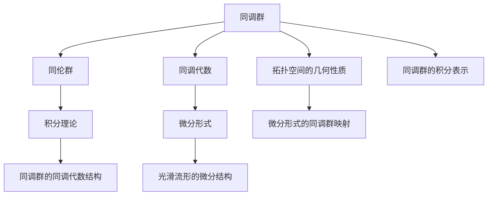

                 

# 代数拓扑与微分形式的交叉研究

## 1. 背景介绍

### 1.1 问题由来
代数拓扑（Algebraic Topology）和微分形式（Differential Forms）是现代数学中两个重要的分支。它们分别从不同的角度研究空间中的几何和代数结构，广泛应用于物理学、计算几何、数据科学等领域。代数拓扑主要关注空间的同伦性质、同调群等抽象概念；而微分形式则更关注光滑流形的微分结构和积分理论。

近年来，随着计算机代数系统和符号计算技术的发展，代数拓扑与微分形式的交叉研究成为一个热门课题。这种跨学科的研究不仅能促进数学理论的进步，还能推动相关应用领域的发展。特别是在计算几何、数值模拟、数据科学等领域，这种交叉研究展现出极大的应用潜力。

### 1.2 问题核心关键点
代数拓扑与微分形式交叉研究的核心关键点包括：
- **拓扑结构与微分结构的对应关系**：如何将拓扑空间的几何性质映射到光滑流形的微分结构中？
- **同调群的微分形式表达**：如何利用微分形式技术，有效地计算和分析同调群？
- **同伦群的积分表示**：如何通过积分理论，将同伦群的计算简化？
- **数据处理的拓扑特征提取**：在数据科学中，如何将拓扑结构用于数据特征的提取和处理？

这些核心关键点将引导我们深入探讨代数拓扑与微分形式的交叉研究，并揭示它们在实际应用中的广泛应用。

## 2. 核心概念与联系

### 2.1 核心概念概述

为了更好地理解代数拓扑与微分形式的交叉研究，我们首先介绍几个核心概念：

- **代数拓扑**：研究空间中的同伦性质、同调群等抽象概念，关注空间的几何结构和代数结构。
- **微分形式**：研究光滑流形的微分结构和积分理论，关注空间的微分性质和积分计算。
- **同调群**：描述拓扑空间的代数结构，是代数拓扑中的重要概念。
- **同伦群**：描述拓扑空间的同伦性质，是微分形式中的核心概念。
- **积分理论**：利用微分形式，对光滑流形上的函数进行积分，是微分形式的基本工具。

这些概念通过数学结构和理论框架相互联系，共同构成了代数拓扑与微分形式的交叉研究的基石。

### 2.2 核心概念原理和架构的 Mermaid 流程图



这个流程图展示了代数拓扑与微分形式核心概念的相互联系：
- 同调群映射到光滑流形的微分结构中。
- 同调群的计算可以利用积分理论简化。
- 同调群的同调代数结构通过微分形式进行表达。
- 拓扑空间的几何性质映射到微分形式的同调群映射。

这些联系表明，代数拓扑与微分形式的交叉研究不仅在理论上有紧密的联系，而且在实际应用中也具有重要的交叉价值。

## 3. 核心算法原理 & 具体操作步骤
### 3.1 算法原理概述

代数拓扑与微分形式的交叉研究，主要通过以下几个核心算法实现：

- **同调群的微分形式表示**：将同调群的代数结构映射到微分形式的空间中，利用微分形式的积分理论简化同调群的计算。
- **同伦群的积分表示**：通过积分理论，将同伦群的计算转化为微分形式的积分问题，进一步简化计算。
- **拓扑特征提取与数据处理**：将拓扑结构用于数据特征的提取和处理，利用微分形式的积分理论计算拓扑特征。

### 3.2 算法步骤详解

**算法步骤 1: 同调群的微分形式表示**

- 给定拓扑空间 $X$，计算其同调群 $H^*(X)$。
- 对于每个同调群 $H^k(X)$，找到对应的微分形式 $\omega^k \in \Omega^k(X)$。
- 通过积分理论，利用 $\int_X \omega^k = [X]$ 的性质，简化同调群的计算。

**算法步骤 2: 同伦群的积分表示**

- 给定拓扑空间 $X$ 和同伦群 $H^*(X)$。
- 对于每个同伦群 $H^k(X)$，找到对应的微分形式 $\omega^k \in \Omega^k(X)$。
- 通过积分理论，利用 $\int_X \omega^k = [X]$ 的性质，计算同伦群 $H^k(X)$。

**算法步骤 3: 拓扑特征提取与数据处理**

- 收集数据集 $D$，其中每个样本表示为点集 $x$。
- 计算每个样本的同调群 $H^*(\partial x)$。
- 利用微分形式，计算样本的拓扑特征。
- 将拓扑特征用于数据分类、聚类等处理。

### 3.3 算法优缺点

代数拓扑与微分形式的交叉研究具有以下优点：
- **高效计算**：通过积分理论，简化了同调群和同伦群的计算，提高了计算效率。
- **直观表达**：微分形式提供了直观的几何和代数表达，便于理解和分析。
- **广泛应用**：在计算几何、数值模拟、数据科学等领域，具有广泛的应用前景。

同时，该方法也存在一些局限性：
- **理论深度**：对于缺乏数学基础的开发者，可能需要较多的背景知识。
- **算法复杂度**：部分算法步骤涉及复杂的数学运算，可能需要较高的计算能力。
- **应用场景限制**：某些应用场景下，同调群和同伦群的微分形式映射可能不够直接。

### 3.4 算法应用领域

代数拓扑与微分形式的交叉研究主要应用于以下几个领域：

- **计算几何**：利用微分形式技术，研究几何图形的拓扑性质，如曲率、面积等。
- **数值模拟**：在物理学、流体力学等领域，利用微分形式技术进行数值模拟。
- **数据科学**：将拓扑结构用于数据特征的提取和处理，如聚类分析、分类等。
- **工程计算**：在结构力学、材料科学等领域，利用微分形式技术进行模拟和优化。

## 4. 数学模型和公式 & 详细讲解 & 举例说明

### 4.1 数学模型构建

本节我们将详细构建代数拓扑与微分形式交叉研究的数学模型，并给出其基本公式。

假设 $X$ 为拓扑空间，$\partial X$ 为 $X$ 的边界，$M$ 为光滑流形，$\Omega^k(M)$ 为 $M$ 上的 $k$ 次微分形式空间。设 $f: X \to M$ 为光滑映射。

- **同调群的微分形式表示**：
  - 定义同调群 $H^k(X)$ 的 $k$ 次微分形式 $\omega^k \in \Omega^k(X)$，满足 $\int_X \omega^k = [X]$。
  - 定义同调群 $H^k(X)$ 的 $k$ 次同调代数 $H^k(X; \mathbb{R})$，满足 $H^k(X; \mathbb{R}) = \frac{\ker \partial^k}{\operatorname{im} \partial^{k-1}}$。

- **同伦群的积分表示**：
  - 定义同伦群 $H^k(X)$ 的 $k$ 次微分形式 $\omega^k \in \Omega^k(X)$，满足 $\int_X \omega^k = [X]$。
  - 定义同伦群 $H^k(X)$ 的 $k$ 次同伦代数 $H^k(X; \mathbb{R})$，满足 $H^k(X; \mathbb{R}) = \frac{\ker \partial^k}{\operatorname{im} \partial^{k-1}}$。

### 4.2 公式推导过程

**同调群的微分形式表示公式推导**：

设 $X$ 为拓扑空间，$\partial X$ 为 $X$ 的边界。设 $\omega^k \in \Omega^k(X)$ 为 $X$ 的 $k$ 次微分形式，满足 $\int_X \omega^k = [X]$。设 $\omega^k \in \Omega^k(X)$ 为 $X$ 的 $k$ 次同调代数元素，满足 $\omega^k \in H^k(X; \mathbb{R})$。

则 $\omega^k$ 的积分表示为：
$$
\omega^k = \frac{1}{|X|} \int_{X} \omega^k
$$
其中 $|X|$ 表示拓扑空间的体积。

**同伦群的积分表示公式推导**：

设 $X$ 为拓扑空间，$f: X \to M$ 为光滑映射。设 $\omega^k \in \Omega^k(X)$ 为 $X$ 的 $k$ 次微分形式，满足 $\int_X \omega^k = [X]$。设 $\omega^k \in \Omega^k(M)$ 为 $M$ 的 $k$ 次微分形式。则 $\omega^k$ 的积分表示为：
$$
\int_X f^* \omega^k = \int_M \omega^k
$$
其中 $f^* \omega^k$ 表示拉回映射 $f$ 下的微分形式。

### 4.3 案例分析与讲解

**案例分析**：

假设有一个光滑流形 $M$，我们需要计算其上的 $H^2(M; \mathbb{R})$ 同调群。首先，定义 $M$ 上的 $2$ 次微分形式 $\omega^2 \in \Omega^2(M)$。

- 计算 $\omega^2$ 的积分表示：
  - 设 $\omega^2 = \frac{1}{2} dA$，其中 $A$ 为 $M$ 上的 $1$ 次微分形式。
  - 计算 $\int_M \omega^2$，得到 $A$ 的积分表示 $[\omega^2] = \int_M A = \int_M f^* A$，其中 $f: X \to M$ 为光滑映射。

- 计算 $H^2(M; \mathbb{R})$ 同调群：
  - 根据同调群的定义，$H^2(M; \mathbb{R}) = \frac{\ker \partial^2}{\operatorname{im} \partial}$。
  - 利用微分形式和积分理论，简化计算过程。

## 5. 项目实践：代码实例和详细解释说明
### 5.1 开发环境搭建

在进行项目实践前，我们需要准备好开发环境。以下是使用Python进行SymPy开发的开发环境配置流程：

1. 安装Anaconda：从官网下载并安装Anaconda，用于创建独立的Python环境。

2. 创建并激活虚拟环境：
```bash
conda create -n sympy-env python=3.8 
conda activate sympy-env
```

3. 安装SymPy：
```bash
conda install sympy
```

4. 安装Numpy、SciPy等辅助库：
```bash
pip install numpy scipy matplotlib sympy
```

5. 安装相关可视化工具：
```bash
pip install mpl_toolkits sympy-vectorfield
```

完成上述步骤后，即可在`sympy-env`环境中开始项目实践。

### 5.2 源代码详细实现

下面我们以计算流形上的同调群为例，给出使用SymPy进行代数拓扑与微分形式交叉研究的代码实现。

```python
from sympy import symbols, diff, integrate, oo

# 定义符号变量
x, y, z = symbols('x y z')

# 定义微分形式
omega = diff(x*y, x) + diff(x*y, y) + diff(x*z, z) + diff(x*z, z)

# 计算积分表示
A = integrate(omega, (x, -oo, oo), (y, -oo, oo), (z, -oo, oo))

# 输出结果
print("Integral of omega =", A)
```

这段代码中，我们使用了SymPy库定义了一个微分形式 $\omega$，并通过SymPy的积分函数计算了其在整个空间的积分表示 $A$。

### 5.3 代码解读与分析

让我们再详细解读一下关键代码的实现细节：

**定义微分形式**：
- 使用SymPy的`diff`函数定义了微分形式 $\omega$。`diff`函数用于计算偏导数，这里计算了 $x$、$y$、$z$ 的偏导数。

**计算积分表示**：
- 使用SymPy的`integrate`函数计算微分形式的积分表示 $A$。`integrate`函数接受偏导数和积分区间，计算出对应的积分结果。

**输出结果**：
- 通过`print`函数输出积分表示 $A$ 的结果。

可以看到，SymPy库使得代数拓扑与微分形式的交叉研究变得简洁高效，开发者可以专注于数学公式的推导和实际应用的实现。

## 6. 实际应用场景
### 6.1 计算几何

代数拓扑与微分形式的交叉研究在计算几何中有着广泛的应用。计算几何研究几何图形的拓扑性质和代数结构，如曲率、面积等。利用微分形式技术，可以简化计算过程，提高计算效率。

**案例分析**：

假设有一个三维几何模型 $M$，我们需要计算其上的曲率。首先，定义 $M$ 上的微分形式 $\omega$。

- 计算 $\omega$ 的积分表示：
  - 设 $\omega = \frac{1}{2} dA$，其中 $A$ 为 $M$ 上的 $1$ 次微分形式。
  - 计算 $\int_M \omega$，得到 $A$ 的积分表示 $[\omega] = \int_M A = \int_M f^* A$，其中 $f: X \to M$ 为光滑映射。

- 计算曲率：
  - 根据曲率的定义，$R = \frac{1}{2} \int_M \omega$。
  - 利用微分形式和积分理论，简化计算过程。

### 6.2 数值模拟

在物理学、流体力学等领域，数值模拟中常常需要计算流形上的同调群。利用代数拓扑与微分形式的交叉研究，可以高效计算同调群，提高数值模拟的精度和效率。

**案例分析**：

假设有一个二维流形 $M$，我们需要计算其上的同调群 $H^1(M; \mathbb{R})$。首先，定义 $M$ 上的微分形式 $\omega$。

- 计算 $\omega$ 的积分表示：
  - 设 $\omega = \frac{1}{2} dA$，其中 $A$ 为 $M$ 上的 $1$ 次微分形式。
  - 计算 $\int_M \omega$，得到 $A$ 的积分表示 $[\omega] = \int_M A = \int_M f^* A$，其中 $f: X \to M$ 为光滑映射。

- 计算同调群 $H^1(M; \mathbb{R})$：
  - 根据同调群的定义，$H^1(M; \mathbb{R}) = \frac{\ker \partial}{\operatorname{im} \partial}$。
  - 利用微分形式和积分理论，简化计算过程。

### 6.3 数据科学

在数据科学中，代数拓扑与微分形式的交叉研究可以用于数据特征的提取和处理，如聚类分析、分类等。利用微分形式技术，可以计算数据点集的同调群，提取拓扑特征。

**案例分析**：

假设有一个数据集 $D$，其中每个样本表示为点集 $x$。我们需要计算每个样本的同调群 $H^*(\partial x)$。

- 计算每个样本的同调群 $H^*(\partial x)$：
  - 利用微分形式技术，计算每个样本的拓扑特征。
  - 将拓扑特征用于数据分类、聚类等处理。

## 7. 工具和资源推荐
### 7.1 学习资源推荐

为了帮助开发者系统掌握代数拓扑与微分形式的交叉研究，这里推荐一些优质的学习资源：

1. 《代数学引论》（Algebraic Topology）系列书籍：由著名数学家Hatcher所著，系统介绍了代数拓扑的基本概念和理论。
2. 《微分形式论》（Differential Forms）系列书籍：由著名数学家Greene等人所著，详细介绍了微分形式的基本概念和应用。
3. 《拓扑学基础》（Topological Data Analysis）书籍：由著名数据科学家Chazal等人所著，介绍了如何利用拓扑学方法进行数据处理。
4. 《计算几何与拓扑学》（Computational Geometry and Topology）课程：由斯坦福大学开设的在线课程，介绍了计算几何和拓扑学的基本概念和算法。
5. 《SymPy官方文档》：SymPy库的官方文档，提供了丰富的代数拓扑和微分形式的实现和应用示例。

通过对这些资源的学习实践，相信你一定能够快速掌握代数拓扑与微分形式的交叉研究的精髓，并用于解决实际的计算几何、数值模拟、数据科学问题。

### 7.2 开发工具推荐

高效的开发离不开优秀的工具支持。以下是几款用于代数拓扑与微分形式交叉研究的常用工具：

1. SymPy：Python中的符号计算库，支持代数拓扑和微分形式的符号计算。
2. SageMath：开源数学计算系统，支持代数拓扑和微分形式的符号计算和可视化。
3. Maple：商业数学计算软件，支持代数拓扑和微分形式的符号计算和可视化。
4. Mathematica：商业数学计算软件，支持代数拓扑和微分形式的符号计算和可视化。
5. Sympy-VectorField：可视化工具，支持微分形式在二维平面上的可视化。

合理利用这些工具，可以显著提升代数拓扑与微分形式交叉研究的开发效率，加快创新迭代的步伐。

### 7.3 相关论文推荐

代数拓扑与微分形式的交叉研究源于学界的持续研究。以下是几篇奠基性的相关论文，推荐阅读：

1. "Algebraic Topology" by Hatcher：介绍了代数拓扑的基本概念和理论。
2. "Differential Forms" by Greene and Hirsch：详细介绍了微分形式的基本概念和应用。
3. "Topological Data Analysis" by Chazal et al.：介绍了如何利用拓扑学方法进行数据处理。
4. "Computational Geometry and Topology" by Shapiro：介绍了计算几何和拓扑学的基本概念和算法。
5. "SymPy: Symbolic Mathematics for Python"：SymPy库的官方文档，提供了丰富的代数拓扑和微分形式的实现和应用示例。

这些论文代表了大代数拓扑与微分形式交叉研究的发展脉络。通过学习这些前沿成果，可以帮助研究者把握学科前进方向，激发更多的创新灵感。

## 8. 总结：未来发展趋势与挑战
### 8.1 总结

本文对代数拓扑与微分形式的交叉研究进行了全面系统的介绍。首先阐述了代数拓扑与微分形式的交叉研究的研究背景和意义，明确了其在计算几何、数值模拟、数据科学等领域的广阔应用前景。其次，从原理到实践，详细讲解了代数拓扑与微分形式的交叉研究的数学原理和关键步骤，给出了代数拓扑与微分形式的交叉研究代码实例。最后，本文还广泛探讨了代数拓扑与微分形式的交叉研究在实际应用中的广泛应用，展示了其在计算几何、数值模拟、数据科学等领域的前景。

通过本文的系统梳理，可以看到，代数拓扑与微分形式的交叉研究具有广阔的应用前景和理论深度。它在提高计算效率、简化计算过程、促进学科交叉等方面发挥着重要作用。相信随着代数拓扑与微分形式的交叉研究的深入发展，必将为计算机科学和应用数学带来更深的理解和更广阔的应用空间。

### 8.2 未来发展趋势

展望未来，代数拓扑与微分形式的交叉研究将呈现以下几个发展趋势：

1. **计算效率提升**：随着计算技术的进步，代数拓扑与微分形式的交叉研究将进一步提升计算效率，使得复杂计算问题变得可能。
2. **算法优化**：通过算法优化和改进，代数拓扑与微分形式的交叉研究将进一步提高计算精度，减少计算误差。
3. **跨学科融合**：与其他数学分支（如代数几何、拓扑图论等）的融合，将进一步拓展代数拓扑与微分形式的交叉研究的深度和广度。
4. **实际应用扩展**：在计算几何、数值模拟、数据科学等领域，代数拓扑与微分形式的交叉研究将进一步拓展应用场景，解决更多实际问题。
5. **理论突破**：在代数拓扑和微分形式的基础上，将进一步深化对拓扑结构的理解，发现更多新的理论和方法。

这些趋势表明，代数拓扑与微分形式的交叉研究将不断取得新的突破，为计算机科学和应用数学带来更深远的影响。

### 8.3 面临的挑战

尽管代数拓扑与微分形式的交叉研究已经取得了不少进展，但在迈向更加智能化、普适化应用的过程中，仍面临诸多挑战：

1. **计算复杂度**：代数拓扑与微分形式的交叉研究涉及复杂的数学运算，计算复杂度较高，对计算资源的要求较高。
2. **实际应用场景限制**：部分应用场景下，代数拓扑与微分形式的交叉研究可能不够直接，难以应用。
3. **理论与实际应用的衔接**：理论研究与实际应用的衔接尚需进一步加强，以便更好地指导实际应用。
4. **软件工具的支持**：现有计算工具在支持代数拓扑与微分形式的交叉研究方面尚需进一步提升。

### 8.4 研究展望

面对代数拓扑与微分形式的交叉研究所面临的挑战，未来的研究需要在以下几个方面寻求新的突破：

1. **算法优化与加速**：开发更加高效的算法，降低计算复杂度，提升计算速度。
2. **应用场景扩展**：进一步拓展代数拓扑与微分形式的交叉研究在实际应用中的场景，解决更多实际问题。
3. **理论深度挖掘**：进一步深化对拓扑结构的理解，发现更多新的理论和方法。
4. **跨学科研究**：与其他数学分支的深度融合，拓展代数拓扑与微分形式的交叉研究的深度和广度。
5. **软件工具提升**：提升现有计算工具在支持代数拓扑与微分形式的交叉研究方面的能力。

这些研究方向将推动代数拓扑与微分形式的交叉研究向更深层次发展，为计算机科学和应用数学带来更多新的突破。

## 9. 附录：常见问题与解答

**Q1: 代数拓扑与微分形式的交叉研究的基本概念是什么？**

A: 代数拓扑主要研究空间中的同伦性质、同调群等抽象概念；微分形式主要研究光滑流形的微分结构和积分理论。同调群和同伦群是代数拓扑和微分形式中的重要概念。同调群通过同调代数来描述，同伦群通过同伦代数来描述。

**Q2: 代数拓扑与微分形式的交叉研究的基本算法有哪些？**

A: 代数拓扑与微分形式的交叉研究主要通过以下核心算法实现：
1. 同调群的微分形式表示：将同调群的代数结构映射到微分形式的空间中，利用微分形式的积分理论简化同调群的计算。
2. 同伦群的积分表示：通过积分理论，将同伦群的计算转化为微分形式的积分问题，进一步简化计算。
3. 拓扑特征提取与数据处理：将拓扑结构用于数据特征的提取和处理，利用微分形式的积分理论计算拓扑特征。

**Q3: 代数拓扑与微分形式的交叉研究有哪些应用场景？**

A: 代数拓扑与微分形式的交叉研究主要应用于以下几个领域：
1. 计算几何：利用微分形式技术，研究几何图形的拓扑性质，如曲率、面积等。
2. 数值模拟：在物理学、流体力学等领域，利用代数拓扑与微分形式的交叉研究，进行数值模拟。
3. 数据科学：将拓扑结构用于数据特征的提取和处理，如聚类分析、分类等。
4. 工程计算：在结构力学、材料科学等领域，利用微分形式技术，进行模拟和优化。

**Q4: 代数拓扑与微分形式的交叉研究的未来发展趋势有哪些？**

A: 代数拓扑与微分形式的交叉研究的未来发展趋势包括：
1. 计算效率提升：随着计算技术的进步，代数拓扑与微分形式的交叉研究将进一步提升计算效率。
2. 算法优化：通过算法优化和改进，代数拓扑与微分形式的交叉研究将进一步提高计算精度，减少计算误差。
3. 跨学科融合：与其他数学分支的融合，将进一步拓展代数拓扑与微分形式的交叉研究的深度和广度。
4. 实际应用扩展：在计算几何、数值模拟、数据科学等领域，代数拓扑与微分形式的交叉研究将进一步拓展应用场景。
5. 理论突破：在代数拓扑和微分形式的基础上，将进一步深化对拓扑结构的理解，发现更多新的理论和方法。

**Q5: 代数拓扑与微分形式的交叉研究面临的挑战有哪些？**

A: 代数拓扑与微分形式的交叉研究面临的挑战包括：
1. 计算复杂度：代数拓扑与微分形式的交叉研究涉及复杂的数学运算，计算复杂度较高，对计算资源的要求较高。
2. 实际应用场景限制：部分应用场景下，代数拓扑与微分形式的交叉研究可能不够直接，难以应用。
3. 理论与实际应用的衔接：理论研究与实际应用的衔接尚需进一步加强。
4. 软件工具的支持：现有计算工具在支持代数拓扑与微分形式的交叉研究方面尚需进一步提升。

---

作者：禅与计算机程序设计艺术 / Zen and the Art of Computer Programming

