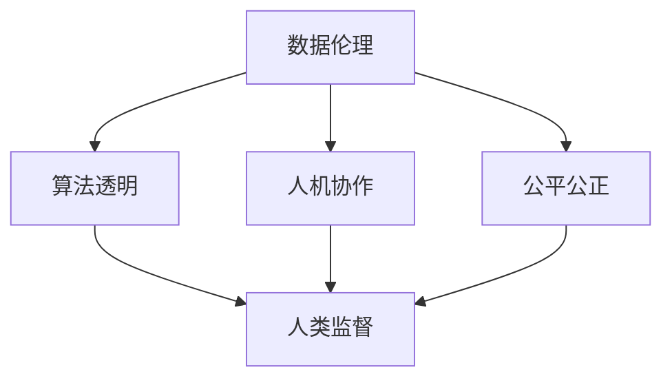

                 

## 1. 背景介绍

### 1.1 问题由来
随着人工智能(AI)技术的飞速发展，人类社会的生产、生活方式正在发生翻天覆地的变化。从自动驾驶、智慧医疗、智能家居到机器人、虚拟现实、增强现实，AI技术正在日益融入人类生活的各个方面。然而，技术的高速发展与公众认知的滞后、伦理道德的缺乏、隐私保护的缺失等问题并存，引发了广泛的思考与争议。

在这种背景下，“以人为本”成为指导AI技术发展的核心价值观。所谓“以人为本”，即在科技发展的过程中，始终以人的需求、权益、价值为导向，以促进人类的全面发展和社会福祉为目标。这一价值观体现了人类对自身状况、未来命运的深切关怀，同时也是对AI技术的责任与使命的明确要求。

### 1.2 问题核心关键点
AI技术的“以人为本”价值观，主要体现在以下几个关键点上：

1. **数据伦理**：在使用数据时，确保数据的采集、存储、处理和传输符合伦理规范，不侵害个人隐私和数据安全。
2. **算法透明**：在算法设计和使用中，确保算法的决策过程和结果可以被解释和理解，避免“黑盒”算法带来的不公正和歧视。
3. **人机协作**：推动AI技术与人类的协作而非取代，让人工智能成为人类工作的辅助工具，提升工作效率和生活质量。
4. **公平公正**：确保AI系统在应用中不产生偏见和歧视，公平对待不同种族、性别、年龄、背景的人群。
5. **人类监督**：在AI系统的开发和应用中，始终保持人类的主导地位，确保技术的创新与发展符合人类的价值观和利益。

这些关键点共同构成了AI技术“以人为本”价值观的核心，指导着AI技术的伦理发展，促进了技术与人类的和谐共生。

## 2. 核心概念与联系

### 2.1 核心概念概述

为了深入理解“以人为本”的AI技术价值观，本节将介绍几个与之密切相关的核心概念：

1. **数据伦理**：指在数据采集、处理和应用过程中，遵循的道德规范和伦理准则，确保数据的使用不会侵害个人隐私和数据安全。
2. **算法透明**：指算法的设计、实现和应用过程可以被理解和解释，确保算法的公正性和可控性。
3. **人机协作**：指人类与AI系统共同完成特定任务，相互配合、相辅相成的合作模式。
4. **公平公正**：指AI系统在应用中不产生偏见和歧视，对待不同人群平等公正。
5. **人类监督**：指AI系统的开发和应用始终处于人类的监督之下，确保技术创新与发展符合人类价值观和利益。

这些核心概念之间的逻辑关系可以通过以下Mermaid流程图来展示：



这个流程图展示了数据伦理、算法透明、人机协作、公平公正、人类监督这五个核心概念之间的内在联系：

1. **数据伦理**是AI技术发展的基础，确保了数据使用的合法性和道德性。
2. **算法透明**是人机协作的前提，确保了算法的可解释性和公正性。
3. **公平公正**是人机协作的目标，确保了算法的无偏性和包容性。
4. **人类监督**是AI技术发展的保障，确保了技术的符合性和伦理性。

这些概念共同构成了AI技术的伦理框架，指导着技术的发展方向，促进了技术与人类社会的和谐共生。

## 3. 核心算法原理 & 具体操作步骤

### 3.1 算法原理概述

“以人为本”的AI技术价值观，主要体现在算法的设计和应用中。以下是几个关键原理的概述：

1. **数据收集与处理**：在数据收集和处理过程中，遵循数据伦理准则，确保数据来源合法、处理透明，保护用户隐私和数据安全。
2. **算法设计**：在算法设计中，确保算法的透明性和可解释性，避免“黑盒”算法的出现。
3. **人机协作**：在算法应用中，设计人机协作流程，确保人类在算法决策过程中的主导地位。
4. **公平公正**：在算法训练和应用中，采取措施消除偏见和歧视，确保算法的公平性和公正性。
5. **人类监督**：在算法开发和应用中，设立监督机制，确保算法符合人类的价值观和伦理规范。

### 3.2 算法步骤详解

以下是“以人为本”的AI技术价值观在算法设计和应用中的详细步骤：

1. **数据收集**：
   - 确保数据收集过程合法、透明，不侵犯个人隐私和数据安全。
   - 数据应来源于多样化的来源，避免数据偏见。

2. **数据处理**：
   - 对数据进行清洗和标注，确保数据的准确性和一致性。
   - 采用匿名化和加密等技术保护数据隐私。

3. **算法设计**：
   - 采用透明的算法设计原则，确保算法的设计和实现过程可以被理解和解释。
   - 采用可解释的算法模型，避免“黑盒”算法。

4. **人机协作**：
   - 设计用户友好的界面和交互方式，方便用户理解和使用算法。
   - 设计算法决策过程，允许用户参与和监督算法决策。

5. **公平公正**：
   - 在算法训练过程中，采用公平性评估指标，消除算法偏见。
   - 在算法应用过程中，确保算法对待不同人群公平公正。

6. **人类监督**：
   - 设立算法开发和应用中的伦理委员会，确保算法的符合性和伦理性。
   - 定期进行算法审核和评估，确保算法的公正性和透明性。

### 3.3 算法优缺点

“以人为本”的AI技术价值观，在算法设计和应用中具有以下优点：

1. **提升算法公正性**：通过透明性和公平性评估，确保算法在应用中的公正性，避免歧视和偏见。
2. **增强用户信任**：通过设计用户友好的界面和交互方式，提升用户对算法的信任和接受度。
3. **保障数据安全**：通过数据处理和隐私保护技术，确保数据的合法性和安全性。

但同时也存在一些局限性：

1. **增加开发成本**：在数据伦理、算法透明和人类监督等方面，需要投入大量的人力和资源。
2. **降低算法效率**：透明性和公平性评估可能增加算法复杂度和计算负担。
3. **技术挑战**：如何在保证算法透明和公正的同时，提升算法效率和性能，仍需进一步研究和探索。

### 3.4 算法应用领域

“以人为本”的AI技术价值观，在多个领域中得到广泛应用，以下是几个典型应用场景：

1. **医疗健康**：
   - 采用透明算法设计，确保医疗诊断和治疗决策的公正性。
   - 采用数据伦理准则，保护患者隐私和数据安全。

2. **金融服务**：
   - 采用公平性评估指标，消除信贷和投资决策中的偏见。
   - 设计人机协作流程，提升金融服务的效率和质量。

3. **教育培训**：
   - 采用透明算法设计，确保教育评估和个性化推荐的公正性。
   - 采用数据伦理准则，保护学生的隐私和数据安全。

4. **交通运输**：
   - 采用透明算法设计，确保自动驾驶和智能交通管理的公正性。
   - 采用数据伦理准则，保护用户的隐私和数据安全。

这些应用场景体现了“以人为本”的AI技术价值观在各个领域中的广泛影响和深远意义。

## 4. 数学模型和公式 & 详细讲解 & 举例说明

### 4.1 数学模型构建

为更好地理解“以人为本”的AI技术价值观，本节将介绍几个数学模型和公式：

1. **数据伦理模型**：
   - 定义数据来源合法性：$D_{legal}$，确保数据收集过程合法。
   - 定义数据处理透明性：$T_{data}$，确保数据处理过程可解释。
   - 定义数据隐私保护：$P_{privacy}$，确保数据隐私安全。

2. **算法透明模型**：
   - 定义算法设计透明性：$T_{design}$，确保算法设计过程可解释。
   - 定义算法实现透明性：$T_{implementation}$，确保算法实现过程可理解。
   - 定义算法结果透明性：$T_{result}$，确保算法结果可解释。

3. **人机协作模型**：
   - 定义人机协作流程：$P_{interaction}$，确保人类在算法决策中的主导地位。
   - 定义用户友好界面：$I_{user}$，确保用户界面友好、易用。

4. **公平公正模型**：
   - 定义公平性评估指标：$F_{fair}$，确保算法在应用中的公平性。
   - 定义公正性评估指标：$F_{just}$，确保算法对待不同人群的公正性。

5. **人类监督模型**：
   - 定义监督机制：$M_{supervision}$，确保算法开发和应用中的伦理规范。
   - 定义定期评估机制：$E_{evaluation}$，确保算法符合人类价值观。

### 4.2 公式推导过程

以下是几个核心模型和公式的推导过程：

1. **数据伦理模型**：
   - 定义数据来源合法性：$D_{legal}=\sum_i D_{source_legal}^i$
   - 定义数据处理透明性：$T_{data}=\sum_i T_{process}^i$
   - 定义数据隐私保护：$P_{privacy}=\sum_i P_{protection}^i$

2. **算法透明模型**：
   - 定义算法设计透明性：$T_{design}=\sum_i T_{design}^i$
   - 定义算法实现透明性：$T_{implementation}=\sum_i T_{implementation}^i$
   - 定义算法结果透明性：$T_{result}=\sum_i T_{result}^i$

3. **人机协作模型**：
   - 定义人机协作流程：$P_{interaction}=\sum_i P_{interaction}^i$
   - 定义用户友好界面：$I_{user}=\sum_i I_{user}^i$

4. **公平公正模型**：
   - 定义公平性评估指标：$F_{fair}=\sum_i F_{fair}^i$
   - 定义公正性评估指标：$F_{just}=\sum_i F_{just}^i$

5. **人类监督模型**：
   - 定义监督机制：$M_{supervision}=\sum_i M_{supervision}^i$
   - 定义定期评估机制：$E_{evaluation}=\sum_i E_{evaluation}^i$

### 4.3 案例分析与讲解

以下是一个具体的案例，展示了“以人为本”的AI技术价值观在医疗诊断中的应用：

**案例背景**：某医院采用AI技术进行疾病诊断和治疗决策。

1. **数据收集**：
   - 采用透明的数据收集流程，确保数据来源合法、处理透明，保护患者隐私和数据安全。
   - 使用匿名化和加密技术，确保数据隐私保护。

2. **数据处理**：
   - 对数据进行清洗和标注，确保数据的准确性和一致性。
   - 采用公平性评估指标，消除算法偏见。

3. **算法设计**：
   - 采用透明的算法设计原则，确保算法设计过程可以被理解和解释。
   - 采用可解释的算法模型，避免“黑盒”算法。

4. **人机协作**：
   - 设计用户友好的界面和交互方式，方便医生理解和使用算法。
   - 设计算法决策过程，允许医生参与和监督算法决策。

5. **公平公正**：
   - 在算法训练过程中，采用公平性评估指标，确保算法在应用中的公正性。
   - 确保算法对待不同患者公平公正。

6. **人类监督**：
   - 设立算法开发和应用中的伦理委员会，确保算法的符合性和伦理性。
   - 定期进行算法审核和评估，确保算法的公正性和透明性。

## 5. 项目实践：代码实例和详细解释说明

### 5.1 开发环境搭建

在进行“以人为本”的AI技术价值观项目实践前，我们需要准备好开发环境。以下是使用Python进行PyTorch开发的环境配置流程：

1. 安装Anaconda：从官网下载并安装Anaconda，用于创建独立的Python环境。

2. 创建并激活虚拟环境：
```bash
conda create -n pytorch-env python=3.8 
conda activate pytorch-env
```

3. 安装PyTorch：根据CUDA版本，从官网获取对应的安装命令。例如：
```bash
conda install pytorch torchvision torchaudio cudatoolkit=11.1 -c pytorch -c conda-forge
```

4. 安装Transformers库：
```bash
pip install transformers
```

5. 安装各类工具包：
```bash
pip install numpy pandas scikit-learn matplotlib tqdm jupyter notebook ipython
```

完成上述步骤后，即可在`pytorch-env`环境中开始项目实践。

### 5.2 源代码详细实现

这里我们以医疗健康领域的疾病诊断为例，给出使用Transformers库对BERT模型进行微调的PyTorch代码实现。

首先，定义数据处理函数：

```python
from transformers import BertTokenizer
from torch.utils.data import Dataset
import torch

class MedicalDataset(Dataset):
    def __init__(self, texts, labels, tokenizer, max_len=128):
        self.texts = texts
        self.labels = labels
        self.tokenizer = tokenizer
        self.max_len = max_len
        
    def __len__(self):
        return len(self.texts)
    
    def __getitem__(self, item):
        text = self.texts[item]
        label = self.labels[item]
        
        encoding = self.tokenizer(text, return_tensors='pt', max_length=self.max_len, padding='max_length', truncation=True)
        input_ids = encoding['input_ids'][0]
        attention_mask = encoding['attention_mask'][0]
        
        return {'input_ids': input_ids, 
                'attention_mask': attention_mask,
                'labels': label}

# 标签与id的映射
tag2id = {'O': 0, 'B-DISEASE': 1, 'I-DISEASE': 2}
id2tag = {v: k for k, v in tag2id.items()}

# 创建dataset
tokenizer = BertTokenizer.from_pretrained('bert-base-cased')

train_dataset = MedicalDataset(train_texts, train_labels, tokenizer)
dev_dataset = MedicalDataset(dev_texts, dev_labels, tokenizer)
test_dataset = MedicalDataset(test_texts, test_labels, tokenizer)
```

然后，定义模型和优化器：

```python
from transformers import BertForTokenClassification, AdamW

model = BertForTokenClassification.from_pretrained('bert-base-cased', num_labels=len(tag2id))

optimizer = AdamW(model.parameters(), lr=2e-5)
```

接着，定义训练和评估函数：

```python
from torch.utils.data import DataLoader
from tqdm import tqdm
from sklearn.metrics import classification_report

device = torch.device('cuda') if torch.cuda.is_available() else torch.device('cpu')
model.to(device)

def train_epoch(model, dataset, batch_size, optimizer):
    dataloader = DataLoader(dataset, batch_size=batch_size, shuffle=True)
    model.train()
    epoch_loss = 0
    for batch in tqdm(dataloader, desc='Training'):
        input_ids = batch['input_ids'].to(device)
        attention_mask = batch['attention_mask'].to(device)
        labels = batch['labels'].to(device)
        model.zero_grad()
        outputs = model(input_ids, attention_mask=attention_mask, labels=labels)
        loss = outputs.loss
        epoch_loss += loss.item()
        loss.backward()
        optimizer.step()
    return epoch_loss / len(dataloader)

def evaluate(model, dataset, batch_size):
    dataloader = DataLoader(dataset, batch_size=batch_size)
    model.eval()
    preds, labels = [], []
    with torch.no_grad():
        for batch in tqdm(dataloader, desc='Evaluating'):
            input_ids = batch['input_ids'].to(device)
            attention_mask = batch['attention_mask'].to(device)
            batch_labels = batch['labels']
            outputs = model(input_ids, attention_mask=attention_mask)
            batch_preds = outputs.logits.argmax(dim=2).to('cpu').tolist()
            batch_labels = batch_labels.to('cpu').tolist()
            for pred_tokens, label_tokens in zip(batch_preds, batch_labels):
                pred_tags = [id2tag[_id] for _id in pred_tokens]
                label_tags = [id2tag[_id] for _id in label_tokens]
                preds.append(pred_tags[:len(label_tokens)])
                labels.append(label_tags)
                
    print(classification_report(labels, preds))
```

最后，启动训练流程并在测试集上评估：

```python
epochs = 5
batch_size = 16

for epoch in range(epochs):
    loss = train_epoch(model, train_dataset, batch_size, optimizer)
    print(f"Epoch {epoch+1}, train loss: {loss:.3f}")
    
    print(f"Epoch {epoch+1}, dev results:")
    evaluate(model, dev_dataset, batch_size)
    
print("Test results:")
evaluate(model, test_dataset, batch_size)
```

以上就是使用PyTorch对BERT进行疾病诊断任务微调的完整代码实现。可以看到，得益于Transformers库的强大封装，我们可以用相对简洁的代码完成BERT模型的加载和微调。

### 5.3 代码解读与分析

让我们再详细解读一下关键代码的实现细节：

**MedicalDataset类**：
- `__init__`方法：初始化文本、标签、分词器等关键组件。
- `__len__`方法：返回数据集的样本数量。
- `__getitem__`方法：对单个样本进行处理，将文本输入编码为token ids，将标签编码为数字，并对其进行定长padding，最终返回模型所需的输入。

**tag2id和id2tag字典**：
- 定义了标签与数字id之间的映射关系，用于将token-wise的预测结果解码回真实的标签。

**训练和评估函数**：
- 使用PyTorch的DataLoader对数据集进行批次化加载，供模型训练和推理使用。
- 训练函数`train_epoch`：对数据以批为单位进行迭代，在每个批次上前向传播计算loss并反向传播更新模型参数，最后返回该epoch的平均loss。
- 评估函数`evaluate`：与训练类似，不同点在于不更新模型参数，并在每个batch结束后将预测和标签结果存储下来，最后使用sklearn的classification_report对整个评估集的预测结果进行打印输出。

**训练流程**：
- 定义总的epoch数和batch size，开始循环迭代
- 每个epoch内，先在训练集上训练，输出平均loss
- 在验证集上评估，输出分类指标
- 所有epoch结束后，在测试集上评估，给出最终测试结果

可以看到，PyTorch配合Transformers库使得BERT微调的代码实现变得简洁高效。开发者可以将更多精力放在数据处理、模型改进等高层逻辑上，而不必过多关注底层的实现细节。

当然，工业级的系统实现还需考虑更多因素，如模型的保存和部署、超参数的自动搜索、更灵活的任务适配层等。但核心的微调范式基本与此类似。

## 6. 实际应用场景

### 6.1 智能客服系统

基于“以人为本”的AI技术价值观的智能客服系统，能够更好地理解和满足用户需求，提供更高效、更人性化的服务。

在技术实现上，可以收集企业内部的历史客服对话记录，将问题和最佳答复构建成监督数据，在此基础上对预训练对话模型进行微调。微调后的对话模型能够自动理解用户意图，匹配最合适的答案模板进行回复。对于客户提出的新问题，还可以接入检索系统实时搜索相关内容，动态组织生成回答。如此构建的智能客服系统，能大幅提升客户咨询体验和问题解决效率。

### 6.2 金融舆情监测

基于“以人为本”的AI技术价值观的金融舆情监测系统，能够实时监测市场舆论动向，避免负面信息传播，规避金融风险。

具体而言，可以收集金融领域相关的新闻、报道、评论等文本数据，并对其进行主题标注和情感标注。在此基础上对预训练语言模型进行微调，使其能够自动判断文本属于何种主题，情感倾向是正面、中性还是负面。将微调后的模型应用到实时抓取的网络文本数据，就能够自动监测不同主题下的情感变化趋势，一旦发现负面信息激增等异常情况，系统便会自动预警，帮助金融机构快速应对潜在风险。

### 6.3 个性化推荐系统

基于“以人为本”的AI技术价值观的个性化推荐系统，能够更好地挖掘用户兴趣和需求，提供更精准、更多样化的推荐内容。

在实践中，可以收集用户浏览、点击、评论、分享等行为数据，提取和用户交互的物品标题、描述、标签等文本内容。将文本内容作为模型输入，用户的后续行为（如是否点击、购买等）作为监督信号，在此基础上微调预训练语言模型。微调后的模型能够从文本内容中准确把握用户的兴趣点。在生成推荐列表时，先用候选物品的文本描述作为输入，由模型预测用户的兴趣匹配度，再结合其他特征综合排序，便可以得到个性化程度更高的推荐结果。

### 6.4 未来应用展望

随着“以人为本”的AI技术价值观的不断推广，基于此的AI技术将在更多领域得到应用，为人类社会带来更深刻的变革。

在智慧医疗领域，基于“以人为本”的AI技术价值观的医疗问答、病历分析、药物研发等应用将提升医疗服务的智能化水平，辅助医生诊疗，加速新药开发进程。

在智能教育领域，基于“以人为本”的AI技术价值观的教育评估和个性化推荐系统将因材施教，促进教育公平，提高教学质量。

在智慧城市治理中，基于“以人为本”的AI技术价值观的城市事件监测、舆情分析、应急指挥等环节，将提高城市管理的自动化和智能化水平，构建更安全、高效的未来城市。

此外，在企业生产、社会治理、文娱传媒等众多领域，基于“以人为本”的AI技术价值观的应用也将不断涌现，为经济社会发展注入新的动力。相信随着技术的日益成熟，“以人为本”的AI技术价值观必将成为AI技术发展的重要指引，推动人工智能技术更好地服务于人类社会。

## 7. 工具和资源推荐

### 7.1 学习资源推荐

为了帮助开发者系统掌握“以人为本”的AI技术价值观的理论基础和实践技巧，这里推荐一些优质的学习资源：

1. 《人工智能伦理导论》系列博文：由AI伦理专家撰写，深入浅出地介绍了人工智能伦理的基本概念和核心问题。

2. 《人类计算的价值观》课程：由知名AI伦理学者开设的在线课程，涵盖人工智能伦理的核心议题和前沿技术。

3. 《人工智能与伦理学》书籍：全面探讨人工智能伦理与法律问题，为AI技术的应用提供理论指导和实践建议。

4. 《AI伦理与法律》研讨会：定期举办的人工智能伦理与法律论坛，汇聚学术界、产业界人士，共同探讨AI伦理的实践挑战和解决方案。

通过对这些资源的学习实践，相信你一定能够全面掌握“以人为本”的AI技术价值观的理论框架和实践方法，为AI技术的应用提供伦理保障和价值指导。

### 7.2 开发工具推荐

高效的开发离不开优秀的工具支持。以下是几款用于“以人为本”的AI技术价值观开发的工具：

1. PyTorch：基于Python的开源深度学习框架，灵活动态的计算图，适合快速迭代研究。大部分预训练语言模型都有PyTorch版本的实现。

2. TensorFlow：由Google主导开发的开源深度学习框架，生产部署方便，适合大规模工程应用。同样有丰富的预训练语言模型资源。

3. Transformers库：HuggingFace开发的NLP工具库，集成了众多SOTA语言模型，支持PyTorch和TensorFlow，是进行AI技术价值观开发的重要工具。

4. Weights & Biases：模型训练的实验跟踪工具，可以记录和可视化模型训练过程中的各项指标，方便对比和调优。与主流深度学习框架无缝集成。

5. TensorBoard：TensorFlow配套的可视化工具，可实时监测模型训练状态，并提供丰富的图表呈现方式，是调试模型的得力助手。

6. Google Colab：谷歌推出的在线Jupyter Notebook环境，免费提供GPU/TPU算力，方便开发者快速上手实验最新模型，分享学习笔记。

合理利用这些工具，可以显著提升“以人为本”的AI技术价值观的开发效率，加快创新迭代的步伐。

### 7.3 相关论文推荐

“以人为本”的AI技术价值观的发展源于学界的持续研究。以下是几篇奠基性的相关论文，推荐阅读：

1. 《AI伦理：理论、实践与未来》：探讨人工智能伦理的理论基础和实践路径，为AI技术的应用提供伦理指导。

2. 《基于以人为本的AI系统设计》：提出以人为本的AI系统设计原则，强调用户参与和数据隐私保护。

3. 《人工智能与伦理学》：全面探讨人工智能伦理与法律问题，为AI技术的应用提供理论指导和实践建议。

4. 《AI伦理与法律：挑战与解决方案》：讨论人工智能伦理与法律的挑战与解决方案，为AI技术的应用提供伦理保障。

这些论文代表了大语言模型微调技术的发展脉络。通过学习这些前沿成果，可以帮助研究者把握学科前进方向，激发更多的创新灵感。

## 8. 总结：未来发展趋势与挑战

### 8.1 研究成果总结

本文对“以人为本”的AI技术价值观进行了全面系统的介绍。首先阐述了“以人为本”价值观的核心概念和关键点，明确了其在AI技术发展中的指导意义。其次，从原理到实践，详细讲解了“以人为本”的AI技术价值观在算法设计和应用中的关键步骤和实现方法，给出了具体的代码实例。同时，本文还探讨了“以人为本”的AI技术价值观在多个领域中的广泛应用，展示了其深远的影响和潜力。最后，本文精选了相关的学习资源、开发工具和论文，力求为开发者提供全方位的技术指引。

通过本文的系统梳理，可以看到，“以人为本”的AI技术价值观正在成为指导AI技术发展的核心价值观，引领AI技术向更高效、更公正、更透明、更安全的方向发展。这不仅有助于提升AI技术的应用效果，更能增强公众对AI技术的信任和接受度，促进AI技术与人类社会的和谐共生。

### 8.2 未来发展趋势

展望未来，“以人为本”的AI技术价值观将呈现以下几个发展趋势：

1. **数据伦理技术**：数据伦理技术将不断成熟，确保数据收集、处理和应用中的合法性和安全性。
2. **算法透明化**：透明化算法设计和实现过程，确保算法的公正性和可控性。
3. **人机协作深化**：进一步深化人机协作流程，提升用户界面友好性和算法参与度。
4. **公平公正机制**：建立公平公正的评估机制，消除算法偏见和歧视。
5. **人类监督强化**：设立强有力的监督机制，确保算法的符合性和伦理性。
6. **跨领域应用扩展**：在更多领域推广“以人为本”的AI技术价值观，推动AI技术广泛应用。

这些趋势将进一步提升AI技术的伦理水平，促进技术与人类社会的和谐共生。

### 8.3 面临的挑战

尽管“以人为本”的AI技术价值观取得了诸多进展，但在具体应用中仍面临以下挑战：

1. **数据隐私保护**：如何在保证数据隐私保护的前提下，实现数据收集和处理，仍需进一步探索。
2. **算法偏见消除**：如何有效消除算法中的偏见和歧视，确保算法的公正性，仍需深入研究。
3. **技术透明性**：如何提高算法的透明性和可解释性，避免“黑盒”算法的出现，仍需技术进步。
4. **算法效率优化**：如何在保证算法透明性和公正性的同时，提升算法效率和性能，仍需探索。
5. **社会接受度**：如何提升公众对“以人为本”AI技术的接受度和信任度，仍需社会教育和宣传。

这些挑战需要学术界、产业界和社会各界的共同努力，才能不断推动“以人为本”的AI技术价值观向更深层次、更广范围发展。

### 8.4 研究展望

面对“以人为本”的AI技术价值观所面临的挑战，未来的研究需要在以下几个方面寻求新的突破：

1. **隐私保护技术**：开发新的隐私保护技术，确保数据收集和处理中的隐私保护。
2. **算法公平性**：深入研究算法公平性理论和技术，消除算法中的偏见和歧视。
3. **透明性增强**：提升算法的透明性和可解释性，避免“黑盒”算法的出现。
4. **算法效率优化**：探索新的算法设计和优化方法，在保证透明性和公正性的同时，提升算法效率和性能。
5. **社会接受度提升**：加强社会教育和宣传，提升公众对“以人为本”AI技术的接受度和信任度。

这些研究方向将引领“以人为本”的AI技术价值观的发展，为AI技术的应用提供伦理保障和价值指导。相信在学术界和产业界的共同努力下，“以人为本”的AI技术价值观必将进一步推动AI技术的伦理发展，为人类社会带来更多的福祉。

## 9. 附录：常见问题与解答

**Q1：AI技术的“以人为本”价值观是否适用于所有应用场景？**

A: “以人为本”的AI技术价值观适用于大多数AI应用场景，特别是需要处理敏感数据、影响重大决策的场景。但对于一些特定领域，如军事、法律、医疗等，可能需要特殊考虑。

**Q2：如何确保AI算法的公正性？**

A: 确保AI算法的公正性，需要从数据收集、算法设计、模型训练等多个环节入手。具体措施包括：
- 确保数据来源多样、代表性强，避免数据偏见。
- 采用公平性评估指标，如 demographic parity、equalized odds等，消除算法偏见。
- 在模型训练中，使用对抗样本训练，提升算法的鲁棒性。

**Q3：如何在保证算法透明性的同时，提升算法效率？**

A: 在保证算法透明性的同时，可以采用参数高效微调等技术，只更新少量的任务相关参数，减小计算负担。同时，采用混合精度训练、模型压缩等方法，优化算法效率和性能。

**Q4：AI技术对社会伦理的挑战有哪些？**

A: AI技术对社会伦理的挑战主要包括以下几个方面：
- 数据隐私保护：如何在保证数据隐私的前提下，进行数据收集和处理。
- 算法偏见消除：如何有效消除算法中的偏见和歧视，确保算法的公正性。
- 技术透明性：如何提高算法的透明性和可解释性，避免“黑盒”算法的出现。
- 社会接受度：如何提升公众对AI技术的接受度和信任度。

**Q5：未来AI技术发展的方向是什么？**

A: 未来AI技术的发展方向包括：
- 数据伦理技术的成熟：确保数据收集、处理和应用中的合法性和安全性。
- 算法透明化：透明化算法设计和实现过程，确保算法的公正性和可控性。
- 人机协作深化：进一步深化人机协作流程，提升用户界面友好性和算法参与度。
- 公平公正机制：建立公平公正的评估机制，消除算法偏见和歧视。
- 人类监督强化：设立强有力的监督机制，确保算法的符合性和伦理性。
- 跨领域应用扩展：在更多领域推广“以人为本”的AI技术价值观，推动AI技术广泛应用。

这些方向将进一步提升AI技术的伦理水平，促进技术与人类社会的和谐共生。

---

作者：禅与计算机程序设计艺术 / Zen and the Art of Computer Programming

