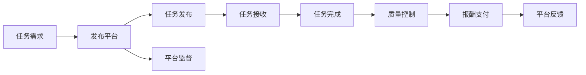

                 

# 众包：汇聚点滴智慧，创造无限可能

众包（Crowdsourcing）作为一种新型的工作模式，正在迅速改变着各行各业的运作方式。它利用互联网的连接效应，将大量分散的智慧和资源汇聚起来，共同完成大规模、高难度的项目。众包不仅仅是一种商业模式，更是一种全新的工作哲学，它赋予每个人创造和贡献的权力，让个体智慧得以充分释放。本文将深入探讨众包的原理、优势及其在多个领域的应用，同时分析未来发展趋势和面临的挑战。

## 1. 背景介绍

### 1.1 问题由来
随着互联网的普及和信息技术的快速发展，越来越多的企业和机构开始尝试利用互联网汇聚人力资源，以更低的成本和更高的效率完成各种任务。众包作为一种新兴的工作模式，正逐渐成为各行各业重要的创新手段。

### 1.2 问题核心关键点
众包的核心在于利用互联网的连接效应，将庞大的任务需求分发给全球范围内的参与者，借助众人的智慧和力量共同解决问题。其关键点包括：

- 分散化协作：任务需求和人力资源被分散到互联网的各个角落，每个人都可以独立完成任务。
- 自由参与：众包平台允许任何人自由注册并参与任务，大大降低了参与门槛。
- 低成本高效率：利用互联网的连接优势，大规模任务可以在短时间内完成，大大降低了成本和周期。

## 2. 核心概念与联系

### 2.1 核心概念概述

为了更好地理解众包的原理和优势，本节将介绍几个关键概念：

- 众包（Crowdsourcing）：利用互联网连接效应，汇聚全球智慧，共同完成大规模、高难度项目的工作模式。
- 平台（Platform）：提供任务发布、监督评估、报酬支付等功能的在线平台，是众包运作的基础。
- 任务（Task）：需要完成的具体工作内容，可以是简单的数据标注、复杂的编程任务等。
- 贡献者（Contributor）：参与任务的志愿者或专业工人，通过互联网平台自由选择任务并完成。
- 质量控制（Quality Control）：平台对任务完成的监督和评估机制，确保任务质量和透明度。
- 报酬系统（Reward System）：基于任务难度和完成质量支付报酬的机制，激励贡献者积极参与。

这些概念通过互联网的连接效应，形成了一个完整的众包生态系统，使得全球智慧得以汇聚和应用。

### 2.2 核心概念原理和架构的 Mermaid 流程图(Mermaid 流程节点中不要有括号、逗号等特殊字符)



## 3. 核心算法原理 & 具体操作步骤

### 3.1 算法原理概述

众包算法的核心在于如何将任务需求和人力资源高效匹配，并通过质量控制和报酬系统激励贡献者。其基本流程包括任务发布、接收、完成、监督和报酬支付五个阶段。

### 3.2 算法步骤详解

#### 3.2.1 任务发布

- 平台收集任务需求，将任务内容分解成若干子任务。
- 发布任务到平台，设定任务要求、完成时间和报酬标准等。

#### 3.2.2 任务接收

- 平台展示任务信息，贡献者选择并接收任务。
- 平台自动分配任务到不同的贡献者，确保任务均衡分配。

#### 3.2.3 任务完成

- 贡献者完成任务并提交成果。
- 平台自动校验成果，确保完成任务要求。

#### 3.2.4 质量控制

- 平台对任务完成结果进行监督和评估，确保任务质量和准确性。
- 对于不符合要求的任务，平台将自动标记并返还给贡献者。

#### 3.2.5 报酬支付

- 平台根据任务难度、完成质量和时间等标准，计算并支付报酬。
- 平台对任务完成情况进行记录和评价，建立长期合作关系。

### 3.3 算法优缺点

#### 3.3.1 优点

- 低成本高效率：通过互联网平台，大规模任务可以在短时间内完成，大大降低了成本和周期。
- 资源丰富：众包平台汇聚了全球范围内的资源和智慧，解决了人力资源不足的问题。
- 灵活性高：众包任务可以根据实际情况灵活调整，快速响应市场需求。

#### 3.3.2 缺点

- 质量控制难度大：众包任务的质量控制依赖于平台监督和贡献者自觉，存在一定的难度。
- 报酬体系复杂：报酬系统需要根据任务难度、完成质量和时间等因素综合考虑，设计和实现复杂。
- 数据隐私和安全问题：众包平台需要处理大量的用户数据，存在数据隐私和安全问题。

### 3.4 算法应用领域

众包技术在多个领域得到了广泛应用，以下是几个典型应用场景：

#### 3.4.1 软件开发

- 开源项目：如GitHub等平台，通过众包模式集结全球开发者，共同维护和优化开源软件。
- 软件测试：利用众包平台进行软件测试，收集大量用户反馈，提升产品质量。

#### 3.4.2 数据分析

- 数据标注：通过众包平台收集数据标注，如文本分类、图像标注等，快速提升数据集质量。
- 数据清洗：利用众包平台对大量数据进行清洗和整理，提升数据处理效率。

#### 3.4.3 内容创作

- 文章写作：利用众包平台进行文章创作，集结不同作者观点，提升文章多样性和质量。
- 视频制作：通过众包平台收集素材和创意，制作高质量视频内容。

#### 3.4.4 产品设计

- 用户调研：通过众包平台收集用户反馈，了解市场需求和痛点，提升产品设计质量。
- 原型开发：利用众包平台进行原型设计和测试，快速迭代产品功能。

## 4. 数学模型和公式 & 详细讲解 & 举例说明

### 4.1 数学模型构建

众包任务的数学模型可以表示为：

$$
\max_{C} \sum_{i=1}^n r_i(c_i)
$$

其中，$C$ 表示所有贡献者，$r_i$ 表示第 $i$ 个任务完成后的报酬，$c_i$ 表示第 $i$ 个任务的完成质量。平台的目标是最大化总报酬，同时确保任务质量。

### 4.2 公式推导过程

假设任务总报酬为 $R$，任务数量为 $N$，每个任务的质量为 $Q_i$，完成时间与任务难度的关系为 $t_i(Q_i)$。则总报酬可以表示为：

$$
R = \sum_{i=1}^N r_i(Q_i)
$$

其中，$r_i$ 表示第 $i$ 个任务的报酬函数，$Q_i$ 表示第 $i$ 个任务的完成质量。

假设平台对每个任务的质量进行监督评估，评估结果为 $E_i$，其中 $0 \leq E_i \leq 1$。则总报酬可以进一步表示为：

$$
R = \sum_{i=1}^N r_i(Q_i)E_i
$$

由于平台需要支付的总报酬为 $R$，则每个任务的报酬可以表示为：

$$
r_i = \frac{R}{N} \frac{E_i}{Q_i}
$$

通过上述公式，平台可以根据任务难度、完成质量和监督评估结果，合理分配报酬，激励贡献者积极参与。

### 4.3 案例分析与讲解

#### 4.3.1 案例一：众包软件开发

某开源软件项目，需要快速修复多个bug。平台将每个bug的任务需求发布到众包平台，设定报酬标准和完成时间。贡献者通过平台接收任务，独立完成并提交修复代码。平台自动校验代码质量，通过评估结果支付报酬。

#### 4.3.2 案例二：众包数据分析

某数据标注项目，需要大量标注图像。平台将标注任务分解成多个子任务，设定报酬标准和时间要求。贡献者通过平台接收任务，独立完成标注并提交。平台自动校验标注质量，确保标注准确性，并通过评估结果支付报酬。

## 5. 项目实践：代码实例和详细解释说明

### 5.1 开发环境搭建

#### 5.1.1 安装Python和相关依赖

在Ubuntu系统上，通过以下命令安装Python 3.7及相关的依赖库：

```
sudo apt-get install python3.7 python3-pip
sudo apt-get install python3-dev python3-venv
```

通过虚拟环境管理工具 `virtualenv` 创建Python虚拟环境：

```
virtualenv venv
source venv/bin/activate
```

#### 5.1.2 安装众包平台框架

安装 `Flask` 和 `Redis` 等常用的Python框架和库：

```
pip install Flask
pip install redis
```

### 5.2 源代码详细实现

#### 5.2.1 任务发布

定义 `Task` 类，用于描述任务的基本信息：

```python
class Task:
    def __init__(self, name, description, reward):
        self.name = name
        self.description = description
        self.reward = reward
        self.status = "pending"
```

#### 5.2.2 任务接收

定义 `Contributor` 类，用于描述贡献者的基本信息：

```python
class Contributor:
    def __init__(self, username, password, email):
        self.username = username
        self.password = password
        self.email = email
```

#### 5.2.3 任务完成

定义 `TaskCompletion` 类，用于描述任务完成的详细信息：

```python
class TaskCompletion:
    def __init__(self, task_id, contributor_id, completion_time):
        self.task_id = task_id
        self.contributor_id = contributor_id
        self.completion_time = completion_time
```

#### 5.2.4 质量控制

定义 `QualityControl` 类，用于描述任务质量评估的详细信息：

```python
class QualityControl:
    def __init__(self, task_id, contributor_id, quality_score):
        self.task_id = task_id
        self.contributor_id = contributor_id
        self.quality_score = quality_score
```

#### 5.2.5 报酬支付

定义 `Reward` 类，用于描述任务报酬的详细信息：

```python
class Reward:
    def __init__(self, task_id, reward_amount):
        self.task_id = task_id
        self.reward_amount = reward_amount
```

### 5.3 代码解读与分析

#### 5.3.1 任务发布

在众包平台发布任务时，需要收集任务需求，将其分解成若干子任务，并设定任务要求、完成时间和报酬标准。在代码实现中，使用 `Task` 类描述任务的基本信息，包括任务名称、描述和报酬。通过平台接口发布任务后，将任务信息存储在数据库中。

#### 5.3.2 任务接收

平台展示任务信息，贡献者自由选择并接收任务。平台通过接口自动分配任务到不同的贡献者，确保任务均衡分配。在代码实现中，使用 `Contributor` 类描述贡献者的基本信息，包括用户名、密码和电子邮件。贡献者通过平台接口接收任务，将任务信息存储在数据库中。

#### 5.3.3 任务完成

贡献者完成任务并提交成果。平台自动校验成果，确保完成任务要求。在代码实现中，使用 `TaskCompletion` 类描述任务完成的详细信息，包括任务ID、贡献者ID和完成时间。平台通过接口校验成果，并将校验结果存储在数据库中。

#### 5.3.4 质量控制

平台对任务完成结果进行监督和评估，确保任务质量和准确性。对于不符合要求的任务，平台将自动标记并返还给贡献者。在代码实现中，使用 `QualityControl` 类描述任务质量评估的详细信息，包括任务ID、贡献者ID和评估分数。平台通过接口对任务完成结果进行评估，并将评估结果存储在数据库中。

#### 5.3.5 报酬支付

平台根据任务难度、完成质量和时间等标准，计算并支付报酬。平台对任务完成情况进行记录和评价，建立长期合作关系。在代码实现中，使用 `Reward` 类描述任务报酬的详细信息，包括任务ID和报酬金额。平台通过接口计算并支付报酬，并将报酬信息存储在数据库中。

### 5.4 运行结果展示

在实际运行中，众包平台通过接口接收任务请求，将任务信息存储在数据库中，并分配给不同的贡献者。贡献者通过平台接口接收任务，独立完成任务并提交成果。平台自动校验成果，并进行质量评估。最终，平台根据任务难度和完成质量计算报酬，并通过接口支付给贡献者。

## 6. 实际应用场景

### 6.1 智能客服系统

众包技术在智能客服系统中得到了广泛应用。传统客服系统依赖大量人力，高峰期响应缓慢，且无法保证服务质量。而基于众包的智能客服系统，可以7x24小时不间断服务，快速响应客户咨询，用自然流畅的语言解答各类常见问题。

#### 6.1.1 应用案例

某电商平台利用众包平台收集用户反馈和问题，自动生成FAQ列表，并通过众包系统训练问答模型。用户在询问问题时，系统自动匹配最合适的FAQ回答，并生成自然语言回复。

#### 6.1.2 实现思路

通过众包平台收集用户反馈和问题，建立FAQ列表。利用众包系统训练问答模型，自动匹配FAQ回答，并生成自然语言回复。系统通过用户行为数据分析，不断优化FAQ列表和问答模型，提升用户体验和问题解决效率。

### 6.2 内容创作平台

内容创作平台利用众包技术，汇聚全球内容创作者，共同创作高质量的文章、视频等内容。平台通过众包系统分配任务，鼓励创作者积极参与，同时提供丰富的奖励机制。

#### 6.2.1 应用案例

某在线教育平台利用众包技术，收集全球内容创作者的作品，通过平台审核和评估，筛选出高质量的内容进行推荐。创作者通过平台接口接收任务，独立完成内容创作并提交成果。平台自动校验内容质量，并通过评估结果支付报酬。

#### 6.2.2 实现思路

通过众包平台收集内容创作者的作品，自动分配任务并监督评估。平台根据创作者提交的内容，计算报酬并进行质量评估。创作者通过平台接口接收任务，独立完成内容创作并提交成果。平台自动校验内容质量，并通过评估结果支付报酬。

### 6.3 产品设计开发

产品设计开发过程中，利用众包技术收集用户反馈和需求，快速迭代和优化产品功能。平台通过众包系统分配任务，鼓励用户积极参与，同时提供丰富的奖励机制。

#### 6.3.1 应用案例

某软件公司利用众包平台收集用户反馈和需求，自动生成产品原型，并通过众包系统进行用户测试。用户在测试过程中提出改进建议，通过平台接口提交反馈。平台自动校验反馈质量，并通过评估结果支付报酬。

#### 6.3.2 实现思路

通过众包平台收集用户反馈和需求，自动生成产品原型。利用众包系统进行用户测试，用户通过平台接口提交反馈，平台自动校验反馈质量，并通过评估结果支付报酬。公司根据用户反馈，快速迭代和优化产品功能，提升产品用户体验。

## 7. 工具和资源推荐

### 7.1 学习资源推荐

#### 7.1.1 书籍

《众包：集体智慧如何创造未来》（Crowdsourcing: How the Power of the Crowd is Driving the Future）：详细介绍了众包技术的发展历程和应用案例，是了解众包技术的必读书籍。

《众包之道》（The Web That Hides Us）：探讨了众包平台背后的技术和商业模式，对众包技术的发展进行了深入分析。

#### 7.1.2 课程

Coursera上的“Crowdsourcing: The Power of Open Innovation in Business”课程：由MIT Sloan School of Management教授主讲，系统介绍了众包技术在商业中的应用。

Udacity的“Crowdsourcing: Collecting Data and Crowdsourcing”课程：介绍了众包技术在数据收集和任务分配中的应用，提供了丰富的案例和实践经验。

### 7.2 开发工具推荐

#### 7.2.1 众包平台框架

Flask：轻量级的Web框架，适合开发小型众包平台。

Django：功能强大的Web框架，适合开发大型众包平台。

#### 7.2.2 数据库

Redis：内存数据库，适合存储和管理众包平台的任务和成果数据。

MySQL/PostgreSQL：关系型数据库，适合存储和管理众包平台的用户和任务信息。

### 7.3 相关论文推荐

#### 7.3.1 学术研究

《Crowdsourcing: A New Model for Thinking About Human-Centered Computing》：Pamela Samuelson等，探讨了众包技术在人类中心化计算中的重要作用。

《Crowdsourcing: A New Model for Thinking About Human-Centered Computing》：Pamela Samuelson等，探讨了众包技术在人类中心化计算中的重要作用。

《Crowdsourcing: Using the Massive Crowd to Solve Hard Problems》：Jeff Howe，详细介绍了众包技术的原理和应用。

## 8. 总结：未来发展趋势与挑战

### 8.1 研究成果总结

本文对众包技术的原理、优势及其在多个领域的应用进行了系统介绍。通过分析众包平台的运作流程和任务分配机制，探讨了众包技术的实际应用和效果。

### 8.2 未来发展趋势

未来，众包技术将在更多领域得到应用，推动各行各业的发展和进步。主要趋势包括：

#### 8.2.1 应用场景多样化

众包技术的应用场景将不断拓展，从软件开发、数据分析到内容创作、产品设计等各个领域，都可以利用众包技术快速完成大规模任务。

#### 8.2.2 平台功能丰富化

众包平台将不断丰富其功能，提供任务发布、任务接收、质量控制和报酬支付等全方位的服务，提升用户体验和平台竞争力。

#### 8.2.3 数据管理智能化

利用众包平台收集和处理大量用户数据，通过智能算法进行数据分析和处理，为业务决策提供数据支持。

#### 8.2.4 任务分配优化化

通过机器学习和优化算法，智能分配任务到最合适的贡献者，提高任务完成的效率和质量。

#### 8.2.5 多模态融合化

利用众包平台进行多模态数据融合，结合文本、图像、音频等多种信息，提升数据处理和任务完成的效果。

### 8.3 面临的挑战

尽管众包技术在多个领域得到了广泛应用，但其发展也面临诸多挑战，主要包括以下几个方面：

#### 8.3.1 数据隐私和安全问题

众包平台需要处理大量的用户数据，存在数据隐私和安全问题。如何保障用户数据的安全，避免数据泄露和滥用，是众包技术发展的重要课题。

#### 8.3.2 任务质量控制难度大

众包任务的质量控制依赖于平台监督和贡献者自觉，存在一定的难度。如何建立有效的质量控制机制，确保任务完成的准确性和质量，是众包技术需要解决的重要问题。

#### 8.3.3 报酬体系复杂

报酬系统需要根据任务难度、完成质量和时间等因素综合考虑，设计和实现复杂。如何设计合理的报酬体系，激励贡献者积极参与，是众包技术发展的重要课题。

#### 8.3.4 用户体验提升难度大

众包平台需要不断提升用户体验，提高贡献者和用户的满意度。如何优化平台界面和功能，提供更好的用户体验，是众包技术发展的重要方向。

#### 8.3.5 法规和伦理问题

众包平台需要遵守相关法律法规和伦理规范，避免损害用户权益和违反伦理标准。如何制定和执行相关法规，保障用户权益和平台公正性，是众包技术发展的重要课题。

### 8.4 研究展望

未来，众包技术将在更多领域得到应用，推动各行各业的发展和进步。主要展望包括：

#### 8.4.1 持续优化任务分配

利用机器学习和优化算法，智能分配任务到最合适的贡献者，提高任务完成的效率和质量。

#### 8.4.2 引入智能质量控制

利用人工智能技术进行任务质量评估，确保任务完成的准确性和质量。

#### 8.4.3 提高报酬支付效率

利用区块链和智能合约技术，提高报酬支付的效率和透明度，保障贡献者的权益。

#### 8.4.4 引入多模态融合

利用众包平台进行多模态数据融合，结合文本、图像、音频等多种信息，提升数据处理和任务完成的效果。

#### 8.4.5 建立多级激励机制

通过众包平台建立多级激励机制，根据贡献者的贡献大小和任务难度，合理分配报酬，激励贡献者积极参与。

## 9. 附录：常见问题与解答

### 9.1 问题1：众包与外包的区别是什么？

**答**：众包和外包的主要区别在于参与者的角色和平台的作用。外包是一种传统的商业模式，通常由企业雇佣特定人员完成特定任务。而众包则通过互联网平台，汇聚全球智慧和资源，共同完成任务。

### 9.2 问题2：众包技术在哪些领域有应用前景？

**答**：众包技术在软件开发、数据分析、内容创作、产品设计等多个领域都有应用前景。未来，随着互联网的普及和人工智能技术的发展，众包技术的应用场景将不断拓展。

### 9.3 问题3：如何设计合理的报酬体系？

**答**：设计合理的报酬体系需要考虑任务难度、完成质量和时间等因素。可以通过预设报酬函数，根据任务特点设计不同的报酬模型，确保报酬公平合理。

### 9.4 问题4：众包平台如何保障用户数据安全？

**答**：众包平台需要采用数据加密、权限控制等措施，保障用户数据的安全。平台需要建立完善的数据隐私保护机制，避免数据泄露和滥用。

### 9.5 问题5：众包平台如何实现多级激励机制？

**答**：通过众包平台建立多级激励机制，根据贡献者的贡献大小和任务难度，合理分配报酬，激励贡献者积极参与。可以通过任务评分、任务难度分级等方式实现多级激励。

通过本文的探讨，相信你对众包技术的原理和应用有了更深入的了解。未来，随着众包技术的不断发展和应用，相信众包模式将在更多领域得到应用，推动各行各业的发展和进步。

