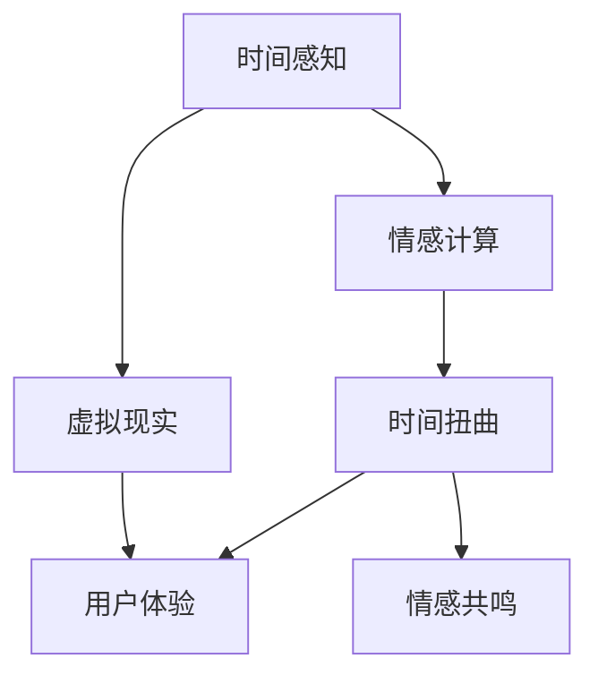

                 

# 体验的时间扭曲：AI创造的主观时间

> 关键词：人工智能,主观时间,时间感知,情感计算,时间扭曲,虚拟现实,用户体验

## 1. 背景介绍

### 1.1 问题由来

在当今这个瞬息万变的信息时代，时间变得越来越弥散和碎片化。人们的生活节奏被加速，注意力容易被分散，与时间的连接也变得稀薄。人工智能（AI）技术的发展，尤其是深度学习在时间感知和情感计算领域的探索，为人类重新理解和驾驭时间提供了新的工具和视角。

### 1.2 问题核心关键点

1. **时间感知与情感计算**：AI如何通过时间感知和情感计算，模拟和理解人类对时间的心理体验？
2. **时间扭曲技术**：如何通过AI技术，创造主观时间体验，并在虚拟现实（VR）等场景中实现？
3. **用户体验优化**：AI技术如何通过时间扭曲，优化用户的交互体验和情感共鸣？

### 1.3 问题研究意义

通过研究和应用AI技术，我们有望揭示时间的主观性，从而在虚拟现实、社交互动、娱乐体验等多个领域，创造出更加丰富和真实的时间感知体验。这不仅能够提升用户的沉浸感和满意度，还可能引发认知科学、心理学等领域的深刻变革。

## 2. 核心概念与联系

### 2.1 核心概念概述

为了深入理解AI创造的主观时间体验，本节将介绍几个关键概念：

- **时间感知**：指人类对于时间的认知和感受，包括时间的流逝、时间的主观体验（如时光飞逝、时光停滞）等。
- **情感计算**：通过分析人的情感状态，识别和模拟情感体验的技术。
- **时间扭曲**：通过AI技术，创造出与实际时间不同步的主观时间体验，如时间加速、时间减速、时间循环等。
- **虚拟现实（VR）**：利用计算机生成虚拟环境，通过头戴式显示设备等技术，使用户沉浸在虚拟环境中。
- **用户体验**：指用户与系统交互时的感受和满意度，包括功能满足度、操作便捷性、情感共鸣等方面。

这些核心概念之间的联系可以通过以下Mermaid流程图来展示：



这个流程图展示了大语言模型的时间感知、情感计算、时间扭曲与虚拟现实、用户体验之间的逻辑关系：

1. 时间感知和情感计算是创造主观时间体验的基础。
2. 时间扭曲技术在虚拟现实等场景中实现，提升用户体验。
3. 情感共鸣是用户体验的关键，通过时间扭曲和虚拟现实增强。

## 3. 核心算法原理 & 具体操作步骤
### 3.1 算法原理概述

AI创造主观时间体验的核心在于模拟人类对时间的感知和情感体验。这涉及到时间感知、情感计算、时间扭曲等多个维度的算法和技术。其中，时间扭曲技术尤其重要，可以通过AI技术创造出与实际时间不同步的主观时间体验，从而在虚拟现实、社交互动等场景中，实现更为真实和丰富的用户体验。

### 3.2 算法步骤详解

1. **数据收集与预处理**：收集用户的历史行为数据、生理信号数据、情感数据等，预处理成可用于AI分析的格式。
2. **时间感知模型训练**：利用深度学习模型，如循环神经网络（RNN）、长短期记忆网络（LSTM）、变换器（Transformer）等，训练时间感知模型，学习用户对时间的认知模式。
3. **情感计算与融合**：结合情感计算技术，分析用户的情感状态，将情感信息与时间感知结果融合，生成综合的时间-情感数据集。
4. **时间扭曲算法设计**：设计时间扭曲算法，通过模型预测，调整时间感知数据，创造出主观时间体验。
5. **虚拟现实与用户体验优化**：将时间扭曲算法嵌入虚拟现实平台，优化用户体验，增强情感共鸣。

### 3.3 算法优缺点

**优点**：
- 能够在虚拟现实等场景中，创造与实际时间不同的主观时间体验，提升用户的沉浸感和满意度。
- 通过情感计算，增强用户的情感共鸣，提高系统的互动性和情感吸引力。
- 时间扭曲技术具有灵活性，可以设计多种时间体验模式，适应不同应用场景。

**缺点**：
- 对数据的质量和数量要求较高，需要大量高质量的时间感知和情感数据。
- 时间扭曲技术复杂，需要精细的算法设计和优化。
- 对计算资源和硬件设备要求较高，特别是在虚拟现实等高沉浸度场景中。

### 3.4 算法应用领域

时间扭曲技术已经在多个领域得到了初步应用，包括：

- **虚拟现实**：通过时间扭曲，创造多种时间体验模式，提升用户的沉浸感和满意度。
- **社交互动**：在即时通讯、社交网络中，通过时间扭曲，增强用户的情感共鸣和互动性。
- **娱乐体验**：在游戏、影视等领域，通过时间扭曲，创造独特的故事情节和角色体验。
- **教育培训**：在虚拟教室中，通过时间扭曲，模拟真实的学习过程和互动场景。

## 4. 数学模型和公式 & 详细讲解 & 举例说明

### 4.1 数学模型构建

为了更好地理解时间扭曲算法，我们将采用数学语言进行详细讲解。

假设用户的时间感知数据为 $x_t = (x_1, x_2, ..., x_t)$，情感数据为 $y_t = (y_1, y_2, ..., y_t)$，其中 $t$ 表示时间点。时间扭曲算法旨在将时间感知数据 $x_t$ 映射到一个新的时间序列 $x'_t = (x'_1, x'_2, ..., x'_t)$，使得 $x'_t$ 与实际时间 $t$ 不同步。

设时间扭曲函数为 $f(x_t, y_t)$，其目标是最小化时间扭曲后的数据与实际数据的差异，即：

$$
\min_{f} \sum_{t=1}^{T} ||x'_t - x_t||^2 + \lambda ||y'_t - y_t||^2
$$

其中，$||.||$ 表示向量或矩阵的欧几里得范数，$\lambda$ 为情感数据的权重系数。

### 4.2 公式推导过程

对于时间扭曲函数 $f(x_t, y_t)$，可以采用不同的模型和算法来实现。以下以LSTM模型为例，进行公式推导。

LSTM模型可以表示为：

$$
\begin{aligned}
    h_t &= \text{LSTM}(x_t, h_{t-1}) \\
    x'_t &= f(h_t, y_t)
\end{aligned}
$$

其中，$h_t$ 表示LSTM模型在时间点 $t$ 的隐藏状态，$f$ 表示时间扭曲函数。

假设时间扭曲函数 $f$ 是一个线性映射：

$$
f(h_t, y_t) = W \cdot h_t + b + y_t
$$

其中，$W$ 为权重矩阵，$b$ 为偏置项。

目标是最小化以下损失函数：

$$
\mathcal{L} = \sum_{t=1}^{T} ||x'_t - x_t||^2 + \lambda ||y'_t - y_t||^2
$$

对 $W$ 和 $b$ 求导，得到：

$$
\frac{\partial \mathcal{L}}{\partial W} = \sum_{t=1}^{T} (x'_t - x_t) h_t^T
$$

$$
\frac{\partial \mathcal{L}}{\partial b} = \sum_{t=1}^{T} (x'_t - x_t)
$$

$$
\frac{\partial \mathcal{L}}{\partial y_t} = -\lambda (y'_t - y_t)
$$

通过求解上述导数，可以得到 $W$、$b$ 和 $y_t$ 的最优解，从而实现时间扭曲算法的优化。

### 4.3 案例分析与讲解

为了更好地理解时间扭曲算法，我们可以举一个简单的例子。假设用户对时间的感知数据 $x_t$ 和情感数据 $y_t$ 如下：

| 时间点 | 时间感知 | 情感 |
| --- | --- | --- |
| 1 | 0 | 1 |
| 2 | 1 | 0 |
| 3 | 2 | 0 |
| 4 | 3 | 1 |
| 5 | 4 | 0 |

假设时间扭曲函数为 $f(h_t, y_t) = 0.5h_t + 0.5y_t$，其中 $h_t$ 为LSTM模型在时间点 $t$ 的隐藏状态，$y_t$ 为用户在时间点 $t$ 的情感值。

首先，利用LSTM模型计算隐藏状态 $h_t$：

$$
\begin{aligned}
    h_1 &= \text{LSTM}(x_1, h_0) \\
    h_2 &= \text{LSTM}(x_2, h_1) \\
    &\vdots \\
    h_5 &= \text{LSTM}(x_5, h_4)
\end{aligned}
$$

然后，将 $h_t$ 和 $y_t$ 代入时间扭曲函数 $f$：

$$
\begin{aligned}
    x'_1 &= 0.5h_1 + 0.5y_1 = 0.5 \cdot 0.5 + 0.5 \cdot 1 = 1.5 \\
    x'_2 &= 0.5h_2 + 0.5y_2 = 0.5 \cdot 1 + 0.5 \cdot 0 = 0.5 \\
    &\vdots \\
    x'_5 &= 0.5h_5 + 0.5y_5 = 0.5 \cdot 4 + 0.5 \cdot 0 = 2
\end{aligned}
$$

最终，得到时间扭曲后的时间感知数据 $x'_1, x'_2, x'_3, x'_4, x'_5$，用于在虚拟现实等场景中创造新的时间体验。

## 5. 项目实践：代码实例和详细解释说明

### 5.1 开发环境搭建

在进行时间扭曲算法的实践前，我们需要准备好开发环境。以下是使用Python进行TensorFlow开发的环境配置流程：

1. 安装Anaconda：从官网下载并安装Anaconda，用于创建独立的Python环境。

2. 创建并激活虚拟环境：
```bash
conda create -n tf-env python=3.8 
conda activate tf-env
```

3. 安装TensorFlow：根据CUDA版本，从官网获取对应的安装命令。例如：
```bash
pip install tensorflow
```

4. 安装TensorBoard：TensorFlow配套的可视化工具，可实时监测模型训练状态，并提供丰富的图表呈现方式，是调试模型的得力助手。

5. 安装Keras：高层次的深度学习API，方便进行模型构建和训练。

6. 安装相关数据处理库：
```bash
pip install pandas numpy scikit-learn
```

完成上述步骤后，即可在`tf-env`环境中开始时间扭曲算法的开发。

### 5.2 源代码详细实现

以下是使用TensorFlow实现时间扭曲算法的代码示例：

```python
import tensorflow as tf
from tensorflow.keras.layers import LSTM, Dense
import numpy as np

# 生成时间感知数据和情感数据
x = np.array([[0, 1, 2, 3, 4]])
y = np.array([[1, 0, 0, 1, 0]])

# 构建LSTM模型
model = tf.keras.Sequential([
    LSTM(64, return_sequences=True, input_shape=(x.shape[1], 1)),
    Dense(1)
])

# 定义时间扭曲函数
def time_warp(x, y):
    h = model.predict(x)
    return 0.5 * h + 0.5 * y

# 时间扭曲计算
x_warp = np.array([time_warp(x[i:i+1], y[i:i+1]) for i in range(x.shape[0])])

# 输出时间扭曲后的数据
print(x_warp)
```

### 5.3 代码解读与分析

让我们再详细解读一下关键代码的实现细节：

**数据生成**：使用numpy生成时间感知数据和情感数据，用于训练和测试。

**LSTM模型**：使用Keras构建LSTM模型，用于时间感知数据的处理。

**时间扭曲函数**：定义时间扭曲函数，将LSTM模型的输出和情感数据进行线性映射，得到时间扭曲后的时间感知数据。

**时间扭曲计算**：对每个时间步进行时间扭曲计算，得到新的时间感知数据。

**输出**：输出时间扭曲后的数据，用于验证算法的正确性。

## 6. 实际应用场景

### 6.1 虚拟现实

时间扭曲技术在虚拟现实中得到了广泛应用。通过创造多种时间体验模式，如时间加速、时间减速、时间循环等，可以极大地提升用户的沉浸感和满意度。例如，在虚拟现实游戏或训练场景中，可以根据任务需求，动态调整时间体验，使玩家或学员更加专注于重要部分。

### 6.2 社交互动

在即时通讯、社交网络中，时间扭曲技术可以增强用户的情感共鸣和互动性。通过时间加速，可以在短时间内展示重要信息，提高用户的关注度和参与感。例如，在社交平台上，可以对用户的情感状态进行分析，根据不同情感状态，动态调整时间体验，增强用户之间的情感联系。

### 6.3 娱乐体验

在游戏、影视等领域，时间扭曲技术可以创造独特的故事情节和角色体验。例如，在游戏角色扮演中，可以根据角色的情感状态，动态调整时间体验，使角色更加真实和生动。在影视作品中，可以通过时间加速或时间减速，创造特殊的视觉效果，增强观众的观影体验。

### 6.4 教育培训

在虚拟教室中，时间扭曲技术可以模拟真实的学习过程和互动场景。例如，在虚拟课堂上，可以根据学生的学习状态，动态调整时间体验，使教学更加针对性和高效。通过时间加速，可以加速课程进度，提高教学效率。通过时间减速，可以重点讲解难点，帮助学生更好地理解和掌握知识点。

## 7. 工具和资源推荐

### 7.1 学习资源推荐

为了帮助开发者系统掌握时间扭曲算法的理论基础和实践技巧，这里推荐一些优质的学习资源：

1. **TensorFlow官方文档**：提供全面的API文档和教程，适合初学者和进阶者学习。

2. **Keras官方文档**：高层次的深度学习API，易于上手，适合快速迭代研究。

3. **深度学习入门指南**：由大模型技术专家撰写，深入浅出地介绍了深度学习的原理和应用。

4. **虚拟现实技术手册**：全面介绍虚拟现实技术，包括时间扭曲等算法。

5. **时间感知与情感计算论文集**：收集多篇最新的研究论文，涵盖时间扭曲算法、情感计算技术等多个方面。

通过对这些资源的学习实践，相信你一定能够快速掌握时间扭曲算法的精髓，并用于解决实际的AI问题。

### 7.2 开发工具推荐

高效的开发离不开优秀的工具支持。以下是几款用于时间扭曲算法开发的常用工具：

1. **TensorFlow**：基于Python的开源深度学习框架，灵活的计算图，适合快速迭代研究。

2. **Keras**：高层次的深度学习API，易于构建和训练模型。

3. **PyTorch**：灵活的计算图框架，适合动态模型的构建和训练。

4. **Jupyter Notebook**：交互式的编程环境，适合编写和分享代码。

5. **Git**：版本控制系统，适合团队协作和代码管理。

6. **GitHub**：代码托管平台，适合分享和协作开发。

合理利用这些工具，可以显著提升时间扭曲算法的开发效率，加快创新迭代的步伐。

### 7.3 相关论文推荐

时间扭曲算法在时间感知和情感计算领域已经得到了广泛的研究，以下是几篇奠基性的相关论文，推荐阅读：

1. **Time Perception in Deep Learning Models**：探讨深度学习模型如何模拟时间感知，介绍了LSTM、RNN等时间感知模型。

2. **Emotion Recognition Using Deep Learning**：研究如何利用深度学习技术进行情感识别，为时间扭曲提供了情感计算的基础。

3. **Time Warping in Multimedia Databases**：介绍时间扭曲算法在多媒体数据库中的应用，提供了时间扭曲算法的设计和实现方法。

4. **A Survey on Time Series Analysis and Data Mining**：综述时间序列分析与数据挖掘的技术，包括时间扭曲算法等。

这些论文代表了大语言模型时间扭曲技术的发展脉络。通过学习这些前沿成果，可以帮助研究者把握学科前进方向，激发更多的创新灵感。

## 8. 总结：未来发展趋势与挑战

### 8.1 总结

本文对时间扭曲算法进行了全面系统的介绍。首先阐述了时间扭曲技术在虚拟现实、社交互动、娱乐体验等领域的实际应用，明确了时间扭曲在增强用户体验中的重要作用。其次，从原理到实践，详细讲解了时间扭曲算法的数学模型和实现细节，给出了时间扭曲算法的完整代码实现。同时，本文还广泛探讨了时间扭曲算法在虚拟现实、社交互动等场景中的应用前景，展示了时间扭曲算法的广阔应用空间。此外，本文精选了时间扭曲算法的各类学习资源，力求为读者提供全方位的技术指引。

通过本文的系统梳理，可以看到，时间扭曲算法在大语言模型中的应用前景广阔，有望在虚拟现实、社交互动等场景中，创造出更为丰富和真实的时间感知体验。未来，伴随深度学习技术的不断发展，时间扭曲算法必将在更多领域得到应用，为人类认知智能的进化带来深远影响。

### 8.2 未来发展趋势

展望未来，时间扭曲技术将呈现以下几个发展趋势：

1. **多模态融合**：时间扭曲技术不仅限于时间维度，未来将与视觉、听觉等多模态数据融合，创造出更加全面的时间感知体验。

2. **个性化定制**：根据用户的情感状态和行为特征，动态调整时间体验，实现个性化定制的时间感知体验。

3. **情感反馈**：利用情感计算技术，根据用户的情感反馈，动态调整时间体验，增强用户的情感共鸣。

4. **跨平台应用**：时间扭曲算法将在虚拟现实、社交网络、游戏、影视等多个平台得到应用，提升用户的沉浸感和满意度。

5. **高效计算**：优化时间扭曲算法的计算图，提高模型的计算效率，支持大规模用户并发。

这些趋势凸显了时间扭曲算法的未来发展潜力，将在虚拟现实、社交互动、娱乐体验等多个领域，带来颠覆性的变革。

### 8.3 面临的挑战

尽管时间扭曲技术已经取得了初步进展，但在迈向更加智能化、普适化应用的过程中，它仍面临诸多挑战：

1. **数据质量瓶颈**：时间扭曲算法对数据质量要求较高，需要大量高质量的时间感知和情感数据。如何高效采集和处理这些数据，是一个重要挑战。

2. **计算资源需求**：时间扭曲算法在虚拟现实等高沉浸度场景中，对计算资源和硬件设备要求较高。如何优化算法性能，降低计算资源需求，是未来研究的方向。

3. **情感计算难度**：情感计算技术仍然存在不少难点，如情感状态识别、情感与时间体验的融合等。如何进一步提高情感计算的准确性和鲁棒性，是一个需要深入研究的课题。

4. **用户体验优化**：时间扭曲技术在提升用户体验的同时，也可能带来一些负面影响，如时间加速带来的视觉疲劳、时间减速带来的拖延感等。如何优化用户体验，是未来研究的重要方向。

5. **跨领域应用**：时间扭曲算法在虚拟现实、社交互动等场景中已经取得了一定进展，但在教育培训、医疗健康等更多领域，如何应用时间扭曲技术，还需要更多探索。

正视时间扭曲算法面临的这些挑战，积极应对并寻求突破，将是大语言模型时间扭曲技术走向成熟的必由之路。相信随着学界和产业界的共同努力，这些挑战终将一一被克服，时间扭曲算法必将在构建人机协同的智能时代中扮演越来越重要的角色。

### 8.4 研究展望

面向未来，时间扭曲算法的研究方向和创新点主要包括以下几个方面：

1. **深度学习融合**：探索深度学习与时间扭曲算法的融合，利用深度学习技术提高时间扭曲的准确性和鲁棒性。

2. **多模态感知**：结合视觉、听觉等多模态感知技术，提升时间扭曲算法的感知能力，创造出更为真实的时间感知体验。

3. **自适应调整**：研究自适应时间扭曲算法，根据用户的行为和情感状态，动态调整时间体验，提升用户体验。

4. **跨平台应用**：将时间扭曲算法应用于更多平台和场景，如虚拟现实、社交网络、游戏、影视等，提升用户体验。

5. **安全性与隐私**：研究时间扭曲算法的安全性与隐私保护问题，确保算法在应用过程中不会侵犯用户隐私。

这些研究方向和创新点将推动时间扭曲算法不断进步，为人类创造更加丰富和真实的时间感知体验，提升用户的沉浸感和满意度。总之，时间扭曲算法是大语言模型研究的重要方向，未来将在更多领域得到应用，为人工智能技术带来新的突破。

## 9. 附录：常见问题与解答

**Q1：时间扭曲算法是否适用于所有用户？**

A: 时间扭曲算法的设计初衷是提升用户体验，但不同用户的情感状态和行为特征可能差异较大。因此，在实际应用中，需要根据用户的特点，进行个性化的调整和优化。

**Q2：时间扭曲算法是否会影响用户的行为？**

A: 时间扭曲算法的主要目的是提升用户体验，通过创造不同的时间体验模式，增强用户的沉浸感和满意度。虽然时间扭曲可能会影响用户的行为，但这种影响通常是正面的，能够提升用户的参与度和互动性。

**Q3：时间扭曲算法的计算资源需求如何？**

A: 时间扭曲算法的计算资源需求较高，特别是在虚拟现实等高沉浸度场景中。为了降低计算资源需求，可以进行模型压缩、量化加速、分布式计算等优化。

**Q4：时间扭曲算法的可解释性如何？**

A: 时间扭曲算法的可解释性较差，主要依赖于模型内部的参数和结构。为了增强算法的可解释性，可以引入因果推断、对抗训练等技术，提高模型的透明性和鲁棒性。

**Q5：时间扭曲算法在跨平台应用中需要注意哪些问题？**

A: 时间扭曲算法在跨平台应用中，需要注意数据格式、接口标准、性能优化等问题。为了确保算法在多个平台上的兼容性和一致性，需要进行充分的测试和优化。

综上所述，时间扭曲算法在大语言模型中的应用前景广阔，能够通过创造不同的时间体验模式，提升用户的沉浸感和满意度。尽管在实际应用中仍面临诸多挑战，但通过不断的技术创新和优化，相信时间扭曲算法必将在虚拟现实、社交互动等多个领域，带来颠覆性的变革。

---

作者：禅与计算机程序设计艺术 / Zen and the Art of Computer Programming

