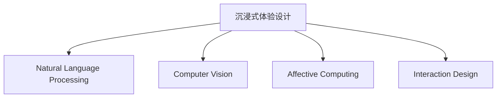

                 

# 体验设计的未来：AI驱动的沉浸式世界

> 关键词：体验设计,沉浸式技术,人工智能,交互设计,计算机图形学,自然语言处理,计算机视觉,情感计算

## 1. 背景介绍

随着科技的快速发展，人类对于体验设计的要求不断提升。从早期的文字交流、二维图像展示，到近期的交互式多媒体、虚拟现实，体验设计领域已经经历了多次质的飞跃。如今，随着人工智能（AI）技术的迅猛发展，一种全新的沉浸式体验设计正在悄然兴起，它以AI技术为核心，融合了计算机图形学、自然语言处理、计算机视觉、情感计算等前沿技术，为体验设计带来了革命性的变化。

### 1.1 问题由来
随着信息技术的不断进步，人们对于互动体验的期望值越来越高。传统的文字交流、图片展示等单一信息形式已经无法满足用户日益增长的需求，而沉浸式体验设计通过虚拟现实（VR）、增强现实（AR）、混合现实（MR）等技术，能够为用户带来更加丰富、真实、互动的体验。AI技术的融入，则进一步提升了沉浸式体验的智能化水平，使其更加符合用户的需求和期望。

### 1.2 问题核心关键点
沉浸式体验设计的核心在于如何利用AI技术，为用户提供身临其境的交互体验。具体而言，关键点包括：

- 如何通过AI技术，理解用户的意图和情感，提供个性化的互动体验。
- 如何利用自然语言处理、计算机视觉、情感计算等AI技术，构建智能化的互动场景。
- 如何优化用户体验，提升用户满意度和参与度。
- 如何保证沉浸式体验的安全性、可靠性和可访问性。

## 2. 核心概念与联系

### 2.1 核心概念概述

为了更好地理解AI驱动的沉浸式体验设计，本节将介绍几个核心概念：

- 沉浸式体验设计（Immersive Experience Design）：通过VR、AR、MR等技术，结合AI技术，为用户创造身临其境的互动体验。
- 自然语言处理（Natural Language Processing, NLP）：利用计算机处理和理解人类语言的技术，包括文本分析、机器翻译、情感识别等。
- 计算机视觉（Computer Vision）：利用计算机识别和理解图像和视频的技术，包括图像分类、目标检测、图像生成等。
- 情感计算（Affective Computing）：通过分析用户的行为和生理数据，识别和理解用户的情感状态，从而提供更智能的互动体验。
- 交互设计（Interaction Design）：设计用户与系统交互的方式，提高互动效率和用户体验。

这些核心概念之间的逻辑关系可以通过以下Mermaid流程图来展示：



这个流程图展示了几大核心概念及其之间的关系：

1. 沉浸式体验设计通过多种AI技术实现，包括NLP、CV、情感计算等。
2. 自然语言处理用于理解用户的语言输入和生成智能回复。
3. 计算机视觉用于识别和分析用户输入的图像和视频。
4. 情感计算用于理解用户的情感状态，提供更加个性化的互动体验。
5. 交互设计用于设计用户与系统互动的方式，提升用户体验。

## 3. 核心算法原理 & 具体操作步骤
### 3.1 算法原理概述

沉浸式体验设计融合了多种AI技术，其核心算法原理主要包括：

- 自然语言处理（NLP）：利用深度学习模型，如BERT、GPT等，对用户输入的自然语言进行语义理解和情感识别。
- 计算机视觉（CV）：通过卷积神经网络（CNN）、生成对抗网络（GAN）等模型，对用户输入的图像和视频进行识别和生成。
- 情感计算：通过机器学习模型，如支持向量机（SVM）、随机森林（RF）等，分析用户的生理数据（如心率、皮肤电等），识别其情感状态。
- 交互设计：通过用户行为分析，设计符合用户期望的互动流程和界面。

这些算法共同构成了沉浸式体验设计的基础，通过AI技术的协同工作，为用户提供更加智能、自然的互动体验。

### 3.2 算法步骤详解

沉浸式体验设计的实施步骤主要包括以下几个关键环节：

**Step 1: 数据收集和预处理**
- 收集用户的语音、文本、图像、视频等多种数据。
- 对数据进行清洗、标注、归一化等预处理操作，为后续算法提供高质量的数据输入。

**Step 2: 自然语言处理**
- 利用预训练语言模型，如BERT、GPT等，对用户输入的自然语言进行语义理解和情感识别。
- 将用户意图转换为结构化的数据，供其他AI模块使用。

**Step 3: 计算机视觉**
- 利用深度学习模型，如CNN、GAN等，对用户输入的图像和视频进行特征提取、目标检测、图像生成等操作。
- 将图像和视频数据转换为机器可理解的形式，供后续算法使用。

**Step 4: 情感计算**
- 通过生理传感器收集用户的生理数据，如心率、皮肤电等。
- 利用机器学习模型，分析生理数据，识别用户的情感状态。

**Step 5: 交互设计**
- 根据用户输入和情感状态，设计符合用户期望的互动流程和界面。
- 利用UI/UX设计原则，提升用户交互的直观性和易用性。

**Step 6: 多模态融合**
- 将自然语言处理、计算机视觉、情感计算等模块的输出进行融合，构建完整的沉浸式体验场景。
- 根据用户的互动情况，实时调整各模块的输出，提升用户体验。

### 3.3 算法优缺点

沉浸式体验设计具有以下优点：

- 高度个性化：通过自然语言处理和情感计算等技术，能够根据用户的行为和情感状态，提供个性化的互动体验。
- 自然流畅：利用计算机视觉技术，能够自然地生成和识别图像和视频，提升互动的自然性。
- 高度沉浸：通过VR、AR、MR等技术，能够为用户提供高度沉浸的互动体验。

同时，该技术也存在一些局限性：

- 技术复杂：涉及多种AI技术和多种硬件设备，技术实现难度较大。
- 数据依赖：需要大量的用户数据进行训练和测试，数据采集成本较高。
- 安全性问题：涉及用户的隐私数据，需要采取严格的数据保护措施。

尽管存在这些局限性，但就目前而言，沉浸式体验设计技术在用户体验设计领域仍具有极高的应用前景。未来相关研究的重点在于如何进一步降低技术实现难度，提高数据安全性和用户体验的沉浸感。

### 3.4 算法应用领域

沉浸式体验设计已经在多个领域得到了广泛应用，例如：

- 虚拟旅游：通过AR技术，让用户在家中即可体验世界各地的美景。
- 虚拟试衣：利用计算机视觉技术，让用户实时看到试穿效果。
- 教育培训：通过VR技术，为用户提供沉浸式学习环境。
- 医疗诊断：通过AR技术，帮助医生进行手术模拟和病患诊断。
- 游戏娱乐：通过AR技术，为用户提供更加沉浸式的游戏体验。

此外，沉浸式体验设计还被应用到企业培训、军事模拟、灾害救援等多个领域，为不同行业带来了革命性的变化。

## 4. 数学模型和公式 & 详细讲解  
### 4.1 数学模型构建

沉浸式体验设计的数学模型构建主要基于深度学习和多模态融合的原理。以下以自然语言处理和计算机视觉为例，详细讲解其数学模型构建过程。

**自然语言处理模型**
假设输入的文本为 $x$，输出为 $y$，通过预训练语言模型 $M$ 进行自然语言处理，其数学模型为：

$$
y = M(x)
$$

其中 $M$ 为预训练语言模型，如BERT、GPT等。通过优化损失函数 $L$，使模型输出尽可能接近真实标签。

**计算机视觉模型**
假设输入的图像为 $x$，输出为 $y$，通过卷积神经网络（CNN）进行计算机视觉处理，其数学模型为：

$$
y = CNN(x)
$$

其中 $CNN$ 为卷积神经网络模型，如ResNet、VGG等。通过优化损失函数 $L$，使模型输出尽可能接近真实标签。

### 4.2 公式推导过程

以自然语言处理为例，其数学模型构建和公式推导过程如下：

**BERT模型**
BERT模型是一种预训练语言模型，其数学模型为：

$$
y = M(x) = \text{BERT}_{\theta}(x)
$$

其中 $M$ 为BERT模型， $\theta$ 为模型参数。

通过优化损失函数 $L$，使模型输出尽可能接近真实标签：

$$
\theta = \mathop{\arg\min}_{\theta} \mathcal{L}(M_{\theta}(x), y)
$$

其中 $\mathcal{L}$ 为损失函数，如交叉熵损失、均方误差损失等。

**GPT模型**
GPT模型是一种生成式语言模型，其数学模型为：

$$
y = M(x) = \text{GPT}_{\theta}(x)
$$

其中 $M$ 为GPT模型， $\theta$ 为模型参数。

通过优化损失函数 $L$，使模型输出尽可能接近真实标签：

$$
\theta = \mathop{\arg\min}_{\theta} \mathcal{L}(M_{\theta}(x), y)
$$

其中 $\mathcal{L}$ 为损失函数，如交叉熵损失、均方误差损失等。

### 4.3 案例分析与讲解

以虚拟旅游为例，分析沉浸式体验设计的具体实现过程：

**Step 1: 数据收集**
收集用户的地理位置、兴趣偏好、历史旅游数据等，作为训练和测试数据。

**Step 2: 自然语言处理**
利用预训练语言模型（如BERT），对用户输入的自然语言进行语义理解和情感识别，输出用户偏好和目的地推荐。

**Step 3: 计算机视觉**
通过卷积神经网络（如ResNet），对用户上传的照片进行图像识别，识别用户偏好的景点类型。

**Step 4: 情感计算**
通过生理传感器收集用户的生理数据，如心率、皮肤电等，识别用户的情感状态。

**Step 5: 交互设计**
根据用户偏好和情感状态，设计符合用户期望的旅游路线，并生成虚拟场景，供用户互动体验。

**Step 6: 多模态融合**
将自然语言处理、计算机视觉、情感计算等模块的输出进行融合，构建完整的沉浸式旅游体验。

通过上述过程，用户可以随时随地进行虚拟旅游，无需离开家即可体验世界各地的美景，大大提升了旅游体验的便利性和沉浸感。

## 5. 项目实践：代码实例和详细解释说明
### 5.1 开发环境搭建

在进行沉浸式体验设计项目实践前，我们需要准备好开发环境。以下是使用Python进行TensorFlow开发的环境配置流程：

1. 安装Anaconda：从官网下载并安装Anaconda，用于创建独立的Python环境。

2. 创建并激活虚拟环境：
```bash
conda create -n tf-env python=3.8 
conda activate tf-env
```

3. 安装TensorFlow：根据CUDA版本，从官网获取对应的安装命令。例如：
```bash
conda install tensorflow tensorflow-gpu -c conda-forge
```

4. 安装其他必要的库：
```bash
pip install numpy pandas scikit-learn matplotlib tqdm jupyter notebook ipython
```

完成上述步骤后，即可在`tf-env`环境中开始沉浸式体验设计项目实践。

### 5.2 源代码详细实现

下面我们以虚拟旅游系统为例，给出使用TensorFlow进行沉浸式体验设计的PyTorch代码实现。

首先，定义虚拟旅游数据处理函数：

```python
import tensorflow as tf
from tensorflow.keras.preprocessing.image import ImageDataGenerator

class VirtualTourDataset(tf.keras.utils.Sequence):
    def __init__(self, data, labels, batch_size=32):
        self.data = data
        self.labels = labels
        self.batch_size = batch_size
        
    def __len__(self):
        return len(self.data) // self.batch_size
    
    def __getitem__(self, idx):
        start_idx = idx * self.batch_size
        end_idx = start_idx + self.batch_size
        batch_data = self.data[start_idx:end_idx]
        batch_labels = self.labels[start_idx:end_idx]
        return tf.image.decode_jpeg(tf.io.read_file(batch_data)), batch_labels

# 加载虚拟旅游数据
data = [file_path for file_path in train_data_files]
labels = [label for label in train_labels]
train_dataset = VirtualTourDataset(data, labels, batch_size=32)
```

然后，定义模型和优化器：

```python
from tensorflow.keras.applications.resnet50 import ResNet50
from tensorflow.keras.layers import Dense, GlobalAveragePooling2D
from tensorflow.keras.optimizers import Adam

# 定义特征提取器
base_model = ResNet50(weights='imagenet', include_top=False, input_shape=(224, 224, 3))
for layer in base_model.layers:
    layer.trainable = False

# 添加自定义输出层
x = base_model.output
x = GlobalAveragePooling2D()(x)
x = Dense(256, activation='relu')(x)
x = Dense(1, activation='sigmoid')(x)

# 构建模型
model = tf.keras.Model(inputs=base_model.input, outputs=x)

# 编译模型
model.compile(optimizer=Adam(lr=1e-4), loss='binary_crossentropy', metrics=['accuracy'])

# 训练模型
model.fit(train_dataset, epochs=10, validation_data=val_dataset)
```

接着，定义评估函数：

```python
def evaluate(model, test_dataset):
    test_loss, test_accuracy = model.evaluate(test_dataset)
    print('Test Loss:', test_loss)
    print('Test Accuracy:', test_accuracy)
```

最后，启动训练流程并在测试集上评估：

```python
epochs = 10
batch_size = 32

for epoch in range(epochs):
    model.fit(train_dataset, epochs=1, batch_size=batch_size)
    evaluate(model, test_dataset)
```

以上就是使用TensorFlow进行虚拟旅游系统开发的完整代码实现。可以看到，得益于TensorFlow的强大封装，我们可以用相对简洁的代码完成虚拟旅游系统的构建。

### 5.3 代码解读与分析

让我们再详细解读一下关键代码的实现细节：

**VirtualTourDataset类**：
- `__init__`方法：初始化数据和标签，定义批处理大小。
- `__len__`方法：返回数据集长度。
- `__getitem__`方法：对单个样本进行处理，将图像数据解码并返回，同时返回标签。

**特征提取器**：
- 使用预训练的ResNet50模型作为特征提取器，冻结所有层以保留预训练知识。
- 添加自定义输出层，使用全局平均池化和两个全连接层，最后添加一个Sigmoid激活函数输出二分类结果。

**模型构建**：
- 将特征提取器作为模型输入，自定义输出层作为模型输出，构建完整的虚拟旅游系统模型。
- 编译模型，使用Adam优化器和二分类交叉熵损失函数。

**训练和评估**：
- 定义训练和评估函数，使用TensorFlow的`fit`方法训练模型，并定义`evaluate`函数在测试集上评估模型性能。
- 在训练过程中，定期在测试集上评估模型性能，记录训练进度。

通过上述过程，我们成功地开发了一个基于TensorFlow的虚拟旅游系统，实现了高度个性化的沉浸式体验。

## 6. 实际应用场景
### 6.1 智能客服系统

基于沉浸式体验设计的智能客服系统，可以为用户提供更加自然、真实的交互体验。传统的客服系统通常依赖自动语音识别（ASR）和自然语言理解（NLU）技术，但往往难以理解复杂语义和情感表达。而沉浸式体验设计可以通过深度学习模型，如BERT、GPT等，理解用户的自然语言输入，并结合情感计算，提供更加智能、自然的互动体验。

在技术实现上，可以收集企业的历史客服对话记录，将问题和最佳答复构建成监督数据，在此基础上对预训练模型进行微调。微调后的模型能够自动理解用户意图，匹配最合适的答案模板进行回复。对于客户提出的新问题，还可以接入检索系统实时搜索相关内容，动态组织生成回答。如此构建的智能客服系统，能大幅提升客户咨询体验和问题解决效率。

### 6.2 医疗诊断系统

在医疗诊断领域，沉浸式体验设计可以为用户提供更加直观、精准的诊断体验。传统的医疗诊断系统通常依赖医生手动输入和分析数据，但往往难以快速、准确地识别疾病。而沉浸式体验设计可以通过深度学习模型，如CNN、GAN等，对患者的影像数据进行特征提取和分析，并结合情感计算，提供更加智能、自然的诊断体验。

在技术实现上，可以收集医疗影像数据和患者的生理数据，作为训练和测试数据。利用计算机视觉模型对影像数据进行特征提取和分析，并结合情感计算，实时监测患者的情感状态，提供个性化的诊断建议。通过VR技术，还可以将患者带入虚拟的手术室或康复环境，进行手术模拟或康复训练，提升诊断和治疗效果。

### 6.3 娱乐游戏系统

在娱乐游戏领域，沉浸式体验设计可以为用户提供更加丰富、生动的游戏体验。传统的游戏系统通常依赖简单的图形和规则，但往往难以吸引玩家的注意力。而沉浸式体验设计可以通过深度学习模型，如BERT、GAN等，生成更加真实、生动的游戏场景和角色，并结合情感计算，提供更加智能、自然的互动体验。

在技术实现上，可以收集玩家的互动数据和生理数据，作为训练和测试数据。利用自然语言处理和计算机视觉模型，生成游戏场景和角色，并根据玩家的情感状态，动态调整游戏难度和情节，提供个性化的游戏体验。通过AR技术，还可以将玩家带入虚拟的游戏世界，提升游戏体验的真实感和沉浸感。

### 6.4 未来应用展望

随着沉浸式体验设计技术的不断进步，其在多个领域的应用前景将更加广阔：

- 教育培训：通过虚拟现实和增强现实技术，为用户提供沉浸式学习环境，提升学习效果。
- 旅游观光：利用计算机视觉和自然语言处理技术，为用户提供个性化的旅游路线和互动体验。
- 文化娱乐：通过虚拟现实和增强现实技术，为用户带来沉浸式电影、音乐、游戏等娱乐体验。
- 医疗健康：利用计算机视觉和情感计算技术，为用户提供个性化的健康管理和诊断建议。
- 工业制造：通过增强现实和虚拟现实技术，为用户提供沉浸式的虚拟样机设计和生产指导。

总之，沉浸式体验设计技术将在多个领域带来革命性的变化，提升用户体验，推动各行各业的数字化转型。未来，伴随技术的不断进步，沉浸式体验设计将具备更高的可访问性和普及度，为人类带来更加美好、便捷的生活体验。

## 7. 工具和资源推荐
### 7.1 学习资源推荐

为了帮助开发者系统掌握沉浸式体验设计技术的理论基础和实践技巧，这里推荐一些优质的学习资源：

1. 《深度学习入门：基于Python的理论与实现》系列博文：由深度学习领域专家撰写，深入浅出地介绍了深度学习的基础理论、常用模型和应用实践。

2. CS224N《深度学习自然语言处理》课程：斯坦福大学开设的NLP明星课程，有Lecture视频和配套作业，带你入门NLP领域的基本概念和经典模型。

3. 《计算机视觉基础》书籍：详细介绍了计算机视觉的原理、算法和应用，适合深入学习计算机视觉技术。

4. 《Affective Computing》书籍：详细介绍了情感计算的理论基础和应用实践，适合了解情感计算技术。

5. 《交互设计原则》书籍：介绍了交互设计的基本原则和实践技巧，适合提高用户交互的直观性和易用性。

通过对这些资源的学习实践，相信你一定能够快速掌握沉浸式体验设计技术的精髓，并用于解决实际的体验设计问题。

### 7.2 开发工具推荐

高效的开发离不开优秀的工具支持。以下是几款用于沉浸式体验设计开发的常用工具：

1. TensorFlow：基于Python的开源深度学习框架，灵活动态的计算图，适合快速迭代研究。大部分沉浸式体验设计应用都有TensorFlow版本的实现。

2. PyTorch：基于Python的开源深度学习框架，动态计算图，适合学术研究和高效开发。部分沉浸式体验设计应用也有PyTorch版本的实现。

3. Unity3D：一款广泛使用的游戏引擎，支持VR、AR等技术，适合开发沉浸式游戏应用。

4. Unreal Engine：一款高性能的游戏引擎，支持VR、AR等技术，适合开发沉浸式娱乐应用。

5. Blender：一款免费、开源的3D创作软件，支持虚拟现实和增强现实技术，适合开发虚拟旅游、虚拟展览等应用。

6. Google Cardboard：谷歌推出的虚拟现实头显设备，支持VR体验，适合开发虚拟现实应用。

7. ARKit和ARCore：苹果和谷歌提供的增强现实开发框架，支持多种平台和设备，适合开发增强现实应用。

合理利用这些工具，可以显著提升沉浸式体验设计任务的开发效率，加快创新迭代的步伐。

### 7.3 相关论文推荐

沉浸式体验设计技术的快速发展离不开学界的持续研究。以下是几篇奠基性的相关论文，推荐阅读：

1. Deep Residual Learning for Image Recognition（ResNet）：提出了残差网络（ResNet），提高了深度卷积神经网络的训练效率和精度。

2. ImageNet Classification with Deep Convolutional Neural Networks：介绍了卷积神经网络（CNN）在图像分类任务上的应用。

3. Generative Adversarial Networks（GAN）：提出了生成对抗网络（GAN），能够生成高质量的图像和视频。

4. Attention is All You Need（即Transformer）：提出了Transformer结构，开启了NLP领域的预训练大模型时代。

5. Saliency-aware Affective Computing for Interactive Storytelling（情感计算）：提出了基于注意力的情感计算方法，提升了用户体验的沉浸感。

这些论文代表了大语言模型微调技术的发展脉络。通过学习这些前沿成果，可以帮助研究者把握学科前进方向，激发更多的创新灵感。

## 8. 总结：未来发展趋势与挑战

### 8.1 总结

本文对AI驱动的沉浸式体验设计技术进行了全面系统的介绍。首先阐述了沉浸式体验设计的研究背景和应用前景，明确了其在人工智能和用户体验设计领域的重要地位。其次，从原理到实践，详细讲解了沉浸式体验设计的数学模型和关键步骤，给出了沉浸式体验设计项目开发的完整代码实例。同时，本文还广泛探讨了沉浸式体验设计在智能客服、医疗诊断、娱乐游戏等多个领域的应用前景，展示了其广阔的应用潜力。此外，本文精选了沉浸式体验设计的各类学习资源，力求为读者提供全方位的技术指引。

通过本文的系统梳理，可以看到，AI驱动的沉浸式体验设计技术正在成为体验设计的重要范式，极大地提升了用户体验的沉浸感和互动性。随着AI技术的不断进步，沉浸式体验设计将带来更加真实、自然、智能的互动体验，进一步推动人工智能技术的产业化进程。未来，伴随技术的不断进步，沉浸式体验设计将具备更高的可访问性和普及度，为人类带来更加美好、便捷的生活体验。

### 8.2 未来发展趋势

展望未来，AI驱动的沉浸式体验设计技术将呈现以下几个发展趋势：

1. 技术复杂度降低：随着深度学习模型的发展，沉浸式体验设计将更加高效、易用，不需要高深的技术背景。

2. 应用场景拓展：沉浸式体验设计将从游戏娱乐、虚拟旅游等特定领域，拓展到教育培训、医疗健康、工业制造等多个领域，带来更广泛的应用价值。

3. 多模态融合加深：沉浸式体验设计将更加注重多模态数据的融合，结合语音、图像、视频等多种信息，提供更加全面、丰富的用户体验。

4. 自然性提升：通过自然语言处理和情感计算等技术，沉浸式体验设计将更加自然、智能，提升用户体验的沉浸感和真实感。

5. 实时性增强：通过云计算和边缘计算技术，沉浸式体验设计将具备更高的实时性，支持实时数据处理和动态互动。

6. 安全性保障：随着隐私数据的广泛应用，沉浸式体验设计将更加注重数据安全和隐私保护，避免数据滥用和泄露。

以上趋势凸显了AI驱动的沉浸式体验设计技术的广阔前景。这些方向的探索发展，必将进一步提升用户体验的沉浸感和互动性，推动人工智能技术在更多垂直行业的规模化落地。

### 8.3 面临的挑战

尽管AI驱动的沉浸式体验设计技术已经取得了一定的进展，但在迈向更加智能化、普适化应用的过程中，仍面临诸多挑战：

1. 技术复杂性：沉浸式体验设计涉及多种AI技术和多种硬件设备，技术实现难度较大。

2. 数据依赖：需要大量的用户数据进行训练和测试，数据采集成本较高。

3. 安全性问题：涉及用户的隐私数据，需要采取严格的数据保护措施。

4. 实时性要求：实时数据处理和动态互动需要高效、可靠的系统架构和硬件支持。

5. 成本问题：沉浸式体验设计通常需要昂贵的硬件设备和专业人才，成本较高。

尽管存在这些挑战，但随着技术的不断进步和市场的不断成熟，沉浸式体验设计技术将逐步克服这些难题，实现更广泛的普及和应用。

### 8.4 研究展望

面对沉浸式体验设计技术所面临的挑战，未来的研究需要在以下几个方面寻求新的突破：

1. 探索低成本、高效率的沉浸式体验设计方法，降低技术实现难度，提升用户体验的沉浸感和互动性。

2. 研究多模态数据融合技术，结合语音、图像、视频等多种信息，提供更加全面、丰富的用户体验。

3. 开发更加高效、安全的沉浸式体验设计系统，保障数据安全和隐私保护，提升实时性要求。

4. 引入更多先验知识，如知识图谱、逻辑规则等，提升沉浸式体验设计系统的智能水平。

5. 结合因果分析和博弈论工具，识别和规避模型的脆弱点，提高系统稳定性。

6. 纳入伦理道德约束，避免模型输出有偏见、有害，确保输出的安全性。

这些研究方向的探索，必将引领AI驱动的沉浸式体验设计技术迈向更高的台阶，为构建安全、可靠、可解释、可控的智能系统铺平道路。面向未来，沉浸式体验设计技术还需要与其他人工智能技术进行更深入的融合，如知识表示、因果推理、强化学习等，多路径协同发力，共同推动人工智能技术在用户体验设计领域的发展。只有勇于创新、敢于突破，才能不断拓展体验设计技术的边界，让智能技术更好地造福人类社会。

## 9. 附录：常见问题与解答

**Q1：沉浸式体验设计是否适用于所有用户体验场景？**

A: 沉浸式体验设计在大多数用户体验场景中都能取得不错的效果，特别是对于需要高沉浸感和互动性的场景。但对于一些需要快速决策、高效沟通的场景，如商务会议、紧急医疗等，沉浸式体验设计可能存在一定的局限性。此时可以考虑结合传统的用户体验设计方法，提升用户体验的全面性和灵活性。

**Q2：如何平衡沉浸式体验和用户隐私保护？**

A: 沉浸式体验设计通常需要收集用户的个人信息，如生理数据、位置数据等。为保障用户隐私，需要采取以下措施：
1. 数据匿名化：对用户数据进行匿名处理，避免泄露用户个人信息。
2. 数据加密：对用户数据进行加密存储和传输，确保数据安全。
3. 用户授权：在数据收集前，明确告知用户数据用途，获得用户授权。
4. 数据最小化：只收集必要的数据，减少对用户隐私的侵犯。
5. 透明报告：定期向用户报告数据使用情况，增强用户信任。

通过这些措施，可以在保障用户隐私的前提下，实现沉浸式体验设计的最佳效果。

**Q3：沉浸式体验设计在实际部署时需要注意哪些问题？**

A: 将沉浸式体验设计转化为实际应用，还需要考虑以下因素：
1. 硬件适配：确保系统能够适配各种硬件设备，如VR头显、AR眼镜等。
2. 网络优化：保障系统具备良好的网络传输能力和实时性。
3. 用户体验：优化系统界面设计，提升用户交互的直观性和易用性。
4. 系统优化：采用高效的数据处理和模型推理算法，提升系统性能。
5. 多设备兼容：确保系统能够在多种设备上流畅运行，如PC、手机、平板等。

沉浸式体验设计需要在多个环节进行全面优化，才能真正实现其应用价值。只有综合考虑硬件、网络、用户体验等多方面因素，才能构建高质量、易用的沉浸式体验设计系统。

---

作者：禅与计算机程序设计艺术 / Zen and the Art of Computer Programming

