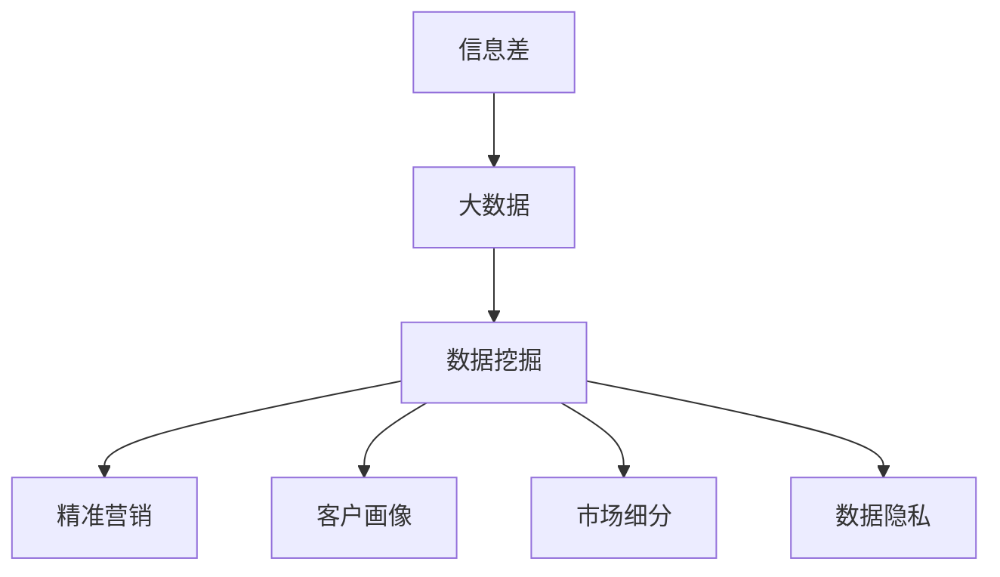

                 

# 信息差的商业市场渗透策略：大数据如何优化市场渗透

> 关键词：信息差, 商业市场, 大数据, 数据挖掘, 精准营销, 客户画像, 市场细分, 数据隐私

## 1. 背景介绍

在当今数据驱动的商业世界中，信息差是企业在竞争中占据优势的关键。信息差是指企业能够获取到比竞争对手更为精准、全面的客户数据，从而在产品设计、市场策略、客户关系管理等方面做出更明智的决策。大数据技术的应用，使得企业能够更有效地捕捉、分析和利用海量数据，从而填补信息差，优化市场渗透策略，实现商业成功。

### 1.1 问题由来

企业面临的市场环境瞬息万变，如何准确把握市场机会，及时调整产品和服务策略，成为企业持续竞争的关键。传统的市场调研方法，如问卷调查、焦点小组等，虽然能够提供一定程度的客户洞察，但成本高、周期长、效率低，难以适应快速变化的市场需求。相比之下，基于大数据的市场渗透策略，能够快速、全面、低成本地收集和分析客户数据，帮助企业洞察市场趋势，制定有效的市场策略。

### 1.2 问题核心关键点

本节将详细阐述大数据在市场渗透策略中的关键作用，并探讨如何利用大数据技术优化市场渗透的各个环节。

## 2. 核心概念与联系

### 2.1 核心概念概述

为更好地理解大数据在市场渗透中的应用，本节将介绍几个核心概念及其相互关系：

- 信息差(Information Gap)：指企业获取到的客户信息与竞争对手获取到的信息之间的差异。信息差的发现和利用，是企业提升竞争力的关键。

- 大数据(Big Data)：指规模庞大、类型多样的数据集，通常以TB或PB计。大数据技术通过分布式计算、机器学习等手段，能够高效处理和分析海量数据，提取有价值的商业洞察。

- 数据挖掘(Data Mining)：指从大数据中提取有价值的知识、模式和洞察的过程。数据挖掘结合机器学习算法，能够自动发现数据中的隐含规律，辅助决策制定。

- 精准营销(Precision Marketing)：指利用大数据和分析技术，对目标客户进行精准定位和定向营销，以提高营销效果和客户满意度。

- 客户画像(Customer Persona)：指通过数据挖掘和分析，构建基于客户属性、行为和偏好的虚拟人物，用于指导产品设计和市场策略。

- 市场细分(Market Segmentation)：指将目标市场划分为若干子市场，以便更有针对性地开展市场活动。市场细分有助于发现潜在客户群体，提升营销效果。

- 数据隐私(Data Privacy)：指在数据收集和使用过程中，保护个人隐私和数据安全的原则和策略。数据隐私是企业在使用大数据时需要重点考虑的问题。

这些核心概念之间的逻辑关系可以通过以下Mermaid流程图来展示：



这个流程图展示了信息差、大数据、数据挖掘等概念之间的联系，以及它们如何协同作用，优化市场渗透策略。

## 3. 核心算法原理 & 具体操作步骤
### 3.1 算法原理概述

基于大数据的市场渗透策略，本质上是一个利用数据挖掘和分析技术，识别和利用信息差的过程。其核心思想是：通过收集和分析客户数据，发现和填补信息差，从而制定和调整市场策略，提升产品竞争力，扩大市场份额。

形式化地，假设企业面临的市场数据为 $D$，其中包含大量客户的属性、行为和购买历史等信息。市场渗透的目标是最大化企业利润，即找到最优的市场策略 $S$：

$$
\max_{S} \int_{D} p(x)u(S|x)dx
$$

其中 $p(x)$ 为市场数据 $D$ 的概率密度函数，$u(S|x)$ 为市场策略 $S$ 在客户 $x$ 上的效用函数，即客户对策略的满意度。

### 3.2 算法步骤详解

基于大数据的市场渗透策略，一般包括以下几个关键步骤：

**Step 1: 数据收集与预处理**
- 确定市场数据源，收集客户属性、行为、交易历史等数据。
- 对数据进行清洗、去重、归一化等预处理，确保数据质量和一致性。

**Step 2: 数据挖掘与分析**
- 使用数据挖掘算法（如聚类、关联规则、分类等），识别出客户分群、购买模式等重要特征。
- 利用机器学习模型（如决策树、随机森林、神经网络等），构建客户画像和市场细分模型。
- 进行预测分析，评估市场策略的潜在效果。

**Step 3: 市场策略制定与优化**
- 根据客户画像和市场细分结果，制定针对性的市场策略。
- 结合客户反馈和市场效果，定期调整市场策略，提升渗透效果。
- 使用A/B测试等实验方法，评估策略效果，确保投入产出比最大化。

**Step 4: 数据隐私与合规**
- 确保数据收集和使用符合数据隐私法律和规范。
- 采用数据匿名化、加密等技术，保护客户隐私和数据安全。
- 建立数据使用透明性和责任机制，确保合规性。

以上是基于大数据的市场渗透策略的典型流程。在实际应用中，还需要根据具体市场环境和客户需求，对各环节进行优化和调整，以获得最佳的市场渗透效果。

### 3.3 算法优缺点

基于大数据的市场渗透策略具有以下优点：
1. 高效低成本：大数据技术能够快速、高效地处理和分析大量数据，降低市场调研和分析的边际成本。
2. 精准定位：通过数据挖掘和分析，可以更精准地识别目标客户群体，提高营销效果。
3. 动态调整：数据挖掘和分析结果可以实时更新，企业能够灵活调整市场策略，及时响应市场变化。
4. 广泛适用：大数据市场渗透策略适用于各种行业和市场环境，具有广泛的适用性。

同时，该方法也存在一定的局限性：
1. 数据质量依赖：市场渗透效果很大程度上取决于数据质量和完整性，缺失或不准确的数据可能导致错误决策。
2. 数据隐私问题：大数据处理过程中可能涉及客户隐私和数据安全问题，需要严格遵守相关法律法规。
3. 模型复杂度高：数据挖掘和分析模型复杂度高，需要丰富的数据科学知识和技能。
4. 技术门槛高：大数据技术和工具复杂，需要较高的技术积累和设备投入。

尽管存在这些局限性，但就目前而言，基于大数据的市场渗透策略仍然是大数据应用的重要范式。未来相关研究的重点在于如何进一步提升数据挖掘的自动化和智能化水平，降低技术门槛，同时兼顾数据隐私和合规性等因素。

### 3.4 算法应用领域

基于大数据的市场渗透策略，在各行各业中都得到了广泛应用，例如：

- 零售行业：通过客户购买历史和行为数据，进行市场细分和精准营销，提升销售业绩。
- 金融行业：利用客户财务数据和信用记录，进行风险评估和客户画像，优化产品设计和风险管理。
- 医疗行业：分析病人病历和医疗记录，识别疾病模式，开发个性化治疗方案。
- 教育行业：利用学生学习数据，进行个性化推荐和课程设计，提升教育效果。
- 互联网行业：通过用户行为数据，进行流量分析、广告投放优化，提高用户粘性和广告效果。

除了上述这些经典应用外，大数据市场渗透策略还被创新性地应用到更多场景中，如智慧城市、智能制造、环保监测等，为各行各业带来了新的发展机遇。

## 4. 数学模型和公式 & 详细讲解  
### 4.1 数学模型构建

本节将使用数学语言对基于大数据的市场渗透策略进行更加严格的刻画。

假设市场数据为 $D$，其中包含 $N$ 个客户的属性特征 $x_1, x_2, \ldots, x_N$，以及对应的市场策略 $s_1, s_2, \ldots, s_N$。市场策略 $s$ 的效果通过效用函数 $u(s|x)$ 衡量，客户对策略的满意度由效用函数决定。市场渗透的目标是最大化客户满意度，即最大化 $u(s|x)$：

$$
\max_{s} \sum_{i=1}^N p(x_i)u(s_i|x_i)
$$

其中 $p(x_i)$ 为客户 $x_i$ 的市场数据分布密度函数。

### 4.2 公式推导过程

以下我们以零售行业为例，推导基于大数据的市场渗透模型。

假设客户 $i$ 的购买历史和行为数据为 $X_i = (x_{i1}, x_{i2}, \ldots, x_{im})$，其中 $x_{ik}$ 为第 $k$ 个特征向量，如购买时间、购买金额、购买频率等。市场策略 $s$ 通过客户画像和市场细分得到，包括产品推广、促销活动、客户服务等方面。市场策略的效用函数 $u(s_i|x_i)$ 可以通过客户满意度调查、销售数据分析等方法获取。

市场渗透的优化目标是最小化客户满意度与市场策略的偏差，即：

$$
\min_{s} \sum_{i=1}^N \lVert u(s_i|x_i) - u_{ideal} \rVert_2^2
$$

其中 $u_{ideal}$ 为客户理想的市场策略效用函数。

通过优化上述目标函数，可以确定最优的市场策略 $s^*$，从而实现最大化市场渗透效果。

### 4.3 案例分析与讲解

以零售行业为例，分析大数据市场渗透策略的实际应用：

假设某零售企业收集到客户的购买历史数据 $X_i = (x_{i1}, x_{i2}, \ldots, x_{im})$，其中 $x_{ik}$ 表示第 $k$ 个购买特征。通过数据挖掘算法，企业发现客户购买行为受季节、促销活动、竞争对手价格变动等因素影响较大。因此，企业设计了基于大数据的市场策略 $s$，包括季节性促销、竞争对手价格监控、忠诚客户奖励计划等。

市场策略的效用函数 $u(s_i|x_i)$ 可以通过调查问卷和销售数据计算得到。企业通过市场细分和客户画像分析，发现不同客户群体的购买行为和偏好存在显著差异。例如，青年消费者对时尚产品的兴趣更高，中老年消费者对性价比的关注更大。

利用大数据市场渗透模型，企业对不同客户群体分别制定了针对性强的市场策略，并在实际营销活动中进行了验证。结果显示，企业市场策略的客户满意度显著提升，销售业绩也得到了明显提高。

## 5. 项目实践：代码实例和详细解释说明
### 5.1 开发环境搭建

在进行市场渗透策略开发前，我们需要准备好开发环境。以下是使用Python进行PyTorch开发的环境配置流程：

1. 安装Anaconda：从官网下载并安装Anaconda，用于创建独立的Python环境。

2. 创建并激活虚拟环境：
```bash
conda create -n pytorch-env python=3.8 
conda activate pytorch-env
```

3. 安装PyTorch：根据CUDA版本，从官网获取对应的安装命令。例如：
```bash
conda install pytorch torchvision torchaudio cudatoolkit=11.1 -c pytorch -c conda-forge
```

4. 安装Pandas：用于数据处理和分析。
```bash
pip install pandas
```

5. 安装Scikit-learn：用于机器学习和数据挖掘。
```bash
pip install scikit-learn
```

6. 安装TensorBoard：用于可视化模型训练过程。
```bash
pip install tensorboard
```

完成上述步骤后，即可在`pytorch-env`环境中开始市场渗透策略的开发实践。

### 5.2 源代码详细实现

下面我们以零售行业为例，给出使用PyTorch和Pandas进行市场渗透策略开发的PyTorch代码实现。

首先，定义数据处理函数：

```python
import pandas as pd
import numpy as np
import torch
from sklearn.model_selection import train_test_split

def load_data(file_path):
    data = pd.read_csv(file_path)
    # 特征选择
    selected_features = ['age', 'gender', 'income', 'purchase_frequency']
    data = data[selected_features]
    # 数据归一化
    data = (data - data.mean()) / data.std()
    # 数据分割
    train_data, test_data = train_test_split(data, test_size=0.2, random_state=42)
    return train_data, test_data

# 加载数据
train_data, test_data = load_data('retail_data.csv')
```

然后，定义模型和优化器：

```python
from torch import nn, optim
from sklearn.linear_model import LogisticRegression

class MarketStrategy(nn.Module):
    def __init__(self, num_features, num_classes):
        super(MarketStrategy, self).__init__()
        self.fc1 = nn.Linear(num_features, 32)
        self.fc2 = nn.Linear(32, num_classes)
        self.activation = nn.ReLU()

    def forward(self, x):
        x = self.fc1(x)
        x = self.activation(x)
        x = self.fc2(x)
        return x

# 定义优化器和学习率
optimizer = optim.Adam(model.parameters(), lr=0.001)
```

接着，定义训练和评估函数：

```python
from sklearn.metrics import accuracy_score

def train_epoch(model, data, optimizer, device):
    model.train()
    data = data.to(device)
    optimizer.zero_grad()
    output = model(data)
    loss = nn.functional.cross_entropy(output, data['target'])
    loss.backward()
    optimizer.step()
    return loss.item()

def evaluate(model, data, device):
    model.eval()
    data = data.to(device)
    with torch.no_grad():
        output = model(data)
        predicted_labels = output.argmax(dim=1)
        true_labels = data['target']
    accuracy = accuracy_score(true_labels, predicted_labels)
    return accuracy
```

最后，启动训练流程并在测试集上评估：

```python
# 加载测试集
test_data = load_data('retail_data_test.csv')

# 定义模型
model = MarketStrategy(num_features, num_classes)

# 定义设备
device = torch.device('cuda') if torch.cuda.is_available() else torch.device('cpu')
model.to(device)

# 训练模型
for epoch in range(num_epochs):
    loss = train_epoch(model, train_data, optimizer, device)
    accuracy = evaluate(model, train_data, device)
    print(f'Epoch {epoch+1}, loss: {loss:.4f}, accuracy: {accuracy:.4f}')

# 评估模型
accuracy = evaluate(model, test_data, device)
print(f'Test accuracy: {accuracy:.4f}')
```

以上就是使用PyTorch和Pandas进行市场渗透策略开发的完整代码实现。可以看到，通过结合机器学习和深度学习技术，企业能够快速构建基于大数据的市场策略，并实时评估其效果。

### 5.3 代码解读与分析

让我们再详细解读一下关键代码的实现细节：

**load_data函数**：
- 定义数据加载函数，用于从CSV文件中加载数据，并进行特征选择、归一化和数据分割。

**MarketStrategy类**：
- 定义一个简单的线性分类模型，用于预测客户的购买行为。该模型包含两个全连接层和一个ReLU激活函数，用于学习特征和输出之间的映射关系。

**train_epoch函数**：
- 定义训练函数，用于在训练集上更新模型参数。训练过程中，使用交叉熵损失函数衡量模型预测和真实标签之间的差异，通过梯度下降算法更新模型参数。

**evaluate函数**：
- 定义评估函数，用于在测试集上评估模型效果。评估过程中，使用准确率作为评估指标，计算模型预测和真实标签之间的差异。

**训练流程**：
- 定义总的epoch数和特征维度，开始循环迭代
- 每个epoch内，先在训练集上训练，输出损失和准确率
- 在测试集上评估模型效果，输出最终测试准确率

可以看到，PyTorch和Pandas的结合，使得市场渗透策略的开发更加便捷高效。开发者可以将更多精力放在模型设计和数据处理上，而不必过多关注底层的实现细节。

当然，工业级的系统实现还需考虑更多因素，如模型的保存和部署、超参数的自动搜索、更灵活的市场策略适配等。但核心的市场渗透范式基本与此类似。

## 6. 实际应用场景
### 6.1 智能客服系统

基于大数据的市场渗透策略，可以广泛应用于智能客服系统的构建。传统客服往往需要配备大量人力，高峰期响应缓慢，且一致性和专业性难以保证。而利用大数据进行市场渗透，企业能够更精准地识别目标客户群体，设计针对性的客服策略，提高客户满意度和服务质量。

在技术实现上，可以收集企业内部的历史客服对话记录，将问题-答案对作为监督数据，训练模型学习匹配答案。微调后的模型能够自动理解客户意图，匹配最合适的答案模板进行回复。对于客户提出的新问题，还可以接入检索系统实时搜索相关内容，动态组织生成回答。如此构建的智能客服系统，能大幅提升客户咨询体验和问题解决效率。

### 6.2 金融舆情监测

金融机构需要实时监测市场舆论动向，以便及时应对负面信息传播，规避金融风险。传统的人工监测方式成本高、效率低，难以应对网络时代海量信息爆发的挑战。利用大数据进行市场渗透，金融机构能够更全面、精准地获取客户反馈和市场数据，及时发现舆情异常，采取应对措施。

具体而言，可以收集金融领域相关的新闻、报道、评论等文本数据，并对其进行情感分析和主题标注。通过分析客户和媒体对金融产品的评价，金融机构能够识别潜在的市场趋势和风险点，提前采取防范措施。

### 6.3 个性化推荐系统

当前的推荐系统往往只依赖用户的历史行为数据进行物品推荐，无法深入理解用户的真实兴趣偏好。利用大数据进行市场渗透，个性化推荐系统可以更好地挖掘用户行为背后的语义信息，从而提供更精准、多样的推荐内容。

在实践中，可以收集用户浏览、点击、评论、分享等行为数据，提取和用户交互的物品标题、描述、标签等文本内容。将文本内容作为模型输入，用户的后续行为（如是否点击、购买等）作为监督信号，在此基础上微调预训练语言模型。微调后的模型能够从文本内容中准确把握用户的兴趣点。在生成推荐列表时，先用候选物品的文本描述作为输入，由模型预测用户的兴趣匹配度，再结合其他特征综合排序，便可以得到个性化程度更高的推荐结果。

### 6.4 未来应用展望

随着大数据技术的发展，基于大数据的市场渗透策略将在更多领域得到应用，为传统行业带来变革性影响。

在智慧医疗领域，利用大数据进行市场渗透，能够更精准地识别疾病模式和患者需求，开发个性化的医疗方案，提升医疗服务的智能化水平，辅助医生诊疗，加速新药开发进程。

在智能教育领域，利用大数据进行市场渗透，能够更全面地了解学生的学习行为和需求，提供个性化的教学方案，因材施教，促进教育公平，提高教学质量。

在智慧城市治理中，利用大数据进行市场渗透，能够更高效地监测城市事件、分析舆情，提高城市管理的自动化和智能化水平，构建更安全、高效的未来城市。

此外，在企业生产、社会治理、文娱传媒等众多领域，基于大数据的市场渗透策略也将不断涌现，为经济社会发展注入新的动力。相信随着技术的日益成熟，大数据市场渗透策略将成为企业竞争的关键利器，推动人工智能技术在垂直行业的规模化落地。

## 7. 工具和资源推荐
### 7.1 学习资源推荐

为了帮助开发者系统掌握大数据在市场渗透中的应用，这里推荐一些优质的学习资源：

1. 《大数据原理与实践》系列博文：由大数据专家撰写，深入浅出地介绍了大数据技术的基本原理和实践应用。

2. 《Python数据科学手册》：一本经典的数据科学入门书籍，涵盖了Python在大数据处理、分析和可视化中的应用。

3. 《数据挖掘与统计学习》课程：由斯坦福大学开设的机器学习课程，详细讲解了数据挖掘、机器学习等核心概念和算法。

4. 《TensorFlow实战》书籍：TensorFlow官方指南，介绍了TensorFlow的基本用法和高级功能，适合深度学习和数据分析。

5. 《大数据技术与案例分析》课程：由Coursera提供的在线课程，涵盖大数据技术的理论基础和应用案例。

通过对这些资源的学习实践，相信你一定能够快速掌握大数据在市场渗透中的应用，并用于解决实际的商业问题。
###  7.2 开发工具推荐

高效的开发离不开优秀的工具支持。以下是几款用于大数据市场渗透开发的常用工具：

1. Hadoop：开源分布式计算平台，适合大规模数据的处理和分析。

2. Spark：Apache基金会推出的快速计算框架，支持分布式数据处理和机器学习。

3. PyTorch：基于Python的深度学习框架，支持动态计算图和高效模型训练。

4. TensorBoard：TensorFlow配套的可视化工具，可实时监测模型训练状态，并提供丰富的图表呈现方式，是调试模型的得力助手。

5. Jupyter Notebook：开源的交互式计算环境，支持Python和其他语言的数据分析和模型训练。

6. H2O.ai：开源数据科学平台，提供易于使用的API和组件，支持大数据分析和机器学习。

合理利用这些工具，可以显著提升大数据市场渗透任务的开发效率，加快创新迭代的步伐。

### 7.3 相关论文推荐

大数据市场渗透技术的发展源于学界的持续研究。以下是几篇奠基性的相关论文，推荐阅读：

1. 《大数据时代的市场细分》：探讨了大数据在市场细分中的应用，提出了基于聚类和关联规则的市场细分算法。

2. 《精准营销与大数据分析》：研究了大数据在精准营销中的应用，提出了基于机器学习的客户画像和市场策略优化方法。

3. 《数据挖掘在商业智能中的应用》：讨论了数据挖掘技术在商业智能中的应用，介绍了多种数据挖掘算法和模型。

4. 《基于大数据的客户画像构建与优化》：介绍了大数据在客户画像构建中的应用，提出了基于深度学习的客户画像优化方法。

5. 《利用大数据优化营销策略》：研究了大数据在营销策略优化中的应用，提出了基于机器学习的市场策略评估和优化方法。

这些论文代表了大数据市场渗透技术的发展脉络。通过学习这些前沿成果，可以帮助研究者把握学科前进方向，激发更多的创新灵感。

## 8. 总结：未来发展趋势与挑战

### 8.1 总结

本文对基于大数据的市场渗透策略进行了全面系统的介绍。首先阐述了大数据在市场渗透中的核心作用，明确了大数据技术如何帮助企业发现和填补信息差，优化市场策略，提升商业效果。其次，从原理到实践，详细讲解了基于大数据的市场渗透方法，并给出了实际应用的代码实现。同时，本文还广泛探讨了大数据市场渗透策略在多个行业领域的应用前景，展示了大数据技术的广泛适用性。

通过本文的系统梳理，可以看到，基于大数据的市场渗透策略已经在大规模企业中得到广泛应用，极大地提升了企业的市场渗透能力，优化了营销效果。未来，伴随大数据技术和市场环境的变化，基于大数据的市场渗透策略必将迎来更多的创新和突破，进一步推动企业的数字化转型和智能化升级。

### 8.2 未来发展趋势

展望未来，大数据市场渗透策略将呈现以下几个发展趋势：

1. 数据融合与多源数据融合：随着数据源的不断增加，企业能够利用更多元、多源的数据进行市场渗透，提升决策的全面性和准确性。

2. 实时数据处理与动态调整：大数据处理和分析能力将进一步提升，企业能够实时捕捉市场动态，动态调整市场策略，及时响应市场变化。

3. 模型自动化与智能化：机器学习和深度学习技术将更加成熟，市场渗透模型的自动化和智能化水平将不断提高，优化速度和效果。

4. 数据隐私与安全：数据隐私和安全问题将受到更多关注，企业将采用更加严格的数据治理和隐私保护措施，确保数据合规性和安全性。

5. 数据可视化与决策支持：数据可视化技术将更加普及，企业能够利用可视化工具，直观理解数据洞察，辅助决策制定。

以上趋势凸显了大数据市场渗透策略的广阔前景。这些方向的探索发展，必将进一步提升企业的市场渗透能力和决策科学性，推动企业在数字化转型中不断进步。

### 8.3 面临的挑战

尽管大数据市场渗透策略已经取得了瞩目成就，但在迈向更加智能化、普适化应用的过程中，它仍面临诸多挑战：

1. 数据质量与一致性：大数据市场渗透效果很大程度上取决于数据质量和一致性，缺失或不准确的数据可能导致错误决策。如何确保数据源的多样性和高质量，是企业需要重点解决的问题。

2. 数据隐私与安全：大数据处理过程中可能涉及客户隐私和数据安全问题，需要严格遵守相关法律法规。如何在利用数据进行市场渗透的同时，保护客户隐私，是企业面临的重要挑战。

3. 技术复杂度：大数据处理和分析模型的复杂度高，需要丰富的数据科学知识和技能。如何降低技术门槛，提高数据治理和分析的效率，是企业需要不断优化的方向。

4. 成本与效率：大数据市场渗透策略在数据收集、处理和分析过程中，成本较高，且对硬件设备的要求也较高。如何在降低成本的同时，提升数据处理和分析的效率，是企业需要平衡的问题。

尽管存在这些挑战，但大数据市场渗透策略仍然是大数据应用的重要范式。未来相关研究的重点在于如何进一步提升数据治理的自动化和智能化水平，降低技术门槛，同时兼顾数据隐私和合规性等因素。

### 8.4 研究展望

面向未来，大数据市场渗透策略的研究需要在以下几个方面寻求新的突破：

1. 探索无监督和半监督学习范式。摆脱对大规模标注数据的依赖，利用自监督学习、主动学习等无监督和半监督范式，最大限度利用非结构化数据，实现更加灵活高效的渗透。

2. 研究模型优化与资源效率。开发更加参数高效和计算高效的市场渗透方法，在固定大部分大数据权重的同时，只更新极少量的任务相关参数。同时优化大数据处理和分析的计算图，减少前向传播和反向传播的资源消耗，实现更加轻量级、实时性的部署。

3. 融合因果分析与对比学习。通过引入因果推断和对比学习思想，增强市场渗透模型的建立稳定因果关系的能力，学习更加普适、鲁棒的市场策略。

4. 引入更多先验知识。将符号化的先验知识，如知识图谱、逻辑规则等，与神经网络模型进行巧妙融合，引导市场渗透过程学习更准确、合理的市场策略。

5. 结合因果分析和博弈论工具。将因果分析方法引入市场渗透模型，识别出模型决策的关键特征，增强输出解释的因果性和逻辑性。借助博弈论工具刻画人机交互过程，主动探索并规避模型的脆弱点，提高系统稳定性。

6. 纳入伦理道德约束。在市场渗透目标中引入伦理导向的评估指标，过滤和惩罚有偏见、有害的输出倾向。同时加强人工干预和审核，建立模型行为的监管机制，确保输出的伦理性和安全性。

这些研究方向的探索，必将引领大数据市场渗透策略迈向更高的台阶，为构建安全、可靠、可解释、可控的智能系统铺平道路。面向未来，大数据市场渗透策略还需要与其他人工智能技术进行更深入的融合，如知识表示、因果推理、强化学习等，多路径协同发力，共同推动市场渗透系统的进步。只有勇于创新、敢于突破，才能不断拓展市场渗透的边界，让大数据技术更好地造福人类社会。

## 9. 附录：常见问题与解答

**Q1：大数据市场渗透策略是否适用于所有商业场景？**

A: 大数据市场渗透策略在大多数商业场景中都具有显著效果，特别是在数据量较大的情况下。但对于一些特定领域的场景，如某些特定的制造业、手工艺业等，由于数据量较少或数据特性特殊，可能无法直接应用大数据方法进行市场渗透。此时需要结合行业特点，采用其他数据采集和分析方法。

**Q2：市场渗透策略如何实现动态调整？**

A: 大数据市场渗透策略可以通过实时数据流处理技术实现动态调整。具体而言，企业可以构建实时数据流管道，持续收集市场数据，并利用流处理框架（如Apache Kafka、Apache Flink等）进行实时分析，得出市场动态和客户反馈。通过建立动态调整模型，企业可以随时根据新数据更新市场策略，提高市场渗透的效果和速度。

**Q3：市场渗透策略如何保障数据隐私？**

A: 在大数据市场渗透策略中，保障数据隐私是至关重要的。企业可以采用数据匿名化、加密等技术，保护客户隐私和数据安全。具体来说，可以对数据进行去标识化处理，去除或模糊化个人身份信息，确保数据无法被直接追溯到具体个人。同时，可以采用数据加密技术，防止数据在传输和存储过程中被非法访问和篡改。

**Q4：如何确保大数据市场渗透策略的效果？**

A: 确保大数据市场渗透策略的效果，需要从数据采集、数据治理、模型训练、模型评估等多个环节进行严格控制。具体而言，可以采取以下措施：
1. 数据采集：确保数据来源的多样性和准确性，采集足够的样本数据。
2. 数据治理：进行数据清洗、去重、归一化等预处理，确保数据的一致性和质量。
3. 模型训练：采用先进的机器学习算法，训练高效的市场策略模型。
4. 模型评估：使用交叉验证、A/B测试等方法，评估模型效果，确保模型的泛化能力和鲁棒性。
5. 持续优化：定期更新模型参数和市场策略，确保模型能够适应市场变化。

通过以上措施，企业可以构建高效、准确、安全的大数据市场渗透策略，实现市场渗透的持续优化和提升。

**Q5：大数据市场渗透策略是否适用于不同行业的企业？**

A: 大数据市场渗透策略在不同行业中均有广泛应用，但具体应用效果需结合行业特点进行调整。例如，零售行业可以通过大数据分析客户购买行为，进行市场细分和精准营销；金融行业可以利用客户财务数据和信用记录，进行风险评估和客户画像；医疗行业可以分析病人病历和医疗记录，识别疾病模式，开发个性化治疗方案。

**Q6：市场渗透策略如何优化客户体验？**

A: 市场渗透策略可以通过优化产品设计、提升服务质量、增强客户互动等方式，优化客户体验。具体来说，企业可以通过大数据分析客户需求和反馈，设计符合客户期望的产品和服务。同时，可以建立智能客服系统，提供24/7在线客服支持，提升客户满意度。此外，还可以通过社交媒体、邮件等方式，增强与客户的互动，提升客户忠诚度和品牌影响力。

---

作者：禅与计算机程序设计艺术 / Zen and the Art of Computer Programming

