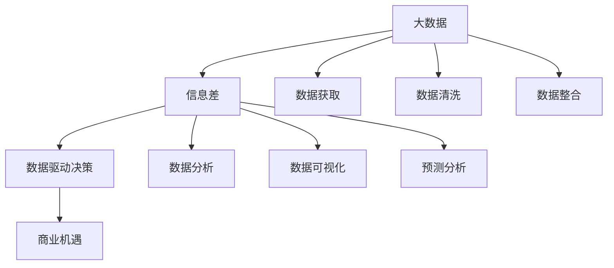

                 

# 信息差的商业机遇发现：大数据如何发现商业机遇

## 1. 背景介绍

### 1.1 问题由来
在当今信息爆炸的时代，大数据的应用无处不在，从商业决策到科学研究，从金融投资到社交媒体，数据已经成为各个领域的重要资产。然而，数据量大并不意味着价值高，很多企业花巨资收集的数据往往未能发挥其应有的作用。信息差（Information Gap）是数据和商业决策之间的一个重要差距，这一差距导致企业在获取、处理、应用数据时遇到重重困难，严重制约了其商业价值的实现。

### 1.2 问题核心关键点
信息差问题核心在于企业如何利用大数据来填补这一差距，从而发现并利用商业机遇。信息差的填补需要企业具备以下能力：
1. **数据获取与处理能力**：从不同渠道收集、清洗、整合高质量数据。
2. **分析与洞察能力**：利用统计学、机器学习等工具，从数据中挖掘有价值的商业洞察。
3. **决策执行能力**：将商业洞察转化为具体的行动策略，执行决策。

本文将系统介绍如何通过大数据技术来发现信息差，从而找到潜在的商业机遇。

## 2. 核心概念与联系

### 2.1 核心概念概述

为更好地理解大数据如何发现商业机遇，本文将介绍几个核心概念：

- **大数据（Big Data）**：指规模巨大、速度极快、类型多样的数据集，通常采用分布式存储和计算技术进行处理。
- **信息差（Information Gap）**：指数据与实际商业决策之间的差距，包括数据获取不足、数据质量问题、数据分析方法不匹配等。
- **商业机遇（Business Opportunity）**：指企业利用数据洞察，结合自身资源和市场环境，发现并实现的新商业机会。
- **数据驱动决策（Data-Driven Decision Making）**：指企业依据数据进行决策，以数据为核心驱动商业活动的过程。
- **数据分析（Data Analysis）**：指利用统计学、机器学习等方法，从数据中提取信息，形成商业洞察的过程。
- **数据可视化（Data Visualization）**：指将数据转化为图形、图表等直观展示，帮助人们理解和洞察数据特征。
- **预测分析（Predictive Analysis）**：指利用历史数据和统计模型预测未来趋势，为商业决策提供科学依据。

这些核心概念之间的逻辑关系可以通过以下Mermaid流程图来展示：



这个流程图展示了大数据、信息差、商业机遇之间的核心联系：

1. 大数据通过数据获取、清洗、整合等流程，转化为高质量数据集。
2. 信息差通过数据分析、数据可视化、预测分析等技术手段，转化为商业洞察。
3. 商业机遇通过数据驱动决策，将商业洞察转化为具体的商业行动。

这些概念共同构成了大数据如何发现商业机遇的核心框架，帮助我们理解企业如何利用大数据创造价值。

## 3. 核心算法原理 & 具体操作步骤

### 3.1 算法原理概述

大数据发现商业机遇的核心算法原理是基于数据驱动的决策过程。其核心思想是：利用大数据分析技术，识别出企业内部和外部环境中的信息差，进而发现潜在的商业机遇，指导企业制定合理的决策。

具体而言，基于大数据的商业机遇发现过程包括：
1. **数据收集**：从各种数据源收集相关数据。
2. **数据处理**：清洗、整合、归一化数据，确保数据质量。
3. **数据分析**：利用统计学、机器学习等方法，提取数据中的模式和规律。
4. **数据可视化**：将分析结果通过图表、仪表盘等方式展示，辅助决策。
5. **预测分析**：利用历史数据和统计模型，预测未来趋势，指导决策。
6. **商业决策**：根据分析结果和预测结果，制定商业策略，实施决策。

### 3.2 算法步骤详解

基于大数据的商业机遇发现一般包括以下几个关键步骤：

**Step 1: 数据收集与处理**
- 确定所需的数据源，包括内部和外部数据。
- 收集并清洗数据，确保数据完整性和准确性。
- 对数据进行整合和归一化，使其格式一致，便于分析。

**Step 2: 数据分析与建模**
- 选择合适的分析方法和工具，如统计学、机器学习、数据挖掘等。
- 对数据进行探索性分析，识别出潜在的模式和异常点。
- 构建数据模型，如回归模型、分类模型、聚类模型等，进行预测和分类。

**Step 3: 数据可视化**
- 使用可视化工具，如Tableau、Power BI等，将分析结果转化为直观的图表和仪表盘。
- 对关键指标进行可视化展示，如趋势、分布、关联等。

**Step 4: 商业决策制定**
- 结合数据分析结果和可视化展示，制定商业决策。
- 实施决策，监控执行效果，调整策略。

**Step 5: 评估与优化**
- 定期评估决策效果，进行效果分析。
- 持续优化数据收集、处理和分析方法，提升决策质量。

### 3.3 算法优缺点

基于大数据的商业机遇发现方法具有以下优点：
1. 数据驱动决策：利用数据分析结果指导决策，减少主观偏差。
2. 系统化流程：数据收集、处理、分析、可视化、决策等环节系统化，提升决策效率。
3. 预测能力：利用历史数据和统计模型，预测未来趋势，提升决策的前瞻性。

同时，该方法也存在一定的局限性：
1. 数据质量依赖：数据分析结果依赖于数据质量，数据不足或不准确会影响结果。
2. 技术门槛高：需要掌握数据分析、机器学习等技术，对企业技术能力要求较高。
3. 结果解释性不足：复杂模型难以解释，可能存在"黑箱"问题，影响决策信任度。
4. 数据隐私风险：数据收集和分析可能涉及敏感信息，存在数据隐私风险。

尽管存在这些局限性，但就目前而言，基于大数据的商业机遇发现方法仍是最主流的数据驱动决策范式。未来相关研究的重点在于如何进一步降低技术门槛，提高结果解释性，保护数据隐私等，以进一步提升数据驱动决策的质量和效果。

### 3.4 算法应用领域

基于大数据的商业机遇发现方法在多个领域都有广泛应用，如：

- **金融投资**：通过大数据分析市场趋势、客户行为等，制定投资策略，提高投资回报率。
- **零售电商**：利用客户购买历史、浏览行为等数据，发现潜在客户，优化商品推荐和营销策略。
- **医疗健康**：分析患者历史数据，发现疾病风险，制定个性化治疗方案。
- **智能制造**：通过数据分析设备运行数据，预测设备故障，优化生产流程。
- **智能交通**：利用交通流量、气象数据等，优化交通流量管理，减少拥堵。
- **智慧城市**：通过数据分析城市运行数据，优化公共服务，提升城市管理效率。

这些应用场景展示了大数据分析在发现商业机遇方面的巨大潜力。

## 4. 数学模型和公式 & 详细讲解 & 举例说明

### 4.1 数学模型构建

本节将使用数学语言对基于大数据的商业机遇发现过程进行更加严格的刻画。

设企业收集的数据集为 $D=\{(x_i, y_i)\}_{i=1}^N$，其中 $x_i$ 为特征向量，$y_i$ 为标签。假设企业要解决的问题为二分类任务，即识别客户是否会购买某产品。

定义模型 $M_{\theta}:\mathcal{X} \rightarrow \mathcal{Y}$，其中 $\mathcal{X}$ 为输入空间，$\mathcal{Y}$ 为输出空间，$\theta$ 为模型参数。

设模型的损失函数为 $\ell(M_{\theta}(x),y)$，则经验风险为：

$$
\mathcal{L}(\theta) = \frac{1}{N} \sum_{i=1}^N \ell(M_{\theta}(x_i),y_i)
$$

其中 $\ell$ 为二分类交叉熵损失，即：

$$
\ell(M_{\theta}(x),y) = -[y\log M_{\theta}(x)+(1-y)\log(1-M_{\theta}(x))]
$$

### 4.2 公式推导过程

为了便于理解，我们以一个简单的示例来说明。

假设企业有历史数据集 $D=\{(x_i, y_i)\}_{i=1}^N$，其中 $x_i$ 为客户的特征向量，$y_i$ 为购买与否的标签。企业希望利用这些数据，建立模型预测新客户是否会购买某产品。

首先，我们需要将原始数据集划分为训练集、验证集和测试集。假设计划使用80%的数据作为训练集，10%作为验证集，10%作为测试集。然后，将训练集和验证集数据输入模型 $M_{\theta}$，计算损失函数 $\mathcal{L}(\theta)$。

利用梯度下降算法，每次迭代更新模型参数 $\theta$，最小化损失函数。更新公式为：

$$
\theta \leftarrow \theta - \eta \nabla_{\theta}\mathcal{L}(\theta)
$$

其中 $\eta$ 为学习率。

在模型训练结束后，我们利用测试集数据评估模型性能。常见的评估指标包括准确率、召回率、F1分数等。

最后，根据模型评估结果，调整模型参数或优化模型结构，再次进行训练和评估，直到达到理想的性能指标。

### 4.3 案例分析与讲解

假设一家电商企业想要预测新客户是否会购买某款智能手表。企业收集了大量客户的历史数据，包括客户的年龄、性别、购买历史、浏览行为等。

**Step 1: 数据收集与处理**

企业首先需要收集客户的历史数据，这些数据可以从订单系统、网站点击日志、社交媒体等渠道获取。收集到的数据可能存在缺失值、异常值等问题，需要进行数据清洗和预处理，确保数据质量。

**Step 2: 数据分析与建模**

企业可以采用多种数据分析方法，如线性回归、决策树、随机森林、神经网络等。假设企业采用神经网络模型进行建模，可以选择一个合适的神经网络结构，如多层感知器（MLP），并根据数据特征选择合适的层数、节点数等参数。

**Step 3: 数据可视化**

模型训练完毕后，企业可以使用数据可视化工具，如Tableau、Power BI等，将模型预测结果可视化展示。例如，企业可以使用散点图展示客户购买行为与智能手表购买意愿之间的关系，使用柱状图展示不同特征对购买意愿的影响等。

**Step 4: 商业决策制定**

根据数据可视化结果，企业可以制定相应的商业决策。例如，企业可以发现某些年龄段的用户更倾向于购买智能手表，并针对这些用户开展特定营销活动。企业还可以分析购买历史和浏览行为，优化产品推荐策略，提高用户转化率。

**Step 5: 评估与优化**

企业需要定期评估模型的预测效果，如使用ROC曲线、混淆矩阵等指标评估模型性能。如果发现模型预测效果不佳，企业可以重新调整模型参数，优化数据特征提取方法，进行模型迭代优化。

## 5. 项目实践：代码实例和详细解释说明

### 5.1 开发环境搭建

在进行商业机遇发现实践前，我们需要准备好开发环境。以下是使用Python进行TensorFlow开发的環境配置流程：

1. 安装Anaconda：从官网下载并安装Anaconda，用于创建独立的Python环境。

2. 创建并激活虚拟环境：
```bash
conda create -n tf-env python=3.8 
conda activate tf-env
```

3. 安装TensorFlow：根据CUDA版本，从官网获取对应的安装命令。例如：
```bash
conda install tensorflow -c conda-forge
```

4. 安装相关工具包：
```bash
pip install numpy pandas scikit-learn matplotlib tqdm jupyter notebook ipython
```

完成上述步骤后，即可在`tf-env`环境中开始商业机遇发现实践。

### 5.2 源代码详细实现

下面我们以预测客户是否会购买某款智能手表为例，给出使用TensorFlow进行数据驱动决策的PyTorch代码实现。

首先，定义数据集和模型：

```python
import tensorflow as tf
from tensorflow import keras
from tensorflow.keras import layers

# 定义数据集
train_dataset = tf.data.Dataset.from_tensor_slices((x_train, y_train))
val_dataset = tf.data.Dataset.from_tensor_slices((x_val, y_val))
test_dataset = tf.data.Dataset.from_tensor_slices((x_test, y_test))

# 定义模型
model = keras.Sequential([
    keras.layers.Dense(64, activation='relu'),
    keras.layers.Dense(64, activation='relu'),
    keras.layers.Dense(1, activation='sigmoid')
])
```

然后，定义优化器、损失函数和评估指标：

```python
# 定义优化器
optimizer = keras.optimizers.Adam(learning_rate=0.001)

# 定义损失函数
loss_function = keras.losses.BinaryCrossentropy()

# 定义评估指标
metrics = keras.metrics.BinaryAccuracy()
```

接着，定义训练和评估函数：

```python
# 定义训练函数
def train_step(data):
    with tf.GradientTape() as tape:
        predictions = model(data)
        loss_value = loss_function(y_true, predictions)
    gradients = tape.gradient(loss_value, model.trainable_variables)
    optimizer.apply_gradients(zip(gradients, model.trainable_variables))
    return loss_value

# 定义评估函数
def evaluate_step(data):
    predictions = model(data)
    accuracy = metrics(y_true, predictions)
    return accuracy
```

最后，启动训练流程并在测试集上评估：

```python
epochs = 10
batch_size = 128

for epoch in range(epochs):
    for batch in train_dataset.batch(batch_size):
        loss_value = train_step(batch)

    for batch in val_dataset.batch(batch_size):
        accuracy = evaluate_step(batch)
        print(f'Epoch {epoch+1}, Validation Accuracy: {accuracy:.4f}')

# 在测试集上评估模型
for batch in test_dataset.batch(batch_size):
    accuracy = evaluate_step(batch)
    print(f'Test Accuracy: {accuracy:.4f}')
```

以上就是使用TensorFlow进行商业机遇发现代码实现的完整流程。可以看到，TensorFlow提供了丰富的API和工具，使得模型训练和评估变得简单高效。

### 5.3 代码解读与分析

让我们再详细解读一下关键代码的实现细节：

**keras.Sequential模型**：
- 定义了三层神经网络模型，第一层和第二层均使用ReLU激活函数，最后一层使用Sigmoid激活函数。

**训练函数train_step**：
- 使用GradientTape记录梯度，计算模型输出与真实标签之间的二分类交叉熵损失。
- 计算梯度并应用Adam优化器更新模型参数。
- 返回当前的损失值。

**评估函数evaluate_step**：
- 计算模型输出与真实标签之间的二分类准确率。
- 返回当前的准确率。

**训练和评估循环**：
- 每个epoch内，在训练集和验证集上分别进行训练和评估，并输出验证集上的准确率。
- 在测试集上进行最终的评估，输出测试集上的准确率。

可以看到，使用TensorFlow进行商业机遇发现，可以很方便地定义模型、损失函数、评估指标等，并通过简单的代码实现数据驱动的决策过程。

## 6. 实际应用场景

### 6.1 金融投资

金融投资是数据驱动决策的典型应用场景之一。投资公司可以通过大数据分析市场趋势、客户行为、宏观经济数据等，制定投资策略，优化资产配置，提高投资回报率。

例如，一家投资公司可以利用历史股票数据和市场新闻，训练一个神经网络模型，预测未来股票价格的走势。通过定期更新模型参数，企业可以不断优化投资策略，实现更高的投资收益。

### 6.2 零售电商

零售电商企业通过大数据分析客户购买历史、浏览行为、评价反馈等数据，发现潜在客户，优化商品推荐和营销策略。

例如，一家电商公司可以通过分析客户的历史购买记录和浏览行为，识别出高潜客户，并针对这些客户进行个性化的产品推荐和优惠券推送。通过不断优化推荐算法和促销策略，企业可以提高用户转化率和客户满意度，增加销售额。

### 6.3 医疗健康

医疗健康领域可以利用大数据分析患者的电子病历、诊断报告、治疗记录等数据，发现疾病风险，制定个性化治疗方案。

例如，一家医疗机构可以通过分析患者的历史病历数据，建立疾病预测模型，识别出高风险患者，并制定相应的预防和治疗方案。通过不断更新模型，企业可以提高诊疗效果，降低医疗成本。

### 6.4 智能制造

智能制造领域可以通过大数据分析设备运行数据，预测设备故障，优化生产流程。

例如，一家制造企业可以通过分析设备的历史运行数据，建立设备故障预测模型，预测设备未来的故障风险，并提前进行维护和检修。通过不断优化模型，企业可以降低设备故障率，提高生产效率。

## 7. 工具和资源推荐

### 7.1 学习资源推荐

为了帮助开发者系统掌握大数据分析的理论基础和实践技巧，这里推荐一些优质的学习资源：

1. 《Python数据分析与数据可视化》书籍：全面介绍Python在数据处理和可视化方面的应用，涵盖大量实际案例。
2. Coursera《机器学习》课程：斯坦福大学开设的机器学习经典课程，由Andrew Ng教授主讲，讲解机器学习原理和应用。
3. Kaggle竞赛平台：提供大量的数据集和竞赛任务，帮助开发者在实战中提升数据分析技能。
4. Scikit-learn官方文档：介绍Scikit-learn库的各种机器学习算法和应用场景，是进行数据分析的重要工具。
5. TensorFlow官方文档：详细讲解TensorFlow库的各种功能和API，是进行深度学习模型的重要工具。

通过对这些资源的学习实践，相信你一定能够快速掌握大数据分析的精髓，并用于解决实际的商业问题。

### 7.2 开发工具推荐

高效的开发离不开优秀的工具支持。以下是几款用于大数据分析开发的常用工具：

1. Python：Python是一种高效、灵活、易用的编程语言，适合大数据分析和机器学习开发。
2. TensorFlow：由Google主导开发的开源深度学习框架，生产部署方便，适合大规模工程应用。
3. Scikit-learn：基于Python的开源机器学习库，提供各种常用的机器学习算法和工具。
4. Tableau：可视化分析工具，可以帮助开发者快速生成各种图表和仪表盘。
5. Jupyter Notebook：开源的交互式开发环境，支持多种编程语言和库，方便开发者进行数据分析和模型训练。
6. Apache Spark：分布式计算框架，适合大规模数据处理和分析。

合理利用这些工具，可以显著提升大数据分析的开发效率，加快创新迭代的步伐。

### 7.3 相关论文推荐

大数据分析与商业机遇发现相关论文代表了该领域的发展脉络。以下是几篇奠基性的相关论文，推荐阅读：

1. "Big Data: A Revolution That Will Transform How We Live, Work, and Think"（《大数据：将如何改变我们的生活、工作和思维方式》）：这篇文章讨论了大数据对社会各个领域的深远影响。
2. "Machine Learning Yearning"（《机器学习实战》）：Andrew Ng教授所著，全面介绍机器学习算法和实践技巧。
3. "Predictive Analytics for Business"（《商业预测分析》）：全面介绍商业预测分析的方法和应用场景。
4. "The Data Warehouse Toolkit"（《数据仓库工具包》）：介绍数据仓库的设计和实现方法，是数据管理和分析的重要工具。

这些论文代表了大数据分析与商业机遇发现技术的发展脉络。通过学习这些前沿成果，可以帮助研究者把握学科前进方向，激发更多的创新灵感。

## 8. 总结：未来发展趋势与挑战

### 8.1 总结

本文对大数据如何发现商业机遇进行了全面系统的介绍。首先阐述了大数据分析在商业决策中的重要性，明确了大数据分析在发现商业机遇中的关键作用。其次，从原理到实践，详细讲解了大数据分析的过程，给出了商业机遇发现的完整代码实例。同时，本文还广泛探讨了大数据分析在金融投资、零售电商、医疗健康等众多领域的应用前景，展示了大数据分析的巨大潜力。此外，本文精选了大数据分析的相关学习资源，力求为读者提供全方位的技术指引。

通过本文的系统梳理，可以看到，大数据分析在发现商业机遇方面的广阔前景。企业可以利用大数据分析技术，识别信息差，发现潜在的商业机遇，制定合理的决策，实现商业价值的最大化。未来，伴随大数据技术和分析方法的不断进步，大数据分析必将在更多领域得到应用，为传统行业带来变革性影响。

### 8.2 未来发展趋势

展望未来，大数据分析将呈现以下几个发展趋势：

1. 数据规模持续增长：随着互联网的普及和企业信息化程度的提升，数据规模将持续增长，为企业提供更丰富的数据来源。
2. 数据分析技术进步：数据分析技术将不断进步，如深度学习、机器学习、数据挖掘等方法，将提高数据分析的精度和效率。
3. 数据隐私保护：随着数据规模的增加，数据隐私保护问题将更加重要，数据安全和隐私保护技术将得到重视。
4. 实时数据处理：企业需要实时处理和分析大量数据，实时数据分析技术将得到广泛应用。
5. 自动化数据分析：自动化数据分析工具将帮助企业快速生成商业洞察，提高决策效率。
6. 多领域融合：大数据分析将与其他技术进行更深入的融合，如人工智能、物联网、区块链等，形成更全面的解决方案。

以上趋势凸显了大数据分析技术的广阔前景。这些方向的探索发展，必将进一步提升企业的数据分析能力，加速商业决策的科学化和智能化。

### 8.3 面临的挑战

尽管大数据分析技术已经取得了瞩目成就，但在迈向更加智能化、普适化应用的过程中，它仍面临着诸多挑战：

1. 数据质量问题：数据采集和处理过程中，数据可能存在缺失、噪声、异常等问题，影响分析结果。
2. 数据隐私风险：企业在进行数据分析时，可能涉及敏感数据，存在数据隐私泄露的风险。
3. 技术门槛高：大数据分析技术涉及复杂的技术栈，需要跨领域的技术能力。
4. 结果解释性不足：复杂模型难以解释，可能存在"黑箱"问题，影响决策信任度。
5. 数据集成困难：不同来源的数据可能存在格式、规范等问题，数据集成复杂。

尽管存在这些挑战，但就目前而言，大数据分析技术仍是大数据时代的重要驱动力。未来相关研究需要在数据质量、数据隐私、技术门槛、结果解释性等方面寻求新的突破，以进一步提升大数据分析的质量和效果。

### 8.4 研究展望

面对大数据分析面临的挑战，未来的研究需要在以下几个方面寻求新的突破：

1. 数据预处理技术：提高数据预处理和清洗效率，确保数据质量。
2. 数据隐私保护技术：研究数据匿名化、差分隐私等技术，保障数据隐私。
3. 结果解释性技术：开发可解释的机器学习模型，提高模型的透明度。
4. 自动化数据分析工具：开发自动化数据分析工具，提升数据分析效率。
5. 跨领域技术融合：探索大数据分析与其他技术融合，形成更全面的解决方案。

这些研究方向的探索，必将引领大数据分析技术迈向更高的台阶，为构建安全、可靠、高效的数据分析系统铺平道路。面向未来，大数据分析技术还需要与其他人工智能技术进行更深入的融合，如知识表示、因果推理、强化学习等，多路径协同发力，共同推动大数据分析技术的发展。只有勇于创新、敢于突破，才能不断拓展大数据分析的边界，让数据分析技术更好地造福人类社会。

## 9. 附录：常见问题与解答

**Q1：企业如何选择合适的数据分析方法？**

A: 企业应根据具体业务需求和数据特征选择合适的数据分析方法。常见的数据分析方法包括统计分析、机器学习、数据挖掘等。一般来说，数据量较大、特征较多的情况，可以选择机器学习或深度学习模型。数据量较小、特征简单的情况，可以选择统计分析或数据挖掘方法。

**Q2：如何提高数据分析的效率？**

A: 提高数据分析效率的关键在于优化数据预处理、模型训练和结果展示流程。使用自动化工具和框架，如Python、TensorFlow等，可以大大提高开发效率。同时，优化模型结构和超参数，使用更高效的算法，也可以提高数据分析效率。

**Q3：如何保护数据隐私？**

A: 保护数据隐私的关键在于数据匿名化和差分隐私。数据匿名化技术可以将数据中的敏感信息去除，但保留数据的基本特征。差分隐私技术可以在数据处理过程中加入噪声，防止数据泄露。此外，限制数据访问权限，使用安全的数据传输和存储方法，也可以提高数据隐私保护。

**Q4：如何提高数据分析模型的可解释性？**

A: 提高数据分析模型可解释性的关键在于选择合适的模型和算法。可解释的模型通常结构简单，参数较少，如线性回归、决策树等。此外，使用可视化工具，如图表、仪表盘等，也可以帮助解释模型结果。

**Q5：企业如何利用大数据发现商业机遇？**

A: 企业可以利用大数据分析技术，识别出企业内部和外部环境中的信息差，发现潜在的商业机遇。具体步骤如下：
1. 收集和清洗数据，确保数据质量。
2. 选择合适的数据分析方法和工具，从数据中提取信息，形成商业洞察。
3. 将商业洞察转化为具体的商业决策，实施决策。
4. 定期评估决策效果，优化数据处理和分析方法，提升决策质量。

通过以上步骤，企业可以利用大数据分析技术，发现和利用商业机遇，提升竞争力和市场价值。

---

作者：禅与计算机程序设计艺术 / Zen and the Art of Computer Programming

