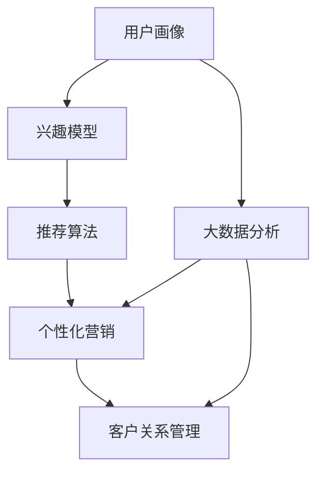

                 

# 信息差的商业营销个性化革命：大数据如何实现营销个性化

## 1. 背景介绍

在当今信息爆炸的时代，如何有效地将正确的信息传递给正确的人群，成为了营销人员关注的重点。传统的营销手段，如电视、报纸、广播等媒介，已经无法满足个性化和精准化的要求。而基于大数据的营销个性化，则能实现这一目标。

### 1.1 问题由来
传统营销模式，主要通过大规模广播广告来达到品牌曝光的目的。这种模式的问题在于，信息传递的“泛化性”过大，无法精准地锁定目标人群。而大数据分析技术的崛起，让营销人员可以基于用户的历史行为数据，构建个性化的营销策略。

### 1.2 问题核心关键点
个性化营销的核心在于如何利用大数据，精准地定位目标用户，并提供匹配其需求和兴趣的产品或服务。其中，用户画像构建、兴趣模型训练、推荐算法应用等技术是实现个性化营销的关键。

## 2. 核心概念与联系

### 2.1 核心概念概述

为了更好地理解个性化营销背后的技术原理，本节将介绍几个核心概念及其相互之间的联系：

- **用户画像(User Profile)**：通过分析用户的各类数据（如浏览历史、购买记录、社交行为等），构建用户特征的集合，形成用户的行为和兴趣模型。

- **兴趣模型(Interest Model)**：基于用户画像，构建用户对于特定产品或服务的兴趣程度，量化表达用户的兴趣点，用于后续推荐和个性化营销。

- **推荐算法(Recommendation Algorithm)**：根据用户画像和兴趣模型，匹配用户与产品的相关性，预测用户可能感兴趣的商品，从而实现个性化推荐。

- **大数据分析(Big Data Analysis)**：通过收集、存储、处理海量数据，从中提取有价值的信息，用于驱动个性化营销策略的制定和执行。

- **客户关系管理(CRM)**：整合用户数据，进行系统化管理和分析，提升客户体验，构建长期稳定的客户关系。

这些概念之间的逻辑关系可以通过以下Mermaid流程图来展示：



这个流程图展示了个性化营销的核心流程：

1. 基于用户数据构建用户画像。
2. 通过兴趣模型量化用户兴趣。
3. 应用推荐算法进行个性化推荐。
4. 利用大数据分析提升推荐效果。
5. 在CRM系统中进行整合管理和应用。

## 3. 核心算法原理 & 具体操作步骤
### 3.1 算法原理概述

个性化营销的算法原理基于信息检索和推荐系统，其核心思想是：根据用户的历史行为数据，构建用户画像，并通过兴趣模型量化用户的兴趣程度。在此基础上，推荐算法根据用户画像和兴趣模型，预测用户可能感兴趣的商品，从而实现个性化推荐。

具体来说，个性化推荐可以分为以下几个步骤：

1. 数据收集：收集用户的历史行为数据，如浏览历史、购买记录、点击率等。
2. 用户画像构建：通过数据挖掘和机器学习，构建用户画像，形成用户特征的集合。
3. 兴趣模型训练：基于用户画像，训练用户对于特定产品或服务的兴趣程度，量化表达用户的兴趣点。
4. 推荐算法应用：根据用户画像和兴趣模型，匹配用户与产品的相关性，预测用户可能感兴趣的商品。

### 3.2 算法步骤详解

以下是具体的算法步骤和详细步骤：

#### 3.2.1 数据收集

**Step 1: 收集用户数据**
用户数据主要包括以下几类：
- **行为数据**：如浏览记录、点击率、购买记录等。
- **社交数据**：如社交媒体互动、评论、分享等。
- **个人信息**：如年龄、性别、职业、地域等。

这些数据可以通过网站、APP、社交网络等渠道进行收集。

**Step 2: 数据清洗与预处理**
- 去除不完整、无用的数据，保证数据的完整性和准确性。
- 对文本数据进行分词、去停用词等预处理操作。
- 对数值型数据进行归一化和标准化处理，保证不同特征的尺度一致。

#### 3.2.2 用户画像构建

**Step 3: 特征工程**
通过特征选择和特征提取，构建用户画像。常见的特征包括：
- **基本信息特征**：年龄、性别、地域等。
- **行为特征**：浏览时长、点击率、购买频率等。
- **兴趣特征**：浏览过的商品、喜欢的品牌等。

**Step 4: 建模与训练**
- 选择适合的机器学习算法，如逻辑回归、决策树、随机森林等，构建用户画像模型。
- 使用历史数据进行训练，不断优化模型参数，提升模型的准确性和泛化能力。

#### 3.2.3 兴趣模型训练

**Step 5: 兴趣度量**
- 将用户画像特征向量作为输入，训练模型预测用户对于某个商品或服务的兴趣程度。
- 常见的兴趣度量方法包括协同过滤、矩阵分解等。

**Step 6: 模型评估与优化**
- 使用交叉验证等方法评估模型的性能，如AUC、准确率、召回率等。
- 根据评估结果，优化模型参数，提升模型的预测能力。

#### 3.2.4 推荐算法应用

**Step 7: 推荐计算**
- 根据用户画像和兴趣模型，计算用户与商品的相似度，预测用户可能感兴趣的商品。
- 常见的推荐算法包括基于内容的推荐、协同过滤推荐、基于深度学习的推荐等。

**Step 8: 结果排序**
- 对推荐结果进行排序，优先展示用户最可能感兴趣的商品。
- 排序方法包括基于点击率的排序、基于用户兴趣度的排序等。

### 3.3 算法优缺点

个性化推荐算法具有以下优点：
1. **精准推荐**：通过分析用户历史行为，实现精准的个性化推荐。
2. **提升用户体验**：根据用户的个性化需求，推荐更合适的商品，提升用户的购物体验。
3. **提升销售额**：通过精准推荐，提高用户的转化率和购买率，提升整体销售额。

然而，个性化推荐算法也存在一些缺点：
1. **数据隐私**：收集和分析用户数据可能引发隐私问题，需要严格遵守数据隐私法规。
2. **数据质量**：数据质量不高或数据不完整，会影响推荐算法的准确性。
3. **过拟合风险**：如果数据集规模较小，推荐算法可能存在过拟合风险，影响泛化能力。
4. **用户依赖**：过度依赖推荐结果，可能导致用户自主探索性降低，降低多样性。

### 3.4 算法应用领域

个性化推荐算法已经在多个领域得到了广泛应用，例如：

- **电商**：电商平台如亚马逊、京东、淘宝等，通过个性化推荐算法，提升用户购物体验和转化率。
- **内容推荐**：视频网站如Netflix、YouTube等，通过个性化推荐算法，推荐用户可能感兴趣的视频内容。
- **社交网络**：社交网络如Facebook、Twitter等，通过个性化推荐算法，推荐用户可能感兴趣的内容和好友。
- **在线广告**：通过个性化推荐算法，将广告精准投放给目标用户，提升广告效果和用户满意度。
- **旅游推荐**：旅游平台如携程、去哪儿等，通过个性化推荐算法，推荐用户可能感兴趣的目的地和旅游方案。

此外，个性化推荐算法还被应用于更多领域，如医疗健康、金融理财等，帮助机构提升服务质量和用户体验。

## 4. 数学模型和公式 & 详细讲解 & 举例说明

### 4.1 数学模型构建

个性化推荐算法的核心是构建用户画像、兴趣模型，并应用推荐算法。下面我们将详细讲解这些模型的数学构建过程。

**用户画像模型**
假设用户画像特征向量为 $x \in \mathbb{R}^n$，模型参数为 $w \in \mathbb{R}^n$，则用户画像模型可以表示为：

$$
\hat{y} = g(w^T x)
$$

其中，$g$ 为激活函数，$w$ 为模型权重，$x$ 为输入特征向量，$\hat{y}$ 为模型预测值。

**兴趣模型**
假设用户对于商品 $i$ 的兴趣度为 $r_i$，则兴趣模型可以表示为：

$$
r_i = f(y_i, y_j)
$$

其中，$y_i$ 和 $y_j$ 分别为用户画像和商品的特征向量，$f$ 为兴趣函数，用于计算用户对商品 $i$ 的兴趣度。

**推荐算法**
假设用户对于商品 $i$ 的预测评分（即兴趣度）为 $p_i$，则推荐算法可以表示为：

$$
p_i = \alpha r_i + \beta \sum_{j \in \mathcal{N}} r_j
$$

其中，$\alpha$ 为权重，用于调节用户画像和协同过滤的权重，$\beta$ 为权重，用于调节协同过滤的权重，$\mathcal{N}$ 为用户的邻居集合，$r_j$ 为用户 $j$ 对商品 $i$ 的兴趣度。

### 4.2 公式推导过程

以下是上述数学模型的详细推导过程：

**用户画像模型推导**
假设用户画像特征向量 $x$ 为 $[n_1, n_2, ..., n_n]$，模型参数 $w$ 为 $[m_1, m_2, ..., m_n]$，则用户画像模型可以表示为：

$$
\hat{y} = w^T x = \sum_{k=1}^n w_k x_k
$$

其中，$w_k$ 和 $x_k$ 分别为第 $k$ 个特征的权重和值。

**兴趣模型推导**
假设用户对于商品 $i$ 的兴趣度为 $r_i$，则兴趣模型可以表示为：

$$
r_i = f(y_i, y_j) = f(w_i^T x_i, w_j^T x_j)
$$

其中，$w_i$ 和 $w_j$ 分别为商品 $i$ 和用户 $j$ 的特征向量，$x_i$ 和 $x_j$ 分别为用户画像和商品的特征向量，$f$ 为兴趣函数。

**推荐算法推导**
假设用户对于商品 $i$ 的预测评分 $p_i$ 为 $p_i = (w^T x_i) + (\sum_{j \in \mathcal{N}} (w^T x_j))$，则推荐算法可以表示为：

$$
p_i = \alpha (w^T x_i) + \beta (\sum_{j \in \mathcal{N}} (w^T x_j))
$$

其中，$\alpha$ 和 $\beta$ 分别为调节因子，$\mathcal{N}$ 为用户的邻居集合，$r_j$ 为用户 $j$ 对商品 $i$ 的兴趣度。

### 4.3 案例分析与讲解

为了更好地理解这些模型和算法，下面通过一个实际案例进行分析：

**案例背景**
某电商平台收集了用户的历史浏览记录和购买记录，希望通过个性化推荐算法，提升用户购物体验和销售额。

**数据准备**
- 收集用户的历史浏览记录和购买记录。
- 对数据进行清洗和预处理，去除无效数据和噪声。
- 对数据进行特征工程，构建用户画像。

**用户画像建模**
- 选择逻辑回归模型，构建用户画像模型。
- 使用历史数据进行训练，不断优化模型参数。

**兴趣模型建模**
- 选择协同过滤算法，构建用户对于商品的兴趣模型。
- 使用用户画像和商品特征向量，计算用户对于商品 $i$ 的兴趣度 $r_i$。

**推荐算法应用**
- 根据用户画像和兴趣模型，计算用户对于商品 $i$ 的预测评分 $p_i$。
- 使用排序算法，对推荐结果进行排序，优先展示用户最可能感兴趣的商品。

## 5. 项目实践：代码实例和详细解释说明

### 5.1 开发环境搭建

在进行个性化推荐系统的开发之前，需要准备好开发环境。以下是使用Python进行PyTorch开发的环境配置流程：

1. 安装Anaconda：从官网下载并安装Anaconda，用于创建独立的Python环境。

2. 创建并激活虚拟环境：
```bash
conda create -n pytorch-env python=3.8 
conda activate pytorch-env
```

3. 安装PyTorch：根据CUDA版本，从官网获取对应的安装命令。例如：
```bash
conda install pytorch torchvision torchaudio cudatoolkit=11.1 -c pytorch -c conda-forge
```

4. 安装TensorFlow：
```bash
pip install tensorflow==2.3.0
```

5. 安装TensorBoard：
```bash
pip install tensorboard
```

6. 安装Scikit-learn：
```bash
pip install scikit-learn
```

完成上述步骤后，即可在`pytorch-env`环境中开始开发。

### 5.2 源代码详细实现

我们以电商推荐系统为例，给出使用PyTorch进行个性化推荐系统的开发代码实现。

```python
import torch
from torch import nn
from torch.nn import functional as F

class UserEmbedding(nn.Module):
    def __init__(self, embed_size, num_users):
        super(UserEmbedding, self).__init__()
        self.embedding = nn.Embedding(num_users, embed_size)
    
    def forward(self, user_ids):
        return self.embedding(user_ids)

class ItemEmbedding(nn.Module):
    def __init__(self, embed_size, num_items):
        super(ItemEmbedding, self).__init__()
        self.embedding = nn.Embedding(num_items, embed_size)
    
    def forward(self, item_ids):
        return self.embedding(item_ids)

class PairwiseModel(nn.Module):
    def __init__(self, embed_size):
        super(PairwiseModel, self).__init__()
        self.linear1 = nn.Linear(embed_size * 2, 128)
        self.linear2 = nn.Linear(128, 1)
    
    def forward(self, u, i):
        cat = torch.cat([u, i], dim=1)
        x = self.linear1(cat)
        x = F.relu(x)
        x = self.linear2(x)
        return x

class RecommendationSystem(nn.Module):
    def __init__(self, embed_size, num_users, num_items):
        super(RecommendationSystem, self).__init__()
        self.user_embedding = UserEmbedding(embed_size, num_users)
        self.item_embedding = ItemEmbedding(embed_size, num_items)
        self.pairwise_model = PairwiseModel(embed_size)
    
    def forward(self, user_ids, item_ids):
        u = self.user_embedding(user_ids)
        i = self.item_embedding(item_ids)
        s = self.pairwise_model(u, i)
        return s

# 定义数据集
num_users = 1000
num_items = 1000

# 生成随机数据
user_ids = torch.randint(0, num_users, (100,)).to(torch.long)
item_ids = torch.randint(0, num_items, (100,)).to(torch.long)

# 构建模型
model = RecommendationSystem(embed_size=128, num_users=num_users, num_items=num_items)

# 定义损失函数和优化器
criterion = nn.BCEWithLogitsLoss()
optimizer = torch.optim.Adam(model.parameters(), lr=0.01)

# 训练模型
num_epochs = 10
for epoch in range(num_epochs):
    optimizer.zero_grad()
    s = model(user_ids, item_ids)
    loss = criterion(s, torch.rand_like(s))
    loss.backward()
    optimizer.step()

    if (epoch + 1) % 1 == 0:
        print(f"Epoch {epoch+1}, loss: {loss.item()}")

# 测试模型
test_user_ids = torch.randint(0, num_users, (10,)).to(torch.long)
test_item_ids = torch.randint(0, num_items, (10,)).to(torch.long)
test_s = model(test_user_ids, test_item_ids)
print(test_s)
```

### 5.3 代码解读与分析

我们接下来详细解读一下关键代码的实现细节：

**UserEmbedding类**
- 定义用户嵌入层，用于将用户ID映射为高维向量。

**ItemEmbedding类**
- 定义商品嵌入层，用于将商品ID映射为高维向量。

**PairwiseModel类**
- 定义双线性模型，用于计算用户和商品之间的相似度。

**RecommendationSystem类**
- 定义推荐系统模型，包含用户嵌入层、商品嵌入层和双线性模型。

**训练模型**
- 定义损失函数和优化器，进行模型训练。

**测试模型**
- 使用测试集进行模型测试，并输出预测结果。

## 6. 实际应用场景

### 6.1 智能客服系统

个性化推荐算法可以应用于智能客服系统的构建。智能客服系统通过分析用户的历史行为数据，构建用户画像，根据用户画像进行个性化推荐，推荐合适的商品和解决方案，提升用户的满意度。

在技术实现上，可以收集用户的历史咨询记录，将用户的问题和解答构建成监督数据，在此基础上对预训练模型进行微调。微调后的模型能够自动理解用户的问题，并根据用户的历史行为推荐相关解答。对于用户提出的新问题，还可以接入检索系统实时搜索相关内容，动态组织生成回答。

### 6.2 个性化广告推荐

个性化推荐算法可以应用于在线广告推荐。通过分析用户的浏览记录和点击行为，构建用户画像，根据用户画像进行个性化广告推荐，提高广告的点击率和转化率。

在技术实现上，可以收集用户的浏览记录和点击记录，构建用户画像，并应用个性化推荐算法进行广告推荐。推荐算法可以根据用户的兴趣和行为特征，推荐最合适的广告内容，提高广告的点击率和转化率。

### 6.3 内容推荐系统

个性化推荐算法可以应用于内容推荐系统。通过分析用户的观看记录和互动行为，构建用户画像，根据用户画像进行个性化内容推荐，提升用户的使用体验和粘性。

在技术实现上，可以收集用户的观看记录和互动记录，构建用户画像，并应用个性化推荐算法进行内容推荐。推荐算法可以根据用户的兴趣和行为特征，推荐最合适的内容，提升用户的使用体验和粘性。

### 6.4 未来应用展望

随着个性化推荐算法的发展，其在更多领域的应用前景将更加广阔。

在智慧医疗领域，通过分析患者的病历和诊疗记录，构建患者画像，根据患者画像进行个性化推荐，推荐合适的治疗方案和药品，提升诊疗效果和患者满意度。

在智能教育领域，通过分析学生的学习行为和成绩，构建学生画像，根据学生画像进行个性化推荐，推荐适合的学习资源和辅导方案，提升学生的学习效果和满意度。

在智慧城市治理中，通过分析市民的出行和消费行为，构建市民画像，根据市民画像进行个性化推荐，推荐合适的城市服务和活动，提升市民的幸福感和生活质量。

此外，在企业生产、社会治理、文娱传媒等众多领域，个性化推荐算法也将不断涌现，为各行各业带来新的变革和机遇。

## 7. 工具和资源推荐

### 7.1 学习资源推荐

为了帮助开发者系统掌握个性化推荐算法的基本原理和实现技巧，这里推荐一些优质的学习资源：

1. **Coursera《Recommender Systems》课程**：由斯坦福大学开设的推荐系统课程，系统讲解了推荐系统的基本概念和算法，适合初学者入门。
2. **Kaggle竞赛**：参与Kaggle上的推荐系统竞赛，通过实战项目积累经验，提升技术能力。
3. **Recommender Systems: Algorithms, Specialization》课程**：由密歇根大学开设的推荐系统课程，系统讲解了推荐系统的经典算法和最新研究。
4. **Recommender Systems: Recommender Systems in Action》书籍**：介绍了推荐系统的经典算法和实际应用，适合深入学习。
5. **《Python推荐系统》书籍**：介绍了推荐系统的经典算法和实际应用，适合深入学习。

通过对这些资源的学习实践，相信你一定能够快速掌握个性化推荐算法的基本原理和实现技巧，并用于解决实际的推荐问题。

### 7.2 开发工具推荐

高效的开发离不开优秀的工具支持。以下是几款用于个性化推荐系统开发的常用工具：

1. **TensorFlow**：由Google主导开发的深度学习框架，生产部署方便，适合大规模工程应用。
2. **PyTorch**：基于Python的开源深度学习框架，灵活动态的计算图，适合快速迭代研究。
3. **scikit-learn**：基于Python的机器学习库，提供了丰富的算法和工具，适合快速原型开发。
4. **TensorBoard**：TensorFlow配套的可视化工具，可实时监测模型训练状态，并提供丰富的图表呈现方式。
5. **Scikit-learn**：基于Python的机器学习库，提供了丰富的算法和工具，适合快速原型开发。
6. **Jupyter Notebook**：免费在线的Jupyter Notebook环境，方便快速编写和分享代码。

合理利用这些工具，可以显著提升个性化推荐系统的开发效率，加快创新迭代的步伐。

### 7.3 相关论文推荐

个性化推荐算法的快速发展离不开学界的持续研究。以下是几篇奠基性的相关论文，推荐阅读：

1. **《Recommender Systems》**：介绍了推荐系统的基本原理和算法，适合初学者入门。
2. **《The BellKor 2010 Netflix Prize》**：介绍了Netflix Prize竞赛，详细介绍了各种推荐算法及其性能。
3. **《Matrix Factorization Techniques for Recommender Systems》**：介绍了矩阵分解技术，用于推荐系统的构建。
4. **《Deep Rank: A Framework for Stable and Scalable Recommendation Learning》**：介绍了深度学习在推荐系统中的应用，提升了推荐系统的精度和稳定性。
5. **《Adaptive Recommender System Based on Cross-Modal Feature Learning》**：介绍了跨模态特征学习技术，提升了推荐系统的泛化能力和精度。

这些论文代表了大数据个性化推荐技术的最新进展。通过学习这些前沿成果，可以帮助研究者把握学科前进方向，激发更多的创新灵感。

## 8. 总结：未来发展趋势与挑战

### 8.1 总结

本文对基于大数据的个性化推荐算法进行了全面系统的介绍。首先阐述了个性化推荐算法的背景和重要性，明确了个性化推荐在提升用户体验和增加销售额方面的独特价值。其次，从原理到实践，详细讲解了推荐算法的核心步骤和关键技术，给出了推荐任务开发的完整代码实例。同时，本文还广泛探讨了个性化推荐算法在多个行业领域的应用前景，展示了其巨大的市场潜力。

通过本文的系统梳理，可以看到，个性化推荐算法已经成为商业营销的重要工具，极大地拓展了商业模式的边界，推动了商业智能的发展。未来，伴随算法和数据的进一步发展，个性化推荐算法必将在更多领域发挥更大的作用，带来更深远的影响。

### 8.2 未来发展趋势

展望未来，个性化推荐算法将呈现以下几个发展趋势：

1. **深度学习的应用**：深度学习在个性化推荐中的作用将越来越重要，通过更深层次的网络结构和更多数据，提升推荐系统的精度和稳定性。
2. **多模态数据融合**：未来的推荐系统将更多地融合多模态数据，如文本、图像、音频等，提升推荐系统的多样性和鲁棒性。
3. **实时推荐系统**：未来的推荐系统将更加注重实时性，通过实时分析用户行为数据，动态调整推荐策略，提升用户满意度。
4. **个性化推荐系统的集成**：未来的推荐系统将更多地与CRM、大数据分析等系统进行集成，提升系统性能和应用价值。
5. **智能推荐系统的普及**：未来的推荐系统将更加普及，成为各行各业的标配，提升用户的体验和满意度。

这些趋势凸显了个性化推荐算法的广阔前景。这些方向的探索发展，必将进一步提升推荐系统的性能和应用范围，为商业智能带来更大的价值。

### 8.3 面临的挑战

尽管个性化推荐算法已经取得了瞩目成就，但在迈向更加智能化、普适化应用的过程中，它仍面临着诸多挑战：

1. **数据隐私**：收集和分析用户数据可能引发隐私问题，需要严格遵守数据隐私法规。
2. **数据质量**：数据质量不高或数据不完整，会影响推荐算法的准确性。
3. **过拟合风险**：如果数据集规模较小，推荐算法可能存在过拟合风险，影响泛化能力。
4. **用户依赖**：过度依赖推荐结果，可能导致用户自主探索性降低，降低多样性。
5. **冷启动问题**：新用户或新商品的推荐初期，可能存在冷启动问题，推荐效果不佳。

正视推荐算法面临的这些挑战，积极应对并寻求突破，将是个性化推荐走向成熟的必由之路。相信随着学界和产业界的共同努力，这些挑战终将一一被克服，个性化推荐算法必将在构建人机协同的智能时代中扮演越来越重要的角色。

### 8.4 未来突破

面对个性化推荐算法所面临的种种挑战，未来的研究需要在以下几个方面寻求新的突破：

1. **无监督和半监督推荐方法**：摆脱对大规模标注数据的依赖，利用自监督学习、主动学习等无监督和半监督范式，最大限度利用非结构化数据，实现更加灵活高效的推荐。
2. **推荐算法的集成和优化**：通过集成多种推荐算法，提升推荐系统的性能和鲁棒性。同时优化推荐算法的参数和结构，提升算法的可解释性和泛化能力。
3. **多模态数据的融合**：将符号化的先验知识，如知识图谱、逻辑规则等，与神经网络模型进行巧妙融合，引导推荐过程学习更准确、合理的推荐结果。
4. **因果分析与模型优化**：将因果分析方法引入推荐模型，识别出模型决策的关键特征，增强推荐系统的可解释性和鲁棒性。
5. **数据隐私保护**：通过差分隐私等技术，保护用户数据隐私，同时提升推荐系统的性能和鲁棒性。

这些研究方向的探索，必将引领个性化推荐算法技术迈向更高的台阶，为构建安全、可靠、可解释、可控的智能推荐系统铺平道路。面向未来，个性化推荐算法还需要与其他人工智能技术进行更深入的融合，如知识表示、因果推理、强化学习等，多路径协同发力，共同推动推荐系统的进步。只有勇于创新、敢于突破，才能不断拓展推荐算法的边界，让智能技术更好地服务于人类社会。

## 9. 附录：常见问题与解答

**Q1: 个性化推荐算法是否适用于所有用户画像场景？**

A: 个性化推荐算法在大多数场景下都能取得不错的效果，特别是对于数据量较大的场景。但对于一些特定领域的用户画像，如金融、医疗等，可能需要更复杂的模型进行微调，才能取得更好的效果。

**Q2: 在个性化推荐过程中如何避免推荐结果的冷启动问题？**

A: 可以通过多模态数据融合、上下文感知推荐等技术，解决冷启动问题。同时，在初期推荐时，可以加入流行度、热度等客观因素，提高推荐的覆盖率和多样性。

**Q3: 如何评价个性化推荐算法的性能？**

A: 可以使用多种指标来评价个性化推荐算法的性能，如精确率、召回率、F1值、AUC、用户满意度等。同时，可以通过A/B测试等方法，评估推荐算法对用户行为的影响。

**Q4: 在个性化推荐过程中如何保护用户隐私？**

A: 可以通过差分隐私等技术，保护用户数据隐私。同时，在数据收集和分析过程中，需要严格遵守数据隐私法规，保护用户数据安全。

**Q5: 如何提高个性化推荐系统的可解释性？**

A: 可以通过特征可视化、模型解释器等技术，提高推荐系统的可解释性。同时，在推荐过程中，可以引入人工干预和审核，确保推荐结果符合人类价值观和伦理道德。

这些问题的解答，帮助开发者更好地理解个性化推荐算法的核心原理和应用技巧，同时，也提醒我们在实际应用中需要注意的问题和挑战。希望本文能为你在个性化推荐系统开发和优化过程中提供有价值的参考。

---

作者：禅与计算机程序设计艺术 / Zen and the Art of Computer Programming

